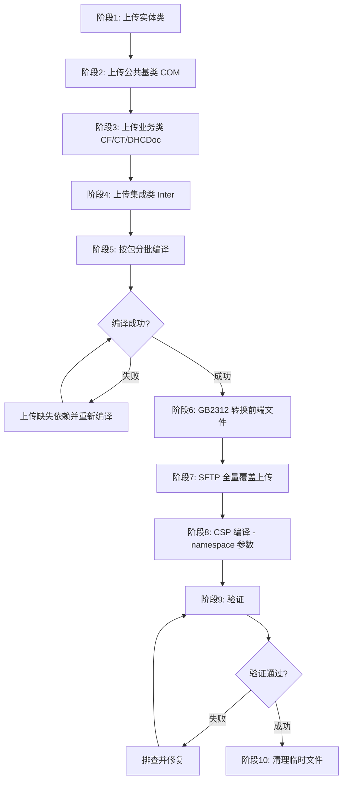

# 部署计划：dental-ws 前后端文件到 159 服务器

> 部署工具: `iris-agentic-dev` MCP（后端编译）+ `sftp-server` MCP（前端上传）

---

## 用户确认的调整

1. **Storage Default 不去掉**，直接上传编译（如遇 #5559 再剥离）
2. **按包分批编译**（CF→CT→DOC→COM→DHCDoc.CF→DHCDoc.CT→DHCDoc核心→Inter）
3. **前端包含** `frontend/scripts/dhcdoc/dental/tools/printcom.js`
4. **全量覆盖**

## 部署环境

| 项目 | 值 |
|------|-----|
| 目标服务器 | 172.18.18.159 |
| Namespace | DHC-APP |
| Web 根 | /dthealth/app/dthis/web/ |
| CSP 虚拟根 | imedical/web/csp |
| 后端 MCP | iris-agentic-dev |
| 前端 MCP | sftp-server |
| 编码策略 | 本地 UTF-8 → 上传 GB2312 |

---

## 部署顺序总览

---

## 阶段1: 上传实体类（14 个）

> 实体类是数据表映射类，无业务逻辑依赖，需最先部署

| 包 | 文件路径 | 类名 |
|----|----------|------|
| CF | `CF/DOC/Dental/TA/DictLevel.cls` | `CF.DOC.Dental.TA.DictLevel` |
| CT | `CT/DOC/Dental/TA/DictCtlg.cls` | `CT.DOC.Dental.TA.DictCtlg` |
| CT | `CT/DOC/Dental/TA/Dictionary.cls` | `CT.DOC.Dental.TA.Dictionary` |
| CT | `CT/DOC/Dental/TA/Material.cls` | `CT.DOC.Dental.TA.Material` |
| DOC | `DOC/Dental/TA/Application.cls` | `DOC.Dental.TA.Application` |
| DOC | `DOC/Dental/TA/ApplAttachment.cls` | `DOC.Dental.TA.ApplAttachment` |
| DOC | `DOC/Dental/TA/ApplLab.cls` | `DOC.Dental.TA.ApplLab` |
| DOC | `DOC/Dental/TA/ApplLinkMaterial.cls` | `DOC.Dental.TA.ApplLinkMaterial` |
| DOC | `DOC/Dental/TA/ApplProduct.cls` | `DOC.Dental.TA.ApplProduct` |
| DOC | `DOC/Dental/TA/ApplRequire.cls` | `DOC.Dental.TA.ApplRequire` |
| DOC | `DOC/Dental/TA/ApplRework.cls` | `DOC.Dental.TA.ApplRework` |
| DOC | `DOC/Dental/TA/ApplStatus.cls` | `DOC.Dental.TA.ApplStatus` |
| DOC | `DOC/Dental/TA/ApplTechRating.cls` | `DOC.Dental.TA.ApplTechRating` |
| DOC | `DOC/Dental/TA/ApplToothColor.cls` | `DOC.Dental.TA.ApplToothColor` |

---

## 阶段2: 上传公共基类 COM（3 个）

> Super 是所有 TA 业务类的父类，必须先于业务类部署

| 文件路径 | 类名 |
|----------|------|
| `DHCDoc/Dental/TA/COM/Super.cls` | `DHCDoc.Dental.TA.COM.Super` |
| `DHCDoc/Dental/TA/COM/ClearData.cls` | `DHCDoc.Dental.TA.COM.ClearData` |
| `DHCDoc/Dental/TA/COM/Util.cls` | `DHCDoc.Dental.TA.COM.Util` |

---

## 阶段3: 上传业务类（40 个）

> 三层架构依赖: SQL → DATA → BLH

### CF 层（3 个）

| 文件路径 | 类名 | 层级 |
|----------|------|------|
| `DHCDoc/Dental/TA/CF/DictLevelSql.cls` | `DHCDoc.Dental.TA.CF.DictLevelSql` | SQL |
| `DHCDoc/Dental/TA/CF/DictLevelData.cls` | `DHCDoc.Dental.TA.CF.DictLevelData` | DATA |
| `DHCDoc/Dental/TA/CF/DictLevelBlh.cls` | `DHCDoc.Dental.TA.CF.DictLevelBlh` | BLH |

### CT 层（9 个）

| 文件路径 | 类名 | 层级 |
|----------|------|------|
| `DHCDoc/Dental/TA/CT/DictCtlgSql.cls` | `DHCDoc.Dental.TA.CT.DictCtlgSql` | SQL |
| `DHCDoc/Dental/TA/CT/DictCtlgData.cls` | `DHCDoc.Dental.TA.CT.DictCtlgData` | DATA |
| `DHCDoc/Dental/TA/CT/DictCtlgBlh.cls` | `DHCDoc.Dental.TA.CT.DictCtlgBlh` | BLH |
| `DHCDoc/Dental/TA/CT/DictionarySql.cls` | `DHCDoc.Dental.TA.CT.DictionarySql` | SQL |
| `DHCDoc/Dental/TA/CT/DictionaryData.cls` | `DHCDoc.Dental.TA.CT.DictionaryData` | DATA |
| `DHCDoc/Dental/TA/CT/DictionaryBlh.cls` | `DHCDoc.Dental.TA.CT.DictionaryBlh` | BLH |
| `DHCDoc/Dental/TA/CT/MaterialSQL.cls` | `DHCDoc.Dental.TA.CT.MaterialSQL` | SQL |
| `DHCDoc/Dental/TA/CT/MaterialDATA.cls` | `DHCDoc.Dental.TA.CT.MaterialDATA` | DATA |
| `DHCDoc/Dental/TA/CT/MaterialBLH.cls` | `DHCDoc.Dental.TA.CT.MaterialBLH` | BLH |

### DHCDoc 核心业务（28 个）

| 文件路径 | 类名 | 层级 |
|----------|------|------|
| `DHCDoc/Dental/TA/ApplicationSql.cls` | `DHCDoc.Dental.TA.ApplicationSql` | SQL |
| `DHCDoc/Dental/TA/ApplicationData.cls` | `DHCDoc.Dental.TA.ApplicationData` | DATA |
| `DHCDoc/Dental/TA/ApplicationBlh.cls` | `DHCDoc.Dental.TA.ApplicationBlh` | BLH |
| `DHCDoc/Dental/TA/ApplAttachmentSql.cls` | `DHCDoc.Dental.TA.ApplAttachmentSql` | SQL |
| `DHCDoc/Dental/TA/ApplAttachmentData.cls` | `DHCDoc.Dental.TA.ApplAttachmentData` | DATA |
| `DHCDoc/Dental/TA/ApplFileBLH.cls` | `DHCDoc.Dental.TA.ApplFileBLH` | BLH |
| `DHCDoc/Dental/TA/ApplLabSQL.cls` | `DHCDoc.Dental.TA.ApplLabSQL` | SQL |
| `DHCDoc/Dental/TA/ApplLabDATA.cls` | `DHCDoc.Dental.TA.ApplLabDATA` | DATA |
| `DHCDoc/Dental/TA/ApplLabBLH.cls` | `DHCDoc.Dental.TA.ApplLabBLH` | BLH |
| `DHCDoc/Dental/TA/ApplLinkMaterialSQL.cls` | `DHCDoc.Dental.TA.ApplLinkMaterialSQL` | SQL |
| `DHCDoc/Dental/TA/ApplLinkMaterialDATA.cls` | `DHCDoc.Dental.TA.ApplLinkMaterialDATA` | DATA |
| `DHCDoc/Dental/TA/ApplLinkMaterialBLH.cls` | `DHCDoc.Dental.TA.ApplLinkMaterialBLH` | BLH |
| `DHCDoc/Dental/TA/ApplProductSql.cls` | `DHCDoc.Dental.TA.ApplProductSql` | SQL |
| `DHCDoc/Dental/TA/ApplProductData.cls` | `DHCDoc.Dental.TA.ApplProductData` | DATA |
| `DHCDoc/Dental/TA/ApplRequireSql.cls` | `DHCDoc.Dental.TA.ApplRequireSql` | SQL |
| `DHCDoc/Dental/TA/ApplRequireData.cls` | `DHCDoc.Dental.TA.ApplRequireData` | DATA |
| `DHCDoc/Dental/TA/ApplReworkSQL.cls` | `DHCDoc.Dental.TA.ApplReworkSQL` | SQL |
| `DHCDoc/Dental/TA/ApplReworkDATA.cls` | `DHCDoc.Dental.TA.ApplReworkDATA` | DATA |
| `DHCDoc/Dental/TA/ApplReworkBLH.cls` | `DHCDoc.Dental.TA.ApplReworkBLH` | BLH |
| `DHCDoc/Dental/TA/ApplStatusSql.cls` | `DHCDoc.Dental.TA.ApplStatusSql` | SQL |
| `DHCDoc/Dental/TA/ApplStatusData.cls` | `DHCDoc.Dental.TA.ApplStatusData` | DATA |
| `DHCDoc/Dental/TA/ApplStatsReportBLH.cls` | `DHCDoc.Dental.TA.ApplStatsReportBLH` | BLH |
| `DHCDoc/Dental/TA/ApplTechRatingSQL.cls` | `DHCDoc.Dental.TA.ApplTechRatingSQL` | SQL |
| `DHCDoc/Dental/TA/ApplTechRatingDATA.cls` | `DHCDoc.Dental.TA.ApplTechRatingDATA` | DATA |
| `DHCDoc/Dental/TA/ApplTechRatingBLH.cls` | `DHCDoc.Dental.TA.ApplTechRatingBLH` | BLH |
| `DHCDoc/Dental/TA/ApplToothColorSql.cls` | `DHCDoc.Dental.TA.ApplToothColorSql` | SQL |
| `DHCDoc/Dental/TA/ApplToothColorData.cls` | `DHCDoc.Dental.TA.ApplToothColorData` | DATA |
| `DHCDoc/Dental/TA/ApplPrintBLH.cls` | `DHCDoc.Dental.TA.ApplPrintBLH` | BLH |
| `DHCDoc/Dental/TA/MainworkBLH.cls` | `DHCDoc.Dental.TA.MainworkBLH` | BLH |
| `DHCDoc/Dental/TA/WorkstationBlh.cls` | `DHCDoc.Dental.TA.WorkstationBlh` | BLH |

---

## 阶段4: 上传集成类 Inter（2 个）

| 文件路径 | 类名 |
|----------|------|
| `DHCDoc/Dental/TA/Inter/Invoke.cls` | `DHCDoc.Dental.TA.Inter.Invoke` |
| `DHCDoc/Dental/TA/Inter/PAInvoke.cls` | `DHCDoc.Dental.TA.Inter.PAInvoke` |

---

## 阶段5: 按包分批编译

- **工具**: `iris_compile`
- **编译顺序**:
  1. CF 实体: `CF.DOC.Dental.TA.*`
  2. CT 实体: `CT.DOC.Dental.TA.*`
  3. DOC 实体: `DOC.Dental.TA.*`
  4. COM 基类: `DHCDoc.Dental.TA.COM.*`
  5. CF 业务: `DHCDoc.Dental.TA.CF.*`
  6. CT 业务: `DHCDoc.Dental.TA.CT.*`
  7. DHCDoc 核心: `DHCDoc.Dental.TA.*`（排除 COM/CF/CT/Inter 子包）
  8. Inter 集成: `DHCDoc.Dental.TA.Inter.*`

---

## 阶段6: 前端 GB2312 转换

- **工具**: `.agents/scripts/convert-gb2312-upload.ps1`
- **范围**: CSP + JS + CSS 文本文件（图片无需转换）
- **注意**: 如果前端文件已是 GB2312，跳过此阶段

---

## 阶段7: 前端 SFTP 全量覆盖上传

- **工具**: sftp-server `sync_directory` 或 `upload_file`
- **范围**: `frontend/csp/` + `frontend/scripts/`
- **远端路径映射**:
  - CSP: `frontend/csp/xxx.csp` → `/dthealth/app/dthis/web/csp/xxx.csp`
  - JS: `frontend/scripts/dhcdoc/dental/xxx.js` → `/dthealth/app/dthis/web/scripts/dhcdoc/dental/xxx.js`
  - CSS: `frontend/scripts/dhcdoc/dental/css/common.css` → `/dthealth/app/dthis/web/scripts/dhcdoc/dental/css/common.css`
  - 图片: `frontend/scripts/dhcdoc/dental/img/*` → `/dthealth/app/dthis/web/scripts/dhcdoc/dental/img/*`
  - 工具: `frontend/scripts/dhcdoc/dental/tools/printcom.js` → `/dthealth/app/dthis/web/scripts/dhcdoc/dental/tools/printcom.js`
- **图片文件直接上传原始文件，无需编码转换**

### 前端文件清单

**JS 脚本（25 个）** — `frontend/scripts/dhcdoc/dental/` 下:

| 序号 | 文件 |
|------|------|
| 1 | ta.admquery.js |
| 2 | ta.apply.comp.attachment.js |
| 3 | ta.apply.comp.effect.js |
| 4 | ta.apply.comp.product.js |
| 5 | ta.apply.comp.require.js |
| 6 | ta.apply.comp.reworking.js |
| 7 | ta.apply.comp.techrating.js |
| 8 | ta.apply.comp.toothbitmap.js |
| 9 | ta.apply.comp.toothcolor.js |
| 10 | ta.apply.fixed.js |
| 11 | ta.apply.history.js |
| 12 | ta.apply.implant.js |
| 13 | ta.apply.js |
| 14 | ta.apply.linkmaterial.js |
| 15 | ta.apply.orthodontics.js |
| 16 | ta.apply.print.js |
| 17 | ta.apply.removable.js |
| 18 | ta.cf.dictlevel.js |
| 19 | ta.ct.dictctlg.js |
| 20 | ta.ct.dictionary.js |
| 21 | ta.ct.material.js |
| 22 | ta.mainwork.js |
| 23 | ta.stats.applylinkmaterial.js |
| 24 | ta.wsk.js |
| 25 | tools/printcom.js |

**CSP 页面（37 个）** — `frontend/csp/` 下:

| 序号 | 文件 |
|------|------|
| 1 | doc.dental.ta.admquery.csp |
| 2 | doc.dental.ta.apply.comp.attachment.show.csp |
| 3 | doc.dental.ta.apply.comp.baseinfo.show.csp |
| 4 | doc.dental.ta.apply.comp.btn.show.csp |
| 5 | doc.dental.ta.apply.comp.effect.show.csp |
| 6 | doc.dental.ta.apply.comp.fileupload.show.csp |
| 7 | doc.dental.ta.apply.comp.product.show.csp |
| 8 | doc.dental.ta.apply.comp.require.show.csp |
| 9 | doc.dental.ta.apply.comp.reworking.show.csp |
| 10 | doc.dental.ta.apply.comp.techrating.show.csp |
| 11 | doc.dental.ta.apply.comp.toothbitmap.show.csp |
| 12 | doc.dental.ta.apply.comp.toothcolor.show.csp |
| 13 | doc.dental.ta.apply.fixed.csp |
| 14 | doc.dental.ta.apply.fixed.show.csp |
| 15 | doc.dental.ta.apply.history.csp |
| 16 | doc.dental.ta.apply.implant.csp |
| 17 | doc.dental.ta.apply.implant.show.csp |
| 18 | doc.dental.ta.apply.linkmaterial.csp |
| 19 | doc.dental.ta.apply.linkmaterial.show.csp |
| 20 | doc.dental.ta.apply.orthodontics.csp |
| 21 | doc.dental.ta.apply.orthodontics.show.csp |
| 22 | doc.dental.ta.apply.removable.csp |
| 23 | doc.dental.ta.apply.removable.show.csp |
| 24 | doc.dental.ta.cf.dictlevel.csp |
| 25 | doc.dental.ta.cf.dictlevel.show.csp |
| 26 | doc.dental.ta.ct.dictctlg.csp |
| 27 | doc.dental.ta.ct.dictctlg.show.csp |
| 28 | doc.dental.ta.ct.dictionary.csp |
| 29 | doc.dental.ta.ct.dictionary.show.csp |
| 30 | doc.dental.ta.ct.material.csp |
| 31 | doc.dental.ta.ct.material.show.csp |
| 32 | doc.dental.ta.mainwork.csp |
| 33 | doc.dental.ta.mainwork.show.csp |
| 34 | doc.dental.ta.stats.applylinkmaterial.csp |
| 35 | doc.dental.ta.stats.applylinkmaterial.show.csp |
| 36 | doc.dental.ta.wks.csp |
| 37 | doc.dental.ta.wks.show.csp |

**CSS 样式（1 个）**:

| 序号 | 文件 |
|------|------|
| 1 | `frontend/scripts/dhcdoc/dental/css/common.css` |

**图片资源（4 个）**:

| 序号 | 文件 |
|------|------|
| 1 | `frontend/scripts/dhcdoc/dental/img/removable_design.png` |
| 2 | `frontend/scripts/dhcdoc/dental/img/tooth-color_EN.jpg` |
| 3 | `frontend/scripts/dhcdoc/dental/img/tooth-color-partition.png` |
| 4 | `frontend/scripts/dhcdoc/dental/img/tooth-color.png` |

---

## 阶段8: CSP 编译

- **工具**: `iris_execute` 调用 `$system.OBJ.Load`
- **关键**: 必须传 `namespace: "DHC-APP"` 参数（`iris_execute` 默认 namespace 为 USER）
- **必须使用 WebApp 虚拟路径**: `$system.OBJ.Load("imedical/web/csp/xxx.csp","c")`
- **包装代码必须输出并检查** `$SYSTEM.Status.IsError(sc)` 和 `$SYSTEM.Status.GetErrorText(sc)`
- **不把** `iris_execute.success=true` **当编译成功**

---

## 阶段9: 验证

- 后端类存在且编译无错误
- CSP 生成类名包含虚拟 URL 包名
- CSP 生成类参数 CSPFILE 和 CSPURL 包含 `/csp/`
- 代表性页面可加载，核心业务调用可用
- 以上检查通过前，不报告部署成功

---

## 阶段10: 清理

- 删除本地所有临时 `*.gb2312.*` 文件
- 使用 `Remove-Item -LiteralPath`

---

## 部署工具说明

| 工具 | 用途 | 说明 |
|------|------|------|
| `iris-agentic-dev` MCP | 后端 .cls 编译 | 读取本地 .cls 文件 → 上传到 IRIS → 编译 |
| `sftp-server` MCP | 前端文件上传 | `frontend/` → `<远端 Web 根>/`，自动编码转换 |

---

## 部署复盘修正（2026-06-01）

> 以下修正来自实际部署过程中遇到的问题，详见 `.agents/feedback/experience/deploy-com-exp.md`

- 后端实体类部署前，需去掉整个 `Storage Default { ... }` 块，只上传无 Storage 源码，让 IRIS 编译重新生成 Storage。
- 后端类不要"上传一个编译一个"；实体类和业务类都应先按依赖切片整组上传，再按实际依赖顺序编译。
- 前端 `*.gb2312.*` 只作为上传临时文件，远端目标文件名必须映射回原始 `.csp` / `.js` / `.css` 文件名。
- CSP 上传到物理 Web 根后，编译必须使用 WebApp 虚拟路径 `$system.OBJ.Load("<WebApp虚拟根>/csp/xxx.csp","c")`，不能使用物理 Web 根路径。
- CSP 编译验证必须检查 `$SYSTEM.Status.IsError(sc)` / `GetErrorText(sc)`，并确认生成类为 `csp.csp.doc.dental.ta.*`，`CSPFILE` 与 `CSPURL` 均包含 `/csp/`。
- `iris_execute` 外层 `success=true`、`Load finished successfully` 或 `OBJ.Compile` 返回非错误，都不能单独作为 CSP 批量部署成功依据。
- **`iris_execute` 默认 namespace 为 USER，CSP 编译必须传 `namespace: "DHC-APP"` 参数，`zn "DHC-APP"` 在临时类中不生效。**
