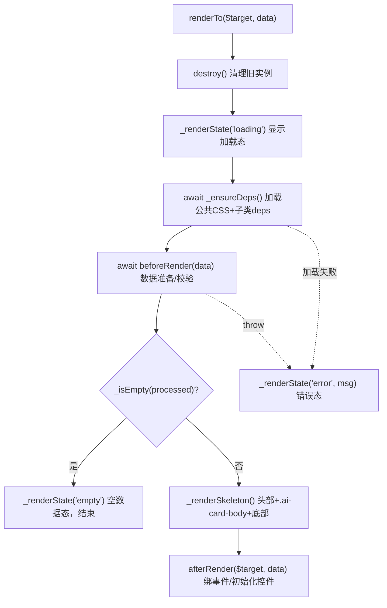

# 门诊医生AI工作站 - 对话卡片开发对接文档

> 面向对象：前端开发者
> 目标：读完本文即可基于公共基类 `opdoc.ai.card.Base` 独立开发并接入一张新的 AI 对话卡片。
> 代码位置：
> - JS：卡片文件命名 `card.<type>.js`，目录不限
> - CSS：卡片样式命名 `card.<type>.css`，目录不限

---

## 目录

1. [概述与快速开始](#1-概述与快速开始)
2. [基类核心解析（opdoc.ai.card.Base）](#2-基类核心解析opdocaicardbase)
3. [依赖自治机制](#3-依赖自治机制)
4. [公共 CSS 样式清单](#4-公共-css-样式清单)
5. [开发示例与最佳实践](#5-开发示例与最佳实践)

---

## 1. 概述与快速开始

### 1.1 卡片体系定位

门诊医生 AI 工作站（`opdoc.ai`）在对话流中，除了纯文本气泡，还会内嵌**可交互卡片**：例如 CDSS 诊断推荐卡（可多选确认后写入诊断列表）、病历采集卡（章节可编辑、可勾选后写入病历）。

这类卡片统一采用**面向对象继承 + 注册表自注册**组织：

- 一个公共基类 `opdoc.ai.card.Base`（文件 `chat.card.js`）抽象了所有卡片的共性：头部信息、卡片类型、状态管理（加载/空/错误）、样式加载、生命周期编排、事件绑定与销毁；同时承载 **`ACTION_CODE` → 卡片类注册表**与**卡片文件清单**。
- 每种卡片是基类的一个子类（如 `DiagCard`、`EmrCard`），只需实现自己特有的数据获取、内容渲染与交互逻辑，并在文件末尾**自注册**到基类注册表。
- 对话层（`chat.js`）**不引用任何具体卡片类**，只按云脑平台下发的动作码（`action`）经 `Base.resolve(action)` 反查卡片类分发。因此新增一张卡片无需改动 `chat.js` 与 `chat.store.js`。

现有卡片一览：

| 卡片 | 类名 | 动作码 `ACTION_CODE` | JS 文件 | CSS 文件 | 用途 |
|------|------|----------------------|---------|----------|------|
| 基类 | `opdoc.ai.card.Base` ※ | —（默认空串） | `chat.card.js` | `chat.card.css`（公共样式） | 所有卡片的父类 + 注册表与卡片文件清单 |
| 诊断推荐卡 | `DiagCard` | `CDSS_DIAG` | `card.diag.js` | `card.diag.css` | CDSS 疑似疾病多选确认写入诊断 |
| 病历采集卡 | `EmrCard` | `EMR_PARSE` | `card.emr.js` | `card.emr.css` | 病历章节可编辑、勾选后写入病历 |
| 诊疗步骤提示卡 | `TreatStepCard` | `TREAT_STEP` | `card.treatstep.js` | `card.treatstep.css` | 按类型着色的待办提示条目；数据中已注册为卡片的嵌套项另起兄弟气泡开卡 |

> ※ **只有基类挂全局命名空间**：子类写的是 `extends opdoc.ai.card.Base`，该表达式在类定义求值那一刻就要能取到基类，故基类必须由 `chat.card.js` 用 `createObjByStr('opdoc.ai.card').Base = ...` 暴露到 `window`。
>
> 卡片**子类一律以 IIFE 封装**，类名只存在于文件内部作用域、**不挂 `window`**，仅靠文件末尾的 `Base.register(...)` 进入注册表。外部（含控制台调试）统一经 `Base.resolve('动作码')` 获取卡片类——注册表是触达子类的**唯一**入口。

### 1.2 设计模式

卡片体系由三个核心模式支撑，理解它们即理解了整套设计：

**（1）模板方法模式（Template Method）**

基类的 `renderTo($target, data)` 是一条**固定的渲染流水线**，它按既定顺序调用一系列钩子；子类不改变流程，只**覆写其中的钩子**（如 `beforeRender`、`renderBody`、`afterRender`）来注入自己的业务。这样做的好处：加载态、空数据、异常兜底、事件解绑、销毁清理等"脏活"全部由基类统一处理，子类只关心业务本身。

**（2）依赖自治（Dependency Autonomy）**

每张卡片通过 `deps` 属性**声明式**地列出自己专属的运行时 JS 与 CSS；基类在渲染前自动加载并**跨实例缓存去重**。因此：

> 外部引入任何一张卡片，只需保证**基类 `chat.card.js` 已加载**，其余专属依赖由卡片自己搞定，调用方无需关心。

**（3）注册表 + 静态元数据驱动（Registry / Metadata-Driven）**

卡片文件加载时用 `opdoc.ai.card.Base.register(卡片类)` **自注册**到基类维护的 `ACTION_CODE → 卡片类` 映射表；对话层拿到云脑平台下发的动作码后，用 `Base.resolve(action)` **反查**卡片类并统一渲染，全程不出现任何具体卡片类名。卡片对对话层的其余诉求（气泡是否加宽、记录是否落盘、空态是否清理气泡壳、落盘数据形态）一律用**静态元数据**声明，由对话层读取执行。

> 收益：**新增一张卡片 = 新建卡片文件 + 声明静态元数据 + 自注册一行 + `CARD_FILES` 登记一行**，对话层（`chat.js`）与存储层（`chat.store.js`）零改动。静态元数据详见 [2.6](#26-卡片注册表与静态元数据)。

### 1.3 目录与命名约定

| 项目 | 约定 |
|------|------|
| JS 文件 | 卡片文件命名 `card.<type>.js`，目录不限 |
| CSS 文件 | 卡片样式命名 `card.<type>.css`，目录不限 |
| 文件封装 | 卡片子类文件整体以 IIFE 封装：`(function () { class XxxCard extends opdoc.ai.card.Base { ... } Base.register(XxxCard); })();`，类体相对文件首列缩进 4 空格 |
[REDACTED: environment-specific example]
| 类名 | 大驼峰（PascalCase），如 `DiagCard extends opdoc.ai.card.Base` |
| 方法/属性 | 小驼峰（camelCase）；类自身私有成员用 `#`，基类下发的内部状态用 `_` |
| 卡片根 class | `ai-card-${type}`（由基类根据 `type` 自动生成） |
| 子类样式 class | 统一前缀 `ai-card-${type}-xxx`，如 `ai-card-diag-item` |
| 文案 | 所有用户可见文案用 `$trans('中文')` 包裹；HTML 插值用 `escapeHtml(...)` 转义 |

### 1.4 新增一张卡片的 5 个步骤

以新增一张类型为 `xxx`、动作码为 `XXX_ACTION` 的卡片为例：

1. **建 JS**：新建 `card.xxx.js`（目录不限），**文件整体以 IIFE 封装**，内部 `class XxxCard extends opdoc.ai.card.Base`，声明 `ACTION_CODE` 等**静态元数据**与 `deps`，至少覆写 `renderBody`（详见 [1.5 最小骨架](#15-最小卡片骨架)、[2.6 静态元数据](#26-卡片注册表与静态元数据)）。
2. **建 CSS**：新建 `card.xxx.css`（目录不限），在根容器 `.ai-card-xxx` 上声明 `--ai-card-*` 主题变量（详见 [第 4 节](#4-公共-css-样式清单)）。
3. **自注册**：在 IIFE **内部末尾**加一行 `opdoc.ai.card.Base.register(XxxCard);`（传 IIFE 里的局部类名，不再经全局命名空间转手）。此后对话层即可按动作码反查到本卡片，**无需在 `chat.js` 里写任何分支或 `new` 调用**。
4. **登记文件清单**：在 `chat.card.js` 基类的 `static CARD_FILES` 数组里加一行卡片文件相对路径。基类 `Base.loadAll()` 会在 `init()` 中（基类自身加载完成之后）统一加载清单内全部卡片文件（详见 [3.3](#33-类文件本身的加载顺序关键陷阱)）。
5. **部署**：`node scripts/sftp-sync.js upload <文件...>`。JS/CSS **无需编译**，浏览器强刷（Ctrl+F5）即可生效。

> **动作码约定**：`ACTION_CODE` 的取值必须与云脑平台下发的 `action`（或诊疗步骤嵌套项的 `type`）一致，需事先与平台侧对齐；注册表以它为唯一键，重复注册时保留先注册者并在控制台告警。
>
> **无需改动的文件**：`chat.js`（实时渲染 / 快捷提问 / 历史恢复三条入口共用注册表分发）与 `chat.store.js`（落盘过滤只读记录里携带的 `persist` 策略）。

### 1.5 最小卡片骨架

下面是一个可直接照抄的最小骨架，仅演示注册方式与钩子签名（业务逻辑按需填充）：

```javascript
/**
 * @file: scripts/dhcdoc/opdoc/ai/card.xxx.js
 * @description: XXX 卡片（继承 BaseCard）
 * @note: 引入本卡片仅需先加载基类 chat.card.js 并在 CARD_FILES 登记本文件；
 *        专属 CSS/JS 由卡片自动加载，对话层按 ACTION_CODE 反查分发，无需改动 chat.js；
 *        本文件以IIFE封装，卡片类不挂全局命名空间，末尾自注册到基类ACTION_CODE注册表供对话层反查
 */
(function () {
    class XxxCard extends opdoc.ai.card.Base {
        /// 云脑平台对应动作码（注册表键，必须覆写，取值与平台下发的 action 一致）
        static ACTION_CODE = 'XXX_ACTION';
        /// 落盘策略：adopted / adopted+data / data / always（详见 2.6）
        static PERSIST = 'data';
        /// 是否加宽气泡（含多行列表或文本域时置 true）
        static WIDE = false;
        /// 空数据态是否移除空气泡壳（纯提示类卡片置 true）
        static REMOVE_ON_EMPTY = false;

        /// 卡片依赖声明（renderTo 时由基类 _ensureDeps 自动加载，缓存去重）
        deps = {
            js: [],                                        // 运行时依赖脚本（相对路径）
            css: ['../css/doctor/doc/opdoc/ai/card.xxx.css'] // 卡片专属样式
        };

        constructor(opts = {}) {
            // 用默认配置兜底，再用外部 opts 覆盖
            super(Object.assign({
                type: 'xxx',                    // 决定根容器 class：ai-card-xxx
                title: $trans('卡片标题'),
                source: 'CDSS',                 // 可选：头部来源标识
                emptyText: $trans('暂无数据'),
                loadingText: $trans('加载中...')
            }, opts));
            // 已采纳状态（历史会话恢复时传入）
            this.adopted = !!opts.adopted;
        }

        /// 渲染前：数据准备/校验（支持异步）。返回值赋给 this.data 并传给 renderBody；throw 则进错误态
        async beforeRender(data) {
            return data;
        }

        /// 渲染主体（必须实现）：返回内容区 HTML 字符串。只拼字符串，不碰 DOM
        renderBody(data) {
            return `<div class="ai-card-xxx-list">${
                data.map(item => `<div class="ai-card-xxx-item">${escapeHtml(item.name)}</div>`).join('')
            }</div>`;
        }

        /// 渲染后：事件绑定（务必用 this._on，destroy 会自动解绑）、控件初始化
        afterRender($target, data) {
            this._on($target, 'click', '.ai-card-xxx-item', (e) => {
                // ...交互逻辑
            });
        }

        /// 底部按钮区（可选）：默认无底部，覆写后返回按钮 HTML
        _getFooterHtml() {
            return `<div class="ai-card-footer"><a class="ai-card-xxx-confirm-btn"></a></div>`;
        }
    }

    //自注册到卡片注册表：对话层按 ACTION_CODE 反查本卡片，无需硬编码类引用
    opdoc.ai.card.Base.register(XxxCard);
})();
```

> **为什么必须配 IIFE**：卡片文件由 `loadJs` 以普通 `<script>` 注入，顶层裸写 `class XxxCard {}` / `const` / `function` 会进入**全局词法作用域**（所有普通脚本共享），重名直接 `SyntaxError` 且报错点难定位。IIFE 把这些声明收进函数作用域，类只通过 `Base.register` 这一个出口对外可见。
>
> 若确实需要在控制台手动实例化调试，用 `new (opdoc.ai.card.Base.resolve('XXX_ACTION'))(opts).renderTo($bubble, data)`，不要指望 `opdoc.ai.card.Xxx`。

---

## 2. 基类核心解析（opdoc.ai.card.Base）

基类源码见 `chat.card.js`。本节按"属性 → 生命周期钩子 → 渲染流程与控制方法 → 时序 → 前缀约定"逐一拆解。

### 2.1 核心属性

| 属性 | 类型 | 默认值 | 说明 |
|------|------|--------|------|
| `opts` | `object` | `{}` | 卡片公共配置对象，构造时传入。字段见下表 |
| `type` | `string` | 取自 `opts.type` | 卡片类型标识，决定根容器 class `ai-card-${type}` |
| `adopted` | `boolean` | `false` | 是否已采纳；调用 `markAdopted()` 后置 `true`。历史会话恢复时由子类构造函数回填 |
| `data` | `any` | `undefined` | `beforeRender` 处理后的渲染数据，`renderBody`/`afterRender`/`_getFooterHtml` 均可访问 |
| `deps` | `{js:[], css:[]}` | `{js:[],css:[]}` | 卡片依赖声明（子类覆写）；公共样式由基类自动合并，无需写入 |
| `_eventHandlers` | `Array` | `[]` | 内部：已通过 `_on` 登记的事件，`destroy` 时统一解绑 |
| `_destroyed` | `boolean` | `false` | 内部：销毁标志，防重复销毁 |
| `_target` | `jQuery` | `null` | 内部：当前渲染目标容器（`renderTo` 传入） |

`opts` 支持的字段（基类构造函数 JSDoc 定义）：

| 字段 | 必填 | 说明 |
|------|------|------|
| `type` | 是 | 卡片类型标识 |
| `title` | 是 | 卡片标题；为空时头部 `_getHeaderHtml` 返回空串 |
| `source` | 否 | 来源标识（如 `'CDSS'`），头部显示为"来源：CDSS" |
| `subtitle` | 否 | 副标题/描述，显示在头部下方 |
| `emptyText` | 否 | 空数据提示文案，默认 `$trans('暂无数据')` |
| `loadingText` | 否 | 加载态文案，默认 `$trans('加载中...')` |
| `onAdopted` | 否 | 采纳回调；`markAdopted()` 时触发，供调用方给消息记录打标 |

以下字段由**对话层 `renderCard` 注入**（卡片按需读取）：

| 字段 | 说明 |
|------|------|
| `episodeId` | 当前就诊号，供自持取数的卡片（如诊断卡）请求后端 |
| `adopted` | 已采纳状态；历史恢复重放时为 `true`，卡片据此把按钮还原为已保存禁用态 |
| `openCard` | `(action, data) => void`：委托对话层**另起兄弟气泡**开一张卡片，用于数据里嵌套了其它卡片动作码的场景（详见 [2.7](#27-对话层分发契约rendercard-与-opencard-嵌套)） |

### 2.2 生命周期钩子（子类按需覆写）

基类定义了 4 个生命周期钩子，子类只覆写需要的部分：

| 钩子 | 签名 | 基类默认行为 | 子类职责 |
|------|------|--------------|----------|
| `beforeRender` | `async beforeRender(data)` | 原样返回 `data` | **数据准备/校验**：可异步请求后端；返回值赋给 `this.data` 并传入 `renderBody`；`throw` 则整卡进入错误态 |
| `renderBody` | `renderBody(data)` | `throw`（强制子类实现） | **内容区 HTML**：必须实现，返回字符串。**只拼字符串，不操作 DOM** |
| `afterRender` | `afterRender($target, data)` | 空实现 | **事件绑定 / 控件初始化**：DOM 已就绪，通过 `this._on` 注册的事件会被 `destroy` 统一解绑 |
| `onDestroy` | `onDestroy()` | 空实现 | **销毁前清理**：清理定时器等自定义资源 |

要点：

- `beforeRender` 是**唯一的数据入口**。它的返回值决定后续所有钩子拿到的 `data`；抛异常会被 `renderTo` 的 `try/catch` 捕获并渲染错误态，是标准的失败兜底方式。
- `renderBody` 与 `afterRender` **职责分离**：前者产出静态 HTML 字符串，后者负责把数据绑定到 DOM、绑定事件、初始化 HISUI 控件（如 `linkbutton`、`dateboxq`）。切勿在 `renderBody` 里操作 DOM（此时尚未插入文档）。

### 2.3 渲染流程与控制方法

**（1）主流程 `renderTo($target, data)`** —— 一站式渲染入口，子类一般不覆写。**返回渲染结果态** `'ok' | 'empty' | 'error'`，对话层据此决定是否清理空气泡壳：

```javascript
async renderTo($target, data) {
    this.destroy();                 // 同一实例重复渲染时先清理旧状态
    this._destroyed = false;
    this._target = $($target);
    this._renderState('loading');   // 先出加载态
    try {
        await this._ensureDeps();               // 依赖就绪后才进入数据准备（消除竞态）
        const processed = await this.beforeRender(data);
        this.data = processed;
        if (this._isEmpty(processed)) {         // 空数据检查
            this._renderState('empty');
            return 'empty';
        }
        this._renderSkeleton(processed);        // 渲染骨架（头部+内容区+底部）
        this.afterRender(this._target, processed); // 事件绑定/控件初始化
        return 'ok';
    } catch (e) {
        this._renderState('error', e.message);  // 异常统一兜底
        return 'error';
    }
}
```

**（2）内部渲染方法（`_` 约定，子类可覆写扩展）**：

| 方法 | 作用 | 可否覆写 |
|------|------|----------|
| `_ensureDeps()` | 合并公共 CSS + 子类 `deps`，Promise 缓存去重后加载 | 一般不覆写 |
| `_isEmpty(data)` | 空数据判定：`!data` 或空数组视为空 | **常覆写**（如 Emr 卡自定义判定） |
| `_renderState(state, msg)` | 渲染 `loading`/`empty`/`error` 三态 | 可覆写；**只接管需要的分支**，其余 `return super._renderState(...)`（诊断卡空态保留"手动录入"按钮、诊疗步骤卡空态清空见 [5.1（7）](#7_renderstate空态保留兜底按钮)、[5.3](#53-诊疗步骤提示卡-cardtreatstepjs元数据驱动--嵌套开卡)） |
| `_renderSkeleton(data)` | 渲染整体骨架：`_getHeaderHtml()` + `.ai-card-body`（含 `renderBody`）+ `_getFooterHtml()` | 可覆写调整整体结构 |
| `_getHeaderHtml()` | 头部 HTML：标题 + 来源标识 + 副标题（`title` 为空则返回空串） | 一般不覆写 |
| `_getFooterHtml()` | 底部 HTML：默认返回空串 | **常覆写**（提供确认/手动录入等按钮） |

`_renderSkeleton` 生成的 DOM 结构（注意根容器 class 由 `type` 决定）：

```html
<div class="ai-card-${type}">
  <!-- _getHeaderHtml(): .ai-card-header / .ai-card-source / .ai-card-subtitle -->
  <div class="ai-card-body"><!-- renderBody(data) 的返回值 --></div>
  <!-- _getFooterHtml(): .ai-card-footer -->
</div>
```

**（3）公共控制方法**：

| 方法 | 作用 |
|------|------|
| `markAdopted()` | 标记卡片已采纳：置 `this.adopted = true` 并触发 `opts.onAdopted?.()`。用于通知对话层给消息记录打标（持久化） |
| `destroy()` | 统一销毁：遍历 `_eventHandlers` 解绑事件 → 清空登记 → 调用 `onDestroy()` → 释放 `_target`。带 `_destroyed` 幂等保护 |
| `showMask(msg)` | 在当前 `_target` 上显示遮罩，默认文案 `$trans('处理中...')`（封装 HISUI `showMask`） |
| `hideMask()` | 隐藏遮罩 |
| `_on($el, event, selector, handler)` | 注册事件并登记，支持**直接绑定**（`selector` 传函数）与**事件委托**（`selector` 传选择器字符串）两种模式；登记的事件由 `destroy` 统一解绑 |

**（4）工具方法**：

| 方法 | 作用 |
|------|------|
| `_getSectionText(sec)` | 提取章节纯文本：`sec.text` 为段落数组、每段为文本片段数组，段落间以 `\n` 拼接。供病历类卡片复用 |

`_on` 的两种用法（源自基类实现）：

```javascript
// 事件委托（推荐用于列表项）：selector 为字符串
this._on($target, 'click', '.ai-card-diag-item', (e) => { /* ... */ });

// 直接绑定：selector 位置传函数
this._on($confirmBtn, 'click', (e) => { /* ... */ });
```

### 2.4 renderTo 渲染时序



关键顺序：**先加载依赖，再准备数据**。`_ensureDeps` 在 `beforeRender` 之前 `await`，确保子类在 `beforeRender` 里调用的运行时脚本（如 `entry.service.js`）已就绪，消除"脚本未加载完即调用"的竞态。

### 2.5 `_` 与 `#` 前缀约定

基类同时使用了两种"非公有"前缀，取舍原则如下：

- **`_` 前缀（内部约定，子类可访问/覆写）**：如 `_target`、`_eventHandlers`、`_isEmpty`、`_getFooterHtml`。之所以不用 `#`，是因为**子类需要读写它们**（例如子类 `afterRender` 里要用 `this._target` 查找 DOM、覆写 `_isEmpty` 自定义空判定）。
- **`#` 前缀（原生私有，仅类内可见）**：用于**子类自身**不希望被继承链访问的私有方法，如 `DiagCard` 的 `#fetchData`、`#confirmDiag`、`#saveCheckedDiags`、`#toggleMainCheck` 等。同类内访问合法且更安全。

> 经验法则：**基类下发给子类用的 → `_`；子类自己内部私有的 → `#`。**

### 2.6 卡片注册表与静态元数据

基类除了实例能力，还承载**注册表**与**卡片文件清单**，这是"新增卡片不改对话层"的关键。相关结构都是 `BaseCard` 的**内部静态字段**（不挂在命名空间上，类内统一以 `BaseCard.xxx` 引用）：

```javascript
createObjByStr('opdoc.ai.card').Base = class BaseCard {
    // ...公共静态元数据（ACTION_CODE / PERSIST / WIDE / REMOVE_ON_EMPTY）...

    // ── 内部静态资源（基类自持，不做子类覆写） ──
    /// 基类公共样式（所有卡片共享，由基类统一加载）
    static BASE_CARD_CSS = '../css/doctor/doc/opdoc/ai/chat.card.css';
    /// 依赖加载共享缓存：url → Promise，多实例/多卡片共享，同一资源只注入一次
    static _depCache = {};
    /// 卡片文件清单（无构建工具无法自动发现，新增卡片在此登记一行）
    static CARD_FILES = [
        '../scripts/dhcdoc/opdoc/ai/card.emr.js',
        '../scripts/dhcdoc/opdoc/ai/card.diag.js',
        '../scripts/dhcdoc/opdoc/ai/card.treatstep.js'
    ];
    /// ACTION_CODE → 卡片类注册表（卡片文件加载时自注册，对话层按动作码反查）
    static _cardRegistry = new Map();
    /// loadAll 结果缓存（loadJs 自身不去重，重复调用会重复注入 script）
    static _loadAllPromise = null;
```

> **为什么用 `BaseCard.xxx` 而不是 `this.xxx`**：注册表与 Promise 缓存必须全局只有一份。`this` 在静态方法里随调用方变化（`Sub.loadAll()` 会把 `_loadAllPromise` 写成子类自有字段，缓存分裂），显式写类名可彻底规避，也不受方法被解构传递时丢失 `this` 的影响。**需要支持子类覆写的成员（如 `ACTION_CODE`）才用 `this.xxx`。**

**（1）静态方法（基类 API，供卡片与对话层调用）**

| 方法 | 调用方 | 作用 |
|------|--------|------|
| `Base.register(Card)` | 卡片文件末尾 | 按 `Card.ACTION_CODE` 登记卡片类。`ACTION_CODE` 为空则忽略；重复注册且非同一类时 `console.warn` 告警并**保留先注册者** |
| `Base.resolve(action)` | 对话层 / 其它卡片 | 按动作码反查卡片类，**未注册返回 `null`**（调用方据此走文本兜底） |
| `Base.loadAll()` | `chat.js` 的 `init()` | 加载 `CARD_FILES` 内全部卡片文件。Promise 缓存去重；**单个卡片加载失败只告警**，不阻塞对话初始化（对应动作码反查不到，自动走兜底） |
| `Base.toRecordData(data)` | 对话层 | 静态钩子：返回**落盘数据形态**，默认恒等返回。诊断卡返回 `null`（不存快照，恢复时实时重取）；诊疗步骤卡剔除已注册为卡片的嵌套项 |

**（2）静态元数据（子类覆写以声明自身对对话层的诉求）**

| 静态成员 | 默认值 | 含义 | 谁读取 |
|----------|--------|------|--------|
| `ACTION_CODE` | `''` | 注册表键。**三处共用同一词汇**：AI 回复的 `action`、诊疗步骤嵌套项的 `step.type`、快捷提问写死的动作码 | `register` / `resolve` |
| `PERSIST` | `'data'` | 落盘策略：`adopted`=仅采纳后落盘 / `adopted+data`=采纳且数据非空 / `data`=数据非空即落盘 / `always`=总是落盘 | 随记录写入，由 `chat.store.js` 求值 |
| `WIDE` | `false` | 是否给气泡加宽（追加 `ai-chat-body--wide`）。含多行列表或文本域的卡片置 `true` | `chat.js` 渲染时 |
| `REMOVE_ON_EMPTY` | `false` | 渲染结果为空态时是否移除空气泡壳。**纯提示类卡片置 `true`**；诊断卡空态仍保留"手动录入"按钮，故为 `false` | `chat.js` 渲染后 |
| `toRecordData(data)` | 恒等返回 | 落盘数据形态（见上表） | `chat.js` 回填记录前 |

**（3）现有卡片取值对照**

| 卡片 | `ACTION_CODE` | `PERSIST` | `WIDE` | `REMOVE_ON_EMPTY` | `toRecordData` |
|------|---------------|-----------|--------|-------------------|----------------|
| Diag | `CDSS_DIAG` | `adopted` | `true` | `false` | `() => null`（不存快照） |
| Emr | `EMR_PARSE` | `adopted+data` | `true` | `false` | 恒等 |
| TreatStep | `TREAT_STEP` | `data` | `false` | `true` | 剔除已注册为卡片的嵌套项 |

> **为什么 `PERSIST` 要随记录一起落盘**：存储层（`chat.store.js`）在 `persist()` 时过滤"无意义记录"，若它按卡片类型分支判断，就会反向依赖卡片层。改为把策略字符串写进记录后，存储层只做**纯数据判断**，不认识任何卡片。

### 2.7 对话层分发契约（renderCard 与 openCard 嵌套）

**（0）动作码与数据从哪来**

卡片的 `action` / `data` 来自云脑平台的 **InfoPrompt 结构化回复**：SSE 协议层（`chat.sse.js`）累积 `nodeType === 'InfoPrompt'` 的 `content`，流结束后按 `{ success, msg, action, data }` 解析（解析失败则整段回退为正文文本渲染）。请求体同时经 `extras` 携带当前就诊号（`extras: { episodeId }`，由 `serializeExtras` 拼成查询串、不做 URL 编码），平台据此返回与该就诊相关的动作与数据。

`renderAIResponse` 拿到该对象后：`success === false` 直接展示 `msg`；`action` 命中注册表则交 `renderCard`；未命中（如 `NOT_MATCH`）走 `msg` 文本兜底。**新增卡片只需与平台侧约定新的 `action` 取值**，前端不新增任何解析分支。

**（1）唯一分发入口 renderCard**

`chat.js` 只有**一个**卡片分发入口 `renderCard`，三条业务入口共用它：

| 入口 | 场景 | 传参要点 |
|------|------|----------|
| `renderAIResponse` | AI 回复带 `action` | 先**同步** `Base.resolve(result.action)` 判定；命中传 `turn` + 已创建的 `$bubble`，未命中走 `result.msg` 文本兜底 |
| 快捷提问 | 点「推荐诊断」直接开卡 | 只传 `action`，气泡与记录由 `renderCard` 自建 |
| `KIND_RENDERERS.card` | 历史会话恢复重放 | 传 `action` / `data` / `adopted` / `$target`；`restoring` 已置位，天然不重复入库 |

```javascript
/// @returns {Promise<boolean>} 是否命中已注册卡片（未命中由调用方走 msg 文本兜底）
async function renderCard({ action, data = null, turn = null, $bubble = null, $target = null, adopted = false })
```

| 入参 | 说明 |
|------|------|
| `action` | 动作码，经 `Base.resolve` 反查卡片类 |
| `data` | 卡片渲染数据（自持取数的卡片如诊断卡可缺省） |
| `turn` | 本轮记录句柄。传入则**回填本轮记录**（`turn.fill`），缺省则 `ChatStore.append` 追加独立记录 |
| `$bubble` | 目标气泡，缺省时 `appendMessage` 新建（同步创建，保证多卡片顺序确定） |
| `$target` | 气泡归属容器。历史分批渲染时是临时占位容器，**必须透传**，否则越代防护会误删卡片 |
| `adopted` | 已采纳状态，历史重放时传入，卡片按钮还原为已保存态 |

**（2）统一消息记录格式**

三条入口写出的记录**只有一种形态**，用 `action` 取代早期按卡片类型分化的 `kind` 词汇：

```javascript
{ role: 'ai', kind: 'card', action: 'EMR_PARSE', data: [...], adopted: false, persist: 'adopted+data', ts: 1757... }
```

存储层据此过滤（`chat.store.js` 的 `isEmptyMsgRecord`）：

```javascript
case 'card':
    switch (msg.persist) {
        case 'adopted':      return !msg.adopted;
        case 'adopted+data': return !msg.adopted || isEmptyCardData(msg.data);
        case 'always':       return false;
        default:             return isEmptyCardData(msg.data);   // 'data'
    }
```

> **记录回填必须在 `renderCard` 的首个 `await` 之前同步完成**：否则 `doSend` 结束时的 `persist()` 会命中"空文本轮次"兜底，把本轮记录写成"AI回复已中断"，卡片记录丢失。
>
> **`adopted` 是延迟写入的**：用户在轮次结束后才点确认，`onAdopted` 回调经记录共享引用打标；下一次 `persist()`（再发消息或病历失焦）时求值捕获，与改造前机制一致。

**（3）`openCard` 嵌套开卡契约**

卡片数据里可能嵌着**另一张卡片**的动作码（如 `TREAT_STEP` 的条目 `type` 为 `CDSS_DIAG`）。基类构造 `opts` 会注入 `openCard(action, data)` 回调，卡片在 `beforeRender` 里把这类嵌套项**委托对话层另起兄弟气泡**渲染，而不是塞进自己的卡体：

```javascript
//card.treatstep.js
async beforeRender(list) {
    const steps = Array.isArray(list) ? list : [];
    const Card = this.constructor;
    const selfCode = Card.ACTION_CODE;
    steps.forEach(step => {
        if (Card.isNestedCardStep(step, selfCode)) this.opts.openCard?.(step.type, step);
    });
    return steps.filter(step => !Card.isNestedCardStep(step, selfCode));   //本卡只留纯提示条目
}
```

四条硬约束：

1. **必须在 `beforeRender` 委托，不能在 `afterRender`**：仅剩嵌套项时过滤后列表为空 → 走空态短路，`afterRender` 根本不会执行。
2. **必须排除自引用**（`type !== selfCode`）：否则一条 `type: 'TREAT_STEP'` 的数据会无限递归开卡。
3. **必须同步覆写 `toRecordData` 剔除嵌套项**：嵌套卡片由自己的独立记录承载，恢复时各自重放，避免重复开卡；同时保证**实时渲染 / 历史恢复 / 落盘记录三方一致**。
4. **不得在本卡体内渲染嵌套卡片**：卡体是 `renderTo` 同步产出的 HTML，嵌套卡片异步 `renderTo` 会覆盖它（改造前诊疗步骤提示丢失即因此）。

**（4）渲染结果态与气泡清理**

`renderTo` 返回 `'ok' | 'empty' | 'error'`，`renderCard` 据此收尾：

- **越代防护**：渲染期间患者已切换（`pageSeq` 变化）或气泡已脱离归属容器 → 移除游离气泡节点。
- **空气泡清理**：仅当 `state === 'empty' && Card.REMOVE_ON_EMPTY` 才移除气泡壳，避免误删诊断卡空态（含"手动录入"按钮）。
- 正常收尾调 `scrollBottom()`。

---

## 3. 依赖自治机制

"依赖自治"是本卡片体系最重要的工程约定：**每张卡片自己声明并加载专属依赖，调用方只管加载基类。**

### 3.1 deps 声明格式

子类通过覆写 `deps` 属性声明专属依赖，分两类：

```javascript
deps = {
    js: ['../scripts/dhcdoc/diagnos/v9/entry.service.js'], // 运行时依赖脚本
    css: ['../css/doctor/doc/opdoc/ai/card.diag.css']      // 卡片专属样式
};
```

- `js`：卡片运行时才需要的脚本（如诊断卡依赖诊断录入服务 `entry.service.js`）。
- `css`：卡片专属样式（如 `card.diag.css`）。**公共样式 `chat.card.css` 不需要写在这里**，基类会自动合并。
- 路径为**相对路径**（相对于宿主 CSP 页面），约定 `../scripts/...`、`../css/...`。
- 无 JS 依赖时可省略或留空数组，如病历卡：`deps = { js: [], css: ['../css/doctor/doc/opdoc/ai/card.emr.css'] }`。

### 3.2 基类如何加载与缓存

基类 `_ensureDeps()` 负责加载，源码逻辑：

```javascript
// 均为 BaseCard 的静态字段（见 2.6）：static BASE_CARD_CSS = '...'；static _depCache = {}
async _ensureDeps() {
    const urls = [
        // 公共样式排在最前，与子类 css 合并
        ...[BaseCard.BASE_CARD_CSS, ...(this.deps.css || [])].map(u => ({ u, isCss: true })),
        ...(this.deps.js || []).map(u => ({ u }))
    ];
    await Promise.all(urls.map(({ u, isCss }) =>
        BaseCard._depCache[u] ??= isCss ? loadCss(u) : loadJs(u)  // ??= 缓存去重
    ));
}
```

三个设计要点：

1. **公共样式自动合并**：`BASE_CARD_CSS` 始终被排在依赖列表最前，子类无需声明即可获得头部/底部/状态态样式。
2. **共享缓存去重**：`_depCache` 是**基类静态字段**（`url → Promise`），所有卡片实例共用一份。无论多少个实例、多少张卡片并发渲染，同一个 URL 只会真正注入一次 DOM（`BaseCard._depCache[u] ??= ...` 利用空值合并赋值，命中缓存直接复用同一个 Promise）。
3. **并发安全**：`Promise.all` 并行加载所有依赖，全部就绪后才 `await` 返回，随后才进入 `beforeRender`。

### 3.3 类文件本身的加载顺序（关键陷阱）

**卡片类文件（`card.xxx.js`）不在 `deps` 里声明**，而是登记在基类的 `CARD_FILES` 清单中，由 `Base.loadAll()` 在宿主页面（`chat.js`）初始化时统一加载：

```javascript
// ① 基类随 renderClosure 的 js 列表加载
$container = await $(opts.selector).renderClosure({
    html: getHtml(),
    css: ['../css/doctor/doc/opdoc/ai/chat.css'],
    js: [
        '../scripts/dhcdoc/opdoc/ai/chat.store.js',
        '../scripts/dhcdoc/opdoc/ai/chat.sse.js',
        '../scripts/dhcdoc/opdoc/ai/chat.voice.js',
        '../scripts/dhcdoc/opdoc/ai/chat.card.js',   // ← 基类
    ]
});
// ② 基类就绪后，加载 CARD_FILES 清单内的全部卡片子类（新增卡片无需改动此处）
await opdoc.ai.card.Base.loadAll();
```

`loadAll()` 的实现要点：

```javascript
static loadAll() {
    return BaseCard._loadAllPromise ??= Promise.all(BaseCard.CARD_FILES.map(url =>
        loadJs(url).catch(e => console.warn('[ai.chat] 卡片脚本加载失败', url, e))
    ));
}
```

1. **必须缓存 Promise**：`loadJs` 自身不去重，`init()` 若被多次调用会重复注入 `<script>`；`BaseCard._loadAllPromise ??=` 保证只真正加载一次。
2. **单文件失败不拖垮初始化**：每个 `loadJs` 各自 `catch` 后只 `console.warn`。加载失败的卡片不会自注册，其动作码经 `resolve` 反查为 `null`，对话层**自动回落到 `msg` 文本兜底**，对话功能仍可用。

**为什么必须分两步、且子类在基类之后？**

子类定义 `class XxxCard extends opdoc.ai.card.Base` 时，`extends` 右侧的表达式在**类定义求值的那一刻**就要能取到基类。若基类尚未加载，`opdoc.ai.card.Base` 为 `undefined`，会直接抛错。`renderClosure` 内部的并行加载**不保证顺序**，因此源码显式地：先 `await renderClosure`（确保基类执行完毕），再 `Base.loadAll()` 加载子类。

> **新增卡片时务必牢记**：把新卡片文件路径加到 `chat.card.js` 基类的 **`static CARD_FILES` 数组**里（与其它卡片并列），**不要**放进 `renderClosure` 的 `js` 数组（否则可能与基类并行、顺序不定导致 `extends` 失败）；同时卡片文件末尾必须有一行 `opdoc.ai.card.Base.register(...)` 自注册，否则加载了也反查不到。
>
> **无构建工具的现实约束**：本项目没有 webpack/vite 之类的打包器，做不到"扫描目录自动发现卡片"，`CARD_FILES` 这一行登记是新增卡片时唯一无法省略的对话侧改动。

### 3.4 依赖自治带来的收益

- 调用方**零依赖心智**：拿到卡片类后 `new Card(opts).renderTo($bubble, data)` 一行搞定，专属 CSS/JS 由 `renderTo` 内部的 `_ensureDeps` 自动加载，无需手动 `loadCss`/`loadJs`。对话层取类统一走注册表：`const Card = opdoc.ai.card.Base.resolve(action)`（见 [2.7](#27-对话层分发契约rendercard-与-opencard-嵌套)）。
- **按需加载**：卡片专属脚本只在卡片真正渲染时才加载，不拖慢首屏。
- **天然去重**：同一会话多次渲染同类卡片、或多种卡片共享同一依赖，都只注入一次。

---

## 4. 公共 CSS 样式清单

公共样式文件 `chat.card.css` 由基类自动加载（见 [3.2](#32-基类如何加载与缓存)），提供所有卡片共享的头部、底部、状态态样式。子类**无需重复定义**这些通用样式，只需专注自己的内容区。

### 4.1 chat.card.css 公共类清单

| 类名 | 由谁生成 | 布局/外观要点 | 用途 |
|------|----------|----------------|------|
| `.ai-card-header` | 基类 `_getHeaderHtml` | `flex` + `space-between`，`padding:6px 10px`，`font-size:14px`，`font-weight:600`，底部 1px 分隔线 | 头部容器：左标题、右来源标识 |
| `.ai-card-source` | 基类 `_getHeaderHtml` | `font-size:11px`，弱色 | 来源标识（如"来源：CDSS"） |
| `.ai-card-subtitle` | 基类 `_getHeaderHtml` | `font-size:12px`，弱色 | 副标题/描述，位于头部下方 |
| `.ai-card-footer` | 子类 `_getFooterHtml` | `flex` + `flex-end`，`gap:10px`，`padding-top:5px` | 底部操作区（确认/手动录入等按钮） |
| `.ai-card-loading` | 基类 `_renderState('loading')` | `padding:10px`，斜体，强调色 | 加载态文案 |
| `.ai-card-empty` | 基类 `_renderState('empty'/'error')` | `padding:10px`，斜体，弱色 | 空数据 / 错误态文案 |

源码（`chat.card.css` 全文）：

```css
/* ── 头部区域（标题 + 来源标识） ── */
.ai-card-header {
    display: flex;
    align-items: center;
    justify-content: space-between;
    flex-shrink: 0;
    padding: 6px 10px;
    font-size: 14px;
    font-weight: 600;
    color: var(--ai-card-accent, var(--primary-color, #1a6fe8));
    border-bottom: 1px solid var(--ai-card-border, var(--input-border-color, #e3e8f2));
}
.ai-card-source { font-size: 11px; font-weight: 400; color: var(--ai-card-text-s, var(--input-placeholder-color, #98a2b8)); }
.ai-card-subtitle { font-size: 12px; color: var(--ai-card-text-s, var(--input-placeholder-color, #98a2b8)); }

/* ── 底部操作区（确认/手动录入等按钮） ── */
.ai-card-footer { display: flex; justify-content: flex-end; gap: 10px; flex-shrink: 0; padding-top: 5px; }

/* ── 通用状态态（loading/empty/error） ── */
.ai-card-loading, .ai-card-empty { margin: 0; padding: 10px; font-style: italic; }
.ai-card-loading { color: var(--ai-card-accent, var(--primary-color, #1a6fe8)); }
.ai-card-empty { color: var(--ai-card-text-s, var(--input-placeholder-color, #98a2b8)); }
```

> **结构钩子说明**：基类 `_renderSkeleton` 还会生成两个容器——根容器 `.ai-card-${type}`（如 `.ai-card-diag`）与内容区 `.ai-card-body`。这两个 class 在**公共 CSS 中未定义外观样式**：根容器的样式（含主题变量声明）由**子类 CSS** 负责，`.ai-card-body` 是留给子类按需美化的结构钩子。

### 4.2 CSS 变量主题适配机制

这是卡片样式能"随系统主题自动换肤"的核心。机制分**消费端**与**声明端**两层，通过 CSS 变量的继承链串联。

**（1）消费端 —— 公共类两级回退**

公共 CSS（`chat.card.css`）里的颜色**不写死**，而是消费 `--ai-card-*` 变量，并做**两级回退**：

```css
color: var(--ai-card-accent, var(--primary-color, #1a6fe8));
/*          ①子类声明的卡片变量   ②系统主题变量        ③硬编码兜底 */
```

回退优先级：先取子类根容器声明的 `--ai-card-accent` → 取不到则取系统主题变量 `--primary-color` → 再取不到则用硬编码 `#1a6fe8`。这保证了**即使子类忘了声明变量，卡片也不会失色**（呼应 AGENTS.md「CSS 变量必须提供回退值」规范——系统有 `pure`/`vben` 两套风格，`pure` 下部分变量无定义）。

**（2）声明端 —— 子类根容器映射系统主题变量**

子类在自己的根容器（`.ai-card-diag` / `.ai-card-emr`）上，把 `--ai-card-*` 变量映射到**系统主题变量**：

```css
.ai-card-diag {
    --ai-card-accent:   var(--primary-color, #1a6fe8);
    --ai-card-bg:       var(--body-bgcolor, #f5f7fb);
    --ai-card-surface:  var(--input-bgcolor, #ffffff);
    --ai-card-border:   var(--input-border-color, #e3e8f2);
    --ai-card-text:     var(--default-font-color, #1a2236);
    --ai-card-text-s:   var(--input-placeholder-color, #98a2b8);
    --ai-card-hover-bg: var(--input-hover-bgcolor, #e8f0fd);
    /* ...根容器自身布局... */
}
```

**（3）继承链**：子类根容器 `.ai-card-diag` 声明变量 → 其内部的公共类（`.ai-card-header` 等）与子类内容类经 **CSS 继承**读取这些变量 → 系统切换 `pure`/`vben` 三色系（`bgseablue`/`bgliteblue`/`bgdark`）时，`--primary-color` 等系统变量随之变化 → 卡片配色自动跟随，无需改卡片代码。

**卡片可用主题变量清单**（`--ai-card-*` → 系统变量 → 兜底值）：

| 卡片变量 | 语义 | 映射的系统变量 | 兜底值 |
|----------|------|----------------|--------|
| `--ai-card-accent` | 强调色（标题、勾选、聚焦边框） | `--primary-color` | `#1a6fe8` |
| `--ai-card-accent-dark` | 强调色深色（hover/按下，Emr 卡使用） | `--primary-btn-hover-bgcolor` | `#155ac0` |
| `--ai-card-bg` | 卡片背景 | `--body-bgcolor` | `#f5f7fb` |
| `--ai-card-surface` | 内容面板/输入面背景 | `--input-bgcolor` | `#ffffff` |
| `--ai-card-border` | 边框色 | `--input-border-color` | `#e3e8f2` |
| `--ai-card-text` | 主文本色 | `--default-font-color` | `#1a2236` |
| `--ai-card-text-s` | 次要/占位文本色 | `--input-placeholder-color` | `#98a2b8` |
| `--ai-card-hover-bg` | 悬停/选中背景 | `--input-hover-bgcolor` | `#e8f0fd` |

> 新增卡片时，**照抄上面这段根容器变量声明**到 `.ai-card-<type>` 即可获得完整主题适配；确有额外语义色（如诊断卡的风险红、可信度高/中/低三档色）可在子类 CSS 内直接写具体色值。

### 4.3 子类 CSS 编写规范

参照 `card.diag.css` / `card.emr.css`，子类样式遵循：

1. **前缀隔离**：所有类名以 `.ai-card-${type}-` 开头（如 `.ai-card-diag-item`、`.ai-card-emr-section`），避免与其它卡片/页面样式冲突。
2. **不重复公共样式**：头部、底部、加载/空态已由公共 CSS 提供，子类**不要**再定义 `.ai-card-header` 等（历史重构已剔除这类冗余）。
3. **颜色走变量 + 回退**：优先用 `var(--ai-card-*, 兜底值)`；语义特有色（风险标识、可信度徽标）可写具体色值。
4. **注释齐全、以复用为主**：文件头写卡片用途与主题说明；每个区块加分隔注释（`/* ── xxx ── */`）。
5. **限高内滚**：内容可能很长的列表（如诊断候选）用 `max-height + overflow-y:auto` 约束在卡片内滚动，避免撑爆气泡。
6. **纯提示类卡片可省略根容器变量块**：若卡片不消费 `--ai-card-*` 变量（如 `card.treatstep.css` 只有着色提示条），可直接引用系统语义色变量 `var(--warn-bgcolor, #fff7ed)` / `var(--info-font-color, #1d4ed8)` 等，**兜底值仍必须写全**。

子类 CSS 文件头模板：

```css
/* ═══ AI XXX 卡片（card.xxx.js / 动作码 XXX_ACTION，用途简述） ═══ */
/* 颜色统一引用系统主题变量，随 pure/vben 三色系自动切换 */
/* 头部/底部/状态态由公共 CSS(chat.card.css) 提供，此处不重复 */
.ai-card-xxx {
    --ai-card-accent: var(--primary-color, #1a6fe8);
    /* ...其余变量映射，见 4.2 清单... */
    display: flex;
    flex-direction: column;
    gap: 8px;
    font-size: 13px;
    color: var(--ai-card-text, #1a2236);
}
```

---

## 5. 开发示例与最佳实践

本节以现有卡片为样本，逐段讲解一个完整子类是如何落地的。**诊断卡（`card.diag.js`）是功能最全的范例**（含异步取数、多选交互、控件初始化、空态兜底按钮、保存落库、采纳回调），**病历卡（`card.emr.js`）是最精简的对照**，**诊疗步骤提示卡（`card.treatstep.js`）示范两件事**：无标题无底部的纯提示卡（仅靠静态元数据声明行为），以及用 `openCard` 把数据里嵌套的其它卡片委托给对话层另起气泡（见 [2.7](#27-对话层分发契约rendercard-与-opencard-嵌套)）。

### 5.1 诊断卡 card.diag.js 逐段解析

#### （1）类声明与 deps

```javascript
(function () {
    class DiagCard extends opdoc.ai.card.Base {
        deps = {
            js: ['../scripts/dhcdoc/diagnos/v9/entry.service.js'],  // 运行时依赖：诊断录入服务
            css: ['../css/doctor/doc/opdoc/ai/card.diag.css']        // 卡片专属样式
        };
        pageParam = null;   // 就诊信息（beforeRender 中赋值）
```

- 文件整体以 **IIFE 封装**，`DiagCard` 只是函数作用域内的局部类，**不挂全局命名空间**；文件末尾 `opdoc.ai.card.Base.register(DiagCard);` 自注册进注册表，对话层经 `Base.resolve('CDSS_DIAG')` 取用。
- `deps.js` 声明了诊断录入服务 `entry.service.js`，卡片在 `beforeRender`/`afterRender` 里会调它的 `getAdmInfo`/`execCallBackFuns`/`saveDiagRows`——这些脚本由基类在渲染前自动加载（见 [3.2](#32-基类如何加载与缓存)）。

#### （2）constructor：默认配置兜底 + 外部覆盖 + 采纳态还原

```javascript
constructor(opts = {}) {
    super(Object.assign({
        type: 'diag',
        title: $trans('诊断推荐'),
        source: 'CDSS',
        subtitle: $trans('综合症状体征及历次就诊记录，推荐诊断如下，可多选'),
        emptyText: $trans('暂未识别到疑似疾病'),
        loadingText: $trans('正在分析病历，推荐诊断中...')
    }, opts));
    this.episodeId = opts.episodeId;
    this.adopted = !!opts.adopted;   // 历史会话恢复时传入：已保存的卡片按钮还原为禁用态
}
```

- **`Object.assign(默认, opts)`** 是标准写法：卡片自带一套默认文案，外部可传 `opts` 覆盖任意字段。`type`/`title` 等最终进入基类 `this.opts`，驱动头部与状态态渲染。
- `episodeId`（就诊号）是诊断卡特有入参，存为实例属性供后续取数。
- `adopted` 回填用于**历史会话恢复**：之前已保存过诊断的卡片，重新渲染时按钮要还原成"已保存"禁用态。

#### （3）beforeRender：异步取数 + 校验 + 过滤

```javascript
async beforeRender() {
    const admRet = await diagnos.entry.service.getAdmInfo({ EpisodeID: this.episodeId });
    if (!admRet.success || !admRet.data) {
        throw new Error($trans('获取就诊信息失败'));   // throw → 基类渲染错误态
    }
    this.pageParam = admRet.data;
    if (this.pageParam.warning) {
        throw new Error(this.pageParam.warning);
    }
    const rows = await this.#fetchData(this.episodeId);
    // 带错误信息的行直接过滤，不渲染到界面
    return (Array.isArray(rows) ? rows : []).filter(row => !(row.errInfos && row.errInfos.length));
}
```

- `beforeRender` 是**数据准备唯一入口**：先取就诊信息（依赖 `deps.js` 已加载的 `entry.service.js`），再请求 CDSS 诊断推荐。
- **失败用 `throw`**：任何一步失败都 `throw new Error(...)`，由基类 `renderTo` 的 `try/catch` 捕获并渲染错误态，子类无需自己处理错误 UI。
- **返回值即 `this.data`**：过滤掉带错误信息的行后返回，这个数组会传给 `renderBody(list)` 与 `afterRender($target, list)`。

#### （4）renderBody：拼内容区 HTML（只拼字符串）

```javascript
renderBody(list) {
    const itemHtml = list.map((row, index) => {
        const d = row.data || {};
        const checked = index === 0;                 // 默认勾选第一项
        const pct = this.constructor.getWeightPct(d.CDSS_Weight);   // 权重→百分比
        const conf = this.constructor.getConfLevel(pct);            // 百分比→可信度档位
        return `
            <div class="ai-card-diag-item${checked ? ' is-checked' : ''}" data-index="${index}">
                <label class="ai-card-diag-check">
                    <input type="checkbox" class="ai-card-diag-checkbox"${checked ? ' checked' : ''}>
                    <span class="ai-card-diag-checkbox-ui"></span>
                </label>
                <div class="ai-card-diag-main">
                    <div class="ai-card-diag-name">
                        <span class="ai-card-diag-name-text">${escapeHtml(d.CDSS_DiseaseName || d.ICDDesc || '')}</span>
                        ${this.constructor.getFlagHtml(d)}
                        <span class="ai-card-diag-conf ai-card-diag-conf--${conf.cls}">${conf.text} ${pct}%</span>
                        <!-- 主诊断复选框 + 发病日期 dateboxq 占位 -->
                    </div>
                </div>
            </div>`;
    }).join('');
    return `<div class="ai-card-diag-list">${itemHtml}</div>`;
}
```

- **所有动态文本用 `escapeHtml(...)` 转义**（疾病名、ICD、症状等），防注入。
- **所有文案用 `$trans(...)`**（在主诊断/发病日期等区域）。
- 复杂片段抽成**类静态方法**（`static getWeightPct`、`static getConfLevel`、`static getFlagHtml`），无状态、可复用，集中放在类内 `// ── 静态工具方法 ──` 分节；**不要写在 class 外的文件底部**——卡片文件是普通 `script` 注入，模块级 `function`/`const` 会进入全局脚本作用域，易与其他卡片或页面脚本重名冲突。
- `renderBody` **只返回字符串**，不做任何 DOM 操作、不绑事件——那些放 `afterRender`。

#### （5）afterRender：数据绑定 + 事件委托 + 控件初始化

```javascript
afterRender($target, list) {
    // ① 把完整行对象绑到 DOM，供确认保存时收集
    $target.find('.ai-card-diag-item').each(function (index) {
        $(this).data('diagRow', list[index]);
    });
    // ② 事件统一用 this._on 注册（destroy 会自动解绑）
    this._on($target, 'click', '.ai-card-diag-item', (e) => {
        if ($(e.target).closest('a, .ai-card-diag-extra').length) return;
        e.preventDefault();
        this.#toggleDiagCheck($(e.currentTarget));
    });
    this._on($target, 'change', '.ai-card-diag-checkbox', (e) => { /* 同步高亮 + 主诊断规则 */ });
    this._on($target, 'click', '.ai-card-diag-main-check', (e) => { /* 有且仅有一个主诊断 */ });
    // ③ 初始化 HISUI 控件：发病日期 dateboxq（默认当天，并同步写回数据行）
    $target.find('.ai-card-diag-item').each((i, el) => {
        const row = $(el).data('diagRow');
        $(el).find('.ai-card-diag-onset-date').dateboxq({
            onChange: (newValue) => { if (row) row.data.OnsetDate = newValue; }
        }).dateboxq('setValue', this.pageParam.CurDate);
        if (row) row.data.OnsetDate = this.pageParam.CurDate;
    });
    // ④ 初始同步主诊断标志（默认第一项勾选且为主诊断）
    this.#syncMainDiagFlag();
    // ⑤ 底部按钮：linkbutton 初始化
    const $confirmBtn = $target.find('.ai-card-diag-confirm-btn');
    $confirmBtn.linkbutton({ text: $trans('确认诊断'), onClick: () => this.#confirmDiag() });
    if (this.adopted) {   // 历史恢复：按钮还原为已保存禁用态
        $confirmBtn.linkbutton('disable').linkbutton({ text: $trans('诊断已保存') });
    }
    this.#bindManualBtn();   // 手动录入按钮（空态与非空态共用同一绑定方法，见下文（7））
}
```

- **数据绑 DOM**：用 `$(el).data('diagRow', row)` 把完整行对象挂到元素上，确认时直接收集，避免从 DOM 反解析。
- **事件走 `this._on`**：全部用基类的 `_on`（事件委托模式），`destroy` 时自动解绑，杜绝内存泄漏与重复绑定。
- **控件用 HISUI API**：`dateboxq`、`linkbutton` 均为 HISUI 封装控件（呼应 AGENTS.md「必须使用 HISUI 封装 API」）。
- **界面值写回数据行**：`dateboxq` 的 `onChange` 与初始 `setValue` 都同步 `row.data.OnsetDate`，保证"界面所见即落库所存"，`#confirmDiag` 收集时无需再猜默认值。
- **`adopted` 还原**：历史会话恢复时把确认按钮禁用并改文案。
- **按钮绑定抽成私有方法**：`#bindManualBtn` 同时被 `afterRender` 与空态覆写 `_renderState` 调用（空态不走 `_renderSkeleton`，`_getFooterHtml` 不会被执行），抽出来才不会两处重复。
- 注意 `.each()` 回调用 `function`（需要 `this` 指向 DOM），而事件处理/`onClick` 用箭头函数（需要 `this` 指向卡片实例）——这是 jQuery 回调中 `this` 语义的经典取舍。

#### （6）_getFooterHtml：底部按钮区

```javascript
_getFooterHtml() {
    return `<div class="ai-card-footer">
        <a class="ai-card-diag-manual-btn white"></a>
        <a class="ai-card-diag-confirm-btn"></a>
    </div>`;
}
```

覆写基类默认空实现，返回带 `.ai-card-footer`（公共样式）的按钮容器；按钮文字与行为在 `afterRender` 里用 `linkbutton` 初始化。

#### （7）_renderState：空态保留兜底按钮

诊断卡在**没有推荐数据**时不是"什么都不显示"，而是保留一个"手动录入"入口，因此覆写了基类的状态渲染：

```javascript
/// 覆写空数据态：诊断列表为空时仍渲染底部"手动录入"按钮，便于用户直接录入诊断
_renderState(state, msg) {
    if (state !== 'empty') return super._renderState(state, msg);
    this._target.html(`
        <div class="ai-card-${this.type}">
            <p class="ai-card-empty">${this.opts.emptyText || $trans('暂无数据')}</p>
            <div class="ai-card-footer">
                <a class="ai-card-diag-manual-btn white"></a>
            </div>
        </div>
    `);
    this.#bindManualBtn();
}
```

三个要点：

- **只接管 `empty` 分支**，其余状态一律 `return super._renderState(state, msg)`，加载态与错误态仍由基类统一渲染。
- **空态自己拼 DOM，`_getFooterHtml` 不会被调用**：`renderTo` 判定为空后直接 `_renderState('empty')` 返回 `'empty'`，根本不走 `_renderSkeleton`。所以按钮的 `linkbutton` 绑定抽成 `#bindManualBtn`，空态与正常态共用。
- **这正是诊断卡 `REMOVE_ON_EMPTY = false` 的原因**：空态气泡里有可点的兜底按钮，对话层不能把它当空气泡壳删掉。对照诊疗步骤卡的同名覆写（`this._target.empty()` + `REMOVE_ON_EMPTY = true`）——**空态有兜底入口 → 自己渲染 + 不删气泡；空态确无内容 → 清空 + 删气泡**，两种策略成对出现，不要只改一边。

#### （8）私有方法与采纳回调

诊断卡的业务逻辑集中在 `#` 私有方法：`#fetchData`（请求 CDSS）、`#toggleDiagCheck`/`#toggleMainCheck`/`#applyMainDiagRule`/`#hasCheckedMain`/`#syncMainDiagFlag`（勾选与"有且仅有一个主诊断"规则）、`#confirmDiag`/`#saveCheckedDiags`（收集勾选行落库）、`#bindManualBtn`/`#openManualEntry`（手动录入按钮绑定与弹窗）。保存成功后触发采纳链路：

```javascript
async #saveCheckedDiags(checkedItems) {
    // ...组装 DiagRows、调用 diagnos.entry.service.saveDiagRows...
    if (saveRet.success) {
        $confirmBtn.linkbutton({ text: $trans('诊断已保存') });
        this.markAdopted();   // ← 触发 opts.onAdopted，通知对话层给消息记录打标
    }
}
```

`markAdopted()` 会置 `this.adopted = true` 并调用构造时传入的 `opts.onAdopted()`，供调用方把对应消息记录标记为已采纳。

### 5.2 病历卡 card.emr.js 逐段解析（精简对照）

病历卡是**最小可用子类**的范例：无异步取数、无 JS 依赖，数据由调用方直接传入。

```javascript
(function () {
    class EmrCard extends opdoc.ai.card.Base {
        deps = { js: [], css: ['../css/doctor/doc/opdoc/ai/card.emr.css'] };   // 仅 CSS 依赖

        constructor(opts = {}) {
            super(Object.assign({
                type: 'emr',
                title: $trans('病历采集信息确认'),
                emptyText: $trans('暂未识别到病历章节')
            }, opts));
            this.adopted = !!opts.adopted;
        }

        // beforeRender：同步返回章节数组（数据由调用方传入，无需请求后端）
        async beforeRender(sections) {
            return Array.isArray(sections) ? sections : [];
        }

        // renderBody：章节列表（复选框默认选中 + 可编辑 textarea）
        renderBody(sections) {
            if (!sections.length) return '';
            const listHtml = sections.map((sec, index) => `
                <div class="ai-card-emr-section" data-index="${index}">
                    <div class="ai-card-emr-head">
                        <label class="ai-card-emr-check">
                            <input type="checkbox" class="ai-card-emr-checkbox" checked>
                            <span class="ai-card-emr-name">${escapeHtml(sec.name ?? '')}</span>
                        </label>
                    </div>
                    <textarea class="ai-card-emr-textarea" placeholder="${$trans('暂未识别到内容，可手工录入')}"></textarea>
                </div>`).join('');
            return `<div class="ai-card-emr-list">${listHtml}</div>`;
        }

        // afterRender：用基类工具 _getSectionText 回填章节文本 + 初始化确认按钮
        afterRender($target, sections) {
            const self = this;
            $target.find('.ai-card-emr-section').each(function () {
                const sec = sections[$(this).data('index')];
                $(this).find('.ai-card-emr-textarea').val(self._getSectionText(sec));  // val 赋值无需转义
            });
            const $confirmBtn = $target.find('.ai-card-emr-confirm-btn');
            $confirmBtn.linkbutton({ text: $trans('确认病历采集'), onClick: () => this.#confirmCollect() });
            if (this.adopted) {
                $confirmBtn.linkbutton('disable').linkbutton({ text: $trans('病历已采集') });
            }
        }

        // _getFooterHtml：仅在有章节数据时显示底部按钮
        _getFooterHtml() {
            if (!this.data || !this.data.length) return '';
            return `<div class="ai-card-footer"><a class="ai-card-emr-confirm-btn"></a></div>`;
        }

        // 覆写 _isEmpty：sections 为空数组时也视为空
        _isEmpty(data) {
            return !data || (Array.isArray(data) && data.length === 0);
        }
    }

    //自注册到卡片注册表：对话层按 ACTION_CODE 反查本卡片，无需硬编码类引用
    opdoc.ai.card.Base.register(EmrCard);
})();
```

对照诊断卡，病历卡展示了几个**常见的精简/覆写点**：

- **`deps.js` 可为空**：不依赖额外运行时脚本时留空数组。
- **`beforeRender` 可同步**：数据由调用方传入时，直接规整返回即可（仍写成 `async` 以兼容基类 `await`）。
- **覆写 `_isEmpty`**：基类默认判定对空数组已返回 `true`，此处显式覆写让语义更清晰（子类可按自己的数据结构定制空判定）。
- **`_getFooterHtml` 依赖 `this.data`**：底部按钮是否显示可根据 `beforeRender` 产出的数据动态决定。
- **复用基类工具 `_getSectionText`**：把章节的"段落数组 → 文本片段数组"结构拼成纯文本回填 `textarea`。
- **写入病历走 `invokeChartFun`**：`#confirmCollect` 收集勾选章节后调用病历框架接口写入，成功后 `markAdopted()` 并触发自动保存。

### 5.3 诊疗步骤提示卡 card.treatstep.js（元数据驱动 + 嵌套开卡）

诊疗步骤提示卡是**纯展示类卡片**的范例：无标题、无底部按钮、无异步取数，行为几乎全靠静态元数据声明。

```javascript
(function () {
    class TreatStepCard extends opdoc.ai.card.Base {
        static ACTION_CODE = 'TREAT_STEP';
        static PERSIST = 'data';            //有提示条目即落盘，无需用户采纳
        static REMOVE_ON_EMPTY = true;      //剔除嵌套卡片项后可能为空，此时不留空气泡壳
        /// 提示类型样式映射（云脑平台下发的type → 样式修饰类）
        static TREAT_STEP_CLS = {
            SUPPLY_EMR: 'warn',     //补充病历类提示
            DOC_PRT: 'info'         //单据打印类提示
        };

        deps = { js: [], css: ['../css/doctor/doc/opdoc/ai/card.treatstep.css'] };

        constructor(opts = {}) {
            //不传 title：基类 _getHeaderHtml 返回空串；不覆写 _getFooterHtml：无底部按钮
            super(Object.assign({ type: 'treatstep' }, opts));
        }

        /// 落盘数据形态：剔除嵌套卡片项（由其独立记录承载，恢复时各自重放，避免重复开卡）
        static toRecordData(list) {
            return (Array.isArray(list) ? list : []).filter(step => !this.isNestedCardStep(step, this.ACTION_CODE));
        }

        /// 渲染前：嵌套卡片项委托对话层另起兄弟气泡开卡，本卡只保留纯提示条目
        async beforeRender(list) {
            const steps = Array.isArray(list) ? list : [];
            const Card = this.constructor;
            const selfCode = Card.ACTION_CODE;
            steps.forEach(step => {
                if (Card.isNestedCardStep(step, selfCode)) this.opts.openCard?.(step.type, step);
            });
            return steps.filter(step => !Card.isNestedCardStep(step, selfCode));
        }

        renderBody(list) {
            const itemHtml = list.map(step => {
                const cls = this.constructor.TREAT_STEP_CLS[step?.type] || 'info';
                return `
                    <div class="ai-card-treatstep-item ai-card-treatstep-item--${cls}">
                        <span class="ai-card-treatstep-dot"></span>
                        <span class="ai-card-treatstep-text">${escapeHtml(step?.text ?? '')}</span>
                    </div>`;
            }).join('');
            return `<div class="ai-card-treatstep-list">${itemHtml}</div>`;
        }

        /// 覆写空数据态：嵌套项已全部另起气泡，本卡无提示条目时不渲染任何内容（气泡壳由对话层移除）
        _renderState(state, msg) {
            if (state !== 'empty') return super._renderState(state, msg);
            this._target.empty();
        }

        // ── 静态工具方法（纯计算，无状态） ──

        /// 步骤项是否为已注册卡片的嵌套动作（排除自引用，防递归开卡）
        static isNestedCardStep(step, selfCode) {
            const type = step?.type;
            return !!type && type !== selfCode && !!opdoc.ai.card.Base.resolve(type);
        }
    }

    //自注册到卡片注册表：对话层按 ACTION_CODE 反查本卡片，无需硬编码类引用
    opdoc.ai.card.Base.register(TreatStepCard);
})();
```

几个**只在纯展示卡上出现**的要点：

- **静态方法里取自身动作码/调自身静态方法用 `this.ACTION_CODE`、`this.isNestedCardStep(...)`**（静态上下文的 `this` 即类），**实例方法里用 `this.constructor.X`**（可先 `const Card = this.constructor;` 承接，避免重复书写）；子类继承时两种写法都能正确取到覆写值。
- **`toRecordData` 与 `beforeRender` 必须用同一套过滤规则**：落盘剔除了、渲染没剔除（或反之）都会造成实时渲染与历史恢复不一致。
- **覆写 `_renderState` 只接管 `empty` 分支**，其余状态 `return super._renderState(...)`，保留基类的加载/错误态渲染。
- **纯提示卡不要声明 `title`**：基类头部返回空串，气泡内只剩内容区，视觉与改造前的提示条一致。

### 5.4 最佳实践 & 常见陷阱

**生命周期职责边界**

| 钩子 | 该做什么 | 不该做什么 |
|------|----------|------------|
| `beforeRender` | 异步取数、校验、过滤、规整数据结构 | 拼 HTML、操作 DOM |
| `renderBody` | 返回内容区 HTML 字符串 | 操作 DOM、绑事件（此时未插入文档） |
| `afterRender` | 数据绑 DOM、`_on` 绑事件、初始化控件 | 重复取数 |
| `onDestroy` | 清理定时器等自定义资源 | — |

**必遵清单**

- ✅ **事件必须用 `this._on` 注册**：`destroy` 会自动解绑；直接 `$el.on(...)` 会泄漏。
- ✅ **文案 `$trans` + 插值 `escapeHtml`**：所有用户可见文字过 `$trans()`；所有拼入 HTML 的动态值过 `escapeHtml()`（`val()`/`text()` 赋值无需转义）。
- ✅ **控件用 HISUI API**：`linkbutton`/`dateboxq`/`combobox` 等，不直接调原生 EasyUI。
- ✅ **采纳态还原**：构造时回填 `this.adopted = !!opts.adopted`，`afterRender` 里据此将按钮置禁用态并改文案。
- ✅ **子类样式前缀 `.ai-card-${type}-`**，根容器声明 `--ai-card-*` 变量且带回退值。
- ✅ **必须声明静态元数据**：`ACTION_CODE`（与平台下发的 `action` 一致，缺失则不会注册）、`PERSIST`（落盘策略）、`WIDE`（是否加宽气泡）、`REMOVE_ON_EMPTY`（空态是否清理气泡壳）；需要自定义落盘形态时覆写 `static toRecordData`。
- ✅ **空态策略必须与 `REMOVE_ON_EMPTY` 配套**：空态还有兜底入口（如诊断卡"手动录入"）→ 覆写 `_renderState` 的 `empty` 分支自行渲染按钮并保持 `REMOVE_ON_EMPTY = false`；纯提示类卡片空态确无内容 → `this._target.empty()` + `REMOVE_ON_EMPTY = true`（见 [5.1（7）](#7_renderstate空态保留兜底按钮)）。
- ✅ **卡片自身的纯计算辅助逻辑写成类静态方法**（如 `static getWeightPct`、`static isNestedCardStep`），集中放在类内 `// ── 静态工具方法 ──` 分节；**不得留在 class 外**做 IIFE 内的模块级 `function`/`const`——静态方法随类一起被继承、子类可覆写，调用侧也能经 `this.constructor` / `this` 统一取到；散在 IIFE 里的裸函数既无法覆写，也与卡片生命周期脱钩。调用侧：实例方法用 `this.constructor.X`，静态方法用 `this.X`。
- ✅ **IIFE 内末尾自注册 + `CARD_FILES` 登记**：`opdoc.ai.card.Base.register(XxxCard);` 写在 IIFE **内部末尾**（传局部类名，类不挂全局命名空间）；文件路径加到 `chat.card.js` 的 `CARD_FILES` 数组，**不放** `renderClosure` 的 `js` 数组（详见 [3.3](#33-类文件本身的加载顺序关键陷阱)）。
- ✅ **嵌套卡片走 `openCard` 委托**：数据里含其它卡片动作码时，在 `beforeRender` 里调 `this.opts.openCard?.(type, item)` 另起兄弟气泡，并从本卡数据与 `toRecordData` 中同步剔除，**不要**在本卡体内渲染。
- ✅ **遮罩用 `showMask`/`hideMask`**：保存等耗时操作统一用基类封装的遮罩。

**常见陷阱**

| 现象 | 原因 | 解决 |
|------|------|------|
| `Cannot read ... of undefined` / `extends` 报错 | 子类类文件与基类并行加载，`extends` 求值时基类未就绪 | 卡片文件只登记到 `chat.card.js` 的 `CARD_FILES`，由 `Base.loadAll()` 在 `await renderClosure` 之后加载（见 [3.3](#33-类文件本身的加载顺序关键陷阱)） |
| 卡片文件已加载，但 AI 回复只显示文本、卡片不出现 | 未执行 `Base.register` 自注册，或 `ACTION_CODE` 与平台下发的 `action` 不一致 | 检查 IIFE 内部末尾的自注册语句；`Base.resolve('动作码')` 在控制台应返回卡片类而非 `null` |
| 控制台 `opdoc.ai.card.Diag` 为 `undefined` | **预期行为**：子类以 IIFE 封装、类不挂全局，命名空间上只有基类 `Base` | 取类用 `opdoc.ai.card.Base.resolve('CDSS_DIAG')`；手动实例化用 `new (Base.resolve('动作码'))(opts)` |
| `XxxCard is not defined` | 自注册语句写到了 IIFE **外面**，或漏了 `})();` 导致类声明未闭合 | `opdoc.ai.card.Base.register(XxxCard);` 必须写在 IIFE 内部末尾，与 `class` 同一作用域 |
| 控制台告警「卡片ACTION_CODE重复注册」 | 两张卡片声明了相同动作码 | 动作码全局唯一，与平台侧对齐后修正其中一张 |
| 控制台告警「卡片脚本加载失败」 | `CARD_FILES` 里的路径写错或文件未部署 | 核对相对路径（`../scripts/dhcdoc/opdoc/ai/card.xxx.js`）并重新上传该文件 |
| 卡片刷新后不恢复 / 恢复了不该恢复的卡片 | `PERSIST` 策略与业务语义不符 | 需用户确认才留存的用 `adopted`（或 `adopted+data`）；有数据即留存的用 `data`（见 [2.6](#26-卡片注册表与静态元数据)） |
| 卡片无数据时留下一个空气泡 | 未声明 `REMOVE_ON_EMPTY = true` | 纯提示类卡片置 `true`；有兜底按钮的卡片（如诊断卡"手动录入"）保持 `false`，并覆写 `_renderState` 自行渲染空态按钮（见 [5.1（7）](#7_renderstate空态保留兜底按钮)） |
| 覆写了空态，但空态里的按钮点不动 | 空态短路后不走 `_renderSkeleton`，`_getFooterHtml` 与 `afterRender` 都不会执行 | 在 `_renderState` 的 `empty` 分支里自行拼按钮并绑定（诊断卡抽 `#bindManualBtn` 供两处复用） |
| 嵌套卡片渲染后，外层卡片内容整块消失 | 在本卡体内直接渲染嵌套卡片，异步 `renderTo` 覆盖了外层 HTML | 改用 `this.opts.openCard?.(type, item)` 委托对话层另起兄弟气泡，并同步剔除该项（见 [2.7](#27-对话层分发契约rendercard-与-opencard-嵌套)） |
| `beforeRender` 里调服务报 `xxx is not defined` | 运行时脚本未声明到 `deps.js` | 把该脚本加入 `deps.js`，基类会在 `beforeRender` 前加载 |
| 卡片辅助函数报 `xxx is not defined` | 辅助逻辑是类静态方法，不能裸调用 | 实例方法内 `this.constructor.xxx(...)`，静态方法内 `this.xxx(...)` |
| 卡片样式不生效 | 未声明 `deps.css` / 浏览器缓存 | 专属 CSS 加入 `deps.css`；JS/CSS 无需编译，强刷（Ctrl+F5）复验 |
| 事件重复触发/内存泄漏 | 直接用 `$el.on` 而非 `_on` | 统一走 `this._on`，交由 `destroy` 解绑 |
| `renderBody` 里绑的事件不生效 | 此时 HTML 尚未插入文档 | 事件绑定、控件初始化一律放 `afterRender` |
| 卡片配色不随主题变 | 根容器未声明 `--ai-card-*` 变量 | 照抄 [4.2](#42-css-变量主题适配机制) 变量声明到 `.ai-card-<type>` |
| 历史会话恢复后按钮仍可点 | 未回填 `adopted` | 构造时 `this.adopted = !!opts.adopted`，`afterRender` 据此禁用 |

---

## 附录：相关文件速查

| 文件 | 路径 | 职责 |
|------|------|------|
| 卡片基类 | `src/frontend/doc-ws/scripts/dhcdoc/opdoc/ai/chat.card.js` | `opdoc.ai.card.Base`：渲染流水线与公共能力 + `ACTION_CODE` 注册表（`register`/`resolve`/`loadAll`）与卡片文件清单 `CARD_FILES` |
| 公共样式 | `src/frontend/doc-ws/css/doctor/doc/opdoc/ai/chat.card.css` | 头部/底部/状态态公共类 |
| 诊断卡 | `card.diag.js` + `card.diag.css`（目录不限） | CDSS 诊断推荐多选写入（`CDSS_DIAG`） |
| 病历卡 | `card.emr.js` + `card.emr.css`（目录不限） | 病历章节可编辑勾选写入（`EMR_PARSE`） |
| 诊疗步骤提示卡 | `card.treatstep.js` + `card.treatstep.css`（目录不限） | 按类型着色的待办提示条目，嵌套卡片另起兄弟气泡（`TREAT_STEP`） |
| 调用层 | `.../ai/chat.js` | 唯一分发入口 `renderCard`：按 `ACTION_CODE` 反查卡片类，实时渲染 / 快捷提问 / 历史恢复三条路径共用 |
| 协议层 | `.../ai/chat.sse.js` | SSE 流式请求与事件解析：累积 `InfoPrompt` 的 content 并解析为 `{success,msg,action,data}`（卡片 `action`/`data` 的源头），请求体经 `extras` 携带 `episodeId` |
| 存储层 | `.../ai/chat.store.js` | 对话记录持久化与恢复；按记录携带的 `persist` 策略过滤卡片记录，不依赖卡片层 |
| 对话层样式 | `src/frontend/doc-ws/css/doctor/doc/opdoc/ai/chat.css` | 气泡/消息列表/追问表单样式；`WIDE` 触发的加宽类 `.ai-chat-body--wide` 在此定义（卡片自身样式不放这里） |

> 相关规范：命名与编码见 `.agents/docs/命名规范.md`、`.agents/docs/JavaScript编码规范.md`；控件与样式见 `.agents/docs/前端控件与样式开发注意事项.md`；多语言见 `.agents/docs/多语言翻译指南.md`；部署见 `.agents/docs/编译与部署指南.md`。
