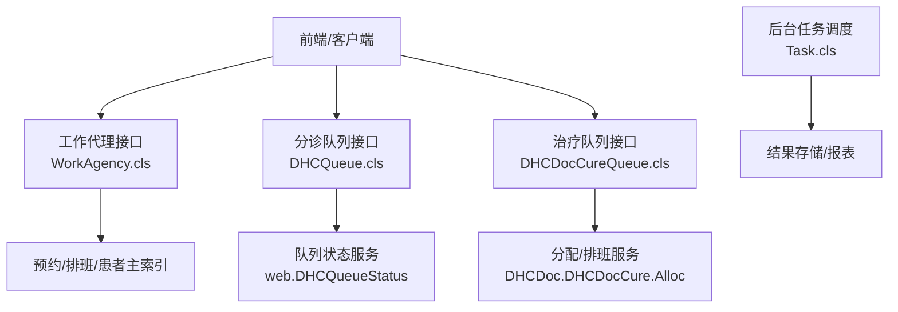
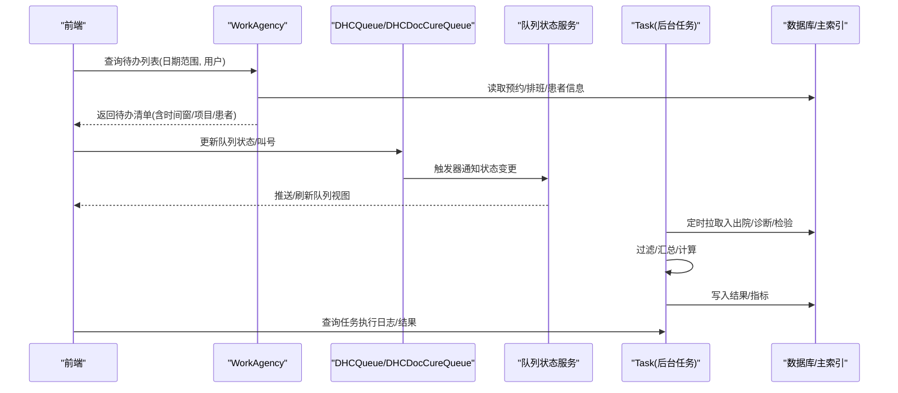
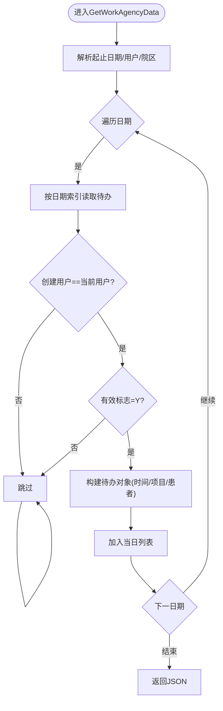
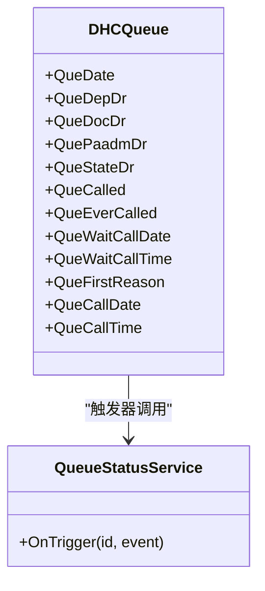
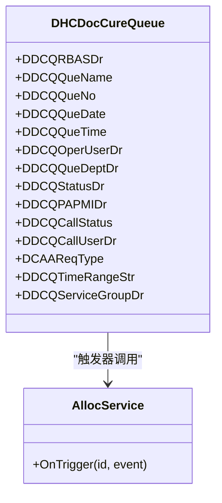
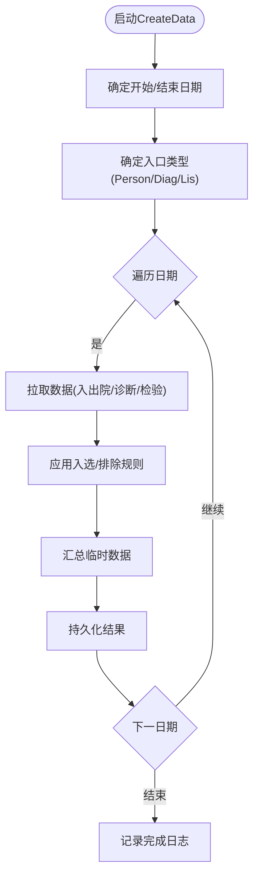
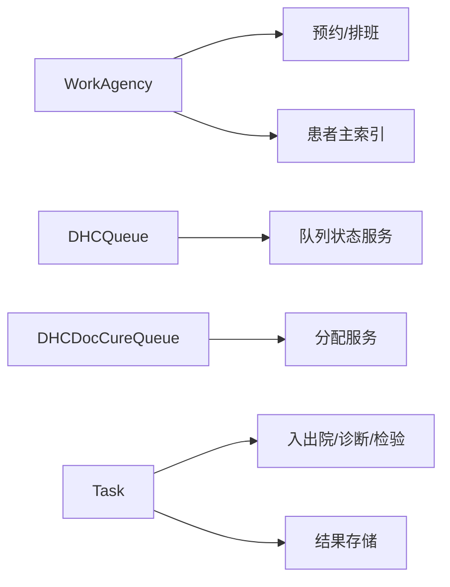

# 工作列表接口

<cite>
**本文引用的文件**
- [WorkAgency.cls](file://src/backend/doc-ws/DHCDoc/OPDoc/WorkAgency.cls)
- [DHCQueue.cls](file://src/backend/triage-ws/User/DHCQueue.cls)
- [DHCDocCureQueue.cls](file://src/backend/cure-ws/User/DHCDocCureQueue.cls)
- [Task.cls](file://src/backend/pilot-project-ws/DHCDoc/GCPSW/BS/Task.cls)
</cite>

## 目录
1. [简介](#简介)
2. [项目结构](#项目结构)
3. [核心组件](#核心组件)
4. [架构总览](#架构总览)
5. [详细组件分析](#详细组件分析)
6. [依赖关系分析](#依赖关系分析)
7. [性能考虑](#性能考虑)
8. [故障排查指南](#故障排查指南)
9. [结论](#结论)
10. [附录：API调用示例与最佳实践](#附录api调用示例与最佳实践)

## 简介
本文件面向“工作列表”相关能力，覆盖患者工作列表、任务列表、待办事项等核心功能。重点说明：
- 列表数据的筛选条件、排序规则、分页加载策略
- 不同角色（医生、护士）的工作列表差异与权限控制要点
- 与工作流引擎的集成关系和任务调度机制
- 实时数据更新与消息推送的实现方式
- 常见场景的API调用示例（列表查询、状态更新、批量操作）

## 项目结构
围绕工作列表的后端实现主要分布在以下模块：
- 门诊待办与工作代理：doc-ws/DHCDoc/OPDoc/WorkAgency.cls
- 分诊队列：triage-ws/User/DHCQueue.cls
- 治疗队列：cure-ws/User/DHCDocCureQueue.cls
- 批处理任务（科研/统计类）：pilot-project-ws/DHCDoc/GCPSW/BS/Task.cls

图表来源
- [WorkAgency.cls:1-641](file://src/backend/doc-ws/DHCDoc/OPDoc/WorkAgency.cls#L1-L641)
- [DHCQueue.cls:1-457](file://src/backend/triage-ws/User/DHCQueue.cls#L1-L457)
- [DHCDocCureQueue.cls:1-320](file://src/backend/cure-ws/User/DHCDocCureQueue.cls#L1-L320)
- [Task.cls:1-800](file://src/backend/pilot-project-ws/DHCDoc/GCPSW/BS/Task.cls#L1-L800)

章节来源
- [WorkAgency.cls:1-641](file://src/backend/doc-ws/DHCDoc/OPDoc/WorkAgency.cls#L1-L641)
- [DHCQueue.cls:1-457](file://src/backend/triage-ws/User/DHCQueue.cls#L1-L457)
- [DHCDocCureQueue.cls:1-320](file://src/backend/cure-ws/User/DHCDocCureQueue.cls#L1-L320)
- [Task.cls:1-800](file://src/backend/pilot-project-ws/DHCDoc/GCPSW/BS/Task.cls#L1-L800)

## 核心组件
- 工作代理（待办事项）：提供按日期范围、用户维度的待办聚合、详情获取、保存与取消等操作，支撑医生/护士工作台展示与交互。
- 分诊队列：维护门诊分诊排队、叫号、状态流转，支持多索引查询与触发器联动状态服务。
- 治疗队列：维护治疗预约排队、呼叫状态、服务组关联，支持按日期/科室/患者等多维度检索。
- 批处理任务：按项目配置周期扫描入出院、诊断、检验数据，生成指标/结果并持久化，供报表或任务列表消费。

章节来源
- [WorkAgency.cls:1-641](file://src/backend/doc-ws/DHCDoc/OPDoc/WorkAgency.cls#L1-L641)
- [DHCQueue.cls:1-457](file://src/backend/triage-ws/User/DHCQueue.cls#L1-L457)
- [DHCDocCureQueue.cls:1-320](file://src/backend/cure-ws/User/DHCDocCureQueue.cls#L1-L320)
- [Task.cls:1-800](file://src/backend/pilot-project-ws/DHCDoc/GCPSW/BS/Task.cls#L1-L800)

## 架构总览
工作列表由“业务实体 + 队列/待办 + 状态服务 + 任务调度”构成：
- 业务实体：预约、排班、患者主索引、医嘱/检查/检验等
- 队列/待办：分诊队列、治疗队列、工作代理（待办）
- 状态服务：队列状态变更触发器驱动的状态同步
- 任务调度：后台任务按配置周期拉取数据、计算、落库

图表来源
- [WorkAgency.cls:1-641](file://src/backend/doc-ws/DHCDoc/OPDoc/WorkAgency.cls#L1-L641)
- [DHCQueue.cls:102-121](file://src/backend/triage-ws/User/DHCQueue.cls#L102-L121)
- [DHCDocCureQueue.cls:83-101](file://src/backend/cure-ws/User/DHCDocCureQueue.cls#L83-L101)
- [Task.cls:43-94](file://src/backend/pilot-project-ws/DHCDoc/GCPSW/BS/Task.cls#L43-L94)

## 详细组件分析

### 工作代理（待办事项）接口
职责
- 按日期范围与当前用户聚合待办记录，返回结构化JSON
- 根据待办ID获取明细（时间段、项目、患者信息）
- 保存/更新待办（关联预约ID、时间段、项目）
- 取消待办（校验可撤销性后回滚预约并标记无效）

关键方法
- GetWorkAgencyData：按起止日期、用户、院区聚合待办，逐日遍历索引，过滤创建人、有效标志、预约状态，组装对象列表
- GetAgencyObjById：根据待办ID解析时间段、项目描述、预约状态、患者基本信息
- SaveWorkAgency：插入或更新待办记录（包含创建/更新时间与用户）
- CancelAgency：校验可撤销后，先取消预约再标记待办为无效

筛选与排序
- 筛选：日期范围、创建用户、有效标志、预约状态
- 排序：按日期顺序遍历；如需更复杂排序可在前端或扩展层实现

分页
- 当前实现按天循环遍历，未内置页码参数；可通过日期分段+前端分页模拟

权限控制
- 通过创建用户与当前登录用户匹配进行行级过滤
- 取消操作需校验预约可撤销逻辑（内部调用预约取消前置检查）

实时性与消息
- 待办本身不直接触发队列状态服务；若与预约强绑定，建议结合预约状态变更事件进行刷新

图表来源
- [WorkAgency.cls:10-56](file://src/backend/doc-ws/DHCDoc/OPDoc/WorkAgency.cls#L10-L56)
- [WorkAgency.cls:64-114](file://src/backend/doc-ws/DHCDoc/OPDoc/WorkAgency.cls#L64-L114)
- [WorkAgency.cls:485-514](file://src/backend/doc-ws/DHCDoc/OPDoc/WorkAgency.cls#L485-L514)
- [WorkAgency.cls:607-638](file://src/backend/doc-ws/DHCDoc/OPDoc/WorkAgency.cls#L607-L638)

章节来源
- [WorkAgency.cls:10-641](file://src/backend/doc-ws/DHCDoc/OPDoc/WorkAgency.cls#L10-L641)

### 分诊队列接口
职责
- 维护门诊分诊排队、叫号、状态流转
- 提供多维度索引（日期、科室、医生、患者、房间等）
- 通过触发器联动队列状态服务，保证状态一致性

关键字段
- 日期、科室、医生、患者、编号、状态、是否被呼叫过、等待呼叫时间、优先原因、呼叫时间等

触发器与状态服务
- 插入/更新后触发 web.DHCQueueStatus.OnTrigger，用于状态同步与后续流程推进

图表来源
- [DHCQueue.cls:1-121](file://src/backend/triage-ws/User/DHCQueue.cls#L1-L121)

章节来源
- [DHCQueue.cls:1-457](file://src/backend/triage-ws/User/DHCQueue.cls#L1-L457)

### 治疗队列接口
职责
- 维护治疗预约排队、呼叫状态、服务组关联
- 支持按日期/科室/患者/排班资源等多维度查询
- 通过触发器联动分配服务，保障队列与排班一致性

关键字段
- 预约排班、患者姓名、排队序号、预约日期/时间、操作医生、治疗科室、状态及变更时间、呼叫状态/用户、请求类型、时间段占用、服务组等

图表来源
- [DHCDocCureQueue.cls:1-101](file://src/backend/cure-ws/User/DHCDocCureQueue.cls#L1-L101)

章节来源
- [DHCDocCureQueue.cls:1-320](file://src/backend/cure-ws/User/DHCDocCureQueue.cls#L1-L320)

### 后台任务（批处理）接口
职责
- 按项目配置的时间窗口，周期性拉取入出院、诊断、检验数据
- 基于配置进行入选/排除过滤，汇总并持久化结果
- 记录滚动日志，支持失败重试与全量重算

关键流程
- CreateData：确定时间范围、入口类型（个人/诊断/检验），记录日志，循环日期拉取数据，汇总并存储
- FliterPerson/FliterDiag/FliterLis：依据性别、年龄、身高体重、BMI、诊断编码、检验项值等进行筛选
- SummaryData/StorageData：汇总临时数据并写入结果表

图表来源
- [Task.cls:43-94](file://src/backend/pilot-project-ws/DHCDoc/GCPSW/BS/Task.cls#L43-L94)
- [Task.cls:522-593](file://src/backend/pilot-project-ws/DHCDoc/GCPSW/BS/Task.cls#L522-L593)
- [Task.cls:693-743](file://src/backend/pilot-project-ws/DHCDoc/GCPSW/BS/Task.cls#L693-L743)

章节来源
- [Task.cls:1-800](file://src/backend/pilot-project-ws/DHCDoc/GCPSW/BS/Task.cls#L1-L800)

## 依赖关系分析
- WorkAgency 依赖预约/排班与患者主索引，用于构建待办详情
- DHCQueue/DHCDocCureQueue 依赖队列状态服务与分配服务，确保状态一致
- Task 依赖入出院、诊断、检验数据源，输出结果供报表/任务列表消费
- 各队列均定义丰富索引以优化查询性能

图表来源
- [WorkAgency.cls:64-114](file://src/backend/doc-ws/DHCDoc/OPDoc/WorkAgency.cls#L64-L114)
- [DHCQueue.cls:102-121](file://src/backend/triage-ws/User/DHCQueue.cls#L102-L121)
- [DHCDocCureQueue.cls:83-101](file://src/backend/cure-ws/User/DHCDocCureQueue.cls#L83-L101)
- [Task.cls:43-94](file://src/backend/pilot-project-ws/DHCDoc/GCPSW/BS/Task.cls#L43-L94)

章节来源
- [WorkAgency.cls:1-641](file://src/backend/doc-ws/DHCDoc/OPDoc/WorkAgency.cls#L1-L641)
- [DHCQueue.cls:1-457](file://src/backend/triage-ws/User/DHCQueue.cls#L1-L457)
- [DHCDocCureQueue.cls:1-320](file://src/backend/cure-ws/User/DHCDocCureQueue.cls#L1-L320)
- [Task.cls:1-800](file://src/backend/pilot-project-ws/DHCDoc/GCPSW/BS/Task.cls#L1-L800)

## 性能考虑
- 索引利用：队列与待办均定义复合索引（如日期+科室、日期+患者、医生等），建议查询尽量命中索引字段
- 分页策略：待办按天遍历，适合小范围日期查询；大范围建议前端分页或后端扩展分页接口
- 触发器开销：队列状态变更触发外部服务，注意避免高频抖动；必要时加防抖或合并通知
- 任务批处理：后台任务按日期循环，建议在低峰期执行，并合理设置时间窗口与重试策略

## 故障排查指南
- 待办为空或数量异常
  - 检查起止日期与用户匹配是否正确
  - 确认待办有效标志与预约状态
  - 参考：[WorkAgency.cls:10-56](file://src/backend/doc-ws/DHCDoc/OPDoc/WorkAgency.cls#L10-L56)
- 队列状态不同步
  - 检查触发器是否成功调用状态服务
  - 参考：[DHCQueue.cls:102-121](file://src/backend/triage-ws/User/DHCQueue.cls#L102-L121)、[DHCDocCureQueue.cls:83-101](file://src/backend/cure-ws/User/DHCDocCureQueue.cls#L83-L101)
- 任务执行失败或重复执行
  - 查看任务日志与滚动日志，确认上次完成时间与是否强制重载
  - 参考：[Task.cls:751-800](file://src/backend/pilot-project-ws/DHCDoc/GCPSW/BS/Task.cls#L751-L800)

章节来源
- [WorkAgency.cls:10-641](file://src/backend/doc-ws/DHCDoc/OPDoc/WorkAgency.cls#L10-L641)
- [DHCQueue.cls:102-121](file://src/backend/triage-ws/User/DHCQueue.cls#L102-L121)
- [DHCDocCureQueue.cls:83-101](file://src/backend/cure-ws/User/DHCDocCureQueue.cls#L83-L101)
- [Task.cls:751-800](file://src/backend/pilot-project-ws/DHCDoc/GCPSW/BS/Task.cls#L751-L800)

## 结论
工作列表能力由“待办、队列、任务”三部分组成，分别服务于医生/护士日常操作、门诊与治疗流程推进以及后台数据加工。通过合理的筛选、索引与触发器机制，系统实现了高效的数据访问与状态同步。未来可扩展分页、统一权限模型与消息推送通道，进一步提升用户体验与系统可观测性。

## 附录：API调用示例与最佳实践

- 查询待办列表（按日期范围与用户）
  - 输入：StartDate、EndDate、UserID、HospitalId
  - 输出：JSON，包含每日待办计数与列表
  - 参考路径：[WorkAgency.cls:10-56](file://src/backend/doc-ws/DHCDoc/OPDoc/WorkAgency.cls#L10-L56)

- 获取待办明细（按待办ID）
  - 输入：WARowid、HospitalId
  - 输出：待办对象（时间窗、项目、预约状态、患者信息）
  - 参考路径：[WorkAgency.cls:64-114](file://src/backend/doc-ws/DHCDoc/OPDoc/WorkAgency.cls#L64-L114)

- 保存/更新待办（关联预约）
  - 输入：WARowid/APPTRowid、WADate、StartTime、EndTime、TreatStr、ExpStr
  - 行为：插入或更新待办记录
  - 参考路径：[WorkAgency.cls:485-514](file://src/backend/doc-ws/DHCDoc/OPDoc/WorkAgency.cls#L485-L514)

- 取消待办（并回滚预约）
  - 输入：WARowid、UserID
  - 行为：校验可撤销后取消预约，标记待办无效
  - 参考路径：[WorkAgency.cls:607-638](file://src/backend/doc-ws/DHCDoc/OPDoc/WorkAgency.cls#L607-L638)

- 队列状态更新（分诊/治疗）
  - 输入：队列ID、新状态、操作人
  - 行为：更新队列状态并触发状态服务
  - 参考路径：[DHCQueue.cls:102-121](file://src/backend/triage-ws/User/DHCQueue.cls#L102-L121)、[DHCDocCureQueue.cls:83-101](file://src/backend/cure-ws/User/DHCDocCureQueue.cls#L83-L101)

- 后台任务执行（生成指标/结果）
  - 输入：ProjectID、ReLoad、AllFlag
  - 行为：按配置时间窗口拉取数据、过滤、汇总、存储
  - 参考路径：[Task.cls:43-94](file://src/backend/pilot-project-ws/DHCDoc/GCPSW/BS/Task.cls#L43-L94)

最佳实践
- 列表查询优先使用索引字段（日期、科室、医生、患者）
- 大范围查询采用分段+前端分页
- 状态变更走触发器链路，避免绕过
- 后台任务在低峰期执行，合理设置重试与日志