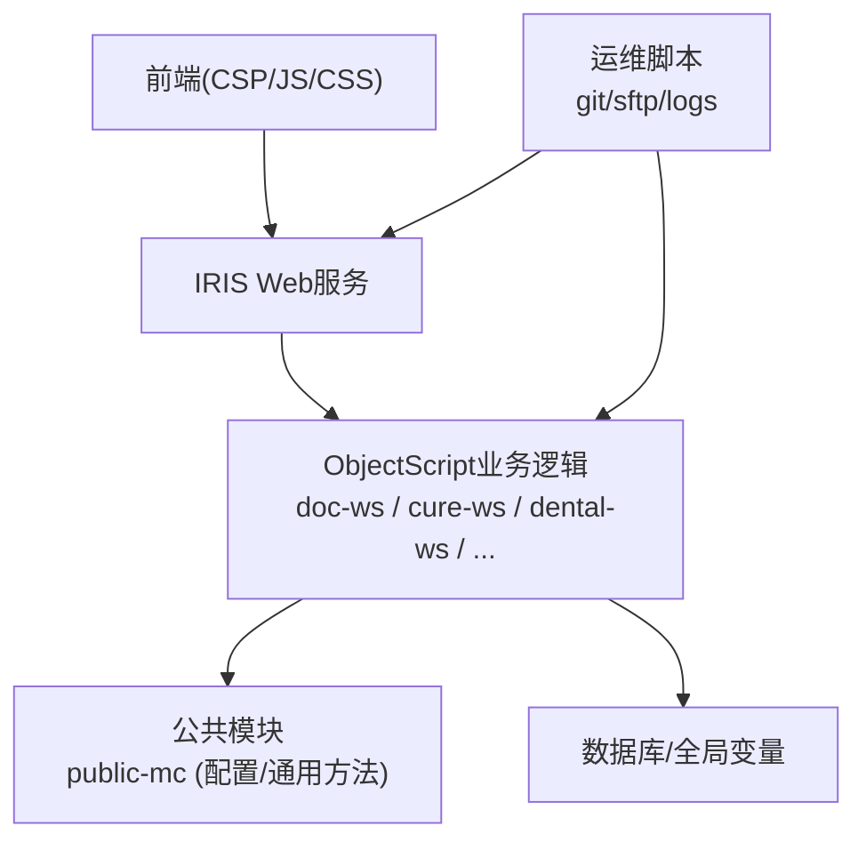
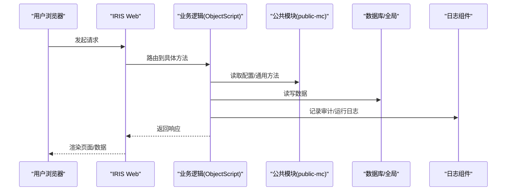
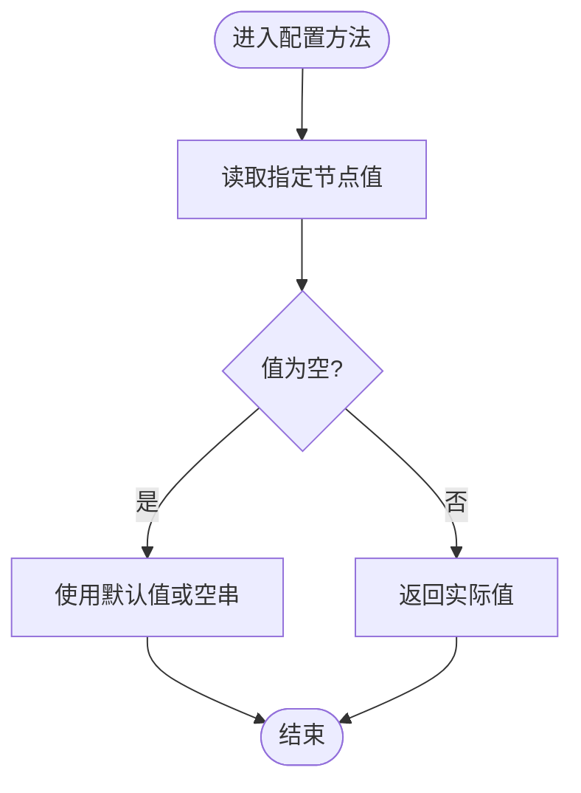
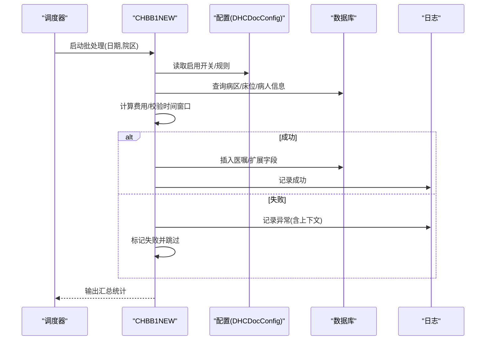
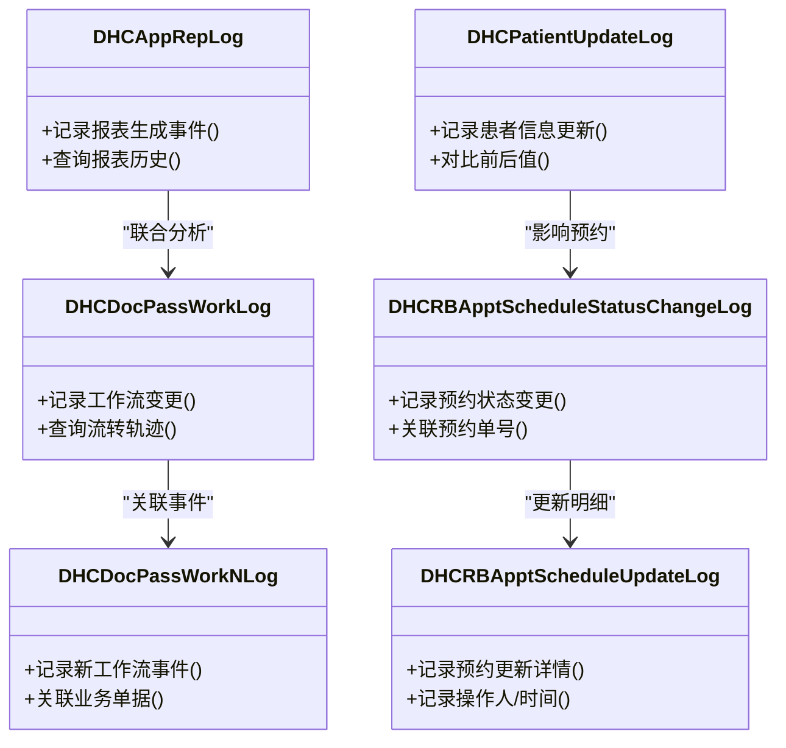
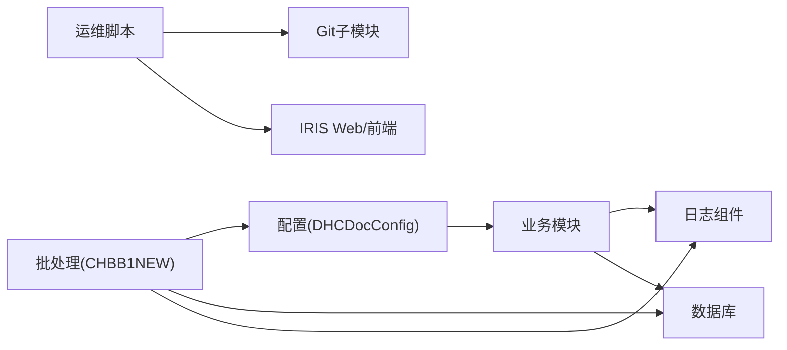

# 故障排除

<cite>
**本文引用的文件**
- [README.md](file://README.md)
- [DHCDocConfig.mac](file://src/backend/public-mc/DHCDocConfig.mac)
- [CHBB1NEW.mac](file://src/backend/public-mc/CHBB1NEW.mac)
- [DHCAppRepLog.cls](file://src/backend/doc-ws/User/DHCAppRepLog.cls)
- [DHCDocPassWorkLog.cls](file://src/backend/doc-ws/User/DHCDocPassWorkLog.cls)
- [DHCDocPassWorkNLog.cls](file://src/backend/doc-ws/User/DHCDocPassWorkNLog.cls)
- [DHCPatientUpdateLog.cls](file://src/backend/epmi-mc/web/DHCBL/Patient/DHCPatientUpdateLog.cls)
- [DHCRBApptScheduleStatusChangeLog.cls](file://src/backend/opadm-mc/User/DHCRBApptScheduleStatusChangeLog.cls)
- [DHCRBApptScheduleUpdateLog.cls](file://src/backend/opadm-mc/User/DHCRBApptScheduleUpdateLog.cls)
- [get-all-logs.js](file://scripts/get-all-logs.js)
</cite>

## 目录
1. [简介](#简介)
2. [项目结构](#项目结构)
3. [核心组件](#核心组件)
4. [架构总览](#架构总览)
5. [详细组件分析](#详细组件分析)
6. [依赖分析](#依赖分析)
7. [性能注意事项](#性能注意事项)
8. [故障排查指南](#故障排查指南)
9. [结论](#结论)
10. [附录](#附录)

## 简介
本故障排除文档面向IRIS HIS系统（后端基于InterSystems IRIS ObjectScript，前端为CSP+jQuery）的运维与开发人员，聚焦以下目标：
- 环境配置问题、部署失败、运行时错误、性能问题的定位与解决
- 日志分析方法、错误代码含义、调试工具使用
- 紧急恢复流程、数据备份恢复、系统重启操作指南
- 问题报告模板、问题分类标准与升级流程
- 预防性维护建议与最佳实践

## 项目结构
- 后端：ObjectScript类与宏程序，按产品域划分（医生工作站、治疗、牙科、分诊、门诊挂号、患者主索引等），公共能力集中在public-mc
- 前端：CSP页面与静态资源，通过脚本统一上传至服务器Web路径
- 脚本：Git多仓库管理、日志聚合、编码转换、SFTP同步等辅助工具

**图表来源**
- [README.md:1-549](file://README.md#L1-L549)

**章节来源**
- [README.md:1-549](file://README.md#L1-L549)

## 核心组件
- 配置中心：提供系统级配置读取与写入，支撑各模块行为开关与参数化
- 批处理与计费：床位费、占床/包床费用计算与医嘱生成，含异常记录与重试保护
- 日志体系：跨模块的审计与运行日志，便于问题回溯与合规审计
- 运维脚本：批量拉取、提交MR、日志聚合、编码转换、SFTP同步

**章节来源**
- [DHCDocConfig.mac:1-119](file://src/backend/public-mc/DHCDocConfig.mac#L1-L119)
- [CHBB1NEW.mac:1-684](file://src/backend/public-mc/CHBB1NEW.mac#L1-L684)
- [DHCAppRepLog.cls](file://src/backend/doc-ws/User/DHCAppRepLog.cls)
- [DHCDocPassWorkLog.cls](file://src/backend/doc-ws/User/DHCDocPassWorkLog.cls)
- [DHCDocPassWorkNLog.cls](file://src/backend/doc-ws/User/DHCDocPassWorkNLog.cls)
- [DHCPatientUpdateLog.cls](file://src/backend/epmi-mc/web/DHCBL/Patient/DHCPatientUpdateLog.cls)
- [DHCRBApptScheduleStatusChangeLog.cls](file://src/backend/opadm-mc/User/DHCRBApptScheduleStatusChangeLog.cls)
- [DHCRBApptScheduleUpdateLog.cls](file://src/backend/opadm-mc/User/DHCRBApptScheduleUpdateLog.cls)
- [get-all-logs.js](file://scripts/get-all-logs.js)

## 架构总览
IRIS HIS采用“前端CSP + IRIS Web + ObjectScript业务 + 公共模块”的分层架构。关键链路包括：
- 前端请求经IRIS Web路由到对应ObjectScript类或宏程序
- 业务逻辑调用公共配置与数据访问，必要时触发批处理任务
- 批处理任务将结果落库并生成审计日志
- 运维脚本用于部署、同步、日志聚合与版本管理

**图表来源**
- [README.md:1-549](file://README.md#L1-L549)
- [DHCDocConfig.mac:1-119](file://src/backend/public-mc/DHCDocConfig.mac#L1-L119)
- [CHBB1NEW.mac:1-684](file://src/backend/public-mc/CHBB1NEW.mac#L1-L684)

## 详细组件分析

### 配置中心（DHCDocConfig）
- 职责：集中管理系统配置项，支持按节点/院区维度获取配置；提供日期时间、当前医院、授权检查等通用方法
- 关键点：
  - 配置存储于全局节点，避免硬编码
  - 提供保存/获取/枚举/清理等方法，便于动态调整
  - 与业务模块解耦，降低耦合度

**图表来源**
- [DHCDocConfig.mac:1-119](file://src/backend/public-mc/DHCDocConfig.mac#L1-L119)

**章节来源**
- [DHCDocConfig.mac:1-119](file://src/backend/public-mc/DHCDocConfig.mac#L1-L119)

### 床位费批处理（CHBB1NEW）
- 职责：每日滚动床位费、占床/包床费用计算与医嘱生成；包含重复检测、时间窗口校验、异常记录与回滚
- 关键点：
  - 使用全局变量记录批次执行状态，防止重复执行
  - 对床位类型、收费项目、年龄、入院原因等进行条件判断
  - 异常捕获并写入日志，保证批处理健壮性
  - 与医保审批、保险覆盖标志联动，确保计费正确

**图表来源**
- [CHBB1NEW.mac:1-684](file://src/backend/public-mc/CHBB1NEW.mac#L1-L684)
- [DHCDocConfig.mac:1-119](file://src/backend/public-mc/DHCDocConfig.mac#L1-L119)

**章节来源**
- [CHBB1NEW.mac:1-684](file://src/backend/public-mc/CHBB1NEW.mac#L1-L684)
- [DHCDocConfig.mac:1-119](file://src/backend/public-mc/DHCDocConfig.mac#L1-L119)

### 日志体系
- 报表日志：记录报表生成与导出过程，便于追踪数据源与耗时
- 工作流日志：记录医生站工作流变更、审核、流转等关键动作
- 患者主索引日志：记录患者信息更新轨迹，满足审计要求
- 预约日志：记录门诊预约状态变更与更新，便于排班问题定位

**图表来源**
- [DHCAppRepLog.cls](file://src/backend/doc-ws/User/DHCAppRepLog.cls)
- [DHCDocPassWorkLog.cls](file://src/backend/doc-ws/User/DHCDocPassWorkLog.cls)
- [DHCDocPassWorkNLog.cls](file://src/backend/doc-ws/User/DHCDocPassWorkNLog.cls)
- [DHCPatientUpdateLog.cls](file://src/backend/epmi-mc/web/DHCBL/Patient/DHCPatientUpdateLog.cls)
- [DHCRBApptScheduleStatusChangeLog.cls](file://src/backend/opadm-mc/User/DHCRBApptScheduleStatusChangeLog.cls)
- [DHCRBApptScheduleUpdateLog.cls](file://src/backend/opadm-mc/User/DHCRBApptScheduleUpdateLog.cls)

**章节来源**
- [DHCAppRepLog.cls](file://src/backend/doc-ws/User/DHCAppRepLog.cls)
- [DHCDocPassWorkLog.cls](file://src/backend/doc-ws/User/DHCDocPassWorkLog.cls)
- [DHCDocPassWorkNLog.cls](file://src/backend/doc-ws/User/DHCDocPassWorkNLog.cls)
- [DHCPatientUpdateLog.cls](file://src/backend/epmi-mc/web/DHCBL/Patient/DHCPatientUpdateLog.cls)
- [DHCRBApptScheduleStatusChangeLog.cls](file://src/backend/opadm-mc/User/DHCRBApptScheduleStatusChangeLog.cls)
- [DHCRBApptScheduleUpdateLog.cls](file://src/backend/opadm-mc/User/DHCRBApptScheduleUpdateLog.cls)

### 运维脚本（日志聚合）
- 功能：聚合根仓库与各子模块的提交历史，支持按日期范围、作者过滤，便于追溯问题引入点
- 使用场景：定位某次变更是否导致线上问题，快速缩小范围

**章节来源**
- [get-all-logs.js](file://scripts/get-all-logs.js)

## 依赖分析
- 配置依赖：业务模块普遍依赖DHCDocConfig进行参数化控制，若配置缺失或不一致会导致行为异常
- 批处理依赖：CHBB1NEW依赖配置开关、基础数据（床位类型、收费项目）、医保审批标志，任一缺失都会影响计费
- 日志依赖：各模块通过日志组件记录关键事件，便于问题回溯；日志缺失会影响排障效率
- 脚本依赖：运维脚本依赖Git子模块初始化与正确的远程地址，否则无法拉取/推送/创建MR

**图表来源**
- [DHCDocConfig.mac:1-119](file://src/backend/public-mc/DHCDocConfig.mac#L1-L119)
- [CHBB1NEW.mac:1-684](file://src/backend/public-mc/CHBB1NEW.mac#L1-L684)
- [README.md:1-549](file://README.md#L1-L549)

**章节来源**
- [DHCDocConfig.mac:1-119](file://src/backend/public-mc/DHCDocConfig.mac#L1-L119)
- [CHBB1NEW.mac:1-684](file://src/backend/public-mc/CHBB1NEW.mac#L1-L684)
- [README.md:1-549](file://README.md#L1-L549)

## 性能注意事项
- 批处理时段：床位费批处理在夜间执行，需关注执行时长与并发冲突
- 配置读取：频繁读取配置应缓存或批量获取，减少全局节点访问开销
- 日志写入：高并发场景下注意日志落盘性能，避免阻塞主流程
- 数据库访问：优化SQL与索引，减少全表扫描与锁竞争

[本节为通用指导，不直接分析具体文件]

## 故障排查指南

### 环境配置问题
- 症状：前端无法访问、后端编译失败、命名空间连接异常
- 排查步骤：
  - 核对VS Code中IRIS服务器连接、命名空间、端口与实例名
  - 确认SFTP通道配置与remotePath映射正确
  - 验证ObjectScript扩展导出路径与编译命名空间一致
- 参考：
  - 服务器路径与SFTP通道映射
  - ObjectScript连接与导出设置

**章节来源**
- [README.md:98-206](file://README.md#L98-L206)

### 部署失败
- 症状：前端文件未生效、CSP未编译、后端类未加载
- 排查步骤：
  - 使用封装脚本上传前端文件到服务器Web路径
  - 编译CSP文件使页面生效
  - 批量上传并编译ObjectScript类与宏程序
- 参考：
  - 前端上传与CSP编译命令
  - 后端批量加载与编译命令

**章节来源**
- [README.md:256-277](file://README.md#L256-L277)

### 运行时错误
- 症状：页面报错、接口超时、批处理中断
- 排查步骤：
  - 查看批处理全局记录与异常日志，定位失败条目
  - 检查配置项是否缺失或非法
  - 复核数据一致性（如床位类型、收费项目是否存在）
- 参考：
  - 批处理异常记录与日志写入
  - 配置读取与校验

**章节来源**
- [CHBB1NEW.mac:162-167](file://src/backend/public-mc/CHBB1NEW.mac#L162-L167)
- [DHCDocConfig.mac:1-119](file://src/backend/public-mc/DHCDocConfig.mac#L1-L119)

### 性能问题
- 症状：页面加载慢、批处理耗时过长、数据库锁等待
- 排查步骤：
  - 分析日志中的耗时与错误堆栈
  - 检查批处理是否重复执行或卡住
  - 评估SQL执行计划与索引使用情况
- 参考：
  - 日志聚合与提交历史检索，辅助定位变更引入的性能退化

**章节来源**
- [get-all-logs.js](file://scripts/get-all-logs.js)

### 日志分析方法
- 批处理日志：查看全局批次记录，识别失败条目与原因
- 业务日志：通过报表、工作流、患者更新、预约日志等模块定位问题链
- 提交历史：结合脚本聚合提交，关联问题出现时间与变更内容

**章节来源**
- [CHBB1NEW.mac:1-684](file://src/backend/public-mc/CHBB1NEW.mac#L1-L684)
- [DHCAppRepLog.cls](file://src/backend/doc-ws/User/DHCAppRepLog.cls)
- [DHCDocPassWorkLog.cls](file://src/backend/doc-ws/User/DHCDocPassWorkLog.cls)
- [DHCDocPassWorkNLog.cls](file://src/backend/doc-ws/User/DHCDocPassWorkNLog.cls)
- [DHCPatientUpdateLog.cls](file://src/backend/epmi-mc/web/DHCBL/Patient/DHCPatientUpdateLog.cls)
- [DHCRBApptScheduleStatusChangeLog.cls](file://src/backend/opadm-mc/User/DHCRBApptScheduleStatusChangeLog.cls)
- [DHCRBApptScheduleUpdateLog.cls](file://src/backend/opadm-mc/User/DHCRBApptScheduleUpdateLog.cls)
- [get-all-logs.js](file://scripts/get-all-logs.js)

### 错误代码含义
- 批处理错误：全局批次记录中包含错误描述与上下文，便于快速定位
- 配置错误：配置缺失或格式不正确导致业务分支异常
- 数据不一致：床位类型、收费项目不存在或关联关系错误

**章节来源**
- [CHBB1NEW.mac:194-230](file://src/backend/public-mc/CHBB1NEW.mac#L194-L230)
- [DHCDocConfig.mac:1-119](file://src/backend/public-mc/DHCDocConfig.mac#L1-L119)

### 调试工具的使用
- 日志聚合脚本：按日期与作者筛选提交历史，辅助定位问题引入点
- VS Code ObjectScript扩展：直接编译与调试后端代码
- SFTP脚本：统一上传前端资源，确保本地与服务端一致

**章节来源**
- [get-all-logs.js](file://scripts/get-all-logs.js)
- [README.md:151-206](file://README.md#L151-L206)
- [README.md:256-277](file://README.md#L256-L277)

### 紧急恢复流程
- 数据备份恢复：
  - 在执行任何恢复前，先对当前数据进行快照备份
  - 根据问题范围选择局部恢复或全量恢复
  - 恢复后验证关键业务数据一致性
- 系统重启：
  - 优先重启IRIS实例以释放会话与锁
  - 若仍异常，考虑重启Web服务与相关中间件
  - 重启后观察批处理与关键接口是否正常
- 回滚策略：
  - 通过Git子模块回滚到稳定版本
  - 重新编译并部署前后端代码
  - 验证回归测试用例

[本节为通用操作指南，不直接分析具体文件]

### 问题报告模板
- 基本信息：问题标题、发生时间、影响范围、复现步骤
- 环境信息：IRIS版本、命名空间、服务器IP、前端版本
- 日志附件：批处理日志、业务日志、提交历史片段
- 期望与现状：期望行为与实际表现差异
- 初步分析：已排查的配置、数据、日志线索

[本节为通用模板，不直接分析具体文件]

### 问题分类标准
- 环境类：连接、权限、端口、证书
- 部署类：上传失败、编译错误、CSP未生效
- 业务类：计费错误、医嘱生成失败、数据不一致
- 性能类：慢查询、锁等待、内存不足
- 安全类：越权访问、敏感数据泄露

[本节为通用分类，不直接分析具体文件]

### 升级流程
- 提测：使用批量MR脚本创建dev→test合并请求，自动冲突检测
- 验证：在测试环境验证功能与回归用例
- 发布：生产环境灰度发布，监控关键指标
- 回滚：出现问题立即回滚到上一稳定版本

**章节来源**
- [README.md:390-445](file://README.md#L390-L445)

### 预防性维护建议与最佳实践
- 定期巡检：检查批处理执行结果与日志告警
- 配置治理：集中管理配置项，避免分散修改
- 数据质量：建立数据校验规则，防止脏数据引发异常
- 性能基线：建立性能基准，监控趋势变化
- 演练预案：定期进行恢复演练，确保流程熟练

[本节为通用建议，不直接分析具体文件]

## 结论
本故障排除文档围绕IRIS HIS系统的配置、部署、运行与性能等方面提供了系统化的排查方法与操作指南。通过配置中心、批处理与日志体系的协同，结合运维脚本与最佳实践，可有效提升问题定位效率与系统稳定性。建议在团队内推广标准化流程与预案演练，持续优化系统可靠性。

[本节为总结，不直接分析具体文件]

## 附录
- 常用命令与路径：
  - 前端上传与CSP编译
  - 后端批量加载与编译
  - 日志聚合与提交历史检索
- 关键文件路径：
  - 配置中心：DHCDocConfig.mac
  - 批处理：CHBB1NEW.mac
  - 日志组件：各模块日志类
  - 运维脚本：get-all-logs.js

**章节来源**
- [README.md:256-277](file://README.md#L256-L277)
- [get-all-logs.js](file://scripts/get-all-logs.js)
- [DHCDocConfig.mac:1-119](file://src/backend/public-mc/DHCDocConfig.mac#L1-L119)
- [CHBB1NEW.mac:1-684](file://src/backend/public-mc/CHBB1NEW.mac#L1-L684)