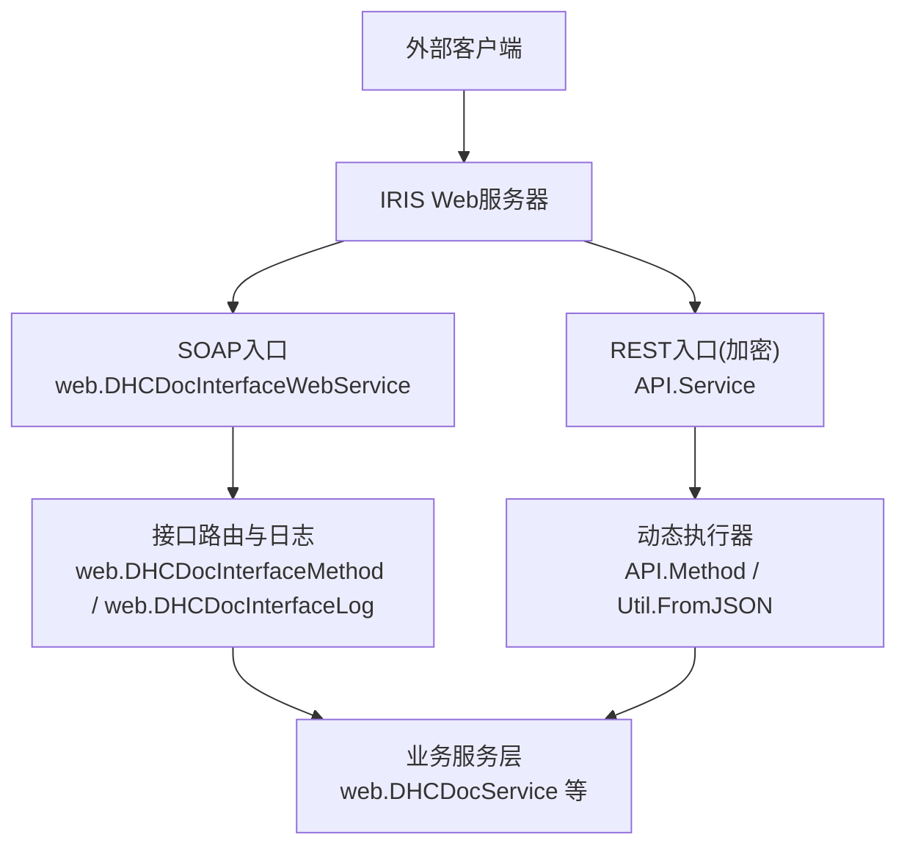
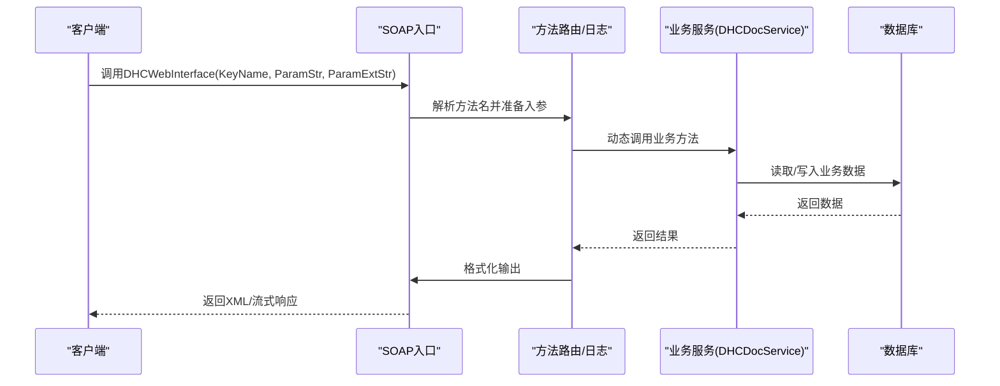
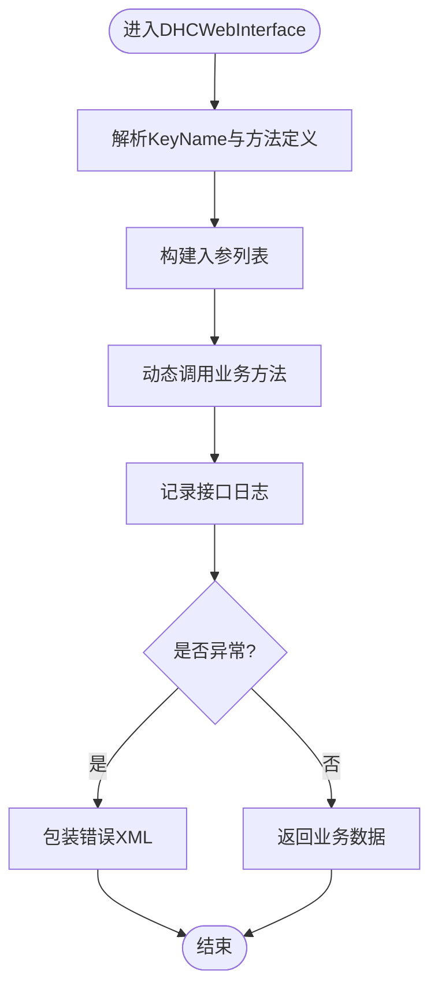
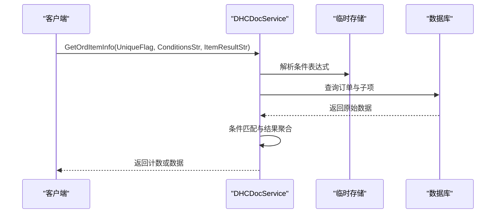
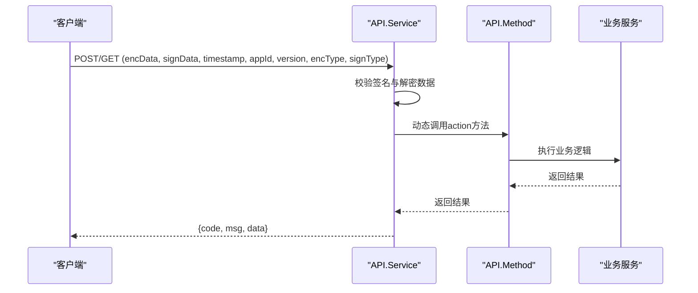
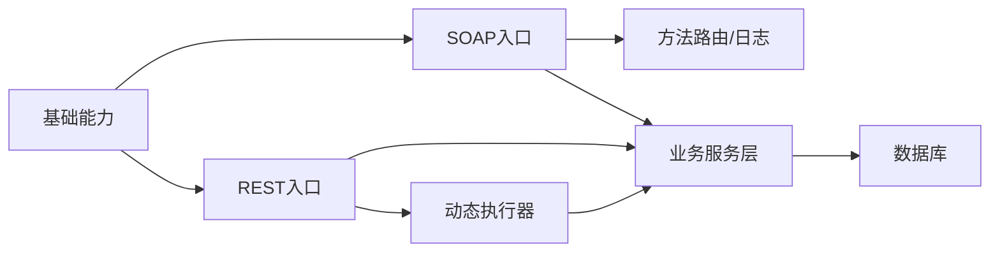

# Web服务接口

<cite>
**本文引用的文件**
- [README.md](file://README.md)
- [DHCDocInterfaceWebService.cls](file://src/backend/public-mc/web/DHCDocInterfaceWebService.cls)
- [DHCDocService.cls](file://src/backend/public-mc/web/DHCDocService.cls)
- [Base.cls](file://src/backend/conting-ws/DHCDoc/Interface/StandAlone/Base.cls)
- [Method.cls](file://src/backend/conting-ws/DHCDoc/Interface/StandAlone/API/Method.cls)
- [Service.cls](file://src/backend/conting-ws/DHCDoc/Interface/StandAlone/API/Service.cls)
</cite>

## 目录
1. [简介](#简介)
2. [项目结构](#项目结构)
3. [核心组件](#核心组件)
4. [架构总览](#架构总览)
5. [详细组件分析](#详细组件分析)
6. [依赖关系分析](#依赖关系分析)
7. [性能考虑](#性能考虑)
8. [故障排查指南](#故障排查指南)
9. [结论](#结论)
10. [附录](#附录)

## 简介
本文件面向“Web服务接口”的对外能力，聚焦以CSP页面为入口的HTTP/WebService接口规范。内容涵盖：
- HTTP请求方法、URL模式、请求参数与响应格式
- 认证机制、会话管理、错误处理与状态码说明
- API调用示例（成功/失败）
- 接口版本兼容性、速率限制与安全考虑
- 与后端业务逻辑的调用关系和数据流转过程

本项目后端基于InterSystems IRIS ObjectScript，提供两类对外接口：
- SOAP WebService统一入口：用于外部系统通过SOAP协议调用HIS能力
- REST风格加密接口：应急系统对接HIS的REST入口，采用SM4/SM3加签与加密

## 项目结构
- 后端代码位于 src/backend，按产品域划分（如 doc-ws、cure-ws、public-mc 等）
- 公共Web服务入口在 public-mc/web 下，提供统一的SOAP WebService与通用工具类
- 应急系统独立REST入口在 conting-ws/DHCDoc/Interface/StandAlone/API 下，提供加密传输与动态路由执行

图表来源
- [DHCDocInterfaceWebService.cls:18-53](file://src/backend/public-mc/web/DHCDocInterfaceWebService.cls#L18-L53)
- [Service.cls:9-36](file://src/backend/conting-ws/DHCDoc/Interface/StandAlone/API/Service.cls#L9-L36)
- [Method.cls:16-37](file://src/backend/conting-ws/DHCDoc/Interface/StandAlone/API/Method.cls#L16-L37)

章节来源
- [README.md:1-549](file://README.md#L1-L549)

## 核心组件
- SOAP统一入口：web.DHCDocInterfaceWebService，负责接收SOAP请求、解析方法名、动态调用业务方法、格式化输出并记录接口日志
- 业务服务层：web.DHCDocService，提供大量医生站相关查询与操作接口（如医嘱查询、转科复制、用药记录等）
- 应急REST入口：DHCDoc.Interface.StandAlone.API.Service，负责接收加密POST/GET请求，校验签名与解密数据，动态调用具体action方法
- 基础能力：Base.cls提供会话串获取、日期时间转换、配置读取、错误码翻译等通用能力

章节来源
- [DHCDocInterfaceWebService.cls:18-84](file://src/backend/public-mc/web/DHCDocInterfaceWebService.cls#L18-L84)
- [DHCDocService.cls:1-800](file://src/backend/public-mc/web/DHCDocService.cls#L1-L800)
- [Base.cls:21-175](file://src/backend/conting-ws/DHCDoc/Interface/StandAlone/Base.cls#L21-L175)
- [Service.cls:9-155](file://src/backend/conting-ws/DHCDoc/Interface/StandAlone/API/Service.cls#L9-L155)

## 架构总览
整体流程分为两条主线：
- SOAP主线：客户端→IRIS Web→SOAP入口→方法路由→业务服务→返回结果→接口日志
- REST加密主线：客户端→IRIS Web→REST入口→签名校验/解密→动态执行action→业务服务→返回结果

图表来源
- [DHCDocInterfaceWebService.cls:18-53](file://src/backend/public-mc/web/DHCDocInterfaceWebService.cls#L18-L53)
- [DHCDocService.cls:88-113](file://src/backend/public-mc/web/DHCDocService.cls#L88-L113)

## 详细组件分析

### SOAP统一入口（web.DHCDocInterfaceWebService）
- 作用：为HIS对外提供统一的SOAP服务入口，支持动态方法调用与输出格式化
- 关键方法：
  - DHCWebInterface：接收KeyName、ParamStr、ParamExtStr，动态组装调用，记录日志，格式化输出
  - FormatOutPut：将失败信息包装为标准XML或保持原始对象
- 输入参数：
  - KeyName：接口代码（对应Doc_InterfaceMethod表中的methodCode）
  - ParamStr：主入参（字符串或流）
  - ParamExtStr：扩展入参（可选）
- 输出格式：
  - 成功：直接返回业务方法的结果（可能为对象或流）
  - 失败：返回包含错误码与描述的标准XML片段
- 错误处理：
  - 捕获异常后统一格式化输出，便于客户端识别
- 日志记录：
  - 每次调用均保存接口日志，便于审计与排障

图表来源
- [DHCDocInterfaceWebService.cls:18-84](file://src/backend/public-mc/web/DHCDocInterfaceWebService.cls#L18-L84)

章节来源
- [DHCDocInterfaceWebService.cls:18-84](file://src/backend/public-mc/web/DHCDocInterfaceWebService.cls#L18-L84)

### 业务服务层（web.DHCDocService）
- 作用：提供医生站相关的查询与操作能力，如医嘱查询、转科复制、住院用药记录等
- 典型方法：
  - GetOrdItemInfo：根据唯一标识、条件表达式与结果条件串，统计符合条件的医嘱项数量
  - CopyTransDepOrder：将转出科室医嘱复制到转入科室，并停止原医嘱
  - IPUseDrugRecordExecute/Fetch/Close：分页查询住院用药记录
- 数据流转：
  - 解析条件表达式到临时存储
  - 遍历订单与子项，匹配条件并聚合结果
  - 返回计数或数据集

图表来源
- [DHCDocService.cls:88-113](file://src/backend/public-mc/web/DHCDocService.cls#L88-L113)
- [DHCDocService.cls:115-414](file://src/backend/public-mc/web/DHCDocService.cls#L115-L414)

章节来源
- [DHCDocService.cls:88-414](file://src/backend/public-mc/web/DHCDocService.cls#L88-L414)

### 应急REST入口（API.Service）
- 作用：为应急系统提供REST风格的加密接口，支持动态action调用
- 关键方法：
  - Excute：接收JSON数据，解析action与data，动态调用对应方法
  - GenUrl：生成加密链接（GET）或加密参数（POST），使用SM4加密与SM3签名
  - SynData/SaveExpLog/CheckIsValid/MacRegister：具体业务方法封装
- 输入参数：
  - JSON格式：包含action、data等字段
  - GET/POST：支持两种提交方式
- 输出格式：
  - 统一JSON：code、msg、data
- 安全机制：
  - SM4加密数据
  - SM3签名校验
  - 时间戳防重放

图表来源
- [Service.cls:9-36](file://src/backend/conting-ws/DHCDoc/Interface/StandAlone/API/Service.cls#L9-L36)
- [Service.cls:116-133](file://src/backend/conting-ws/DHCDoc/Interface/StandAlone/API/Service.cls#L116-L133)
- [Method.cls:16-37](file://src/backend/conting-ws/DHCDoc/Interface/StandAlone/API/Method.cls#L16-L37)

章节来源
- [Service.cls:9-155](file://src/backend/conting-ws/DHCDoc/Interface/StandAlone/API/Service.cls#L9-L155)
- [Method.cls:16-92](file://src/backend/conting-ws/DHCDoc/Interface/StandAlone/API/Method.cls#L16-L92)

### 基础能力（Base.cls）
- 作用：提供会话串、日期时间转换、配置读取、错误码翻译等通用能力
- 关键方法：
  - %SessionStr：获取当前会话串（兼容不同HIS版本）
  - %ZD/%ZT：日期时间格式转换
  - %GetConfig：读取系统配置节点
  - %GetHisVersion：获取HIS版本
- 适用场景：
  - 跨版本兼容
  - 统一会话上下文
  - 标准化错误信息

章节来源
- [Base.cls:21-175](file://src/backend/conting-ws/DHCDoc/Interface/StandAlone/Base.cls#L21-L175)

## 依赖关系分析
- SOAP入口依赖方法路由与日志记录，最终调用业务服务层
- REST入口依赖动态执行器与加密工具，最终调用业务服务层
- 业务服务层依赖数据库与临时存储进行数据处理
- 基础能力被多个组件复用，提升一致性

图表来源
- [DHCDocInterfaceWebService.cls:18-53](file://src/backend/public-mc/web/DHCDocInterfaceWebService.cls#L18-L53)
- [Service.cls:9-36](file://src/backend/conting-ws/DHCDoc/Interface/StandAlone/API/Service.cls#L9-L36)
- [Base.cls:21-175](file://src/backend/conting-ws/DHCDoc/Interface/StandAlone/Base.cls#L21-L175)

章节来源
- [DHCDocInterfaceWebService.cls:18-53](file://src/backend/public-mc/web/DHCDocInterfaceWebService.cls#L18-L53)
- [Service.cls:9-36](file://src/backend/conting-ws/DHCDoc/Interface/StandAlone/API/Service.cls#L9-L36)
- [Base.cls:21-175](file://src/backend/conting-ws/DHCDoc/Interface/StandAlone/Base.cls#L21-L175)

## 性能考虑
- 批量数据下载：REST入口支持分块读取流，避免一次性加载大数据导致内存溢出
- 条件查询优化：业务服务层将条件表达式解析到临时存储，减少重复计算
- 日志记录：所有接口调用均记录日志，建议在生产环境合理配置日志级别与保留策略
- 并发控制：未实现显式限流，建议在网关层或应用层增加速率限制

[本节为通用指导，无需特定文件引用]

## 故障排查指南
- SOAP接口失败：检查FormatOutPut返回的错误XML，确认KeyName是否正确，查看接口日志
- REST接口失败：检查signData与timestamp是否有效，确认AppSecret与AppId配置正确
- 业务逻辑错误：查看业务服务层返回的具体错误信息，结合数据库状态进行定位
- 会话问题：使用Base.cls的%SessionStr获取当前会话串，确认用户登录状态

章节来源
- [DHCDocInterfaceWebService.cls:55-84](file://src/backend/public-mc/web/DHCDocInterfaceWebService.cls#L55-L84)
- [Service.cls:116-133](file://src/backend/conting-ws/DHCDoc/Interface/StandAlone/API/Service.cls#L116-L133)
- [Base.cls:127-148](file://src/backend/conting-ws/DHCDoc/Interface/StandAlone/Base.cls#L127-L148)

## 结论
本项目提供了两套对外接口：
- SOAP统一入口：适合传统系统集成，具备方法路由与日志记录能力
- REST加密入口：适合现代微服务集成，具备签名校验与数据加密能力

建议在实际使用中：
- 明确选择适合的接口类型
- 严格遵循参数规范与安全要求
- 建立完善的监控与日志体系
- 在网关层增加速率限制与访问控制

[本节为总结性内容，无需特定文件引用]

## 附录

### 接口规范速查表

#### SOAP接口
- 方法：DHCWebInterface
- 参数：
  - KeyName：接口代码
  - ParamStr：主入参
  - ParamExtStr：扩展入参（可选）
- 返回：XML或对象

#### REST接口（应急系统）
- URL模式：/imedical/rest/encrypt/DHCDocCESService
- 参数：
  - GET：encData, signData, timestamp, appId, version, encType, signType
  - POST：JSON体包含encData, signData, timestamp, appId, version, encType, signType
- 返回：{code, msg, data}

章节来源
- [DHCDocInterfaceWebService.cls:18-53](file://src/backend/public-mc/web/DHCDocInterfaceWebService.cls#L18-L53)
- [Service.cls:116-133](file://src/backend/conting-ws/DHCDoc/Interface/StandAlone/API/Service.cls#L116-L133)