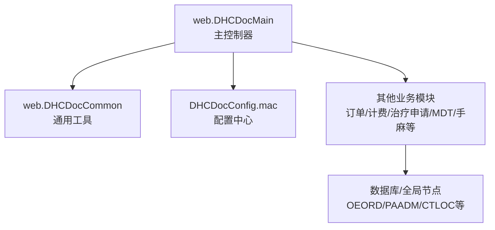
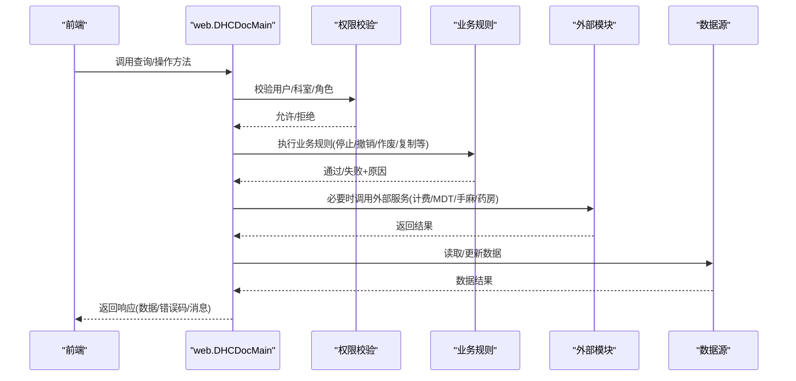
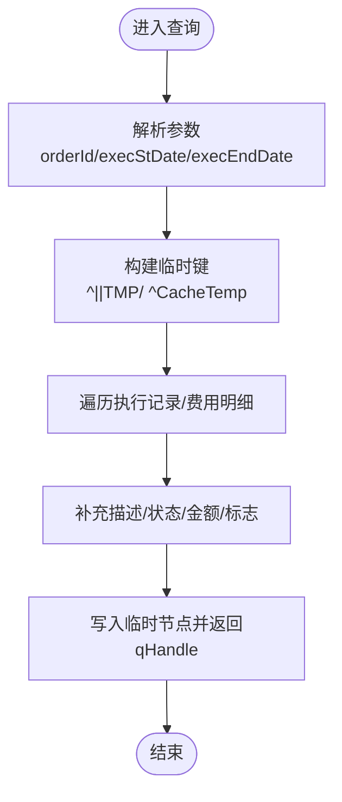
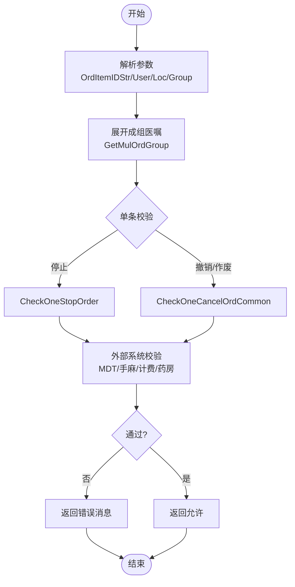
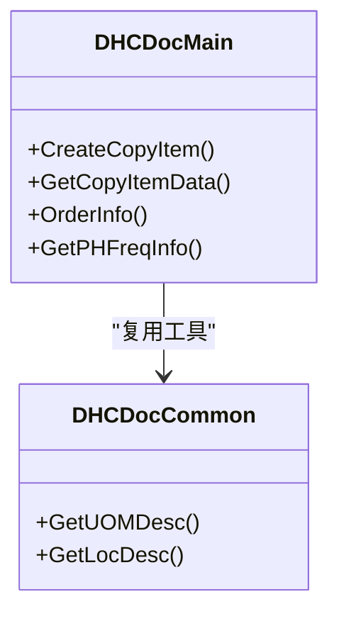
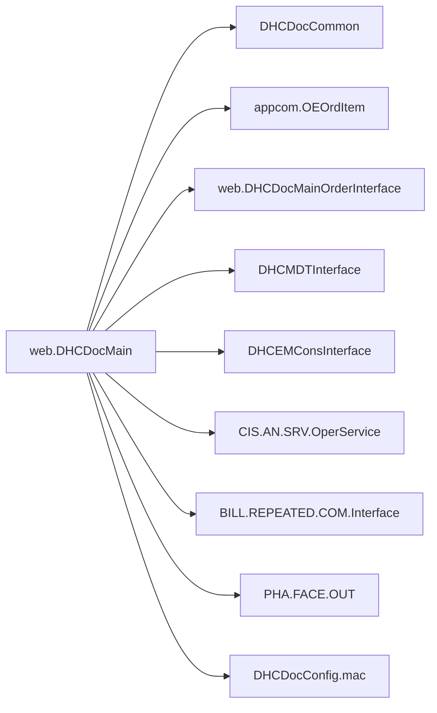

# 主控制器架构

<cite>
**本文引用的文件**
- [DHCDocMain.cls](file://src/backend/doc-ws/web/DHCDocMain.cls)
- [DHCDocConfig.mac](file://src/backend/public-mc/DHCDocConfig.mac)
- [DHCDocCommon.cls](file://src/backend/doc-ws/web/DHCDocCommon.cls)
</cite>

## 目录
1. [简介](#简介)
2. [项目结构](#项目结构)
3. [核心组件](#核心组件)
4. [架构总览](#架构总览)
5. [详细组件分析](#详细组件分析)
6. [依赖关系分析](#依赖关系分析)
7. [性能与缓存](#性能与缓存)
8. [故障排查指南](#故障排查指南)
9. [结论](#结论)
10. [附录：扩展与配置示例](#附录：扩展与配置示例)

## 简介
本文件面向医生工作站主控制器，围绕 web.DHCDocMain 类进行系统化文档化。重点覆盖其设计模式、职责边界、请求处理流程、会话管理、错误处理机制、与其他模块的集成接口与数据交换格式、扩展方法示例、性能优化策略与缓存机制，以及主控制器的配置与监控方法。该控制器是医嘱与患者主数据的统一入口，承担查询编排、权限校验、业务规则执行与跨模块协作等关键职责。

## 项目结构
- 主控制器位于后端 doc-ws/web 下，提供大量 Query/ClassMethod 对外暴露能力，包括患者列表、医嘱信息、执行记录、费用明细、停止/撤销/作废权限校验、复制医嘱、频次与分发时间计算等。
- 配置中心由 DHCDocConfig.mac 提供全局配置读写能力，供控制器在运行时读取或设置行为开关。
- 通用工具与公共逻辑通过 DHCDocCommon.cls 等模块复用，减少重复实现。

**图表来源**
- [DHCDocMain.cls:1-120](file://src/backend/doc-ws/web/DHCDocMain.cls#L1-L120)
- [DHCDocConfig.mac:1-119](file://src/backend/public-mc/DHCDocConfig.mac#L1-L119)

**章节来源**
- [DHCDocMain.cls:1-120](file://src/backend/doc-ws/web/DHCDocMain.cls#L1-L120)
- [DHCDocConfig.mac:1-119](file://src/backend/public-mc/DHCDocConfig.mac#L1-L119)

## 核心组件
- 查询与数据聚合：FindOrderExecDet、FindOrderFee、FindLocDocCurrentAdmExecute、FindDischgAdmProxyExecute、FindCurrentAdmProxyExecute 等，负责从多表/索引中组装结果集并返回给前端。
- 医嘱操作权限与规则：CheckStopOrder、CheckCancelOrder、CheckUnuseOrder、CheckOneStopOrder、CheckOneCancelOrdCommon、ForceDealOrder 等，集中处理停止/撤销/作废的业务规则与权限校验。
- 医嘱复制与展示：CreateCopyItem、GetCopyItemData、OrderInfo、GetPHFreqInfo、MatchAlias 等，用于复制医嘱项、展示医嘱详情与频次信息。
- 会话与上下文：广泛使用 %session.Data("LOGON.*") 获取登录用户、科室、院区等上下文；结合 IsNurseLogin、IsNurseBySessionLoc 判断角色与场景。
- 配置与监控：HandSetConfig、GetUseProgressBarConfig、GetPatListCollapseConfig 等提供界面与行为配置；部分统计信息写入临时节点（如 ^Temp("PatIllTypeCountInfo",job)）便于监控。

**章节来源**
- [DHCDocMain.cls:129-203](file://src/backend/doc-ws/web/DHCDocMain.cls#L129-L203)
- [DHCDocMain.cls:475-766](file://src/backend/doc-ws/web/DHCDocMain.cls#L475-L766)
- [DHCDocMain.cls:781-909](file://src/backend/doc-ws/web/DHCDocMain.cls#L781-L909)
- [DHCDocMain.cls:916-1274](file://src/backend/doc-ws/web/DHCDocMain.cls#L916-L1274)
- [DHCDocMain.cls:1289-1387](file://src/backend/doc-ws/web/DHCDocMain.cls#L1289-L1387)
- [DHCDocMain.cls:1514-1711](file://src/backend/doc-ws/web/DHCDocMain.cls#L1514-L1711)
- [DHCDocMain.cls:1756-2338](file://src/backend/doc-ws/web/DHCDocMain.cls#L1756-L2338)
- [DHCDocMain.cls:2471-2502](file://src/backend/doc-ws/web/DHCDocMain.cls#L2471-L2502)

## 架构总览
主控制器采用“查询编排 + 权限网关 + 规则引擎”的分层模式：
- 查询编排：将复杂的多表关联、过滤、排序封装为 Query/Execute 方法，输出标准化行集。
- 权限网关：所有写操作前调用统一的权限检查方法，确保同一科室、医护类型、绑定关系、结算状态等约束一致。
- 规则引擎：对医嘱生命周期（开立、执行、停止、撤销、作废）进行细粒度规则校验，必要时联动外部子系统（MDT、手麻、计费、药房）。

**图表来源**
- [DHCDocMain.cls:1756-2338](file://src/backend/doc-ws/web/DHCDocMain.cls#L1756-L2338)
- [DHCDocMain.cls:916-1274](file://src/backend/doc-ws/web/DHCDocMain.cls#L916-L1274)

## 详细组件分析

### 查询与数据聚合
- FindOrderExecDetExecute：按医嘱ID与执行时间范围检索执行记录，整合状态、账单、免费标志、退药数量、可执行欠费标志、是否已到达治疗等字段，并通过临时节点 ^CacheTemp 分页输出。
- FindOrderFeeExecute：根据医嘱或执行记录ID查询费用明细，支持多部位检查医嘱串输入，计算金额与退费状态。
- FindLocDocCurrentAdmExecute / FindCurrentAdmProxyExecute：按病区/医生/日期/床号等多维度筛选当前在院病人，支持护士视角与曾转科病人视图，输出包含押金、费用、余额、病危等级颜色等综合信息。
- FindDischgAdmProxyExecute：出院病人列表查询，支持按病区链接、医生、天数等条件。

**图表来源**
- [DHCDocMain.cls:9-127](file://src/backend/doc-ws/web/DHCDocMain.cls#L9-L127)
- [DHCDocMain.cls:134-203](file://src/backend/doc-ws/web/DHCDocMain.cls#L134-L203)
- [DHCDocMain.cls:475-766](file://src/backend/doc-ws/web/DHCDocMain.cls#L475-L766)
- [DHCDocMain.cls:781-909](file://src/backend/doc-ws/web/DHCDocMain.cls#L781-L909)

**章节来源**
- [DHCDocMain.cls:9-127](file://src/backend/doc-ws/web/DHCDocMain.cls#L9-L127)
- [DHCDocMain.cls:134-203](file://src/backend/doc-ws/web/DHCDocMain.cls#L134-L203)
- [DHCDocMain.cls:475-766](file://src/backend/doc-ws/web/DHCDocMain.cls#L475-L766)
- [DHCDocMain.cls:781-909](file://src/backend/doc-ws/web/DHCDocMain.cls#L781-L909)

### 权限与规则校验（停止/撤销/作废）
- CheckStopOrder / CheckOneStopOrder：校验停止权限与时间窗口，考虑预停时间、执行记录冲突、拆账单、会诊/手麻/输血等外部系统状态。
- CheckCancelOrder / CheckUnuseOrder / CheckOneCancelOrdCommon：统一处理撤销/作废规则，涵盖状态机、医护类型、科室绑定、结算阶段、配液/发药/备药状态、高值材料退货确认等。
- ForceDealOrder：在特定配置与场景下允许强制撤销/作废，以处理医技关联导致的无法撤销问题。
- checkOrdGroupRule：成组医嘱操作控制，防止子医嘱单独停止导致不一致。

**图表来源**
- [DHCDocMain.cls:1756-2338](file://src/backend/doc-ws/web/DHCDocMain.cls#L1756-L2338)
- [DHCDocMain.cls:2997-3043](file://src/backend/doc-ws/web/DHCDocMain.cls#L2997-L3043)

**章节来源**
- [DHCDocMain.cls:1756-2338](file://src/backend/doc-ws/web/DHCDocMain.cls#L1756-L2338)
- [DHCDocMain.cls:2997-3043](file://src/backend/doc-ws/web/DHCDocMain.cls#L2997-L3043)

### 医嘱复制与展示
- CreateCopyItem：抽取原医嘱项的关键属性（用量、单位、频次、用法、时长、包装量、优先级、备注、紧急标志、阶段、流速等），生成可复制的数据串。
- GetCopyItemData：批量复制数据准备，支持主/子医嘱分组与序号重算。
- OrderInfo：组装医嘱展示信息（名称、频次、时长、科室、医生、优先级、通知标志、权限等）。
- GetPHFreqInfo：计算频次与分发时间字符串，支持周频次与空闲时段。

**图表来源**
- [DHCDocMain.cls:1514-1711](file://src/backend/doc-ws/web/DHCDocMain.cls#L1514-L1711)
- [DHCDocMain.cls:1289-1387](file://src/backend/doc-ws/web/DHCDocMain.cls#L1289-L1387)
- [DHCDocCommon.cls:路径待定位]

**章节来源**
- [DHCDocMain.cls:1514-1711](file://src/backend/doc-ws/web/DHCDocMain.cls#L1514-L1711)
- [DHCDocMain.cls:1289-1387](file://src/backend/doc-ws/web/DHCDocMain.cls#L1289-L1387)

### 会话管理与上下文
- 登录上下文：%session.Data("LOGON.USERID/CTLOCID/GROUPID/HOSPID/WARDID") 贯穿权限与规则校验。
- 角色识别：isNurseLogin、IsNurseBySessionLoc 区分护士/医生视角，影响病人列表与操作权限。
- 语言与本地化：%LanguageID() 与翻译函数保证多语言提示。

**章节来源**
- [DHCDocMain.cls:916-945](file://src/backend/doc-ws/web/DHCDocMain.cls#L916-L945)
- [DHCDocMain.cls:321-326](file://src/backend/doc-ws/web/DHCDocMain.cls#L321-L326)
- [DHCDocMain.cls:768-773](file://src/backend/doc-ws/web/DHCDocMain.cls#L768-L773)

### 错误处理机制
- 统一错误消息：使用 %Translate/%FormatTrans/%GetErrCodeMsg 输出本地化错误信息。
- 外部系统联动：当 MDT/手麻/计费/药房等子系统返回不允许时，直接阻断并给出明确原因。
- 状态机保护：依据医嘱状态（V/U/D/E/C/I）与结算阶段（医疗/财务/最终结算）限制操作。

**章节来源**
- [DHCDocMain.cls:1783-1944](file://src/backend/doc-ws/web/DHCDocMain.cls#L1783-L1944)
- [DHCDocMain.cls:2004-2241](file://src/backend/doc-ws/web/DHCDocMain.cls#L2004-L2241)

## 依赖关系分析
- 内部依赖：DHCDocCommon（单位/科室描述）、appcom.OEOrdItem（状态/频次/长期标识）、web.DHCDocMainOrderInterface（患者年龄/出院时间/MR号等）。
- 外部依赖：DHCEMConsInterface（会诊）、DHCMDTInterface（MDT）、CIS.AN.SRV.OperService（手麻）、BILL.REPEATED.COM.Interface（重复收费）、PHA.FACE.OUT（药房/PIVA）。
- 配置依赖：DHCDocConfig.mac 提供全局配置节点，控制器通过 %GetConfig/GetConfigNode 读取。

**图表来源**
- [DHCDocMain.cls:1756-2338](file://src/backend/doc-ws/web/DHCDocMain.cls#L1756-L2338)
- [DHCDocConfig.mac:1-119](file://src/backend/public-mc/DHCDocConfig.mac#L1-L119)

**章节来源**
- [DHCDocMain.cls:1756-2338](file://src/backend/doc-ws/web/DHCDocMain.cls#L1756-L2338)
- [DHCDocConfig.mac:1-119](file://src/backend/public-mc/DHCDocConfig.mac#L1-L119)

## 性能与缓存
- 查询分页与临时节点：使用 ^CacheTemp 与 qHandle 实现分页输出，避免一次性加载大数据集。
- 中间结果缓存：^||OrderByBed/^||OrderByNullBed 用于床号排序与空床合并，提升列表渲染效率。
- 统计信息缓存：^Temp("PatIllTypeCountInfo",job) 存储病危等级统计，减少重复计算。
- 配置驱动优化：通过配置节点控制是否启用进度条、收起列表等行为，平衡用户体验与性能。

**章节来源**
- [DHCDocMain.cls:475-766](file://src/backend/doc-ws/web/DHCDocMain.cls#L475-L766)
- [DHCDocMain.cls:916-1274](file://src/backend/doc-ws/web/DHCDocMain.cls#L916-L1274)
- [DHCDocMain.cls:2471-2502](file://src/backend/doc-ws/web/DHCDocMain.cls#L2471-L2502)

## 故障排查指南
- 停止/撤销/作废失败：
  - 检查医嘱状态与结算阶段（医疗/财务/最终结算）。
  - 查看外部系统返回（MDT/手麻/计费/药房）是否阻止操作。
  - 核对成组医嘱规则，确保选择主医嘱或满足允许单独停止配置。
- 查询结果为空：
  - 确认参数（orderId/execStDate/execEndDate/LocID/UserID）是否正确。
  - 检查临时节点 ^CacheTemp 是否被正确填充。
- 权限相关错误：
  - 验证登录上下文（LOGON.USERID/CTLOCID/GROUPID/HOSPID）。
  - 确认医护类型与开单人类型匹配，科室绑定关系符合预期。

**章节来源**
- [DHCDocMain.cls:1756-2338](file://src/backend/doc-ws/web/DHCDocMain.cls#L1756-L2338)
- [DHCDocMain.cls:9-127](file://src/backend/doc-ws/web/DHCDocMain.cls#L9-L127)

## 结论
web.DHCDocMain 作为医生工作站主控制器，承担了患者与医嘱的核心查询、权限与规则校验、跨模块协作等职责。其设计遵循分层与模块化原则，通过配置驱动与临时节点缓存提升性能与可维护性。建议在扩展新功能时遵循现有模式：新增查询方法封装数据聚合，新增写操作前统一走权限与规则校验，必要时联动外部子系统，并使用配置节点控制行为开关。

## 附录：扩展与配置示例
- 扩展查询方法：参考 FindOrderExecDetExecute/FindOrderFeeExecute，定义 Query 与 Execute 方法，使用 ^CacheTemp 与 qHandle 输出分页结果。
- 扩展权限规则：在 CheckOneCancelOrdCommon/CheckOneStopOrder 中添加新的业务分支，结合外部系统接口进行校验。
- 配置示例：
  - 使用 DHCDocConfig.mac 的 saveconfig/getconfignode 等方法读写配置节点。
  - 通过 HandSetConfig 初始化界面与行为配置（如病人列表宽度、费用列表高度、进度条开关等）。

**章节来源**
- [DHCDocMain.cls:9-127](file://src/backend/doc-ws/web/DHCDocMain.cls#L9-L127)
- [DHCDocMain.cls:1756-2338](file://src/backend/doc-ws/web/DHCDocMain.cls#L1756-L2338)
- [DHCDocConfig.mac:1-119](file://src/backend/public-mc/DHCDocConfig.mac#L1-L119)
- [DHCDocMain.cls:2471-2502](file://src/backend/doc-ws/web/DHCDocMain.cls#L2471-L2502)