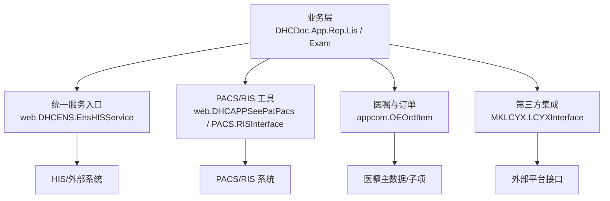
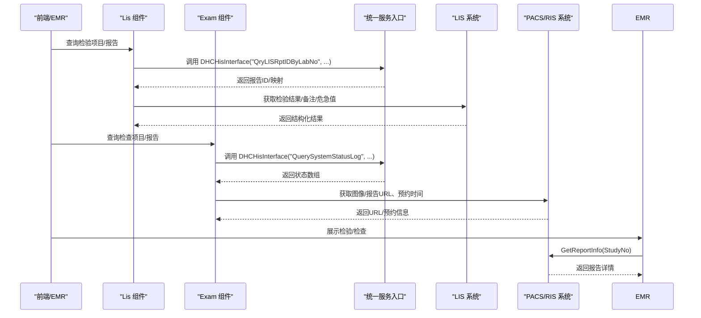
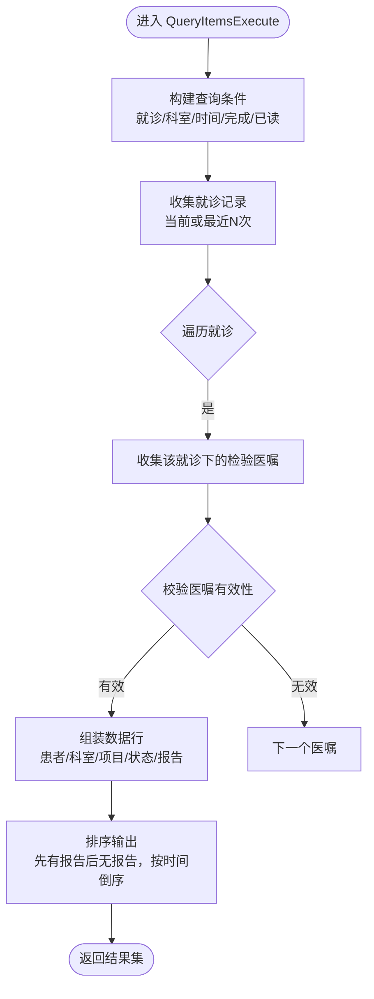
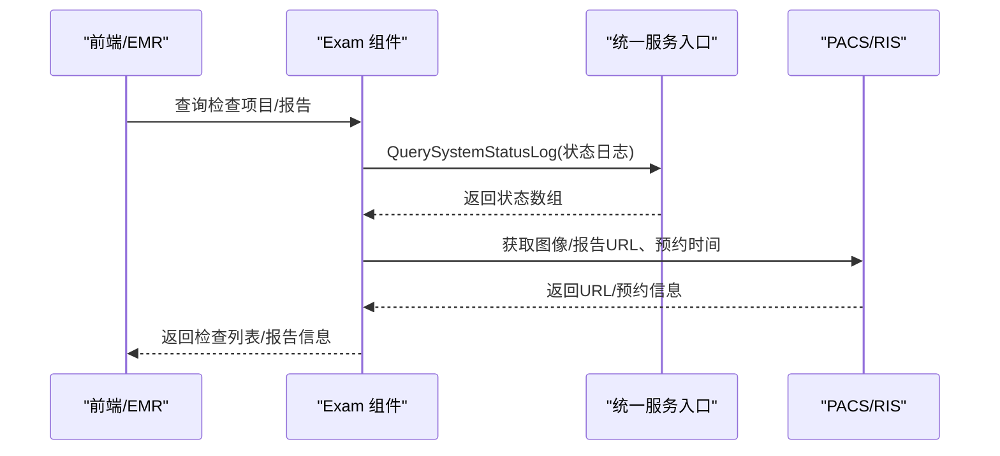
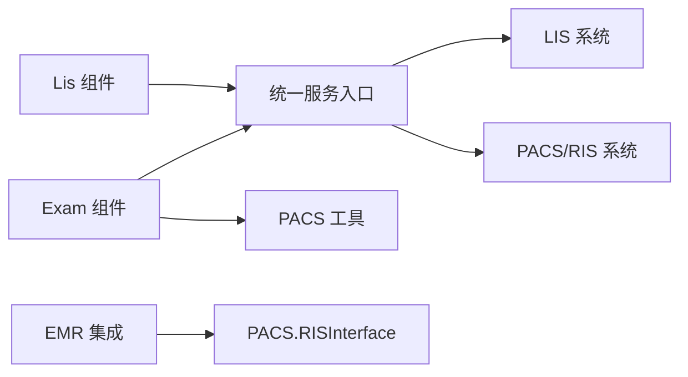

# 检验检查集成

<cite>
**本文引用的文件**
- [Lis.cls](file://src/backend/doc-ws/DHCDoc/App/Rep/Lis.cls)
- [Exam.cls](file://src/backend/doc-ws/DHCDoc/App/Rep/Exam.cls)
- [EMR.cls](file://src/backend/doc-ws/DHCDoc/OPDoc/EMR.cls)
- [OEOrdItem.cls](file://src/backend/doc-ws/appcom/OEOrdItem.cls)
- [LCYXInterface.cls](file://src/backend/doc-ws/MKLCYX/LCYXInterface.cls)
</cite>

## 目录
1. [简介](#简介)
2. [项目结构](#项目结构)
3. [核心组件](#核心组件)
4. [架构总览](#架构总览)
5. [详细组件分析](#详细组件分析)
6. [依赖关系分析](#依赖关系分析)
7. [性能与缓存](#性能与缓存)
8. [故障排查指南](#故障排查指南)
9. [结论](#结论)
10. [附录：接口调用示例与规范](#附录接口调用示例与规范)

## 简介
本文件面向“检验检查集成”场景，围绕 LIS（实验室信息系统）与 PACS/RIS（影像归档与通信系统/放射信息系统）的对接，梳理并说明以下能力：
- 检验申请、检查预约、结果回传、状态跟踪
- 标本信息管理、检查设备调度、报告生成与展示
- 数据传输协议、文件格式规范、加密传输建议
- 异步处理机制与结果缓存策略

本仓库中相关实现以后端类方法为主，通过统一服务入口访问 HIS/外部系统，并在前端页面进行查询与展示。

## 项目结构
- 检验模块：DHCDoc.App.Rep.Lis 提供检验项目的查询、状态、报告信息获取等能力
- 检查模块：DHCDoc.App.Rep.Exam 提供检查申请单、检查号、图像/报告链接、预约时间等信息
- EMR 集成：DHCDoc.OPDoc.EMR 在电子病历中聚合检验/检查数据，并调用外部 RIS 接口获取报告详情
- 医嘱与订单：appcom.OEOrdItem 负责医嘱执行与检验批次生成
- 第三方集成：MKLCYX.LCYXInterface 通过统一服务接口查询 LIS 报告

图表来源
- [Lis.cls:1-686](file://src/backend/doc-ws/DHCDoc/App/Rep/Lis.cls#L1-L686)
- [Exam.cls:1-674](file://src/backend/doc-ws/DHCDoc/App/Rep/Exam.cls#L1-L674)
- [EMR.cls:470-669](file://src/backend/doc-ws/DHCDoc/OPDoc/EMR.cls#L470-L669)
- [OEOrdItem.cls:1627-1627](file://src/backend/doc-ws/appcom/OEOrdItem.cls#L1627-L1627)
- [LCYXInterface.cls:2510-2510](file://src/backend/doc-ws/MKLCYX/LCYXInterface.cls#L2510-L2510)

章节来源
- [Lis.cls:1-686](file://src/backend/doc-ws/DHCDoc/App/Rep/Lis.cls#L1-L686)
- [Exam.cls:1-674](file://src/backend/doc-ws/DHCDoc/App/Rep/Exam.cls#L1-L674)
- [EMR.cls:470-669](file://src/backend/doc-ws/DHCDoc/OPDoc/EMR.cls#L470-L669)
- [OEOrdItem.cls:1627-1627](file://src/backend/doc-ws/appcom/OEOrdItem.cls#L1627-L1627)
- [LCYXInterface.cls:2510-2510](file://src/backend/doc-ws/MKLCYX/LCYXInterface.cls#L2510-L2510)

## 核心组件
- 检验查询与报告：DHCDoc.App.Rep.Lis
  - 支持按就诊、科室、时间、是否完成、是否已读等条件查询检验项目
  - 获取检验报告明细、危急值标记、阅读状态、接收/审核时间
  - 通过统一服务接口查询 LIS 报告 ID、医嘱与报告映射
- 检查查询与报告：DHCDoc.App.Rep.Exam
  - 支持检查申请单、检查号、部位、图像/报告链接、预约时间
  - 获取检查状态数组、是否出报告、是否阳性、是否已读
  - 通过统一服务接口查询检查状态日志
- EMR 集成：DHCDoc.OPDoc.EMR
  - 在 EMR 中拉取检验/检查列表，必要时调用 PACS.RISInterface.GetReportInfo 获取报告详情
- 医嘱与检验批次：appcom.OEOrdItem
  - 生成检验批次（GenerateEpisode），支撑后续 LIS 交互
- 第三方集成：MKLCYX.LCYXInterface
  - 通过统一服务接口查询 LIS 报告 ID

章节来源
- [Lis.cls:1-686](file://src/backend/doc-ws/DHCDoc/App/Rep/Lis.cls#L1-L686)
- [Exam.cls:1-674](file://src/backend/doc-ws/DHCDoc/App/Rep/Exam.cls#L1-L674)
- [EMR.cls:470-669](file://src/backend/doc-ws/DHCDoc/OPDoc/EMR.cls#L470-L669)
- [OEOrdItem.cls:1627-1627](file://src/backend/doc-ws/appcom/OEOrdItem.cls#L1627-L1627)
- [LCYXInterface.cls:2510-2510](file://src/backend/doc-ws/MKLCYX/LCYXInterface.cls#L2510-L2510)

## 架构总览
整体流程分为“申请/预约—执行—结果回传—展示”四个阶段。系统通过统一服务入口与 HIS/外部系统交互，检验与检查分别由 Lis/Exam 组件封装，EMR 作为展示入口之一。

图表来源
- [Lis.cls:154-154](file://src/backend/doc-ws/DHCDoc/App/Rep/Lis.cls#L154-L154)
- [Lis.cls:287-287](file://src/backend/doc-ws/DHCDoc/App/Rep/Lis.cls#L287-L287)
- [Exam.cls:240-240](file://src/backend/doc-ws/DHCDoc/App/Rep/Exam.cls#L240-L240)
- [Exam.cls:338-338](file://src/backend/doc-ws/DHCDoc/App/Rep/Exam.cls#L338-L338)
- [EMR.cls:476-476](file://src/backend/doc-ws/DHCDoc/OPDoc/EMR.cls#L476-L476)

## 详细组件分析

### 检验组件（Lis）
- 功能要点
  - 查询检验项目：支持按就诊、科室、时间、最近N次就诊、是否完成、是否已读等维度过滤
  - 报告信息：获取报告ID、接收/审核时间、异常/危急标记、备注、关联医嘱ID
  - 状态跟踪：通过统一服务接口获取状态日志，解析为可读状态
  - 历史趋势：支持获取某项目的历史结果序列
- 关键方法
  - QueryItemsExecute/QueryItemsFetch：分页查询检验项目
  - GetReportInfo：按检验号获取报告集合及明细
  - GetOrdExamLastStatus：获取最新状态
  - IsCVReport：判断是否存在危急值报告
  - getHistoryRecord：获取历史结果序列

图表来源
- [Lis.cls:11-181](file://src/backend/doc-ws/DHCDoc/App/Rep/Lis.cls#L11-L181)
- [Lis.cls:447-510](file://src/backend/doc-ws/DHCDoc/App/Rep/Lis.cls#L447-L510)
- [Lis.cls:280-303](file://src/backend/doc-ws/DHCDoc/App/Rep/Lis.cls#L280-L303)
- [Lis.cls:569-580](file://src/backend/doc-ws/DHCDoc/App/Rep/Lis.cls#L569-L580)
- [Lis.cls:614-632](file://src/backend/doc-ws/DHCDoc/App/Rep/Lis.cls#L614-L632)

章节来源
- [Lis.cls:1-686](file://src/backend/doc-ws/DHCDoc/App/Rep/Lis.cls#L1-L686)

### 检查组件（Exam）
- 功能要点
  - 查询检查申请单/检查号：支持按就诊、时间、分类、床号等过滤
  - 报告与图像：根据检查号获取报告URL、图像URL、预约时间
  - 状态与阳性：获取状态数组、是否出报告、是否阳性、是否已读
  - 诊断信息：获取检查申请时的诊断描述
- 关键方法
  - QueryItemsExecute/QueryItemsFetch：分页查询检查项目
  - GetReportInfo：按医嘱ID获取报告集合及结构化测量值
  - GetExamLastStatus：获取最新状态
  - ExistIllRep：判断是否存在阳性报告
  - GetExaReqDiagDesc：获取检查申请诊断描述

图表来源
- [Exam.cls:10-270](file://src/backend/doc-ws/DHCDoc/App/Rep/Exam.cls#L10-L270)
- [Exam.cls:315-348](file://src/backend/doc-ws/DHCDoc/App/Rep/Exam.cls#L315-L348)
- [Exam.cls:438-493](file://src/backend/doc-ws/DHCDoc/App/Rep/Exam.cls#L438-L493)

章节来源
- [Exam.cls:1-674](file://src/backend/doc-ws/DHCDoc/App/Rep/Exam.cls#L1-L674)

### EMR 集成与报告详情
- 在 EMR 中，针对检查号调用 PACS.RISInterface.GetReportInfo 获取报告详情
- 同时支持检验结果的查询与展示，结合 LIS 报告ID进行结果拼装

章节来源
- [EMR.cls:470-669](file://src/backend/doc-ws/DHCDoc/OPDoc/EMR.cls#L470-L669)

### 医嘱与检验批次
- 医嘱执行过程中会生成检验批次（GenerateEpisode），用于后续 LIS 交互与结果回传

章节来源
- [OEOrdItem.cls:1627-1627](file://src/backend/doc-ws/appcom/OEOrdItem.cls#L1627-L1627)

### 第三方集成（LCYX）
- 通过统一服务接口查询 LIS 报告ID，便于与其他平台的数据互通

章节来源
- [LCYXInterface.cls:2510-2510](file://src/backend/doc-ws/MKLCYX/LCYXInterface.cls#L2510-L2510)

## 依赖关系分析
- 组件耦合
  - Lis/Exam 均依赖统一服务入口 web.DHCENS.EnsHISService 进行跨系统调用
  - Exam 依赖 web.DHCAPPSeePatPacs 获取 PACS/RIS 的 URL、预约信息等
  - EMR 直接调用 PACS.RISInterface 获取报告详情
- 外部依赖
  - LIS：通过 QryLISRptIDByLabNo、QryLISOrdIDByRpt 等接口获取报告与医嘱映射
  - PACS/RIS：通过 GetReportInfo、GetStudyNoByORORIAndPart 等接口获取报告与图像
- 潜在循环依赖
  - 未发现 Lis/Exam 之间的直接循环引用；主要依赖集中在统一服务入口与外部系统

图表来源
- [Lis.cls:154-154](file://src/backend/doc-ws/DHCDoc/App/Rep/Lis.cls#L154-L154)
- [Exam.cls:240-240](file://src/backend/doc-ws/DHCDoc/App/Rep/Exam.cls#L240-L240)
- [EMR.cls:476-476](file://src/backend/doc-ws/DHCDoc/OPDoc/EMR.cls#L476-L476)

章节来源
- [Lis.cls:1-686](file://src/backend/doc-ws/DHCDoc/App/Rep/Lis.cls#L1-L686)
- [Exam.cls:1-674](file://src/backend/doc-ws/DHCDoc/App/Rep/Exam.cls#L1-L674)
- [EMR.cls:470-669](file://src/backend/doc-ws/DHCDoc/OPDoc/EMR.cls#L470-L669)

## 性能与缓存
- 分页与迭代
  - Lis/Exam 使用 %Query 的分页机制（Execute/Fetch），避免一次性加载大量数据
- 内存缓存
  - EMR 中使用临时全局变量 ^CacheTemp 缓存中间结果，减少重复计算
- 状态缓存
  - 通过统一服务接口获取状态日志，建议在应用层对高频查询做短期缓存（如会话级）
- 建议优化
  - 对 GetReportInfo、GetExamStatusArr 等高开销方法增加本地缓存（基于 LabEpisodeNo/OrdItemID/ExamID）
  - 对 PACS URL 生成结果进行缓存，避免重复拼接参数

章节来源
- [EMR.cls:491-522](file://src/backend/doc-ws/DHCDoc/OPDoc/EMR.cls#L491-L522)
- [EMR.cls:535-604](file://src/backend/doc-ws/DHCDoc/OPDoc/EMR.cls#L535-L604)

## 故障排查指南
- 常见问题定位
  - 报告为空：检查 QryLISRptIDByLabNo 返回值是否为空，确认 LIS 是否已回传
  - 状态不一致：核对 QuerySystemStatusLog 返回的状态数组，确认最终状态
  - 图像/报告URL不可用：检查 PACS 配置与参数拼接（PatientNo/ExamID/OrdItemID）
- 日志与调试
  - 关注临时日志变量（如 ^tmplog）与错误标签（如 $ZT）
  - 使用统一服务接口的返回码与消息进行问题定位
- 恢复策略
  - 重试机制：对网络超时或外部系统繁忙进行指数退避重试
  - 降级策略：当 PACS/LIS 不可用时，仅展示本地缓存与基础信息

章节来源
- [Lis.cls:588-611](file://src/backend/doc-ws/DHCDoc/App/Rep/Lis.cls#L588-L611)
- [EMR.cls:491-522](file://src/backend/doc-ws/DHCDoc/OPDoc/EMR.cls#L491-L522)

## 结论
本仓库通过 Lis/Exam 组件封装了检验与检查的核心能力，借助统一服务入口与 PACS/RIS 系统进行数据交互，并在 EMR 中进行集中展示。建议在生产环境中完善缓存策略、增强错误处理与监控告警，以提升稳定性与用户体验。

## 附录：接口调用示例与规范
以下为常见操作的调用路径与参数说明（以类方法与接口名为准，不直接粘贴代码内容）：

- 检验申请提交
  - 触发点：医嘱执行时生成检验批次
  - 参考路径：[OEOrdItem.cls:1627-1627](file://src/backend/doc-ws/appcom/OEOrdItem.cls#L1627-L1627)
  - 说明：生成检验批次后，LIS 侧将创建样本与项目，等待采集与检测

- 检查预约
  - 触发点：检查申请单创建后，获取检查号与预约时间
  - 参考路径：
    - [Exam.cls:143-143](file://src/backend/doc-ws/DHCDoc/App/Rep/Exam.cls#L143-L143)
    - [Exam.cls:198-198](file://src/backend/doc-ws/DHCDoc/App/Rep/Exam.cls#L198-L198)
  - 说明：通过 PACS 工具获取 StudyNo 与预约时间，用于后续执行与结果回传

- 状态跟踪
  - 检验状态：通过统一服务接口获取状态日志
  - 参考路径：[Lis.cls:287-287](file://src/backend/doc-ws/DHCDoc/App/Rep/Lis.cls#L287-L287)
  - 检查状态：同上，使用状态日志接口
  - 参考路径：[Exam.cls:338-338](file://src/backend/doc-ws/DHCDoc/App/Rep/Exam.cls#L338-L338)

- 结果获取
  - 检验报告：按检验号查询报告ID与明细
  - 参考路径：[Lis.cls:486-494](file://src/backend/doc-ws/DHCDoc/App/Rep/Lis.cls#L486-L494)
  - 检查报告：按医嘱ID查询报告集合与结构化测量值
  - 参考路径：[Exam.cls:474-483](file://src/backend/doc-ws/DHCDoc/App/Rep/Exam.cls#L474-L483)
  - EMR 报告详情：调用 PACS.RISInterface.GetReportInfo
  - 参考路径：[EMR.cls:476-476](file://src/backend/doc-ws/DHCDoc/OPDoc/EMR.cls#L476-L476)

- 数据传输协议与格式
  - 统一服务入口：通过 DHCHisInterface 传递 JSON 流（%Stream.GlobalCharacter）
  - 参考路径：
    - [Lis.cls:285-287](file://src/backend/doc-ws/DHCDoc/App/Rep/Lis.cls#L285-L287)
    - [Exam.cls:336-338](file://src/backend/doc-ws/DHCDoc/App/Rep/Exam.cls#L336-L338)
  - 建议：对外暴露的 REST API 应使用 HTTPS + JWT 鉴权，请求体采用 JSON，响应体包含 code/message/data

- 加密传输
  - 建议：全链路启用 TLS；敏感字段（如患者标识、诊断）在应用层进行加密；签名防篡改

- 异步处理机制
  - 状态日志：通过 QuerySystemStatusLog 异步获取状态变化
  - 参考路径：
    - [Lis.cls:287-287](file://src/backend/doc-ws/DHCDoc/App/Rep/Lis.cls#L287-L287)
    - [Exam.cls:338-338](file://src/backend/doc-ws/DHCDoc/App/Rep/Exam.cls#L338-L338)
  - 建议：引入消息队列（如 RabbitMQ/Kafka）解耦申请与结果回传，提升吞吐与可靠性

- 结果缓存策略
  - 应用层缓存：基于 LabEpisodeNo/OrdItemID/ExamID 缓存报告与状态
  - 临时缓存：EMR 中使用 ^CacheTemp 缓存中间结果
  - 参考路径：[EMR.cls:491-522](file://src/backend/doc-ws/DHCDoc/OPDoc/EMR.cls#L491-L522)