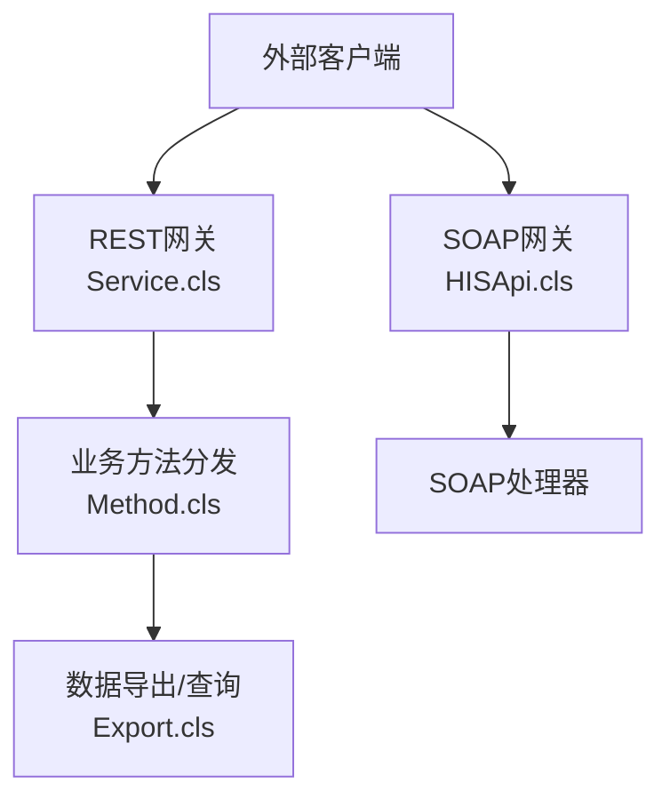
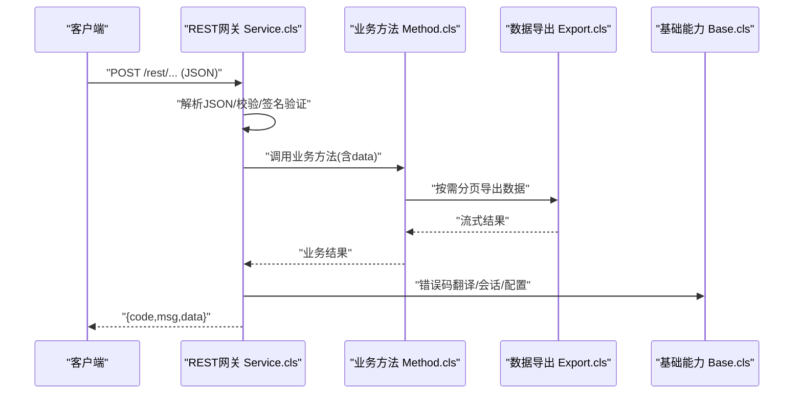
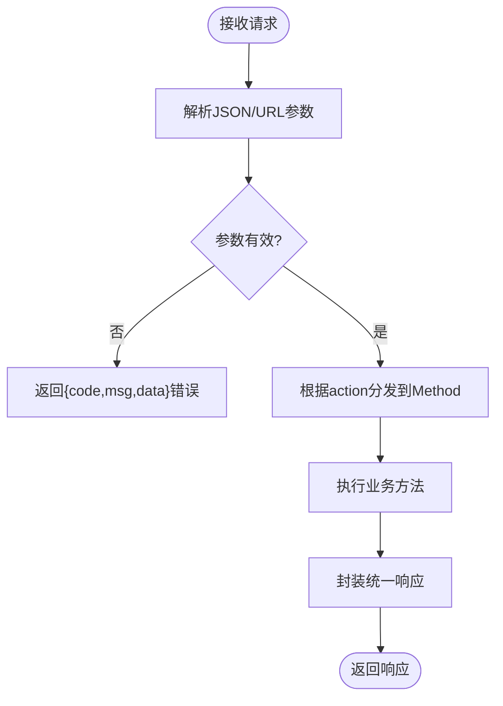
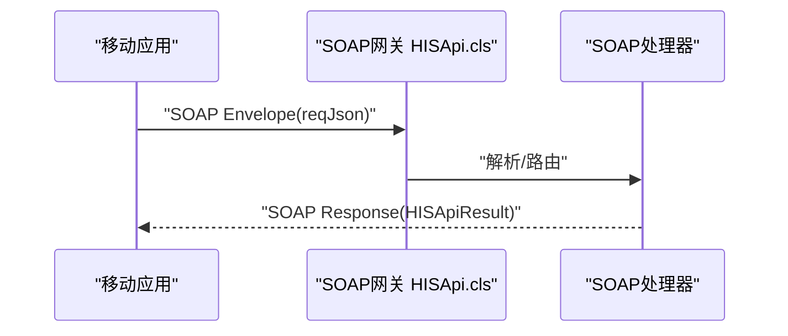
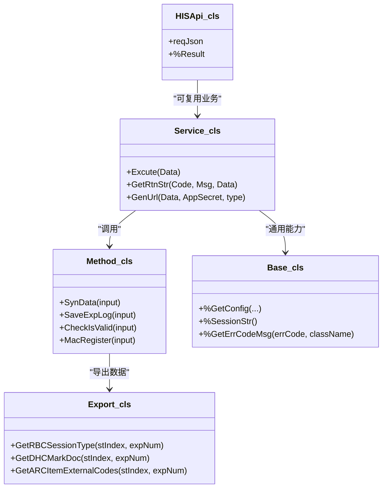

# 消息格式规范

<cite>
**本文引用的文件**
- [Service.cls](file://src/backend/conting-ws/DHCDoc/Interface/StandAlone/API/Service.cls)
- [Method.cls](file://src/backend/conting-ws/DHCDoc/Interface/StandAlone/API/Method.cls)
- [Base.cls](file://src/backend/conting-ws/DHCDoc/Interface/StandAlone/Base.cls)
- [Export.cls](file://src/backend/conting-ws/DHCDoc/Interface/StandAlone/Export.cls)
- [HISApi.cls](file://src/backend/cure-ws/DHCDoc/DHCDocCure/Android/Soap/WebService/HISApi.cls)
</cite>

## 目录
1. [简介](#简介)
2. [项目结构](#项目结构)
3. [核心组件](#核心组件)
4. [架构总览](#架构总览)
5. [详细组件分析](#详细组件分析)
6. [依赖关系分析](#依赖关系分析)
7. [性能考虑](#性能考虑)
8. [故障排查指南](#故障排查指南)
9. [结论](#结论)
10. [附录](#附录)

## 简介
本规范定义系统间通信的消息结构与传输协议，覆盖请求-响应模式、异步处理与事件驱动场景；统一消息头、消息体、错误码与状态码；明确SOAP、REST、WebSocket等协议的接口契约；规定序列化格式（JSON为主，XML用于SOAP）、编码与压缩选项；说明消息路由、负载均衡与故障转移机制；并给出监控、日志记录与审计追踪要求。

## 项目结构
本项目在应急对接与移动端SOAP服务两条主线上提供对外接口：
- 应急系统REST接口：位于“应急-standalone”模块，采用统一的JSON请求体与标准返回结构，支持加密与签名。
- 移动端SOAP接口：位于“cure-ws Android SOAP”模块，基于WSDL描述，使用XML载荷。

**图表来源**
- [Service.cls:1-158](file://src/backend/conting-ws/DHCDoc/Interface/StandAlone/API/Service.cls#L1-L158)
- [Method.cls:1-95](file://src/backend/conting-ws/DHCDoc/Interface/StandAlone/API/Method.cls#L1-L95)
- [Export.cls:1-800](file://src/backend/conting-ws/DHCDoc/Interface/StandAlone/Export.cls#L1-L800)
- [HISApi.cls:1-33](file://src/backend/cure-ws/DHCDoc/DHCDocCure/Android/Soap/WebService/HISApi.cls#L1-L33)

**章节来源**
- [Service.cls:1-158](file://src/backend/conting-ws/DHCDoc/Interface/StandAlone/API/Service.cls#L1-L158)
- [HISApi.cls:1-33](file://src/backend/cure-ws/DHCDoc/DHCDocCure/Android/Soap/WebService/HISApi.cls#L1-L33)

## 核心组件
- REST入口与统一响应：Service.cls负责解析JSON请求、动态调用业务方法、封装统一响应结构（code/msg/data），并提供加密URL生成能力。
- 业务方法实现：Method.cls承载具体业务逻辑（如数据下载、日志写入、终端校验与注册）。
- 基础能力：Base.cls提供配置读取、会话串获取、错误码翻译、日期时间转换等通用能力。
- 数据导出：Export.cls提供按页流式导出数据的能力，供批量同步使用。
- SOAP接口：HISApi.cls定义SOAP消息描述符，包含命名空间、绑定风格与入参/出参字段。

**章节来源**
- [Service.cls:1-158](file://src/backend/conting-ws/DHCDoc/Interface/StandAlone/API/Service.cls#L1-L158)
- [Method.cls:1-95](file://src/backend/conting-ws/DHCDoc/Interface/StandAlone/API/Method.cls#L1-L95)
- [Base.cls:1-199](file://src/backend/conting-ws/DHCDoc/Interface/StandAlone/Base.cls#L1-L199)
- [Export.cls:1-800](file://src/backend/conting-ws/DHCDoc/Interface/StandAlone/Export.cls#L1-L800)
- [HISApi.cls:1-33](file://src/backend/cure-ws/DHCDoc/DHCDocCure/Android/Soap/WebService/HISApi.cls#L1-L33)

## 架构总览
系统采用“网关+业务方法+数据访问”的分层架构。REST侧通过Service.cls进行鉴权、加解密、参数校验与方法分发；SOAP侧通过HISApi.cls暴露标准化SOAP端点。数据访问由Export.cls等组件完成，支持分页流式输出以降低内存占用。

**图表来源**
- [Service.cls:1-158](file://src/backend/conting-ws/DHCDoc/Interface/StandAlone/API/Service.cls#L1-L158)
- [Method.cls:1-95](file://src/backend/conting-ws/DHCDoc/Interface/StandAlone/API/Method.cls#L1-L95)
- [Export.cls:1-800](file://src/backend/conting-ws/DHCDoc/Interface/StandAlone/Export.cls#L1-L800)
- [Base.cls:1-199](file://src/backend/conting-ws/DHCDoc/Interface/StandAlone/Base.cls#L1-L199)

## 详细组件分析

### REST接口规范（请求-响应）
- 传输协议
  - HTTP/HTTPS
  - Content-Type: application/json
  - 可选：GZIP压缩（建议协商）
- 认证与安全
  - 支持GET/POST两种调用方式
  - GET时通过URL参数传递加密数据与签名：encData、signData、timestamp、appId、version、encType、signType
  - POST时直接在Body中发送JSON
  - 加密算法：SM4；签名算法：SM3
- 请求体（JSON）
  - action: 字符串，标识要调用的业务方法名
  - data: 对象或字符串，业务参数（可为空）
- 响应体（JSON）
  - code: 字符串或数字，状态码（见错误码表）
  - msg: 字符串，人类可读信息
  - data: 任意类型，业务数据
- 典型流程
  - 客户端构造JSON或加密URL
  - 服务端解析、校验签名、执行action对应方法
  - 封装统一响应返回

**图表来源**
- [Service.cls:1-158](file://src/backend/conting-ws/DHCDoc/Interface/StandAlone/API/Service.cls#L1-L158)

**章节来源**
- [Service.cls:1-158](file://src/backend/conting-ws/DHCDoc/Interface/StandAlone/API/Service.cls#L1-L158)

### SOAP接口规范
- 传输协议
  - HTTP(S) + SOAP 1.1/1.2
  - 内容类型：text/xml 或 application/xml
- WSDL与命名空间
[REDACTED: environment-specific example]
  - 绑定风格：document/literal
- 消息结构
  - 入参：reqJson（字符串，通常为JSON文本）
  - 出参：HISApiResult（字符流）
- 适用场景
  - 移动端或第三方系统通过SOAP调用HIS能力
  - 适合强契约、跨语言互操作

**图表来源**
- [HISApi.cls:1-33](file://src/backend/cure-ws/DHCDoc/DHCDocCure/Android/Soap/WebService/HISApi.cls#L1-L33)

**章节来源**
- [HISApi.cls:1-33](file://src/backend/cure-ws/DHCDoc/DHCDocCure/Android/Soap/WebService/HISApi.cls#L1-L33)

### 消息头、消息体、错误码与状态码
- 消息头（REST）
  - appId: 应用标识
  - timestamp: 时间戳（秒级或毫秒级，需服务端校验时效）
  - signType: 签名算法（如SM3）
  - encType: 加密算法（如SM4）
  - version: 接口版本
  - 可选：traceId（用于链路追踪）
- 消息体（REST）
  - action: 方法名
  - data: 业务参数（对象或字符串）
- 响应体（REST）
  - code: 状态码
  - msg: 提示信息
  - data: 业务数据
- 错误码约定
  - 0: 成功
  - 4xx: 客户端错误（如参数缺失、签名失败）
  - 5xx: 服务端错误（如内部异常、下游不可用）
  - 业务自定义：以字符串形式扩展（如INVALID_ARGUMENT）
- 状态码（HTTP）
  - 200: 正常
  - 400/401/403/404: 客户端问题
  - 500/502/503: 服务端问题

**章节来源**
- [Service.cls:1-158](file://src/backend/conting-ws/DHCDoc/Interface/StandAlone/API/Service.cls#L1-L158)
- [Base.cls:150-155](file://src/backend/conting-ws/DHCDoc/Interface/StandAlone/Base.cls#L150-L155)

### 序列化格式、编码与压缩
- 序列化格式
  - REST：JSON（推荐）
  - SOAP：XML（Envelope/Body）
  - 其他：HL7（如需对接实验室/设备，可在业务层转换）
- 编码
  - UTF-8（强制）
- 压缩
  - 建议启用GZIP（Content-Encoding: gzip）
  - 大报文（如批量导出）优先使用流式传输

**章节来源**
- [Service.cls:1-158](file://src/backend/conting-ws/DHCDoc/Interface/StandAlone/API/Service.cls#L1-L158)
- [HISApi.cls:1-33](file://src/backend/cure-ws/DHCDoc/DHCDocCure/Android/Soap/WebService/HISApi.cls#L1-L33)

### 消息路由、负载均衡与故障转移
- 路由
  - REST：基于action路由到Method中的具体方法
  - SOAP：基于WSDL方法名路由到对应处理器
- 负载均衡
  - 建议在网关层（Nginx/Ingress）对多实例进行轮询或加权
  - 长连接（WebSocket）需保持会话亲和
- 故障转移
  - 超时重试（幂等操作可重试）
  - 熔断降级（下游不可用时返回友好提示）
  - 健康检查与自动摘除不健康节点

[本节为通用设计建议，无需代码来源]

### 异步消息处理与事件驱动
- 异步模式
  - 对于耗时任务（如大批量导出），采用“提交任务-查询进度-回调通知”的模式
  - 通过消息队列（如RabbitMQ/Kafka）解耦生产与消费
- 事件驱动
  - 业务变更发布事件（如订单状态变化）
  - 订阅者独立处理，保证最终一致性
- 幂等性
  - 所有写操作需具备幂等键（如业务流水号）

[本节为通用设计建议，无需代码来源]

### WebSocket接口规范（建议）
- 用途
  - 实时推送（如排队叫号、检验报告到达）
- 连接建立
  - 握手阶段携带token/traceId
- 消息格式
  - JSON：type（事件类型）、payload（负载）、seq（序号）
- 心跳与重连
  - 定期ping/pong
  - 断线指数退避重连
- 背压与限流
  - 控制推送速率，避免雪崩

[本节为通用设计建议，无需代码来源]

### 监控、日志与审计
- 监控
  - 指标：QPS、延迟、错误率、下游可用性
  - 告警：阈值触发（如错误率>1%持续5分钟）
- 日志
  - 结构化日志（JSON），包含traceId、userId、action、costMs
  - 敏感信息脱敏（手机号、身份证等）
- 审计
  - 关键操作留痕（创建、修改、删除）
  - 不可篡改存储（WORM或区块链存证，可选）

[本节为通用设计建议，无需代码来源]

## 依赖关系分析
- Service.cls依赖Method.cls进行业务分发
- Method.cls可能依赖Export.cls进行数据导出
- Base.cls提供通用能力（配置、会话、错误码翻译）
- HISApi.cls作为SOAP入口，依赖底层处理器

**图表来源**
- [Service.cls:1-158](file://src/backend/conting-ws/DHCDoc/Interface/StandAlone/API/Service.cls#L1-L158)
- [Method.cls:1-95](file://src/backend/conting-ws/DHCDoc/Interface/StandAlone/API/Method.cls#L1-L95)
- [Export.cls:1-800](file://src/backend/conting-ws/DHCDoc/Interface/StandAlone/Export.cls#L1-L800)
- [Base.cls:1-199](file://src/backend/conting-ws/DHCDoc/Interface/StandAlone/Base.cls#L1-L199)
- [HISApi.cls:1-33](file://src/backend/cure-ws/DHCDoc/DHCDocCure/Android/Soap/WebService/HISApi.cls#L1-L33)

**章节来源**
- [Service.cls:1-158](file://src/backend/conting-ws/DHCDoc/Interface/StandAlone/API/Service.cls#L1-L158)
- [Method.cls:1-95](file://src/backend/conting-ws/DHCDoc/Interface/StandAlone/API/Method.cls#L1-L95)
- [Export.cls:1-800](file://src/backend/conting-ws/DHCDoc/Interface/StandAlone/Export.cls#L1-L800)
- [Base.cls:1-199](file://src/backend/conting-ws/DHCDoc/Interface/StandAlone/Base.cls#L1-L199)
- [HISApi.cls:1-33](file://src/backend/cure-ws/DHCDoc/DHCDocCure/Android/Soap/WebService/HISApi.cls#L1-L33)

## 性能考虑
- 大报文优化
  - 使用流式导出（Export.cls）降低内存峰值
  - 合理分页（stIndex/expNum）
- 缓存策略
  - 字典/配置类数据缓存（TTL与失效策略）
- 并发与限流
  - 网关层限流（IP/用户维度）
  - 数据库连接池与慢查询治理
- 压缩与带宽
  - 启用GZIP减少网络开销
  - 图片/附件走对象存储，仅传引用

[本节为通用设计建议，无需代码来源]

## 故障排查指南
- 常见问题定位
  - 签名失败：检查appId、AppSecret、timestamp、signType与排序规则
  - 参数缺失：核对action与data字段
  - 下游异常：查看日志中的traceId与堆栈
- 日志与审计
  - 统一记录请求/响应摘要（脱敏）
  - 关键业务落库审计表
- 恢复策略
  - 重试与补偿（幂等）
  - 快速回滚（开关/灰度）

**章节来源**
- [Service.cls:1-158](file://src/backend/conting-ws/DHCDoc/Interface/StandAlone/API/Service.cls#L1-L158)
- [Method.cls:1-95](file://src/backend/conting-ws/DHCDoc/Interface/StandAlone/API/Method.cls#L1-L95)
- [Base.cls:150-155](file://src/backend/conting-ws/DHCDoc/Interface/StandAlone/Base.cls#L150-L155)

## 结论
本规范统一了REST与SOAP的接口契约，明确了消息结构、安全机制、序列化与压缩策略，并给出了路由、负载均衡、故障转移以及监控审计的实践建议。遵循本规范可实现高内聚、低耦合的系统间通信，提升可维护性与可扩展性。

## 附录

### 接口清单（示例）
- REST
  - POST /rest/...：统一入口，body为JSON（action/data）
  - GET /rest/...：通过URL参数传递加密数据与签名
- SOAP
  - Endpoint: /soap/...（依据部署）
  - 入参：reqJson（字符串）
  - 出参：HISApiResult（字符流）

**章节来源**
- [Service.cls:1-158](file://src/backend/conting-ws/DHCDoc/Interface/StandAlone/API/Service.cls#L1-L158)
- [HISApi.cls:1-33](file://src/backend/cure-ws/DHCDoc/DHCDocCure/Android/Soap/WebService/HISApi.cls#L1-L33)