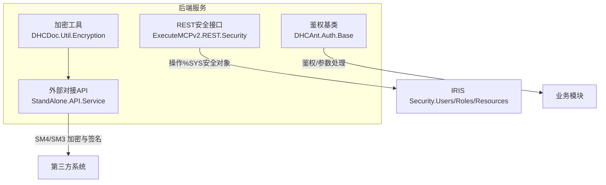
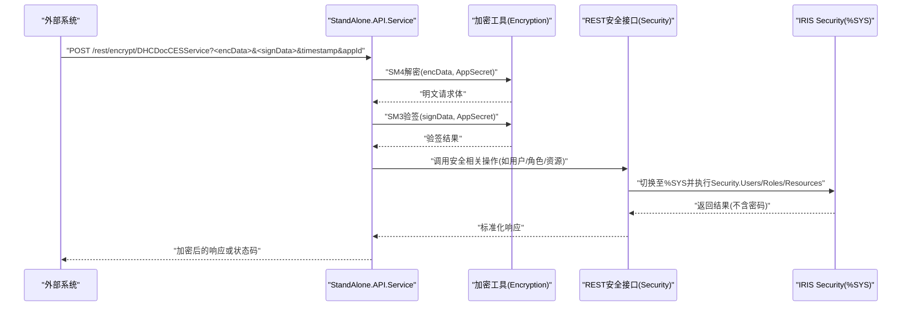
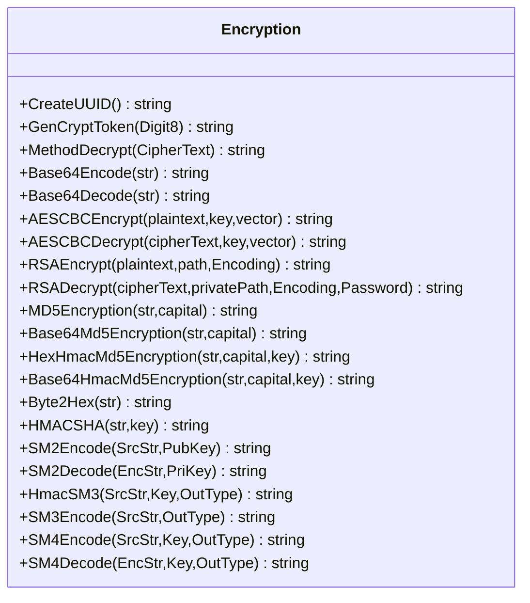
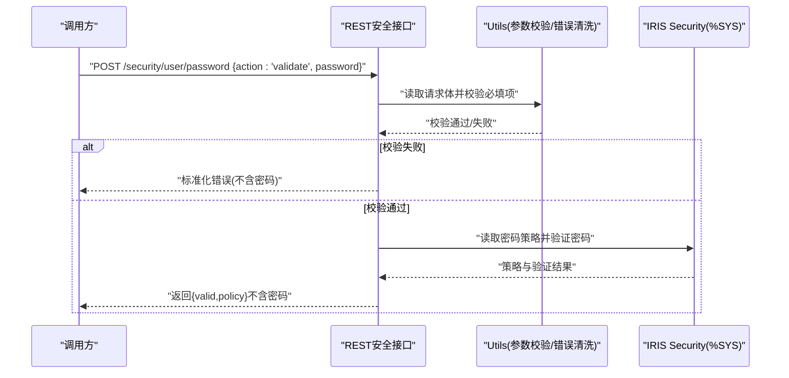
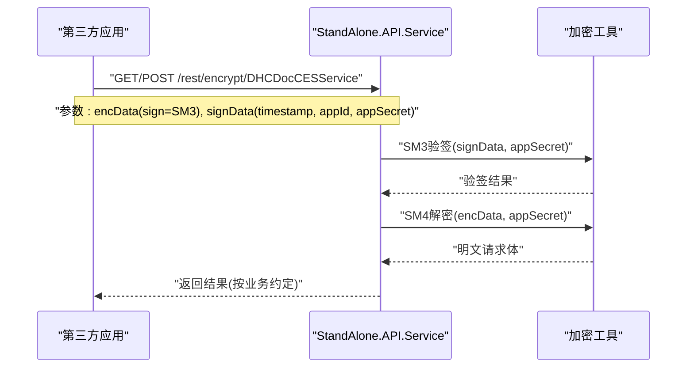
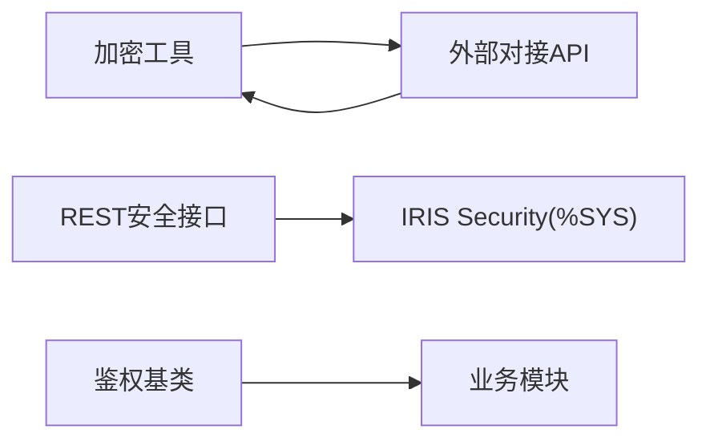

# 数据安全保护

<cite>
**本文引用的文件**
- [Encryption.cls](file://src/backend/public-mc/DHCDoc/Util/Encryption.cls)
- [Security.cls](file://src/backend/public-mc/ExecuteMCPv2/REST/Security.cls)
- [Service.cls](file://src/backend/conting-ws/DHCDoc/Interface/StandAlone/API/Service.cls)
- [Base.cls](file://src/backend/doc-ws/DHCAnt/Auth/Base.cls)
</cite>

## 目录
1. [引言](#引言)
2. [项目结构](#项目结构)
3. [核心组件](#核心组件)
4. [架构总览](#架构总览)
5. [详细组件分析](#详细组件分析)
6. [依赖关系分析](#依赖关系分析)
7. [性能与安全权衡](#性能与安全权衡)
8. [故障排查指南](#故障排查指南)
9. [结论](#结论)
10. [附录：配置与最佳实践](#附录配置与最佳实践)

## 引言
本文件面向IRIS HIS系统的数据安全保护，聚焦敏感数据加密存储、传输加密、数据脱敏、数据库访问控制、SQL注入防护、XSS防护、备份恢复、完整性校验与生命周期管理等关键主题。文档基于仓库中的实际代码实现进行梳理，提供可操作的配置建议与最佳实践，帮助读者在保障业务连续性的同时提升整体数据安全水位。

## 项目结构
围绕数据安全的相关能力主要分布在以下位置：
- 加解密工具类：统一封装对称/非对称、哈希、国密算法等能力，供各模块复用
- REST安全接口：集中管理用户、角色、资源与密码策略，避免明文泄露
- 外部对接接口：对第三方调用采用SM4/SM3等加密与签名机制，确保传输安全
- 权限与鉴权基类：为业务域提供统一的鉴权入口与参数处理

图表来源
- [Encryption.cls:1-270](file://src/backend/public-mc/DHCDoc/Util/Encryption.cls#L1-L270)
- [Security.cls:1-800](file://src/backend/public-mc/ExecuteMCPv2/REST/Security.cls#L1-L800)
- [Service.cls:114-133](file://src/backend/conting-ws/DHCDoc/Interface/StandAlone/API/Service.cls#L114-L133)
- [Base.cls:1-41](file://src/backend/doc-ws/DHCAnt/Auth/Base.cls#L1-L41)

章节来源
- [Encryption.cls:1-270](file://src/backend/public-mc/DHCDoc/Util/Encryption.cls#L1-L270)
- [Security.cls:1-800](file://src/backend/public-mc/ExecuteMCPv2/REST/Security.cls#L1-L800)
- [Service.cls:114-133](file://src/backend/conting-ws/DHCDoc/Interface/StandAlone/API/Service.cls#L114-L133)
- [Base.cls:1-41](file://src/backend/doc-ws/DHCAnt/Auth/Base.cls#L1-L41)

## 核心组件
- 加密工具（DHCDoc.Util.Encryption）
  - 提供UUID、随机令牌、Base64、AES-CBC、RSA、MD5/HMAC-MD5、HMAC-SHA、SM2/SM3/SM4等能力
  - 通过UTF-8编解码保证多语言一致性；对外暴露统一方法便于跨模块复用
- REST安全接口（ExecuteMCPv2.REST.Security）
  - 提供用户、角色、资源的CRUD与密码校验/修改能力
  - 严格遵循“响应体与错误信息中绝不包含密码”的安全原则
  - 所有安全操作切换至%SYS命名空间执行，最小化权限面
- 外部对接API（StandAlone.API.Service）
  - 使用SM4对请求体加密、SM3生成签名，附带时间戳与应用标识，防重放与篡改
  - 提供URL构造与测试方法，便于联调与审计
- 鉴权基类（DHCAnt.Auth.Base）
  - 定义表名、类名等常量，抽象锁与参数初始化逻辑，为上层鉴权提供统一入口

章节来源
- [Encryption.cls:1-270](file://src/backend/public-mc/DHCDoc/Util/Encryption.cls#L1-L270)
- [Security.cls:1-800](file://src/backend/public-mc/ExecuteMCPv2/REST/Security.cls#L1-L800)
- [Service.cls:114-133](file://src/backend/conting-ws/DHCDoc/Interface/StandAlone/API/Service.cls#L114-L133)
- [Base.cls:1-41](file://src/backend/doc-ws/DHCAnt/Auth/Base.cls#L1-L41)

## 架构总览
下图展示从外部系统到IRIS的端到端数据流，突出加密、签名与权限校验的关键节点。

图表来源
- [Service.cls:114-133](file://src/backend/conting-ws/DHCDoc/Interface/StandAlone/API/Service.cls#L114-L133)
- [Security.cls:1-800](file://src/backend/public-mc/ExecuteMCPv2/REST/Security.cls#L1-L800)
- [Encryption.cls:1-270](file://src/backend/public-mc/DHCDoc/Util/Encryption.cls#L1-L270)

## 详细组件分析

### 加密工具（DHCDoc.Util.Encryption）
- 功能要点
  - 对称加密：AES-CBC（支持密钥与偏移量）、SM4（国密）
  - 非对称加密：RSA（证书加载、兼容不同版本）
  - 哈希与签名：MD5、HMAC-MD5、HMAC-SHA、SM3（含HMAC模式）
  - 编码转换：Base64、UTF-8编解码
  - 辅助能力：UUID、随机令牌生成
- 复杂度与性能
  - AES/SM4为块加密，适合批量数据；RSA用于小体量敏感字段或密钥交换
  - 哈希/签名计算开销低，适合请求签名与完整性校验
- 优化建议
  - 对大体积数据优先使用SM4/AES；RSA仅用于密钥或短文本
  - 统一UTF-8编码，避免跨平台乱码
  - 将密钥与偏移量纳入配置管理，避免硬编码

图表来源
- [Encryption.cls:1-270](file://src/backend/public-mc/DHCDoc/Util/Encryption.cls#L1-L270)

章节来源
- [Encryption.cls:1-270](file://src/backend/public-mc/DHCDoc/Util/Encryption.cls#L1-L270)

### REST安全接口（ExecuteMCPv2.REST.Security）
- 功能要点
  - 用户管理：列表、查询、创建、修改、删除；密码修改与校验
  - 角色管理：列表、创建、修改、删除
  - 资源管理：列表、创建、修改、删除
  - 安全约束：响应体与错误信息不包含密码；参数校验前置；异常统一包装
  - 命名空间隔离：所有安全操作切换至%SYS执行
- 流程示意（以密码校验为例）

图表来源
- [Security.cls:370-553](file://src/backend/public-mc/ExecuteMCPv2/REST/Security.cls#L370-L553)

章节来源
- [Security.cls:1-800](file://src/backend/public-mc/ExecuteMCPv2/REST/Security.cls#L1-L800)

### 外部对接API（StandAlone.API.Service）
- 功能要点
  - 请求加密：SM4对请求体加密，使用应用密钥
  - 请求签名：SM3对排序后的源串签名，防止篡改
  - 防重放：携带时间戳，服务端应校验时效
  - URL构造：提供GET/POST两种构造方式，便于集成
- 典型调用序列

图表来源
- [Service.cls:114-133](file://src/backend/conting-ws/DHCDoc/Interface/StandAlone/API/Service.cls#L114-L133)
- [Encryption.cls:214-267](file://src/backend/public-mc/DHCDoc/Util/Encryption.cls#L214-L267)

章节来源
- [Service.cls:114-133](file://src/backend/conting-ws/DHCDoc/Interface/StandAlone/API/Service.cls#L114-L133)
- [Encryption.cls:214-267](file://src/backend/public-mc/DHCDoc/Util/Encryption.cls#L214-L267)

### 鉴权基类（DHCAnt.Auth.Base）
- 作用
  - 集中定义鉴权相关的表名与类名常量，降低耦合
  - 提供抽象锁与参数初始化的占位方法，便于扩展
- 适用场景
  - 作为业务模块鉴权的基类，统一入口与行为

章节来源
- [Base.cls:1-41](file://src/backend/doc-ws/DHCAnt/Auth/Base.cls#L1-L41)

## 依赖关系分析
- 加密工具被外部对接API广泛引用，形成“工具→业务”的单向依赖
- REST安全接口依赖IRIS内置Security对象，位于%SYS命名空间，体现“接口→系统安全”的依赖
- 鉴权基类为业务模块提供统一入口，减少重复实现

图表来源
- [Service.cls:114-133](file://src/backend/conting-ws/DHCDoc/Interface/StandAlone/API/Service.cls#L114-L133)
- [Security.cls:1-800](file://src/backend/public-mc/ExecuteMCPv2/REST/Security.cls#L1-L800)
- [Base.cls:1-41](file://src/backend/doc-ws/DHCAnt/Auth/Base.cls#L1-L41)

章节来源
- [Service.cls:114-133](file://src/backend/conting-ws/DHCDoc/Interface/StandAlone/API/Service.cls#L114-L133)
- [Security.cls:1-800](file://src/backend/public-mc/ExecuteMCPv2/REST/Security.cls#L1-L800)
- [Base.cls:1-41](file://src/backend/doc-ws/DHCAnt/Auth/Base.cls#L1-L41)

## 性能与安全权衡
- 算法选择
  - 对称加密（SM4/AES）适合大数据量；非对称加密（RSA/SM2）适合小数据或密钥交换
  - 哈希/签名（SM3/HMAC）开销低，适合高频鉴权与完整性校验
- 网络与存储
  - 传输层建议使用TLS；应用层结合SM4/SM3做端到端加密与签名，双重保障
  - 敏感字段落库前加密；日志与调试输出需脱敏
- 并发与缓存
  - 加密/签名计算可考虑缓存热点结果（如固定密钥下的摘要），但需评估安全风险
- 合规性
  - 国密算法（SM2/SM3/SM4）满足国内合规要求；注意密钥管理与轮换策略

[本节为通用指导，不直接分析具体文件]

## 故障排查指南
- 常见错误定位
  - 验签失败：检查时间戳是否过期、签名串排序与密钥是否一致
  - 解密失败：确认密钥、偏移量与编码（UTF-8）一致
  - 密码策略校验失败：查看返回的策略信息与提示，调整密码复杂度
- 日志与审计
  - 记录请求ID、时间戳、IP、动作类型与结果（不含敏感信息）
  - 对失败事件进行告警与聚合分析
- 快速自检
  - 使用提供的测试方法验证加密/签名链路是否正常
  - 通过REST安全接口列出用户/角色/资源，确认权限模型生效

章节来源
- [Security.cls:370-553](file://src/backend/public-mc/ExecuteMCPv2/REST/Security.cls#L370-L553)
- [Service.cls:141-155](file://src/backend/conting-ws/DHCDoc/Interface/StandAlone/API/Service.cls#L141-L155)

## 结论
IRIS HIS在本仓库中已具备较为完善的数据安全基础能力：统一的加密工具、严格的REST安全接口、面向外部的SM4/SM3传输安全方案以及规范的鉴权基类。建议在部署与运维层面补齐密钥管理、传输层加密、输入校验与审计告警等配套措施，形成闭环的数据安全体系。

[本节为总结性内容，不直接分析具体文件]

## 附录：配置与最佳实践

- 敏感数据加密存储
  - 使用SM4/AES对敏感字段加密后落库；密钥与偏移量纳入配置中心
  - 对日志、报表与导出文件进行脱敏，避免明文敏感信息泄露
  - 参考路径：[Encryption.cls:61-83](file://src/backend/public-mc/DHCDoc/Util/Encryption.cls#L61-L83)、[Encryption.cls:249-267](file://src/backend/public-mc/DHCDoc/Util/Encryption.cls#L249-L267)

- 传输加密
  - 外部接口统一使用SM4加密请求体、SM3签名，并携带时间戳与应用标识
  - 服务端校验签名与时间戳有效期，拒绝过期或非法请求
  - 参考路径：[Service.cls:114-133](file://src/backend/conting-ws/DHCDoc/Interface/StandAlone/API/Service.cls#L114-L133)、[Encryption.cls:214-267](file://src/backend/public-mc/DHCDoc/Util/Encryption.cls#L214-L267)

- 数据脱敏
  - 对外展示与日志输出时，对姓名、证件号、手机号等进行掩码或哈希化处理
  - 统一通过工具类进行编码与转换，避免不一致
  - 参考路径：[Encryption.cls:43-59](file://src/backend/public-mc/DHCDoc/Util/Encryption.cls#L43-L59)

- 数据库访问控制
  - 最小权限原则：业务账号仅授予必要表的读写权限
  - 禁止在应用层拼接SQL字符串；使用参数化查询与ORM
  - 对高风险操作增加二次确认与审计日志

- SQL注入防护
  - 严禁动态拼接用户输入到SQL；使用预编译语句或框架提供的安全API
  - 对输入进行白名单校验与长度限制

- XSS攻击防护
  - 前端输出对用户输入进行转义；后端对富文本进行净化
  - 设置合适的Content-Type与CSP策略

- 数据备份恢复
  - 定期全量+增量备份；备份数据加密存储
  - 制定恢复演练计划，验证RTO/RPO目标

- 数据完整性校验
  - 落库前计算哈希（如SM3/SHA系列），变更时比对校验
  - 对重要文件/报文保留原始哈希值，便于溯源

- 数据生命周期管理
  - 明确数据归档与销毁策略；到期自动清理或匿名化
  - 对历史数据进行分级分类，差异化保护

- 密码与身份管理
  - 使用REST安全接口进行密码修改与校验，遵循系统密码策略
  - 强制首次登录改密、定期轮换、失败锁定与审计
  - 参考路径：[Security.cls:370-553](file://src/backend/public-mc/ExecuteMCPv2/REST/Security.cls#L370-L553)

- 密钥管理
  - 密钥与偏移量不得硬编码；使用配置中心或硬件安全模块
  - 建立密钥轮换与回收流程，记录审计日志

- 监控与告警
  - 对鉴权失败、验签失败、解密失败等事件进行告警
  - 建立指标看板，跟踪安全事件趋势

[本节为通用指导，不直接分析具体文件]