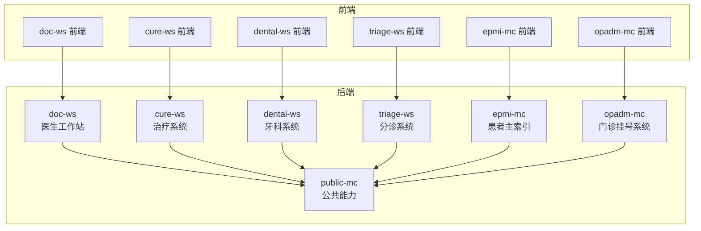
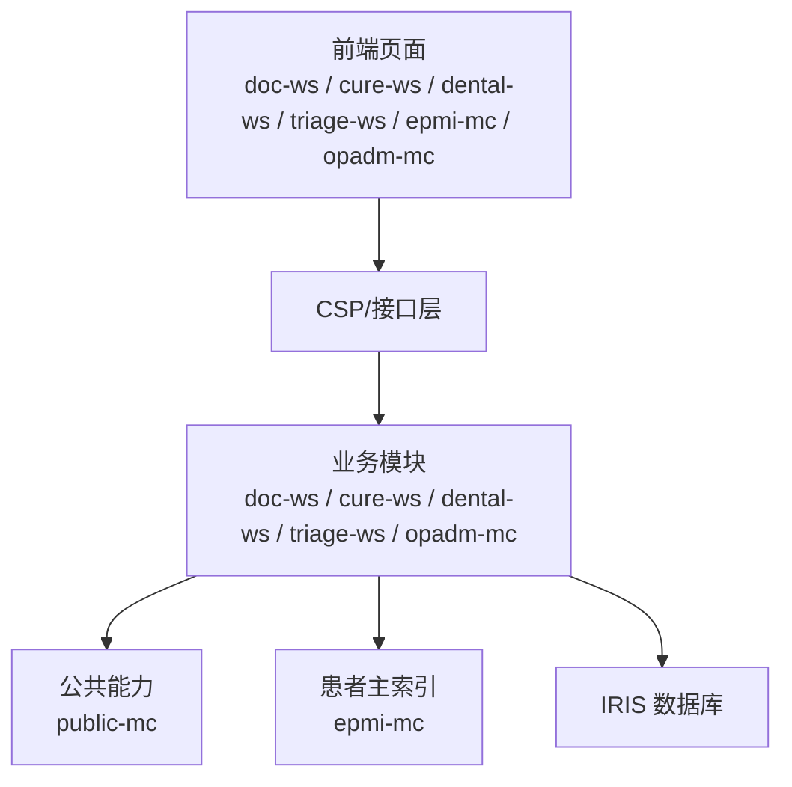
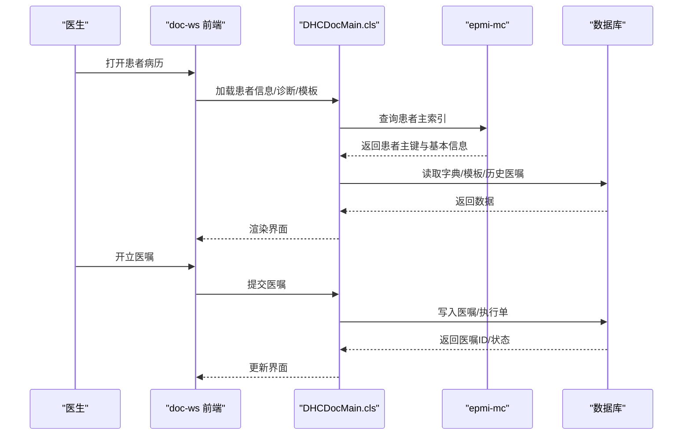
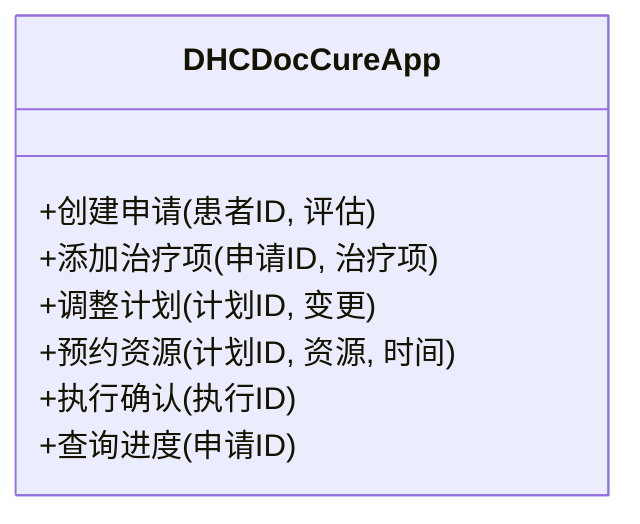
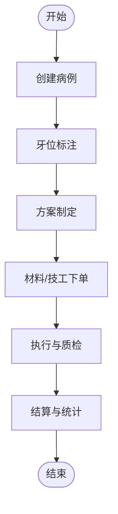
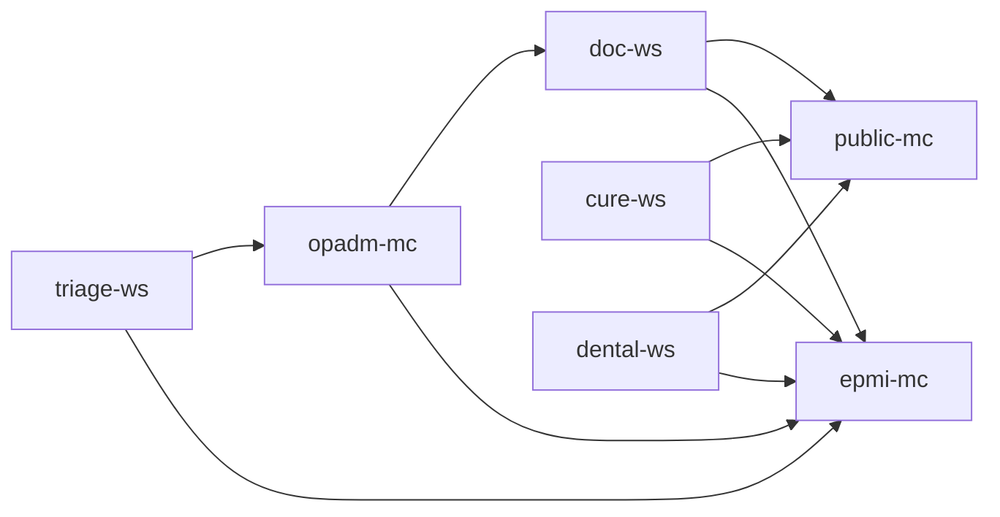

# 核心模块

<cite>
**本文引用的文件**
- [README.md](file://README.md)
- [doc-ws/web/DHCDocMain.cls](file://src/backend/doc-ws/web/DHCDocMain.cls)
- [cure-ws/User/DHCDocCureApp.cls](file://src/backend/cure-ws/User/DHCDocCureApp.cls)
- [dental-ws/DOC/Dental/TA/Application.cls](file://src/backend/dental-ws/DOC/Dental/TA/Application.cls)
</cite>

## 目录
1. [简介](#简介)
2. [项目结构](#项目结构)
3. [核心组件](#核心组件)
4. [架构总览](#架构总览)
5. [详细组件分析](#详细组件分析)
6. [依赖关系分析](#依赖关系分析)
7. [性能考虑](#性能考虑)
8. [故障排查指南](#故障排查指南)
9. [结论](#结论)
10. [附录](#附录)

## 简介
本文件面向 IRIS HIS 的六大核心子系统，提供从业务到技术的全景文档：医生工作站、治疗系统、牙科系统、分诊系统、患者主索引、门诊挂号系统。内容涵盖各模块的功能概述、核心业务流程、API 接口约定、数据库设计要点、模块间依赖与数据流转、常见问题及解决方案，并兼顾初学者友好与资深开发者的技术深度。

## 项目结构
IRIS HIS 采用前后端分离的组织方式：后端基于 InterSystems IRIS ObjectScript，前端为 CSP + jQuery/HISUI。六大子系统在 src/backend 下以独立子模块组织，每个子系统包含 CF（配置）、DHCDoc（业务域）、User（用户与权限）、web（CSP 页面）等目录；公共能力集中在 public-mc。

图表来源
- [README.md:9-35](file://README.md#L9-L35)

章节来源
- [README.md:9-35](file://README.md#L9-L35)

## 核心组件
本节对六大子系统逐一给出功能定位、关键流程、对外接口约定、数据存储要点与跨模块交互点。为避免泄露实现细节，本节聚焦“做什么”和“如何协作”，具体代码路径见后文“详细组件分析”。

- 医生工作站（doc-ws）
  - 功能：门诊/住院医嘱录入、诊断管理、处方与检查检验申请、报告查看、工作流协同。
  - 核心流程：患者检索 → 诊断选择 → 医嘱开立 → 审核/执行 → 结果回写。
  - API 约定：通过 CSP 页面调用后端类方法，参数以表单/JSON 传递，返回统一状态码与数据体。
  - 数据要点：医嘱、诊断、模板、用户偏好等实体；与公共字典、患者主索引强耦合。
  - 依赖：epmi-mc（患者主索引）、public-mc（字典/通用服务）。

- 治疗系统（cure-ws）
  - 功能：治疗计划、评估量表、排班与资源预约、执行记录、随访。
  - 核心流程：评估 → 计划制定 → 资源预约 → 执行与记录 → 随访。
  - API 约定：以应用对象（如 DHCDocCureApp）为核心入口，提供创建、变更、查询等方法。
  - 数据要点：治疗项、计划、排班、资源、评估、随访等。
  - 依赖：public-mc（字典/通用），可能对接设备或第三方系统。

- 牙科系统（dental-ws）
  - 功能：牙位图、材料/产品管理、技工加工单、修复/种植流程、报价与统计。
  - 核心流程：病例建档 → 牙位标注 → 方案制定 → 材料/技工下单 → 执行与结算。
  - API 约定：Application 类作为入口，提供病例、材料、技工、统计等接口。
  - 数据要点：牙位、材料、产品、技工单、状态、评分等。
  - 依赖：public-mc（字典/通用），与医生工作站共享患者主索引。

- 分诊系统（triage-ws）
  - 功能：预检分诊、优先级判定、候诊队列管理、资源调度。
  - 核心流程：报到 → 分诊评估 → 排队 → 叫号 → 转诊/处置。
  - 数据要点：分诊规则、队列、资源、状态。
  - 依赖：epmi-mc（患者信息）、opadm-mc（挂号/就诊号）。

- 患者主索引（epmi-mc）
  - 功能：患者唯一标识、合并去重、档案视图、跨系统患者映射。
  - 数据要点：主索引表、关联关系、历史快照。
  - 依赖：所有子系统均依赖其提供的患者主键与基础信息。

- 门诊挂号系统（opadm-mc）
  - 功能：号源管理、挂号、退号、改约、打印凭条、费用前置校验。
  - 数据要点：号源、挂号单、科室/医师排班、状态机。
  - 依赖：epmi-mc（患者）、doc-ws（接诊）、triage-ws（分诊）。

章节来源
- [README.md:12-22](file://README.md#L12-L22)

## 架构总览
整体采用“多子系统 + 公共能力”的分层架构。前端通过 CSP 页面发起请求，路由至对应后端模块；各子系统复用 public-mc 的字典、认证、日志、通用工具；跨子系统通过患者主索引进行数据关联。

图表来源
- [README.md:12-22](file://README.md#L12-L22)

## 详细组件分析

### 医生工作站（doc-ws）
- 功能概述
  - 门诊/住院场景下的诊断、医嘱、处方、检查检验申请与报告查看。
  - 常用模板、收藏项、快捷操作、批量处理。
- 核心业务流程
  - 患者检索 → 诊断选择 → 医嘱开立 → 审核/执行 → 结果回写与归档。
- API 接口约定
  - 入口类：DHCDocMain（Web 入口）。
  - 典型方法：获取患者信息、诊断列表、医嘱模板、开立/修改/停止医嘱、查询执行状态。
  - 参数：患者ID、诊断编码、医嘱项、频次、剂量、执行科室等。
  - 返回：统一状态码、消息、数据对象（如医嘱ID、执行单号）。
- 数据库设计要点
  - 医嘱、诊断、模板、用户偏好、执行记录等实体；与字典表、患者主索引表关联。
- 依赖与数据流转
  - 依赖 epmi-mc 获取患者主键与基本信息；依赖 public-mc 字典与通用服务；与 triage/opadm 通过就诊号/挂号单号联动。

图表来源
- [doc-ws/web/DHCDocMain.cls](file://src/backend/doc-ws/web/DHCDocMain.cls)

章节来源
- [doc-ws/web/DHCDocMain.cls](file://src/backend/doc-ws/web/DHCDocMain.cls)

### 治疗系统（cure-ws）
- 功能概述
  - 治疗评估、计划制定、资源预约、执行记录、随访管理。
- 核心业务流程
  - 评估量表填写 → 生成治疗计划 → 预约资源（时间/设备/人员）→ 执行与记录 → 随访提醒。
- API 接口约定
  - 入口类：DHCDocCureApp（应用对象）。
  - 典型方法：创建治疗申请、添加治疗项、调整计划、预约资源、执行确认、查询进度。
  - 参数：患者ID、评估结果、治疗项集合、资源ID、时间窗等。
  - 返回：申请ID、计划ID、预约ID、执行状态。
- 数据库设计要点
  - 治疗申请、计划、评估、资源、执行记录、随访等实体；支持版本化与状态机。
- 依赖与数据流转
  - 依赖 public-mc 字典与通用服务；与 doc-ws 通过患者ID/就诊号协同；可对接设备或第三方系统。

图表来源
- [cure-ws/User/DHCDocCureApp.cls](file://src/backend/cure-ws/User/DHCDocCureApp.cls)

章节来源
- [cure-ws/User/DHCDocCureApp.cls](file://src/backend/cure-ws/User/DHCDocCureApp.cls)

### 牙科系统（dental-ws）
- 功能概述
  - 牙位图编辑、材料与产品管理、技工加工单、修复/种植流程、报价与统计。
- 核心业务流程
  - 病例建档 → 牙位标注 → 方案制定 → 材料/技工下单 → 执行与结算。
- API 接口约定
  - 入口类：Application（牙科应用）。
  - 典型方法：创建病例、标注牙位、添加材料/产品、生成技工单、查询状态、导出统计。
  - 参数：患者ID、牙位、材料/产品信息、数量、交期等。
  - 返回：病例ID、技工单号、状态、金额。
- 数据库设计要点
  - 牙位、材料、产品、技工单、状态、评分等实体；与公共字典关联。
- 依赖与数据流转
  - 依赖 epmi-mc 患者主索引；依赖 public-mc 字典；与 doc-ws 共享患者上下文。

章节来源
- [dental-ws/DOC/Dental/TA/Application.cls](file://src/backend/dental-ws/DOC/Dental/TA/Application.cls)

### 分诊系统（triage-ws）
- 功能概述
  - 预检分诊、优先级判定、候诊队列管理、资源调度。
- 核心业务流程
  - 报到 → 分诊评估 → 排队 → 叫号 → 转诊/处置。
- API 接口约定
  - 入口：分诊登记、评估、入队/出队、查询队列、资源占用。
  - 参数：患者ID、症状/体征、优先级、资源ID、时间。
  - 返回：队列号、状态、预计等待时间。
- 数据库设计要点
  - 分诊规则、队列、资源、状态；与挂号单/就诊号关联。
- 依赖与数据流转
  - 依赖 epmi-mc（患者）、opadm-mc（挂号/就诊号）。

章节来源
- [README.md:12-22](file://README.md#L12-L22)

### 患者主索引（epmi-mc）
- 功能概述
  - 患者唯一标识、合并去重、档案视图、跨系统映射。
- 核心业务流程
  - 新增/匹配 → 合并 → 生成主索引 → 维护历史快照。
- API 接口约定
  - 入口：按证件/姓名/电话匹配、创建主索引、合并、查询档案。
  - 参数：匹配条件、合并策略、扩展字段。
  - 返回：主索引ID、匹配度、档案摘要。
- 数据库设计要点
  - 主索引表、关联关系、历史快照；强一致性与审计日志。
- 依赖与数据流转
  - 被所有子系统依赖；提供稳定患者主键。

章节来源
- [README.md:12-22](file://README.md#L12-L22)

### 门诊挂号系统（opadm-mc）
- 功能概述
  - 号源管理、挂号、退号、改约、打印凭条、费用前置校验。
- 核心业务流程
  - 查询号源 → 挂号 → 生成就诊号 → 打印凭条 → 释放/改约。
- API 接口约定
  - 入口：号源查询、挂号、退号、改约、凭条打印。
  - 参数：科室、医师、日期、时段、患者ID、支付方式。
  - 返回：挂号单号、就诊号、状态、费用信息。
- 数据库设计要点
  - 号源、挂号单、排班、状态机；与 epmi-mc、doc-ws、triage-ws 联动。
- 依赖与数据流转
  - 依赖 epmi-mc（患者）、doc-ws（接诊）、triage-ws（分诊）。

章节来源
- [README.md:12-22](file://README.md#L12-L22)

## 依赖关系分析
- 内聚与耦合
  - 各子系统内聚于自身业务域，通过 epmi-mc 解耦患者数据；通过 public-mc 复用通用能力。
- 直接/间接依赖
  - doc-ws、cure-ws、dental-ws、triage-ws、opadm-mc 均依赖 epmi-mc 与 public-mc。
- 外部集成点
  - 设备/第三方系统（治疗系统）、支付/医保（门诊挂号）、影像/检验（医生工作站）。
- 接口契约
  - 统一状态码、错误码、分页与排序约定；跨系统通过患者主键与就诊号关联。

图表来源
- [README.md:12-22](file://README.md#L12-L22)

章节来源
- [README.md:12-22](file://README.md#L12-L22)

## 性能考虑
- 缓存策略
  - 字典、模板、号源等热点数据建议缓存；注意失效与一致性。
- 批处理与异步
  - 大批量医嘱、统计报表、随访任务建议异步化与分批处理。
- 数据库优化
  - 合理索引（患者ID、就诊号、时间范围、状态）；避免全表扫描。
- 前端体验
  - 分页、懒加载、防抖；减少不必要刷新。

[本节为通用指导，不直接分析具体文件]

## 故障排查指南
- 常见问题
  - 患者主索引未找到：核对 epmi-mc 返回码与匹配条件。
  - 号源冲突：检查 opadm-mc 号源锁定与并发控制。
  - 医嘱执行失败：核查 doc-ws 与执行系统的状态同步与重试机制。
  - 资源预约失败：确认 cure-ws 资源可用性与时间窗冲突检测。
  - 牙科技工单异常：检查 dental-ws 材料/产品库存与状态机。
- 排查步骤
  - 定位入口类与方法（如 DHCDocMain、DHCDocCureApp、Application）。
  - 检查输入参数与返回值，核对状态码与错误消息。
  - 查看数据库相关表与索引，验证数据一致性。
  - 使用日志与审计追踪问题链路。

章节来源
- [doc-ws/web/DHCDocMain.cls](file://src/backend/doc-ws/web/DHCDocMain.cls)
- [cure-ws/User/DHCDocCureApp.cls](file://src/backend/cure-ws/User/DHCDocCureApp.cls)
- [dental-ws/DOC/Dental/TA/Application.cls](file://src/backend/dental-ws/DOC/Dental/TA/Application.cls)

## 结论
IRIS HIS 通过清晰的子系统划分与公共能力复用，实现了高内聚、低耦合的架构。六大核心子系统围绕患者主索引展开协作，形成完整的门诊/住院/治疗/牙科/分诊/挂号闭环。建议在后续迭代中持续完善接口契约、增强幂等与重试机制、优化热点数据缓存与数据库索引，以提升稳定性与性能。

[本节为总结性内容，不直接分析具体文件]

## 附录
- 快速参考
  - 入口类路径：doc-ws/web/DHCDocMain.cls、cure-ws/User/DHCDocCureApp.cls、dental-ws/DOC/Dental/TA/Application.cls。
  - 公共能力：public-mc（字典、通用服务）。
  - 患者主索引：epmi-mc（主键与档案）。
- 部署与开发
  - 后端通过 IRIS ObjectScript 扩展编译上传；前端通过脚本上传至服务器指定路径。
  - 详见 README 中的开发与部署说明。

章节来源
- [README.md:256-277](file://README.md#L256-L277)