# 门诊挂号系统模块架构

<cite>
**本文档引用的文件**
- [DHCRBAppointment.cls](file://src/backend/opadm-mc/User/DHCRBAppointment.cls)
- [RBApptSchedule.cls](file://src/backend/opadm-mc/User/RBApptSchedule.cls)
- [DHCRBApptSchedule.cls](file://src/backend/opadm-mc/User/DHCRBApptSchedule.cls)
- [DHCRBResource.cls](file://src/backend/opadm-mc/User/DHCRBResource.cls)
- [DHCScheduleTemplateConfig.cls](file://src/backend/opadm-mc/User/DHCScheduleTemplateConfig.cls)
- [DHCDocRegDocAppoint.cls](file://src/backend/opadm-mc/User/DHCDocRegDocAppoint.cls)
- [Appoint.cls](file://src/backend/opadm-mc/DHCDoc/OPAdm/Appoint.cls)
- [Schedule.cls](file://src/backend/opadm-mc/DHCDoc/OPAdm/Schedule.cls)
- [Service.cls](file://src/backend/opadm-mc/DHCDoc/OPAdm/Service.cls)
</cite>

## 目录
1. [简介](#简介)
2. [项目结构](#项目结构)
3. [核心组件](#核心组件)
4. [架构总览](#架构总览)
5. [详细组件分析](#详细组件分析)
6. [依赖关系分析](#依赖关系分析)
7. [性能考虑](#性能考虑)
8. [故障排查指南](#故障排查指南)
9. [结论](#结论)
10. [附录](#附录)

## 简介
本文件面向opadm-mc模块的门诊挂号系统，围绕预约管理、排班管理、挂号流程等核心能力进行系统化说明。重点解释号源管理、预约冲突检测、挂号状态流转的实现机制；描述排班模板、节假日处理与号源释放策略；阐述与医生工作站、收费系统的集成方式；并提供业务流程图、排班模型与号源管理图；最后给出配置管理与统计分析要点及业务对象定义与使用示例。

## 项目结构
opadm-mc模块采用“领域类 + 服务编排”的组织方式：
- User层：承载数据模型（资源、排班、预约、号别、时间区间、模板等）与扩展字段。
- DHCDoc/OPAdm层：提供挂号、排班、服务等业务编排入口（如Appoint、Schedule、Service）。
- web层：前端页面与脚本（不在本文深入）。

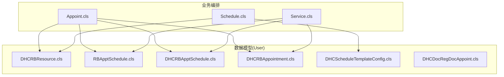

图表来源
- [Appoint.cls](file://src/backend/opadm-mc/DHCDoc/OPAdm/Appoint.cls)
- [Schedule.cls](file://src/backend/opadm-mc/DHCDoc/OPAdm/Schedule.cls)
- [Service.cls](file://src/backend/opadm-mc/DHCDoc/OPAdm/Service.cls)
- [DHCRBResource.cls](file://src/backend/opadm-mc/User/DHCRBResource.cls)
- [RBApptSchedule.cls](file://src/backend/opadm-mc/User/RBApptSchedule.cls)
- [DHCRBApptSchedule.cls](file://src/backend/opadm-mc/User/DHCRBApptSchedule.cls)
- [DHCRBAppointment.cls](file://src/backend/opadm-mc/User/DHCRBAppointment.cls)
- [DHCScheduleTemplateConfig.cls](file://src/backend/opadm-mc/User/DHCScheduleTemplateConfig.cls)
- [DHCDocRegDocAppoint.cls](file://src/backend/opadm-mc/User/DHCDocRegDocAppoint.cls)

章节来源
- [Appoint.cls](file://src/backend/opadm-mc/DHCDoc/OPAdm/Appoint.cls)
- [Schedule.cls](file://src/backend/opadm-mc/DHCDoc/OPAdm/Schedule.cls)
- [Service.cls](file://src/backend/opadm-mc/DHCDoc/OPAdm/Service.cls)
- [DHCRBResource.cls](file://src/backend/opadm-mc/User/DHCRBResource.cls)
- [RBApptSchedule.cls](file://src/backend/opadm-mc/User/RBApptSchedule.cls)
- [DHCRBApptSchedule.cls](file://src/backend/opadm-mc/User/DHCRBApptSchedule.cls)
- [DHCRBAppointment.cls](file://src/backend/opadm-mc/User/DHCRBAppointment.cls)
- [DHCScheduleTemplateConfig.cls](file://src/backend/opadm-mc/User/DHCScheduleTemplateConfig.cls)
- [DHCDocRegDocAppoint.cls](file://src/backend/opadm-mc/User/DHCDocRegDocAppoint.cls)

## 核心组件
- 号源资源：以资源维度组织号源（医生/诊室/专业组），支持时段、号量、号别、共享分组、随机退号等策略。
- 排班计划：按日/时段生成可预约的号源批次，记录可用号数、已占用、实际到离情况等。
- 扩展排班：在基础排班之上叠加医院业务属性（房间、时间区间、状态、审核、限流、停挂等）。
- 预约记录：患者维度的预约实体，包含证件、联系方式、时段、验证码、联合主号等。
- 模板配置：用于批量生成排班的规则与展示配置。
- 科室-医生-号别映射：用于限定某科室下医生可挂的号别数量与范围。

章节来源
- [DHCRBResource.cls](file://src/backend/opadm-mc/User/DHCRBResource.cls)
- [RBApptSchedule.cls](file://src/backend/opadm-mc/User/RBApptSchedule.cls)
- [DHCRBApptSchedule.cls](file://src/backend/opadm-mc/User/DHCRBApptSchedule.cls)
- [DHCRBAppointment.cls](file://src/backend/opadm-mc/User/DHCRBAppointment.cls)
- [DHCScheduleTemplateConfig.cls](file://src/backend/opadm-mc/User/DHCScheduleTemplateConfig.cls)
- [DHCDocRegDocAppoint.cls](file://src/backend/opadm-mc/User/DHCDocRegDocAppoint.cls)

## 架构总览
挂号系统以“资源-排班-预约”三层为核心，通过服务编排完成从号源生成、预约占号、到院签到、就诊执行、退费释放的全生命周期管理。

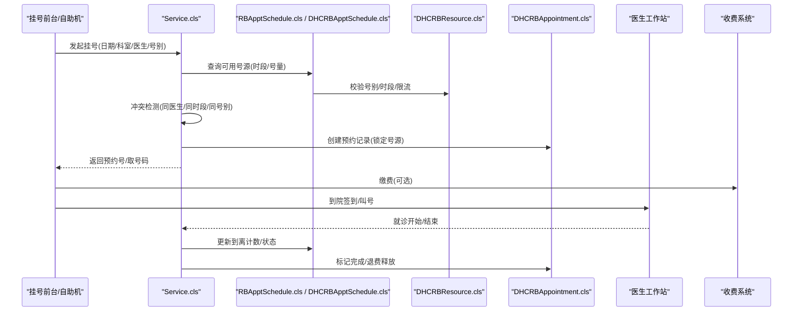

图表来源
- [Service.cls](file://src/backend/opadm-mc/DHCDoc/OPAdm/Service.cls)
- [RBApptSchedule.cls](file://src/backend/opadm-mc/User/RBApptSchedule.cls)
- [DHCRBApptSchedule.cls](file://src/backend/opadm-mc/User/DHCRBApptSchedule.cls)
- [DHCRBResource.cls](file://src/backend/opadm-mc/User/DHCRBResource.cls)
- [DHCRBAppointment.cls](file://src/backend/opadm-mc/User/DHCRBAppointment.cls)

## 详细组件分析

### 号源资源模型（DHCRBResource）
- 职责：定义号源的号别、号量、时段粒度、是否允许取号、是否随机退号等策略。
- 关键特性：
  - 号别与号量：RES_Load、RES_AppLoad、RES_AddLoad等控制号源容量与分配。
  - 时段粒度：RESTimeRangeFlag/Length/RegNum决定按时间段切分号源的能力。
  - 号别限制：RESEPMarkFlag、RES_FeeType等影响号别与费用类型。
  - 退号策略：RES_ReturnRandomFlag/Minute支持随机退号与分钟级释放。
  - 共享与分组：RESShareGroup/ShareInputItemCat支持多医生共享号源。

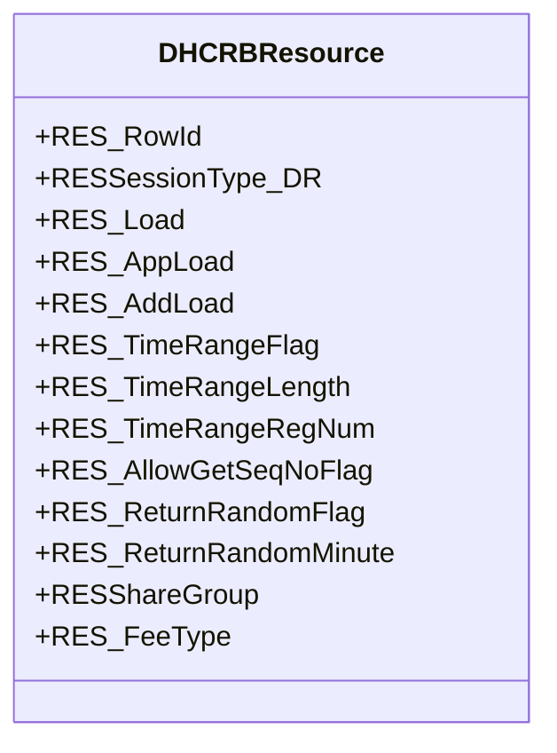

图表来源
- [DHCRBResource.cls](file://src/backend/opadm-mc/User/DHCRBResource.cls)

章节来源
- [DHCRBResource.cls](file://src/backend/opadm-mc/User/DHCRBResource.cls)

### 排班计划模型（RBApptSchedule）
- 职责：将资源按日期与时段生成为可预约的号源批次，维护可用号量、已到/已完成人数、实际时段等。
- 关键特性：
  - 时段与容量：ASSessStartTime/EndTime、AS_NoApptSession、AS_Load。
  - 进度统计：AS_NumPatIn、AS_NumPatOut、AS_BookedSlots。
  - 可用性计算：AS_Availability为计算字段，反映剩余比例。
  - 异常与调整：AS_IrregularFlag区分挤号/加号；AS_NotAvailableSlot控制不可用。
  - 索引优化：按日期、时段、有效会话等多维索引提升查询效率。

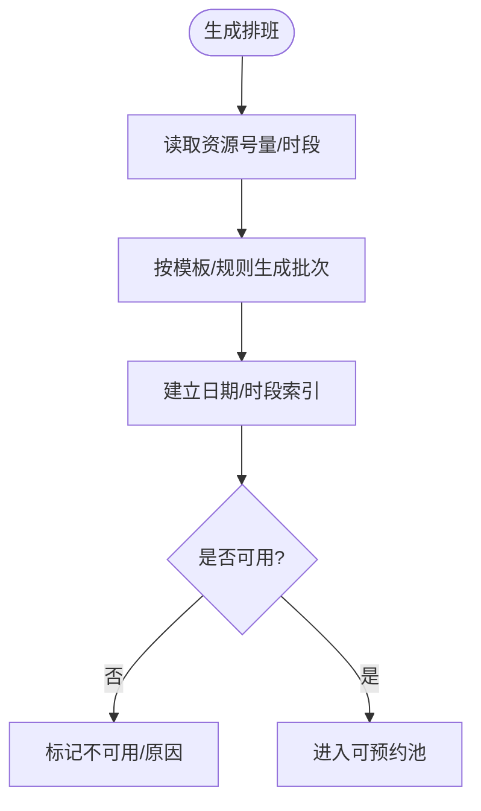

图表来源
- [RBApptSchedule.cls](file://src/backend/opadm-mc/User/RBApptSchedule.cls)

章节来源
- [RBApptSchedule.cls](file://src/backend/opadm-mc/User/RBApptSchedule.cls)

### 扩展排班（DHCRBApptSchedule）
- 职责：在基础排班上叠加医院业务属性，如诊室、时间区间、状态、审核、限流、停挂、仅亚专业挂号等。
- 关键特性：
  - 状态与审核：AS_Status_DR、AS_AuditFlag控制排班生效与审核。
  - 停挂与限流：AS_StopRegFlag、AS_NoLimitLoadFlag、AS_NoOverbookAllow控制挂号行为。
  - 时间区间：ASTimeRangeFlag/TRStartTime/TREndTime/Length/RegNum实现更细粒度号源。
  - 关联基础排班：AS_ApptScheduleDr指向RBApptSchedule。
  - 索引：按日期+房间、日期+时间区间、诊位等多维索引加速查询。

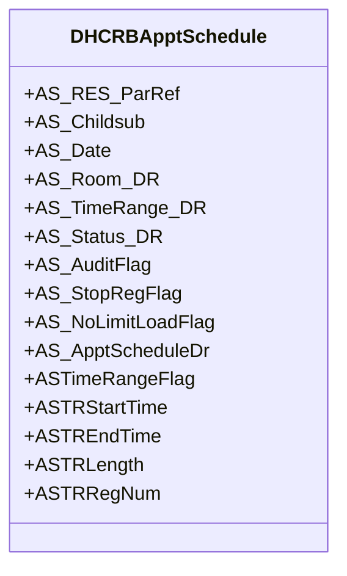

图表来源
- [DHCRBApptSchedule.cls](file://src/backend/opadm-mc/User/DHCRBApptSchedule.cls)

章节来源
- [DHCRBApptSchedule.cls](file://src/backend/opadm-mc/User/DHCRBApptSchedule.cls)

### 预约记录（DHCRBAppointment）
- 职责：记录患者预约信息，绑定资源与排班，支持验证码、联合主号、替诊前ID等。
- 关键特性：
  - 患者信息：姓名、性别、证件、电话、地址、VIP号等。
  - 预约标识：APPT_AS_ParRef/Childsub/Childsub构成唯一键，定位具体号源。
  - 验证码与锁号：APPT_VerifyCode、APPT_LockQueueNo用于取号与排队。
  - 联合/替诊：APPT_UniteMainApptDR、APPTRBAppointmentDR支持联合门诊与替诊场景。
  - 索引：按证件号、手机号、急诊分级、联合主号、VIP号等多维索引。

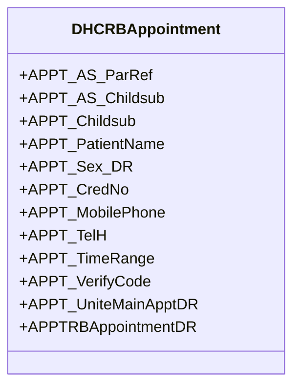

图表来源
- [DHCRBAppointment.cls](file://src/backend/opadm-mc/User/DHCRBAppointment.cls)

章节来源
- [DHCRBAppointment.cls](file://src/backend/opadm-mc/User/DHCRBAppointment.cls)

### 排班模板配置（DHCScheduleTemplateConfig）
- 职责：定义批量生成排班的规则与展示配置，支持医院维度、父子层级、数据类型与表达式。
- 关键特性：
  - 模板元数据：代码、描述、类型、父级、激活状态。
  - 数据源与展示：关联表名、展示字段、全局/医院表达式。
  - 业务关联：医嘱项、ICD诊断等作为模板内容。
  - 索引：按医院维度快速检索。

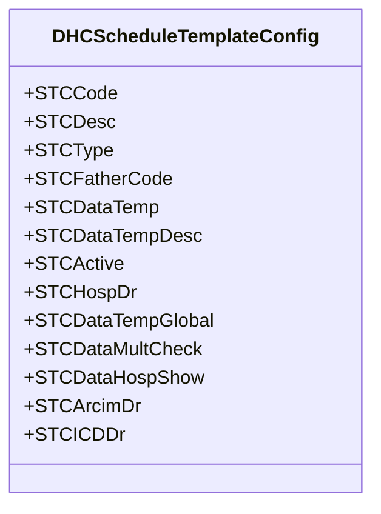

图表来源
- [DHCScheduleTemplateConfig.cls](file://src/backend/opadm-mc/User/DHCScheduleTemplateConfig.cls)

章节来源
- [DHCScheduleTemplateConfig.cls](file://src/backend/opadm-mc/User/DHCScheduleTemplateConfig.cls)

### 科室-医生-号别映射（DHCDocRegDocAppoint）
- 职责：约束某科室下医生可挂的号别与数量，支撑号别选择与冲突检测。
- 关键特性：
  - 维度：就诊科室、医生、号别资源、数量。
  - 索引：按科室、医生、号别组合索引提升匹配效率。

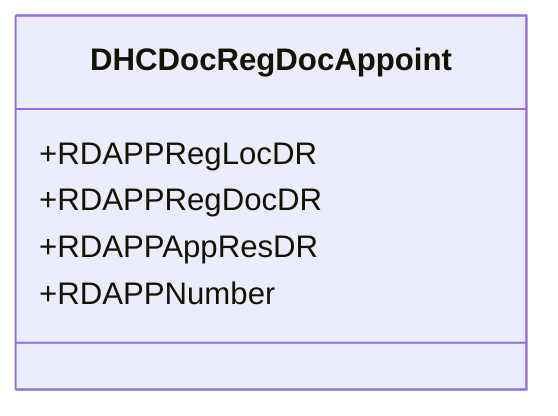

图表来源
- [DHCDocRegDocAppoint.cls](file://src/backend/opadm-mc/User/DHCDocRegDocAppoint.cls)

章节来源
- [DHCDocRegDocAppoint.cls](file://src/backend/opadm-mc/User/DHCDocRegDocAppoint.cls)

### 挂号业务流程（序列图）
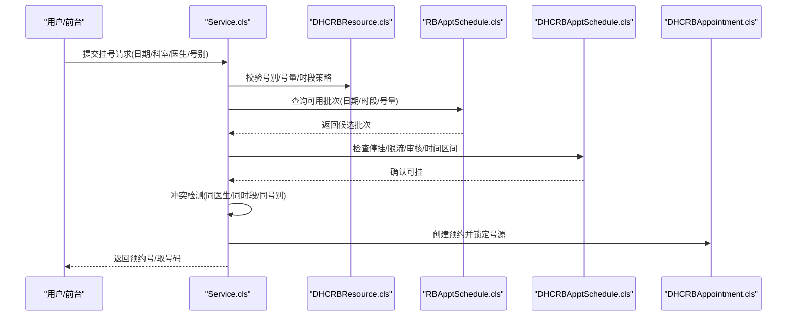

图表来源
- [Service.cls](file://src/backend/opadm-mc/DHCDoc/OPAdm/Service.cls)
- [DHCRBResource.cls](file://src/backend/opadm-mc/User/DHCRBResource.cls)
- [RBApptSchedule.cls](file://src/backend/opadm-mc/User/RBApptSchedule.cls)
- [DHCRBApptSchedule.cls](file://src/backend/opadm-mc/User/DHCRBApptSchedule.cls)
- [DHCRBAppointment.cls](file://src/backend/opadm-mc/User/DHCRBAppointment.cls)

章节来源
- [Service.cls](file://src/backend/opadm-mc/DHCDoc/OPAdm/Service.cls)

### 号源管理图（ER图）
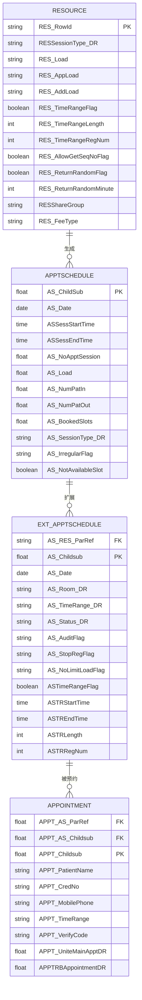

图表来源
- [DHCRBResource.cls](file://src/backend/opadm-mc/User/DHCRBResource.cls)
- [RBApptSchedule.cls](file://src/backend/opadm-mc/User/RBApptSchedule.cls)
- [DHCRBApptSchedule.cls](file://src/backend/opadm-mc/User/DHCRBApptSchedule.cls)
- [DHCRBAppointment.cls](file://src/backend/opadm-mc/User/DHCRBAppointment.cls)

## 依赖关系分析
- 低耦合高内聚：资源、排班、预约三类数据解耦，通过外键与索引关联。
- 直接依赖：
  - 预约依赖排班（AS_ParRef/Childsub）与资源（间接）。
  - 扩展排班依赖基础排班（AS_ApptScheduleDr）。
  - 挂号服务依赖资源、排班、预约三类模型。
- 潜在循环：无直接循环引用，均通过服务编排协调。
- 外部集成点：
  - 医生工作站：接收到院签到、就诊开始/结束事件，驱动排班计数与状态变更。
  - 收费系统：支付成功后完成挂号闭环；退费触发号源释放。

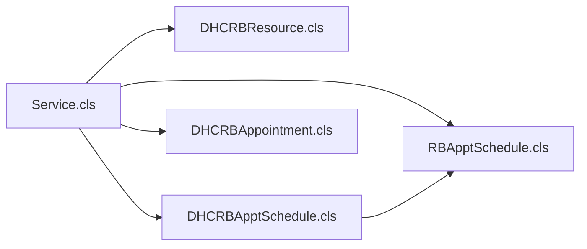

图表来源
- [Service.cls](file://src/backend/opadm-mc/DHCDoc/OPAdm/Service.cls)
- [DHCRBResource.cls](file://src/backend/opadm-mc/User/DHCRBResource.cls)
- [RBApptSchedule.cls](file://src/backend/opadm-mc/User/RBApptSchedule.cls)
- [DHCRBApptSchedule.cls](file://src/backend/opadm-mc/User/DHCRBApptSchedule.cls)
- [DHCRBAppointment.cls](file://src/backend/opadm-mc/User/DHCRBAppointment.cls)

章节来源
- [Service.cls](file://src/backend/opadm-mc/DHCDoc/OPAdm/Service.cls)
- [DHCRBResource.cls](file://src/backend/opadm-mc/User/DHCRBResource.cls)
- [RBApptSchedule.cls](file://src/backend/opadm-mc/User/RBApptSchedule.cls)
- [DHCRBApptSchedule.cls](file://src/backend/opadm-mc/User/DHCRBApptSchedule.cls)
- [DHCRBAppointment.cls](file://src/backend/opadm-mc/User/DHCRBAppointment.cls)

## 性能考虑
- 索引设计：
  - 排班按日期、时段、会话、房间、时间区间等多维索引，减少全表扫描。
  - 预约按证件号、手机号、急诊分级、联合主号、VIP号建立索引，提高查询速度。
- 并发控制：
  - 号源锁定建议在事务中完成“查询-锁定-写入”，避免超售。
  - 利用数据库行级锁或分布式锁保证同一号源不被重复占用。
- 批处理优化：
  - 排班生成采用批量插入与分批提交，降低IO压力。
  - 统计字段（如AS_NumPatIn/Out）采用增量更新，避免全量重算。
- 缓存建议：
  - 对热点号源（热门医生/时段）做短期缓存，减轻数据库压力。
  - 模板配置与字典数据可缓存以提升加载速度。

[本节为通用性能建议，不直接分析具体文件]

## 故障排查指南
- 常见错误与定位：
  - 号源不足：检查资源号量、时段粒度、停挂标志、限流标志。
  - 预约冲突：核对同医生/同时段/同号别的已有预约，检查联合主号与替诊逻辑。
  - 状态不一致：查看扩展排班状态、审核标志、到离计数是否与预约一致。
  - 退费未释放：确认退费流程是否调用号源释放接口，检查随机退号策略。
- 日志与追踪：
  - 关注排班生成与预约写入的事务日志。
  - 结合索引命中情况评估查询性能瓶颈。
- 回滚与恢复：
  - 事务失败时确保号源回滚，避免脏数据。
  - 对异常排班进行修复（如补录、撤销加号）。

[本节为通用故障排查建议，不直接分析具体文件]

## 结论
opadm-mc模块通过清晰的“资源-排班-预约”分层与完善的索引设计，实现了高效的号源管理与灵活的挂号流程。配合排班模板、节假日与号源释放策略，以及与医生工作站、收费系统的集成，能够支撑复杂门诊场景下的稳定运行。后续可进一步优化并发控制与缓存策略，提升高峰时段吞吐能力。

[本节为总结性内容，不直接分析具体文件]

## 附录

### 挂号业务流程图
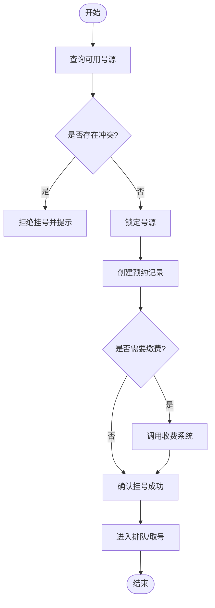

[此图为概念流程图，不绑定具体源码文件]

### 排班模型与号源管理要点
- 排班模型：
  - 基础排班：日期、时段、号量、到离计数、可用性。
  - 扩展排班：房间、时间区间、状态、审核、限流、停挂、仅亚专业挂号。
- 号源管理：
  - 号别与号量：由资源定义，支持共享分组与子号别。
  - 时段粒度：支持按固定时长或自定义时间区间切分。
  - 释放策略：支持手动释放、超时自动释放、随机退号。

[本节为概念性说明，不直接分析具体文件]

### 配置管理与统计分析
- 配置管理：
  - 排班模板：支持医院维度、父子层级、数据类型与表达式，便于批量生成。
  - 号别与号量：通过资源与映射表控制医生可挂的号别与数量。
  - 节假日与特殊日：可通过模板或扩展排班的时间区间与状态控制。
- 统计分析：
  - 排班利用率：基于AS_Load、AS_NumPatIn/Out、AS_BookedSlots计算。
  - 预约转化率：对比预约数与实际到诊数。
  - 号源分布：按医生、时段、号别统计号源占用与空闲。

[本节为概念性说明，不直接分析具体文件]

### 业务对象定义与使用示例
- 资源（DHCRBResource）
  - 用途：定义号别、号量、时段粒度、退号策略等。
  - 使用示例：为新医生创建资源，设置号别与号量，启用时段切分与随机退号。
- 基础排班（RBApptSchedule）
  - 用途：按日期与时段生成可预约批次，维护容量与进度。
  - 使用示例：为某医生在某日生成多个时段批次，设置号量与可用性。
- 扩展排班（DHCRBApptSchedule）
  - 用途：叠加房间、时间区间、状态、审核、限流等业务属性。
  - 使用示例：为某时段设置停挂或限流，或仅允许亚专业挂号。
- 预约（DHCRBAppointment）
  - 用途：记录患者预约信息，绑定号源，支持验证码与联合主号。
  - 使用示例：为患者创建预约并锁定号源，生成取号码。
- 模板（DHCScheduleTemplateConfig）
  - 用途：批量生成排班的规则与展示配置。
  - 使用示例：定义模板并应用到某科室/医生，自动生成未来一周排班。
- 映射（DHCDocRegDocAppoint）
  - 用途：约束科室-医生-号别的关系与数量。
  - 使用示例：为某医生设置可挂的号别与数量上限。

[本节为概念性说明，不直接分析具体文件]