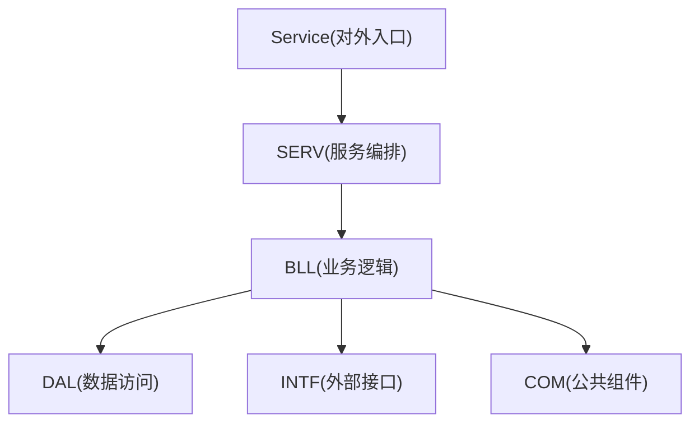
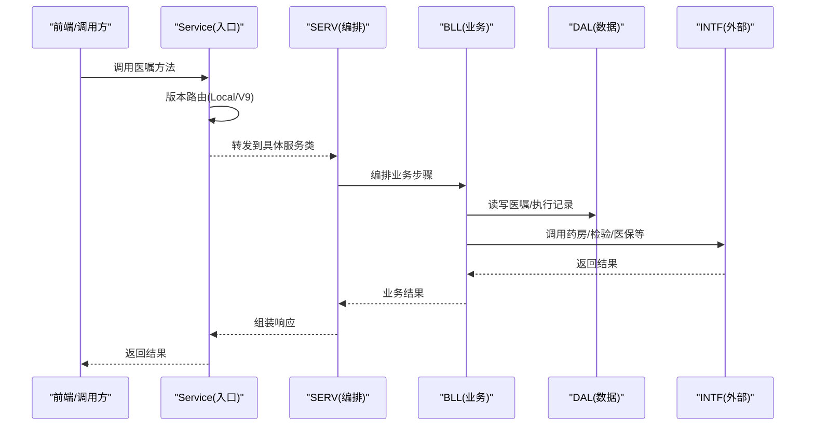
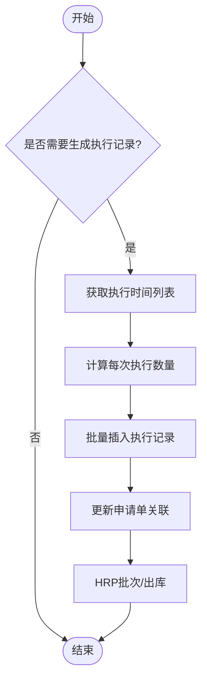
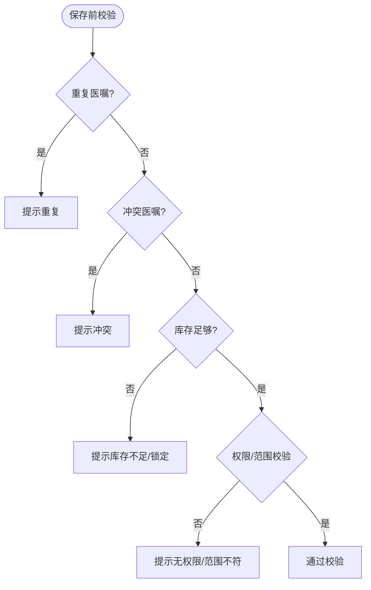
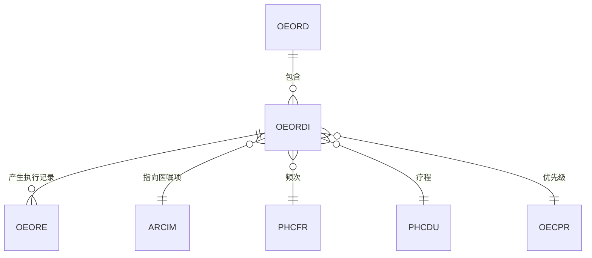
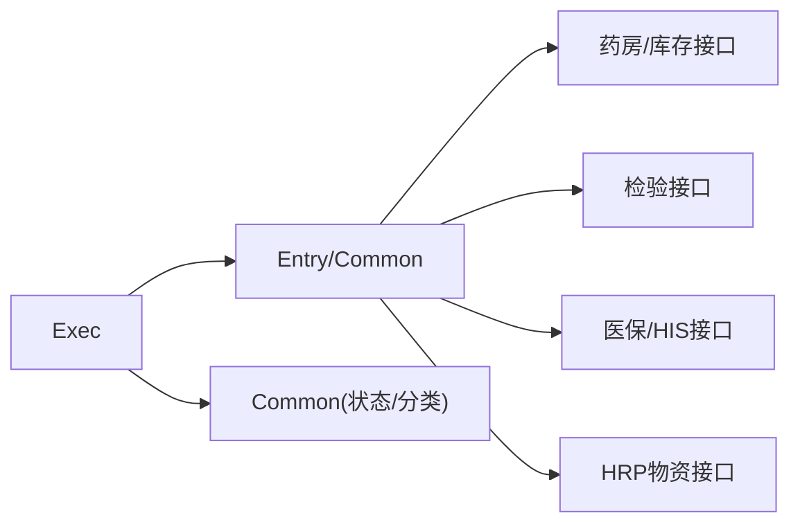
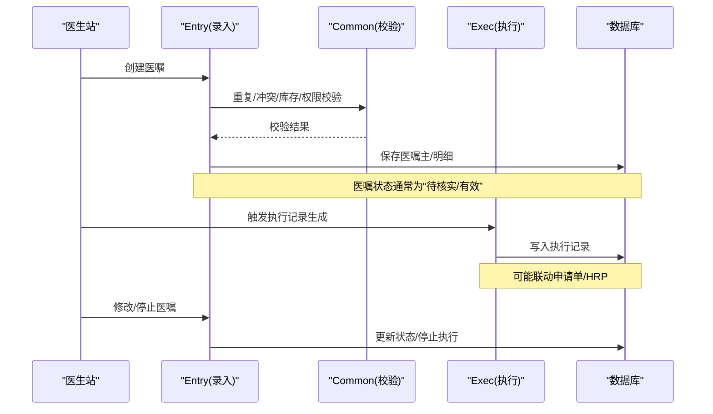

# 医嘱管理

<cite>
**本文引用的文件**
- [Service.cls](file://src/backend/doc-ws/DHCDoc/Order/Service.cls)
- [Exec.cls](file://src/backend/doc-ws/DHCDoc/Order/Exec.cls)
- [Common.cls](file://src/backend/doc-ws/DHCDoc/Order/Common.cls)
- [DHCDocOrderEntry.cls](file://src/backend/doc-ws/web/DHCDocOrderEntry.cls)
- [DHCDocOrderCommon.cls](file://src/backend/doc-ws/web/DHCDocOrderCommon.cls)
- [OEOrdItem.cls](file://src/backend/doc-ws/User/OEOrdItem.cls)
- [OEOrder.cls](file://src/backend/doc-ws/User/OEOrder.cls)
</cite>

## 目录
1. [引言](#引言)
2. [项目结构](#项目结构)
3. [核心组件](#核心组件)
4. [架构总览](#架构总览)
5. [详细组件分析](#详细组件分析)
6. [依赖关系分析](#依赖关系分析)
7. [性能考虑](#性能考虑)
8. [故障排查指南](#故障排查指南)
9. [结论](#结论)
10. [附录](#附录)

## 引言
本文件面向医嘱管理模块，系统化阐述医嘱生命周期（创建、修改、停止、执行）、数据结构与校验规则、执行流程，以及与费用、药品、检查等系统的集成点。文档同时覆盖优先级与冲突检测、智能推荐机制、配置项与扩展点，并提供可追溯的代码片段路径，便于定位实现细节。

## 项目结构
医嘱子系统采用分层与版本路由设计：
- Service：统一对外服务入口，负责将请求动态派发至 SERV 层的具体实现类（Local/V9），保证扩展性与向后兼容。
- SERV：服务编排与调度层，组合 BLL 业务方法，控制调用顺序与结果组装。
- BLL：核心业务逻辑（规则校验、流程编排）。
- DAL：数据访问层，封装全局变量、SQL、持久化类操作。
- INTF：接口层，统一封装外部模块调用（病历、医保、药房、检验、护理等）。
- COM：公共基础组件（版本路由基类、公共查询工具等）。

图表来源
- [Service.cls:1-95](file://src/backend/doc-ws/DHCDoc/Order/Service.cls#L1-L95)

章节来源
- [Service.cls:1-95](file://src/backend/doc-ws/DHCDoc/Order/Service.cls#L1-L95)

## 核心组件
- 服务入口与版本路由：通过重写分发方法，优先查找 Local 版本，再回退到标准版本，未命中抛出异常并携带堆栈信息，便于定位问题。
- 执行记录生成：根据频次、疗程、首日次数、周频次、固定间隔等规则计算执行时间点，合并多剂量与关联子医嘱，批量插入执行记录并触发后续计费与出库。
- 医嘱录入与校验：提供重复医嘱检测、冲突检测、库存校验、权限校验、诊断限制、皮试提示、接收科室校验等。
- 优先级与默认选择：按就诊类型、登录科室、医生角色等决定可用优先级集合与默认值。
- 通用能力：医嘱状态判断、是否长期/临时/出院带药、收费项目清单、检索与排序、库存展示等。

章节来源
- [Service.cls:1-95](file://src/backend/doc-ws/DHCDoc/Order/Service.cls#L1-L95)
- [Exec.cls:1-800](file://src/backend/doc-ws/DHCDoc/Order/Exec.cls#L1-L800)
- [Common.cls:1-800](file://src/backend/doc-ws/DHCDoc/Order/Common.cls#L1-L800)
- [DHCDocOrderEntry.cls:1-800](file://src/backend/doc-ws/web/DHCDocOrderEntry.cls#L1-L800)
- [DHCDocOrderCommon.cls:1-800](file://src/backend/doc-ws/web/DHCDocOrderCommon.cls#L1-L800)

## 架构总览
医嘱子系统以“服务入口—编排—业务—数据/接口”的分层模式组织，结合版本路由与公共组件，形成高内聚、低耦合的体系。

图表来源
- [Service.cls:1-95](file://src/backend/doc-ws/DHCDoc/Order/Service.cls#L1-L95)
- [Exec.cls:1-800](file://src/backend/doc-ws/DHCDoc/Order/Exec.cls#L1-L800)
- [Common.cls:1-800](file://src/backend/doc-ws/DHCDoc/Order/Common.cls#L1-L800)

## 详细组件分析

### 服务入口与版本路由（Service）
- 职责：统一对外入口，动态查找并调用对应版本的实现类；未找到时抛出系统异常并附带堆栈位置。
- 关键点：优先 Local，再标准版本；方法名唯一性约束避免路由冲突。

章节来源
- [Service.cls:1-95](file://src/backend/doc-ws/DHCDoc/Order/Service.cls#L1-L95)

### 执行记录生成（Exec）
- 职责：根据医嘱频次、疗程、首日次数、周频次、固定间隔、关联子医嘱等规则，生成当日执行时间点列表，并写入执行记录表。
- 关键流程：
  - 判断是否需要生成（治疗预约、PRN、有效期等）。
  - 获取执行时间列表（小时医嘱、申请单、子医嘱、常规频次）。
  - 计算每次执行数量（支持多剂量、包装单位换算、虚拟长嘱合并）。
  - 批量插入执行记录，并联动申请单、HRP批次与出库。

图表来源
- [Exec.cls:1-800](file://src/backend/doc-ws/DHCDoc/Order/Exec.cls#L1-L800)

章节来源
- [Exec.cls:1-800](file://src/backend/doc-ws/DHCDoc/Order/Exec.cls#L1-L800)

### 医嘱录入与校验（DHCDocOrderEntry / DHCDocOrderCommon）
- 重复医嘱检测：支持跨就诊天数、不同优先级、皮试豁免、出院带药特殊处理。
- 冲突检测：基于配置互斥项，结合当前执行状态与“停所有执行”策略，提示冲突项。
- 库存校验：支持逻辑/实库存、药房锁定、HRP物资接口、整包装要求、接收科室限制。
- 权限与范围：按用户组授权子类/项目、登录科室、就诊类型、医生角色等控制。
- 其他：诊断限制、皮试提示、医保中途结算限制、住院在院状态等。

图表来源
- [DHCDocOrderEntry.cls:178-477](file://src/backend/doc-ws/web/DHCDocOrderEntry.cls#L178-L477)
- [DHCDocOrderCommon.cls:148-600](file://src/backend/doc-ws/web/DHCDocOrderCommon.cls#L148-L600)

章节来源
- [DHCDocOrderEntry.cls:178-477](file://src/backend/doc-ws/web/DHCDocOrderEntry.cls#L178-L477)
- [DHCDocOrderCommon.cls:148-600](file://src/backend/doc-ws/web/DHCDocOrderCommon.cls#L148-L600)

### 优先级与默认选择（Common）
- 依据就诊类型、登录科室、医生角色等确定可用优先级集合。
- 默认优先级：按用户页面设置或医院配置回退到标准默认。

章节来源
- [Common.cls:18-85](file://src/backend/doc-ws/DHCDoc/Order/Common.cls#L18-L85)

### 医嘱状态与分类（Common）
- 提供判断是否为长期/临时/出院带药/取药医嘱的方法。
- 获取医嘱状态码、是否有效执行记录等。

章节来源
- [Common.cls:101-187](file://src/backend/doc-ws/DHCDoc/Order/Common.cls#L101-L187)

### 数据模型与关系（概念图）

说明
- 医嘱主表与明细表一对多；执行记录由明细产生；医嘱项、频次、疗程、优先级为关键维度。

[本节为概念性图示，不直接映射具体代码文件]

## 依赖关系分析
- 内部依赖
  - Service 依赖 SERV/BLL/DAL/INTF/COM 各层协作。
  - Exec 依赖 Common、web 层工具类进行频次、时长、优先级等计算。
  - Entry/Common 依赖配置、字典、权限、库存、HRP/LIS/PACS 等接口。
- 外部依赖
  - 药房/库存：GetAvailQtyByArc/IncilQtyList、药房锁定标志。
  - 检验/检查：CheckLabItemActive、申请单关联。
  - 医保：价格与报销相关字段、中途结算限制。
  - HRP：物资库存与出库。

图表来源
- [DHCDocOrderCommon.cls:455-600](file://src/backend/doc-ws/web/DHCDocOrderCommon.cls#L455-L600)
- [Exec.cls:704-800](file://src/backend/doc-ws/DHCDoc/Order/Exec.cls#L704-L800)

章节来源
- [DHCDocOrderCommon.cls:455-600](file://src/backend/doc-ws/web/DHCDocOrderCommon.cls#L455-L600)
- [Exec.cls:704-800](file://src/backend/doc-ws/DHCDoc/Order/Exec.cls#L704-L800)

## 性能考虑
- 版本路由仅在入口层进行一次查找，避免重复解析。
- 执行记录生成采用批处理插入，减少数据库往返。
- 库存查询按需启用 HR P 接口，并在循环中缓存必要信息，降低远程调用开销。
- 检索与排序使用索引与分页，避免全表扫描。

[本节提供一般性指导，无需特定文件引用]

## 故障排查指南
- 路由未命中：检查方法名唯一性与 Local/V9 实现是否存在；查看抛出的异常信息与堆栈行号。
- 执行记录未生成：核对频次、疗程、首日次数、周频次、固定间隔配置；确认是否在有效期内；检查 PRN/治疗预约场景。
- 库存校验失败：确认药房锁定、实/逻辑库存开关、HRP 接口返回值；检查接收科室与患者类型匹配。
- 重复/冲突提示：查看互斥配置、重复天数、优先级差异、皮试豁免；必要时调整配置或医嘱参数。

章节来源
- [Service.cls:62-92](file://src/backend/doc-ws/DHCDoc/Order/Service.cls#L62-L92)
- [Exec.cls:33-105](file://src/backend/doc-ws/DHCDoc/Order/Exec.cls#L33-L105)
- [DHCDocOrderEntry.cls:178-477](file://src/backend/doc-ws/web/DHCDocOrderEntry.cls#L178-L477)
- [DHCDocOrderCommon.cls:455-600](file://src/backend/doc-ws/web/DHCDocOrderCommon.cls#L455-L600)

## 结论
医嘱管理模块通过清晰的分层与版本路由，实现了高可扩展的医嘱生命周期管理。执行记录生成与库存校验为核心难点，已提供完善的规则与接口集成。建议在实际部署中结合医院配置优化优先级、冲突与库存策略，并通过日志与异常信息快速定位问题。

## 附录

### 医嘱生命周期与状态转换（序列图）

图表来源
- [DHCDocOrderEntry.cls:178-477](file://src/backend/doc-ws/web/DHCDocOrderEntry.cls#L178-L477)
- [Exec.cls:1-800](file://src/backend/doc-ws/DHCDoc/Order/Exec.cls#L1-L800)

### 代码示例路径（用于定位实现）
- 服务入口与版本路由：[Service.cls:42-78](file://src/backend/doc-ws/DHCDoc/Order/Service.cls#L42-L78)
- 执行记录生成入口与时间列表：[Exec.cls:7-105](file://src/backend/doc-ws/DHCDoc/Order/Exec.cls#L7-L105)
- 重复医嘱检测：[DHCDocOrderEntry.cls:371-477](file://src/backend/doc-ws/web/DHCDocOrderEntry.cls#L371-L477)
- 冲突检测：[DHCDocOrderEntry.cls:178-223](file://src/backend/doc-ws/web/DHCDocOrderEntry.cls#L178-L223)
- 库存校验与整包装：[DHCDocOrderCommon.cls:455-600](file://src/backend/doc-ws/web/DHCDocOrderCommon.cls#L455-L600)
- 优先级与默认选择：[Common.cls:18-85](file://src/backend/doc-ws/DHCDoc/Order/Common.cls#L18-L85)
- 医嘱状态与分类：[Common.cls:101-187](file://src/backend/doc-ws/DHCDoc/Order/Common.cls#L101-L187)