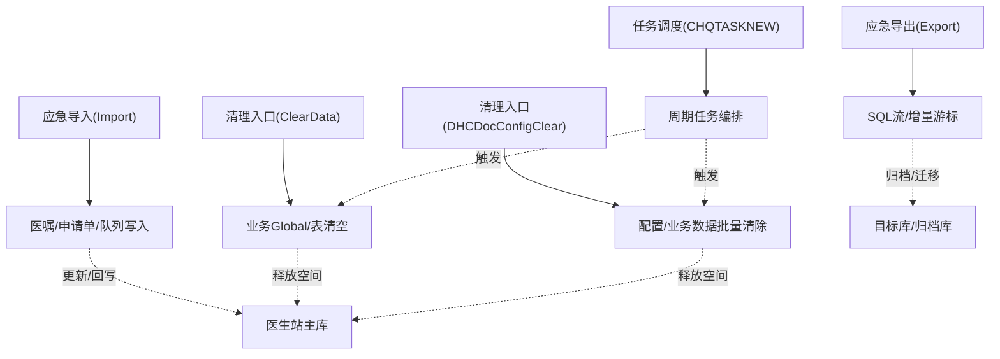
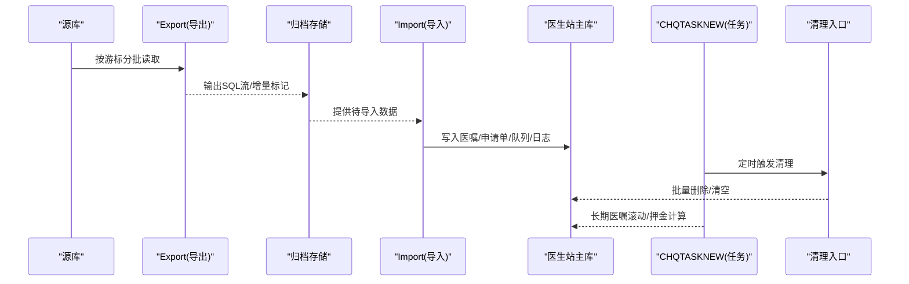
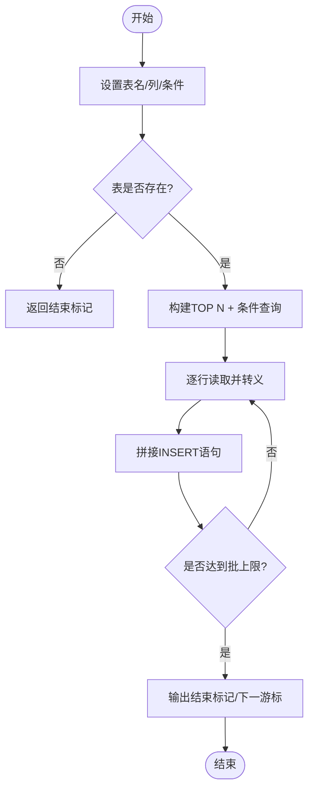
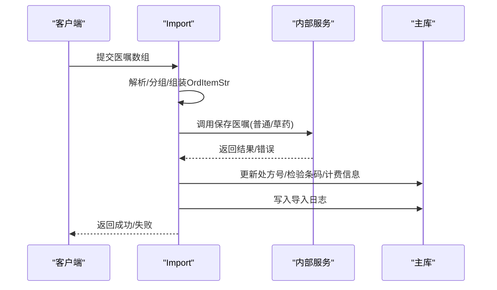
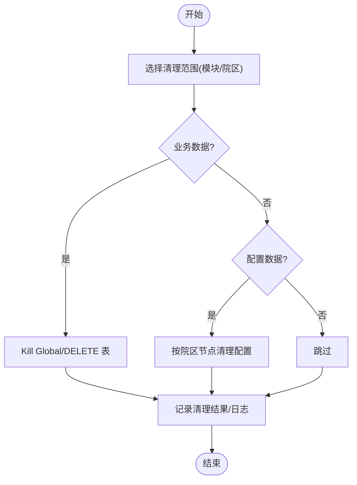
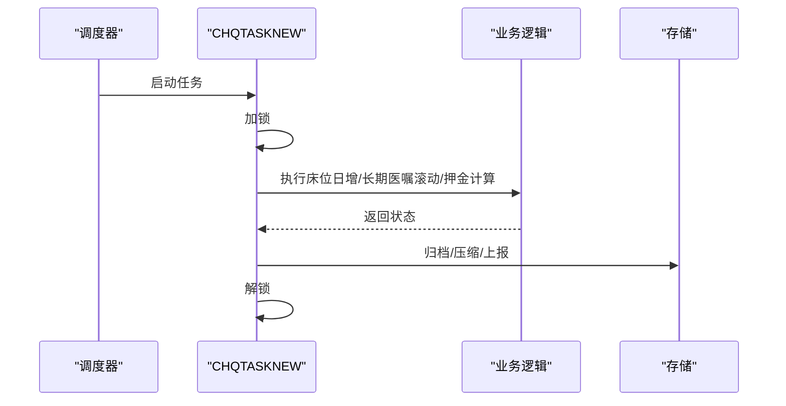
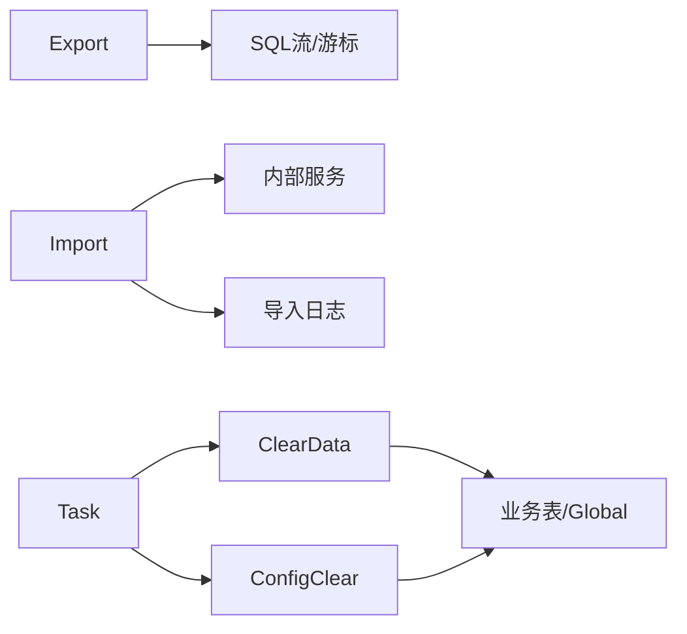

# 数据生命周期管理

<cite>
**本文引用的文件**
- [Export.cls](file://src/backend/conting-ws/DHCDoc/Interface/StandAlone/Export.cls)
- [Import.cls](file://src/backend/conting-ws/DHCDoc/Interface/StandAlone/Import.cls)
- [ClearData.cls](file://src/backend/cure-ws/DHCDoc/Cure/RT/COM/ClearData.cls)
- [DHCDocConfigClear.mac](file://src/backend/public-mc/DHCDocConfigClear.mac)
- [CHQTASKNEW.mac](file://src/backend/public-mc/CHQTASKNEW.mac)
</cite>

## 目录
1. [引言](#引言)
2. [项目结构](#项目结构)
3. [核心组件](#核心组件)
4. [架构总览](#架构总览)
5. [详细组件分析](#详细组件分析)
6. [依赖关系分析](#依赖关系分析)
7. [性能与容量规划](#性能与容量规划)
8. [故障排查指南](#故障排查指南)
9. [结论](#结论)
10. [附录](#附录)

## 引言
本文件面向医疗信息系统的数据生命周期管理，覆盖数据的创建、更新、归档与删除策略；记录数据保留政策、历史数据管理与存储空间优化；提供数据备份恢复方案、灾难恢复计划与数据迁移工具使用指南；并给出数据质量检查与清理脚本的使用说明。文档基于仓库中现有后端接口与清理任务代码进行梳理，确保可落地执行。

## 项目结构
围绕数据生命周期，本项目涉及以下关键位置：
- 应急系统导出（数据迁移/归档）：位于 StandAlone 导出类，负责按批次拉取字典、配置与业务表数据，生成 SQL 流用于导入目标库。
- 应急系统导入（数据回写/更新）：位于 StandAlone 导入类，负责将应急端医嘱等数据回插到医生站，并进行申请单生成、关联与日志记录。
- 业务数据清理：包含放疗模块业务数据清理、医生站全局配置与业务数据清理入口。
- 定时任务：统一的任务调度入口，串联床位日增、长期医嘱滚动、押金计算等周期性任务。

图表来源
- [Export.cls:1-800](file://src/backend/conting-ws/DHCDoc/Interface/StandAlone/Export.cls#L1-L800)
- [Import.cls:1-559](file://src/backend/conting-ws/DHCDoc/Interface/StandAlone/Import.cls#L1-L559)
- [ClearData.cls:1-22](file://src/backend/cure-ws/DHCDoc/Cure/RT/COM/ClearData.cls#L1-L22)
- [DHCDocConfigClear.mac:1-800](file://src/backend/public-mc/DHCDocConfigClear.mac#L1-L800)
- [CHQTASKNEW.mac:1-65](file://src/backend/public-mc/CHQTASKNEW.mac#L1-L65)

章节来源
- [Export.cls:1-800](file://src/backend/conting-ws/DHCDoc/Interface/StandAlone/Export.cls#L1-L800)
- [Import.cls:1-559](file://src/backend/conting-ws/DHCDoc/Interface/StandAlone/Import.cls#L1-L559)
- [ClearData.cls:1-22](file://src/backend/cure-ws/DHCDoc/Cure/RT/COM/ClearData.cls#L1-L22)
- [DHCDocConfigClear.mac:1-800](file://src/backend/public-mc/DHCDocConfigClear.mac#L1-L800)
- [CHQTASKNEW.mac:1-65](file://src/backend/public-mc/CHQTASKNEW.mac#L1-L65)

## 核心组件
- 数据导出与归档（Export）
  - 以分页游标方式读取字典、配置与业务表，输出为 SQL 流，便于跨库迁移或归档。
  - 支持“忽略插入”和“替换插入”两种模式，保证幂等与一致性。
- 数据导入与更新（Import）
  - 接收应急端数据，构造医嘱/申请单/队列等对象，调用内部服务落库，并记录导入日志。
  - 对草药医嘱与普通医嘱分别组织参数，保障处方号、检验条码等关键字段一致。
- 数据清理（ClearData / DHCDocConfigClear）
  - ClearData：针对放疗模块的业务 Global 数据进行快速清空。
  - DHCDocConfigClear：医生站全量清理入口，涵盖挂号、排班、医嘱、模板、权限、日志等多维度数据。
- 定时任务（CHQTASKNEW）
  - 统一任务入口，串行执行床位日增、长期医嘱滚动、押金计算等任务，具备加锁防重机制。

章节来源
- [Export.cls:1-800](file://src/backend/conting-ws/DHCDoc/Interface/StandAlone/Export.cls#L1-L800)
- [Import.cls:1-559](file://src/backend/conting-ws/DHCDoc/Interface/StandAlone/Import.cls#L1-L559)
- [ClearData.cls:1-22](file://src/backend/cure-ws/DHCDoc/Cure/RT/COM/ClearData.cls#L1-L22)
- [DHCDocConfigClear.mac:1-800](file://src/backend/public-mc/DHCDocConfigClear.mac#L1-L800)
- [CHQTASKNEW.mac:1-65](file://src/backend/public-mc/CHQTASKNEW.mac#L1-L65)

## 架构总览
数据生命周期由“导出-归档-导入-更新-清理-归档”的闭环构成，配合定时任务实现自动化。

图表来源
- [Export.cls:1-800](file://src/backend/conting-ws/DHCDoc/Interface/StandAlone/Export.cls#L1-L800)
- [Import.cls:1-559](file://src/backend/conting-ws/DHCDoc/Interface/StandAlone/Import.cls#L1-L559)
- [DHCDocConfigClear.mac:1-800](file://src/backend/public-mc/DHCDocConfigClear.mac#L1-L800)
- [CHQTASKNEW.mac:1-65](file://src/backend/public-mc/CHQTASKNEW.mac#L1-L65)

## 详细组件分析

### 数据导出与归档（Export）
- 功能要点
  - 多表导出：挂号职称字典、费用对照、科室医生号别、外部代码、插件管理、硬件参数、医嘱模板等。
  - 游标分页：通过 stIndex/expNum 控制起始ID与批大小，避免一次性加载过大。
  - 幂等写入：支持“忽略插入”和“替换插入”，结合 create_user 与时间戳，便于重复执行。
  - 安全处理：对字符串进行转义，防止注入风险。
- 复杂度与性能
  - 单次批处理大小可调，建议根据网络与数据库吞吐调整 expNum。
  - 条件查询尽量利用索引字段（如 %ID），减少扫描。
- 错误处理
  - 当目标表不存在时返回结束标记，避免异常中断。
  - 对空值与特殊字符进行过滤与转义。

图表来源
- [Export.cls:1-800](file://src/backend/conting-ws/DHCDoc/Interface/StandAlone/Export.cls#L1-L800)

章节来源
- [Export.cls:1-800](file://src/backend/conting-ws/DHCDoc/Interface/StandAlone/Export.cls#L1-L800)

### 数据导入与更新（Import）
- 功能要点
  - 回插就诊信息后入队：AfterReturnPAAdm -> CESQueueInsert，写入队列表。
  - 医嘱保存：SaveOrderItem/SaveOrderItemAll，自动补发检查/检验申请单，区分草药与普通医嘱。
  - 关联与日志：维护 HIS ID 与 Global No 映射，记录导入日志，便于追溯。
  - 处方号/检验条码同步：确保 OE_OrdItem 与 PA_Que1 等表的一致性。
- 复杂度与性能
  - 批量组装 OrdItemStr，减少多次往返。
  - 事务边界在失败时回滚，保证一致性。
- 错误处理
  - 失败时返回错误码与消息，记录 errMsg。
  - 更新补充信息失败时中止流程并回滚。

图表来源
- [Import.cls:1-559](file://src/backend/conting-ws/DHCDoc/Interface/StandAlone/Import.cls#L1-L559)

章节来源
- [Import.cls:1-559](file://src/backend/conting-ws/DHCDoc/Interface/StandAlone/Import.cls#L1-L559)

### 数据清理与归档（ClearData / DHCDocConfigClear）
- 功能要点
  - ClearData：快速清空放疗模块业务 Global（申请单、定位等）。
  - DHCDocConfigClear：医生站全量清理入口，覆盖挂号、排班、医嘱、模板、权限、日志、预约、黑名单等。
  - 按院区维度清理：支持按 HospitalDR 清理相关配置与数据。
- 复杂度与性能
  - 大量 Kill/DELETE 操作，建议在低峰期执行。
  - 可按需拆分清理步骤，降低锁竞争。
- 错误处理
  - 清理前建议备份；清理后校验关键计数与索引。

图表来源
- [ClearData.cls:1-22](file://src/backend/cure-ws/DHCDoc/Cure/RT/COM/ClearData.cls#L1-L22)
- [DHCDocConfigClear.mac:1-800](file://src/backend/public-mc/DHCDocConfigClear.mac#L1-L800)

章节来源
- [ClearData.cls:1-22](file://src/backend/cure-ws/DHCDoc/Cure/RT/COM/ClearData.cls#L1-L22)
- [DHCDocConfigClear.mac:1-800](file://src/backend/public-mc/DHCDocConfigClear.mac#L1-L800)

### 定时任务与归档策略（CHQTASKNEW）
- 功能要点
  - 统一任务入口，串行执行床位日增、长期医嘱滚动、押金计算等。
  - 加锁机制防止多实例重复执行。
- 归档策略建议
  - 长期医嘱滚动完成后，可将历史执行记录归档至冷存储。
  - 每日押金计算完成后，生成对账报表并归档。
- 扩展点
  - 可在任务末尾追加“归档/压缩/上传”步骤，形成自动化流水线。

图表来源
- [CHQTASKNEW.mac:1-65](file://src/backend/public-mc/CHQTASKNEW.mac#L1-L65)

章节来源
- [CHQTASKNEW.mac:1-65](file://src/backend/public-mc/CHQTASKNEW.mac#L1-L65)

## 依赖关系分析
- Export 依赖底层表结构与通用导出能力，输出标准化 SQL 流，供 Import 或其他导入工具消费。
- Import 依赖内部服务与日志组件，完成数据回写与审计。
- 清理入口依赖全局变量与 SQL 表，需在受控环境下执行。
- 任务调度依赖各业务模块的清理/归档方法，形成可编排的流水线。

图表来源
- [Export.cls:1-800](file://src/backend/conting-ws/DHCDoc/Interface/StandAlone/Export.cls#L1-L800)
- [Import.cls:1-559](file://src/backend/conting-ws/DHCDoc/Interface/StandAlone/Import.cls#L1-L559)
- [ClearData.cls:1-22](file://src/backend/cure-ws/DHCDoc/Cure/RT/COM/ClearData.cls#L1-L22)
- [DHCDocConfigClear.mac:1-800](file://src/backend/public-mc/DHCDocConfigClear.mac#L1-L800)
- [CHQTASKNEW.mac:1-65](file://src/backend/public-mc/CHQTASKNEW.mac#L1-L65)

章节来源
- [Export.cls:1-800](file://src/backend/conting-ws/DHCDoc/Interface/StandAlone/Export.cls#L1-L800)
- [Import.cls:1-559](file://src/backend/conting-ws/DHCDoc/Interface/StandAlone/Import.cls#L1-L559)
- [ClearData.cls:1-22](file://src/backend/cure-ws/DHCDoc/Cure/RT/COM/ClearData.cls#L1-L22)
- [DHCDocConfigClear.mac:1-800](file://src/backend/public-mc/DHCDocConfigClear.mac#L1-L800)
- [CHQTASKNEW.mac:1-65](file://src/backend/public-mc/CHQTASKNEW.mac#L1-L65)

## 性能与容量规划
- 导出性能
  - 合理设置批大小（expNum），平衡内存与网络开销。
  - 优先使用索引字段作为游标条件，避免全表扫描。
- 导入性能
  - 批量组装 OrdItemStr，减少多次调用。
  - 失败时及时回滚，避免部分写入导致的不一致。
- 清理性能
  - 分阶段清理，避免长时间锁表。
  - 在低峰期执行，减少对在线业务影响。
- 容量规划
  - 定期评估 Global 与表增长趋势，制定归档与清理策略。
  - 对高频写入表建立分区与索引，提升查询与清理效率。

[本节为通用指导，不直接分析具体文件]

## 故障排查指南
- 导出失败
  - 检查目标表是否存在、字段类型是否匹配。
  - 核对游标起始值与批大小，确认未遗漏数据。
- 导入失败
  - 查看错误消息与导入日志，定位失败条目。
  - 核对处方号、检验条码、患者信息等关键字段一致性。
- 清理异常
  - 确认执行环境（命名空间、院区）正确。
  - 执行前备份，执行后校验关键计数与索引。
- 任务异常
  - 检查加锁状态与并发冲突。
  - 查看任务日志与各子任务返回码。

章节来源
- [Import.cls:1-559](file://src/backend/conting-ws/DHCDoc/Interface/StandAlone/Import.cls#L1-L559)
- [DHCDocConfigClear.mac:1-800](file://src/backend/public-mc/DHCDocConfigClear.mac#L1-L800)
- [CHQTASKNEW.mac:1-65](file://src/backend/public-mc/CHQTASKNEW.mac#L1-L65)

## 结论
本系统通过标准化的导出/导入接口与统一的清理入口，构建了完整的数据生命周期管理能力。配合定时任务，可实现归档、清理与计算的自动化。建议在生产环境中严格遵循幂等设计、事务边界与备份策略，确保数据安全与一致性。

[本节为总结性内容，不直接分析具体文件]

## 附录

### 数据保留政策与历史数据管理
- 保留策略建议
  - 热数据（近3个月）：保留在主库，保障在线查询性能。
  - 温数据（3-12个月）：归档至独立库或冷存储，按需恢复。
  - 冷数据（1年以上）：压缩归档，仅用于合规与审计。
- 历史数据管理
  - 使用 Export 按批次导出历史数据，生成 SQL 流归档。
  - 使用 Import 在需要时回灌至临时库进行分析。

[本节为通用指导，不直接分析具体文件]

### 存储空间优化
- 定期清理无效配置与缓存数据（使用 DHCDocConfigClear）。
- 对大表进行分区与索引优化，减少扫描成本。
- 归档完成后删除源库中的历史副本，避免重复占用。

[本节为通用指导，不直接分析具体文件]

### 数据备份恢复方案
- 备份策略
  - 全量备份：每周一次，保留至少4周。
  - 增量备份：每日一次，保留至少14天。
  - 归档备份：按月归档，保留至少1年。
- 恢复演练
  - 每季度进行一次恢复演练，验证备份有效性。
  - 记录恢复时间与回滚策略。

[本节为通用指导，不直接分析具体文件]

### 灾难恢复计划
- RTO/RPO 目标
  - RTO：≤2小时；RPO：≤15分钟。
- 恢复流程
  - 检测故障 → 切换备用库 → 回放增量日志 → 验证数据一致性 → 切流上线。
- 回滚策略
  - 若恢复失败，立即回滚至上一稳定版本，并通知相关方。

[本节为通用指导，不直接分析具体文件]

### 数据迁移工具使用指南
- 导出
  - 使用 Export 的各方法按表导出，设置 stIndex 与 expNum 控制批次。
  - 输出 SQL 流至文件，便于后续导入。
- 导入
  - 使用 Import 的 SaveOrderItemAll 等方法回写数据。
  - 核对导入日志，确保无缺失与不一致。

章节来源
- [Export.cls:1-800](file://src/backend/conting-ws/DHCDoc/Interface/StandAlone/Export.cls#L1-L800)
- [Import.cls:1-559](file://src/backend/conting-ws/DHCDoc/Interface/StandAlone/Import.cls#L1-L559)

### 数据质量检查与清理脚本使用指南
- 质量检查
  - 对比源库与目标库的关键计数与抽样数据。
  - 检查关键字段（处方号、检验条码、患者ID）一致性。
- 清理脚本
  - 使用 ClearData 清理特定模块业务数据。
  - 使用 DHCDocConfigClear 清理医生站配置与业务数据。
  - 在执行前备份，执行后校验。

章节来源
- [ClearData.cls:1-22](file://src/backend/cure-ws/DHCDoc/Cure/RT/COM/ClearData.cls#L1-L22)
- [DHCDocConfigClear.mac:1-800](file://src/backend/public-mc/DHCDocConfigClear.mac#L1-L800)