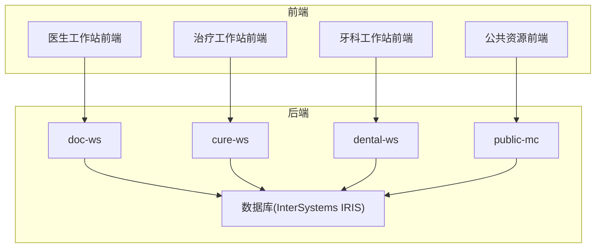
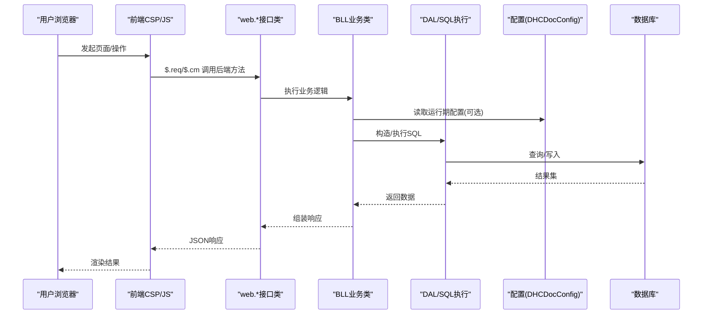
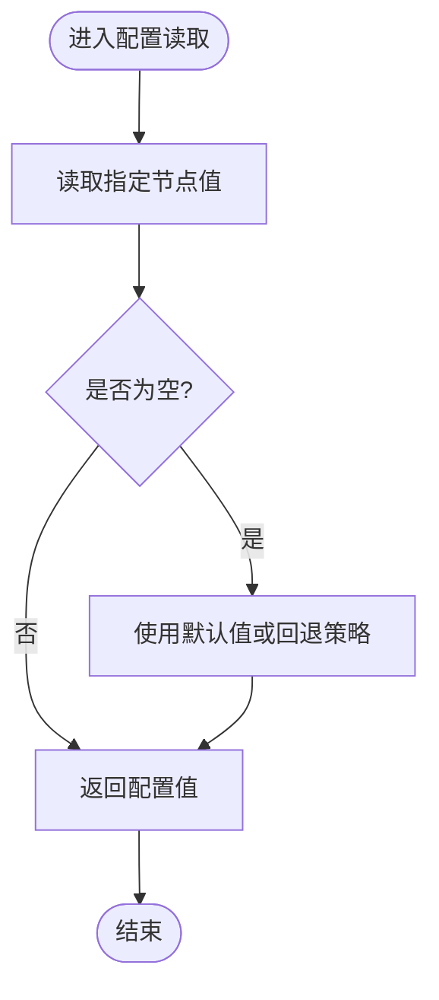
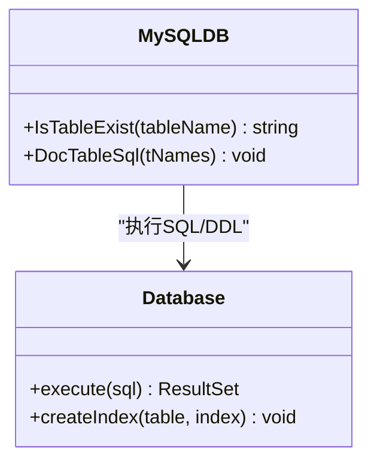
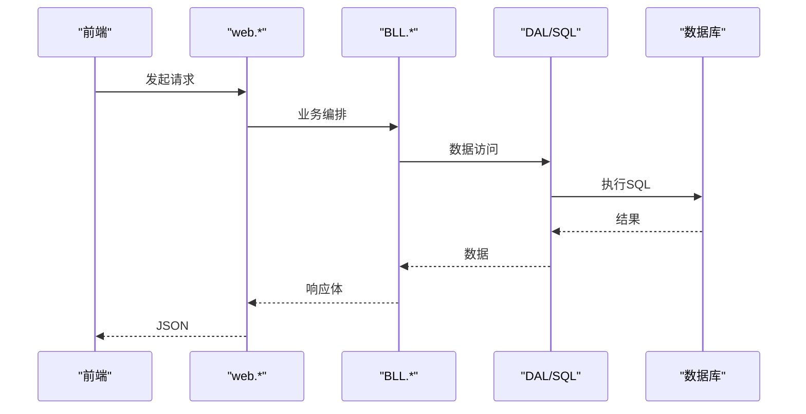
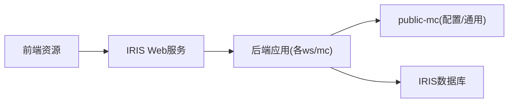

# 性能监控与测试

<cite>
**本文引用的文件**
- [README.md](file://README.md)
- [AGENTS.md](file://AGENTS.md)
- [DHCDocConfig.mac](file://src/backend/public-mc/DHCDocConfig.mac)
- [MySQLDB.cls](file://src/backend/conting-ws/DHCDoc/Interface/StandAlone/MySQLDB.cls)
</cite>

## 目录
1. [简介](#简介)
2. [项目结构](#项目结构)
3. [核心组件](#核心组件)
4. [架构总览](#架构总览)
5. [详细组件分析](#详细组件分析)
6. [依赖关系分析](#依赖关系分析)
7. [性能考虑](#性能考虑)
8. [故障排查指南](#故障排查指南)
9. [结论](#结论)
10. [附录](#附录)

## 简介
本文件面向 IRIS HIS 系统的性能监控与测试，目标是建立可落地的性能基准、负载与压力测试流程，明确关键性能指标（响应时间、吞吐量、资源利用率等）的定义与采集方法，并提供问题定位、告警规则配置与自动化脚本使用指引。文档同时结合仓库中的后端 ObjectScript 代码与公共配置，给出与系统实际一致的监控与测试建议。

## 项目结构
IRIS HIS 采用前后端分离：后端为 InterSystems IRIS ObjectScript（.cls/.mac），前端为 CSP + jQuery/HISUI。后端按产品划分模块（doc-ws、cure-ws、dental-ws、epmi-mc、opadm-mc、pilot-project-ws、pilot-study-ws、triage-ws、conting-ws），并共享 public-mc 公共资源；前端对应各产品的 csp/scripts/css 资源通过 SFTP 上传到服务器路径 <remote-path>

**图表来源**
- [README.md:10-35](file://README.md#L10-L35)

**章节来源**
- [README.md:10-35](file://README.md#L10-L35)

## 核心组件
- 后端服务层：ObjectScript 类（.cls）与 Routine（.mac）实现业务逻辑与数据访问，遵循 web → BLL → DAL 的分层约定。
- 公共配置：DHCDocConfig.mac 提供全局配置读写能力，可用于控制限流、开关等运行时行为。
- 数据访问：以 MySQLDB.cls 为代表的数据库访问封装，负责表结构生成与 SQL 执行，是性能瓶颈常见位置。

**章节来源**
- [AGENTS.md:67-88](file://AGENTS.md#L67-L88)
- [DHCDocConfig.mac:1-119](file://src/backend/public-mc/DHCDocConfig.mac#L1-L119)
- [MySQLDB.cls:1-800](file://src/backend/conting-ws/DHCDoc/Interface/StandAlone/MySQLDB.cls#L1-L800)

## 架构总览
下图展示一次典型请求从前端到后端的调用链，以及可能涉及的数据库访问与配置读取。该链路是性能监控与压测的主要观测面。

**图表来源**
- [AGENTS.md:67-88](file://AGENTS.md#L67-L88)
- [DHCDocConfig.mac:1-119](file://src/backend/public-mc/DHCDocConfig.mac#L1-L119)
- [MySQLDB.cls:1-800](file://src/backend/conting-ws/DHCDoc/Interface/StandAlone/MySQLDB.cls#L1-L800)

## 详细组件分析

### 配置中心（DHCDocConfig.mac）
- 作用：集中管理运行期配置项，支持保存/获取节点值、批量枚举节点、授权检查、日期时间工具函数等。
- 性能意义：可通过配置动态调整限流阈值、超时、开关等，便于在压测时进行参数调优与灰度验证。
- 监控点：配置变更频率、热点配置读取次数、配置解析耗时。

**图表来源**
- [DHCDocConfig.mac:1-119](file://src/backend/public-mc/DHCDocConfig.mac#L1-L119)

**章节来源**
- [DHCDocConfig.mac:1-119](file://src/backend/public-mc/DHCDocConfig.mac#L1-L119)

### 数据库访问封装（MySQLDB.cls）
- 作用：提供表存在性判断、DDL 生成（如排班、医嘱、字典等表）、SQL 执行入口等。
- 性能意义：DDL 生成与批量建表属于重操作，应仅在初始化或升级阶段执行；常规查询需关注索引、分页与批处理大小。
- 监控点：SQL 执行耗时、慢查询数量、连接池占用、锁等待。

**图表来源**
- [MySQLDB.cls:1-800](file://src/backend/conting-ws/DHCDoc/Interface/StandAlone/MySQLDB.cls#L1-L800)

**章节来源**
- [MySQLDB.cls:1-800](file://src/backend/conting-ws/DHCDoc/Interface/StandAlone/MySQLDB.cls#L1-L800)

### 前端到后端调用链（web → BLL → DAL）
- 作用：前端通过 $.req/$.cm 调用 web 接口类，再进入 BLL 与 DAL，最终访问数据库。
- 性能意义：每层都可能引入序列化/反序列化、缓存命中、事务边界等开销，压测时需分层埋点。
- 监控点：接口级耗时、BLL 计算耗时、DAL 查询耗时、错误率。

**图表来源**
- [AGENTS.md:67-88](file://AGENTS.md#L67-L88)

**章节来源**
- [AGENTS.md:67-88](file://AGENTS.md#L67-L88)

## 依赖关系分析
- 前端依赖：CSP/JS/CSS 通过 SFTP 上传至服务器统一路径，编译后由 IRIS Web 服务提供。
- 后端依赖：各产品模块共享 public-mc 的公共方法与配置；数据库访问集中在 DAL/SQL 层。
- 外部依赖：InterSystems IRIS 应用服务器与数据库实例。

**图表来源**
- [README.md:10-35](file://README.md#L10-L35)
- [AGENTS.md:67-88](file://AGENTS.md#L67-L88)

**章节来源**
- [README.md:10-35](file://README.md#L10-L35)
- [AGENTS.md:67-88](file://AGENTS.md#L67-L88)

## 性能考虑
- 关键指标定义
  - 响应时间：端到端请求耗时（P50/P90/P95/P99），含网络、Web、BLL、DAL 各段。
  - 吞吐量：单位时间成功请求数（TPS/QPS），区分读多写少场景与混合场景。
  - 资源利用率：CPU、内存、磁盘 I/O、网络带宽、数据库连接池、锁等待。
  - 错误率：服务端异常、超时、重试失败比例。
- 监控方法
  - 应用层：在 web/BLL/DAL 关键路径埋点，记录耗时、入参摘要、错误码。
  - 配置层：通过 DHCDocConfig 动态开关日志级别、采样率、限流阈值。
  - 数据层：对高频 SQL 添加执行计划分析与慢查询日志；关注索引命中率与锁竞争。
- 压测设计
  - 基准测试：单用户/低并发下测量稳定态 P95/P99 响应时间与吞吐基线。
  - 负载测试：逐步提升并发，观察线性增长拐点与资源水位。
  - 压力测试：冲击峰值并发，识别崩溃阈值与恢复策略。
  - 稳定性测试：长时间运行（如 24h+），观察内存泄漏与碎片化。
- 优化建议
  - 减少 N+1 查询，合并批量操作；合理分页与只取必要字段。
  - 热点数据启用前端/后端缓存（注意失效策略）。
  - 避免大对象传输，按需加载；压缩与异步化非关键路径。
  - 数据库侧：覆盖索引、避免全表扫描、拆分大事务。

[本节为通用指导，不直接分析具体文件]

## 故障排查指南
- 日志分析
  - 收集前端控制台、后端 web/BLL/DAL 日志与数据库慢查询日志。
  - 关联请求 ID，追踪跨层调用链。
- 系统监控
  - 监控 CPU、内存、磁盘 I/O、网络、IRIS 进程状态与数据库连接池。
  - 关注 GC 停顿、线程阻塞、锁等待。
- 瓶颈识别
  - 若前端首屏慢：检查静态资源体积、缓存命中、CDN。
  - 若接口慢：定位 web/BLL/DAL 哪一层耗时最高。
  - 若数据库慢：查看慢查询、锁等待、连接耗尽。
- 告警规则（示例）
  - 响应时间：P95 > 阈值持续 5 分钟触发告警。
  - 错误率：5xx > 阈值持续 5 分钟触发告警。
  - 资源：CPU > 80%、内存 > 85%、磁盘 I/O 饱和持续 5 分钟触发告警。
  - 数据库：慢查询数突增、连接池耗尽、锁等待时长超阈值。
- 自动化脚本
  - 使用 scripts 下的 Git/SFTP 工具进行部署与同步，确保压测环境一致性。
  - 将压测任务纳入 CI/CD，自动执行并上报指标。

[本节为通用指导，不直接分析具体文件]

## 结论
通过对 IRIS HIS 的前后端分层与公共配置的梳理，本文给出了性能监控与测试的完整方法论：明确指标定义、设计基准/负载/压力/稳定性测试、建立分层埋点与配置化开关、制定告警规则与自动化脚本。结合 DHCDocConfig 与数据库访问封装的实际代码，可在生产环境中快速落地监控与压测体系，持续提升系统稳定性与用户体验。

[本节为总结性内容，不直接分析具体文件]

## 附录
- 术语
  - TPS/QPS：每秒事务/查询数
  - P95/P99：95%/99% 分位响应时间
  - 慢查询：超过阈值的数据库查询
- 参考
  - 后端分层与调用约定见 AGENTS.md
  - 前端部署与编译流程见 README.md
  - 配置读写与工具函数见 DHCDocConfig.mac
  - 数据库访问与 DDL 生成见 MySQLDB.cls

[本节为补充说明，不直接分析具体文件]