# 开发工具

<cite>
**本文引用的文件**
- [README.md](file://README.md)
- [scripts/package.json](file://scripts/package.json)
- [scripts/git-utils.js](file://scripts/git-utils.js)
- [scripts/repo-utils.js](file://scripts/repo-utils.js)
- [scripts/git-batch-pull.js](file://scripts/git-batch-pull.js)
- [scripts/git-batch-branch.js](file://scripts/git-batch-branch.js)
- [scripts/git-batch-stash.js](file://scripts/git-batch-stash.js)
- [scripts/git-batch-mr.js](file://scripts/git-batch-mr.js)
- [scripts/get-all-logs.js](file://scripts/get-all-logs.js)
- [scripts/convert-encoding.js](file://scripts/convert-encoding.js)
- [scripts/sftp-sync.js](file://scripts/sftp-sync.js)
</cite>

## 更新摘要
**所做更改**
- 新增文件编码转换工具的详细说明和使用指南
- 增强 SFTP 同步脚本的远程删除功能说明
- 完善开发工作流文档中的配置和最佳实践
- 更新相关命令示例和故障排查指南

## 目录
1. [简介](#简介)
2. [项目结构](#项目结构)
3. [核心组件](#核心组件)
4. [架构总览](#架构总览)
5. [详细组件分析](#详细组件分析)
6. [依赖关系分析](#依赖关系分析)
7. [性能与效率建议](#性能与效率建议)
8. [故障排查指南](#故障排查指南)
9. [结论](#结论)
10. [附录：常用命令速查](#附录常用命令速查)

## 简介
本开发工具文档面向本项目（医疗信息系统）的开发者，系统化介绍 scripts 目录下的 Git 管理脚本、前端部署脚本、编码转换与日志收集等辅助工具，并给出 VS Code 配置模板、ObjectScript 扩展配置、SFTP 连接配置的实践要点。同时总结开发工作流、代码规范、提交流程与发布流程的最佳实践，以及常见问题解决方案与性能优化建议。

## 项目结构
- 根仓库通过 .gitmodules 管理两个子模块：src/backend（后端 ObjectScript）与 src/frontend（前端 CSP + jQuery）。
- scripts 目录提供多仓库 Git 操作、MR 创建、日志聚合、编码转换、SFTP 同步等工具。
- .vscode 目录存放 settings.json.template 与 sftp.json.template，用于初始化本地开发与服务器连接配置。

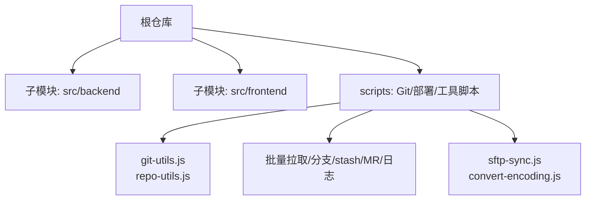

**图表来源**
- [README.md:53-60](file://README.md#L53-L60)
- [scripts/git-utils.js:14-59](file://scripts/git-utils.js#L14-L59)

**章节来源**
- [README.md:5-51](file://README.md#L5-L51)
- [README.md:53-60](file://README.md#L53-L60)

## 核心组件
- Git 多仓库发现与基础能力：git-utils.js、repo-utils.js
- 批量拉取更新：git-batch-pull.js
- 批量分支管理：git-batch-branch.js
- 批量 stash 管理：git-batch-stash.js
- 批量 MR 创建（dev → test）：git-batch-mr.js
- 全仓日志聚合：get-all-logs.js
- **新增** 文件编码转换：convert-encoding.js
- **增强** 前端 SFTP 同步：sftp-sync.js（支持远程删除）

**章节来源**
- [scripts/git-utils.js:14-59](file://scripts/git-utils.js#L14-L59)
- [scripts/repo-utils.js:16-59](file://scripts/repo-utils.js#L16-L59)
- [scripts/git-batch-pull.js:17-115](file://scripts/git-batch-pull.js#L17-L115)
- [scripts/git-batch-branch.js:14-337](file://scripts/git-batch-branch.js#L14-L337)
- [scripts/git-batch-stash.js:11-245](file://scripts/git-batch-stash.js#L11-L245)
- [scripts/git-batch-mr.js:21-717](file://scripts/git-batch-mr.js#L21-L717)
- [scripts/get-all-logs.js:11-217](file://scripts/get-all-logs.js#L11-L217)
- [scripts/convert-encoding.js:38-190](file://scripts/convert-encoding.js#L38-L190)
- [scripts/sftp-sync.js:42-290](file://scripts/sftp-sync.js#L42-L290)

## 架构总览
下图展示脚本之间的依赖关系与数据流：所有脚本通过 git-utils.js 获取仓库列表，部分脚本复用 repo-utils.js；MR 脚本额外调用 GitLab REST API；SFTP 脚本通过 psftp 执行上传/删除；编码转换脚本使用 iconv-lite。

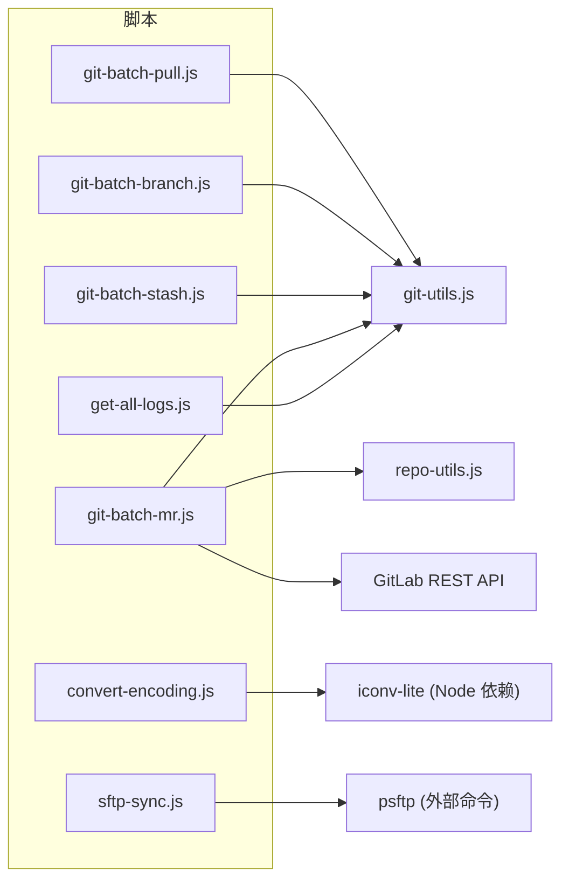

**图表来源**
- [scripts/git-utils.js:14-59](file://scripts/git-utils.js#L14-L59)
- [scripts/repo-utils.js:16-59](file://scripts/repo-utils.js#L16-L59)
- [scripts/git-batch-mr.js:279-351](file://scripts/git-batch-mr.js#L279-L351)
- [scripts/sftp-sync.js:118-164](file://scripts/sftp-sync.js#L118-L164)
- [scripts/convert-encoding.js:56-61](file://scripts/convert-encoding.js#L56-L61)

## 详细组件分析

### Git 多仓库基础能力（git-utils.js / repo-utils.js）
- 自动发现仓库：从 .gitmodules 解析子模块路径，并校验 .git 存在性，返回根仓库与所有有效子模块路径。
- detached HEAD 处理：检测并尝试关联远程分支或默认分支，自动 checkout 并建立跟踪关系。
- 仓库扫描增强：repo-utils.js 提供递归查找 Git 仓库的能力，支持跳过常见非业务目录。

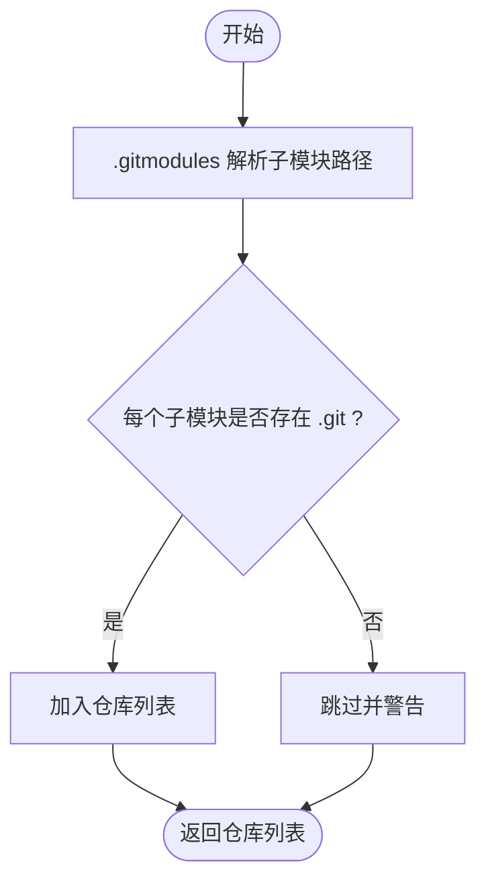

**图表来源**
- [scripts/git-utils.js:14-59](file://scripts/git-utils.js#L14-L59)
- [scripts/repo-utils.js:16-59](file://scripts/repo-utils.js#L16-L59)

**章节来源**
- [scripts/git-utils.js:62-154](file://scripts/git-utils.js#L62-L154)
- [scripts/repo-utils.js:16-59](file://scripts/repo-utils.js#L16-L59)

### 批量拉取更新（git-batch-pull.js）
- 功能：对根仓库与所有子模块执行 fetch + pull，自动处理 detached HEAD，智能判断是否已是最新。
- 关键流程：验证 Git 仓库 → fetch → 检测当前分支/状态 → 比较本地与远端 commit → 执行 pull → 汇总结果。

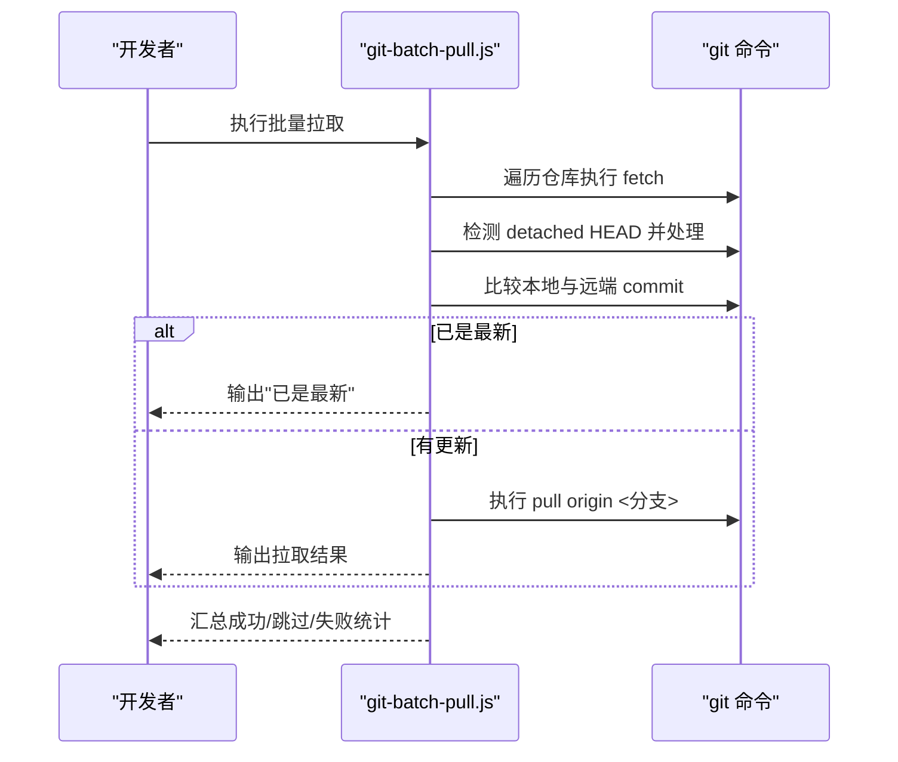

**图表来源**
- [scripts/git-batch-pull.js:17-115](file://scripts/git-batch-pull.js#L17-L115)
- [scripts/git-utils.js:62-154](file://scripts/git-utils.js#L62-L154)

**章节来源**
- [scripts/git-batch-pull.js:17-115](file://scripts/git-batch-pull.js#L17-L115)

### 批量分支管理（git-batch-branch.js）
- 功能：查看各仓库分支状态、切换分支（不存在则自动创建）、删除本地分支；支持 -S/-P 组合进行 stash push/pop。
- 关键逻辑：检查当前分支 → 可选 stash → 本地/远程分支存在性判断 → checkout/track → 可选 pop。

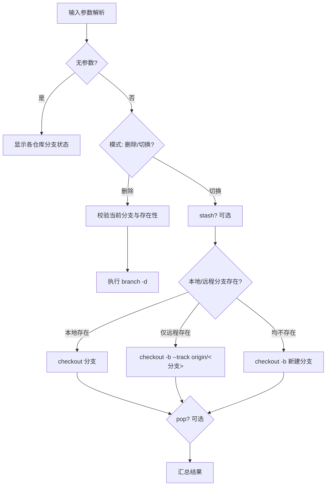

**图表来源**
- [scripts/git-batch-branch.js:14-337](file://scripts/git-batch-branch.js#L14-L337)

**章节来源**
- [scripts/git-batch-branch.js:14-337](file://scripts/git-batch-branch.js#L14-L337)

### 批量 stash 管理（git-batch-stash.js）
- 功能：一键 stash/pop/list，支持包含未跟踪文件；仅对有更改/有记录的仓库执行。
- 关键逻辑：status --porcelain 检测变更 → 条件执行 stash push/pop → 聚合显示 stash 列表。

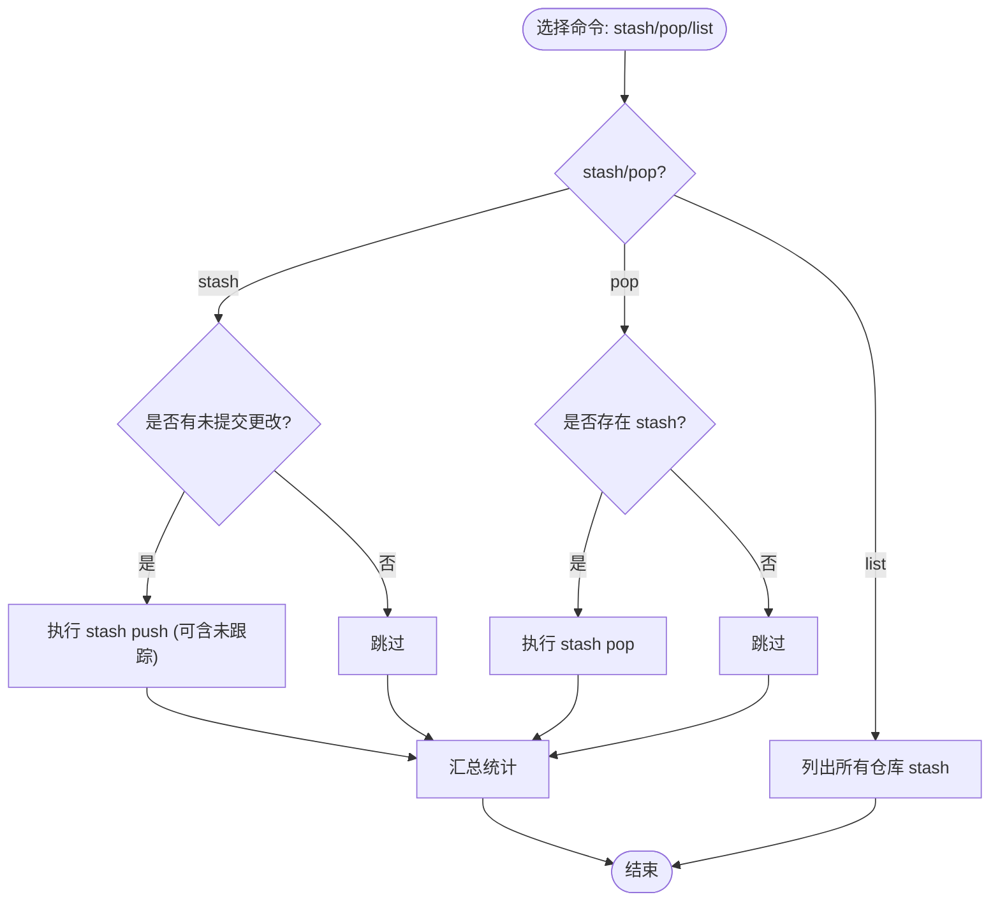

**图表来源**
- [scripts/git-batch-stash.js:11-245](file://scripts/git-batch-stash.js#L11-L245)

**章节来源**
- [scripts/git-batch-stash.js:11-245](file://scripts/git-batch-stash.js#L11-L245)

### 批量 MR 创建（git-batch-mr.js）
- 功能：为所有 GitLab 子模块创建 dev → test 的提测 MR；内置冲突检测与引导解决；支持 dry-run、auto-continue、token 全自动创建。
- 关键流程：前置检查（远程类型、工作区干净、当前分支、进行中合并）→ 同步分支 → 试合并检测冲突 → 推送并创建 MR（API 优先，push options 兜底，手动链接降级）→ 汇总报告。

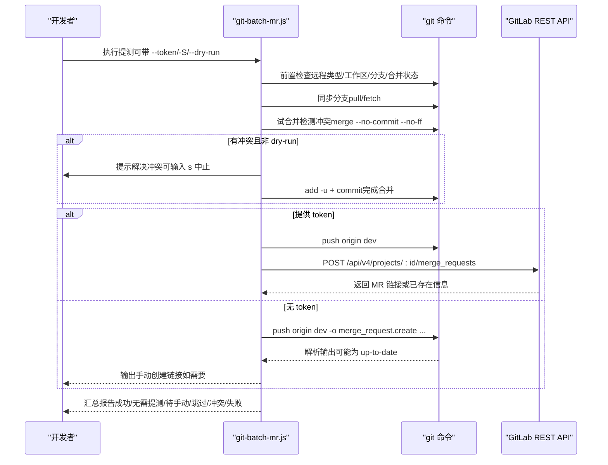

**图表来源**
- [scripts/git-batch-mr.js:21-717](file://scripts/git-batch-mr.js#L21-L717)

**章节来源**
- [scripts/git-batch-mr.js:21-717](file://scripts/git-batch-mr.js#L21-L717)

### 全仓日志聚合（get-all-logs.js）
- 功能：聚合根仓库与所有子模块的提交历史，支持按日期范围、作者过滤，可选显示修改文件列表。
- 关键逻辑：遍历仓库 → 执行 git log 格式化输出 → 解析记录 → 排序与过滤 → 格式化打印。

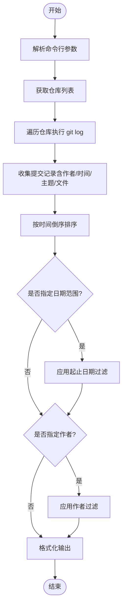

**图表来源**
- [scripts/get-all-logs.js:11-217](file://scripts/get-all-logs.js#L11-L217)

**章节来源**
- [scripts/get-all-logs.js:11-217](file://scripts/get-all-logs.js#L11-L217)

### 文件编码转换（convert-encoding.js）
**新增功能** 在 UTF-8 与 GB2312 之间转换单文件；严格 UTF-8 字节校验，避免混合编码污染；支持输出到指定目录或覆盖原文件。
- 关键逻辑：读取文件 → 探测编码（严格 UTF-8 或 GBK 解码）→ 转换并写出 → 输出结果摘要。

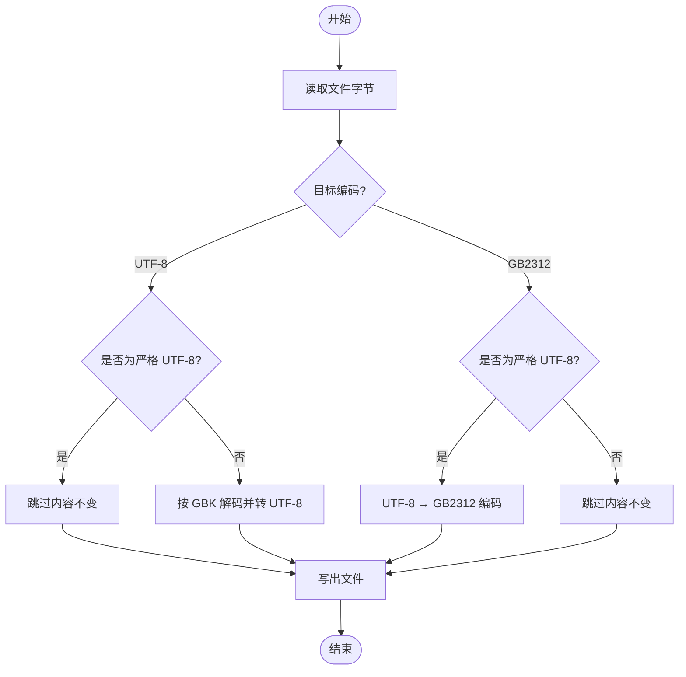

**图表来源**
- [scripts/convert-encoding.js:56-123](file://scripts/convert-encoding.js#L56-L123)
- [scripts/convert-encoding.js:127-190](file://scripts/convert-encoding.js#L127-L190)

**章节来源**
- [scripts/convert-encoding.js:38-190](file://scripts/convert-encoding.js#L38-L190)
- [scripts/package.json:1-10](file://scripts/package.json#L1-L10)

### 前端 SFTP 同步（sftp-sync.js）
**增强功能** 通过 psftp 将前端文件上传/删除到服务器；从 .vscode/sftp.json 读取连接与目录映射；支持 upload/delete/check。
- 关键逻辑：解析配置 → 匹配 context → 生成远程路径 → 分组同主机会话 → 写入批处理命令 → 执行 psftp → 提示 CSP 编译。

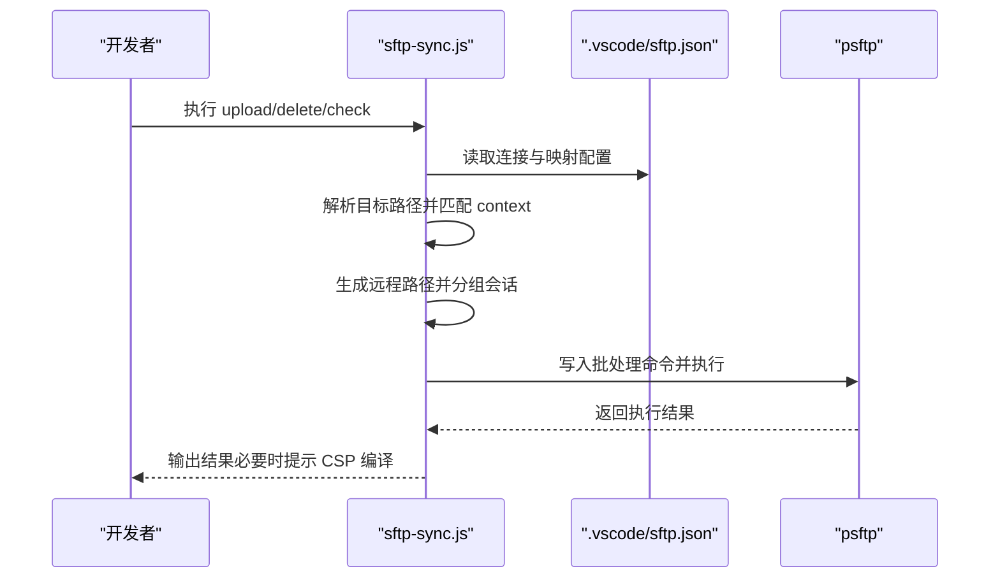

**图表来源**
- [scripts/sftp-sync.js:53-95](file://scripts/sftp-sync.js#L53-L95)
- [scripts/sftp-sync.js:118-164](file://scripts/sftp-sync.js#L118-L164)
- [scripts/sftp-sync.js:181-270](file://scripts/sftp-sync.js#L181-L270)

**章节来源**
- [scripts/sftp-sync.js:42-290](file://scripts/sftp-sync.js#L42-290)

## 依赖关系分析
- 脚本层依赖：
  - git-utils.js：被多个 Git 脚本复用，负责仓库发现与 detached HEAD 处理。
  - repo-utils.js：提供通用仓库扫描能力（当前未被其他脚本直接引用，但可作为扩展能力）。
  - convert-encoding.js：依赖 iconv-lite（scripts/package.json 声明）。
  - sftp-sync.js：依赖外部命令 psftp（需安装 PuTTY 并加入 PATH）。
  - git-batch-mr.js：可选依赖 GitLab REST API（通过 https 请求），支持环境变量 GITLAB_TOKEN。
- 外部系统：
  - GitLab：REST API 创建 MR（内网 IP + 自签名证书场景关闭证书校验）。
  - IRIS：后端通过 ObjectScript 扩展编译上传（不在本脚本范围内）。

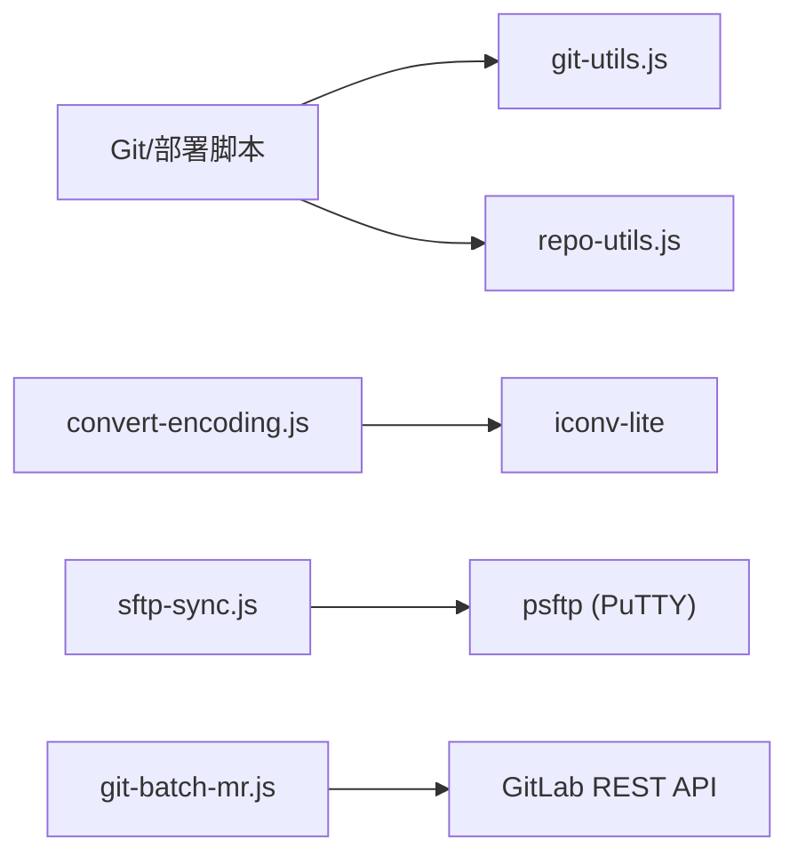

**图表来源**
- [scripts/git-utils.js:14-59](file://scripts/git-utils.js#L14-L59)
- [scripts/repo-utils.js:16-59](file://scripts/repo-utils.js#L16-L59)
- [scripts/convert-encoding.js:56-61](file://scripts/convert-encoding.js#L56-L61)
- [scripts/sftp-sync.js:118-164](file://scripts/sftp-sync.js#L118-L164)
- [scripts/git-batch-mr.js:279-351](file://scripts/git-batch-mr.js#L279-L351)

**章节来源**
- [scripts/package.json:1-10](file://scripts/package.json#L1-L10)
- [scripts/git-batch-mr.js:279-351](file://scripts/git-batch-mr.js#L279-L351)
- [scripts/sftp-sync.js:118-164](file://scripts/sftp-sync.js#L118-L164)

## 性能与效率建议
- 批量操作优先：使用批量脚本减少重复命令与人工干预，降低出错概率。
- 避免不必要推送：MR 脚本在 dry-run 模式下仅检测冲突，不推送、不创建 MR，适合提测前预检。
- 合理缓存与分组：SFTP 同步按主机端口用户名分组会话，减少多次连接开销。
- **新增** 编码转换谨慎：仅在确认为历史遗留 GB2312 文件时使用编码转换，避免误改 UTF-8 文件。
- **新增** 远程删除安全：使用 sftp-sync.js delete 时需谨慎确认，避免误删重要文件。
- 日志聚合优化：使用 get-all-logs.js 的日期与作者过滤，快速定位问题提交。

## 故障排查指南
- 未找到任何 Git 仓库：
  - 确认已执行 git submodule update --init --recursive，确保子模块初始化完成。
  - 检查 .gitmodules 是否正确配置，子模块目录是否存在 .git。
- detached HEAD 状态：
  - 使用 git-batch-pull.js 或 git-batch-branch.js 自动关联并切换到对应分支。
- MR 未创建（Everything up-to-date）：
[REDACTED: environment-specific example]
- SFTP 首次连接失败：
  - 首次连接需缓存主机密钥，脚本会自动重试；若失败，按提示手动执行一次交互以缓存密钥。
- **新增** 编码转换报错（混合编码污染）：
  - 拒绝转换并提示人工检查；建议使用标准 UTF-8 编辑器重新保存文件。
- **新增** SFTP 删除失败：
  - 确认文件确实存在于服务器；检查网络连接和权限设置；查看 psftp 输出错误信息。

**章节来源**
- [scripts/git-batch-pull.js:72-115](file://scripts/git-batch-pull.js#L72-L115)
- [scripts/git-batch-branch.js:233-337](file://scripts/git-batch-branch.js#L233-L337)
- [scripts/git-batch-mr.js:378-561](file://scripts/git-batch-mr.js#L378-L561)
- [scripts/sftp-sync.js:118-164](file://scripts/sftp-sync.js#L118-L164)
- [scripts/convert-encoding.js:88-123](file://scripts/convert-encoding.js#L88-L123)

## 结论
[REDACTED: environment-specific example]

## 附录：常用命令速查
- 批量拉取更新
  - node scripts/git-batch-pull.js
- 批量分支管理
  - node scripts/git-batch-branch.js
  - node scripts/git-batch-branch.js feature/xxx
  - node scripts/git-batch-branch.js -d feature/old
  - node scripts/git-batch-branch.js -S -P feature/xxx
- 批量 stash 管理
  - node scripts/git-batch-stash.js stash
  - node scripts/git-batch-stash.js stash -u
  - node scripts/git-batch-stash.js pop
  - node scripts/git-batch-stash.js list
- 批量 MR 创建（dev → test）
  - node scripts/git-batch-mr.js
[REDACTED: environment-specific example]
  - node scripts/git-batch-mr.js -t "chore: v1.2.0 提测"
  - node scripts/git-batch-mr.js --dry-run
  - node scripts/git-batch-mr.js -S
- 全仓日志聚合
  - node scripts/get-all-logs.js
  - node scripts/get-all-logs.js --start-date 2026-06-01 --end-date 2026-06-10
  - node scripts/get-all-logs.js --author "wangqingyong1014"
  - node scripts/get-all-logs.js --show-files
- **新增** 文件编码转换
  - node scripts/convert-encoding.js <文件路径> <目标编码> [输出目录]
  - node scripts/convert-encoding.js src/frontend/doc-ws/scripts/xxx.js utf-8
  - node scripts/convert-encoding.js src/frontend/doc-ws/csp/xxx.csp gb2312 tmp/converted
- **增强** 前端 SFTP 同步
  - node scripts/sftp-sync.js upload <文件或目录...>
  - node scripts/sftp-sync.js delete <文件...>
  - node scripts/sftp-sync.js check <文件或目录...>

**章节来源**
- [README.md:302-509](file://README.md#L302-L509)
- [scripts/git-batch-pull.js:72-115](file://scripts/git-batch-pull.js#L72-L115)
- [scripts/git-batch-branch.js:14-337](file://scripts/git-batch-branch.js#L14-L337)
- [scripts/git-batch-stash.js:11-245](file://scripts/git-batch-stash.js#L11-L245)
- [scripts/git-batch-mr.js:21-717](file://scripts/git-batch-mr.js#L21-L717)
- [scripts/get-all-logs.js:11-217](file://scripts/get-all-logs.js#L11-L217)
- [scripts/convert-encoding.js:38-190](file://scripts/convert-encoding.js#L38-L190)
- [scripts/sftp-sync.js:42-290](file://scripts/sftp-sync.js#L42-290)