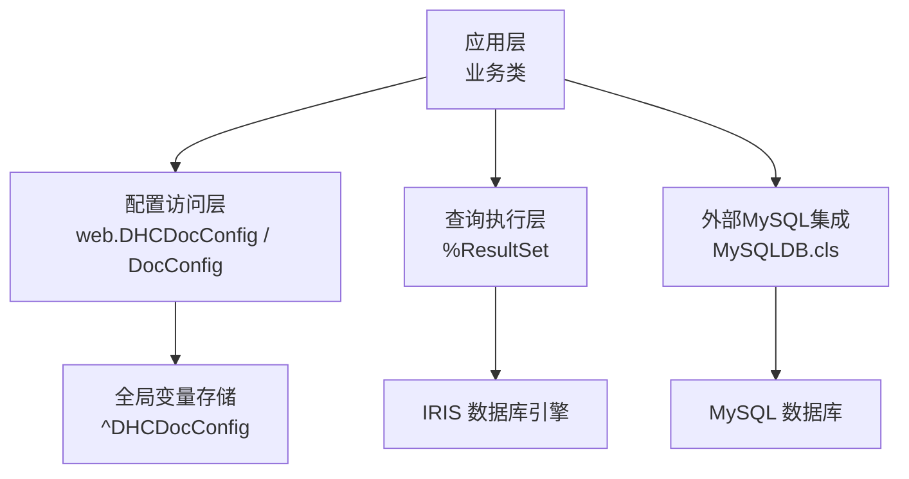
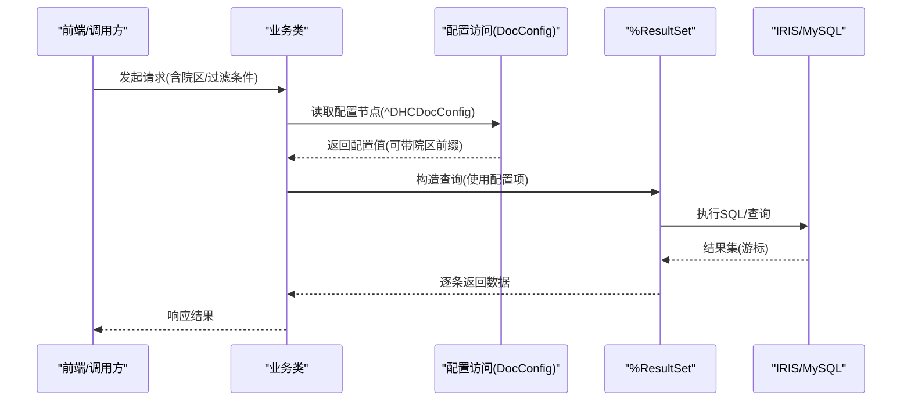
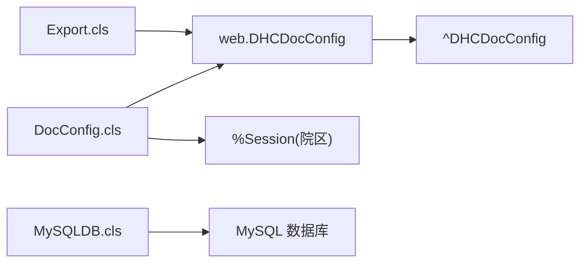

# 数据库优化

<cite>
**本文引用的文件**
- [MySQLDB.cls](file://src/backend/conting-ws/DHCDoc/Interface/StandAlone/MySQLDB.cls)
- [DocConfig.cls](file://src/backend/doc-ws/DHCDoc/DHCDocConfig/DocConfig.cls)
- [Base.cls](file://src/backend/conting-ws/DHCDoc/Interface/StandAlone/Base.cls)
- [Export.cls](file://src/backend/conting-ws/DHCDoc/Interface/StandAlone/Export.cls)
</cite>

## 目录
1. [简介](#简介)
2. [项目结构](#项目结构)
3. [核心组件](#核心组件)
4. [架构总览](#架构总览)
5. [详细组件分析](#详细组件分析)
6. [依赖关系分析](#依赖关系分析)
7. [性能考虑](#性能考虑)
8. [故障排查指南](#故障排查指南)
9. [结论](#结论)
10. [附录](#附录)

## 简介
本文件面向IRIS HIS系统的数据库性能优化，聚焦全局变量配置、索引设计、查询语句优化、事务与批量操作、连接池管理等方面。结合仓库中实际代码，给出针对^DHCDocConfig等全局变量的使用模式、基于%ResultSet的查询实现、以及MySQL建表脚本中的索引策略，并提供监控指标、慢查询分析与瓶颈识别方法，总结常见问题与最佳实践。

## 项目结构
- 后端服务按业务域划分（doc-ws、cure-ws、conting-ws等），其中：
  - doc-ws/DHCDoc/DHCDocConfig：提供大量配置读取/写入接口，广泛使用^DHCDocConfig全局变量进行参数化控制。
  - conting-ws/DHCDoc/Interface/StandAlone：包含独立接口能力，如MySQLDB.cls用于生成/检查MySQL表结构，并定义了大量索引约束。
  - 多处通过%ResultSet执行查询，体现IRIS内置查询机制的使用。

**图表来源**
- [DocConfig.cls:11-33](file://src/backend/doc-ws/DHCDoc/DHCDocConfig/DocConfig.cls#L11-L33)
- [MySQLDB.cls:16-26](file://src/backend/conting-ws/DHCDoc/Interface/StandAlone/MySQLDB.cls#L16-L26)

**章节来源**
- [DocConfig.cls:11-33](file://src/backend/doc-ws/DHCDoc/DHCDocConfig/DocConfig.cls#L11-L33)
- [MySQLDB.cls:16-26](file://src/backend/conting-ws/DHCDoc/Interface/StandAlone/MySQLDB.cls#L16-L26)

## 核心组件
- 配置访问与缓存
  - 通过DocConfig等类封装对^DHCDocConfig的读写，支持按院区隔离（HospDr_前缀）与多节点键值组织，减少重复I/O。
- 查询执行
  - 使用%ResultSet执行预定义查询或动态查询，配合游标式Fetch降低内存占用。
- 外部MySQL集成
  - MySQLDB.cls提供表存在性检查与DDL生成，集中维护关键表的索引与约束，确保跨库一致性。

**章节来源**
- [DocConfig.cls:315-388](file://src/backend/doc-ws/DHCDoc/DHCDocConfig/DocConfig.cls#L315-L388)
- [DocConfig.cls:699-743](file://src/backend/doc-ws/DHCDoc/DHCDocConfig/DocConfig.cls#L699-L743)
- [MySQLDB.cls:16-26](file://src/backend/conting-ws/DHCDoc/Interface/StandAlone/MySQLDB.cls#L16-L26)

## 架构总览
下图展示从业务调用到配置读取、查询执行与数据落盘的典型路径，突出^DHCDocConfig在参数化与多院区隔离中的作用，以及%ResultSet在高效分页/流式读取中的角色。

**图表来源**
- [DocConfig.cls:11-33](file://src/backend/doc-ws/DHCDoc/DHCDocConfig/DocConfig.cls#L11-L33)
- [DocConfig.cls:315-388](file://src/backend/doc-ws/DHCDoc/DHCDocConfig/DocConfig.cls#L315-L388)
- [DocConfig.cls:699-743](file://src/backend/doc-ws/DHCDoc/DHCDocConfig/DocConfig.cls#L699-L743)

## 详细组件分析

### 组件A：^DHCDocConfig全局变量优化
- 作用与模式
  - 以“键-值”形式存储系统/院区级配置，支持层级节点与院区隔离（HospDr_前缀）。
  - 通过GetConfigNode/New2等方法统一读取，避免散落的$g(^DHCDocConfig(...))调用，便于审计与缓存。
- 优化建议
  - 将热点配置（如分页大小、默认日期范围、菜单串等）集中管理，减少运行时分支判断。
  - 对频繁读写的配置采用本地缓存或会话级缓存，降低全局变量访问开销。
  - 严格区分院区级与全局级键名，避免误用导致的数据污染。
- 相关实现参考
  - 配置读取与JSON序列化输出，支持按院区选择节点。
  - 多处业务通过GetConfigNode/SaveConfig1读写配置。

**章节来源**
- [DocConfig.cls:315-388](file://src/backend/doc-ws/DHCDoc/DHCDocConfig/DocConfig.cls#L315-L388)
- [Base.cls:28-33](file://src/backend/conting-ws/DHCDoc/Interface/StandAlone/Base.cls#L28-L33)
- [Export.cls:379-491](file://src/backend/conting-ws/DHCDoc/Interface/StandAlone/Export.cls#L379-L491)

### 组件B：索引设计与建表脚本（MySQL）
- 索引策略
  - 主键+唯一键+常用查询列复合索引，覆盖高频过滤与排序字段。
  - 关联外键建立索引，提升JOIN效率。
  - 时间/状态类字段建立索引，加速范围查询与统计。
- 示例要点
  - 为患者基本信息表建立姓名、电话、更新日期的索引组合。
  - 为排班表建立日期与资源维度的复合索引，支撑预约查询。
  - 为医嘱模板/收藏表建立类别与顺序索引，提高列表加载速度。
- 相关实现参考
  - 大量CREATE TABLE语句中包含PRIMARY KEY、UNIQUE KEY、KEY等索引定义。

**章节来源**
- [MySQLDB.cls:241-272](file://src/backend/conting-ws/DHCDoc/Interface/StandAlone/MySQLDB.cls#L241-L272)
- [MySQLDB.cls:716-757](file://src/backend/conting-ws/DHCDoc/Interface/StandAlone/MySQLDB.cls#L716-L757)
- [MySQLDB.cls:621-688](file://src/backend/conting-ws/DHCDoc/Interface/StandAlone/MySQLDB.cls#L621-L688)

### 组件C：查询语句优化（%ResultSet）
- 使用模式
  - 通过%ResultSet执行预定义查询，利用Execute/Next/Fetch流式处理，避免一次性加载全量数据。
  - 在查询中结合院区过滤、状态过滤、时间范围等条件，缩小扫描范围。
- 优化建议
  - 优先使用预编译查询与参数绑定，减少解析开销。
  - 对大结果集采用分页/分批拉取，限制单次返回行数。
  - 避免SELECT *，仅选取必要字段；尽量使用覆盖索引。
- 相关实现参考
  - 多处RunQuery/Execute调用，结合业务参数进行过滤。

**章节来源**
- [DocConfig.cls:699-743](file://src/backend/doc-ws/DHCDoc/DHCDocConfig/DocConfig.cls#L699-L743)

### 组件D：事务管理与批量操作
- 事务原则
  - 对写操作（插入/更新/删除）使用事务包裹，保证原子性与一致性。
  - 合理拆分事务粒度，避免长事务锁竞争。
- 批量操作
  - 合并多次INSERT/UPDATE为批量提交，减少网络往返与日志开销。
  - 对大批量导入场景，考虑临时表+批量插入+索引重建的策略。
- 相关实现参考
  - SQL语句嵌入点（INSERT/DELETE）位于配置保存与清理逻辑中。

**章节来源**
- [DocConfig.cls:121-151](file://src/backend/doc-ws/DHCDoc/DHCDocConfig/DocConfig.cls#L121-L151)

### 组件E：连接池与外部MySQL集成
- 连接管理
  - 对外部MySQL的连接应复用连接池，避免频繁创建销毁。
  - 设置合理的超时、最大连接数与空闲回收策略。
- 工具类
  - MySQLDB.cls提供表存在性检查与DDL生成，便于环境初始化与版本演进。
- 相关实现参考
  - IsTableExist方法通过INFORMATION_SCHEMA查询验证表存在性。

**章节来源**
- [MySQLDB.cls:16-26](file://src/backend/conting-ws/DHCDoc/Interface/StandAlone/MySQLDB.cls#L16-L26)

## 依赖关系分析
- DocConfig依赖web.DHCDocConfig进行配置节点读取，并通过%Session获取院区信息，形成“业务-配置-会话”的耦合链。
- Export等模块直接读取^DHCDocConfig的多级节点，体现配置驱动的业务分支。
- MySQLDB.cls作为基础设施，被部署/运维流程引用，保障外部MySQL结构一致。

**图表来源**
- [Export.cls:379-491](file://src/backend/conting-ws/DHCDoc/Interface/StandAlone/Export.cls#L379-L491)
- [DocConfig.cls:315-388](file://src/backend/doc-ws/DHCDoc/DHCDocConfig/DocConfig.cls#L315-L388)
- [MySQLDB.cls:16-26](file://src/backend/conting-ws/DHCDoc/Interface/StandAlone/MySQLDB.cls#L16-L26)

**章节来源**
- [Export.cls:379-491](file://src/backend/conting-ws/DHCDoc/Interface/StandAlone/Export.cls#L379-L491)
- [DocConfig.cls:315-388](file://src/backend/doc-ws/DHCDoc/DHCDocConfig/DocConfig.cls#L315-L388)
- [MySQLDB.cls:16-26](file://src/backend/conting-ws/DHCDoc/Interface/StandAlone/MySQLDB.cls#L16-L26)

## 性能考虑
- 全局变量优化
  - 热点配置缓存化，减少全局变量访问次数。
  - 使用院区前缀隔离，避免跨院区数据混淆导致的额外过滤成本。
- 索引设计
  - 基于查询模式设计复合索引，覆盖常见WHERE/ORDER BY/JOIN条件。
  - 定期评估索引使用率，移除冗余索引以降低写放大。
- 查询优化
  - 使用%ResultSet流式读取，限制返回行数，避免大结果集内存压力。
  - 避免函数包裹索引列，保持索引可用。
- 事务与批量
  - 合并小事务为大事务，减少提交次数。
  - 对大批量导入采用分批提交与临时表策略。
- 连接池
  - 合理设置连接池大小与超时，避免连接泄漏与争用。
  - 监控连接使用峰值，动态调整容量。

[本节为通用指导，不直接分析具体文件]

## 故障排查指南
- 慢查询定位
  - 启用IRIS慢查询日志，记录执行时间与SQL文本，结合执行计划分析。
  - 对MySQL侧开启慢查询日志，配合EXPLAIN分析索引命中情况。
- 常见症状与对策
  - 列表加载缓慢：检查是否缺少索引、是否未分页、是否SELECT *。
  - 配置读取延迟：确认是否频繁访问^DHCDocConfig且未缓存。
  - 事务阻塞：检查长事务与锁等待，拆分或缩短事务。
  - 连接耗尽：检查连接池配置与泄漏，增加池大小或修复释放逻辑。
- 监控指标
  - IRIS：CPU/内存/IO利用率、事务并发度、锁等待、查询耗时分布。
  - MySQL：QPS/TPS、InnoDB缓冲池命中率、慢查询数量、连接数、磁盘IO。

[本节为通用指导，不直接分析具体文件]

## 结论
通过对^DHCDocConfig的规范化使用、基于%ResultSet的高效查询、完善的索引设计与事务/批量优化，以及连接池与监控体系的完善，可显著提升IRIS HIS系统的数据库性能与稳定性。建议持续跟踪慢查询与指标变化，迭代优化索引与查询模式，确保在高并发场景下的稳定表现。

[本节为总结，不直接分析具体文件]

## 附录
- 关键实现路径参考
  - 配置读取与JSON输出：[DocConfig.cls:315-388](file://src/backend/doc-ws/DHCDoc/DHCDocConfig/DocConfig.cls#L315-L388)
  - 配置节点读取（院区隔离）：[Base.cls:28-33](file://src/backend/conting-ws/DHCDoc/Interface/StandAlone/Base.cls#L28-L33)
  - 配置驱动的业务分支（处方类型/收费映射等）：[Export.cls:379-491](file://src/backend/conting-ws/DHCDoc/Interface/StandAlone/Export.cls#L379-L491)
  - MySQL表存在性检查：[MySQLDB.cls:16-26](file://src/backend/conting-ws/DHCDoc/Interface/StandAlone/MySQLDB.cls#L16-L26)
  - 排班表索引设计示例：[MySQLDB.cls:716-757](file://src/backend/conting-ws/DHCDoc/Interface/StandAlone/MySQLDB.cls#L716-L757)
  - 患者信息表索引设计示例：[MySQLDB.cls:241-272](file://src/backend/conting-ws/DHCDoc/Interface/StandAlone/MySQLDB.cls#L241-L272)
  - 医嘱模板/收藏索引设计示例：[MySQLDB.cls:621-688](file://src/backend/conting-ws/DHCDoc/Interface/StandAlone/MySQLDB.cls#L621-L688)
  - 查询执行示例（游标式）：[DocConfig.cls:699-743](file://src/backend/doc-ws/DHCDoc/DHCDocConfig/DocConfig.cls#L699-L743)
  - 配置保存/删除（事务内SQL）：[DocConfig.cls:121-151](file://src/backend/doc-ws/DHCDoc/DHCDocConfig/DocConfig.cls#L121-L151)