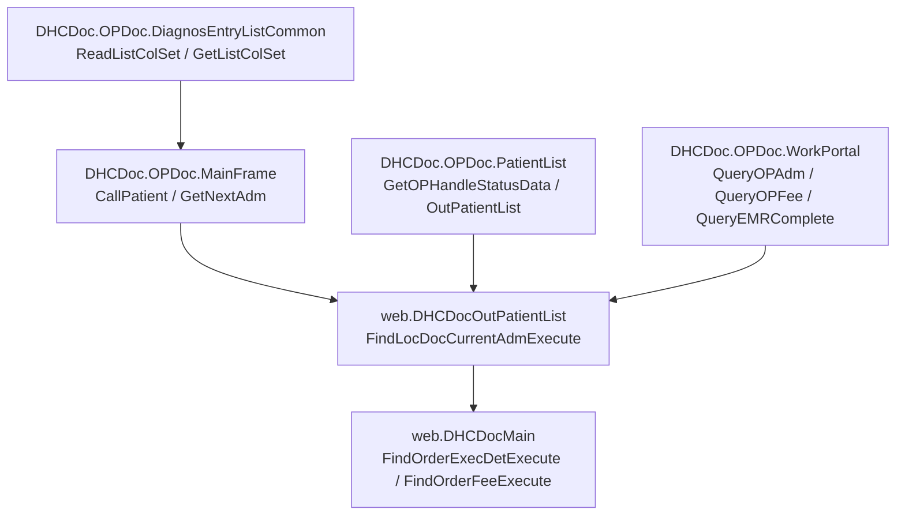
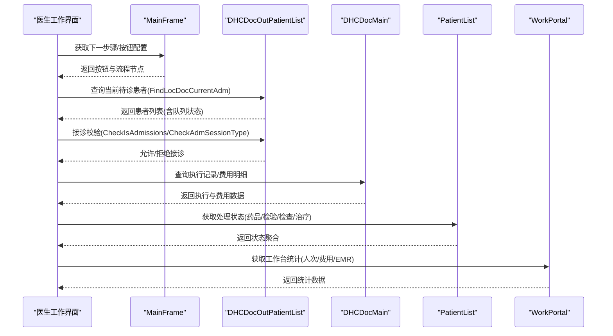
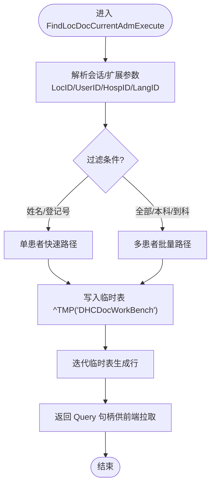
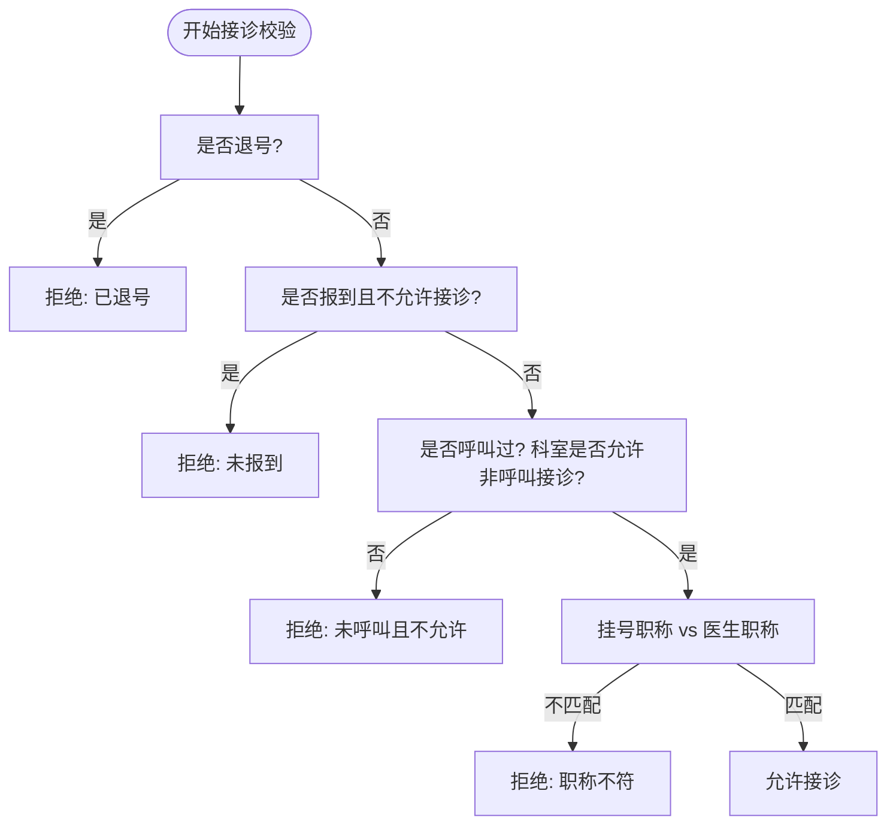
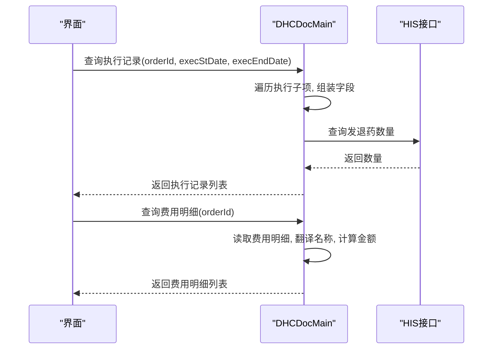
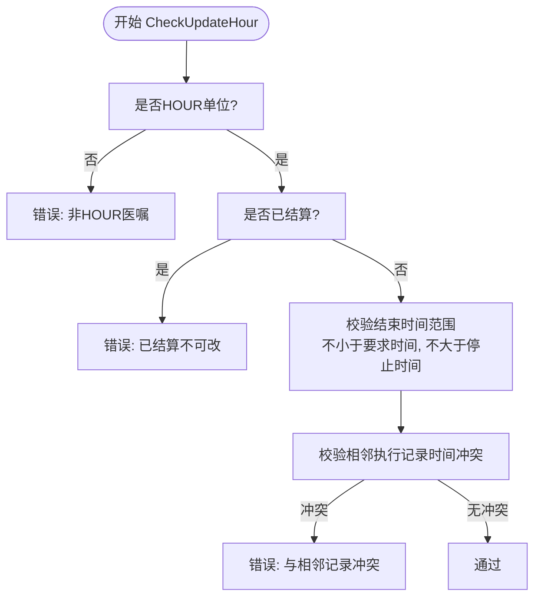
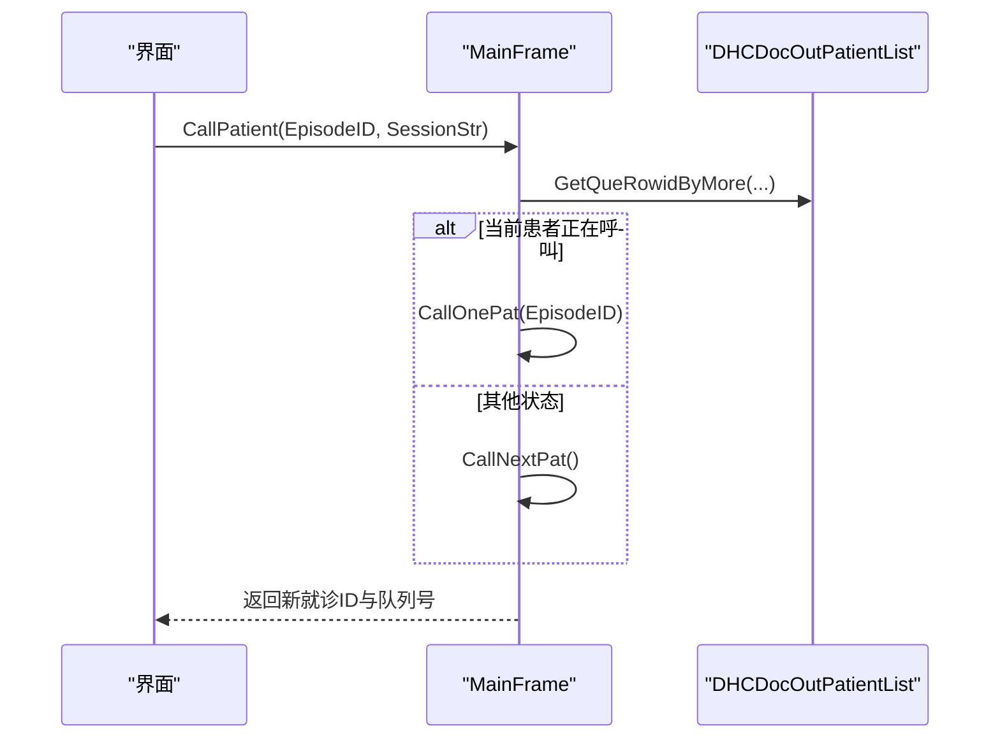
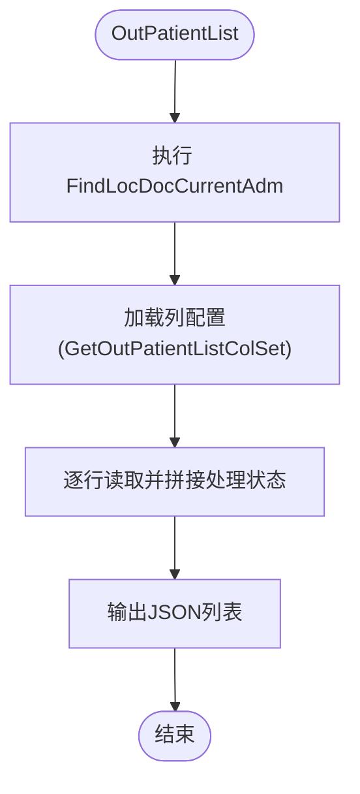
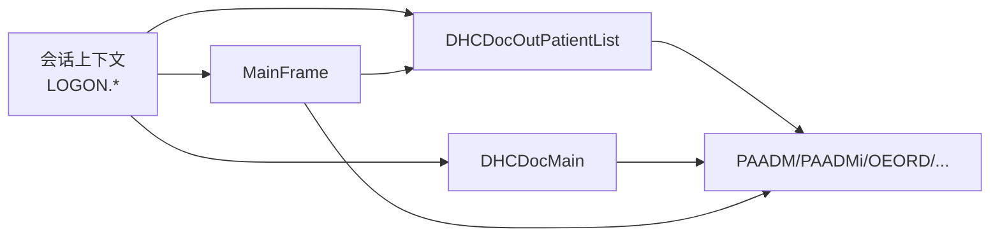

# 门诊医生工作流

<cite>
**本文引用的文件**
- [DHCDocMain.cls](file://src/backend/doc-ws/web/DHCDocMain.cls)
- [DHCDocOutPatientList.cls](file://src/backend/doc-ws/web/DHCDocOutPatientList.cls)
- [MainFrame.cls](file://src/backend/doc-ws/DHCDoc/OPDoc/MainFrame.cls)
- [PatientList.cls](file://src/backend/doc-ws/DHCDoc/OPDoc/PatientList.cls)
- [WorkPortal.cls](file://src/backend/doc-ws/DHCDoc/OPDoc/WorkPortal.cls)
- [DiagnosEntryListCommon.cls](file://src/backend/doc-ws/DHCDoc/OPDoc/DiagnosEntryListCommon.cls)
</cite>

## 目录
1. [简介](#简介)
2. [项目结构](#项目结构)
3. [核心组件](#核心组件)
4. [架构总览](#架构总览)
5. [详细组件分析](#详细组件分析)
6. [依赖关系分析](#依赖关系分析)
7. [性能考虑](#性能考虑)
8. [故障排查指南](#故障排查指南)
9. [结论](#结论)
10. [附录](#附录)

## 简介
本文件面向门诊医生工作流的完整实现，覆盖患者登记、诊断录入、医嘱开具、处方管理、费用结算等关键环节；重点解析 DHCDocMain.FindLocDocCurrentAdmExecute 的患者查询逻辑与状态流转机制，并给出界面交互流程、数据模型与接口契约、权限控制与业务规则验证要点，以及可复用的核心实现模式。

## 项目结构
围绕门诊医生工作站的后端服务主要分布在 doc-ws 模块中：
- web.DHCDocMain：提供执行记录、费用明细、小时医嘱校验、停嘱权限等通用能力
- web.DHCDocOutPatientList：门诊患者列表查询（FindLocDocCurrentAdm）及接诊准入校验
- DHCDoc.OPDoc.MainFrame：主框架按钮、流程步骤、呼叫患者、未读报告统计等
- DHCDoc.OPDoc.PatientList：患者列表列配置、处理状态聚合（药品/检验/检查/治疗）
- DHCDoc.OPDoc.WorkPortal：工作台指标统计（人次、费用、预约、EMR完成度）
- DHCDoc.OPDoc.DiagnosEntryListCommon：诊断录入列表配置与列设置

图表来源
- [DHCDocOutPatientList.cls:117-200](file://src/backend/doc-ws/web/DHCDocOutPatientList.cls#L117-L200)
- [DHCDocMain.cls:8-127](file://src/backend/doc-ws/web/DHCDocMain.cls#L8-L127)
- [MainFrame.cls:260-379](file://src/backend/doc-ws/DHCDoc/OPDoc/MainFrame.cls#L260-L379)
- [PatientList.cls:145-334](file://src/backend/doc-ws/DHCDoc/OPDoc/PatientList.cls#L145-L334)
- [WorkPortal.cls:85-231](file://src/backend/doc-ws/DHCDoc/OPDoc/WorkPortal.cls#L85-L231)
- [DiagnosEntryListCommon.cls:94-232](file://src/backend/doc-ws/DHCDoc/OPDoc/DiagnosEntryListCommon.cls#L94-L232)

章节来源
- [DHCDocOutPatientList.cls:117-200](file://src/backend/doc-ws/web/DHCDocOutPatientList.cls#L117-L200)
- [DHCDocMain.cls:8-127](file://src/backend/doc-ws/web/DHCDocMain.cls#L8-L127)
- [MainFrame.cls:260-379](file://src/backend/doc-ws/DHCDoc/OPDoc/MainFrame.cls#L260-L379)
- [PatientList.cls:145-334](file://src/backend/doc-ws/DHCDoc/OPDoc/PatientList.cls#L145-L334)
- [WorkPortal.cls:85-231](file://src/backend/doc-ws/DHCDoc/OPDoc/WorkPortal.cls#L85-L231)
- [DiagnosEntryListCommon.cls:94-232](file://src/backend/doc-ws/DHCDoc/OPDoc/DiagnosEntryListCommon.cls#L94-L232)

## 核心组件
- 患者查询与接诊准入
  - web.DHCDocOutPatientList.FindLocDocCurrentAdmExecute：按科室/医生/时间范围/队列状态筛选当前待诊患者，支持多种过滤维度（挂号队列、已到队列、报告、已完成等）
  - CheckIsAdmissions / CheckAdmSessionType：接诊前校验（退号、报到、职称匹配、是否呼叫过等）
- 执行记录与费用
  - web.DHCDocMain.FindOrderExecDetExecute：查询某条医嘱的执行明细（要求执行时间、执行状态、计费状态、免费标志、发退药数量等）
  - web.DHCDocMain.FindOrderFeeExecute：查询费用明细（收费项名称、代码、数量、单价、金额、记账时间、原因）
- 小时医嘱修改校验
  - web.DHCDocMain.CheckUpdateHour：校验小时医嘱结束时间的合法性（前后相邻执行记录、停止时间、已结算限制）
- 停嘱权限
  - web.DHCDocMain.CheckStopPermission：基于医嘱项与用户/科室/组进行停嘱权限校验
- 主框架与呼叫
  - DHCDoc.OPDoc.MainFrame.CallPatient / GetNextAdm：呼叫下一位/指定患者，获取下一个就诊ID
- 患者列表与处理状态
  - DHCDoc.OPDoc.PatientList.OutPatientList / GetOPHandleStatusData：输出患者列表并聚合药品/检验/检查/治疗的处理状态
- 工作台统计
  - DHCDoc.OPDoc.WorkPortal.QueryOPAdm / QueryOPFee / QueryEMRComplete：统计门诊人次、费用、EMR完成度等

章节来源
- [DHCDocOutPatientList.cls:6-79](file://src/backend/doc-ws/web/DHCDocOutPatientList.cls#L6-L79)
- [DHCDocMain.cls:8-127](file://src/backend/doc-ws/web/DHCDocMain.cls#L8-L127)
- [DHCDocMain.cls:205-293](file://src/backend/doc-ws/web/DHCDocMain.cls#L205-L293)
- [DHCDocMain.cls:295-315](file://src/backend/doc-ws/web/DHCDocMain.cls#L295-L315)
- [MainFrame.cls:260-379](file://src/backend/doc-ws/DHCDoc/OPDoc/MainFrame.cls#L260-L379)
- [PatientList.cls:145-334](file://src/backend/doc-ws/DHCDoc/OPDoc/PatientList.cls#L145-L334)
- [WorkPortal.cls:85-231](file://src/backend/doc-ws/DHCDoc/OPDoc/WorkPortal.cls#L85-L231)

## 架构总览
门诊医生工作流由“患者列表—接诊—诊断—医嘱—处方—费用—结算”构成闭环。后端以查询类为核心，通过统一会话上下文（LOGON.USERID/CTLOCID/HOSPID/LANGID）驱动权限与多院区隔离。

图表来源
- [MainFrame.cls:260-379](file://src/backend/doc-ws/DHCDoc/OPDoc/MainFrame.cls#L260-L379)
- [DHCDocOutPatientList.cls:117-200](file://src/backend/doc-ws/web/DHCDocOutPatientList.cls#L117-L200)
- [DHCDocMain.cls:8-127](file://src/backend/doc-ws/web/DHCDocMain.cls#L8-L127)
- [PatientList.cls:145-334](file://src/backend/doc-ws/DHCDoc/OPDoc/PatientList.cls#L145-L334)
- [WorkPortal.cls:85-231](file://src/backend/doc-ws/DHCDoc/OPDoc/WorkPortal.cls#L85-L231)

## 详细组件分析

### 患者查询逻辑：FindLocDocCurrentAdmExecute
- 输入参数
  - LocID、UserID、IPAddress、AllPatient、PatientNo、SurName、StartDate、EndDate、ArrivedQue、RegQue、Consultation、MarkID、CheckName、PatSeqNo、ExtStr、ExpSessionStr
- 核心流程
  - 从会话或扩展串解析登录信息（用户、科室、院区、语言）
  - 根据 CheckName 兼容不同调用方传入的过滤标记（如 RegQue、ArrivedQue、Report、Complete、AllQue）
  - 计算当前号别与可用时段（结合排班与号别对照），构建临时结果集 ^TMP("DHCDocWorkBench")
  - 遍历 PAADMi 索引（按日期/时间/患者）输出满足条件的 EpisodeID
- 输出
  - 通过 websys.Query 迭代返回 EpisodeID 等字段，供前端渲染患者列表

图表来源
- [DHCDocOutPatientList.cls:117-200](file://src/backend/doc-ws/web/DHCDocOutPatientList.cls#L117-L200)

章节来源
- [DHCDocOutPatientList.cls:117-200](file://src/backend/doc-ws/web/DHCDocOutPatientList.cls#L117-L200)

### 接诊准入校验：CheckIsAdmissions / CheckAdmSessionType
- 退号不可接诊
- 报到状态需符合报到策略
- 未呼叫过的常规患者，若科室配置禁止非呼叫接诊则拒绝
- 挂号职称与接诊医生职称匹配校验（可配置开关）

图表来源
- [DHCDocOutPatientList.cls:6-79](file://src/backend/doc-ws/web/DHCDocOutPatientList.cls#L6-L79)

章节来源
- [DHCDocOutPatientList.cls:6-79](file://src/backend/doc-ws/web/DHCDocOutPatientList.cls#L6-L79)

### 执行记录与费用：FindOrderExecDetExecute / FindOrderFeeExecute
- 执行记录
  - 依据 orderId 与可选时间范围，遍历执行子项，组装执行时间、状态、账单状态、免费标志、发退药数量、申请撤销状态、备注、部位描述等
  - 判断是否可撤销执行（已到达的治疗项不可撤销）
- 费用明细
  - 支持医嘱项或执行项两种入参格式，读取费用明细项，翻译收费项名称，计算数量/单价/金额，标注退费/结算状态

图表来源
- [DHCDocMain.cls:8-127](file://src/backend/doc-ws/web/DHCDocMain.cls#L8-L127)

章节来源
- [DHCDocMain.cls:8-127](file://src/backend/doc-ws/web/DHCDocMain.cls#L8-L127)

### 小时医嘱修改校验：CheckUpdateHour
- 仅 HOUR 单位医嘱可修改结束时间
- 已结算执行记录不可修改
- 结束时间不得小于要求执行时间，且不得大于医嘱停止时间
- 不得与当天上一条/下一条执行记录冲突

图表来源
- [DHCDocMain.cls:205-293](file://src/backend/doc-ws/web/DHCDocMain.cls#L205-L293)

章节来源
- [DHCDocMain.cls:205-293](file://src/backend/doc-ws/web/DHCDocMain.cls#L205-L293)

### 停嘱权限：CheckStopPermission
- 基于医嘱项 rowid、当前用户、科室、组进行停嘱权限校验
- 若无权限，返回具体医嘱名称提示

章节来源
- [DHCDocMain.cls:295-315](file://src/backend/doc-ws/web/DHCDocMain.cls#L295-L315)

### 主框架与呼叫：MainFrame.CallPatient / GetNextAdm
- CallPatient：根据当前队列状态决定重呼/顺呼/指定呼叫
- GetNextAdm：调用 FindLocDocCurrentAdm 获取下一个就诊 ID

图表来源
- [MainFrame.cls:260-379](file://src/backend/doc-ws/DHCDoc/OPDoc/MainFrame.cls#L260-L379)

章节来源
- [MainFrame.cls:260-379](file://src/backend/doc-ws/DHCDoc/OPDoc/MainFrame.cls#L260-L379)

### 患者列表与处理状态：PatientList.OutPatientList / GetOPHandleStatusData
- OutPatientList：封装 FindLocDocCurrentAdm 查询，附加列配置与处理状态
- GetOPHandleStatusData：聚合药品（已发/未发）、检验（异常/未出）、检查（异常/未出）、治疗项目状态

图表来源
- [PatientList.cls:245-334](file://src/backend/doc-ws/DHCDoc/OPDoc/PatientList.cls#L245-L334)

章节来源
- [PatientList.cls:245-334](file://src/backend/doc-ws/DHCDoc/OPDoc/PatientList.cls#L245-L334)

### 诊断录入列配置：DiagnosEntryListCommon.ReadListColSet
- 动态读取诊断录入表格列定义，支持用户个性化隐藏/排序/宽度
- 支持表达式方法动态生成列模型

章节来源
- [DiagnosEntryListCommon.cls:94-232](file://src/backend/doc-ws/DHCDoc/OPDoc/DiagnosEntryListCommon.cls#L94-L232)

## 依赖关系分析
- 会话上下文贯穿所有查询，确保多院区/多科室隔离
- 患者列表查询依赖排班与号别配置，影响可显示号别与时间段
- 执行记录与费用查询依赖医嘱与账单数据结构，必要时调用HIS接口获取发退药数量
- 主框架按钮与流程步骤依赖配置表，支持医院级定制

图表来源
- [DHCDocOutPatientList.cls:117-200](file://src/backend/doc-ws/web/DHCDocOutPatientList.cls#L117-L200)
- [DHCDocMain.cls:8-127](file://src/backend/doc-ws/web/DHCDocMain.cls#L8-L127)
- [MainFrame.cls:260-379](file://src/backend/doc-ws/DHCDoc/OPDoc/MainFrame.cls#L260-L379)

章节来源
- [DHCDocOutPatientList.cls:117-200](file://src/backend/doc-ws/web/DHCDocOutPatientList.cls#L117-L200)
- [DHCDocMain.cls:8-127](file://src/backend/doc-ws/web/DHCDocMain.cls#L8-L127)
- [MainFrame.cls:260-379](file://src/backend/doc-ws/DHCDoc/OPDoc/MainFrame.cls#L260-L379)

## 性能考虑
- 使用临时表 ^TMP("DHCDocWorkBench") 缓存中间结果，减少重复查询
- 通过 websys.Query 的分页拉取方式降低单次响应体积
- 对小时医嘱修改进行前置校验，避免无效更新
- 患者列表聚合状态时按需查询 LIS/RIS 接口，避免全量拉取

[本节为通用指导，无需特定文件引用]

## 故障排查指南
- 无法接诊
  - 检查是否退号、是否报到、是否呼叫过、职称是否匹配
  - 参考：CheckIsAdmissions / CheckAdmSessionType
- 小时医嘱无法修改结束时间
  - 确认是否为 HOUR 单位、是否已结算、是否与相邻执行记录冲突
  - 参考：CheckUpdateHour
- 停嘱失败
  - 核对医嘱项、用户、科室、组权限
  - 参考：CheckStopPermission
- 患者列表为空
  - 检查会话上下文、号别与排班、过滤条件（RegQue/ArrivedQue/Report/Complete）
  - 参考：FindLocDocCurrentAdmExecute

章节来源
- [DHCDocOutPatientList.cls:6-79](file://src/backend/doc-ws/web/DHCDocOutPatientList.cls#L6-L79)
- [DHCDocMain.cls:205-293](file://src/backend/doc-ws/web/DHCDocMain.cls#L205-L293)
- [DHCDocMain.cls:295-315](file://src/backend/doc-ws/web/DHCDocMain.cls#L295-L315)
- [DHCDocOutPatientList.cls:117-200](file://src/backend/doc-ws/web/DHCDocOutPatientList.cls#L117-L200)

## 结论
本工作流以 FindLocDocCurrentAdmExecute 为核心入口，串联接诊准入、诊断录入、医嘱与处方、费用结算与统计展示。通过统一的会话上下文与配置化能力，实现了多院区、多科室、多角色下的灵活适配。建议在生产环境中关注：
- 号别与排班配置的准确性
- 职称限制与呼叫策略的配置
- 小时医嘱修改的业务规则一致性
- 费用与执行记录的完整性与可追溯性

[本节为总结性内容，无需特定文件引用]

## 附录

### 关键数据模型（节选）
- 患者就诊（EpisodeID）：来自 PAADM/PAADMi，包含就诊类型、状态、时间、医生、科室等
- 医嘱与执行（OEORD/OEORE）：医嘱项、执行记录、状态、时间、账单状态、免费标志、发退药数量等
- 费用明细（DHCPB）：收费项、数量、单价、金额、记账时间、退费/结算状态
- 队列（DHCQueue）：队列状态、是否呼叫、顺序号等

[本节为概念性说明，无需特定文件引用]

### 接口契约（节选）
- web.DHCDocOutPatientList:FindLocDocCurrentAdm
  - 入参：LocID, UserID, IPAddress, AllPatient, PatientNo, SurName, StartDate, EndDate, ArrivedQue, RegQue, Consultation, MarkID, CheckName, PatSeqNo, ExtStr, ExpSessionStr
  - 出参：EpisodeID 等列（通过 ROWSPEC 定义）
- web.DHCDocMain:FindOrderExecDetExecute
  - 入参：orderId, execStDate, execEndDate
  - 出参：执行记录字段（状态、时间、账单状态、免费标志、发退药数量等）
- web.DHCDocMain:FindOrderFeeExecute
  - 入参：orderId（支持医嘱项或执行项）
  - 出参：费用明细字段（名称、代码、数量、单价、金额、记账时间、原因）
- DHCDoc.OPDoc.MainFrame:CallPatient
  - 入参：EpisodeID, IPAddress, MarkID, SessionStr
  - 出参：code^msg^AdmID^PatientID^mradm^PatName^LocSeqNo

章节来源
- [DHCDocOutPatientList.cls:117-200](file://src/backend/doc-ws/web/DHCDocOutPatientList.cls#L117-L200)
- [DHCDocMain.cls:8-127](file://src/backend/doc-ws/web/DHCDocMain.cls#L8-L127)
- [MainFrame.cls:260-379](file://src/backend/doc-ws/DHCDoc/OPDoc/MainFrame.cls#L260-L379)

### 核心实现模式示例（路径引用）
- 患者查询与分页拉取：[DHCDocOutPatientList.cls:117-200](file://src/backend/doc-ws/web/DHCDocOutPatientList.cls#L117-L200)
- 执行记录与费用聚合：[DHCDocMain.cls:8-127](file://src/backend/doc-ws/web/DHCDocMain.cls#L8-L127)
- 小时医嘱修改校验：[DHCDocMain.cls:205-293](file://src/backend/doc-ws/web/DHCDocMain.cls#L205-L293)
- 接诊准入校验：[DHCDocOutPatientList.cls:6-79](file://src/backend/doc-ws/web/DHCDocOutPatientList.cls#L6-L79)
- 主框架呼叫流程：[MainFrame.cls:260-379](file://src/backend/doc-ws/DHCDoc/OPDoc/MainFrame.cls#L260-L379)
- 患者列表列配置与状态聚合：[PatientList.cls:245-334](file://src/backend/doc-ws/DHCDoc/OPDoc/PatientList.cls#L245-L334)
- 诊断录入列配置：[DiagnosEntryListCommon.cls:94-232](file://src/backend/doc-ws/DHCDoc/OPDoc/DiagnosEntryListCommon.cls#L94-L232)