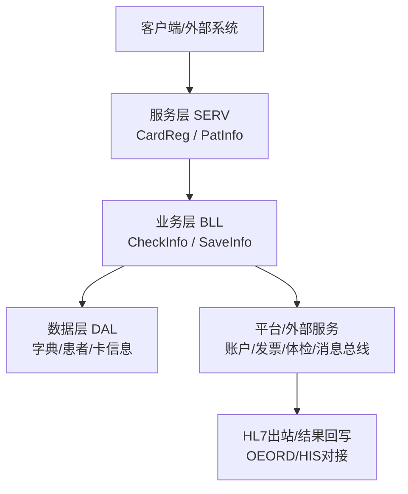
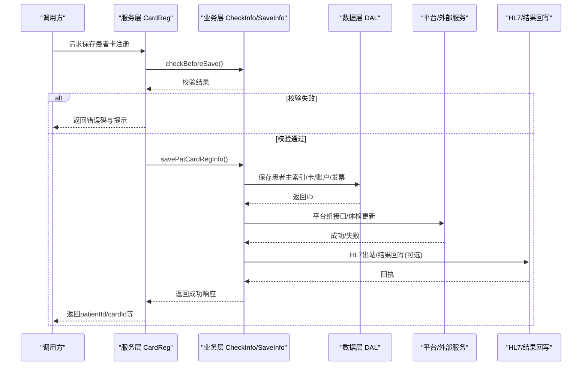
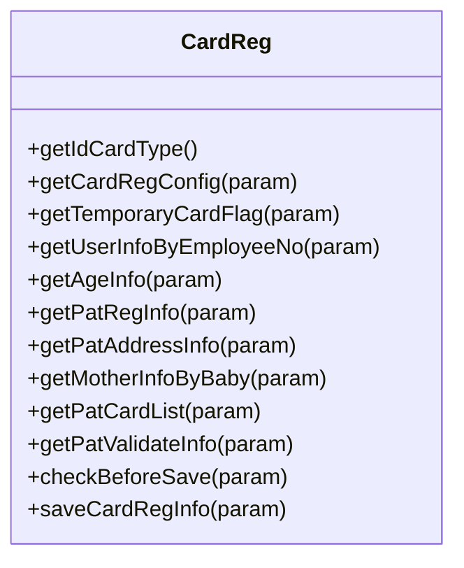
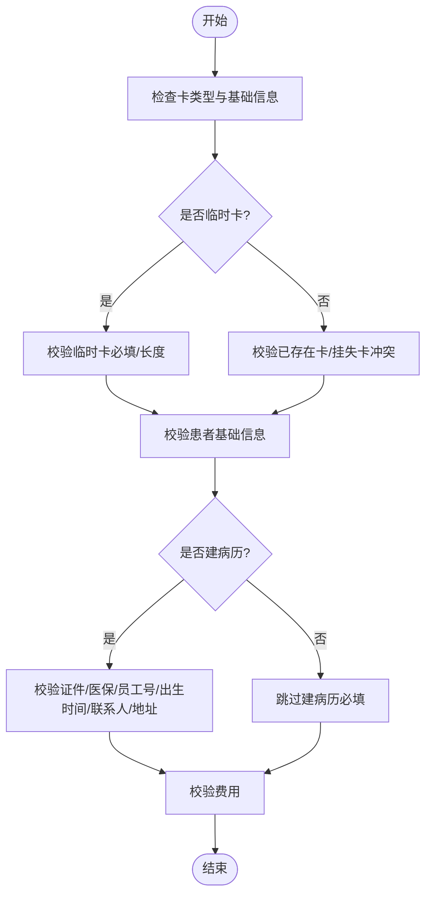
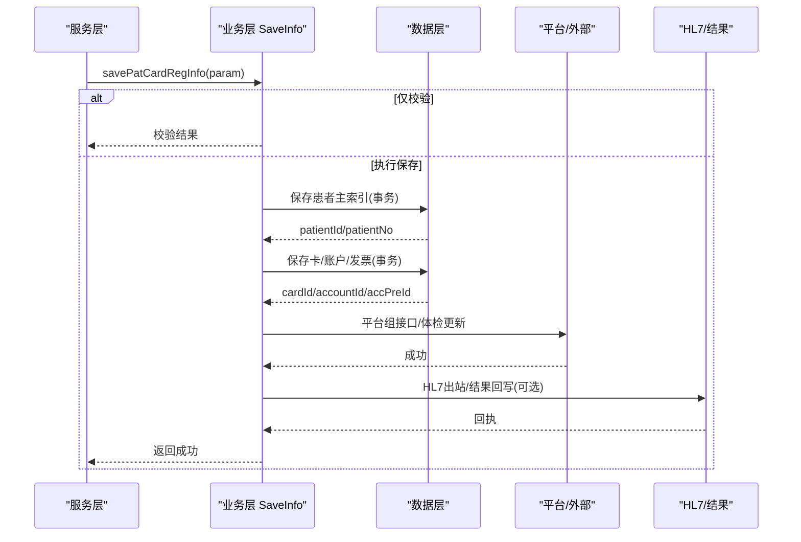
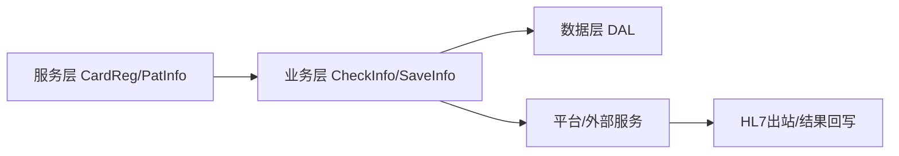

# 医疗EPMI服务集成

<cite>
**本文引用的文件**
- [src/backend/epmi-mc/DHCDoc/EPMI/SERV/CardReg.cls](file://src/backend/epmi-mc/DHCDoc/EPMI/SERV/CardReg.cls)
- [src/backend/epmi-mc/DHCDoc/EPMI/SERV/PatInfo.cls](file://src/backend/epmi-mc/DHCDoc/EPMI/SERV/PatInfo.cls)
- [src/backend/epmi-mc/DHCDoc/EPMI/BLL/CardReg/CheckInfo.cls](file://src/backend/epmi-mc/DHCDoc/EPMI/BLL/CardReg/CheckInfo.cls)
- [src/backend/epmi-mc/DHCDoc/EPMI/BLL/CardReg/SaveInfo.cls](file://src/backend/epmi-mc/DHCDoc/EPMI/BLL/CardReg/SaveInfo.cls)
- [src/backend/epmi-mc/DHCDoc/EPMI/COM/FormatData.cls](file://src/backend/epmi-mc/DHCDoc/EPMI/COM/FormatData.cls)
- [src/backend/doc-ws/User/OEOrdItem.cls](file://src/backend/doc-ws/User/OEOrdItem.cls)
- [src/backend/epmi-mc/User/PAPatMas.cls](file://src/backend/epmi-mc/User/PAPatMas.cls)
- [src/backend/epmi-mc/User/PAPerson.cls](file://src/backend/epmi-mc/User/PAPerson.cls)
</cite>

## 目录
1. [简介](#简介)
2. [项目结构](#项目结构)
3. [核心组件](#核心组件)
4. [架构总览](#架构总览)
5. [详细组件分析](#详细组件分析)
6. [依赖关系分析](#依赖关系分析)
7. [性能与并发](#性能与并发)
8. [故障排查指南](#故障排查指南)
9. [结论](#结论)
10. [附录：接口与数据模型示例](#附录接口与数据模型示例)

## 简介
本文件面向医疗EPMI（电子病历信息交换）服务集成的设计与实现，聚焦于患者主索引同步、病历数据共享、检查检验结果回传等关键能力。文档基于仓库中EPMI模块与服务层代码，梳理了分层架构、数据流转、校验与事务策略、HL7/FHIR相关集成点，并提供可操作的集成示例、错误处理机制以及监控与日志追踪方案建议。

## 项目结构
EPMI模块采用典型分层组织：
- 服务层（SERV）：对外暴露统一接口，负责参数解析、上下文获取与编排调用。
- 业务逻辑层（BLL）：封装复杂校验、流程控制与跨域协作。
- 数据访问层（DAL）：持久化与字典查询。
- 公共组件（COM）：通用工具与格式化能力。

图表来源
- [src/backend/epmi-mc/DHCDoc/EPMI/SERV/CardReg.cls:1-103](file://src/backend/epmi-mc/DHCDoc/EPMI/SERV/CardReg.cls#L1-L103)
- [src/backend/epmi-mc/DHCDoc/EPMI/BLL/CardReg/CheckInfo.cls:1-687](file://src/backend/epmi-mc/DHCDoc/EPMI/BLL/CardReg/CheckInfo.cls#L1-L687)
- [src/backend/epmi-mc/DHCDoc/EPMI/BLL/CardReg/SaveInfo.cls:1-236](file://src/backend/epmi-mc/DHCDoc/EPMI/BLL/CardReg/SaveInfo.cls#L1-L236)

章节来源
- [src/backend/epmi-mc/DHCDoc/EPMI/SERV/CardReg.cls:1-103](file://src/backend/epmi-mc/DHCDoc/EPMI/SERV/CardReg.cls#L1-L103)
- [src/backend/epmi-mc/DHCDoc/EPMI/COM/FormatData.cls:1-48](file://src/backend/epmi-mc/DHCDoc/EPMI/COM/FormatData.cls#L1-L48)

## 核心组件
- 患者卡注册服务（CardReg）：提供身份证类型、配置、临时卡标识、年龄计算、患者注册信息查询与保存等能力。
- 患者信息服务（PatInfo）：提供年龄计算与患者基本信息读取。
- 校验器（CheckInfo）：覆盖卡/患者基础信息、证件、医保号、员工号、出生日期时间、联系人、地址、费用等校验。
- 保存器（SaveInfo）：负责患者主索引、卡、账户、发票的保存与后处理，包含事务边界与外部系统回调。
- 公共格式化（FormatData）：下拉数据与排序等通用能力。

章节来源
- [src/backend/epmi-mc/DHCDoc/EPMI/SERV/CardReg.cls:1-103](file://src/backend/epmi-mc/DHCDoc/EPMI/SERV/CardReg.cls#L1-L103)
- [src/backend/epmi-mc/DHCDoc/EPMI/SERV/PatInfo.cls:1-39](file://src/backend/epmi-mc/DHCDoc/EPMI/SERV/PatInfo.cls#L1-L39)
- [src/backend/epmi-mc/DHCDoc/EPMI/BLL/CardReg/CheckInfo.cls:1-687](file://src/backend/epmi-mc/DHCDoc/EPMI/BLL/CardReg/CheckInfo.cls#L1-L687)
- [src/backend/epmi-mc/DHCDoc/EPMI/BLL/CardReg/SaveInfo.cls:1-236](file://src/backend/epmi-mc/DHCDoc/EPMI/BLL/CardReg/SaveInfo.cls#L1-L236)
- [src/backend/epmi-mc/DHCDoc/EPMI/COM/FormatData.cls:1-48](file://src/backend/epmi-mc/DHCDoc/EPMI/COM/FormatData.cls#L1-L48)

## 架构总览
EPMI服务通过服务层暴露REST或内部方法，由业务层完成强校验与流程编排，数据层完成持久化；在保存成功后触发平台组接口与外部系统回调，并支持HL7出站与结果回写。

图表来源
- [src/backend/epmi-mc/DHCDoc/EPMI/SERV/CardReg.cls:80-100](file://src/backend/epmi-mc/DHCDoc/EPMI/SERV/CardReg.cls#L80-L100)
- [src/backend/epmi-mc/DHCDoc/EPMI/BLL/CardReg/CheckInfo.cls:8-31](file://src/backend/epmi-mc/DHCDoc/EPMI/BLL/CardReg/CheckInfo.cls#L8-L31)
- [src/backend/epmi-mc/DHCDoc/EPMI/BLL/CardReg/SaveInfo.cls:24-132](file://src/backend/epmi-mc/DHCDoc/EPMI/BLL/CardReg/SaveInfo.cls#L24-L132)
- [src/backend/epmi-mc/DHCDoc/EPMI/BLL/CardReg/SaveInfo.cls:134-162](file://src/backend/epmi-mc/DHCDoc/EPMI/BLL/CardReg/SaveInfo.cls#L134-L162)

## 详细组件分析

### 患者卡注册服务（CardReg）
- 职责：聚合查询与保存入口，统一参数格式与返回结构。
- 关键方法：
  - 获取身份证类型、配置、临时卡标识、年龄信息、患者注册信息、地址信息、母亲信息等。
  - 保存前校验：checkBeforeSave。
  - 保存：saveCardRegInfo。

图表来源
- [src/backend/epmi-mc/DHCDoc/EPMI/SERV/CardReg.cls:1-103](file://src/backend/epmi-mc/DHCDoc/EPMI/SERV/CardReg.cls#L1-L103)

章节来源
- [src/backend/epmi-mc/DHCDoc/EPMI/SERV/CardReg.cls:1-103](file://src/backend/epmi-mc/DHCDoc/EPMI/SERV/CardReg.cls#L1-L103)

### 校验器（CheckInfo）
- 职责：对卡/患者/证件/医保/员工号/出生日期时间/联系人/地址/费用等进行全面校验，保证入库数据质量。
- 关键流程：
  - checkBeforeSave：串联卡基础、患者基础、可选建病历字段校验。
  - checkTemporaryCard：临时卡必填项与长度规则。
  - checkPatCardInfo：去重与挂失卡冲突检测。
  - checkCredInfo：证件类型、长度、唯一性、身份证校验、性别一致性。
  - checkEmployeeNo：工号必填与一致性校验。
  - checkBirthDateTime：日期合法性、年龄一致性、新生儿时间限制。
  - checkContactInfo：未成年人联系人必填。
  - checkInsuNo：医保病人/非医保病人互斥校验与唯一性。
  - checkMedicalFlag：建病历时地址与婚姻民族等必填。
  - checkCardPayment：收款金额、预收金额、收据可用性校验。

图表来源
- [src/backend/epmi-mc/DHCDoc/EPMI/BLL/CardReg/CheckInfo.cls:8-31](file://src/backend/epmi-mc/DHCDoc/EPMI/BLL/CardReg/CheckInfo.cls#L8-L31)
- [src/backend/epmi-mc/DHCDoc/EPMI/BLL/CardReg/CheckInfo.cls:93-149](file://src/backend/epmi-mc/DHCDoc/EPMI/BLL/CardReg/CheckInfo.cls#L93-L149)
- [src/backend/epmi-mc/DHCDoc/EPMI/BLL/CardReg/CheckInfo.cls:151-220](file://src/backend/epmi-mc/DHCDoc/EPMI/BLL/CardReg/CheckInfo.cls#L151-L220)
- [src/backend/epmi-mc/DHCDoc/EPMI/BLL/CardReg/CheckInfo.cls:222-251](file://src/backend/epmi-mc/DHCDoc/EPMI/BLL/CardReg/CheckInfo.cls#L222-L251)
- [src/backend/epmi-mc/DHCDoc/EPMI/BLL/CardReg/CheckInfo.cls:253-293](file://src/backend/epmi-mc/DHCDoc/EPMI/BLL/CardReg/CheckInfo.cls#L253-L293)
- [src/backend/epmi-mc/DHCDoc/EPMI/BLL/CardReg/CheckInfo.cls:295-321](file://src/backend/epmi-mc/DHCDoc/EPMI/BLL/CardReg/CheckInfo.cls#L295-L321)
- [src/backend/epmi-mc/DHCDoc/EPMI/BLL/CardReg/CheckInfo.cls:371-453](file://src/backend/epmi-mc/DHCDoc/EPMI/BLL/CardReg/CheckInfo.cls#L371-L453)
- [src/backend/epmi-mc/DHCDoc/EPMI/BLL/CardReg/CheckInfo.cls:455-475](file://src/backend/epmi-mc/DHCDoc/EPMI/BLL/CardReg/CheckInfo.cls#L455-L475)

章节来源
- [src/backend/epmi-mc/DHCDoc/EPMI/BLL/CardReg/CheckInfo.cls:1-687](file://src/backend/epmi-mc/DHCDoc/EPMI/BLL/CardReg/CheckInfo.cls#L1-L687)

### 保存器（SaveInfo）
- 职责：在事务内完成患者主索引、卡、账户、发票的保存，并在成功后触发平台组接口、体检更新、HL7出站等后处理。
- 关键点：
  - 支持“仅校验”模式（checkFlag）。
  - 根据medicalFlag决定是否创建大病历。
  - 使用登记号作为卡号的场景自动回填。
  - 账户与发票按配置选择性保存。
  - 后处理：平台组接口发送患者/卡片信息、更新采购分配、体检信息同步、DTS埋点与安全加密。

图表来源
- [src/backend/epmi-mc/DHCDoc/EPMI/BLL/CardReg/SaveInfo.cls:24-132](file://src/backend/epmi-mc/DHCDoc/EPMI/BLL/CardReg/SaveInfo.cls#L24-L132)
- [src/backend/epmi-mc/DHCDoc/EPMI/BLL/CardReg/SaveInfo.cls:134-162](file://src/backend/epmi-mc/DHCDoc/EPMI/BLL/CardReg/SaveInfo.cls#L134-L162)

章节来源
- [src/backend/epmi-mc/DHCDoc/EPMI/BLL/CardReg/SaveInfo.cls:1-236](file://src/backend/epmi-mc/DHCDoc/EPMI/BLL/CardReg/SaveInfo.cls#L1-L236)

### 患者信息服务（PatInfo）
- 职责：计算年龄、读取患者基本信息。
- 特点：从会话提取医院与患者上下文，调用底层工具计算年龄。

章节来源
- [src/backend/epmi-mc/DHCDoc/EPMI/SERV/PatInfo.cls:1-39](file://src/backend/epmi-mc/DHCDoc/EPMI/SERV/PatInfo.cls#L1-L39)

### 公共格式化（FormatData）
- 职责：提供下拉数据组装与排序能力，便于前端展示。

章节来源
- [src/backend/epmi-mc/DHCDoc/EPMI/COM/FormatData.cls:1-48](file://src/backend/epmi-mc/DHCDoc/EPMI/COM/FormatData.cls#L1-L48)

## 依赖关系分析
- 服务层依赖业务层进行校验与保存。
- 业务层依赖数据层进行持久化与字典查询。
- 保存成功后依赖平台组接口与外部系统进行后续联动。
- 检查结果回写涉及HL7出站与订单结果字段更新。

图表来源
- [src/backend/epmi-mc/DHCDoc/EPMI/SERV/CardReg.cls:1-103](file://src/backend/epmi-mc/DHCDoc/EPMI/SERV/CardReg.cls#L1-L103)
- [src/backend/epmi-mc/DHCDoc/EPMI/BLL/CardReg/SaveInfo.cls:134-162](file://src/backend/epmi-mc/DHCDoc/EPMI/BLL/CardReg/SaveInfo.cls#L134-L162)
- [src/backend/doc-ws/User/OEOrdItem.cls:754-761](file://src/backend/doc-ws/User/OEOrdItem.cls#L754-L761)

章节来源
- [src/backend/epmi-mc/DHCDoc/EPMI/SERV/CardReg.cls:1-103](file://src/backend/epmi-mc/DHCDoc/EPMI/SERV/CardReg.cls#L1-L103)
- [src/backend/epmi-mc/DHCDoc/EPMI/BLL/CardReg/SaveInfo.cls:134-162](file://src/backend/epmi-mc/DHCDoc/EPMI/BLL/CardReg/SaveInfo.cls#L134-L162)
- [src/backend/doc-ws/User/OEOrdItem.cls:754-761](file://src/backend/doc-ws/User/OEOrdItem.cls#L754-L761)

## 性能与并发
- 事务管理：保存患者主索引、卡、账户、发票在同一事务边界内，确保数据一致性；失败时整体回滚。
- 并发控制：
  - 通过证件号、医保号、卡号唯一性校验避免重复建卡。
  - 对住院中患者修改信息进行二次确认，降低并发冲突风险。
- 异步与重试：
  - 后处理（平台组接口、体检更新、HL7出站）建议在独立队列中异步执行，结合幂等键与重试机制提升可靠性。
- 缓存与字典：
  - 字典数据（如卡类型、证件类型）可缓存以减少数据库压力。
- 批处理：
  - 批量导入或同步场景建议使用分批提交与批量日志记录。

[本节为通用指导，不直接分析具体文件]

## 故障排查指南
- 常见错误定位：
  - 校验失败：查看CheckInfo返回的错误码与焦点字段，快速定位输入问题。
  - 保存失败：关注SaveInfo事务内的异常堆栈与返回值，必要时开启调试日志。
  - 外部调用失败：检查平台组接口与体检更新的返回码，必要时启用重试与告警。
- 日志与埋点：
  - 保存前后记录入参与出参JSON，便于复现问题。
  - 使用DTS埋点记录关键操作，关联用户与资源ID。
- HL7结果回写：
  - 检查订单结果状态与时间字段是否正确更新。
  - 核对HL7出站表与接收端回执，定位网络或协议问题。

章节来源
- [src/backend/epmi-mc/DHCDoc/EPMI/BLL/CardReg/CheckInfo.cls:477-488](file://src/backend/epmi-mc/DHCDoc/EPMI/BLL/CardReg/CheckInfo.cls#L477-L488)
- [src/backend/epmi-mc/DHCDoc/EPMI/BLL/CardReg/SaveInfo.cls:155-162](file://src/backend/epmi-mc/DHCDoc/EPMI/BLL/CardReg/SaveInfo.cls#L155-L162)
- [src/backend/doc-ws/User/OEOrdItem.cls:754-761](file://src/backend/doc-ws/User/OEOrdItem.cls#L754-L761)

## 结论
EPMI服务以清晰的分层架构实现了患者主索引与卡注册的核心流程，具备完善的校验与事务保障，并通过平台组接口与HL7出站实现与外部系统的协同。建议在现有基础上引入异步化与重试机制，完善监控指标与日志追踪，进一步提升稳定性与可观测性。

[本节为总结，不直接分析具体文件]

## 附录：接口与数据模型示例

### 接口调用流程示例（患者卡注册保存）
- 请求体关键字段：
  - configParam：patMastFlag（写入患者）、cardRefFlag（写入卡）、accManageFlag（写入账户）。
  - patInfo：卡类型、卡号、姓名、性别、证件、出生日期、年龄、登记号、医保号、联系方式等。
  - address：家庭/现住/户口/出生/联系地址。
  - payParam：支付方式、金额、收据号等。
  - extendParam：hospId、userId、medicalFlag、transferCardFlag、modifiedFlag、checkFlag等。
- 调用步骤：
  - 调用服务层保存接口。
  - 业务层执行校验与保存。
  - 成功后触发平台组接口与体检更新。
  - 可选HL7出站与结果回写。

章节来源
- [src/backend/epmi-mc/DHCDoc/EPMI/SERV/CardReg.cls:80-100](file://src/backend/epmi-mc/DHCDoc/EPMI/SERV/CardReg.cls#L80-L100)
- [src/backend/epmi-mc/DHCDoc/EPMI/BLL/CardReg/SaveInfo.cls:24-132](file://src/backend/epmi-mc/DHCDoc/EPMI/BLL/CardReg/SaveInfo.cls#L24-L132)

### 数据模型定义（患者主索引与卡）
- 患者主索引（PAPatMas）：
  - 关键字段：患者ID、登记号、姓名、性别、出生日期、证件类型与号码、医保号、联系方式、地址等。
  - 变更触发HL7出站（插入/更新/删除）。
- 卡信息（Card）：
  - 关键字段：卡类型、卡号、发票信息、账户关联、费用类型等。
- 账户与发票：
  - 账户：关联患者与卡，记录密码、开户时间、医院ID等。
  - 发票：记录支付模式、收据号、开票状态等。

章节来源
- [src/backend/epmi-mc/User/PAPatMas.cls:300-331](file://src/backend/epmi-mc/User/PAPatMas.cls#L300-L331)
- [src/backend/epmi-mc/User/PAPerson.cls:608-639](file://src/backend/epmi-mc/User/PAPerson.cls#L608-L639)
- [src/backend/epmi-mc/DHCDoc/EPMI/BLL/CardReg/SaveInfo.cls:164-233](file://src/backend/epmi-mc/DHCDoc/EPMI/BLL/CardReg/SaveInfo.cls#L164-L233)

### HL7消息处理与FHIR资源映射
- HL7出站：
  - 患者主索引变更触发HL7出站（插入/更新/删除），用于主索引同步。
  - 订单结果回写通过订单结果状态与时间字段更新，支撑检查检验结果回传。
- FHIR映射建议：
  - Patient：映射患者主索引字段（姓名、性别、出生日期、证件、医保号、联系方式、地址）。
  - Encounter/ServiceRequest：映射就诊与检查申请。
  - Observation/Result：映射检查检验结果。
  - 注意：当前仓库未提供具体FHIR映射实现，需按标准扩展。

章节来源
- [src/backend/epmi-mc/User/PAPatMas.cls:300-331](file://src/backend/epmi-mc/User/PAPatMas.cls#L300-L331)
- [src/backend/doc-ws/User/OEOrdItem.cls:754-761](file://src/backend/doc-ws/User/OEOrdItem.cls#L754-L761)

### 错误处理机制
- 统一错误对象：包含code、msg、focus、stack等，便于前端定位与提示。
- 异常抛出：在关键校验失败时抛出异常，携带错误码与消息。
- 外部调用失败：记录日志并返回明确错误码，支持重试与降级。

章节来源
- [src/backend/epmi-mc/DHCDoc/EPMI/BLL/CardReg/CheckInfo.cls:477-488](file://src/backend/epmi-mc/DHCDoc/EPMI/BLL/CardReg/CheckInfo.cls#L477-L488)
- [src/backend/epmi-mc/DHCDoc/EPMI/BLL/CardReg/SaveInfo.cls:201-204](file://src/backend/epmi-mc/DHCDoc/EPMI/BLL/CardReg/SaveInfo.cls#L201-L204)

### 监控指标与日志追踪方案
- 指标建议：
  - 接口成功率、平均耗时、超时率。
  - 校验失败分布（按字段与错误码）。
  - 外部调用成功率与重试次数。
  - HL7出站成功率与回执匹配率。
- 日志建议：
  - 入参出参JSON记录（脱敏）。
  - 事务边界日志（开始/提交/回滚）。
  - 外部调用日志（请求/响应/异常）。
  - DTS埋点（操作人、资源ID、时间戳）。

[本节为通用指导，不直接分析具体文件]