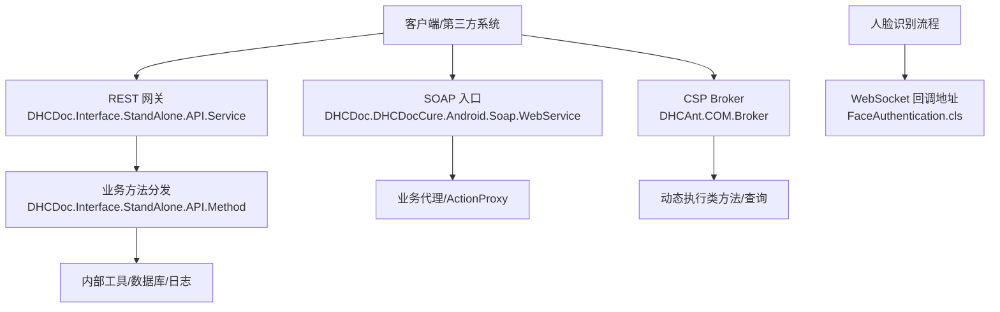
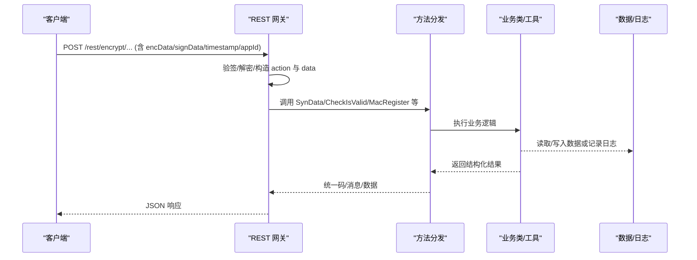
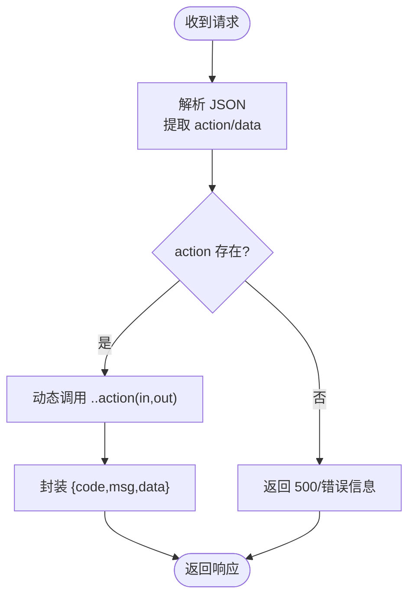
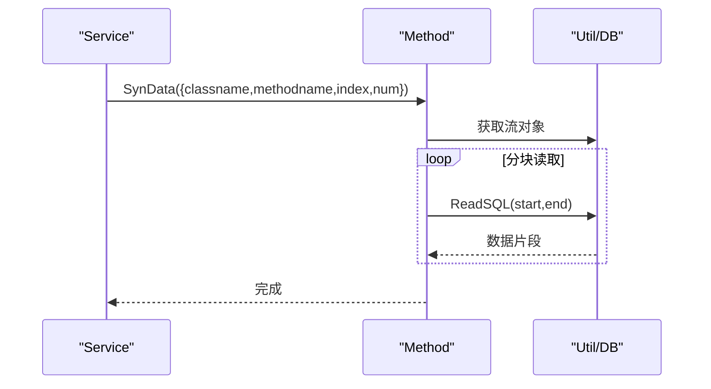
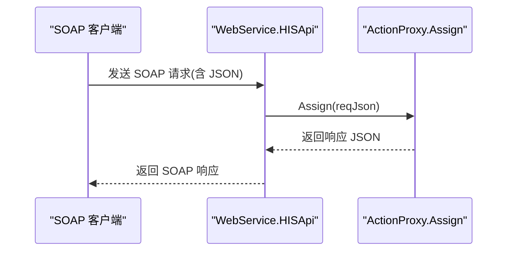
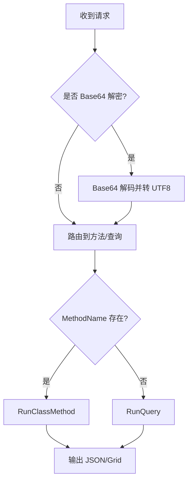
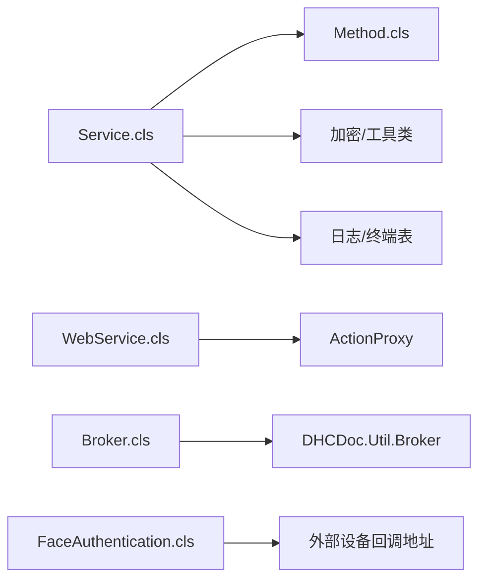

# 互联网服务集成

<cite>
**本文引用的文件**
- [Service.cls](file://src/backend/conting-ws/DHCDoc/Interface/StandAlone/API/Service.cls)
- [Method.cls](file://src/backend/conting-ws/DHCDoc/Interface/StandAlone/API/Method.cls)
- [WebService.cls](file://src/backend/cure-ws/DHCDoc/DHCDocCure/Android/Soap/WebService.cls)
- [Broker.cls](file://src/backend/doc-ws/DHCAnt/COM/Broker.cls)
- [FaceAuthentication.cls](file://src/backend/public-mc/DHCDoc/GetInfo/Service/FaceAuthentication.cls)
</cite>

## 目录
1. [简介](#简介)
2. [项目结构](#项目结构)
3. [核心组件](#核心组件)
4. [架构总览](#架构总览)
5. [详细组件分析](#详细组件分析)
6. [依赖关系分析](#依赖关系分析)
7. [性能与可靠性](#性能与可靠性)
8. [故障诊断与监控](#故障诊断与监控)
9. [结论](#结论)
10. [附录：集成示例与最佳实践](#附录：集成示例与最佳实践)

## 简介
本文件面向“互联网服务集成”主题，聚焦于本项目中与外部互联网服务的对接实现。内容覆盖：
- HTTP/HTTPS 接口调用与 RESTful API 封装
- SOAP Web Service 暴露与统一入口
- WebSocket 实时通信的回调与集成点
- 网络请求重试、超时控制与连接池管理建议
- 数据序列化（JSON/流式）与错误处理
- 网络安全措施（SSL、签名、加密）
- 性能监控与故障诊断方法

说明：以下分析与图示均基于仓库中实际存在的后端类与方法；未在当前代码中发现显式的重试、超时或连接池配置，相关章节给出可落地的工程化建议。

## 项目结构
本项目为多工作区（WS）医疗信息系统，后端以 InterSystems IRIS/CSP 为主，提供多种对外集成能力：
- 应急系统独立 API 网关（REST 风格）
- 统一 SOAP Web Service 入口
- CSP Broker 动态路由到业务类方法
- 人脸识别等场景中的 WebSocket 回调地址配置

图表来源
- [Service.cls:1-158](file://src/backend/conting-ws/DHCDoc/Interface/StandAlone/API/Service.cls#L1-L158)
- [Method.cls:1-95](file://src/backend/conting-ws/DHCDoc/Interface/StandAlone/API/Method.cls#L1-L95)
- [WebService.cls:1-29](file://src/backend/cure-ws/DHCDoc/DHCDocCure/Android/Soap/WebService.cls#L1-L29)
- [Broker.cls:1-136](file://src/backend/doc-ws/DHCAnt/COM/Broker.cls#L1-L136)
- [FaceAuthentication.cls:118-127](file://src/backend/public-mc/DHCDoc/GetInfo/Service/FaceAuthentication.cls#L118-L127)

章节来源
- [Service.cls:1-158](file://src/backend/conting-ws/DHCDoc/Interface/StandAlone/API/Service.cls#L1-L158)
- [WebService.cls:1-29](file://src/backend/cure-ws/DHCDoc/DHCDocCure/Android/Soap/WebService.cls#L1-L29)
- [Broker.cls:1-136](file://src/backend/doc-ws/DHCAnt/COM/Broker.cls#L1-L136)
- [FaceAuthentication.cls:118-127](file://src/backend/public-mc/DHCDoc/GetInfo/Service/FaceAuthentication.cls#L118-L127)

## 核心组件
- 应急系统 REST 网关：负责接收 JSON 请求，解析 action/data，动态调用目标类方法并返回统一格式结果；支持生成带签名与加密的请求体/URL。
- 业务方法分发器：将下载、日志、终端校验、注册等具体逻辑委派给底层类。
- SOAP 统一入口：通过 WSDL 暴露统一方法，内部按包名反射到业务代理进行响应组装。
- CSP Broker：通用页面处理器，支持 Base64 解密入参、动态执行类方法或查询，并以 JSON/Grid 等格式输出。
- WebSocket 回调：在人脸识别等场景中，通过配置多个候选回调地址，供外部设备回推结果。

章节来源
- [Service.cls:1-158](file://src/backend/conting-ws/DHCDoc/Interface/StandAlone/API/Service.cls#L1-L158)
- [Method.cls:1-95](file://src/backend/conting-ws/DHCDoc/Interface/StandAlone/API/Method.cls#L1-L95)
- [WebService.cls:1-29](file://src/backend/cure-ws/DHCDoc/DHCDocCure/Android/Soap/WebService.cls#L1-L29)
- [Broker.cls:1-136](file://src/backend/doc-ws/DHCAnt/COM/Broker.cls#L1-L136)
- [FaceAuthentication.cls:118-127](file://src/backend/public-mc/DHCDoc/GetInfo/Service/FaceAuthentication.cls#L118-L127)

## 架构总览
整体采用“多入口、统一编排”的架构：
- REST 入口：标准化输入输出，内置加签与对称加密参数，便于与 HIS/第三方系统对接。
- SOAP 入口：兼容传统系统集成，使用 WSDL 描述能力，内部通过包名+类名反射到业务层。
- CSP Broker：灵活路由，支持分页、排序、Grid 输出，适合前端表格/列表场景。
- WebSocket：作为事件回推通道，服务端提供回调地址集合，由外部设备主动回连。

图表来源
- [Service.cls:1-158](file://src/backend/conting-ws/DHCDoc/Interface/StandAlone/API/Service.cls#L1-L158)
- [Method.cls:1-95](file://src/backend/conting-ws/DHCDoc/Interface/StandAlone/API/Method.cls#L1-L95)

## 详细组件分析

### 应急系统 REST 网关（Service.cls）
职责
- 接收 JSON 请求，解析 action 与 data，动态调用对应方法。
- 统一返回结构：包含 code/msg/data。
- 提供 URL 生成与加密签名工具，用于向 HIS 发起受保护的请求。
- 提供测试 SQL 能力（仅用于调试）。

关键流程
- 请求进入 Excute：解析 JSON -> 提取 action/data -> 动态执行 -> 统一封装返回。
- GenUrl：生成带 SM3 签名与 SM4 加密的请求体或 GET 链接，便于与 HIS 对接。
- SaveExpLog/CheckIsValid/MacRegister：分别负责日志落库、终端有效性校验、终端注册。

图表来源
- [Service.cls:8-36](file://src/backend/conting-ws/DHCDoc/Interface/StandAlone/API/Service.cls#L8-L36)
- [Service.cls:46-53](file://src/backend/conting-ws/DHCDoc/Interface/StandAlone/API/Service.cls#L46-L53)
- [Service.cls:116-133](file://src/backend/conting-ws/DHCDoc/Interface/StandAlone/API/Service.cls#L116-L133)

章节来源
- [Service.cls:8-36](file://src/backend/conting-ws/DHCDoc/Interface/StandAlone/API/Service.cls#L8-L36)
- [Service.cls:46-53](file://src/backend/conting-ws/DHCDoc/Interface/StandAlone/API/Service.cls#L46-L53)
- [Service.cls:64-82](file://src/backend/conting-ws/DHCDoc/Interface/StandAlone/API/Service.cls#L64-L82)
- [Service.cls:92-112](file://src/backend/conting-ws/DHCDoc/Interface/StandAlone/API/Service.cls#L92-L112)
- [Service.cls:116-133](file://src/backend/conting-ws/DHCDoc/Interface/StandAlone/API/Service.cls#L116-L133)
- [Service.cls:141-155](file://src/backend/conting-ws/DHCDoc/Interface/StandAlone/API/Service.cls#L141-L155)

### 方法分发器（Method.cls）
职责
- 将 REST 网关的通用动作落地为具体业务：如批量导出、日志写入、终端校验与注册。
- 对导出采用流式分段读取，避免一次性加载大数据导致内存压力。

关键点
- SynData：根据 classname/methodname/index/num 分块读取流并输出。
- SaveExpLog：将异常/执行日志持久化。
- CheckIsValid/MacRegister：对接终端管理与注册。

图表来源
- [Method.cls:16-37](file://src/backend/conting-ws/DHCDoc/Interface/StandAlone/API/Method.cls#L16-L37)

章节来源
- [Method.cls:16-37](file://src/backend/conting-ws/DHCDoc/Interface/StandAlone/API/Method.cls#L16-L37)
- [Method.cls:47-57](file://src/backend/conting-ws/DHCDoc/Interface/StandAlone/API/Method.cls#L47-L57)
- [Method.cls:67-92](file://src/backend/conting-ws/DHCDoc/Interface/StandAlone/API/Method.cls#L67-L92)

### SOAP 统一入口（WebService.cls）
职责
- 暴露统一的 SOAP 方法 HISApi，接收 JSON 字符串。
- 根据当前类名推断业务包名，委托给 ActionProxy.Assign 进行统一调度。

要点
- 通过 %SOAP.WebService 基类声明服务名与命名空间。
- 统一入口屏蔽了不同业务包的差异，便于第三方系统以标准 SOAP 方式接入。

图表来源
- [WebService.cls:15-26](file://src/backend/cure-ws/DHCDoc/DHCDocCure/Android/Soap/WebService.cls#L15-L26)

章节来源
- [WebService.cls:1-29](file://src/backend/cure-ws/DHCDoc/DHCDocCure/Android/Soap/WebService.cls#L1-L29)

### CSP Broker（Broker.cls）
职责
- 作为通用 CSP 页面处理器，支持可选的 Base64 解密入参。
- 动态执行类方法或运行查询，并将结果以 JSON/Grid 等格式输出。
- 内置分页、排序、切片逻辑，适配前端表格展示。

关键点
- OnPage：解析请求参数，选择 RunClassMethod 或 RunQuery。
- Json2DataGrid：将数组结果转换为 Grid 所需结构（curPage/total/rows），支持 allRows 模式。
- SortArray/Slice：实现排序与分页切片。

图表来源
- [Broker.cls:12-38](file://src/backend/doc-ws/DHCAnt/COM/Broker.cls#L12-L38)
- [Broker.cls:40-66](file://src/backend/doc-ws/DHCAnt/COM/Broker.cls#L40-L66)
- [Broker.cls:68-92](file://src/backend/doc-ws/DHCAnt/COM/Broker.cls#L68-L92)

章节来源
- [Broker.cls:12-38](file://src/backend/doc-ws/DHCAnt/COM/Broker.cls#L12-L38)
- [Broker.cls:40-66](file://src/backend/doc-ws/DHCAnt/COM/Broker.cls#L40-L66)
- [Broker.cls:68-92](file://src/backend/doc-ws/DHCAnt/COM/Broker.cls#L68-L92)
- [Broker.cls:94-133](file://src/backend/doc-ws/DHCAnt/COM/Broker.cls#L94-L133)

### WebSocket 回调（FaceAuthentication.cls）
职责
- 在人脸识别流程中，提供多个候选回调地址，供外部设备将识别结果推送至系统。
- 地址支持 http/https，便于在不同部署环境切换。

注意
- 该文件主要体现回调地址的配置与拼接，实际 WebSocket 服务端需另行实现并在设备端建立连接。

章节来源
- [FaceAuthentication.cls:118-127](file://src/backend/public-mc/DHCDoc/GetInfo/Service/FaceAuthentication.cls#L118-L127)

## 依赖关系分析
- Service.cls 依赖 Method.cls 实现具体动作；两者共同构成 REST 网关层。
- WebService.cls 依赖 ActionProxy（未在本文列出）进行业务路由。
- Broker.cls 依赖 DHCDoc.Util.Broker 执行查询与输出格式化。
- FaceAuthentication.cls 仅引用回调地址常量，不直接依赖其他模块。

图表来源
- [Service.cls:1-158](file://src/backend/conting-ws/DHCDoc/Interface/StandAlone/API/Service.cls#L1-L158)
- [Method.cls:1-95](file://src/backend/conting-ws/DHCDoc/Interface/StandAlone/API/Method.cls#L1-L95)
- [WebService.cls:1-29](file://src/backend/cure-ws/DHCDoc/DHCDocCure/Android/Soap/WebService.cls#L1-L29)
- [Broker.cls:1-136](file://src/backend/doc-ws/DHCAnt/COM/Broker.cls#L1-L136)
- [FaceAuthentication.cls:118-127](file://src/backend/public-mc/DHCDoc/GetInfo/Service/FaceAuthentication.cls#L118-L127)

章节来源
- [Service.cls:1-158](file://src/backend/conting-ws/DHCDoc/Interface/StandAlone/API/Service.cls#L1-L158)
- [Method.cls:1-95](file://src/backend/conting-ws/DHCDoc/Interface/StandAlone/API/Method.cls#L1-L95)
- [WebService.cls:1-29](file://src/backend/cure-ws/DHCDoc/DHCDocCure/Android/Soap/WebService.cls#L1-L29)
- [Broker.cls:1-136](file://src/backend/doc-ws/DHCAnt/COM/Broker.cls#L1-L136)
- [FaceAuthentication.cls:118-127](file://src/backend/public-mc/DHCDoc/GetInfo/Service/FaceAuthentication.cls#L118-L127)

## 性能与可靠性
- 流式导出：Method.SynData 采用分块读取流的方式，降低大结果集内存占用，提升吞吐稳定性。
- 统一返回结构：Service.GetRtnStr 保证前后端契约一致，减少解析失败风险。
- 安全传输：Service.GenUrl 使用 SM3 签名与 SM4 对称加密，保障请求完整性与机密性。
- 重试机制：当前代码未发现显式重试逻辑。建议在网关层引入指数退避重试（针对 5xx/网络超时），并对幂等操作启用限流与去重。
- 超时控制：建议在网关层设置合理的连接超时与读写超时，避免长尾请求拖垮资源。
- 连接池：对于下游数据库或外部 HTTP 调用，建议使用连接池与最大并发限制，防止资源耗尽。
- 背压与限流：对高并发接口增加令牌桶/漏桶限流，保护后端稳定。
- 缓存策略：对读多写少的字典/配置数据，结合本地缓存与分布式缓存，降低重复查询开销。

[本节为通用优化建议，不直接分析具体文件]

## 故障诊断与监控
- 日志记录：SaveExpLog 可将异常状态、消息与关联行号持久化，便于问题回溯。
- 错误码规范：统一返回 code/msg/data，便于前端与运维快速定位。
- 调试入口：Service.TestSQL 可用于连通性与权限验证（仅限测试环境）。
- 监控指标：建议采集 QPS、P95/P99 延迟、错误率、下游超时/拒绝次数等指标。
- 链路追踪：在网关层注入 traceId，贯穿下游调用，便于端到端排查。
- 告警策略：对错误率突增、超时比例升高、下游不可用等情况设置阈值告警。

章节来源
- [Service.cls:148-155](file://src/backend/conting-ws/DHCDoc/Interface/StandAlone/API/Service.cls#L148-L155)
- [Method.cls:47-57](file://src/backend/conting-ws/DHCDoc/Interface/StandAlone/API/Method.cls#L47-L57)

## 结论
本项目已具备较为完善的互联网服务集成基础：
- REST 网关提供统一入口与安全封装
- SOAP 入口兼容传统系统集成
- CSP Broker 提供灵活的方法路由与数据输出
- WebSocket 回调为事件驱动场景预留通道
在此基础上，建议补充重试、超时、连接池、监控与告警等工程化能力，以提升系统的稳定性与可观测性。

[本节为总结性内容，不直接分析具体文件]

## 附录：集成示例与最佳实践

### REST 调用封装（示例路径）
- 生成加密请求体/URL：参考 [Service.cls:116-133](file://src/backend/conting-ws/DHCDoc/Interface/StandAlone/API/Service.cls#L116-L133)
- 统一返回结构：参考 [Service.cls:46-53](file://src/backend/conting-ws/DHCDoc/Interface/StandAlone/API/Service.cls#L46-L53)
- 动态方法调用：参考 [Service.cls:8-36](file://src/backend/conting-ws/DHCDoc/Interface/StandAlone/API/Service.cls#L8-L36)

### SOAP 调用（示例路径）
- 统一入口方法：参考 [WebService.cls:15-26](file://src/backend/cure-ws/DHCDoc/DHCDocCure/Android/Soap/WebService.cls#L15-L26)

### CSP Broker 调用（示例路径）
- 动态执行类方法：参考 [Broker.cls:40-66](file://src/backend/doc-ws/DHCAnt/COM/Broker.cls#L40-L66)
- 分页与排序输出：参考 [Broker.cls:68-92](file://src/backend/doc-ws/DHCAnt/COM/Broker.cls#L68-L92)

### WebSocket 回调（示例路径）
- 回调地址配置：参考 [FaceAuthentication.cls:118-127](file://src/backend/public-mc/DHCDoc/GetInfo/Service/FaceAuthentication.cls#L118-L127)

### 数据序列化与错误处理
- JSON 序列化/反序列化：参考 [Service.cls:14-22](file://src/backend/conting-ws/DHCDoc/Interface/StandAlone/API/Service.cls#L14-L22)
- 统一错误码封装：参考 [Service.cls:46-53](file://src/backend/conting-ws/DHCDoc/Interface/StandAlone/API/Service.cls#L46-L53)

### 网络安全措施
- 请求签名与加密：参考 [Service.cls:116-133](file://src/backend/conting-ws/DHCDoc/Interface/StandAlone/API/Service.cls#L116-L133)
- Base64 解密入参（可选）：参考 [Broker.cls:14-24](file://src/backend/doc-ws/DHCAnt/COM/Broker.cls#L14-L24)

### 性能与可靠性建议（实施清单）
- 重试：对幂等接口实现指数退避重试，非幂等接口禁止自动重试。
- 超时：设置连接/读/写超时，避免资源长期占用。
- 连接池：对数据库与 HTTP 客户端启用连接池与最大并发限制。
- 限流：对热点接口增加限流，防止雪崩。
- 监控：采集关键指标，建立告警规则。
- 审计：保留关键操作日志，满足合规要求。

[本节为实践指南，不直接分析具体文件]