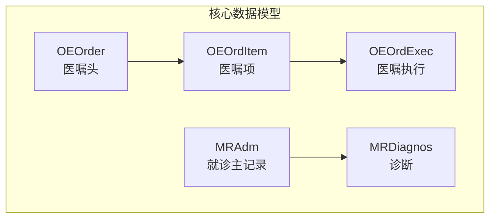
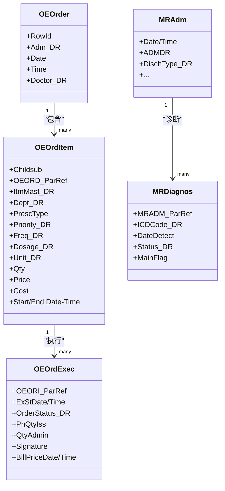
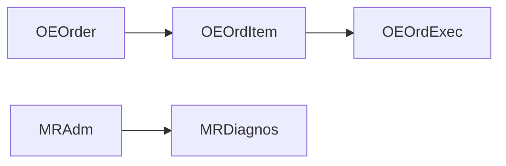
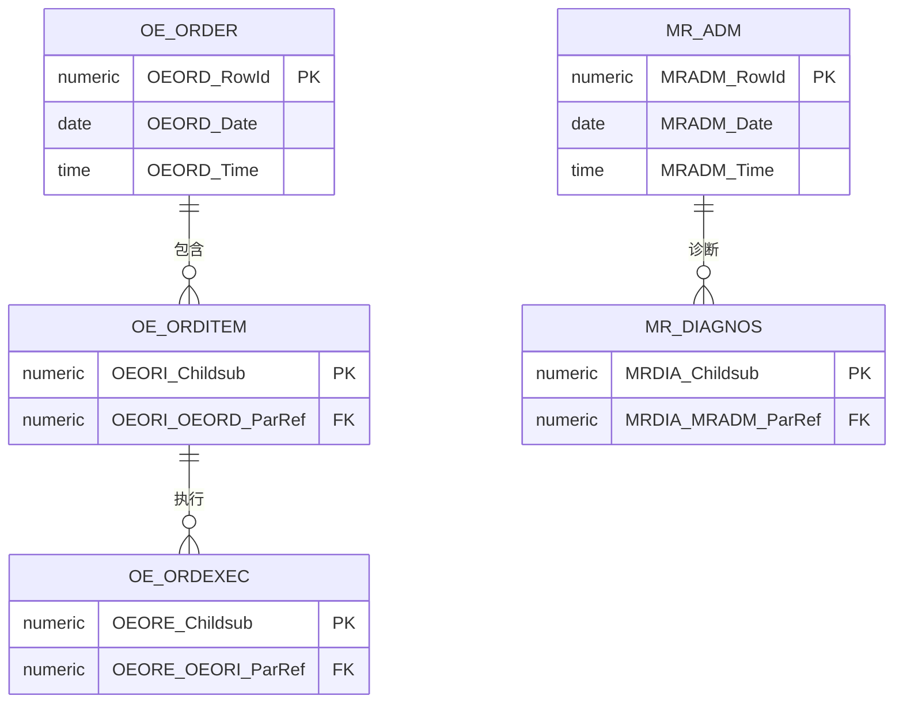
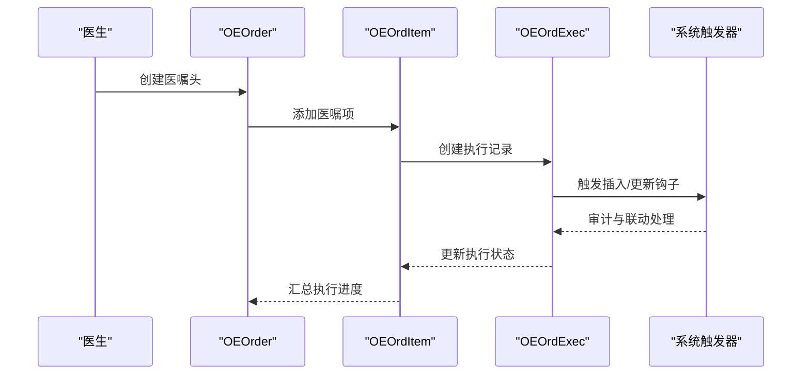

# 数据模型定义

<cite>
**本文引用的文件**
- [OEOrder.cls](file://src/backend/doc-ws/User/OEOrder.cls)
- [OEOrdItem.cls](file://src/backend/doc-ws/User/OEOrdItem.cls)
- [OEOrdExec.cls](file://src/backend/doc-ws/User/OEOrdExec.cls)
- [MRDiagnos.cls](file://src/backend/doc-ws/User/MRDiagnos.cls)
- [MRAdm.cls](file://src/backend/doc-ws/User/MRAdm.cls)
</cite>

## 目录
1. [简介](#简介)
2. [项目结构](#项目结构)
3. [核心组件](#核心组件)
4. [架构总览](#架构总览)
5. [详细组件分析](#详细组件分析)
6. [依赖关系分析](#依赖关系分析)
7. [性能考虑](#性能考虑)
8. [故障排查指南](#故障排查指南)
9. [结论](#结论)
10. [附录](#附录)

## 简介
本文件面向系统间数据交换的核心数据模型，聚焦患者信息、医嘱（含执行）、诊断等医疗实体，给出字段定义、数据类型、约束与业务规则说明，并提供ER图与序列图以辅助理解。同时覆盖数据版本管理、向后兼容与迁移策略建议，以及数据验证规则、必填字段与默认值设置，并指出扩展点与自定义字段支持方式。

## 项目结构
- 数据模型以类形式定义在 doc-ws/User 目录下，采用持久化存储映射到数据库表，并通过关系属性建立实体间的父子关联。
- 关键实体：
  - 医嘱头：User.OEOrder
  - 医嘱项：User.OEOrdItem
  - 医嘱执行：User.OEOrdExec
  - 诊断：User.MRDiagnos
  - 住院/就诊主记录：User.MRAdm

图表来源
- [OEOrder.cls:1-201](file://src/backend/doc-ws/User/OEOrder.cls#L1-L201)
- [OEOrdItem.cls:1-800](file://src/backend/doc-ws/User/OEOrdItem.cls#L1-L800)
- [OEOrdExec.cls:1-800](file://src/backend/doc-ws/User/OEOrdExec.cls#L1-L800)
- [MRDiagnos.cls:1-795](file://src/backend/doc-ws/User/MRDiagnos.cls#L1-L795)
- [MRAdm.cls:1-800](file://src/backend/doc-ws/User/MRAdm.cls#L1-L800)

章节来源
- [OEOrder.cls:1-201](file://src/backend/doc-ws/User/OEOrder.cls#L1-L201)
- [OEOrdItem.cls:1-800](file://src/backend/doc-ws/User/OEOrdItem.cls#L1-L800)
- [OEOrdExec.cls:1-800](file://src/backend/doc-ws/User/OEOrdExec.cls#L1-L800)
- [MRDiagnos.cls:1-795](file://src/backend/doc-ws/User/MRDiagnos.cls#L1-L795)
- [MRAdm.cls:1-800](file://src/backend/doc-ws/User/MRAdm.cls#L1-L800)

## 核心组件
- 医嘱头（OEOrder）
  - 标识：自增行ID（RowId），唯一主键索引
  - 关键字段：就诊引用、医嘱日期时间、开嘱医生、账单相关引用等
  - 触发器：插入/更新/删除前后钩子，用于审计与联动处理
  - 存储：SQL存储映射，包含多索引（按就诊、日期、账单等）
- 医嘱项（OEOrdItem）
  - 标识：子序号（Childsub）作为主键
  - 父关系：指向医嘱头（OEORIOEORDParRef）
  - 子关系：执行、结果、标本、牙齿、费用、状态、Snomed编码、采集结果、问题、医生、饮食修饰、检验类型、财务期间、转诊医生、警示消息、动作、诊断、剂量数量等
  - 关键字段：项目主档、科室、处方类型、状态、优先级、频次、剂量、单位、数量、价格、成本、开始/结束时间、执行/读取人、检验/放射相关字段、医保标志、过敏原因、标签文本等
  - 计算字段：如“计划总量”、“完成日期”、“时间戳”等由表达式或函数计算
- 医嘱执行（OEOrdExec）
  - 父关系：指向医嘱项（OEOREOEORIParRef）
  - 子关系：发药、执行状态
  - 关键字段：执行起止时间、执行人、执行状态、已发量、用量、签名、主要干预、时长、库存批次、观察人、PRN原因、替代接收科室、给药途径、体积、前次执行结束时间、药物结局、皮肤试验结果、备注、计费日期/时间、医保标志、强制自费标记等
  - 触发器：插入/更新/删除前后钩子
  - 存储：大量条件索引优化查询（未执行、停止执行、按科室、按执行时间等）
- 诊断（MRDiagnos）
  - 父关系：指向就诊主记录（MRDIAMRADMParRef）
  - 子关系：诊断类型、主诊断链接
  - 关键字段：ICD编码、检测日期、状态、工作相关、医生、补充ICD、描述、日期时间、状态、体征症状、DRG顺序、更新用户、分组、分期、肿瘤/淋巴结/转移/浸润/分级/残留肿瘤、主诊断标志、身体部位、前缀/后缀、长期诊断标志、更新科室、级别、顺序号、下诊断方式、医保主诊断标志、中医治法、截止原因、修正关联诊断等
  - 触发器：插入/更新/删除前后钩子
  - 存储：多种索引（咨询、纠正、日期、更新时间等）
- 就诊主记录（MRAdm）
  - 子关系：过敏、亚发现、客观发现、临床数据、诊断、出入量、系统回顾、体格检查、护理记录、急诊情况、ICU指标、病程演变、风险评估、额外观察、临床路径、楼层平面图、随访原因、观察记录、用药等
  - 关键字段：生命体征、主观/客观发现、体温/脉搏/呼吸、就诊日期时间、就诊引用、出院条件、出院类型、感染类型、医生/护士、血糖/尿糖、血型、头围/身高/体重、肾移植、剖宫产、死胎数、伤口类型、入院途径、死亡原因、证明打印日期、序列号、日期范围、患者状况、访客状态、DRG、DRG处理日期/次数/费率、尸检类型、转诊科室、转运方式、出院目的地/交通、反结账原因、出院分类、医保后缀、账户类别、分离转诊、照护者可用性、照护类型、精神健康法律状态、项目资金来源、资金安排、合同类型/角色/标识、再入院意图、重症监护转院原因、发病日期、康复/姑息转诊来源、删除/重发/PRS2发送标志、机械通气时长、转诊科室转院日期、天数、身高/体重日期、DRG权重、出院日期、现患主诉、院前治疗、GP同意、救护车案例、血氧饱和度、转院目的地/原因、护送来源、转至科室、其他转院原因、损伤描述、PACS出院日期、预约日期、备注、就诊类型、二次转院目的、医疗适宜性、环形病房、患者需求、特殊指示、接听电话、患者询问更新日期/时间、意识状态、进展、活动、夜间、饮食注释、临终关怀状态、床旁移动、如厕、转移、进食、RUG总分、ICU/CCU/CPAP小时、床位不可用原因、编码更新日期/时间/用户、PRS2状态、离群等价、基础WIES/ATIS WIES/WIES总分/价格、高离群天数、编码更新医院、患者询问更新医院、工作诊断、其他状况、静脉治疗、通气、隔离、引流管、患者状况日期/时间、进展日期/时间、访视时段、休息时段、非计划再入院、PCCL、PM更新日期/时间/用户/医院、老年照护评估服务、分组器错误等

章节来源
- [OEOrder.cls:1-201](file://src/backend/doc-ws/User/OEOrder.cls#L1-L201)
- [OEOrdItem.cls:1-800](file://src/backend/doc-ws/User/OEOrdItem.cls#L1-L800)
- [OEOrdExec.cls:1-800](file://src/backend/doc-ws/User/OEOrdExec.cls#L1-L800)
- [MRDiagnos.cls:1-795](file://src/backend/doc-ws/User/MRDiagnos.cls#L1-L795)
- [MRAdm.cls:1-800](file://src/backend/doc-ws/User/MRAdm.cls#L1-L800)

## 架构总览
下图展示核心实体之间的关系与数据流向，体现医嘱从创建到执行的完整链路，以及诊断与就诊的关联。

图表来源
- [OEOrder.cls:1-201](file://src/backend/doc-ws/User/OEOrder.cls#L1-L201)
- [OEOrdItem.cls:1-800](file://src/backend/doc-ws/User/OEOrdItem.cls#L1-L800)
- [OEOrdExec.cls:1-800](file://src/backend/doc-ws/User/OEOrdExec.cls#L1-L800)
- [MRDiagnos.cls:1-795](file://src/backend/doc-ws/User/MRDiagnos.cls#L1-L795)
- [MRAdm.cls:1-800](file://src/backend/doc-ws/User/MRAdm.cls#L1-L800)

## 详细组件分析

### 医嘱头（OEOrder）
- 职责：承载一次医嘱的主记录，关联就诊、开嘱医生、时间等基本信息，提供删除/插入/更新触发器以维护审计与联动。
- 关键约束：
  - RowId为自增主键，唯一索引
  - 日期/时间为必填，默认当前系统时间
- 索引：按就诊、日期、账单等维度建立索引以提升查询性能
- 存储：SQL存储映射，使用分隔符结构与全局变量组织数据

章节来源
- [OEOrder.cls:1-201](file://src/backend/doc-ws/User/OEOrder.cls#L1-L201)

### 医嘱项（OEOrdItem）
- 职责：医嘱的具体条目，包含项目主档、科室、处方类型、优先级、频次、剂量、单位、数量、价格、成本、开始/结束时间、执行/读取人员、检验/放射相关字段、医保标志、过敏原因、标签文本等。
- 关键约束：
  - Childsub为主键，唯一索引
  - 父关系OEORIOEORDParRef为必填
  - 多个枚举字段通过VALUELIST限制取值
  - 计算字段如“计划总量”、“完成日期”、“时间戳”由表达式或函数计算
- 子关系：执行、结果、标本、牙齿、费用、状态、Snomed编码、采集结果、问题、医生、饮食修饰、检验类型、财务期间、转诊医生、警示消息、动作、诊断、剂量数量等
- 存储：SQL存储映射，包含大量索引以支持复杂查询

章节来源
- [OEOrdItem.cls:1-800](file://src/backend/doc-ws/User/OEOrdItem.cls#L1-L800)

### 医嘱执行（OEOrdExec）
- 职责：记录医嘱项的执行过程，包括执行起止时间、执行人、执行状态、已发量、用量、签名、主要干预、时长、库存批次、观察人、PRN原因、替代接收科室、给药途径、体积、前次执行结束时间、药物结局、皮肤试验结果、备注、计费日期/时间、医保标志、强制自费标记等。
- 关键约束：
  - 父关系OEOREOEORIParRef为必填
  - 多个枚举字段通过VALUELIST限制取值
  - 计算字段如“开始时间戳”由表达式计算
- 触发器：插入/更新/删除前后钩子
- 存储：大量条件索引优化查询（未执行、停止执行、按科室、按执行时间等）

章节来源
- [OEOrdExec.cls:1-800](file://src/backend/doc-ws/User/OEOrdExec.cls#L1-L800)

### 诊断（MRDiagnos）
- 职责：记录患者的诊断信息，包括ICD编码、检测日期、状态、工作相关、医生、补充ICD、描述、日期时间、状态、体征症状、DRG顺序、更新用户、分组、分期、肿瘤/淋巴结/转移/浸润/分级/残留肿瘤、主诊断标志、身体部位、前缀/后缀、长期诊断标志、更新科室、级别、顺序号、下诊断方式、医保主诊断标志、中医治法、截止原因、修正关联诊断等。
- 关键约束：
  - 父关系MRDIAMRADMParRef为必填
  - 多个枚举字段通过VALUELIST限制取值
  - 计算字段与列表字段用于灵活表达
- 触发器：插入/更新/删除前后钩子
- 存储：多种索引（咨询、纠正、日期、更新时间等）

章节来源
- [MRDiagnos.cls:1-795](file://src/backend/doc-ws/User/MRDiagnos.cls#L1-L795)

### 就诊主记录（MRAdm）
- 职责：承载就诊主记录，包含生命体征、主观/客观发现、体温/脉搏/呼吸、就诊日期时间、就诊引用、出院条件、出院类型、感染类型、医生/护士、血糖/尿糖、血型、头围/身高/体重、肾移植、剖宫产、死胎数、伤口类型、入院途径、死亡原因、证明打印日期、序列号、日期范围、患者状况、访客状态、DRG、DRG处理日期/次数/费率、尸检类型、转诊科室、转运方式、出院目的地/交通、反结账原因、出院分类、医保后缀、账户类别、分离转诊、照护者可用性、照护类型、精神健康法律状态、项目资金来源、资金安排、合同类型/角色/标识、再入院意图、重症监护转院原因、发病日期、康复/姑息转诊来源、删除/重发/PRS2发送标志、机械通气时长、转诊科室转院日期、天数、身高/体重日期、DRG权重、出院日期、现患主诉、院前治疗、GP同意、救护车案例、血氧饱和度、转院目的地/原因、护送来源、转至科室、其他转院原因、损伤描述、PACS出院日期、预约日期、备注、就诊类型、二次转院目的、医疗适宜性、环形病房、患者需求、特殊指示、接听电话、患者询问更新日期/时间、意识状态、进展、活动、夜间、饮食注释、临终关怀状态、床旁移动、如厕、转移、进食、RUG总分、ICU/CCU/CPAP小时、床位不可用原因、编码更新日期/时间/用户、PRS2状态、离群等价、基础WIES/ATIS WIES/WIES总分/价格、高离群天数、编码更新医院、患者询问更新医院、工作诊断、其他状况、静脉治疗、通气、隔离、引流管、患者状况日期/时间、进展日期/时间、访视时段、休息时段、非计划再入院、PCCL、PM更新日期/时间/用户/医院、老年照护评估服务等。
- 子关系：过敏、亚发现、客观发现、临床数据、诊断、出入量、系统回顾、体格检查、护理记录、急诊情况、ICU指标、病程演变、风险评估、额外观察、临床路径、楼层平面图、随访原因、观察记录、用药等
- 触发器：插入/更新/删除前后钩子
- 存储：多种索引（编码日期、DRG、PRS2状态等）

章节来源
- [MRAdm.cls:1-800](file://src/backend/doc-ws/User/MRAdm.cls#L1-L800)

## 依赖关系分析
- 医嘱头与医嘱项：一对多关系，医嘱头包含多条医嘱项
- 医嘱项与医嘱执行：一对多关系，医嘱项可有多条执行记录
- 就诊主记录与诊断：一对多关系，一次就诊可有多条诊断
- 外部参考：多处字段通过描述引用（Des Ref）指向字典或主数据表（如医生、科室、单位、优先级、频率、持续时间、状态等），保证数据一致性与可维护性

图表来源
- [OEOrder.cls:1-201](file://src/backend/doc-ws/User/OEOrder.cls#L1-L201)
- [OEOrdItem.cls:1-800](file://src/backend/doc-ws/User/OEOrdItem.cls#L1-L800)
- [OEOrdExec.cls:1-800](file://src/backend/doc-ws/User/OEOrdExec.cls#L1-L800)
- [MRDiagnos.cls:1-795](file://src/backend/doc-ws/User/MRDiagnos.cls#L1-L795)
- [MRAdm.cls:1-800](file://src/backend/doc-ws/User/MRAdm.cls#L1-L800)

章节来源
- [OEOrder.cls:1-201](file://src/backend/doc-ws/User/OEOrder.cls#L1-L201)
- [OEOrdItem.cls:1-800](file://src/backend/doc-ws/User/OEOrdItem.cls#L1-L800)
- [OEOrdExec.cls:1-800](file://src/backend/doc-ws/User/OEOrdExec.cls#L1-L800)
- [MRDiagnos.cls:1-795](file://src/backend/doc-ws/User/MRDiagnos.cls#L1-L795)
- [MRAdm.cls:1-800](file://src/backend/doc-ws/User/MRAdm.cls#L1-L800)

## 性能考虑
- 索引设计：各实体均定义了多维度索引（如按就诊、日期、状态、科室、执行时间等），提升查询效率
- 条件索引：针对常见查询场景（如未执行、停止执行）使用条件索引减少扫描范围
- 计算字段：通过SqlComputed减少重复计算，提高一致性
- 存储映射：使用分隔符结构与全局变量组织数据，结合SQLMap优化读写路径
- 触发器：在插入/更新/删除前后进行轻量级处理，避免在应用层做复杂逻辑

章节来源
- [OEOrder.cls:1-201](file://src/backend/doc-ws/User/OEOrder.cls#L1-L201)
- [OEOrdItem.cls:1-800](file://src/backend/doc-ws/User/OEOrdItem.cls#L1-L800)
- [OEOrdExec.cls:1-800](file://src/backend/doc-ws/User/OEOrdExec.cls#L1-L800)
- [MRDiagnos.cls:1-795](file://src/backend/doc-ws/User/MRDiagnos.cls#L1-L795)
- [MRAdm.cls:1-800](file://src/backend/doc-ws/User/MRAdm.cls#L1-L800)

## 故障排查指南
- 触发器异常：若插入/更新/删除后出现不一致，检查对应实体的触发器逻辑（OnTrigger与DSSActionType调用）
- 必填字段缺失：确保父关系（如OEORIOEORDParRef、MRDIAMRADMParRef、OEOREOEORIParRef）已正确设置
- 枚举值非法：检查VALUELIST定义的取值是否匹配
- 计算字段异常：核对SqlComputeCode与依赖字段是否正确
- 索引失效：确认条件索引的条件字段是否满足，必要时重建索引

章节来源
- [OEOrder.cls:1-201](file://src/backend/doc-ws/User/OEOrder.cls#L1-L201)
- [OEOrdItem.cls:1-800](file://src/backend/doc-ws/User/OEOrdItem.cls#L1-L800)
- [OEOrdExec.cls:1-800](file://src/backend/doc-ws/User/OEOrdExec.cls#L1-L800)
- [MRDiagnos.cls:1-795](file://src/backend/doc-ws/User/MRDiagnos.cls#L1-L795)
- [MRAdm.cls:1-800](file://src/backend/doc-ws/User/MRAdm.cls#L1-L800)

## 结论
本数据模型围绕医嘱与诊断两大核心领域，构建了清晰的主从关系与丰富的业务字段，支撑了医疗业务流程的数据交换与存储。通过合理的索引、触发器与计算字段设计，兼顾了性能与一致性。建议在后续演进中持续完善校验规则与扩展点，确保向后兼容与平滑迁移。

## 附录

### ER图（实体关系）

图表来源
- [OEOrder.cls:1-201](file://src/backend/doc-ws/User/OEOrder.cls#L1-L201)
- [OEOrdItem.cls:1-800](file://src/backend/doc-ws/User/OEOrdItem.cls#L1-L800)
- [OEOrdExec.cls:1-800](file://src/backend/doc-ws/User/OEOrdExec.cls#L1-L800)
- [MRDiagnos.cls:1-795](file://src/backend/doc-ws/User/MRDiagnos.cls#L1-L795)
- [MRAdm.cls:1-800](file://src/backend/doc-ws/User/MRAdm.cls#L1-L800)

### 医嘱执行序列图

图表来源
- [OEOrder.cls:1-201](file://src/backend/doc-ws/User/OEOrder.cls#L1-L201)
- [OEOrdItem.cls:1-800](file://src/backend/doc-ws/User/OEOrdItem.cls#L1-L800)
- [OEOrdExec.cls:1-800](file://src/backend/doc-ws/User/OEOrdExec.cls#L1-L800)

### 数据版本管理与迁移策略
- 版本管理
  - 通过类的注释与字段变更日志记录版本演进
  - 对停用字段使用占位类型（如DHCDocStopTable）保持编译与运行兼容
- 向后兼容
  - 新增字段优先采用可选字段，避免破坏现有接口
  - 对计算字段与枚举值增加默认值与校验，确保旧数据可正常读取
- 迁移策略
  - 增量迁移：按模块分阶段迁移，先迁移字典与主数据，再迁移业务数据
  - 回滚方案：保留旧表结构快照，支持快速回滚
  - 数据校验：迁移后执行完整性校验（主外键、枚举值、必填字段）

[本节为通用指导，不直接分析具体文件]

### 数据验证规则、必填字段与默认值
- 必填字段
  - 医嘱项父关系（OEORIOEORDParRef）
  - 诊断父关系（MRDIAMRADMParRef）
  - 执行父关系（OEOREOEORIParRef）
- 默认值
  - 医嘱头日期/时间默认当前系统时间
  - 执行记录插入日期/时间默认当前系统时间
- 校验规则
  - 枚举字段通过VALUELIST限制取值
  - 计算字段由SqlComputeCode保证一致性
  - 触发器在插入/更新/删除前后进行必要校验与联动

章节来源
- [OEOrder.cls:1-201](file://src/backend/doc-ws/User/OEOrder.cls#L1-L201)
- [OEOrdItem.cls:1-800](file://src/backend/doc-ws/User/OEOrdItem.cls#L1-L800)
- [OEOrdExec.cls:1-800](file://src/backend/doc-ws/User/OEOrdExec.cls#L1-L800)
- [MRDiagnos.cls:1-795](file://src/backend/doc-ws/User/MRDiagnos.cls#L1-L795)
- [MRAdm.cls:1-800](file://src/backend/doc-ws/User/MRAdm.cls#L1-L800)

### 扩展点与自定义字段支持
- 扩展点
  - 列表字段（list of %String）用于扩展备注、标签、原因等
  - 描述引用（Des Ref）用于关联字典或主数据，便于统一管理
  - 计算字段（SqlComputed）用于派生数据，减少冗余
- 自定义字段
  - 新增字段时遵循命名规范与类型约束
  - 对枚举字段使用VALUELIST，对字符串字段设置MAXLEN与TRUNCATE
  - 为新字段添加必要索引以提升查询性能

章节来源
- [OEOrdItem.cls:1-800](file://src/backend/doc-ws/User/OEOrdItem.cls#L1-L800)
- [MRDiagnos.cls:1-795](file://src/backend/doc-ws/User/MRDiagnos.cls#L1-L795)
- [MRAdm.cls:1-800](file://src/backend/doc-ws/User/MRAdm.cls#L1-L800)