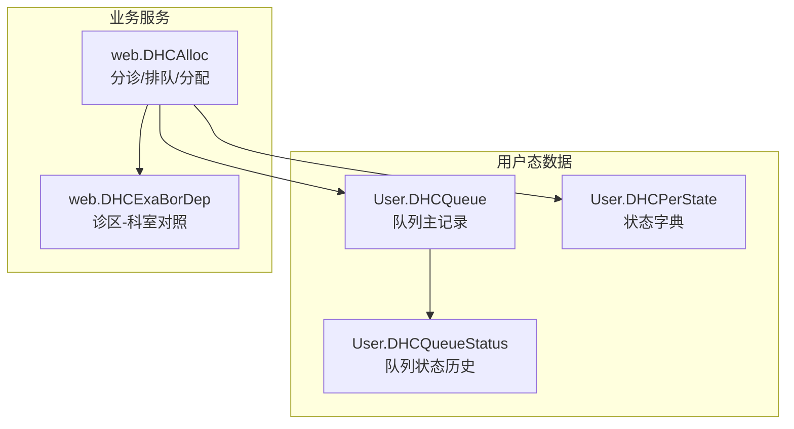
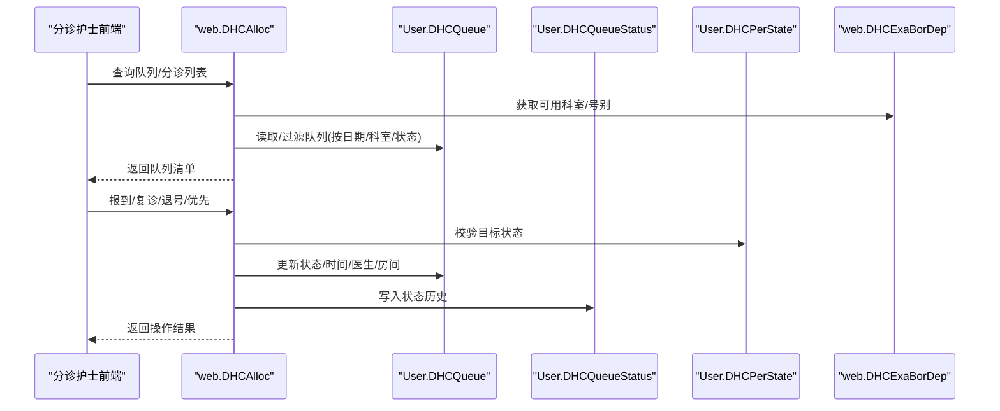
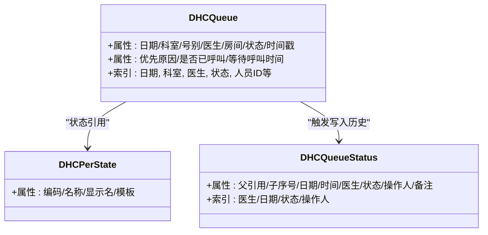
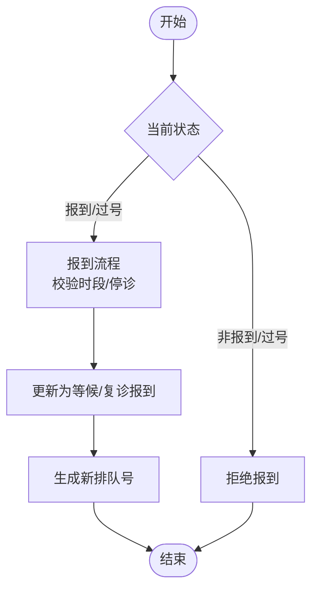
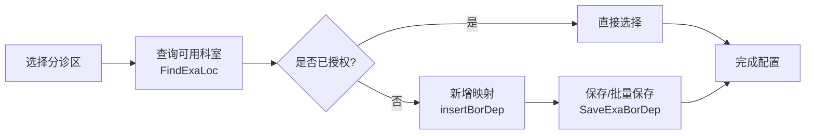
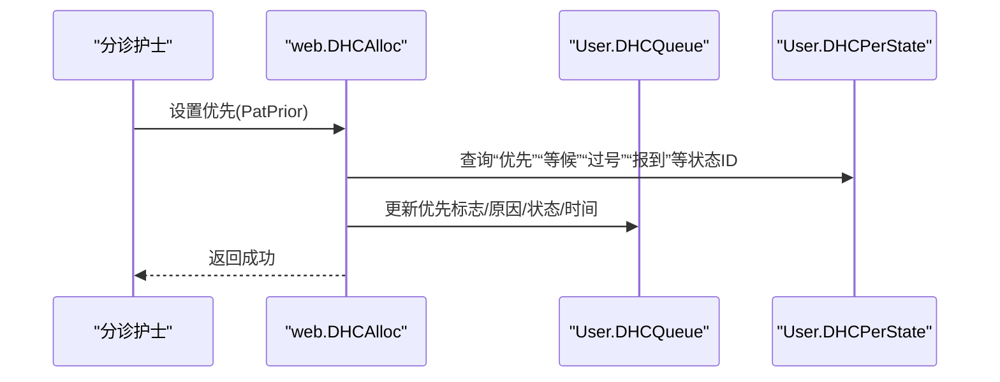
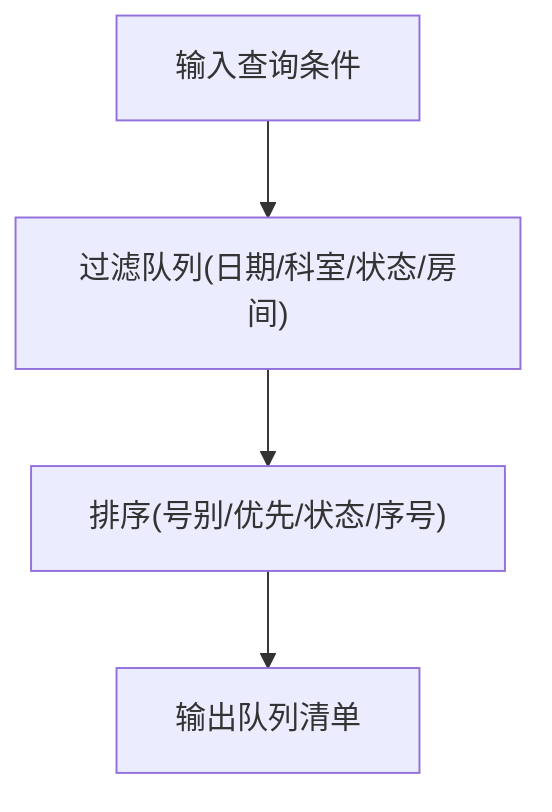
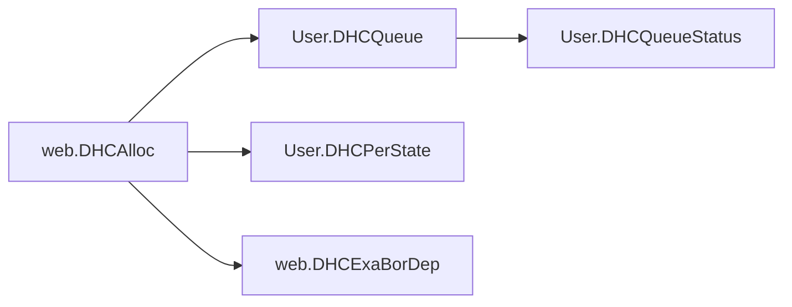

# 分诊系统接口

<cite>
**本文引用的文件**
- [DHCQueue.cls](file://src/backend/triage-ws/User/DHCQueue.cls)
- [DHCQueueStatus.cls](file://src/backend/triage-ws/User/DHCQueueStatus.cls)
- [DHCPerState.cls](file://src/backend/triage-ws/User/DHCPerState.cls)
- [DHCAlloc.cls](file://src/backend/triage-ws/web/DHCAlloc.cls)
- [DHCExaBorDep.cls](file://src/backend/triage-ws/web/DHCExaBorDep.cls)
</cite>

## 目录
1. [简介](#简介)
2. [项目结构](#项目结构)
3. [核心组件](#核心组件)
4. [架构总览](#架构总览)
5. [详细组件分析](#详细组件分析)
6. [依赖关系分析](#依赖关系分析)
7. [性能考虑](#性能考虑)
8. [故障排查指南](#故障排查指南)
9. [结论](#结论)
10. [附录](#附录)

## 简介
本文件面向分诊系统Web服务接口，聚焦患者分流、优先级管理、候诊队列与资源分配等核心能力。文档基于后端类与方法实现，梳理了：
- 分诊规则配置（诊区-科室/号别映射）
- 患者状态更新（报到、复诊、退号、过号、优先等）
- 资源分配（医生、诊室、诊区）
- 紧急程度评估与优先级标记
- 候诊队列管理与查询
- 分诊结果查询
并给出分诊护士工作流中的典型调用示例，以及与挂号系统、检查科室的数据交互模式说明。

## 项目结构
分诊相关代码主要位于 triage-ws 模块：
- User 层：持久化数据模型（队列、状态历史、字典）
- web 层：对外暴露的Web服务方法（分诊、排队、资源分配、查询）

**图示来源**
- [DHCQueue.cls:1-120](file://src/backend/triage-ws/User/DHCQueue.cls#L1-L120)
- [DHCQueueStatus.cls:1-30](file://src/backend/triage-ws/User/DHCQueueStatus.cls#L1-L30)
- [DHCPerState.cls:1-20](file://src/backend/triage-ws/User/DHCPerState.cls#L1-L20)
- [DHCAlloc.cls:1-120](file://src/backend/triage-ws/web/DHCAlloc.cls#L1-L120)
- [DHCExaBorDep.cls:1-30](file://src/backend/triage-ws/web/DHCExaBorDep.cls#L1-L30)

**章节来源**
- [DHCQueue.cls:1-120](file://src/backend/triage-ws/User/DHCQueue.cls#L1-L120)
- [DHCQueueStatus.cls:1-30](file://src/backend/triage-ws/User/DHCQueueStatus.cls#L1-L30)
- [DHCPerState.cls:1-20](file://src/backend/triage-ws/User/DHCPerState.cls#L1-L20)
- [DHCAlloc.cls:1-120](file://src/backend/triage-ws/web/DHCAlloc.cls#L1-L120)
- [DHCExaBorDep.cls:1-30](file://src/backend/triage-ws/web/DHCExaBorDep.cls#L1-L30)

## 核心组件
- 队列主表 DHCQueue：承载一次就诊的分诊信息（日期、科室、号别、医生、房间、状态、时间戳、是否优先、是否已呼叫等）。
- 队列状态历史 DHCQueueStatus：记录每次状态变更的时间、操作人、备注等，支持按医生、日期、状态等多索引查询。
- 状态字典 DHCPerState：统一的状态编码与显示名，如“等候”“报到”“过号”“复诊”“退号”等。
- Web服务 DHCAlloc：提供分诊、报到、复诊、退号、优先、会诊插入、排班/诊区查询等能力。
- 诊区-科室对照 DHCExaBorDep：维护分诊区与可分诊科室的映射及批量授权。

**章节来源**
- [DHCQueue.cls:24-100](file://src/backend/triage-ws/User/DHCQueue.cls#L24-L100)
- [DHCQueueStatus.cls:8-28](file://src/backend/triage-ws/User/DHCQueueStatus.cls#L8-L28)
- [DHCPerState.cls:4-13](file://src/backend/triage-ws/User/DHCPerState.cls#L4-L13)
- [DHCAlloc.cls:111-269](file://src/backend/triage-ws/web/DHCAlloc.cls#L111-L269)
- [DHCExaBorDep.cls:8-27](file://src/backend/triage-ws/web/DHCExaBorDep.cls#L8-L27)

## 架构总览
分诊流程涉及“挂号/预约 -> 分诊 -> 报到 -> 叫号 -> 就诊 -> 结束/转科/会诊”，各阶段通过 DHCAlloc 的方法驱动，并持久化到 DHCQueue 与 DHCQueueStatus。

**图示来源**
- [DHCAlloc.cls:393-472](file://src/backend/triage-ws/web/DHCAlloc.cls#L393-L472)
- [DHCAlloc.cls:350-391](file://src/backend/triage-ws/web/DHCAlloc.cls#L350-L391)
- [DHCAlloc.cls:474-515](file://src/backend/triage-ws/web/DHCAlloc.cls#L474-L515)
- [DHCQueue.cls:102-121](file://src/backend/triage-ws/User/DHCQueue.cls#L102-L121)
- [DHCQueueStatus.cls:1-28](file://src/backend/triage-ws/User/DHCQueueStatus.cls#L1-L28)
- [DHCPerState.cls:4-13](file://src/backend/triage-ws/User/DHCPerState.cls#L4-L13)
- [DHCExaBorDep.cls:95-155](file://src/backend/triage-ws/web/DHCExaBorDep.cls#L95-L155)

## 详细组件分析

### 队列与状态模型
- DHCQueue：包含队列编号、姓名、人员ID、日期、科室、号别、医生、房间、状态、创建/更新时间、是否采血/B超叫号、是否被呼叫、等待呼叫时间、优先原因、呼叫时间等字段；并提供多种索引以支撑高效查询。
- DHCQueueStatus：以父引用+子序号作为主键，记录状态变更时间、医生、状态、操作人、备注等，并提供多索引（医生、日期、状态、操作人）。
- DHCPerState：状态字典，含编码、名称、显示名、模板等。

**图示来源**
- [DHCQueue.cls:24-100](file://src/backend/triage-ws/User/DHCQueue.cls#L24-L100)
- [DHCQueueStatus.cls:8-28](file://src/backend/triage-ws/User/DHCQueueStatus.cls#L8-L28)
- [DHCPerState.cls:4-13](file://src/backend/triage-ws/User/DHCPerState.cls#L4-L13)

**章节来源**
- [DHCQueue.cls:24-100](file://src/backend/triage-ws/User/DHCQueue.cls#L24-L100)
- [DHCQueueStatus.cls:8-28](file://src/backend/triage-ws/User/DHCQueueStatus.cls#L8-L28)
- [DHCPerState.cls:4-13](file://src/backend/triage-ws/User/DHCPerState.cls#L4-L13)

### 分诊与排队服务（web.DHCAlloc）
- 查询队列 FindPatQueue：按日期、诊区、状态、房间、号别、患者ID等条件检索队列，输出排序后的队列清单（含优先级别、状态、医生、房间、号别、科室等），用于分诊台展示与调度。
- 报到 PatArrive：校验当前状态是否为“报到/过号”，必要时校验报到时段限制与医生停诊状态，更新为“等候”或“复诊报到”，并生成新排队号。
- 复诊 PatAgain：将队列状态置为“复诊”，清理优先原因，记录复诊时间与埋点。
- 退号/改派 PatAdjDoc：在允许范围内将患者调整至其他医生或恢复“退号/等候”等状态，必要时重新生成排队号。
- 优先 PatPrior：设置“优先”标志与优先原因；若当前为“报到”，则先执行报到逻辑再置优先。
- 会诊插入 ConsultationQueueInsert：封装挂号系统的队列插入，支持会诊场景。
- 诊区/科室/医生查询：GetFirstExabID、QueryExaboroughExecute、FindMarkDocDr 等，用于获取可操作诊区、诊区列表、可分诊医生及其等待人数。

**图示来源**
- [DHCAlloc.cls:393-472](file://src/backend/triage-ws/web/DHCAlloc.cls#L393-L472)
- [DHCAlloc.cls:350-391](file://src/backend/triage-ws/web/DHCAlloc.cls#L350-L391)
- [DHCAlloc.cls:474-515](file://src/backend/triage-ws/web/DHCAlloc.cls#L474-L515)

**章节来源**
- [DHCAlloc.cls:111-269](file://src/backend/triage-ws/web/DHCAlloc.cls#L111-L269)
- [DHCAlloc.cls:350-391](file://src/backend/triage-ws/web/DHCAlloc.cls#L350-L391)
- [DHCAlloc.cls:393-472](file://src/backend/triage-ws/web/DHCAlloc.cls#L393-L472)
- [DHCAlloc.cls:474-515](file://src/backend/triage-ws/web/DHCAlloc.cls#L474-L515)
- [DHCAlloc.cls:519-552](file://src/backend/triage-ws/web/DHCAlloc.cls#L519-L552)
- [DHCAlloc.cls:608-749](file://src/backend/triage-ws/web/DHCAlloc.cls#L608-L749)

### 分诊规则配置（诊区-科室映射）
- 增删改查：insertBorDep/updateBorDep/DeleteBorDep 维护分诊区与科室的对应关系。
- 批量授权：SaveExaBorDep 支持一次性添加/移除多个科室。
- 查询：FindExaLoc 按描述/医院维度列出可用科室，并标注是否已授权。

**图示来源**
- [DHCExaBorDep.cls:8-27](file://src/backend/triage-ws/web/DHCExaBorDep.cls#L8-L27)
- [DHCExaBorDep.cls:30-57](file://src/backend/triage-ws/web/DHCExaBorDep.cls#L30-L57)
- [DHCExaBorDep.cls:59-71](file://src/backend/triage-ws/web/DHCExaBorDep.cls#L59-L71)
- [DHCExaBorDep.cls:95-155](file://src/backend/triage-ws/web/DHCExaBorDep.cls#L95-L155)
- [DHCExaBorDep.cls:157-183](file://src/backend/triage-ws/web/DHCExaBorDep.cls#L157-L183)

**章节来源**
- [DHCExaBorDep.cls:8-27](file://src/backend/triage-ws/web/DHCExaBorDep.cls#L8-L27)
- [DHCExaBorDep.cls:30-57](file://src/backend/triage-ws/web/DHCExaBorDep.cls#L30-L57)
- [DHCExaBorDep.cls:59-71](file://src/backend/triage-ws/web/DHCExaBorDep.cls#L59-L71)
- [DHCExaBorDep.cls:95-155](file://src/backend/triage-ws/web/DHCExaBorDep.cls#L95-L155)
- [DHCExaBorDep.cls:157-183](file://src/backend/triage-ws/web/DHCExaBorDep.cls#L157-L183)

### 紧急程度评估与优先级管理
- 优先级标记：PatPrior 支持将队列设置为“优先”，并可记录优先原因；若当前为“报到”，会先执行报到逻辑。
- 优先级展示：FindPatQueue 在返回列表中包含优先级别与状态，便于分诊台高亮显示。
- 状态字典：通过 DHCPerState 统一管理状态值，确保跨模块一致性。

**图示来源**
- [DHCAlloc.cls:474-515](file://src/backend/triage-ws/web/DHCAlloc.cls#L474-L515)
- [DHCPerState.cls:4-13](file://src/backend/triage-ws/User/DHCPerState.cls#L4-L13)

**章节来源**
- [DHCAlloc.cls:474-515](file://src/backend/triage-ws/web/DHCAlloc.cls#L474-L515)
- [DHCPerState.cls:4-13](file://src/backend/triage-ws/User/DHCPerState.cls#L4-L13)

### 候诊队列管理与查询
- 查询队列：FindPatQueue 支持按日期、诊区、状态、房间、号别、患者ID等筛选，并按号别/优先/状态/序号排序，返回完整队列信息。
- 医生待诊数：FindMarkDocDr 计算某医生在当前科室的等待人数，辅助分诊决策。
- 诊区/医生列表：QueryExaboroughExecute/GetFirstExabID 提供可操作诊区与医生排班信息。

**图示来源**
- [DHCAlloc.cls:111-269](file://src/backend/triage-ws/web/DHCAlloc.cls#L111-L269)
- [DHCAlloc.cls:33-109](file://src/backend/triage-ws/web/DHCAlloc.cls#L33-L109)
- [DHCAlloc.cls:758-800](file://src/backend/triage-ws/web/DHCAlloc.cls#L758-L800)

**章节来源**
- [DHCAlloc.cls:111-269](file://src/backend/triage-ws/web/DHCAlloc.cls#L111-L269)
- [DHCAlloc.cls:33-109](file://src/backend/triage-ws/web/DHCAlloc.cls#L33-L109)
- [DHCAlloc.cls:758-800](file://src/backend/triage-ws/web/DHCAlloc.cls#L758-L800)

### 资源分配（医生/诊室/诊区）
- 医生分配：PatAdjDoc 支持将患者调整到其他医生，或在允许范围内恢复“退号/等候”。
- 诊室分配：队列中维护 QueRoomDr/RoomName，可在分诊时根据排班与可用性进行分配。
- 诊区分配：FindPatQueue/QueryExaboroughExecute 支持按诊区维度组织队列与资源视图。

**章节来源**
- [DHCAlloc.cls:277-348](file://src/backend/triage-ws/web/DHCAlloc.cls#L277-L348)
- [DHCQueue.cls:24-100](file://src/backend/triage-ws/User/DHCQueue.cls#L24-L100)
- [DHCAlloc.cls:758-800](file://src/backend/triage-ws/web/DHCAlloc.cls#L758-L800)

### 与挂号系统与检查科室的交互
- 挂号系统：ConsultationQueueInsert 调用挂号系统的队列插入接口，支持会诊场景；PatArrive/PatAdjDoc 在必要时生成新排队号。
- 检查科室：FindPatQueue 与 FindMarkDocDr 在统计与展示时会关联检查科室/号别信息，以便分诊台掌握资源占用情况。

**章节来源**
- [DHCAlloc.cls:519-552](file://src/backend/triage-ws/web/DHCAlloc.cls#L519-L552)
- [DHCAlloc.cls:111-269](file://src/backend/triage-ws/web/DHCAlloc.cls#L111-L269)

### 分诊护士工作流API调用示例
以下为典型操作序列（以方法名为准，具体参数由前端传入）：
- 查询队列：调用 FindPatQueue，传入日期、诊区、状态、房间、号别、患者ID等条件。
- 报到：调用 PatArrive，传入队列ID、操作人；内部校验报到时段与医生停诊状态后更新状态。
- 复诊：调用 PatAgain，传入队列ID；内部将状态置为“复诊”并清理优先原因。
- 退号/改派：调用 PatAdjDoc，传入队列ID与新医生；内部校验并更新状态。
- 优先：调用 PatPrior，传入队列ID与优先原因；若当前为“报到”，会先执行报到。
- 配置规则：使用 DHCExaBorDep 的 insert/update/delete/save 维护分诊区-科室映射。

**章节来源**
- [DHCAlloc.cls:111-269](file://src/backend/triage-ws/web/DHCAlloc.cls#L111-L269)
- [DHCAlloc.cls:350-391](file://src/backend/triage-ws/web/DHCAlloc.cls#L350-L391)
- [DHCAlloc.cls:393-472](file://src/backend/triage-ws/web/DHCAlloc.cls#L393-L472)
- [DHCAlloc.cls:474-515](file://src/backend/triage-ws/web/DHCAlloc.cls#L474-L515)
- [DHCExaBorDep.cls:8-27](file://src/backend/triage-ws/web/DHCExaBorDep.cls#L8-L27)

## 依赖关系分析
- DHCAlloc 依赖 DHCQueue 进行队列读写，依赖 DHCPerState 进行状态码解析，依赖 DHCExaBorDep 进行规则配置。
- DHCQueue 在插入/更新后触发 DHCQueueStatus 写入状态历史，保证可追溯性。
- 多处方法通过 SQL 访问底层全局存储（如 ^CTPCP、^RB、^PAADM 等），体现与挂号、排班、患者档案等系统的集成。

**图示来源**
- [DHCAlloc.cls:111-269](file://src/backend/triage-ws/web/DHCAlloc.cls#L111-L269)
- [DHCQueue.cls:102-121](file://src/backend/triage-ws/User/DHCQueue.cls#L102-L121)
- [DHCExaBorDep.cls:95-155](file://src/backend/triage-ws/web/DHCExaBorDep.cls#L95-L155)

**章节来源**
- [DHCAlloc.cls:111-269](file://src/backend/triage-ws/web/DHCAlloc.cls#L111-L269)
- [DHCQueue.cls:102-121](file://src/backend/triage-ws/User/DHCQueue.cls#L102-L121)
- [DHCExaBorDep.cls:95-155](file://src/backend/triage-ws/web/DHCExaBorDep.cls#L95-L155)

## 性能考虑
- 索引优化：DHCQueue 提供多列索引（日期、科室、医生、状态、人员ID等），提升常见查询效率。
- 状态历史索引：DHCQueueStatus 提供按医生、日期、状态、操作人的索引，便于审计与统计。
- 批量处理：FindPatQueue 采用内存临时结构与多级索引遍历，减少数据库压力；建议在高并发场景下结合分页与缓存。
- 事务控制：部分写操作使用事务块（如会诊插入），确保数据一致性。

[本节为通用性能建议，不直接分析具体文件]

## 故障排查指南
- 报到失败：检查当前状态是否为“报到/过号”，并确认报到时段限制与医生停诊状态；参考 PatArrive 的校验逻辑。
- 无法设置优先：若当前为“报到”，需先完成报到后再设置优先；参考 PatPrior 的流程。
- 队列查询为空：核对日期、诊区、状态、房间、号别等筛选条件；参考 FindPatQueue 的过滤逻辑。
- 规则配置无效：确认分诊区-科室映射是否存在；参考 DHCExaBorDep 的查询与保存方法。

**章节来源**
- [DHCAlloc.cls:393-472](file://src/backend/triage-ws/web/DHCAlloc.cls#L393-L472)
- [DHCAlloc.cls:474-515](file://src/backend/triage-ws/web/DHCAlloc.cls#L474-L515)
- [DHCAlloc.cls:111-269](file://src/backend/triage-ws/web/DHCAlloc.cls#L111-L269)
- [DHCExaBorDep.cls:95-155](file://src/backend/triage-ws/web/DHCExaBorDep.cls#L95-L155)

## 结论
本分诊系统以 DHCQueue 为核心数据模型，配合 DHCQueueStatus 状态历史与 DHCPerState 状态字典，形成完整的队列生命周期管理。web.DHCAlloc 提供丰富的分诊与排队能力，覆盖报到、复诊、退号、优先、会诊等关键场景；web.DHCExaBorDep 提供灵活的规则配置。整体架构清晰、可扩展性强，能够满足门诊分诊的高并发与复杂业务需求。

[本节为总结性内容，不直接分析具体文件]

## 附录
- 常用方法速览（以方法名为准）：
  - 队列查询：FindPatQueue
  - 报到：PatArrive
  - 复诊：PatAgain
  - 退号/改派：PatAdjDoc
  - 优先：PatPrior
  - 会诊插入：ConsultationQueueInsert
  - 诊区/医生查询：GetFirstExabID、QueryExaboroughExecute、FindMarkDocDr
  - 规则配置：insertBorDep、updateBorDep、DeleteBorDep、SaveExaBorDep、FindExaLoc

[本节为补充说明，不直接分析具体文件]