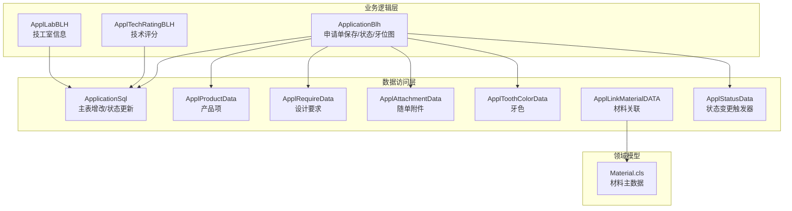
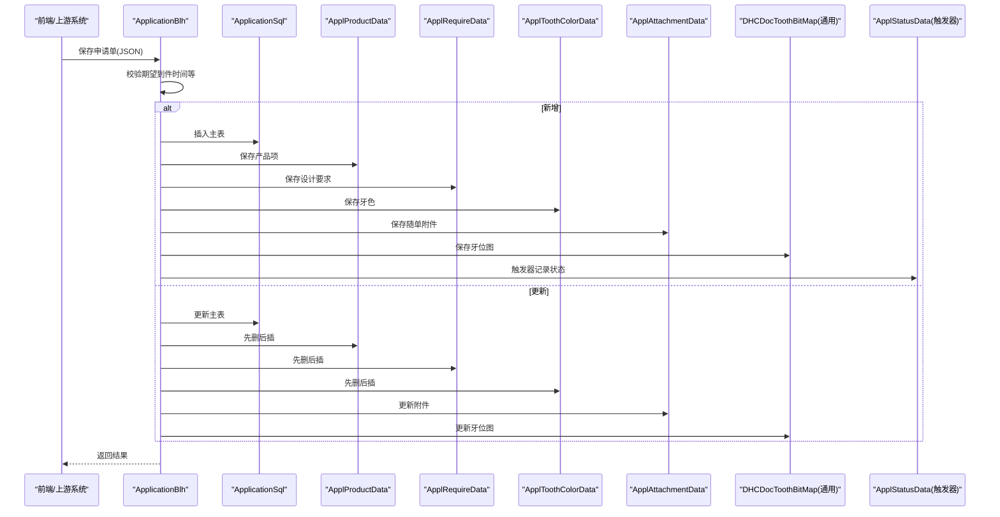
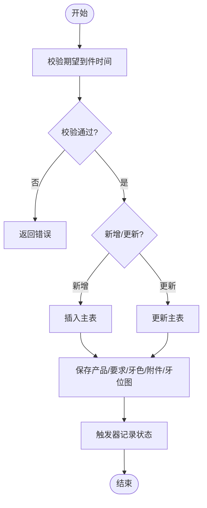
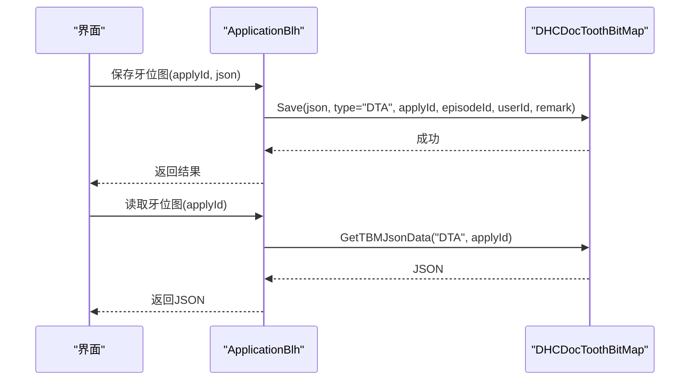
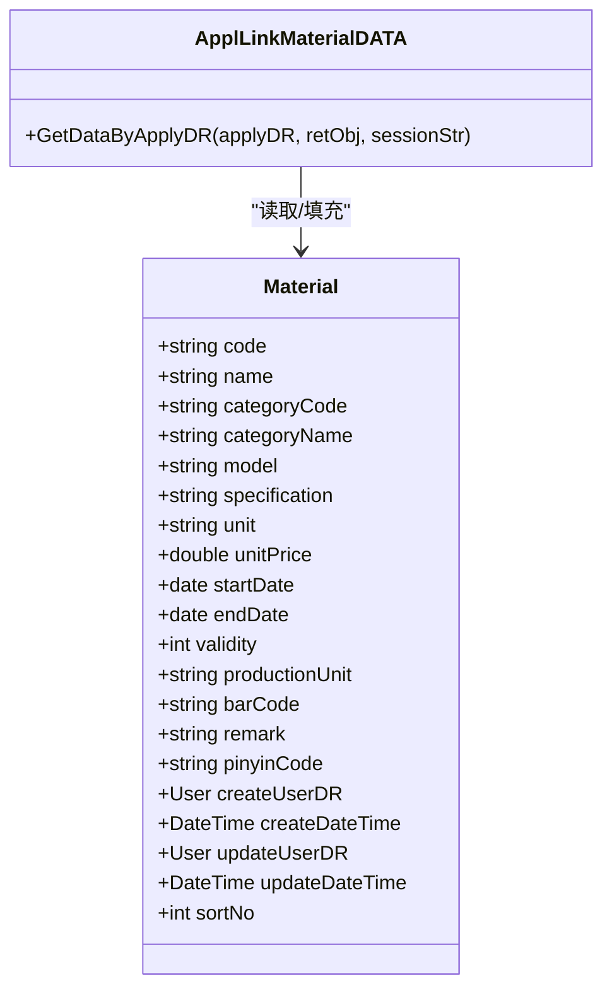
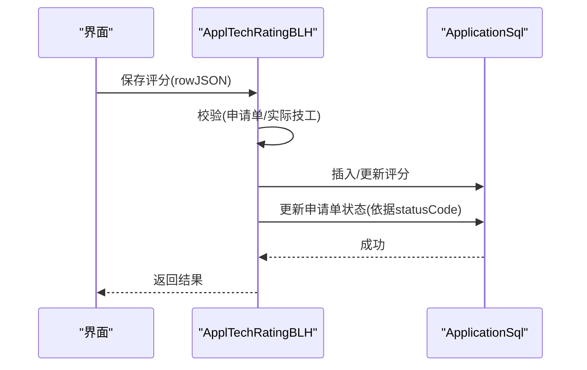
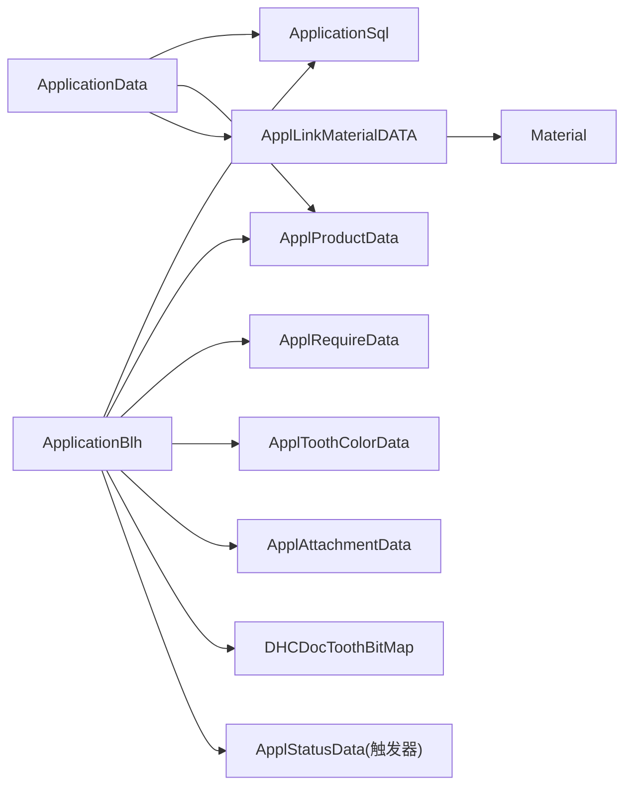
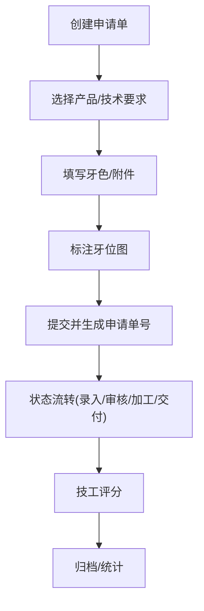

# 牙科系统模块架构

<cite>
**本文引用的文件**
- [ApplicationBlh.cls](file://src/backend/dental-ws/DHCDoc/Dental/TA/ApplicationBlh.cls)
- [ApplicationData.cls](file://src/backend/dental-ws/DHCDoc/Dental/TA/ApplicationData.cls)
- [ApplicationSql.cls](file://src/backend/dental-ws/DHCDoc/Dental/TA/ApplicationSql.cls)
- [ApplProductData.cls](file://src/backend/dental-ws/DHCDoc/Dental/TA/ApplProductData.cls)
- [ApplRequireData.cls](file://src/backend/dental-ws/DHCDoc/Dental/TA/ApplRequireData.cls)
- [ApplAttachmentData.cls](file://src/backend/dental-ws/DHCDoc/Dental/TA/ApplAttachmentData.cls)
- [ApplToothColorData.cls](file://src/backend/dental-ws/DHCDoc/Dental/TA/ApplToothColorData.cls)
- [ApplLinkMaterialDATA.cls](file://src/backend/dental-ws/DHCDoc/Dental/TA/ApplLinkMaterialDATA.cls)
- [ApplStatusData.cls](file://src/backend/dental-ws/DHCDoc/Dental/TA/ApplStatusData.cls)
- [ApplTechRatingBLH.cls](file://src/backend/dental-ws/DHCDoc/Dental/TA/ApplTechRatingBLH.cls)
- [ApplLabBLH.cls](file://src/backend/dental-ws/DHCDoc/Dental/TA/ApplLabBLH.cls)
- [Material.cls](file://src/backend/dental-ws/CT/DOC/Dental/TA/Material.cls)
</cite>

## 目录
1. [简介](#简介)
2. [项目结构](#项目结构)
3. [核心组件](#核心组件)
4. [架构总览](#架构总览)
5. [详细组件分析](#详细组件分析)
6. [依赖关系分析](#依赖关系分析)
7. [性能考虑](#性能考虑)
8. [故障排查指南](#故障排查指南)
9. [结论](#结论)
10. [附录](#附录)

## 简介
本文件面向牙科系统（dental-ws）模块，聚焦以下专业功能：
- 牙科诊疗记录与技工申请单生命周期管理
- 牙齿定位图（牙位图）的保存与读取
- 材料管理与材料关联、金额汇总
- 修复体制作、正畸治疗等完整业务流程
- 牙齿位点映射、材料关联与技术评分机制
- 与主 HIS 系统的集成方式与数据同步策略
- 特殊配置与打印输出能力
- 业务对象定义与使用示例（以路径引用形式提供）

## 项目结构
dental-ws 模块采用“业务逻辑层 + 数据访问层 + 领域模型”的分层组织：
- 业务逻辑层（BLH）：封装流程控制、校验、事务协调与状态流转
- 数据访问层（SQL/DATA）：负责持久化、查询与聚合
- 领域模型（CT/CF）：字典、材料、层级等基础数据模型

图表来源
- [ApplicationBlh.cls:1-302](file://src/backend/dental-ws/DHCDoc/Dental/TA/ApplicationBlh.cls#L1-L302)
- [ApplicationSql.cls:1-148](file://src/backend/dental-ws/DHCDoc/Dental/TA/ApplicationSql.cls#L1-L148)
- [ApplProductData.cls:1-97](file://src/backend/dental-ws/DHCDoc/Dental/TA/ApplProductData.cls#L1-L97)
- [ApplRequireData.cls:1-114](file://src/backend/dental-ws/DHCDoc/Dental/TA/ApplRequireData.cls#L1-L114)
- [ApplAttachmentData.cls:1-56](file://src/backend/dental-ws/DHCDoc/Dental/TA/ApplAttachmentData.cls#L1-L56)
- [ApplToothColorData.cls:1-79](file://src/backend/dental-ws/DHCDoc/Dental/TA/ApplToothColorData.cls#L1-L79)
- [ApplLinkMaterialDATA.cls:1-54](file://src/backend/dental-ws/DHCDoc/Dental/TA/ApplLinkMaterialDATA.cls#L1-L54)
- [ApplStatusData.cls:1-157](file://src/backend/dental-ws/DHCDoc/Dental/TA/ApplStatusData.cls#L1-L157)
- [Material.cls:1-152](file://src/backend/dental-ws/CT/DOC/Dental/TA/Material.cls#L1-L152)

章节来源
- [ApplicationBlh.cls:1-302](file://src/backend/dental-ws/DHCDoc/Dental/TA/ApplicationBlh.cls#L1-L302)
- [ApplicationData.cls:1-373](file://src/backend/dental-ws/DHCDoc/Dental/TA/ApplicationData.cls#L1-L373)

## 核心组件
- 申请单主流程（ApplicationBlh）
  - 保存申请单及子项（产品、设计要求、牙色、随单附件），支持新增与更新
  - 保存/读取牙齿定位图（调用通用牙位图服务）
  - 批量更新申请单状态
  - 暂存/恢复草稿
- 申请单查询（ApplicationData）
  - 多条件查询（患者、日期、状态、加工单位、医生等）
  - 历史工单查询（右侧面板）
  - 组装展示字段（含技工评分、材料金额、计划交付日期等）
- 数据访问（ApplicationSql）
  - 主表插入/更新、状态批量更新、护士打印次数、返工次数
  - 申请单号生成规则
- 产品项（ApplProductData）
  - 批量保存产品项，维护层级与描述
  - 获取产品信息用于列表展示
- 设计要求（ApplRequireData）
  - 批量保存要求项，按层级拼装文本描述
- 随单附件（ApplAttachmentData）
  - 咬合记录、托盘、石膏模、旧牙等数量与备注
- 牙色（ApplToothColorData）
  - 牙色、基台色、混合色、遮色、活髓比色、照片标记、特殊打印等
- 材料关联（ApplLinkMaterialDATA）
  - 查询申请单关联的材料明细，填充名称、类别、单位等
- 状态变更（ApplStatusData）
  - 通过触发器记录状态变更轨迹，自动创建技工室子表
- 技术评分（ApplTechRatingBLH）
  - 保存评分并联动更新申请单状态
- 技工室信息（ApplLabBLH）
  - 保存/更新技工室备注与计划交付日期

章节来源
- [ApplicationBlh.cls:1-302](file://src/backend/dental-ws/DHCDoc/Dental/TA/ApplicationBlh.cls#L1-L302)
- [ApplicationData.cls:1-373](file://src/backend/dental-ws/DHCDoc/Dental/TA/ApplicationData.cls#L1-L373)
- [ApplicationSql.cls:1-148](file://src/backend/dental-ws/DHCDoc/Dental/TA/ApplicationSql.cls#L1-L148)
- [ApplProductData.cls:1-97](file://src/backend/dental-ws/DHCDoc/Dental/TA/ApplProductData.cls#L1-L97)
- [ApplRequireData.cls:1-114](file://src/backend/dental-ws/DHCDoc/Dental/TA/ApplRequireData.cls#L1-L114)
- [ApplAttachmentData.cls:1-56](file://src/backend/dental-ws/DHCDoc/Dental/TA/ApplAttachmentData.cls#L1-L56)
- [ApplToothColorData.cls:1-79](file://src/backend/dental-ws/DHCDoc/Dental/TA/ApplToothColorData.cls#L1-L79)
- [ApplLinkMaterialDATA.cls:1-54](file://src/backend/dental-ws/DHCDoc/Dental/TA/ApplLinkMaterialDATA.cls#L1-L54)
- [ApplStatusData.cls:1-157](file://src/backend/dental-ws/DHCDoc/Dental/TA/ApplStatusData.cls#L1-L157)
- [ApplTechRatingBLH.cls:1-48](file://src/backend/dental-ws/DHCDoc/Dental/TA/ApplTechRatingBLH.cls#L1-L48)
- [ApplLabBLH.cls:1-24](file://src/backend/dental-ws/DHCDoc/Dental/TA/ApplLabBLH.cls#L1-L24)

## 架构总览
牙科系统围绕“申请单”这一核心实体，串联产品、设计要求、牙色、附件、材料、技工室、状态与评分等子域。前端或上游系统通过接口调用 BLH，BLH 协调 SQL/DATA 完成持久化与查询，并通过触发器保证状态审计与子表一致性。

图表来源
- [ApplicationBlh.cls:1-302](file://src/backend/dental-ws/DHCDoc/Dental/TA/ApplicationBlh.cls#L1-L302)
- [ApplicationSql.cls:1-148](file://src/backend/dental-ws/DHCDoc/Dental/TA/ApplicationSql.cls#L1-L148)
- [ApplProductData.cls:1-97](file://src/backend/dental-ws/DHCDoc/Dental/TA/ApplProductData.cls#L1-L97)
- [ApplRequireData.cls:1-114](file://src/backend/dental-ws/DHCDoc/Dental/TA/ApplRequireData.cls#L1-L114)
- [ApplToothColorData.cls:1-79](file://src/backend/dental-ws/DHCDoc/Dental/TA/ApplToothColorData.cls#L1-L79)
- [ApplAttachmentData.cls:1-56](file://src/backend/dental-ws/DHCDoc/Dental/TA/ApplAttachmentData.cls#L1-L56)
- [ApplStatusData.cls:1-157](file://src/backend/dental-ws/DHCDoc/Dental/TA/ApplStatusData.cls#L1-L157)

## 详细组件分析

### 申请单保存与状态流转
- 保存前校验：期望到件时间必填且格式正确，不得早于当天
- 新增/更新：统一入口，子表采用“先删后插”确保一致性
- 状态更新：通过字典码转换为内部 ID 后批量更新
- 暂存/恢复：基于用户会话键存储 JSON 草稿

图表来源
- [ApplicationBlh.cls:148-186](file://src/backend/dental-ws/DHCDoc/Dental/TA/ApplicationBlh.cls#L148-L186)
- [ApplicationBlh.cls:26-145](file://src/backend/dental-ws/DHCDoc/Dental/TA/ApplicationBlh.cls#L26-L145)
- [ApplicationSql.cls:6-105](file://src/backend/dental-ws/DHCDoc/Dental/TA/ApplicationSql.cls#L6-L105)
- [ApplStatusData.cls:4-54](file://src/backend/dental-ws/DHCDoc/Dental/TA/ApplStatusData.cls#L4-L54)

章节来源
- [ApplicationBlh.cls:1-302](file://src/backend/dental-ws/DHCDoc/Dental/TA/ApplicationBlh.cls#L1-L302)
- [ApplicationSql.cls:1-148](file://src/backend/dental-ws/DHCDoc/Dental/TA/ApplicationSql.cls#L1-L148)
- [ApplStatusData.cls:1-157](file://src/backend/dental-ws/DHCDoc/Dental/TA/ApplStatusData.cls#L1-L157)

### 牙齿定位图（牙位图）
- 保存：通过 ApplicationBlh 调用通用牙位图服务，绑定申请单与就诊
- 读取：根据申请单 ID 返回 JSON 结构与备注
- 用途：可视化标注受累牙位、修复范围、正畸目标等

图表来源
- [ApplicationBlh.cls:188-203](file://src/backend/dental-ws/DHCDoc/Dental/TA/ApplicationBlh.cls#L188-L203)

章节来源
- [ApplicationBlh.cls:188-203](file://src/backend/dental-ws/DHCDoc/Dental/TA/ApplicationBlh.cls#L188-L203)

### 材料管理与关联
- 材料主数据：包含代码、名称、类别、规格、单价、有效期、条码等
- 申请单关联材料：查询并填充名称、类别、单位等；可汇总金额
- 金额汇总：在列表查询中计算并返回材料总金额

图表来源
- [Material.cls:1-152](file://src/backend/dental-ws/CT/DOC/Dental/TA/Material.cls#L1-L152)
- [ApplLinkMaterialDATA.cls:1-54](file://src/backend/dental-ws/DHCDoc/Dental/TA/ApplLinkMaterialDATA.cls#L1-L54)

章节来源
- [Material.cls:1-152](file://src/backend/dental-ws/CT/DOC/Dental/TA/Material.cls#L1-L152)
- [ApplLinkMaterialDATA.cls:1-54](file://src/backend/dental-ws/DHCDoc/Dental/TA/ApplLinkMaterialDATA.cls#L1-L54)
- [ApplicationData.cls:164-182](file://src/backend/dental-ws/DHCDoc/Dental/TA/ApplicationData.cls#L164-L182)

### 技术评分与状态联动
- 评分保存：校验申请单与实际技工存在后写入评分
- 状态联动：新评分时根据状态码更新申请单状态
- 查询：按 ID 获取评分详情

图表来源
- [ApplTechRatingBLH.cls:6-26](file://src/backend/dental-ws/DHCDoc/Dental/TA/ApplTechRatingBLH.cls#L6-L26)
- [ApplicationSql.cls:87-105](file://src/backend/dental-ws/DHCDoc/Dental/TA/ApplicationSql.cls#L87-L105)

章节来源
- [ApplTechRatingBLH.cls:1-48](file://src/backend/dental-ws/DHCDoc/Dental/TA/ApplTechRatingBLH.cls#L1-L48)
- [ApplicationSql.cls:87-105](file://src/backend/dental-ws/DHCDoc/Dental/TA/ApplicationSql.cls#L87-L105)

### 设计与产品、要求、牙色、附件
- 产品项：支持多层级字典，保存层级 ID 串与描述，便于列表展示
- 设计要求：按层级拼装可读文本，支持多类型要求合并
- 牙色：支持多种颜色与标记，提供打印友好格式
- 随单附件：数量与备注，便于技工接收实物核对

章节来源
- [ApplProductData.cls:1-97](file://src/backend/dental-ws/DHCDoc/Dental/TA/ApplProductData.cls#L1-L97)
- [ApplRequireData.cls:1-114](file://src/backend/dental-ws/DHCDoc/Dental/TA/ApplRequireData.cls#L1-L114)
- [ApplToothColorData.cls:1-79](file://src/backend/dental-ws/DHCDoc/Dental/TA/ApplToothColorData.cls#L1-L79)
- [ApplAttachmentData.cls:1-56](file://src/backend/dental-ws/DHCDoc/Dental/TA/ApplAttachmentData.cls#L1-L56)

### 技工室信息与计划交付
- 保存/更新技工室备注与计划交付日期
- 与申请单主表通过父子关系关联

章节来源
- [ApplLabBLH.cls:1-24](file://src/backend/dental-ws/DHCDoc/Dental/TA/ApplLabBLH.cls#L1-L24)
- [ApplicationData.cls:183-186](file://src/backend/dental-ws/DHCDoc/Dental/TA/ApplicationData.cls#L183-L186)

## 依赖关系分析
- 耦合度
  - ApplicationBlh 对多个 DATA/SQL 有强依赖，承担编排职责
  - 状态变更通过触发器解耦，避免业务层遗漏审计
- 内聚性
  - 各 DATA 类职责单一（产品、要求、牙色、附件、材料）
  - SQL 类专注主表与批处理操作
- 外部依赖
  - 通用牙位图服务（web.DHCDocToothBitMap）
  - 字典与层级（CT/CF）
  - 用户与科室信息（doc-ws 中的用户/科室服务）

图表来源
- [ApplicationBlh.cls:1-302](file://src/backend/dental-ws/DHCDoc/Dental/TA/ApplicationBlh.cls#L1-L302)
- [ApplicationData.cls:1-373](file://src/backend/dental-ws/DHCDoc/Dental/TA/ApplicationData.cls#L1-L373)
- [ApplLinkMaterialDATA.cls:1-54](file://src/backend/dental-ws/DHCDoc/Dental/TA/ApplLinkMaterialDATA.cls#L1-L54)
- [Material.cls:1-152](file://src/backend/dental-ws/CT/DOC/Dental/TA/Material.cls#L1-L152)

章节来源
- [ApplicationBlh.cls:1-302](file://src/backend/dental-ws/DHCDoc/Dental/TA/ApplicationBlh.cls#L1-L302)
- [ApplicationData.cls:1-373](file://src/backend/dental-ws/DHCDoc/Dental/TA/ApplicationData.cls#L1-L373)

## 性能考虑
- 批量更新：状态更新采用 INLIST 批量修改，减少往返
- 索引利用：按日期、患者、申请单号等索引遍历，提升查询效率
- 临时缓存：查询结果写入临时数组，降低内存压力
- 事务边界：子表保存使用事务块，失败回滚保证一致性
- 懒加载：仅在需要时拼接语言化描述与图片标志

[本节为通用指导，不直接分析具体文件]

## 故障排查指南
- 期望到件时间校验失败
  - 检查输入格式与日期是否早于当天
  - 参考：[ApplicationBlh.cls:148-186](file://src/backend/dental-ws/DHCDoc/Dental/TA/ApplicationBlh.cls#L148-L186)
- 子表保存失败导致主表回滚
  - 查看产品/要求/牙色/附件保存返回值
  - 参考：[ApplicationBlh.cls:35-141](file://src/backend/dental-ws/DHCDoc/Dental/TA/ApplicationBlh.cls#L35-L141)
- 状态更新无效
  - 确认状态码是否存在，检查批量更新 SQL
  - 参考：[ApplicationBlh.cls:205-217](file://src/backend/dental-ws/DHCDoc/Dental/TA/ApplicationBlh.cls#L205-L217), [ApplicationSql.cls:87-105](file://src/backend/dental-ws/DHCDoc/Dental/TA/ApplicationSql.cls#L87-L105)
- 技工评分无法提交
  - 检查是否已维护实际技工
  - 参考：[ApplTechRatingBLH.cls:28-37](file://src/backend/dental-ws/DHCDoc/Dental/TA/ApplTechRatingBLH.cls#L28-L37)
- 材料金额未显示
  - 检查关联材料与主数据是否有效
  - 参考：[ApplicationData.cls:180-182](file://src/backend/dental-ws/DHCDoc/Dental/TA/ApplicationData.cls#L180-L182), [ApplLinkMaterialDATA.cls:1-54](file://src/backend/dental-ws/DHCDoc/Dental/TA/ApplLinkMaterialDATA.cls#L1-L54)

章节来源
- [ApplicationBlh.cls:148-217](file://src/backend/dental-ws/DHCDoc/Dental/TA/ApplicationBlh.cls#L148-L217)
- [ApplTechRatingBLH.cls:28-37](file://src/backend/dental-ws/DHCDoc/Dental/TA/ApplTechRatingBLH.cls#L28-L37)
- [ApplicationData.cls:180-182](file://src/backend/dental-ws/DHCDoc/Dental/TA/ApplicationData.cls#L180-L182)
- [ApplLinkMaterialDATA.cls:1-54](file://src/backend/dental-ws/DHCDoc/Dental/TA/ApplLinkMaterialDATA.cls#L1-L54)

## 结论
dental-ws 模块以申请单为核心，围绕产品、要求、牙色、附件、材料、技工室、状态与评分形成完整闭环。通过 BLH 编排与 SQL/DATA 分层，结合触发器保障状态审计与数据一致性，满足修复体制作与正畸治疗的端到端流程需求。与 HIS 的集成通过患者、用户、科室等共享字典与服务实现，数据同步策略强调幂等与事务一致性。

[本节为总结性内容，不直接分析具体文件]

## 附录

### 业务流程图（申请单全链路）

[此图为概念流程示意，不对应特定源码文件]

### 牙齿定位图结构说明
- 绑定维度：申请单 ID、就诊 ID、用户、备注
- 数据结构：JSON 形式，包含牙位标记、修复区域、正畸目标等
- 读取接口：按申请单 ID 返回 JSON 与备注

章节来源
- [ApplicationBlh.cls:188-203](file://src/backend/dental-ws/DHCDoc/Dental/TA/ApplicationBlh.cls#L188-L203)

### 材料管理模型
- 主数据字段：代码、名称、类别、规格、单价、有效期、条码等
- 关联查询：按申请单 ID 获取材料明细并填充名称、类别、单位
- 金额汇总：在列表查询中汇总材料金额

章节来源
- [Material.cls:1-152](file://src/backend/dental-ws/CT/DOC/Dental/TA/Material.cls#L1-L152)
- [ApplLinkMaterialDATA.cls:1-54](file://src/backend/dental-ws/DHCDoc/Dental/TA/ApplLinkMaterialDATA.cls#L1-L54)
- [ApplicationData.cls:180-182](file://src/backend/dental-ws/DHCDoc/Dental/TA/ApplicationData.cls#L180-L182)

### 与主 HIS 系统集成与数据同步策略
- 集成点
  - 患者信息：通过患者编号解析患者 ID
  - 用户/科室：登录上下文与科室过滤
  - 字典：统一字典服务提供名称与排序
- 同步策略
  - 申请单主表与状态变更通过触发器记录，保证审计一致
  - 子表采用“先删后插”确保更新原子性
  - 批量更新减少网络往返，提高吞吐

章节来源
- [ApplicationData.cls:22-36](file://src/backend/dental-ws/DHCDoc/Dental/TA/ApplicationData.cls#L22-L36)
- [ApplStatusData.cls:4-54](file://src/backend/dental-ws/DHCDoc/Dental/TA/ApplStatusData.cls#L4-L54)
- [ApplicationSql.cls:87-105](file://src/backend/dental-ws/DHCDoc/Dental/TA/ApplicationSql.cls#L87-L105)

### 特殊配置与打印输出
- 打印相关
  - 牙色打印友好格式（复选框符号、中文标签）
  - 随单附件文本拼接（数量×N）
- 配置相关
  - 状态字典分类与排序
  - 产品/要求层级字典驱动展示

章节来源
- [ApplToothColorData.cls:29-76](file://src/backend/dental-ws/DHCDoc/Dental/TA/ApplToothColorData.cls#L29-L76)
- [ApplAttachmentData.cls:20-53](file://src/backend/dental-ws/DHCDoc/Dental/TA/ApplAttachmentData.cls#L20-L53)
- [ApplStatusData.cls:114-154](file://src/backend/dental-ws/DHCDoc/Dental/TA/ApplStatusData.cls#L114-L154)

### 业务对象定义与使用示例（路径引用）
- 申请单主对象与查询
  - 定义与查询：[ApplicationData.cls:1-373](file://src/backend/dental-ws/DHCDoc/Dental/TA/ApplicationData.cls#L1-L373)
  - 保存/状态：[ApplicationBlh.cls:1-302](file://src/backend/dental-ws/DHCDoc/Dental/TA/ApplicationBlh.cls#L1-L302)
  - 主表 SQL：[ApplicationSql.cls:1-148](file://src/backend/dental-ws/DHCDoc/Dental/TA/ApplicationSql.cls#L1-L148)
- 产品项
  - 保存/获取：[ApplProductData.cls:1-97](file://src/backend/dental-ws/DHCDoc/Dental/TA/ApplProductData.cls#L1-L97)
- 设计要求
  - 保存/获取：[ApplRequireData.cls:1-114](file://src/backend/dental-ws/DHCDoc/Dental/TA/ApplRequireData.cls#L1-L114)
- 牙色
  - 保存/打印格式：[ApplToothColorData.cls:1-79](file://src/backend/dental-ws/DHCDoc/Dental/TA/ApplToothColorData.cls#L1-L79)
- 随单附件
  - 获取/拼接：[ApplAttachmentData.cls:1-56](file://src/backend/dental-ws/DHCDoc/Dental/TA/ApplAttachmentData.cls#L1-L56)
- 材料关联
  - 查询/填充：[ApplLinkMaterialDATA.cls:1-54](file://src/backend/dental-ws/DHCDoc/Dental/TA/ApplLinkMaterialDATA.cls#L1-L54)
  - 材料主数据：[Material.cls:1-152](file://src/backend/dental-ws/CT/DOC/Dental/TA/Material.cls#L1-L152)
- 状态与评分
  - 状态触发器：[ApplStatusData.cls:1-157](file://src/backend/dental-ws/DHCDoc/Dental/TA/ApplStatusData.cls#L1-L157)
  - 技术评分：[ApplTechRatingBLH.cls:1-48](file://src/backend/dental-ws/DHCDoc/Dental/TA/ApplTechRatingBLH.cls#L1-L48)
- 技工室信息
  - 保存/更新：[ApplLabBLH.cls:1-24](file://src/backend/dental-ws/DHCDoc/Dental/TA/ApplLabBLH.cls#L1-L24)