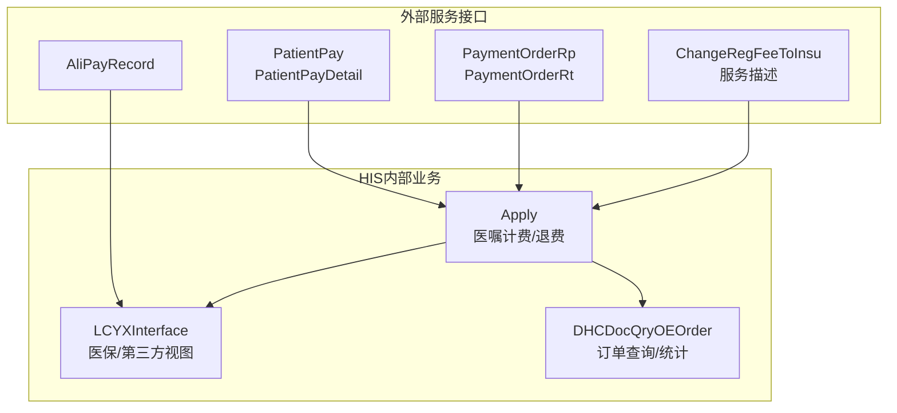
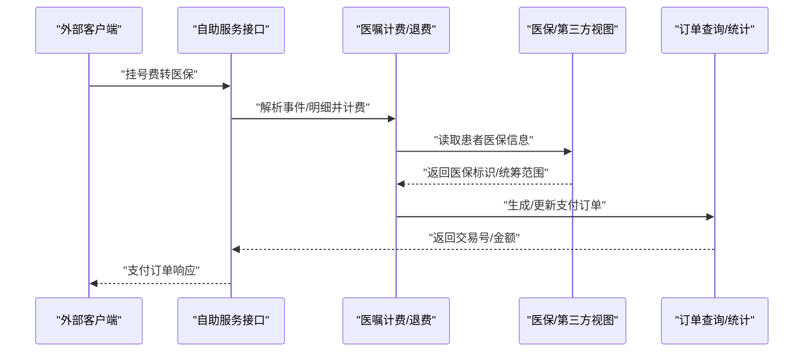
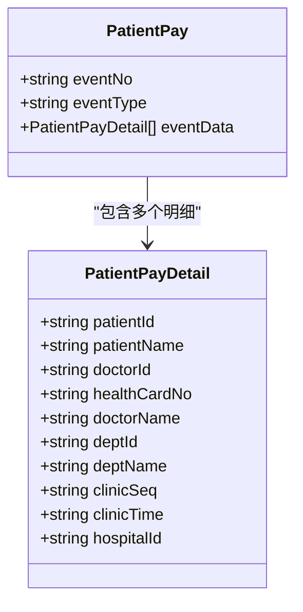
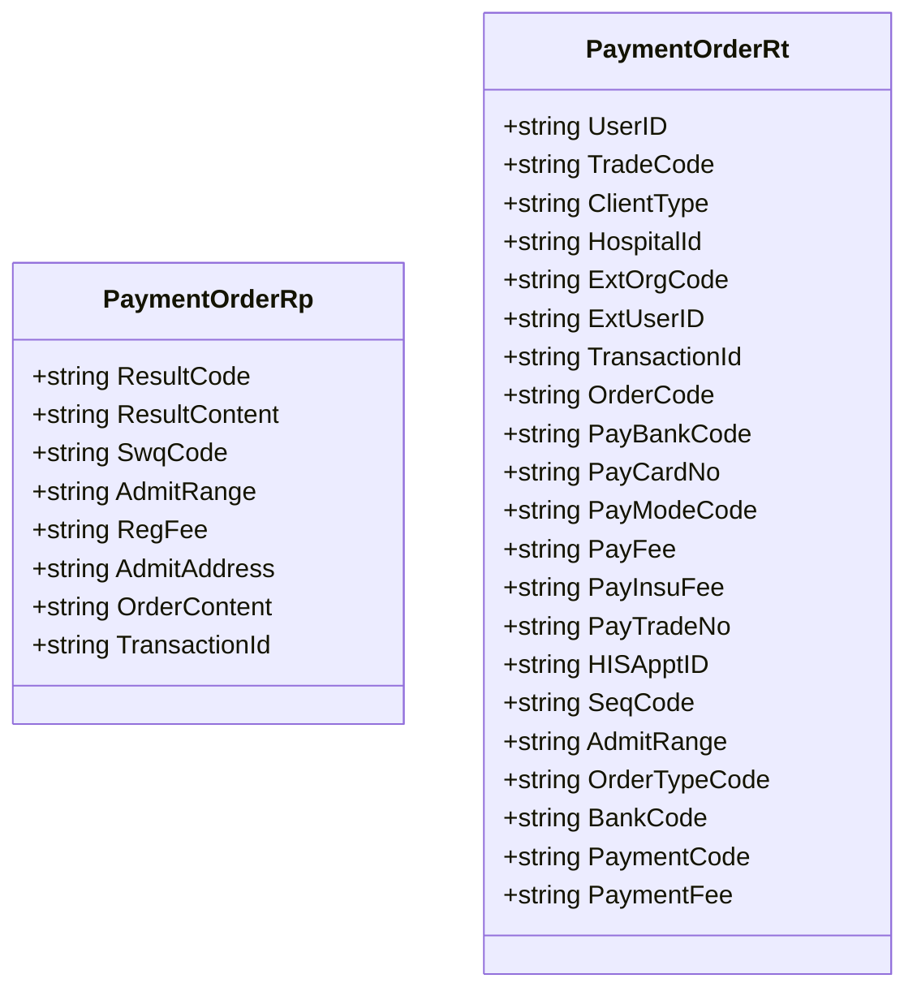
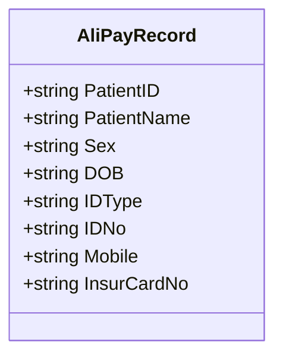
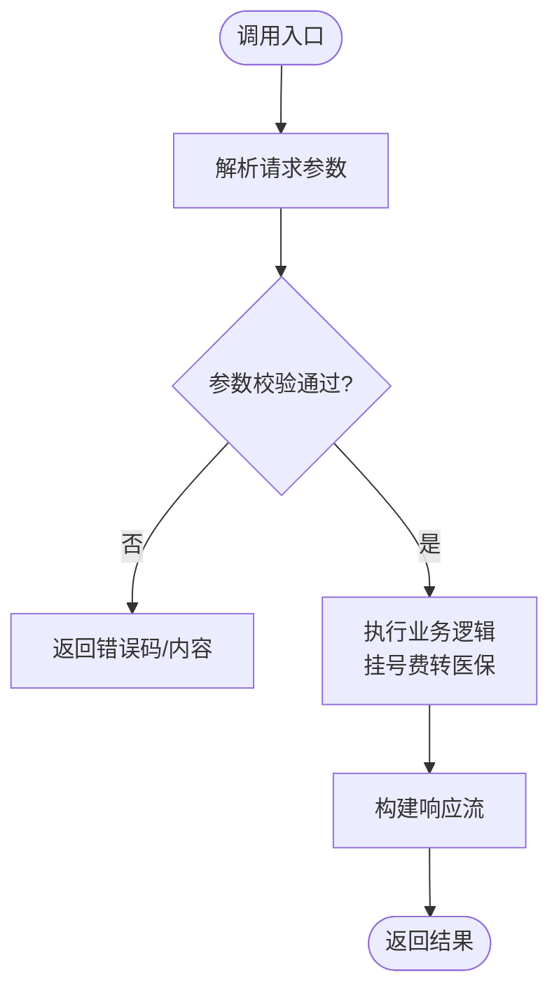
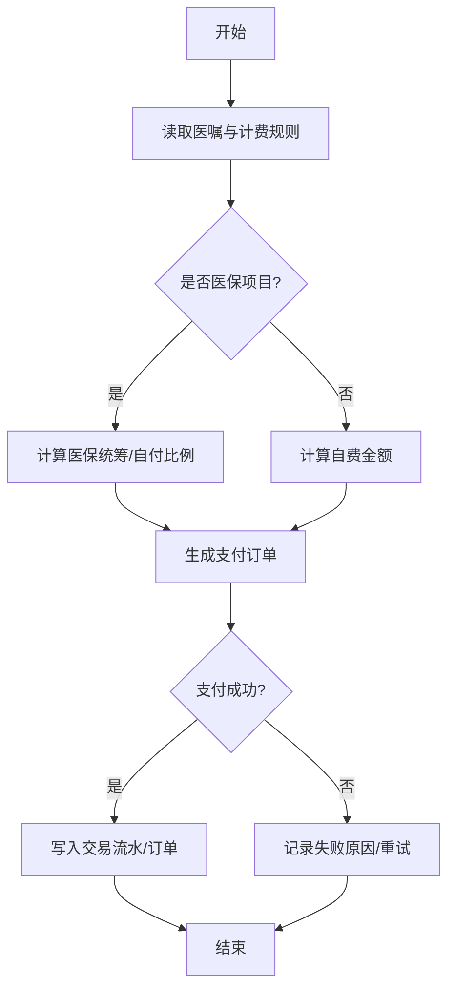
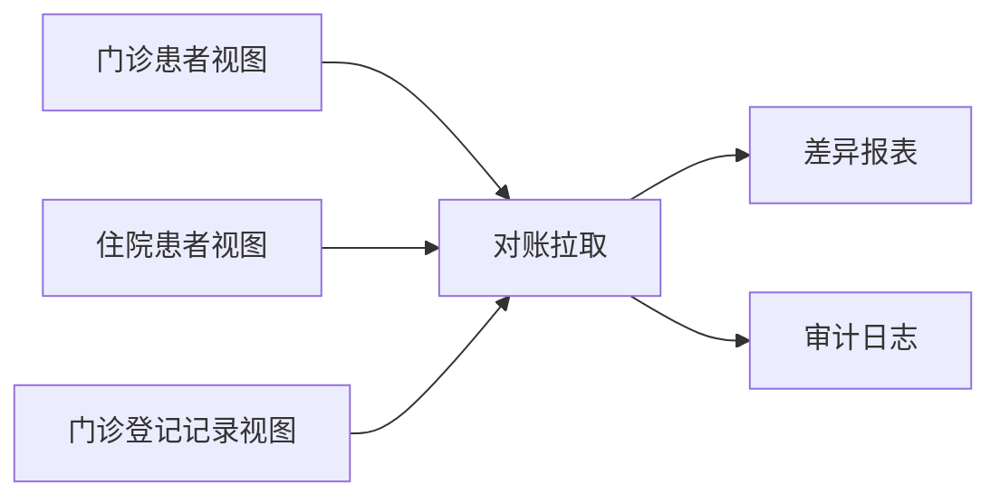
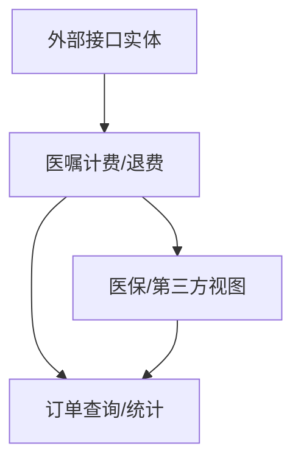

# 支付集成

<cite>
**本文引用的文件**
- [PatientPay.cls](file://src/backend/public-mc/DHCExternalService/RegInterface/Entity/PatientPay.cls)
- [PatientPayDetail.cls](file://src/backend/public-mc/DHCExternalService/RegInterface/Entity/PatientPayDetail.cls)
- [PaymentOrderRp.cls](file://src/backend/public-mc/DHCExternalService/RegInterface/Entity/PaymentOrderRp.cls)
- [PaymentOrderRt.cls](file://src/backend/public-mc/DHCExternalService/RegInterface/Entity/PaymentOrderRt.cls)
- [AliPayRecord.cls](file://src/backend/public-mc/DHCExternalService/CardInterface/Entity/AliPayRecord.cls)
- [ChangeRegFeeToInsu.cls](file://src/backend/public-mc/DHCExternalService/RegInterface/Service/SelfRegService/ChangeRegFeeToInsu.cls)
- [Apply.cls](file://src/backend/cure-ws/DHCDoc/DHCDocCure/Apply.cls)
- [LCYXInterface.cls](file://src/backend/doc-ws/MKLCYX/LCYXInterface.cls)
- [DHCDocQryOEOrder.cls](file://src/backend/doc-ws/web/DHCDocQryOEOrder.cls)
</cite>

## 目录
1. [简介](#简介)
2. [项目结构](#项目结构)
3. [核心组件](#核心组件)
4. [架构总览](#架构总览)
5. [详细组件分析](#详细组件分析)
6. [依赖关系分析](#依赖关系分析)
7. [性能考虑](#性能考虑)
8. [故障排查指南](#故障排查指南)
9. [结论](#结论)
10. [附录](#附录)

## 简介
本文件面向与HIS系统的支付业务集成，覆盖费用计算、支付处理、结算对账等核心能力，支持医保支付、自费支付、混合支付等多种支付方式。文档基于仓库中对外服务接口实体与服务描述类，梳理了患者挂号费转医保、支付订单请求/响应、第三方支付记录等关键数据模型，并结合医嘱计费与退费逻辑，给出端到端调用流程、安全机制、交易流水管理与对账处理的实践建议。

## 项目结构
支付相关代码主要分布在以下模块：
- 外部服务接口实体（XML/JSON适配）：用于定义与第三方系统交互的数据结构
- 自助服务接口服务描述：用于暴露SOAP/REST风格的接口契约
- 医嘱与计费：医嘱执行、计费、退费、医保标识等
- 医保/第三方对接：医保信息视图、第三方支付记录

图表来源
- [PatientPay.cls:1-11](file://src/backend/public-mc/DHCExternalService/RegInterface/Entity/PatientPay.cls#L1-L11)
- [PatientPayDetail.cls:1-27](file://src/backend/public-mc/DHCExternalService/RegInterface/Entity/PatientPayDetail.cls#L1-L27)
- [PaymentOrderRp.cls:1-25](file://src/backend/public-mc/DHCExternalService/RegInterface/Entity/PaymentOrderRp.cls#L1-L25)
- [PaymentOrderRt.cls:1-51](file://src/backend/public-mc/DHCExternalService/RegInterface/Entity/PaymentOrderRt.cls#L1-L51)
- [AliPayRecord.cls:1-37](file://src/backend/public-mc/DHCExternalService/CardInterface/Entity/AliPayRecord.cls#L1-L37)
- [ChangeRegFeeToInsu.cls:1-33](file://src/backend/public-mc/DHCExternalService/RegInterface/Service/SelfRegService/ChangeRegFeeToInsu.cls#L1-L33)
- [Apply.cls:1149-1161](file://src/backend/cure-ws/DHCDoc/DHCDocCure/Apply.cls#L1149-L1161)
- [LCYXInterface.cls:1530-1565](file://src/backend/doc-ws/MKLCYX/LCYXInterface.cls#L1530-L1565)
- [DHCDocQryOEOrder.cls:1331-1334](file://src/backend/doc-ws/web/DHCDocQryOEOrder.cls#L1331-L1334)

章节来源
- [PatientPay.cls:1-11](file://src/backend/public-mc/DHCExternalService/RegInterface/Entity/PatientPay.cls#L1-L11)
- [PatientPayDetail.cls:1-27](file://src/backend/public-mc/DHCExternalService/RegInterface/Entity/PatientPayDetail.cls#L1-L27)
- [PaymentOrderRp.cls:1-25](file://src/backend/public-mc/DHCExternalService/RegInterface/Entity/PaymentOrderRp.cls#L1-L25)
- [PaymentOrderRt.cls:1-51](file://src/backend/public-mc/DHCExternalService/RegInterface/Entity/PaymentOrderRt.cls#L1-L51)
- [AliPayRecord.cls:1-37](file://src/backend/public-mc/DHCExternalService/CardInterface/Entity/AliPayRecord.cls#L1-L37)
- [ChangeRegFeeToInsu.cls:1-33](file://src/backend/public-mc/DHCExternalService/RegInterface/Service/SelfRegService/ChangeRegFeeToInsu.cls#L1-L33)
- [Apply.cls:1149-1161](file://src/backend/cure-ws/DHCDoc/DHCDocCure/Apply.cls#L1149-L1161)
- [LCYXInterface.cls:1530-1565](file://src/backend/doc-ws/MKLCYX/LCYXInterface.cls#L1530-L1565)
- [DHCDocQryOEOrder.cls:1331-1334](file://src/backend/doc-ws/web/DHCDocQryOEOrder.cls#L1331-L1334)

## 核心组件
- 患者支付事件模型：用于承载一次支付事件的主体与明细，包含事件编号、类型及明细列表
- 支付订单请求/响应：封装支付订单的返回结果、交易号、金额、医保统筹范围、订单内容等
- 第三方支付记录：用于记录第三方支付渠道的患者信息与关联字段
- 自助服务接口：提供“挂号费转医保”等服务描述，便于外部系统调用
- 医嘱计费与退费：在医嘱执行过程中完成计费、医保标识、退费数量累计等
- 医保/第三方视图：提供患者、就诊、登记记录的查询视图，支撑对账与追溯

章节来源
- [PatientPay.cls:1-11](file://src/backend/public-mc/DHCExternalService/RegInterface/Entity/PatientPay.cls#L1-L11)
- [PatientPayDetail.cls:1-27](file://src/backend/public-mc/DHCExternalService/RegInterface/Entity/PatientPayDetail.cls#L1-L27)
- [PaymentOrderRp.cls:1-25](file://src/backend/public-mc/DHCExternalService/RegInterface/Entity/PaymentOrderRp.cls#L1-L25)
- [PaymentOrderRt.cls:1-51](file://src/backend/public-mc/DHCExternalService/RegInterface/Entity/PaymentOrderRt.cls#L1-L51)
- [AliPayRecord.cls:1-37](file://src/backend/public-mc/DHCExternalService/CardInterface/Entity/AliPayRecord.cls#L1-L37)
- [ChangeRegFeeToInsu.cls:1-33](file://src/backend/public-mc/DHCExternalService/RegInterface/Service/SelfRegService/ChangeRegFeeToInsu.cls#L1-L33)
- [Apply.cls:1149-1161](file://src/backend/cure-ws/DHCDoc/DHCDocCure/Apply.cls#L1149-L1161)
- [LCYXInterface.cls:1530-1565](file://src/backend/doc-ws/MKLCYX/LCYXInterface.cls#L1530-L1565)

## 架构总览
支付集成的整体流程包括：
- 费用计算：依据医嘱与计费规则生成账单，识别医保/自费属性
- 支付申请：通过外部服务接口提交支付订单，获取交易号与支付状态
- 支付处理：根据支付渠道（医保、自费、混合）完成扣款与记账
- 结算对账：基于视图与订单查询进行日终对账，核对应收实收差异
- 退款处理：针对已收费但需退费的场景，累计退费数量并更新账单

图表来源
- [ChangeRegFeeToInsu.cls:1-33](file://src/backend/public-mc/DHCExternalService/RegInterface/Service/SelfRegService/ChangeRegFeeToInsu.cls#L1-L33)
- [Apply.cls:1149-1161](file://src/backend/cure-ws/DHCDoc/DHCDocCure/Apply.cls#L1149-L1161)
- [LCYXInterface.cls:1530-1565](file://src/backend/doc-ws/MKLCYX/LCYXInterface.cls#L1530-L1565)
- [DHCDocQryOEOrder.cls:1331-1334](file://src/backend/doc-ws/web/DHCDocQryOEOrder.cls#L1331-L1334)

## 详细组件分析

### 患者支付事件模型
- 作用：承载一次支付事件及其明细，便于统一接入不同支付渠道
- 关键字段：事件编号、事件类型、事件明细（含患者、医生、科室、门诊序号、时间、医院ID等）
- 使用场景：挂号费转医保、门诊缴费、住院预交金等

图表来源
- [PatientPay.cls:1-11](file://src/backend/public-mc/DHCExternalService/RegInterface/Entity/PatientPay.cls#L1-L11)
- [PatientPayDetail.cls:1-27](file://src/backend/public-mc/DHCExternalService/RegInterface/Entity/PatientPayDetail.cls#L1-L27)

章节来源
- [PatientPay.cls:1-11](file://src/backend/public-mc/DHCExternalService/RegInterface/Entity/PatientPay.cls#L1-L11)
- [PatientPayDetail.cls:1-27](file://src/backend/public-mc/DHCExternalService/RegInterface/Entity/PatientPayDetail.cls#L1-L27)

### 支付订单请求/响应
- 请求响应体：包含结果码、结果内容、统筹范围、挂号费、订单内容、交易号等
- 响应体：包含用户ID、交易码、客户端类型、医院ID、扩展机构编码、扩展用户ID、交易号、订单号、支付银行编码、支付卡号、支付方式编码、支付金额、医保支付金额、第三方支付流水号、HIS预约ID、序列号、统筹范围、订单类型编码、银行编码、支付编码、支付金额等
- 使用场景：支付申请、支付回调、对账拉取

图表来源
- [PaymentOrderRp.cls:1-25](file://src/backend/public-mc/DHCExternalService/RegInterface/Entity/PaymentOrderRp.cls#L1-L25)
- [PaymentOrderRt.cls:1-51](file://src/backend/public-mc/DHCExternalService/RegInterface/Entity/PaymentOrderRt.cls#L1-L51)

章节来源
- [PaymentOrderRp.cls:1-25](file://src/backend/public-mc/DHCExternalService/RegInterface/Entity/PaymentOrderRp.cls#L1-L25)
- [PaymentOrderRt.cls:1-51](file://src/backend/public-mc/DHCExternalService/RegInterface/Entity/PaymentOrderRt.cls#L1-L51)

### 第三方支付记录
- 作用：记录第三方支付渠道的患者基本信息与医保卡号，便于后续对账与追溯
- 关键字段：患者ID、姓名、性别、出生日期、证件类型、证件号、联系方式、医保卡号

图表来源
- [AliPayRecord.cls:1-37](file://src/backend/public-mc/DHCExternalService/CardInterface/Entity/AliPayRecord.cls#L1-L37)

章节来源
- [AliPayRecord.cls:1-37](file://src/backend/public-mc/DHCExternalService/CardInterface/Entity/AliPayRecord.cls#L1-L37)

### 自助服务接口（挂号费转医保）
- 作用：提供“挂号费转医保”的服务描述，便于外部系统以标准协议调用
- 关键点：SOAP绑定风格、命名空间、结果流输出

图表来源
- [ChangeRegFeeToInsu.cls:1-33](file://src/backend/public-mc/DHCExternalService/RegInterface/Service/SelfRegService/ChangeRegFeeToInsu.cls#L1-L33)

章节来源
- [ChangeRegFeeToInsu.cls:1-33](file://src/backend/public-mc/DHCExternalService/RegInterface/Service/SelfRegService/ChangeRegFeeToInsu.cls#L1-L33)

### 医嘱计费与退费（费用计算与支付处理）
- 费用计算：在医嘱执行过程中，依据计费规则生成账单，识别医保类别、自付比例等
- 支付处理：结合支付订单响应，将支付金额与医保支付金额写入订单，并生成交易流水
- 退费处理：累计退费数量并与已计费数量合并，确保账单一致性

图表来源
- [Apply.cls:1149-1161](file://src/backend/cure-ws/DHCDoc/DHCDocCure/Apply.cls#L1149-L1161)
- [DHCDocQryOEOrder.cls:1331-1334](file://src/backend/doc-ws/web/DHCDocQryOEOrder.cls#L1331-L1334)

章节来源
- [Apply.cls:1149-1161](file://src/backend/cure-ws/DHCDoc/DHCDocCure/Apply.cls#L1149-L1161)
- [DHCDocQryOEOrder.cls:1331-1334](file://src/backend/doc-ws/web/DHCDocQryOEOrder.cls#L1331-L1334)

### 医保/第三方视图（对账与追溯）
- 作用：提供患者、就诊、登记记录的视图，支撑日终对账、差异分析与审计
- 关键字段：医保类型、保险号、就诊次数、挂号原始价格、已支付价格、支付方式等

图表来源
- [LCYXInterface.cls:1530-1565](file://src/backend/doc-ws/MKLCYX/LCYXInterface.cls#L1530-L1565)
- [LCYXInterface.cls:2952-3177](file://src/backend/doc-ws/MKLCYX/LCYXInterface.cls#L2952-L3177)
- [LCYXInterface.cls:4437-4581](file://src/backend/doc-ws/MKLCYX/LCYXInterface.cls#L4437-L4581)
- [LCYXInterface.cls:5308-5373](file://src/backend/doc-ws/MKLCYX/LCYXInterface.cls#L5308-L5373)

章节来源
- [LCYXInterface.cls:1530-1565](file://src/backend/doc-ws/MKLCYX/LCYXInterface.cls#L1530-L1565)
- [LCYXInterface.cls:2952-3177](file://src/backend/doc-ws/MKLCYX/LCYXInterface.cls#L2952-L3177)
- [LCYXInterface.cls:4437-4581](file://src/backend/doc-ws/MKLCYX/LCYXInterface.cls#L4437-L4581)
- [LCYXInterface.cls:5308-5373](file://src/backend/doc-ws/MKLCYX/LCYXInterface.cls#L5308-L5373)

## 依赖关系分析
- 外部服务接口实体依赖HIS内部业务：支付事件与订单模型驱动医嘱计费与退费
- 医嘱计费依赖医保/第三方视图：读取患者医保信息与就诊记录，支撑费用分摊与对账
- 订单查询依赖计费结果：汇总已计费与退费数量，形成对账基础数据

图表来源
- [PatientPay.cls:1-11](file://src/backend/public-mc/DHCExternalService/RegInterface/Entity/PatientPay.cls#L1-L11)
- [PaymentOrderRp.cls:1-25](file://src/backend/public-mc/DHCExternalService/RegInterface/Entity/PaymentOrderRp.cls#L1-L25)
- [Apply.cls:1149-1161](file://src/backend/cure-ws/DHCDoc/DHCDocCure/Apply.cls#L1149-L1161)
- [LCYXInterface.cls:1530-1565](file://src/backend/doc-ws/MKLCYX/LCYXInterface.cls#L1530-L1565)
- [DHCDocQryOEOrder.cls:1331-1334](file://src/backend/doc-ws/web/DHCDocQryOEOrder.cls#L1331-L1334)

章节来源
- [PatientPay.cls:1-11](file://src/backend/public-mc/DHCExternalService/RegInterface/Entity/PatientPay.cls#L1-L11)
- [PaymentOrderRp.cls:1-25](file://src/backend/public-mc/DHCExternalService/RegInterface/Entity/PaymentOrderRp.cls#L1-L25)
- [Apply.cls:1149-1161](file://src/backend/cure-ws/DHCDoc/DHCDocCure/Apply.cls#L1149-L1161)
- [LCYXInterface.cls:1530-1565](file://src/backend/doc-ws/MKLCYX/LCYXInterface.cls#L1530-L1565)
- [DHCDocQryOEOrder.cls:1331-1334](file://src/backend/doc-ws/web/DHCDocQryOEOrder.cls#L1331-L1334)

## 性能考虑
- 批量对账：利用视图批量拉取患者与登记记录，减少多次往返
- 缓存策略：对常用字典与配置（如医保类别、支付方式）进行本地缓存
- 异步处理：支付回调与通知采用异步队列，避免阻塞主流程
- 幂等设计：基于交易号与订单号实现幂等，防止重复入账

[本节为通用指导，不直接分析具体文件]

## 故障排查指南
- 支付失败：检查支付订单响应中的结果码与结果内容，定位失败原因并重试
- 金额不一致：对比订单查询中的已计费数量与退费数量，核对医保统筹范围与自付比例
- 对账差异：基于视图拉取当日交易，比对应收与实收，生成差异报表
- 第三方异常：记录第三方支付流水号与银行编码，配合渠道方排查

章节来源
- [PaymentOrderRp.cls:1-25](file://src/backend/public-mc/DHCExternalService/RegInterface/Entity/PaymentOrderRp.cls#L1-L25)
- [PaymentOrderRt.cls:1-51](file://src/backend/public-mc/DHCExternalService/RegInterface/Entity/PaymentOrderRt.cls#L1-L51)
- [DHCDocQryOEOrder.cls:1331-1334](file://src/backend/doc-ws/web/DHCDocQryOEOrder.cls#L1331-L1334)
- [LCYXInterface.cls:4437-4581](file://src/backend/doc-ws/MKLCYX/LCYXInterface.cls#L4437-L4581)

## 结论
本支付集成方案以标准化接口实体与服务描述为基础，结合医嘱计费与退费逻辑、医保/第三方视图与订单查询，形成了完整的费用计算、支付处理、结算对账闭环。通过明确的交易流水管理、幂等设计与对账机制，保障资金安全与数据一致性。建议在实施中强化异常处理与监控告警，确保高可用与可追溯。

[本节为总结性内容，不直接分析具体文件]

## 附录
- 接口调用示例（概念性说明）
  - 费用查询：通过订单查询接口获取患者未收费医嘱与已计费金额
  - 支付申请：提交支付订单请求，包含患者信息、金额、支付方式、医院ID等
  - 退款处理：提交退款申请，携带原交易号与退款金额，系统累计退费数量并更新账单
- 安全机制
  - 传输加密：HTTPS/TLS
  - 身份认证：Token/签名校验
  - 数据完整性：数字签名或哈希校验
- 交易流水管理
  - 唯一交易号：贯穿申请、处理、回调全流程
  - 状态机：待支付、支付中、已支付、已退款、失败
- 对账处理
  - 日终对账：拉取视图数据，生成应收/实收差异报表
  - 差异处理：人工复核与自动调账

[本节为补充说明，不直接分析具体文件]