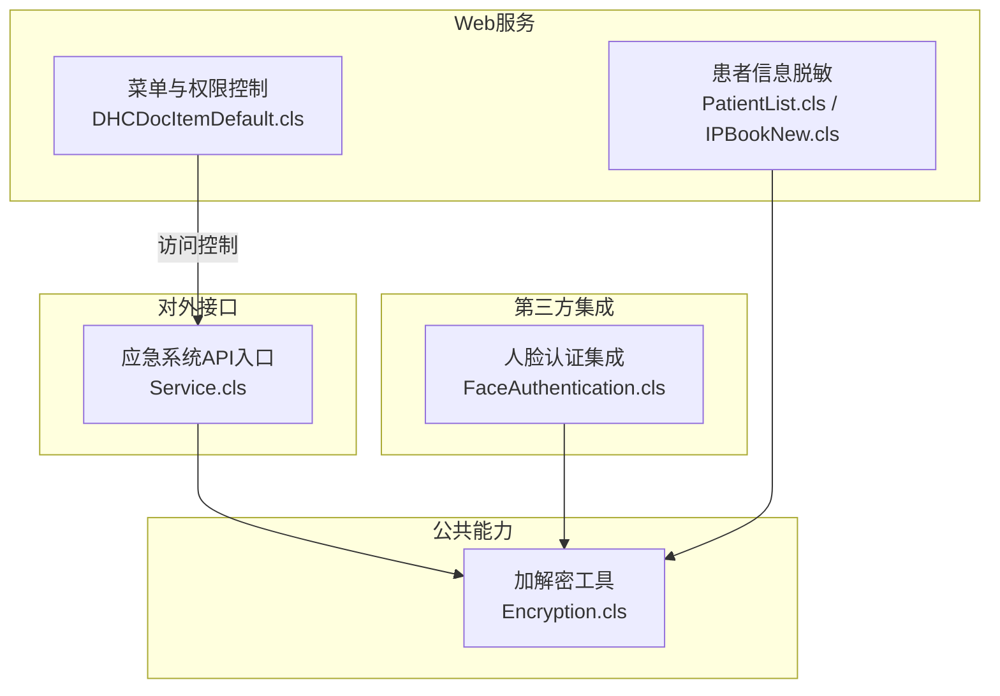
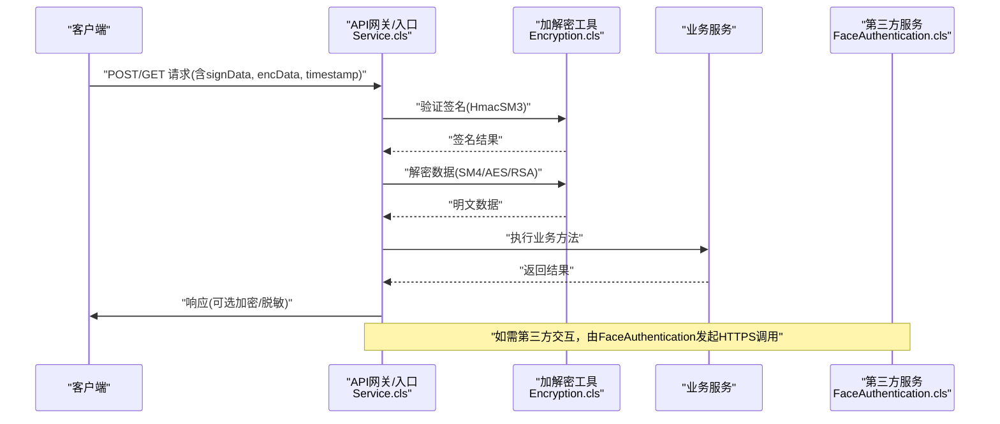
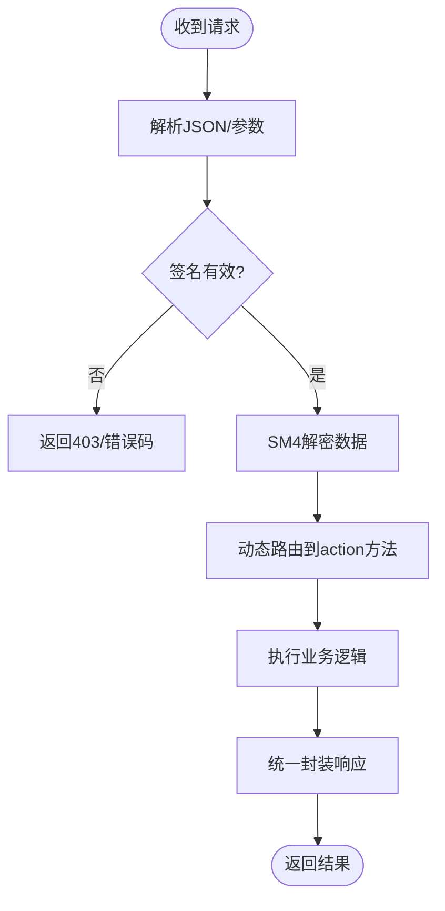
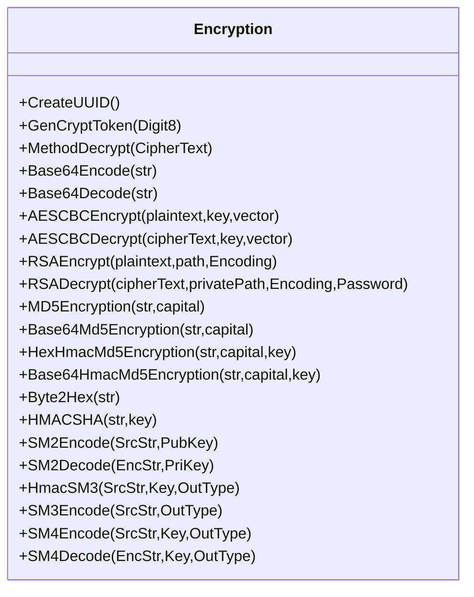
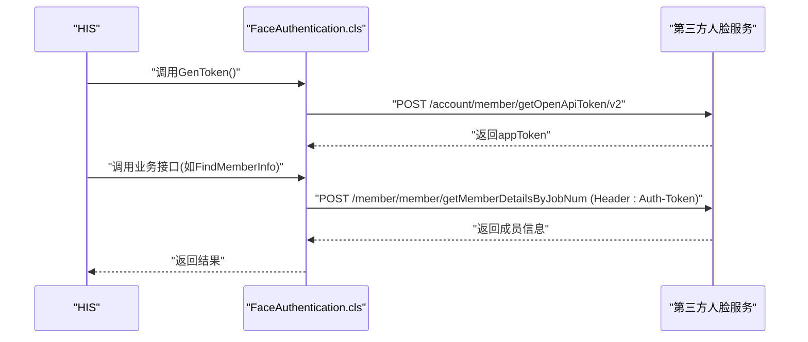
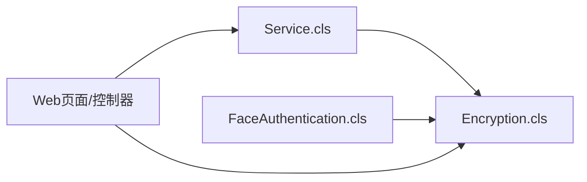

# 网络安全防护

<cite>
**本文引用的文件**
- [Encryption.cls](file://src/backend/public-mc/DHCDoc/Util/Encryption.cls)
- [Service.cls](file://src/backend/conting-ws/DHCDoc/Interface/StandAlone/API/Service.cls)
- [FaceAuthentication.cls](file://src/backend/public-mc/DHCDoc/GetInfo/Service/FaceAuthentication.cls)
- [PatientList.cls](file://src/backend/doc-ws/DHCDoc/OPDoc/PatientList.cls)
- [DHCDocIPBookNew.cls](file://src/backend/doc-ws/web/DHCDocIPBookNew.cls)
- [DHCDocItemDefault.cls](file://src/backend/doc-ws/web/DHCDocItemDefault.cls)
</cite>

## 目录
1. [简介](#简介)
2. [项目结构](#项目结构)
3. [核心组件](#核心组件)
4. [架构总览](#架构总览)
5. [详细组件分析](#详细组件分析)
6. [依赖关系分析](#依赖关系分析)
7. [性能与安全考量](#性能与安全考量)
8. [故障排查指南](#故障排查指南)
9. [结论](#结论)
10. [附录：配置与最佳实践清单](#附录配置与最佳实践清单)

## 简介
本文件面向IRIS HIS系统的网络安全防护，聚焦网络通信加密、API接口安全、Web服务安全、文件传输安全、身份认证与访问控制等关键能力。文档基于仓库中实际代码实现进行梳理，给出可落地的防护策略与配置建议，帮助运维与开发团队在部署与运行阶段落实安全基线。

## 项目结构
本项目后端采用多模块（WS）组织，安全相关能力主要分布在以下位置：
- 通用加解密工具：public-mc/DHCDoc/Util/Encryption.cls
- 外部对接与API网关入口：conting-ws/DHCDoc/Interface/StandAlone/API/Service.cls
- 第三方人脸认证集成：public-mc/DHCDoc/GetInfo/Service/FaceAuthentication.cls
- Web端数据脱敏与菜单权限：doc-ws/web/DHCDocItemDefault.cls；doc-ws/DHCDoc/OPDoc/PatientList.cls；doc-ws/web/DHCDocIPBookNew.cls

图表来源
- [Encryption.cls:1-270](file://src/backend/public-mc/DHCDoc/Util/Encryption.cls#L1-L270)
- [Service.cls:1-158](file://src/backend/conting-ws/DHCDoc/Interface/StandAlone/API/Service.cls#L1-L158)
- [FaceAuthentication.cls:1-403](file://src/backend/public-mc/DHCDoc/GetInfo/Service/FaceAuthentication.cls#L1-L403)
- [PatientList.cls:120-123](file://src/backend/doc-ws/DHCDoc/OPDoc/PatientList.cls#L120-L123)
- [DHCDocItemDefault.cls:1239-1242](file://src/backend/doc-ws/web/DHCDocItemDefault.cls#L1239-L1242)

章节来源
- [Encryption.cls:1-270](file://src/backend/public-mc/DHCDoc/Util/Encryption.cls#L1-L270)
- [Service.cls:1-158](file://src/backend/conting-ws/DHCDoc/Interface/StandAlone/API/Service.cls#L1-L158)
- [FaceAuthentication.cls:1-403](file://src/backend/public-mc/DHCDoc/GetInfo/Service/FaceAuthentication.cls#L1-L403)
- [PatientList.cls:120-123](file://src/backend/doc-ws/DHCDoc/OPDoc/PatientList.cls#L120-L123)
- [DHCDocItemDefault.cls:1239-1242](file://src/backend/doc-ws/web/DHCDocItemDefault.cls#L1239-L1242)

## 核心组件
- 加解密工具类：提供Base64、AES-CBC、RSA、MD5/HMAC-MD5、HMAC-SHA256、SM2/SM3/SM4等算法封装，统一编码转换与输出格式，便于各模块复用。
- 应急系统API服务：对请求进行签名与加密，使用SM3签名、SM4加密，并携带时间戳与应用标识，保障接口完整性与机密性。
- 人脸认证集成：通过HTTP POST调用第三方人脸服务，使用AppToken鉴权，支持回调注册与查询。
- Web端安全：菜单级权限位控制；敏感字段（如卡号/安全号）在返回前进行解密或脱敏处理。

章节来源
- [Encryption.cls:1-270](file://src/backend/public-mc/DHCDoc/Util/Encryption.cls#L1-L270)
- [Service.cls:114-133](file://src/backend/conting-ws/DHCDoc/Interface/StandAlone/API/Service.cls#L114-L133)
- [FaceAuthentication.cls:22-40](file://src/backend/public-mc/DHCDoc/GetInfo/Service/FaceAuthentication.cls#L22-L40)
- [PatientList.cls:120-123](file://src/backend/doc-ws/DHCDoc/OPDoc/PatientList.cls#L120-L123)
- [DHCDocItemDefault.cls:1239-1242](file://src/backend/doc-ws/web/DHCDocItemDefault.cls#L1239-L1242)

## 架构总览
下图展示从客户端到HIS后端的典型安全链路：前端发起HTTPS请求，进入API网关层进行签名校验与参数解密，随后调用业务逻辑；涉及第三方服务时，通过统一HTTP客户端发送带鉴权的请求；敏感数据在返回前进行脱敏或加密。

图表来源
- [Service.cls:114-133](file://src/backend/conting-ws/DHCDoc/Interface/StandAlone/API/Service.cls#L114-L133)
- [Encryption.cls:61-83](file://src/backend/public-mc/DHCDoc/Util/Encryption.cls#L61-L83)
- [FaceAuthentication.cls:348-385](file://src/backend/public-mc/DHCDoc/GetInfo/Service/FaceAuthentication.cls#L348-L385)

## 详细组件分析

### 组件A：API接口安全（应急系统对接）
- 请求构造：生成时间戳、应用ID，拼接原文与密钥计算HmacSM3签名，使用SM4对数据进行加密，形成GET/POST两种形式的请求体或查询参数。
- 接收处理：解析入参，校验签名与时效，解密数据后动态路由至具体业务方法执行，统一封装返回码与消息。
- 安全要点：
  - 使用国密SM3做签名防篡改，SM4做数据机密性保护。
  - 引入时间戳与版本参数，配合服务端限流与重放检测。
  - 错误路径统一捕获异常并返回标准化响应。

图表来源
- [Service.cls:9-36](file://src/backend/conting-ws/DHCDoc/Interface/StandAlone/API/Service.cls#L9-L36)
- [Service.cls:114-133](file://src/backend/conting-ws/DHCDoc/Interface/StandAlone/API/Service.cls#L114-L133)

章节来源
- [Service.cls:9-36](file://src/backend/conting-ws/DHCDoc/Interface/StandAlone/API/Service.cls#L9-L36)
- [Service.cls:114-133](file://src/backend/conting-ws/DHCDoc/Interface/StandAlone/API/Service.cls#L114-L133)

### 组件B：加解密工具（统一密码学能力）
- 能力覆盖：Base64编解码、AES-CBC加解密、RSA证书加解密、MD5/HMAC-MD5、HMAC-SHA256、SM2/SM3/SM4。
- 设计要点：
  - 统一UTF-8编码转换，避免跨平台乱码。
  - 对SM系列算法委托至基础平台web.Util.Encryption，便于集中维护。
  - 提供Hex/Base64输出选项，适配不同对接方规范。

图表来源
- [Encryption.cls:8-267](file://src/backend/public-mc/DHCDoc/Util/Encryption.cls#L8-L267)

章节来源
- [Encryption.cls:8-267](file://src/backend/public-mc/DHCDoc/Util/Encryption.cls#L8-L267)

### 组件C：第三方人脸认证集成
- 认证流程：先获取AppToken（携带机构码与AppKey），后续所有接口在Header中注入Auth-Token。
- 功能点：成员信息查询、识别记录拉取、回调服务注册/删除/查询、拍照录脸通知、特征结果查询、成员新增/修改/删除。
- 安全要点：
  - 使用HTTPS与超时控制，避免阻塞。
  - 敏感参数（如设备序列号、工号）最小化暴露。
  - 统一错误处理，返回结构化code/message。

图表来源
- [FaceAuthentication.cls:22-40](file://src/backend/public-mc/DHCDoc/GetInfo/Service/FaceAuthentication.cls#L22-L40)
- [FaceAuthentication.cls:42-63](file://src/backend/public-mc/DHCDoc/GetInfo/Service/FaceAuthentication.cls#L42-L63)
- [FaceAuthentication.cls:348-385](file://src/backend/public-mc/DHCDoc/GetInfo/Service/FaceAuthentication.cls#L348-L385)

章节来源
- [FaceAuthentication.cls:22-40](file://src/backend/public-mc/DHCDoc/GetInfo/Service/FaceAuthentication.cls#L22-L40)
- [FaceAuthentication.cls:42-63](file://src/backend/public-mc/DHCDoc/GetInfo/Service/FaceAuthentication.cls#L42-L63)
- [FaceAuthentication.cls:348-385](file://src/backend/public-mc/DHCDoc/GetInfo/Service/FaceAuthentication.cls#L348-L385)

### 组件D：Web服务安全（菜单权限与敏感数据脱敏）
- 菜单权限：通过位图控制菜单项可见性，结合用户组与角色进行细粒度授权。
- 敏感数据：在列表返回前对敏感字段（如SecurityNo）进行解密或脱敏，避免明文泄露。
- 建议：
  - 对所有返回的敏感字段实施统一的脱敏策略。
  - 将权限判断下沉为中间件或拦截器，确保一致性。

章节来源
- [DHCDocItemDefault.cls:1239-1242](file://src/backend/doc-ws/web/DHCDocItemDefault.cls#L1239-L1242)
- [PatientList.cls:120-123](file://src/backend/doc-ws/DHCDoc/OPDoc/PatientList.cls#L120-L123)
- [DHCDocIPBookNew.cls:149](file://src/backend/doc-ws/web/DHCDocIPBookNew.cls#L149)

## 依赖关系分析
- Service.cls依赖Encryption.cls完成签名与加解密。
- FaceAuthentication.cls依赖HTTP客户端与Encryption能力（间接通过web.Util.Encryption）。
- Web端页面依赖权限控制与加解密工具进行数据展示与操作。

图表来源
- [Service.cls:114-133](file://src/backend/conting-ws/DHCDoc/Interface/StandAlone/API/Service.cls#L114-L133)
- [Encryption.cls:214-267](file://src/backend/public-mc/DHCDoc/Util/Encryption.cls#L214-L267)
- [FaceAuthentication.cls:348-385](file://src/backend/public-mc/DHCDoc/GetInfo/Service/FaceAuthentication.cls#L348-L385)

章节来源
- [Service.cls:114-133](file://src/backend/conting-ws/DHCDoc/Interface/StandAlone/API/Service.cls#L114-L133)
- [Encryption.cls:214-267](file://src/backend/public-mc/DHCDoc/Util/Encryption.cls#L214-L267)
- [FaceAuthentication.cls:348-385](file://src/backend/public-mc/DHCDoc/GetInfo/Service/FaceAuthentication.cls#L348-L385)

## 性能与安全考量
- 加解密开销：SM4/AES/CBC与RSA均存在CPU开销，建议在网关层集中处理，减少业务层重复计算。
- 连接池与超时：第三方调用需设置合理超时与重试策略，避免雪崩。
- 日志与审计：对敏感操作（登录、授权、数据导出）进行审计日志记录，包含时间、用户、IP、操作类型与结果。
- 密钥管理：密钥与证书应集中存储于安全介质，禁止硬编码；定期轮换。
- 输入校验：对所有入参进行白名单校验与长度限制，防止注入与溢出。
- DDoS与恶意请求：
  - 在网关层启用速率限制、IP黑白名单、User-Agent过滤。
  - 对高频接口实施验证码或二次确认。
  - 结合WAF规则屏蔽常见攻击载荷（SQL注入、XSS、命令注入）。
- 文件传输安全：
  - 仅允许HTTPS上传下载，限制文件大小与类型。
  - 对上传文件进行病毒扫描与内容校验（哈希比对）。
  - 存储路径隔离与访问控制，禁止直接目录遍历。

[本节为通用指导，不直接分析具体文件]

## 故障排查指南
- 签名失败：检查时间戳是否过期、AppSecret是否正确、排序与拼接顺序是否与约定一致。
- 解密失败：确认密钥与偏移量（CBC模式）一致，字符集是否为UTF-8。
- 第三方调用失败：核对IP/Port/Timeout，查看返回码与message，必要时抓包定位。
- 权限问题：检查用户组与菜单位图配置，确认权限位是否开启。
- 敏感数据泄露：核查返回字段是否在脱敏流程中被遗漏。

章节来源
- [Service.cls:9-36](file://src/backend/conting-ws/DHCDoc/Interface/StandAlone/API/Service.cls#L9-L36)
- [Encryption.cls:61-83](file://src/backend/public-mc/DHCDoc/Util/Encryption.cls#L61-L83)
- [FaceAuthentication.cls:348-385](file://src/backend/public-mc/DHCDoc/GetInfo/Service/FaceAuthentication.cls#L348-L385)
- [DHCDocItemDefault.cls:1239-1242](file://src/backend/doc-ws/web/DHCDocItemDefault.cls#L1239-L1242)

## 结论
IRIS HIS在本仓库中已具备较完善的安全基础：统一的加解密工具、API接口的签名与加密、第三方服务的鉴权与回调机制、以及Web端的权限与敏感数据处理。建议在此基础上进一步落地网关级防护（WAF、DDoS防护、IP白名单）、强化密钥管理与审计追踪，持续完善安全基线与应急响应流程。

[本节为总结性内容，不直接分析具体文件]

## 附录：配置与最佳实践清单
- 网络通信加密
  - 全站启用HTTPS，强制TLS 1.2及以上。
  - 对外接口使用SM3签名+SM4加密，时间戳与版本参数防重放。
- 防火墙与访问控制
  - 仅开放必要端口，限制源IP段。
  - 配置反向代理与WAF规则，阻断常见攻击。
- 入侵检测与审计
  - 启用IDS/IPS，监控异常流量与攻击特征。
  - 记录关键操作审计日志，集中收集与分析。
- API与Web安全
  - 统一鉴权中间件，校验令牌与权限位。
  - 输入校验与输出编码，防止注入与XSS。
- 文件传输安全
  - 限制类型、大小与路径，上传前后进行扫描与校验。
- DDoS与恶意请求过滤
  - 速率限制、IP黑白名单、User-Agent与Referer校验。
  - 对高频接口实施验证码或人机校验。
- 密钥与证书管理
  - 使用KMS或硬件加密机管理密钥，定期轮换。
  - 证书到期告警与自动续期。

[本节为通用指导，不直接分析具体文件]