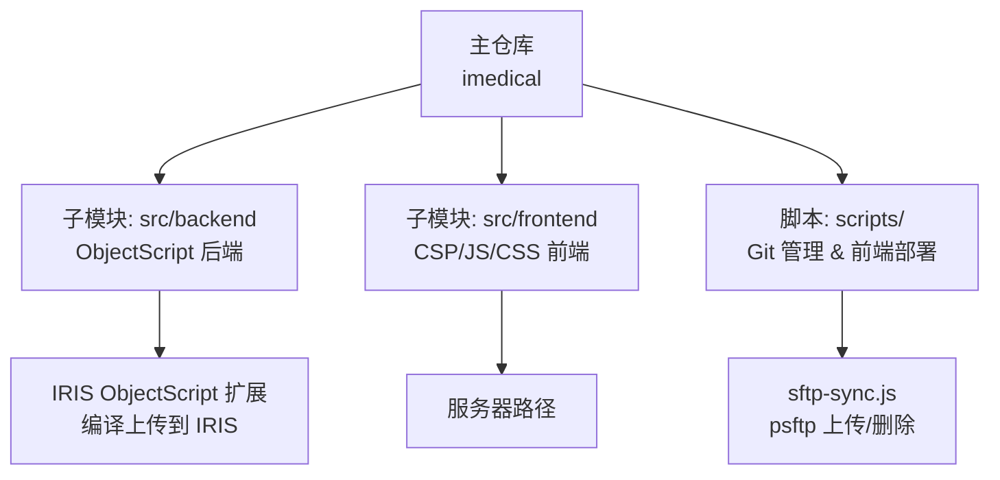

# 快速开始

<cite>
**本文引用的文件**
- [README.md](file://README.md)
- [.gitmodules](file://.gitmodules)
- [scripts/sftp-sync.js](file://scripts/sftp-sync.js)
- [scripts/package.json](file://scripts/package.json)
- [.gitignore](file://.gitignore)
- [CONTRIBUTING.md](file://CONTRIBUTING.md)
</cite>

## 目录
1. [简介](#简介)
2. [项目结构](#项目结构)
3. [环境要求](#环境要求)
4. [克隆与初始化](#克隆与初始化)
5. [Submodule 配置](#submodule-配置)
6. [VS Code 开发环境设置](#vs-code-开发环境设置)
7. [SFTP 连接配置](#sftp-连接配置)
8. [服务器连接信息](#服务器连接信息)
9. [安装验证](#安装验证)
10. [常见问题与排错](#常见问题与排错)
11. [Windows 与 Linux/Mac 差异操作](#windows-与-linuxmac-差异操作)
12. [结论](#结论)

## 简介
本指南面向首次参与 IRIS HIS 项目的开发者，目标是在最短时间内完成本地开发环境的搭建、子模块初始化、VS Code 与 SFTP 配置，并能够顺利上传前端资源、编译后端代码并进行日常开发。项目采用 InterSystems IRIS ObjectScript 作为后端语言，前端为传统 CSP + jQuery 技术栈；前后端代码通过 Git Submodule 管理，并通过脚本统一进行部署与同步。

## 项目结构
- src/backend：后端 ObjectScript 代码（单一 submodule），通过 IRIS ObjectScript 扩展直接编译上传至 IRIS 命名空间，不走 SFTP。
- src/frontend：前端 CSP/JS/CSS 资源（单一 submodule），通过 sftp-sync.js 调用 psftp 上传到服务器指定路径。
- scripts：Git 多仓库管理与前端部署辅助脚本（Node.js）。
- .vscode：VS Code 配置模板（settings.json.template、sftp.json.template），实际配置文件被忽略提交。

图表来源
- [README.md:5-35](file://README.md#L5-L35)
- [scripts/sftp-sync.js:1-25](file://scripts/sftp-sync.js#L1-L25)

章节来源
- [README.md:5-35](file://README.md#L5-L35)

## 环境要求
- Git：用于克隆主仓库与子模块管理。
- Node.js：运行 scripts 目录下的辅助脚本（如 sftp-sync.js）。
- PuTTY（含 psftp）：前端文件上传依赖 psftp 命令。
- VS Code：编辑器及插件生态（ObjectScript 扩展等）。
- InterSystems IRIS 客户端/扩展：用于后端 ObjectScript 的编译与上传。
- SSH/SFTP 访问权限：用于连接服务器并上传前端资源。

说明
- 前端资源通过 psftp 上传，因此需确保系统 PATH 中包含 psftp 可执行文件。
- 后端通过 IRIS ObjectScript 扩展直接编译上传，无需手动 SFTP。

章节来源
- [README.md:526-536](file://README.md#L526-L536)
- [scripts/sftp-sync.js:1-25](file://scripts/sftp-sync.js#L1-L25)

## 克隆与初始化
步骤
1. 克隆主仓库：
   - Windows PowerShell：
     - git clone https://gitee.com/wangqingyongyl/iris-imedical.git imedical
     - cd imedical
   - Linux/Mac：
     - git clone https://gitee.com/wangqingyongyl/iris-imedical.git imedical
     - cd imedical
2. 初始化并更新所有子模块：
   - git submodule update --init --recursive
3. （可选）配置 Git 忽略子模块差异，避免频繁提示：
   - git config diff.ignoreSubmodules all

注意
- 首次执行可能需要较长时间下载子模块内容。
- 若网络受限或内网访问，请确认能访问子模块远程地址。

章节来源
- [README.md:62-96](file://README.md#L62-L96)

## Submodule 配置
子模块定义位于根目录的 .gitmodules，包含两个子模块：
- src/backend：后端 ObjectScript 代码仓库
- src/frontend：前端 CSP/JS/CSS 资源仓库

建议
- 使用 git submodule status 检查子模块是否已正确初始化。
- 所有 Git 操作需在对应子模块目录内执行（src/backend 或 src/frontend）。

章节来源
- [README.md:53-60](file://README.md#L53-L60)
- [.gitmodules:1-7](file://.gitmodules#L1-L7)

## VS Code 开发环境设置
步骤
1. 复制模板文件生成实际配置：
   - Windows PowerShell：
     - Copy-Item ".vscode/settings.json.template" ".vscode/settings.json"
     - Copy-Item ".vscode/sftp.json.template" ".vscode/sftp.json"
   - Linux/Mac：
     - cp .vscode/settings.json.template .vscode/settings.json
     - cp .vscode/sftp.json.template .vscode/sftp.json
2. 安装并启用 InterSystems IRIS 的 ObjectScript 扩展（用于后端编译与上传）。
3. 在 settings.json 中配置 IRIS 服务器连接与导出设置（webServer.host、sshuser/sshpassword、instance、username/password、objectscript.conn.ns、objectscript.export.folder 等）。
4. 保存后重启 VS Code，使配置生效。

重要提示
- 不要提交实际配置文件（settings.json、sftp.json 已在 .gitignore 中）。
- 模板文件保留在仓库中供新成员使用。

章节来源
- [README.md:98-206](file://README.md#L98-L206)
- [.gitignore:6-7](file://.gitignore#L6-L7)

## SFTP 连接配置
用途
- 前端资源上传与删除通过 sftp-sync.js 调用 psftp 实现。
- 连接信息从 .vscode/sftp.json 读取，按产品目录自动匹配 remotePath。

步骤
1. 编辑 .vscode/sftp.json，为每个产品通道填写 host、port、username、password 以及 remotePath。
2. 根据本地路径自动映射规则：
   - 本地 src/frontend/<产品目录>/... → 远程 <remote-path>
3. 使用封装脚本上传：
   - node scripts/sftp-sync.js upload <文件或目录...>
4. 如需删除服务器文件：
   - node scripts/sftp-sync.js delete <文件...>
5. 仅查看映射关系（不执行）：
   - node scripts/sftp-sync.js check <文件或目录...>

注意事项
- 首次连接可能提示缓存主机密钥失败，脚本会自动尝试交互模式应答 y 缓存密钥后重试。
- 若仍失败，可手动执行一次：echo y | psftp -P <端口> <用户名>@<主机>
- .csp 文件上传后需调用 iris_doc_compile 编译才能生效；.js/.css 无需编译。

章节来源
- [README.md:114-145](file://README.md#L114-L145)
- [scripts/sftp-sync.js:1-25](file://scripts/sftp-sync.js#L1-L25)
- [scripts/sftp-sync.js:53-95](file://scripts/sftp-sync.js#L53-L95)
- [scripts/sftp-sync.js:118-164](file://scripts/sftp-sync.js#L118-L164)
- [scripts/sftp-sync.js:181-227](file://scripts/sftp-sync.js#L181-L227)
- [scripts/sftp-sync.js:229-258](file://scripts/sftp-sync.js#L229-L258)
- [scripts/sftp-sync.js:260-270](file://scripts/sftp-sync.js#L260-L270)

## 服务器连接信息
前端服务器路径
- 所有前端产品均上传至同一远程目录：<remote-path>
- 各产品在 .vscode/sftp.json 中通过 context 字段区分本地目录，remotePath 固定为上述远程目录。

IRIS 服务器连接（后端）
- webServer.host：IRIS 服务器的 IP 或域名
[REDACTED: environment-specific example]
- webServer.instance：IRIS 实例名称（通常为 irishealth 或 IRIS）
[REDACTED: environment-specific example]
- objectscript.conn.ns：默认命名空间（如 <namespace>）
- objectscript.export.folder：后端代码导出路径（默认为 src/backend）

章节来源
- [README.md:37-51](file://README.md#L37-L51)
- [README.md:151-206](file://README.md#L151-L206)

## 安装验证
验证步骤
1. 检查子模块状态：
   - git submodule status
   - 每个子模块目录应包含 .git 文件或文件夹，表示已成功初始化。
2. 验证 Node.js 与脚本依赖：
   - 进入 scripts 目录并安装依赖（如 iconv-lite）：
     - npm install
3. 测试 SFTP 脚本：
   - 使用 check 命令查看本地→远程映射是否正确：
     - node scripts/sftp-sync.js check src/frontend/doc-ws/csp/xxx.csp
4. 测试上传与编译：
   - 上传前端资源：
     - node scripts/sftp-sync.js upload src/frontend/doc-ws/csp/xxx.csp
   - 编译 CSP 文件：
[REDACTED: environment-specific example]

章节来源
- [README.md:247-268](file://README.md#L247-L268)
- [scripts/package.json:1-10](file://scripts/package.json#L1-L10)
- [scripts/sftp-sync.js:260-270](file://scripts/sftp-sync.js#L260-L270)

## 常见问题与排错
问题一：子模块未初始化
- 现象：src/backend 或 src/frontend 目录为空或缺少 .git
- 解决：执行 git submodule update --init --recursive

问题二：SFTP 首次连接主机密钥未缓存
- 现象：psftp 报错主机密钥未缓存
- 解决：脚本会尝试自动缓存；若失败，手动执行：
  - echo y | psftp -P <端口> <用户名>@<主机>

问题三：psftp 命令找不到
- 现象：启动失败提示未找到 psftp
- 解决：确保 PuTTY 已安装并将 psftp 加入系统 PATH

问题四：上传后页面未生效
- 现象：前端修改未反映
- 解决：.csp 文件上传后需调用 iris_doc_compile 编译；.js/.css 无需编译

问题五：后端代码未同步
- 现象：ObjectScript 代码未上传或编译
- 解决：在 VS Code 中配置 IRIS 连接并使用 ObjectScript 扩展进行编译上传

问题六：配置文件被提交导致泄露
- 现象：settings.json 或 sftp.json 被提交
- 解决：这些文件已在 .gitignore 中忽略；请勿手动提交

章节来源
- [README.md:72-96](file://README.md#L72-L96)
- [README.md:247-268](file://README.md#L247-L268)
- [scripts/sftp-sync.js:118-164](file://scripts/sftp-sync.js#L118-L164)
- [.gitignore:6-7](file://.gitignore#L6-L7)

## Windows 与 Linux/Mac 差异操作
- 克隆与切换目录：
  - Windows PowerShell：使用 Copy-Item 复制模板文件
  - Linux/Mac：使用 cp 复制模板文件
- 子模块初始化：
  - 通用命令：git submodule update --init --recursive
- SFTP 脚本：
  - 通用命令：node scripts/sftp-sync.js <upload|delete|check> <路径...>
- 主机密钥缓存：
  - Windows PowerShell：echo y | psftp -P <端口> <用户名>@<主机>
  - Linux/Mac：echo y | psftp -P <端口> <用户名>@<主机>

章节来源
- [README.md:98-112](file://README.md#L98-L112)
- [scripts/sftp-sync.js:118-164](file://scripts/sftp-sync.js#L118-L164)

## 结论
通过以上步骤，您可以快速完成 IRIS HIS 项目的本地环境搭建、子模块初始化、VS Code 与 SFTP 配置，并能够进行前端资源上传与后端代码编译。建议在团队内部统一配置模板与脚本使用方式，确保开发与部署流程一致性与可维护性。