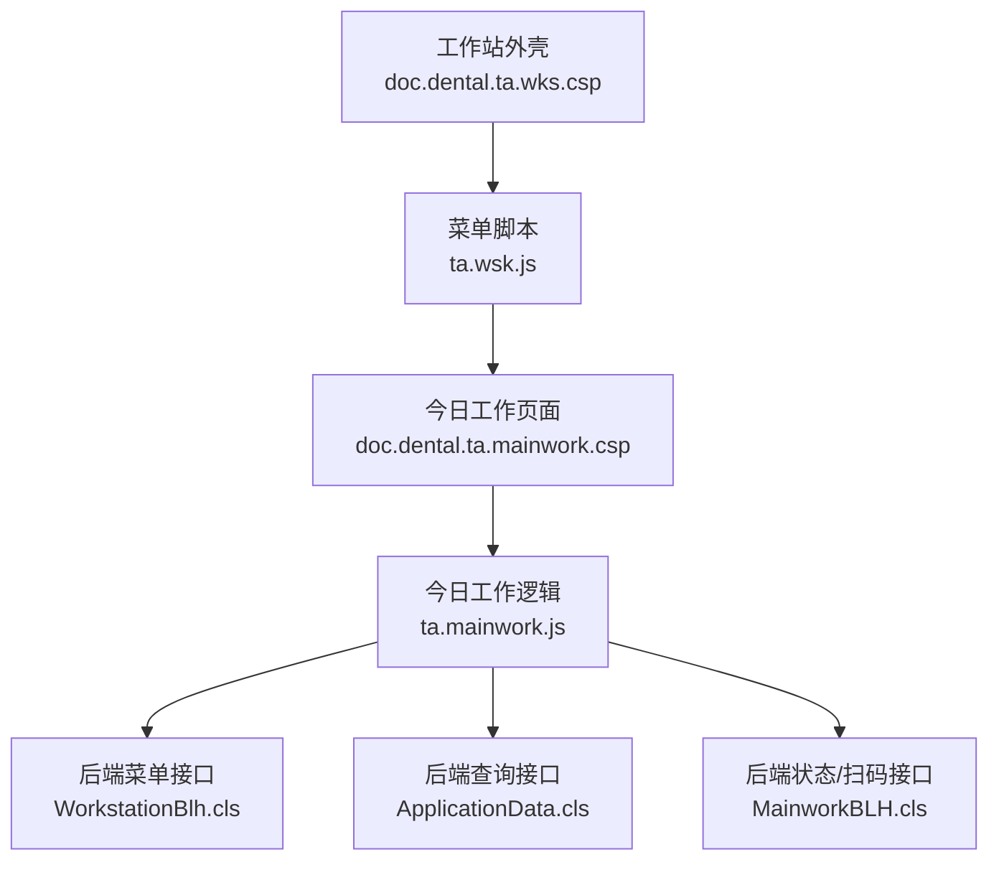
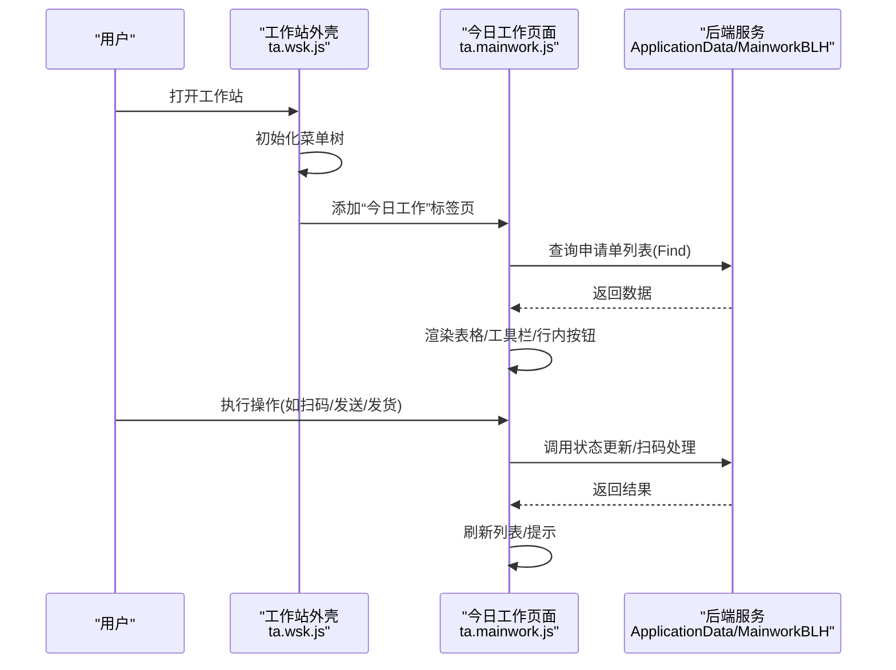
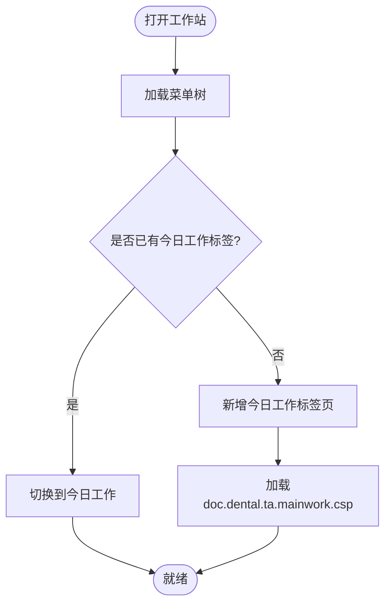
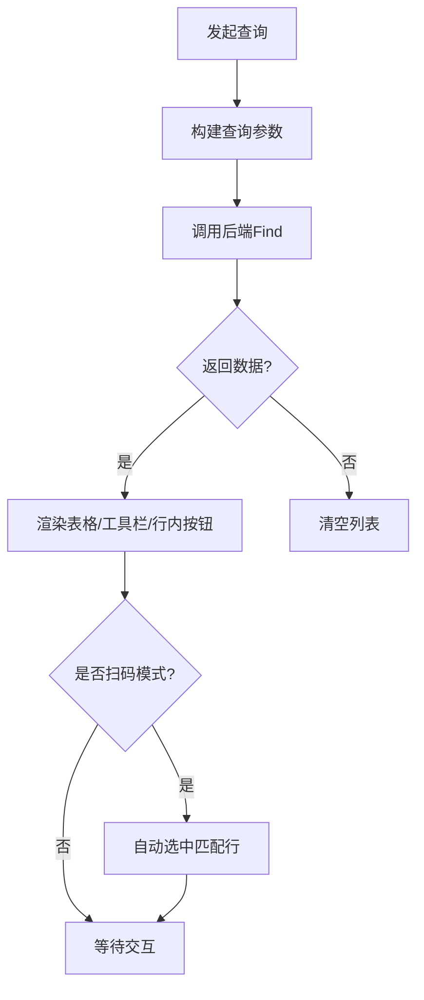
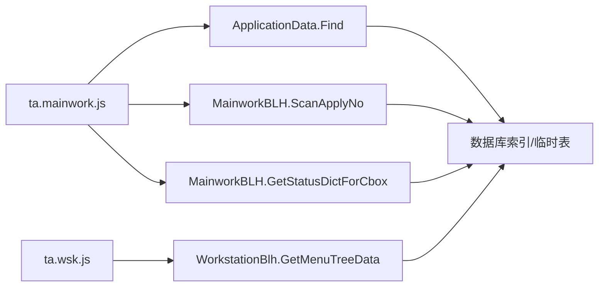

# 工作台管理

<cite>
**本文引用的文件**
- [doc.dental.ta.mainwork.csp](file://src/frontend/dental-ws/csp/doc.dental.ta.mainwork.csp)
- [ta.mainwork.js](file://src/frontend/dental-ws/scripts/dhcdoc/dental/ta.mainwork.js)
- [doc.dental.ta.wks.csp](file://src/frontend/dental-ws/csp/doc.dental.ta.wks.csp)
- [ta.wsk.js](file://src/frontend/dental-ws/scripts/dhcdoc/dental/ta.wsk.js)
- [MainworkBLH.cls](file://src/backend/dental-ws/DHCDoc/Dental/TA/MainworkBLH.cls)
- [WorkstationBlh.cls](file://src/backend/dental-ws/DHCDoc/Dental/TA/WorkstationBlh.cls)
- [ApplicationData.cls](file://src/backend/dental-ws/DHCDoc/Dental/TA/ApplicationData.cls)
</cite>

## 目录
1. [简介](#简介)
2. [项目结构](#项目结构)
3. [核心组件](#核心组件)
4. [架构总览](#架构总览)
5. [详细组件分析](#详细组件分析)
6. [依赖关系分析](#依赖关系分析)
7. [性能考虑](#性能考虑)
8. [故障排查指南](#故障排查指南)
9. [结论](#结论)
10. [附录](#附录)

## 简介
本模块为牙科技工申请的工作台管理，面向医生、护士与技工角色提供统一的“今日工作”入口。通过多标签页菜单组织不同业务页面，主工作区以表格形式展示申请单列表，支持按患者、日期、状态、科室、加工单位等多条件查询；行内按钮根据角色与当前状态动态配置，实现审核、验收、返工、评价、发送、发货等流程操作；同时支持扫码快速定位并执行收模/发货等操作。数据层通过后端查询类聚合申请单信息，前端采用分页与批量操作提升效率。

## 项目结构
- 前端入口与界面
  - 工作站外壳：doc.dental.ta.wks.csp + ta.wsk.js（左侧菜单、多标签页容器）
  - 今日工作主界面：doc.dental.ta.mainwork.csp + ta.mainwork.js（申请列表、工具栏、行内按钮、打印导出）
- 后端服务
  - 菜单树：WorkstationBlh.cls.GetMenuTreeData
  - 状态字典与扫码流转：MainworkBLH.cls
  - 申请单查询：ApplicationData.cls.FindExecute

图表来源
- [doc.dental.ta.wks.csp:1-28](file://src/frontend/dental-ws/csp/doc.dental.ta.wks.csp#L1-L28)
- [ta.wsk.js:37-81](file://src/frontend/dental-ws/scripts/dhcdoc/dental/ta.wsk.js#L37-L81)
- [doc.dental.ta.mainwork.csp:1-91](file://src/frontend/dental-ws/csp/doc.dental.ta.mainwork.csp#L1-L91)
- [ta.mainwork.js:1-800](file://src/frontend/dental-ws/scripts/dhcdoc/dental/ta.mainwork.js#L1-L800)
- [WorkstationBlh.cls:1-76](file://src/backend/dental-ws/DHCDoc/Dental/TA/WorkstationBlh.cls#L1-L76)
- [ApplicationData.cls:1-200](file://src/backend/dental-ws/DHCDoc/Dental/TA/ApplicationData.cls#L1-L200)
- [MainworkBLH.cls:1-102](file://src/backend/dental-ws/DHCDoc/Dental/TA/MainworkBLH.cls#L1-L102)

章节来源
- [doc.dental.ta.wks.csp:1-28](file://src/frontend/dental-ws/csp/doc.dental.ta.wks.csp#L1-L28)
- [ta.wsk.js:37-81](file://src/frontend/dental-ws/scripts/dhcdoc/dental/ta.wsk.js#L37-L81)
- [doc.dental.ta.mainwork.csp:1-91](file://src/frontend/dental-ws/csp/doc.dental.ta.mainwork.csp#L1-L91)
- [ta.mainwork.js:1-800](file://src/frontend/dental-ws/scripts/dhcdoc/dental/ta.mainwork.js#L1-L800)
- [WorkstationBlh.cls:1-76](file://src/backend/dental-ws/DHCDoc/Dental/TA/WorkstationBlh.cls#L1-L76)
- [ApplicationData.cls:1-200](file://src/backend/dental-ws/DHCDoc/Dental/TA/ApplicationData.cls#L1-L200)
- [MainworkBLH.cls:1-102](file://src/backend/dental-ws/DHCDoc/Dental/TA/MainworkBLH.cls#L1-L102)

## 核心组件
- 工作站外壳与多标签页
  - 通过菜单树加载“今日工作”默认标签，点击菜单项以iframe方式打开子页面，支持重复选择与关闭。
- 今日工作主界面
  - 工具栏：批量打印、批量发送（特定角色）、批量送模/验收（护士角色）。
  - 列表：申请单号、患者信息、进度状态、金额、修复类型、基本信息、产品信息、附件查看、录单时间、录单人、申请科室、计划交货日期、材料备注等。
  - 行内按钮：依据服务端返回的rowBtnData渲染，支持查看、审核、撤销、取消、验收、返工、评价、发送、发货等。
  - 扫描输入：在收模/发货场景聚焦扫码框，回车触发扫码处理，自动定位并执行状态流转。
- 后端服务
  - 菜单树：WorkstationBlh.GetMenuTreeData，组装“今日工作”和“技工申请”二级菜单。
  - 申请单查询：ApplicationData.FindExecute，支持按患者、日期、状态、科室、加工单位、医生、姓名等多维过滤，支持按状态变更日期查询。
  - 状态字典与扫码流转：MainworkBLH.GetStatusDictForCbox、ScanApplyNo，负责状态下拉选项与扫码后的状态校验与更新。

章节来源
- [ta.wsk.js:37-81](file://src/frontend/dental-ws/scripts/dhcdoc/dental/ta.wsk.js#L37-L81)
- [ta.mainwork.js:102-337](file://src/frontend/dental-ws/scripts/dhcdoc/dental/ta.mainwork.js#L102-L337)
- [WorkstationBlh.cls:1-76](file://src/backend/dental-ws/DHCDoc/Dental/TA/WorkstationBlh.cls#L1-L76)
- [ApplicationData.cls:13-200](file://src/backend/dental-ws/DHCDoc/Dental/TA/ApplicationData.cls#L13-L200)
- [MainworkBLH.cls:23-99](file://src/backend/dental-ws/DHCDoc/Dental/TA/MainworkBLH.cls#L23-L99)

## 架构总览
前端通过菜单树初始化多标签页，默认打开“今日工作”。今日工作页面加载后，调用后端查询接口获取申请单列表，并根据角色与权限渲染工具栏与行内按钮。用户执行操作时，前端调用对应后端方法完成状态变更或数据读取。

图表来源
- [ta.wsk.js:37-81](file://src/frontend/dental-ws/scripts/dhcdoc/dental/ta.wsk.js#L37-L81)
- [ta.mainwork.js:287-337](file://src/frontend/dental-ws/scripts/dhcdoc/dental/ta.mainwork.js#L287-L337)
- [ApplicationData.cls:13-200](file://src/backend/dental-ws/DHCDoc/Dental/TA/ApplicationData.cls#L13-L200)
- [MainworkBLH.cls:69-99](file://src/backend/dental-ws/DHCDoc/Dental/TA/MainworkBLH.cls#L69-L99)

## 详细组件分析

### 工作站外壳与多标签页
- 功能要点
  - 菜单树数据来源：后端GetMenuTreeData，包含“今日工作”与“技工申请”子菜单。
  - 标签页管理：若已存在则切换，否则新增iframe内容；URL携带MWToken保证会话安全。
  - 默认选中“今日工作”，便于直接进入任务列表。
- 扩展点
  - 可在菜单树中增加新的业务菜单节点，指向新CSP页面，即可在多标签页中打开。

图表来源
- [ta.wsk.js:37-81](file://src/frontend/dental-ws/scripts/dhcdoc/dental/ta.wsk.js#L37-L81)
- [WorkstationBlh.cls:6-73](file://src/backend/dental-ws/DHCDoc/Dental/TA/WorkstationBlh.cls#L6-L73)

章节来源
- [doc.dental.ta.wks.csp:1-28](file://src/frontend/dental-ws/csp/doc.dental.ta.wks.csp#L1-L28)
- [ta.wsk.js:37-81](file://src/frontend/dental-ws/scripts/dhcdoc/dental/ta.wsk.js#L37-L81)
- [WorkstationBlh.cls:6-73](file://src/backend/dental-ws/DHCDoc/Dental/TA/WorkstationBlh.cls#L6-L73)

### 今日工作主界面（任务列表、患者信息、快捷操作）
- 界面布局
  - 顶部工具栏：批量打印、批量发送（特定角色）、批量送模/验收（护士角色）。
  - 查询区：登记号、姓名、日期范围、状态、申请科室、加工单位、申请医生、申请单号（或扫码框）。
  - 列表区：显示申请单关键信息与操作列。
- 核心功能
  - 多条件查询：支持按患者、日期、状态、科室、加工单位、医生、姓名过滤；支持按状态变更日期查询（仅单状态）。
  - 行内按钮：由服务端rowBtnData驱动，支持查看、审核、撤销、取消、验收、返工、评价、发送、发货等。
  - 扫码处理：在收模/发货模式聚焦扫码框，回车触发扫码处理，自动定位并执行状态流转。
  - 附件查看：列表中的“是否有文件”列可弹出查看文件窗口。
  - 打印导出：支持单条打印与批量打印，支持导出Excel。
- 数据刷新机制
  - 查询成功后使用分页过滤器加载数据；行高与序号高度自适应调整；扫描后自动选中匹配行。
  - 行内按钮初始化采用分片执行，避免大数据量时的卡顿。

图表来源
- [ta.mainwork.js:287-337](file://src/frontend/dental-ws/scripts/dhcdoc/dental/ta.mainwork.js#L287-L337)
- [ta.mainwork.js:251-283](file://src/frontend/dental-ws/scripts/dhcdoc/dental/ta.mainwork.js#L251-L283)
- [ApplicationData.cls:13-200](file://src/backend/dental-ws/DHCDoc/Dental/TA/ApplicationData.cls#L13-L200)

章节来源
- [doc.dental.ta.mainwork.csp:1-91](file://src/frontend/dental-ws/csp/doc.dental.ta.mainwork.csp#L1-L91)
- [ta.mainwork.js:102-337](file://src/frontend/dental-ws/scripts/dhcdoc/dental/ta.mainwork.js#L102-L337)
- [ta.mainwork.js:396-422](file://src/frontend/dental-ws/scripts/dhcdoc/dental/ta.mainwork.js#L396-L422)
- [ta.mainwork.js:427-496](file://src/frontend/dental-ws/scripts/dhcdoc/dental/ta.mainwork.js#L427-L496)
- [ta.mainwork.js:503-583](file://src/frontend/dental-ws/scripts/dhcdoc/dental/ta.mainwork.js#L503-L583)
- [ta.mainwork.js:779-788](file://src/frontend/dental-ws/scripts/dhcdoc/dental/ta.mainwork.js#L779-L788)

### 个性化配置与用户偏好
- 角色与权限
  - 通过服务端获取当前登录组角色，控制菜单与按钮可见性；状态字典根据角色与页面操作进行筛选。
- 界面偏好
  - 列表列宽自适应、行高调整、分页大小可调；查询条件默认值设置（如日期默认当天）。
- 扩展点
  - 可通过rowBtnData扩展行内按钮；通过状态字典配置不同页面的可用状态；通过菜单树扩展新菜单项。

章节来源
- [MainworkBLH.cls:23-67](file://src/backend/dental-ws/DHCDoc/Dental/TA/MainworkBLH.cls#L23-L67)
- [ta.mainwork.js:102-140](file://src/frontend/dental-ws/scripts/dhcdoc/dental/ta.mainwork.js#L102-L140)
- [ta.mainwork.js:287-337](file://src/frontend/dental-ws/scripts/dhcdoc/dental/ta.mainwork.js#L287-L337)

### 数据刷新机制、实时通知、多标签页管理
- 数据刷新
  - 查询成功后重新加载表格数据；扫描后自动选中匹配行；行内按钮初始化完成后控制台输出统计信息。
- 实时通知
  - 扫码成功/失败通过消息提示反馈；操作结果统一通过后端返回码与消息提示。
- 多标签页管理
  - 菜单点击新增或切换标签页；URL携带MWToken确保跨页面会话一致性。

章节来源
- [ta.mainwork.js:251-283](file://src/frontend/dental-ws/scripts/dhcdoc/dental/ta.mainwork.js#L251-L283)
- [ta.mainwork.js:427-496](file://src/frontend/dental-ws/scripts/dhcdoc/dental/ta.mainwork.js#L427-L496)
- [ta.wsk.js:57-81](file://src/frontend/dental-ws/scripts/dhcdoc/dental/ta.wsk.js#L57-L81)

### 扩展接口与自定义开发指南
- 菜单扩展
  - 在后端菜单树中添加新节点，指定id、text、url、iconCls，即可在左侧菜单显示并打开新页面。
- 行内按钮扩展
  - 通过rowBtnData配置按钮ID、文本、URL；在前端switch分支中实现具体处理逻辑。
- 状态字典扩展
  - 在状态字典中配置pageLink与角色限制，控制不同页面可用的状态选项。
- 查询扩展
  - 在ApplicationData.FindExecute中增加过滤条件与字段映射，前端同步传递查询参数。

章节来源
- [WorkstationBlh.cls:6-73](file://src/backend/dental-ws/DHCDoc/Dental/TA/WorkstationBlh.cls#L6-L73)
- [ta.mainwork.js:503-583](file://src/frontend/dental-ws/scripts/dhcdoc/dental/ta.mainwork.js#L503-L583)
- [MainworkBLH.cls:23-67](file://src/backend/dental-ws/DHCDoc/Dental/TA/MainworkBLH.cls#L23-L67)
- [ApplicationData.cls:13-200](file://src/backend/dental-ws/DHCDoc/Dental/TA/ApplicationData.cls#L13-L200)

## 依赖关系分析
- 前端依赖
  - 工作站外壳依赖菜单脚本；今日工作页面依赖通用工具、表格导出、文件存储等脚本。
- 前后端交互
  - 前端通过$cm调用后端类方法；后端返回JSON格式结果，前端解析并更新UI。
- 数据模型
  - 申请单主表与状态表关联；字典表提供状态名称与页面链接；用户与科室字典提供描述信息。

图表来源
- [ta.mainwork.js:287-337](file://src/frontend/dental-ws/scripts/dhcdoc/dental/ta.mainwork.js#L287-L337)
- [ta.mainwork.js:427-496](file://src/frontend/dental-ws/scripts/dhcdoc/dental/ta.mainwork.js#L427-L496)
- [ta.wsk.js:37-81](file://src/frontend/dental-ws/scripts/dhcdoc/dental/ta.wsk.js#L37-L81)
- [ApplicationData.cls:13-200](file://src/backend/dental-ws/DHCDoc/Dental/TA/ApplicationData.cls#L13-L200)
- [MainworkBLH.cls:23-99](file://src/backend/dental-ws/DHCDoc/Dental/TA/MainworkBLH.cls#L23-L99)
- [WorkstationBlh.cls:6-73](file://src/backend/dental-ws/DHCDoc/Dental/TA/WorkstationBlh.cls#L6-L73)

章节来源
- [ta.mainwork.js:287-337](file://src/frontend/dental-ws/scripts/dhcdoc/dental/ta.mainwork.js#L287-L337)
- [ta.mainwork.js:427-496](file://src/frontend/dental-ws/scripts/dhcdoc/dental/ta.mainwork.js#L427-L496)
- [ta.wsk.js:37-81](file://src/frontend/dental-ws/scripts/dhcdoc/dental/ta.wsk.js#L37-L81)
- [ApplicationData.cls:13-200](file://src/backend/dental-ws/DHCDoc/Dental/TA/ApplicationData.cls#L13-L200)
- [MainworkBLH.cls:23-99](file://src/backend/dental-ws/DHCDoc/Dental/TA/MainworkBLH.cls#L23-L99)
- [WorkstationBlh.cls:6-73](file://src/backend/dental-ws/DHCDoc/Dental/TA/WorkstationBlh.cls#L6-L73)

## 性能考虑
- 列表渲染优化
  - 使用分页与较大pageSize减少请求次数；行内按钮初始化采用分片执行，避免阻塞。
- 查询优化
  - 支持按状态变更日期查询，利用索引加速；单状态查询限制提高准确性。
- 交互优化
  - 扫描后自动选中匹配行，减少用户操作；工具栏按钮按角色动态显示，降低无效操作。
- 建议
  - 对大数据量列表启用虚拟滚动或懒加载；对复杂查询增加缓存策略；对频繁操作增加防抖与节流。

[本节为通用性能指导，不直接分析具体文件]

## 故障排查指南
- 扫码无结果
  - 检查扫码框是否聚焦；确认申请单号是否存在；查看后端返回码与提示信息。
- 状态不允许操作
  - 检查当前状态是否在允许的前置状态列表中；核对角色权限与页面操作限制。
- 列表为空
  - 确认查询条件是否正确；检查日期范围与状态选择；验证后端返回数据。
- 行内按钮未显示
  - 检查rowBtnData配置；确认角色与页面操作对应的按钮ID是否匹配。

章节来源
- [ta.mainwork.js:427-496](file://src/frontend/dental-ws/scripts/dhcdoc/dental/ta.mainwork.js#L427-L496)
- [MainworkBLH.cls:69-99](file://src/backend/dental-ws/DHCDoc/Dental/TA/MainworkBLH.cls#L69-L99)
- [ta.mainwork.js:287-337](file://src/frontend/dental-ws/scripts/dhcdoc/dental/ta.mainwork.js#L287-L337)
- [ta.mainwork.js:503-583](file://src/frontend/dental-ws/scripts/dhcdoc/dental/ta.mainwork.js#L503-L583)

## 结论
牙科工作台管理模块以多标签页菜单组织业务入口，今日工作主界面提供高效的任务列表与快捷操作，结合角色权限与状态字典实现灵活的流程控制。后端查询与服务方法支撑了丰富的过滤与状态流转能力。通过扩展菜单、行内按钮与查询条件，可快速适配新业务需求。建议在大数据量场景下进一步优化渲染与查询性能，提升用户体验。

[本节为总结性内容，不直接分析具体文件]

## 附录
- 常用操作路径参考
  - 菜单树加载：WorkstationBlh.GetMenuTreeData
  - 申请单查询：ApplicationData.FindExecute
  - 扫码处理：MainworkBLH.ScanApplyNo
  - 状态字典：MainworkBLH.GetStatusDictForCbox
- 扩展开发清单
  - 新增菜单：在菜单树中添加节点
  - 新增行内按钮：配置rowBtnData并在前端switch中实现逻辑
  - 新增查询条件：在后端FindExecute中增加过滤与字段映射，前端传递参数

章节来源
- [WorkstationBlh.cls:6-73](file://src/backend/dental-ws/DHCDoc/Dental/TA/WorkstationBlh.cls#L6-L73)
- [ApplicationData.cls:13-200](file://src/backend/dental-ws/DHCDoc/Dental/TA/ApplicationData.cls#L13-L200)
- [MainworkBLH.cls:23-99](file://src/backend/dental-ws/DHCDoc/Dental/TA/MainworkBLH.cls#L23-L99)
- [ta.mainwork.js:503-583](file://src/frontend/dental-ws/scripts/dhcdoc/dental/ta.mainwork.js#L503-L583)