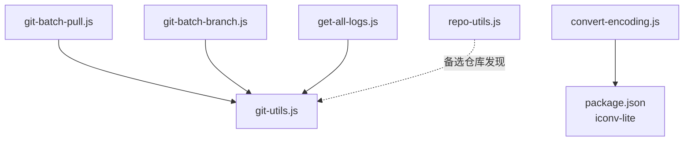
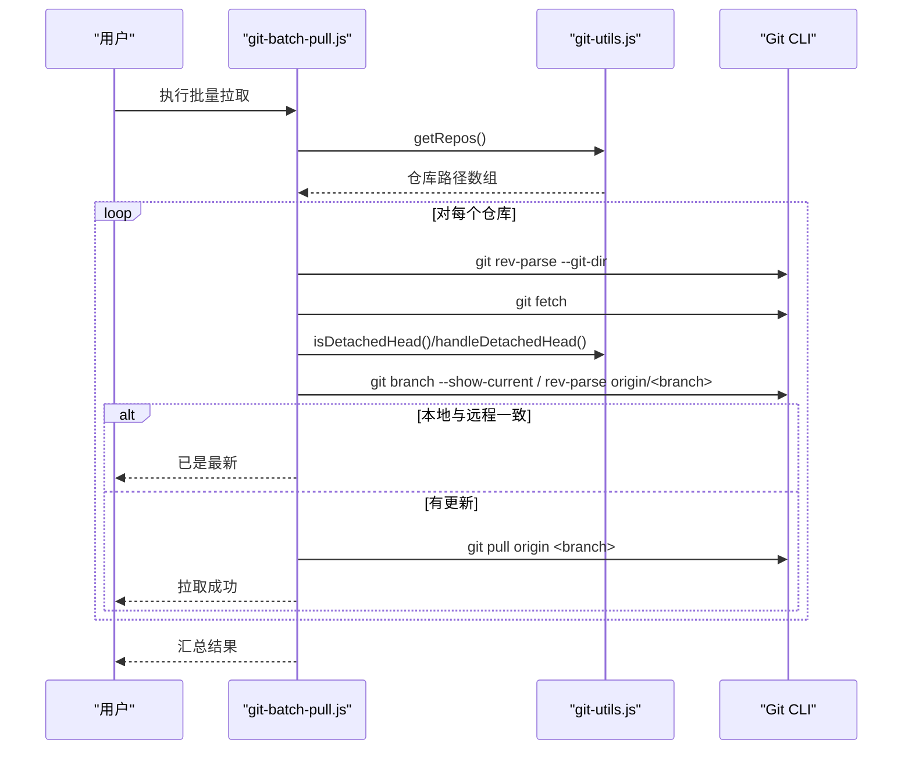
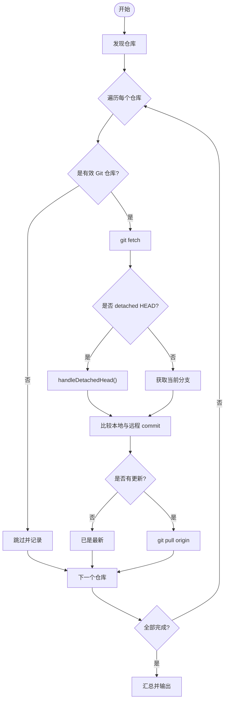
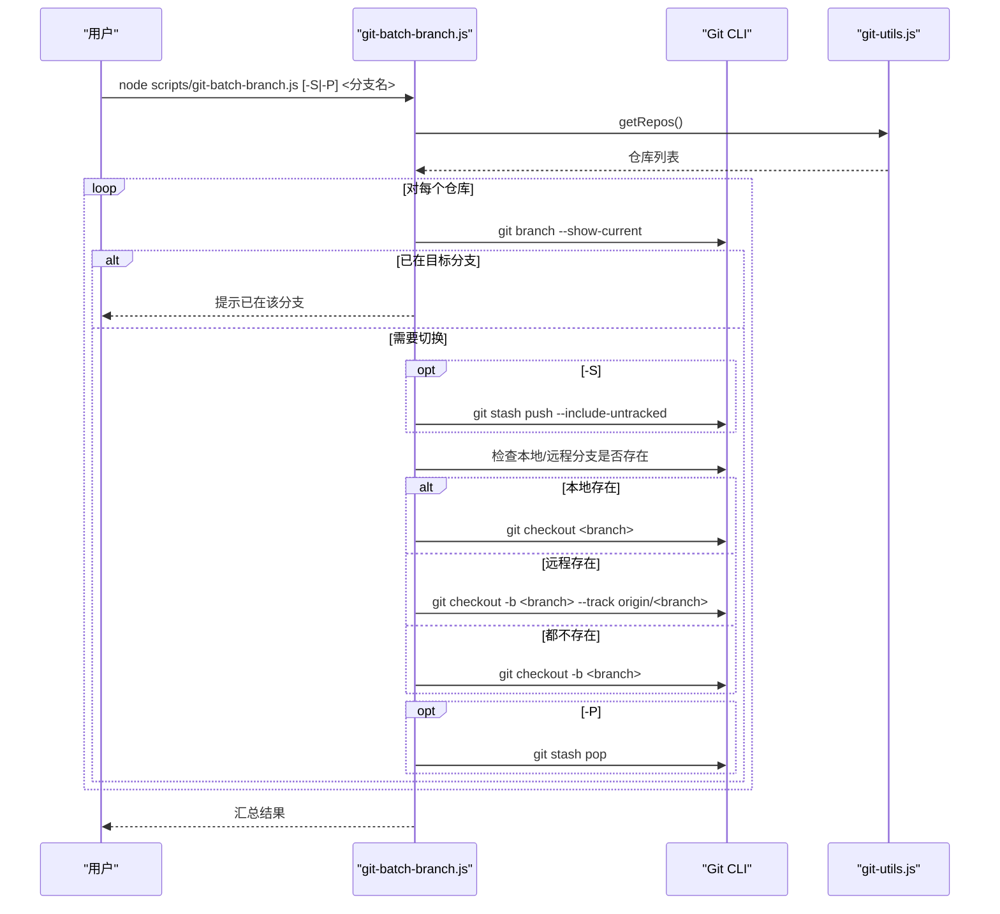
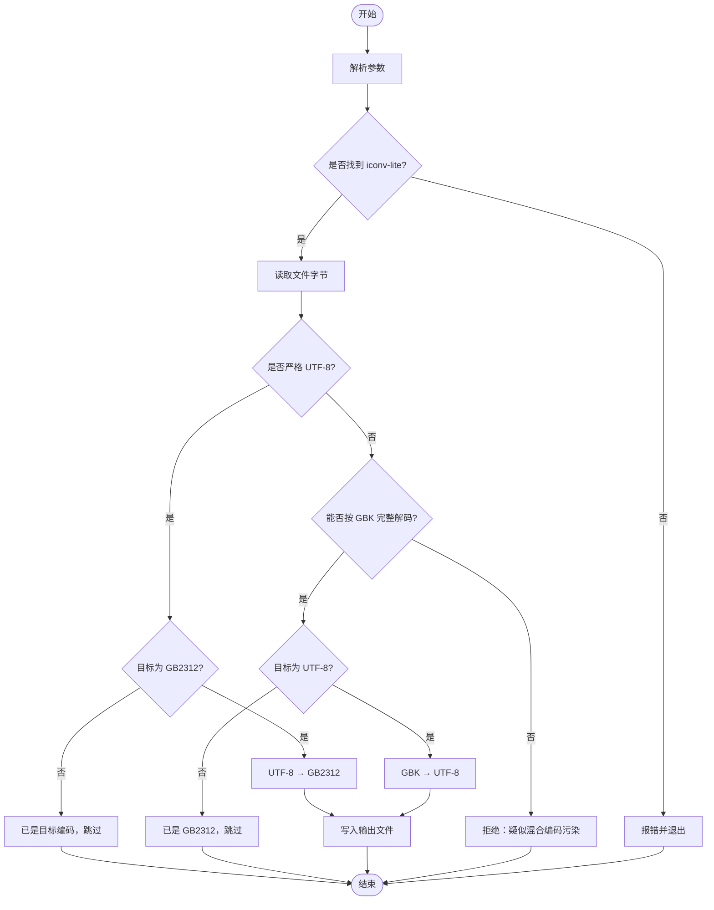
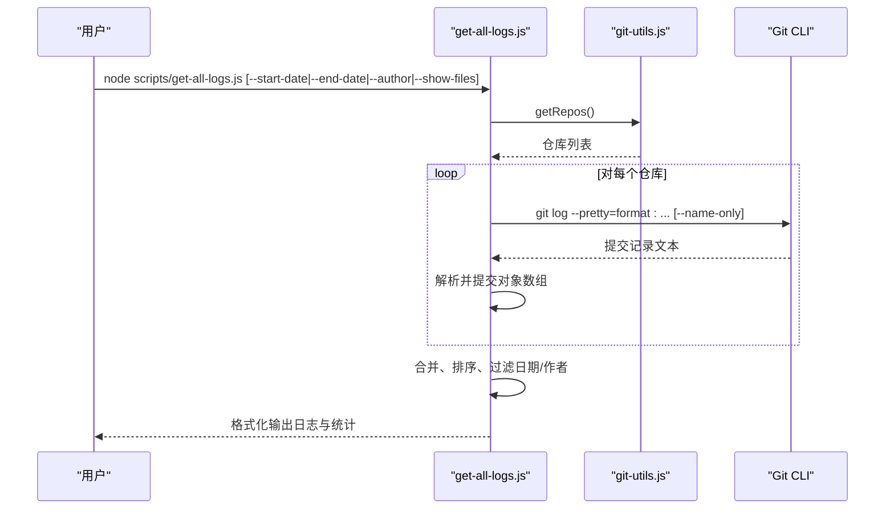
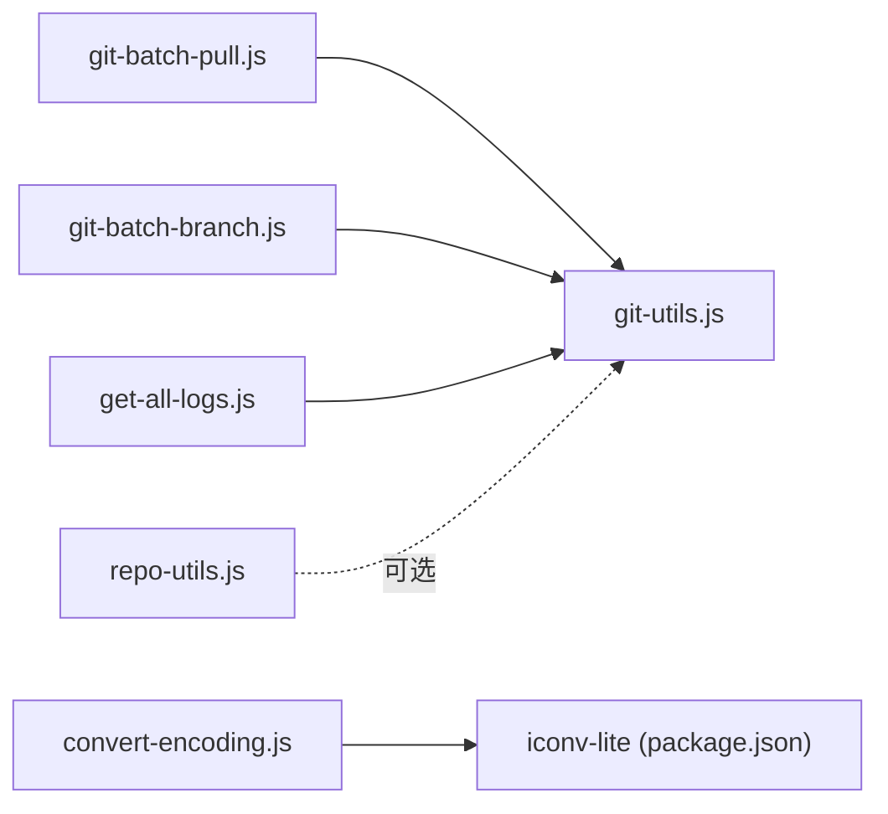

# 自动化脚本

<cite>
**本文引用的文件**
- [scripts/git-batch-pull.js](file://scripts/git-batch-pull.js)
- [scripts/git-batch-branch.js](file://scripts/git-batch-branch.js)
- [scripts/convert-encoding.js](file://scripts/convert-encoding.js)
- [scripts/get-all-logs.js](file://scripts/get-all-logs.js)
- [scripts/git-utils.js](file://scripts/git-utils.js)
- [scripts/repo-utils.js](file://scripts/repo-utils.js)
- [scripts/package.json](file://scripts/package.json)
</cite>

## 目录
1. [简介](#简介)
2. [项目结构](#项目结构)
3. [核心组件](#核心组件)
4. [架构总览](#架构总览)
5. [详细组件分析](#详细组件分析)
6. [依赖关系分析](#依赖关系分析)
7. [性能注意事项](#性能注意事项)
8. [故障排除指南](#故障排除指南)
9. [结论](#结论)
10. [附录：参数与示例速查](#附录参数与示例速查)

## 简介
本使用文档面向项目中的自动化脚本，覆盖以下能力：
- Git 批量操作：批量拉取代码、批量切换/创建分支、批量删除本地分支等。
- 编码转换工具：在 UTF-8 与 GB2312/GBK 之间进行安全转换，支持 BOM 处理与混合编码检测。
- 日志收集：集中获取各模块（子模块）的提交历史，支持按日期范围、作者过滤，并可选显示修改文件列表。

这些脚本通过 Node.js 运行，复用统一的仓库发现与 Git 工具函数，确保在多仓库/子模块环境下的一致行为。

## 项目结构
脚本集中于 scripts 目录，核心文件职责如下：
- git-batch-pull.js：批量拉取所有仓库更新。
- git-batch-branch.js：批量查看/切换/创建/删除分支，支持 stash 自动管理。
- convert-encoding.js：单文件编码转换（UTF-8 ↔ GB2312）。
- get-all-logs.js：汇总多仓库提交日志，支持过滤与格式化输出。
- git-utils.js：仓库发现、detached HEAD 处理、默认分支识别等通用 Git 工具。
- repo-utils.js：递归查找 Git 仓库（备用方案）。
- package.json：声明 iconv-lite 依赖（用于编码转换）。

图表来源
- [scripts/git-batch-pull.js:1-10](file://scripts/git-batch-pull.js#L1-L10)
- [scripts/git-batch-branch.js:1-9](file://scripts/git-batch-branch.js#L1-L9)
- [scripts/get-all-logs.js:1-6](file://scripts/get-all-logs.js#L1-L6)
- [scripts/convert-encoding.js:26-61](file://scripts/convert-encoding.js#L26-L61)
- [scripts/git-utils.js:1-10](file://scripts/git-utils.js#L1-L10)
- [scripts/repo-utils.js:1-18](file://scripts/repo-utils.js#L1-L18)
- [scripts/package.json:1-10](file://scripts/package.json#L1-L10)

章节来源
- [scripts/git-batch-pull.js:1-116](file://scripts/git-batch-pull.js#L1-L116)
- [scripts/git-batch-branch.js:1-338](file://scripts/git-batch-branch.js#L1-L338)
- [scripts/convert-encoding.js:1-191](file://scripts/convert-encoding.js#L1-L191)
- [scripts/get-all-logs.js:1-218](file://scripts/get-all-logs.js#L1-L218)
- [scripts/git-utils.js:1-155](file://scripts/git-utils.js#L1-L155)
- [scripts/repo-utils.js:1-60](file://scripts/repo-utils.js#L1-L60)
- [scripts/package.json:1-10](file://scripts/package.json#L1-L10)

## 核心组件
- 批量拉取（git-batch-pull.js）
  - 功能：遍历所有仓库（含子模块），执行 fetch，处理 detached HEAD，比较本地与远程 commit，必要时 pull。
  - 结果：统计成功、已是最新、跳过、失败数量；失败时退出码非零。
- 批量分支（git-batch-branch.js）
  - 功能：无参显示所有仓库当前分支状态；指定分支名则切换或自动创建；支持 -S/--stash、-P/--pop、-d/--delete。
  - 结果：统一汇总成功/跳过/失败，失败时列出具体仓库与错误信息。
- 编码转换（convert-encoding.js）
  - 功能：读取单文件，探测是否为严格 UTF-8，结合 iconv-lite 完成 UTF-8 与 GB2312/GBK 互转；拒绝混合编码污染文件；支持输出到指定目录或直接覆盖原文件。
- 日志收集（get-all-logs.js）
  - 功能：遍历所有仓库，调用 git log 收集提交记录，支持 --start-date、--end-date、--author、--show-files；按时间倒序输出，统计总数。

章节来源
- [scripts/git-batch-pull.js:17-116](file://scripts/git-batch-pull.js#L17-L116)
- [scripts/git-batch-branch.js:14-338](file://scripts/git-batch-branch.js#L14-L338)
- [scripts/convert-encoding.js:26-191](file://scripts/convert-encoding.js#L26-L191)
- [scripts/get-all-logs.js:11-218](file://scripts/get-all-logs.js#L11-L218)

## 架构总览
脚本采用“命令脚本 + 共享工具”的分层设计：
- 命令脚本负责解析参数、编排流程、输出结果。
- 共享工具提供仓库发现、Git 命令封装、detached HEAD 处理等能力。
- 编码转换脚本独立运行，仅依赖 iconv-lite。

图表来源
- [scripts/git-batch-pull.js:17-116](file://scripts/git-batch-pull.js#L17-L116)
- [scripts/git-utils.js:35-155](file://scripts/git-utils.js#L35-L155)

章节来源
- [scripts/git-batch-pull.js:1-116](file://scripts/git-batch-pull.js#L1-L116)
- [scripts/git-utils.js:1-155](file://scripts/git-utils.js#L1-L155)

## 详细组件分析

### 批量拉取脚本（git-batch-pull.js）
- 关键流程
  - 发现仓库：通过 git-utils.getRepos 获取根仓库与子模块。
  - 有效性校验：对每个仓库执行 git rev-parse --git-dir，非 Git 仓库则跳过。
  - 更新策略：先 git fetch，再判断是否 detached HEAD，若存在则关联分支；否则获取当前分支。
  - 差异检测：比较本地分支与 origin/对应分支的 commit，相同则跳过。
  - 拉取执行：git pull origin <branch>，打印 stdout/stderr。
  - 结果汇总：统计 success/up-to-date/skipped/error，若有 error 则退出码非零。
- 异常处理
  - 非 Git 仓库：警告并跳过。
  - 无法确定分支：抛出错误并记录。
  - 拉取失败：捕获错误并记录详细信息。

图表来源
- [scripts/git-batch-pull.js:17-116](file://scripts/git-batch-pull.js#L17-L116)
- [scripts/git-utils.js:67-155](file://scripts/git-utils.js#L67-L155)

章节来源
- [scripts/git-batch-pull.js:17-116](file://scripts/git-batch-pull.js#L17-L116)
- [scripts/git-utils.js:35-155](file://scripts/git-utils.js#L35-L155)

### 批量分支脚本（git-batch-branch.js）
- 模式
  - 无参：显示所有仓库当前分支状态，统计各分支分布。
  - 指定分支名：切换或自动创建（本地不存在且远程不存在时新建；存在则 checkout）。
  - 删除分支：-d/--delete 删除指定本地分支（当前分支不删）。
- 选项
  - -S/--stash：切换前 stash push（包含未跟踪文件）。
  - -P/--pop：切换后 stash pop（可单独使用恢复已有 stash）。
  - -h/--help：显示帮助。
- 关键逻辑
  - 切换前检查当前分支是否已是目标分支。
  - 根据本地/远程存在情况决定 checkout 或 checkout -b。
  - 切换失败时回滚 stash（若之前已 stash）。
  - 统一汇总成功/跳过/失败，失败时列出仓库与错误。

图表来源
- [scripts/git-batch-branch.js:99-164](file://scripts/git-batch-branch.js#L99-L164)
- [scripts/git-batch-branch.js:233-309](file://scripts/git-batch-branch.js#L233-L309)
- [scripts/git-utils.js:35-74](file://scripts/git-utils.js#L35-L74)

章节来源
- [scripts/git-batch-branch.js:14-338](file://scripts/git-batch-branch.js#L14-L338)
- [scripts/git-utils.js:35-74](file://scripts/git-utils.js#L35-L74)

### 编码转换工具（convert-encoding.js）
- 功能要点
  - 输入：文件路径、目标编码（utf-8/gb2312）、可选输出目录。
  - 探测：严格 UTF-8 校验（含 BOM），GB2312/GBK 解码完整性检测。
  - 转换：基于 iconv-lite 实现双向转换；若已是目标编码则跳过。
  - 安全：混合编码污染文件直接拒绝，避免数据损坏。
- 依赖
  - 首次使用前需在 scripts 目录执行 npm install 安装 iconv-lite。
- 典型用法
  - 将 GB2312 文件转换为 UTF-8 并覆盖原文件。
  - 将 UTF-8 文件转换为 GB2312 并输出到指定目录。

图表来源
- [scripts/convert-encoding.js:26-191](file://scripts/convert-encoding.js#L26-L191)
- [scripts/package.json:6-8](file://scripts/package.json#L6-L8)

章节来源
- [scripts/convert-encoding.js:26-191](file://scripts/convert-encoding.js#L26-L191)
- [scripts/package.json:1-10](file://scripts/package.json#L1-L10)

### 日志收集脚本（get-all-logs.js）
- 功能要点
  - 遍历所有仓库，调用 git log 收集提交记录（哈希、作者、邮箱、日期、主题）。
  - 支持 --start-date、--end-date 过滤时间范围；--author 按姓名或邮箱模糊匹配。
  - 可选 --show-files 显示每次提交修改的文件列表。
  - 输出格式：按时间倒序，便于快速定位最近变更。
- 数据处理
  - 解析 git log 输出，分离提交行与文件列表行。
  - 日期标准化与过滤，最终排序输出。

图表来源
- [scripts/get-all-logs.js:47-110](file://scripts/get-all-logs.js#L47-L110)
- [scripts/get-all-logs.js:113-218](file://scripts/get-all-logs.js#L113-L218)
- [scripts/git-utils.js:35-60](file://scripts/git-utils.js#L35-L60)

章节来源
- [scripts/get-all-logs.js:11-218](file://scripts/get-all-logs.js#L11-L218)
- [scripts/git-utils.js:35-60](file://scripts/git-utils.js#L35-L60)

## 依赖关系分析
- 脚本间耦合
  - git-batch-pull.js、git-batch-branch.js、get-all-logs.js 均依赖 git-utils.js 的仓库发现与 Git 工具函数。
  - repo-utils.js 提供递归查找 Git 仓库的备用能力，未被上述脚本直接引用，但可作为扩展点。
- 外部依赖
  - convert-encoding.js 依赖 iconv-lite（scripts/package.json 中声明）。
- 潜在循环依赖
  - 未发现循环依赖；工具函数被多个脚本单向引用。

图表来源
- [scripts/git-batch-pull.js:1-9](file://scripts/git-batch-pull.js#L1-L9)
- [scripts/git-batch-branch.js:1-9](file://scripts/git-batch-branch.js#L1-L9)
- [scripts/get-all-logs.js:1-6](file://scripts/get-all-logs.js#L1-L6)
- [scripts/convert-encoding.js:26-61](file://scripts/convert-encoding.js#L26-L61)
- [scripts/repo-utils.js:1-18](file://scripts/repo-utils.js#L1-L18)
- [scripts/package.json:6-8](file://scripts/package.json#L6-L8)

章节来源
- [scripts/git-batch-pull.js:1-116](file://scripts/git-batch-pull.js#L1-L116)
- [scripts/git-batch-branch.js:1-338](file://scripts/git-batch-branch.js#L1-L338)
- [scripts/get-all-logs.js:1-218](file://scripts/get-all-logs.js#L1-L218)
- [scripts/convert-encoding.js:1-191](file://scripts/convert-encoding.js#L1-L191)
- [scripts/repo-utils.js:1-60](file://scripts/repo-utils.js#L1-L60)
- [scripts/package.json:1-10](file://scripts/package.json#L1-L10)

## 性能注意事项
- 批量操作顺序执行：当前实现按仓库顺序串行执行，简单可靠；若仓库数量较多，可考虑并行化以提升吞吐（需权衡网络与磁盘 IO）。
- Git 命令开销：频繁调用 git 命令会带来进程启动开销；可将常用命令合并或缓存中间结果（如分支列表）。
- 日志收集：--show-files 会显著增加输出量与解析成本，仅在需要时启用。
- 编码转换：iconv-lite 解码/编码为 CPU 密集型；大文件转换建议分批或后台执行。

[本节为通用指导，不涉及具体文件分析]

## 故障排除指南
- 未找到任何 Git 仓库
  - 现象：脚本输出“未找到任何 Git 仓库”并退出。
  - 排查：确认当前目录为根仓库，且 .gitmodules 配置正确；子模块 .git 目录存在。
  - 参考：仓库发现逻辑与子模块解析。
- 不是有效的 Git 仓库
  - 现象：批量拉取时对某仓库跳过并提示“不是有效的 Git 仓库”。
  - 排查：确认路径下存在 .git 目录；权限可读。
- detached HEAD 状态
  - 现象：拉取或分支操作提示处于 detached HEAD。
  - 处理：脚本会自动尝试关联远程分支并 checkout；若失败，请手动执行 git checkout 到合适分支。
- 切换分支失败
  - 现象：切换分支时报错，可能因冲突或未暂存更改。
  - 处理：使用 -S/--stash 暂存更改后再切换；或使用 -P/--pop 恢复 stash；冲突时需手动解决。
- 编码转换失败
  - 现象：提示“未找到 iconv-lite 依赖”或“混合编码污染”。
  - 处理：在 scripts 目录执行 npm install；人工检查文件编码一致性。
- 日志过滤无结果
  - 现象：按日期或作者过滤后无输出。
  - 处理：检查日期格式（YYYY-MM-DD）与作者名称/邮箱是否匹配；确认仓库有提交记录。

章节来源
- [scripts/git-batch-pull.js:72-116](file://scripts/git-batch-pull.js#L72-L116)
- [scripts/git-batch-branch.js:99-164](file://scripts/git-batch-branch.js#L99-L164)
- [scripts/convert-encoding.js:56-123](file://scripts/convert-encoding.js#L56-L123)
- [scripts/get-all-logs.js:113-218](file://scripts/get-all-logs.js#L113-L218)
- [scripts/git-utils.js:35-155](file://scripts/git-utils.js#L35-L155)

## 结论
本套自动化脚本覆盖了日常开发中常见的多仓库管理与辅助任务：
- 批量拉取简化了跨模块同步流程，内置 detached HEAD 处理提升鲁棒性。
- 批量分支脚本提供安全的切换/创建/删除能力，配合 stash 减少冲突风险。
- 编码转换工具保障历史文件的编码一致性，避免污染。
- 日志收集脚本帮助快速定位变更，支持多维度过滤与可视化输出。

建议在团队内统一使用这些脚本，并结合 CI/CD 进行定期维护与质量门禁。

[本节为总结性内容，不涉及具体文件分析]

## 附录：参数与示例速查

- 批量拉取
  - 运行：node scripts/git-batch-pull.js
  - 说明：自动发现仓库并拉取更新，输出汇总统计。
  - 参考：[scripts/git-batch-pull.js:72-116](file://scripts/git-batch-pull.js#L72-L116)

- 批量分支
  - 查看状态：node scripts/git-batch-branch.js
  - 切换/创建：node scripts/git-batch-branch.js feature/xxx
  - 暂存并切换：node scripts/git-batch-branch.js -S -P feature/xxx
  - 删除本地分支：node scripts/git-batch-branch.js -d feature/old
  - 帮助：node scripts/git-batch-branch.js -h
  - 参考：[scripts/git-batch-branch.js:14-34](file://scripts/git-batch-branch.js#L14-L34), [scripts/git-batch-branch.js:233-309](file://scripts/git-batch-branch.js#L233-L309)

- 编码转换
  - 转为 UTF-8：node scripts/convert-encoding.js src/frontend/doc-ws/scripts/xxx.js utf-8
  - 转为 GB2312 并输出到 tmp：node scripts/convert-encoding.js src/frontend/doc-ws/csp/xxx.csp gb2312 tmp/converted
  - 帮助：node scripts/convert-encoding.js -h
  - 依赖安装：cd scripts && npm install
  - 参考：[scripts/convert-encoding.js:9-24](file://scripts/convert-encoding.js#L9-L24), [scripts/convert-encoding.js:127-188](file://scripts/convert-encoding.js#L127-L188)

- 日志收集
  - 全部日志：node scripts/get-all-logs.js
  - 按日期范围：node scripts/get-all-logs.js --start-date 2023-09-01 --end-date 2023-10-31
  - 按作者过滤：node scripts/get-all-logs.js --author "张三"
  - 显示修改文件：node scripts/get-all-logs.js --show-files
  - 帮助：node scripts/get-all-logs.js -h
  - 参考：[scripts/get-all-logs.js:11-38](file://scripts/get-all-logs.js#L11-L38), [scripts/get-all-logs.js:113-218](file://scripts/get-all-logs.js#L113-L218)

章节来源
- [scripts/git-batch-pull.js:72-116](file://scripts/git-batch-pull.js#L72-L116)
- [scripts/git-batch-branch.js:14-34](file://scripts/git-batch-branch.js#L14-L34)
- [scripts/git-batch-branch.js:233-309](file://scripts/git-batch-branch.js#L233-L309)
- [scripts/convert-encoding.js:9-24](file://scripts/convert-encoding.js#L9-L24)
- [scripts/convert-encoding.js:127-188](file://scripts/convert-encoding.js#L127-L188)
- [scripts/get-all-logs.js:11-38](file://scripts/get-all-logs.js#L11-L38)
- [scripts/get-all-logs.js:113-218](file://scripts/get-all-logs.js#L113-L218)