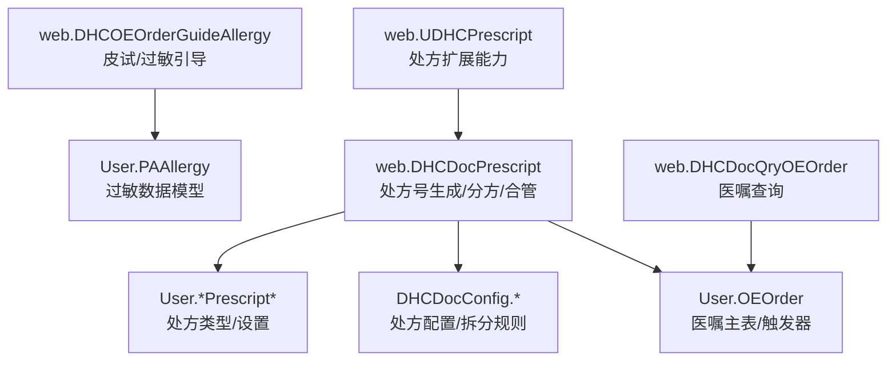
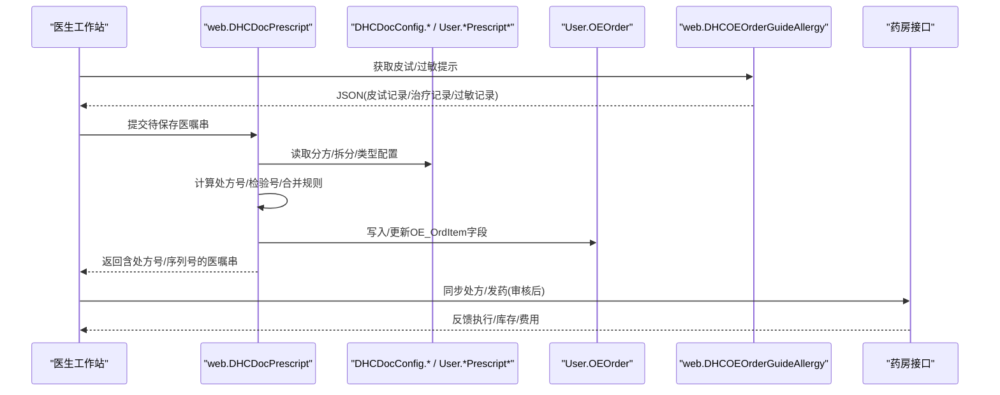
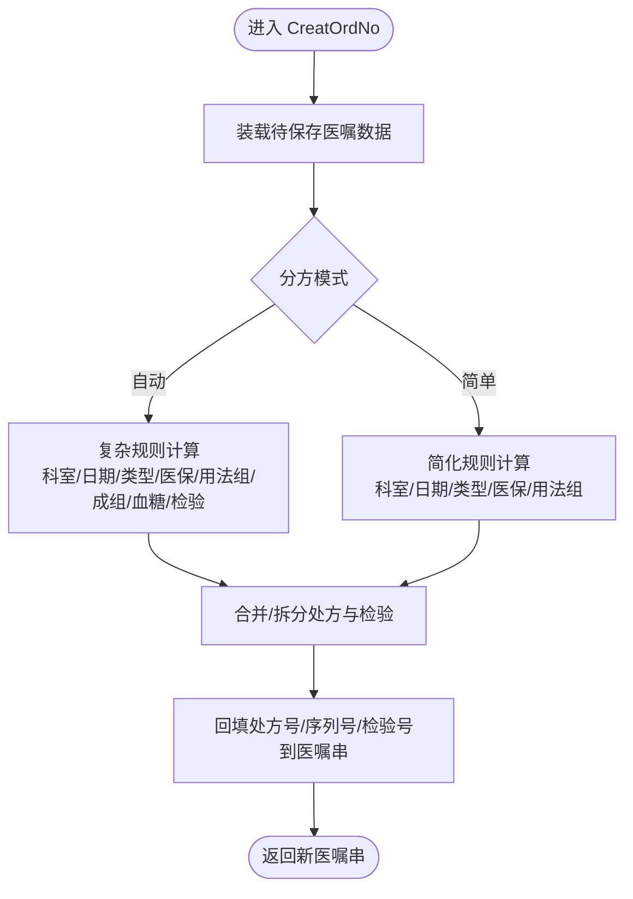
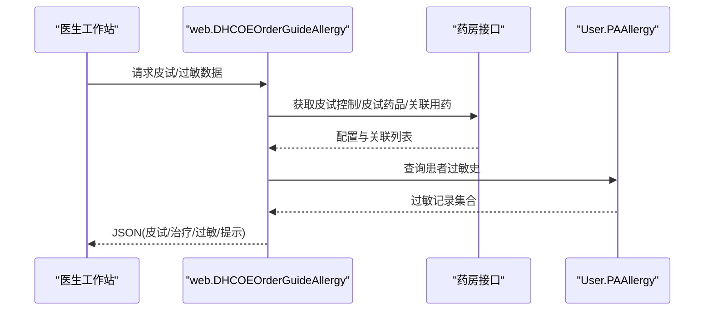
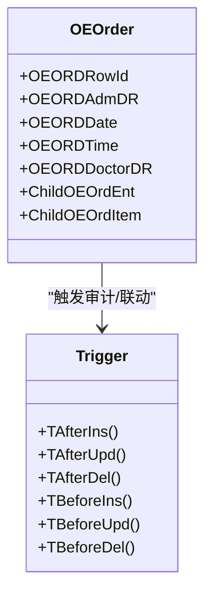
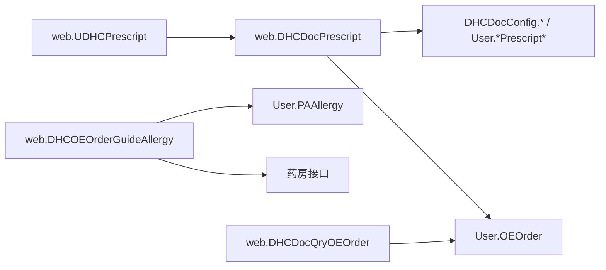

# 处方管理接口

<cite>
**本文引用的文件**
- [DHCDocPrescript.cls](file://src/backend/doc-ws/web/DHCDocPrescript.cls)
- [OEOrder.cls](file://src/backend/doc-ws/User/OEOrder.cls)
- [PAAllergy.cls](file://src/backend/doc-ws/User/PAAllergy.cls)
- [DHCOEOrderGuideAllergy.cls](file://src/backend/doc-ws/web/DHCOEOrderGuideAllergy.cls)
- [PrescriptSet.cls](file://src/backend/doc-ws/DHCDoc/DHCDocConfig/PrescriptSet.cls)
- [PrescriptType.cls](file://src/backend/doc-ws/DHCDoc/DHCDocConfig/PrescriptType.cls)
- [SplitPrescriptSetting.cls](file://src/backend/doc-ws/DHCDoc/DHCDocConfig/SplitPrescriptSetting.cls)
- [DHCPrescriptSet.cls](file://src/backend/doc-ws/User/DHCPrescriptSet.cls)
- [DHCPrescriptType.cls](file://src/backend/doc-ws/User/DHCPrescriptType.cls)
- [UDHCPrescript.cls](file://src/backend/doc-ws/web/UDHCPrescript.cls)
- [DHCDocQryOEOrder.cls](file://src/backend/doc-ws/web/DHCDocQryOEOrder.cls)
</cite>

## 目录
1. [简介](#简介)
2. [项目结构](#项目结构)
3. [核心组件](#核心组件)
4. [架构总览](#架构总览)
5. [详细组件分析](#详细组件分析)
6. [依赖关系分析](#依赖关系分析)
7. [性能考虑](#性能考虑)
8. [故障排查指南](#故障排查指南)
9. [结论](#结论)
10. [附录](#附录)

## 简介
本文件面向“处方管理”相关API与业务逻辑，覆盖处方开具、审核、打印等核心流程；区分药品处方与检查处方的处理差异；说明处方内容校验规则、药物相互作用检查、过敏信息核对等业务要点；提供调用示例（创建、修改、作废）；解释与药房管理系统的数据同步与处方流转；并记录电子签名与法律效力保障机制。

## 项目结构
围绕处方管理的后端实现主要分布在以下模块：
- 处方号生成与分方合并：web.DHCDocPrescript
- 医嘱主从实体与触发器：User.OEOrder
- 过敏信息与皮试引导：User.PAAllergy、web.DHCOEOrderGuideAllergy
- 处方配置与类型：DHCDocConfig.*、User.*Prescript*
- 查询与扩展能力：web.DHCDocQryOEOrder、web.UDHCPrescript

图表来源
- [DHCDocPrescript.cls:22-74](file://src/backend/doc-ws/web/DHCDocPrescript.cls#L22-L74)
- [OEOrder.cls:1-201](file://src/backend/doc-ws/User/OEOrder.cls#L1-L201)
- [DHCOEOrderGuideAllergy.cls:18-418](file://src/backend/doc-ws/web/DHCOEOrderGuideAllergy.cls#L18-L418)
- [PAAllergy.cls:1-507](file://src/backend/doc-ws/User/PAAllergy.cls#L1-L507)

章节来源
- [DHCDocPrescript.cls:22-74](file://src/backend/doc-ws/web/DHCDocPrescript.cls#L22-L74)
- [OEOrder.cls:1-201](file://src/backend/doc-ws/User/OEOrder.cls#L1-L201)
- [DHCOEOrderGuideAllergy.cls:18-418](file://src/backend/doc-ws/web/DHCOEOrderGuideAllergy.cls#L18-L418)
- [PAAllergy.cls:1-507](file://src/backend/doc-ws/User/PAAllergy.cls#L1-L507)

## 核心组件
- 处方号生成与分方合并：负责按科室、日期、处方类型、费别、用法组、是否成组医嘱、血糖分组、检验组合等规则计算处方号与检验标本号，支持西药分方、草药分方、检验拆管与合并。
- 医嘱主从与触发器：维护医嘱主表及插入/更新/删除触发，支撑审计与下游系统联动。
- 过敏与皮试引导：根据药房配置的皮试规则，展示历史皮试结果、治疗记录与过敏史，辅助医生决策。
- 处方配置与类型：定义处方拆分策略、处方类型、医保结算类型映射等。
- 查询与扩展：提供医嘱查询与处方扩展能力，便于前端展示与二次开发。

章节来源
- [DHCDocPrescript.cls:206-580](file://src/backend/doc-ws/web/DHCDocPrescript.cls#L206-L580)
- [OEOrder.cls:35-73](file://src/backend/doc-ws/User/OEOrder.cls#L35-L73)
- [DHCOEOrderGuideAllergy.cls:420-736](file://src/backend/doc-ws/web/DHCOEOrderGuideAllergy.cls#L420-L736)
- [PrescriptSet.cls](file://src/backend/doc-ws/DHCDoc/DHCDocConfig/PrescriptSet.cls)
- [PrescriptType.cls](file://src/backend/doc-ws/DHCDoc/DHCDocConfig/PrescriptType.cls)
- [SplitPrescriptSetting.cls](file://src/backend/doc-ws/DHCDoc/DHCDocConfig/SplitPrescriptSetting.cls)
- [DHCPrescriptSet.cls](file://src/backend/doc-ws/User/DHCPrescriptSet.cls)
- [DHCPrescriptType.cls](file://src/backend/doc-ws/User/DHCPrescriptType.cls)

## 架构总览
处方管理的关键流程包括：
- 处方号生成：根据配置与上下文计算处方号与序列号，支持自动或简单模式。
- 分方与合管：按规则将多条医嘱归并到同一处方或检验标本，避免重复与冲突。
- 过敏与皮试：在开嘱时提示过敏史与皮试要求，必要时阻止或提醒。
- 审核与打印：医嘱状态变化驱动后续流程，如收费、发药、检验执行与条码打印。
- 电子签名与效力：通过签名验证与审计日志确保处方法律效力。

图表来源
- [DHCDocPrescript.cls:22-74](file://src/backend/doc-ws/web/DHCDocPrescript.cls#L22-L74)
- [DHCOEOrderGuideAllergy.cls:18-418](file://src/backend/doc-ws/web/DHCOEOrderGuideAllergy.cls#L18-L418)
- [OEOrder.cls:35-73](file://src/backend/doc-ws/User/OEOrder.cls#L35-L73)

## 详细组件分析

### 处方号生成与分方合并（web.DHCDocPrescript）
- 入口方法：CreatOrdNo，接收就诊号、医嘱串、会话串、检验数组、处方类型，返回更新后的医嘱串。
- 分方模式：
  - 自动模式：依据医院/科室/医生/医保/用法组/成组医嘱/血糖分组/检验组合等复杂规则计算。
  - 简单模式：基于接收科室+开始日期+处方分类+费别+用法组代码的简化规则。
- 草药处方：单独分支处理，分配订单流水号与处方号。
- 合并与拆分：
  - 药品处方：支持成组医嘱合并、单药单处方、同类型同处方等策略。
  - 检验标本：支持多项目合管、血糖分组、时间窗口、已收费/已打印限制等。
- 输出：为每条医嘱填充处方号、序列号、接收/开单科室、检验标本号等关键信息。

图表来源
- [DHCDocPrescript.cls:22-74](file://src/backend/doc-ws/web/DHCDocPrescript.cls#L22-L74)
- [DHCDocPrescript.cls:206-580](file://src/backend/doc-ws/web/DHCDocPrescript.cls#L206-L580)

章节来源
- [DHCDocPrescript.cls:22-74](file://src/backend/doc-ws/web/DHCDocPrescript.cls#L22-L74)
- [DHCDocPrescript.cls:206-580](file://src/backend/doc-ws/web/DHCDocPrescript.cls#L206-L580)

### 过敏与皮试引导（web.DHCOEOrderGuideAllergy）
- 功能：在开嘱界面动态加载皮试记录、治疗记录与过敏记录，结合药房配置的皮试规则进行提示与约束。
- 数据来源：
  - 药房接口：获取皮试控制信息、皮试药品配置、关联治疗用药。
  - 患者过敏史：查询有效过敏记录，匹配当前医嘱项的过敏原。
- 展示：以JSON表格形式返回皮试记录、治疗记录、过敏记录，并附带提示信息（如阳性、有效期、默认免试等）。

图表来源
- [DHCOEOrderGuideAllergy.cls:18-418](file://src/backend/doc-ws/web/DHCOEOrderGuideAllergy.cls#L18-L418)
- [PAAllergy.cls:1-507](file://src/backend/doc-ws/User/PAAllergy.cls#L1-L507)

章节来源
- [DHCOEOrderGuideAllergy.cls:18-418](file://src/backend/doc-ws/web/DHCOEOrderGuideAllergy.cls#L18-L418)
- [PAAllergy.cls:1-507](file://src/backend/doc-ws/User/PAAllergy.cls#L1-L507)

### 医嘱主从与触发器（User.OEOrder）
- 主从关系：OEOrder为主表，OEOrdItem为子表，支持父子级联。
- 触发器：在插入、更新、删除前后触发审计与外部动作，保证数据一致性与可追溯性。
- 存储映射：SQLMap定义全局索引与数据结构，优化查询性能。

图表来源
- [OEOrder.cls:1-201](file://src/backend/doc-ws/User/OEOrder.cls#L1-L201)

章节来源
- [OEOrder.cls:1-201](file://src/backend/doc-ws/User/OEOrder.cls#L1-L201)

### 处方配置与类型（DHCDocConfig.* / User.*Prescript*）
- 处方拆分策略：SplitPrescriptSetting定义拆分维度与限制（如每张处方药物数量、单独分处方等）。
- 处方类型：PrescriptType与User.*PrescriptType定义处方分类（西药、草药、毒麻等）与规则。
- 处方设置：PrescriptSet与User.*PrescriptSet维护医院/科室/医生级别的处方行为开关。

章节来源
- [SplitPrescriptSetting.cls](file://src/backend/doc-ws/DHCDoc/DHCDocConfig/SplitPrescriptSetting.cls)
- [PrescriptType.cls](file://src/backend/doc-ws/DHCDoc/DHCDocConfig/PrescriptType.cls)
- [PrescriptSet.cls](file://src/backend/doc-ws/DHCDoc/DHCDocConfig/PrescriptSet.cls)
- [DHCPrescriptType.cls](file://src/backend/doc-ws/User/DHCPrescriptType.cls)
- [DHCPrescriptSet.cls](file://src/backend/doc-ws/User/DHCPrescriptSet.cls)

### 查询与扩展（web.DHCDocQryOEOrder / web.UDHCPrescript）
- 医嘱查询：提供按就诊号、日期、状态等多维查询能力，支持分页与过滤。
- 处方扩展：UDHCPrescript用于扩展处方展示与操作，便于前端集成与定制。

章节来源
- [DHCDocQryOEOrder.cls](file://src/backend/doc-ws/web/DHCDocQryOEOrder.cls)
- [UDHCPrescript.cls](file://src/backend/doc-ws/web/UDHCPrescript.cls)

## 依赖关系分析
- 处方号生成依赖配置与类型：自动分方需读取DHCDocConfig与User.*Prescript*中的规则。
- 过敏引导依赖药房接口与过敏数据：通过PHA.FACE.OUT.Com与User.PAAllergy获取皮试与过敏信息。
- 医嘱主从与触发器：OEOrder的触发器驱动审计与外部系统联动，确保数据一致性。
- 查询与扩展：DHCDocQryOEOrder与UDHCPrescript为前端提供数据与操作能力。

图表来源
- [DHCDocPrescript.cls:22-74](file://src/backend/doc-ws/web/DHCDocPrescript.cls#L22-L74)
- [DHCOEOrderGuideAllergy.cls:18-418](file://src/backend/doc-ws/web/DHCOEOrderGuideAllergy.cls#L18-L418)
- [OEOrder.cls:1-201](file://src/backend/doc-ws/User/OEOrder.cls#L1-L201)

章节来源
- [DHCDocPrescript.cls:22-74](file://src/backend/doc-ws/web/DHCDocPrescript.cls#L22-L74)
- [DHCOEOrderGuideAllergy.cls:18-418](file://src/backend/doc-ws/web/DHCOEOrderGuideAllergy.cls#L18-L418)
- [OEOrder.cls:1-201](file://src/backend/doc-ws/User/OEOrder.cls#L1-L201)

## 性能考虑
- 并发控制：处方号生成使用数据库锁防止并发冲突，确保处方号唯一性。
- 合并优化：通过临时表与键值聚合减少重复计算，提升大批量医嘱处理效率。
- 查询索引：OEOrder定义多维度索引，加速按就诊号、日期、状态的查询。
- 配置缓存：频繁读取的配置建议缓存以减少数据库访问。

[本节为通用指导，不直接分析具体文件]

## 故障排查指南
- 处方号重复或丢失：检查并发锁与生成规则，确认未发生异常中断。
- 检验标本号合并异常：核对血糖分组、检验组合、时间窗口与已收费/已打印状态。
- 过敏提示缺失：确认药房接口配置与患者过敏记录有效性，检查皮试有效期与默认免试标志。
- 医嘱状态不一致：查看OEOrder触发器日志，确认插入/更新/删除事件正常触发。

章节来源
- [DHCDocPrescript.cls:206-580](file://src/backend/doc-ws/web/DHCDocPrescript.cls#L206-L580)
- [OEOrder.cls:35-73](file://src/backend/doc-ws/User/OEOrder.cls#L35-L73)
- [DHCOEOrderGuideAllergy.cls:420-736](file://src/backend/doc-ws/web/DHCOEOrderGuideAllergy.cls#L420-L736)

## 结论
本系统通过模块化设计实现了处方开具、审核、打印的全流程管理，支持药品与检查处方的差异化处理，内置过敏与皮试引导，确保用药安全。借助配置化分方与合并规则，系统具备高扩展性与灵活性。未来可进一步增强药物相互作用检查与电子签名审计能力，以提升临床决策支持与法律合规性。

[本节为总结，不直接分析具体文件]

## 附录

### API调用示例（概念性）
- 创建处方：
  - 输入：就诊号、医嘱串、会话串、处方类型
  - 输出：更新后的医嘱串（含处方号、序列号、检验号）
  - 参考：[DHCDocPrescript.cls:22-74](file://src/backend/doc-ws/web/DHCDocPrescript.cls#L22-L74)
- 修改处方：
  - 输入：医嘱ID、修改字段
  - 输出：成功/失败状态
  - 参考：[OEOrder.cls:35-73](file://src/backend/doc-ws/User/OEOrder.cls#L35-L73)
- 作废处方：
  - 输入：医嘱ID、作废原因
  - 输出：成功/失败状态
  - 参考：[OEOrder.cls:35-73](file://src/backend/doc-ws/User/OEOrder.cls#L35-L73)

### 业务规则摘要
- 处方内容验证：必填字段校验、剂量频次合法性、诊断关联。
- 药物相互作用检查：建议在开嘱前调用药学系统进行交互作用评估。
- 过敏信息核对：通过过敏引导组件获取患者过敏史与皮试要求。
- 电子签名与法律效力：通过签名验证与审计日志确保处方不可篡改与可追溯。

[本节为通用指导，不直接分析具体文件]