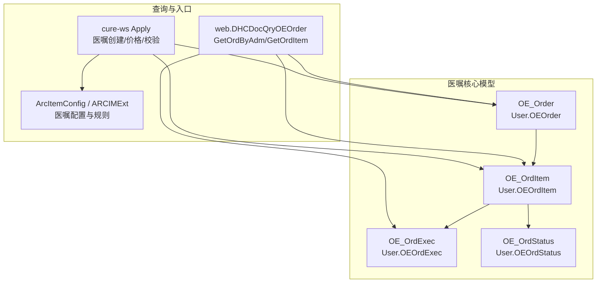
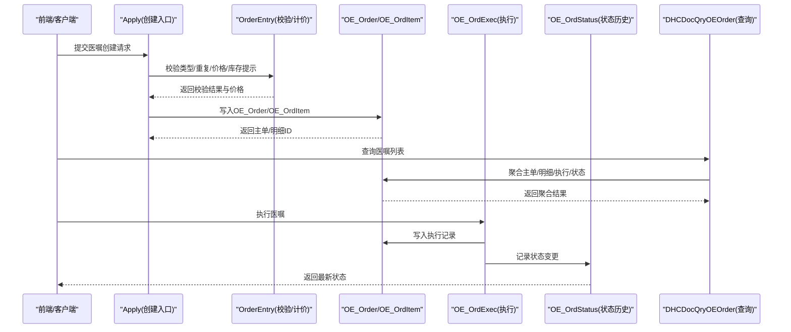
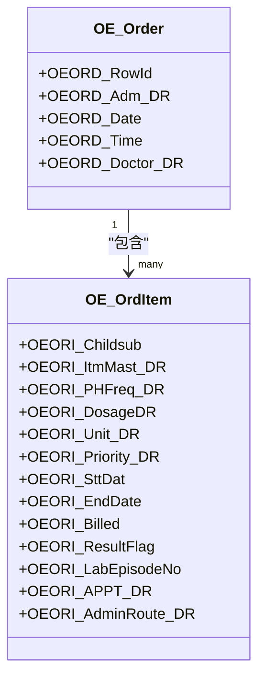
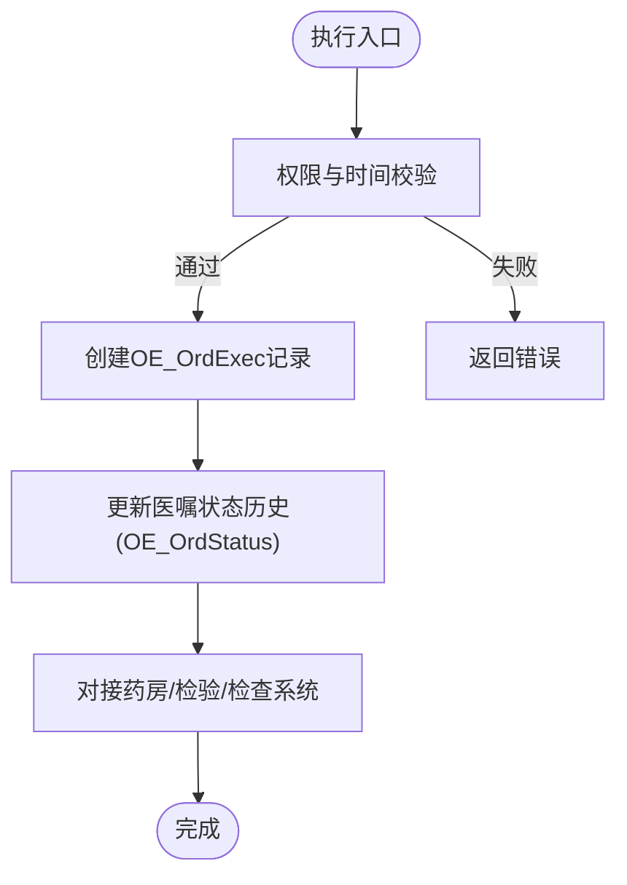
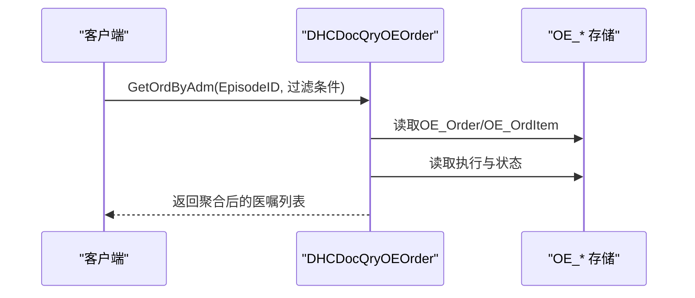
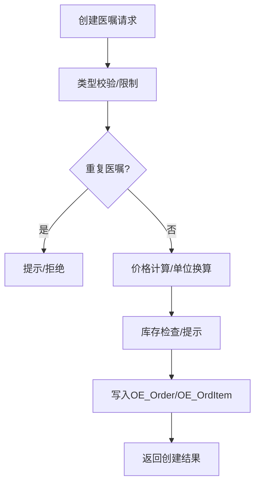
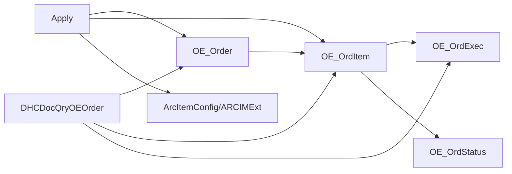

# 医嘱管理接口

<cite>
**本文引用的文件**
- [OEOrder.cls](file://src/backend/doc-ws/User/OEOrder.cls)
- [OEOrdItem.cls](file://src/backend/doc-ws/User/OEOrdItem.cls)
- [OEOrdExec.cls](file://src/backend/doc-ws/User/OEOrdExec.cls)
- [OEOrdStatus.cls](file://src/backend/doc-ws/User/OEOrdStatus.cls)
- [DHCDocQryOEOrder.cls](file://src/backend/doc-ws/web/DHCDocQryOEOrder.cls)
- [Apply.cls](file://src/backend/cure-ws/DHCDoc/DHCDocCure/Apply.cls)
- [ArcItemConfig.cls](file://src/backend/doc-ws/DHCDoc/DHCDocConfig/ArcItemConfig.cls)
- [ARCIMExt.cls](file://src/backend/doc-ws/DHCDoc/DHCDocConfig/ARCIMExt.cls)
</cite>

## 目录
1. [简介](#简介)
2. [项目结构](#项目结构)
3. [核心组件](#核心组件)
4. [架构总览](#架构总览)
5. [详细组件分析](#详细组件分析)
6. [依赖关系分析](#依赖关系分析)
7. [性能考虑](#性能考虑)
8. [故障排查指南](#故障排查指南)
9. [结论](#结论)
10. [附录](#附录)

## 简介
本文件面向医嘱管理相关API与后端服务，聚焦医嘱的创建、修改、停止、执行等全生命周期操作；覆盖医嘱类型处理、费用计算、库存检查、权限验证、时间控制与业务规则校验；说明与药房、检验、检查等系统的集成点与数据流转；并记录执行状态跟踪与变更历史。文档以代码级事实为依据，提供可追溯的源码路径与图示，帮助开发者快速定位实现与扩展点。

## 项目结构
围绕医嘱管理的核心实体与查询入口如下：
- 订单主表：OE_Order（User.OEOrder）
- 订单明细：OE_OrdItem（User.OEOrdItem）
- 执行记录：OE_OrdExec（User.OEOrdExec）
- 状态历史：OE_OrdStatus（User.OEOrdStatus）
- 医嘱查询：web.DHCDocQryOEOrder（GetOrdByAdm/GetOrdItem）
- 医嘱创建入口：cure-ws Apply 流程调用 web.DHCDocOrderEntry 系列方法
- 配置项：ArcItemConfig、ARCIMExt（用于医嘱属性、库存提示、自动停止策略等）

**图表来源**
- [OEOrder.cls:1-201](file://src/backend/doc-ws/User/OEOrder.cls#L1-L201)
- [OEOrdItem.cls:1-800](file://src/backend/doc-ws/User/OEOrdItem.cls#L1-L800)
- [OEOrdExec.cls:1-800](file://src/backend/doc-ws/User/OEOrdExec.cls#L1-L800)
- [OEOrdStatus.cls:1-158](file://src/backend/doc-ws/User/OEOrdStatus.cls#L1-L158)
- [DHCDocQryOEOrder.cls:1-800](file://src/backend/doc-ws/web/DHCDocQryOEOrder.cls#L1-L800)
- [Apply.cls:284-616](file://src/backend/cure-ws/DHCDoc/DHCDocCure/Apply.cls#L284-L616)
- [ArcItemConfig.cls:8-17](file://src/backend/doc-ws/DHCDoc/DHCDocConfig/ArcItemConfig.cls#L8-L17)
- [ARCIMExt.cls:180-227](file://src/backend/doc-ws/DHCDoc/DHCDocConfig/ARCIMExt.cls#L180-L227)

**章节来源**
- [OEOrder.cls:1-201](file://src/backend/doc-ws/User/OEOrder.cls#L1-L201)
- [OEOrdItem.cls:1-800](file://src/backend/doc-ws/User/OEOrdItem.cls#L1-L800)
- [OEOrdExec.cls:1-800](file://src/backend/doc-ws/User/OEOrdExec.cls#L1-L800)
- [OEOrdStatus.cls:1-158](file://src/backend/doc-ws/User/OEOrdStatus.cls#L1-L158)
- [DHCDocQryOEOrder.cls:1-800](file://src/backend/doc-ws/web/DHCDocQryOEOrder.cls#L1-L800)
- [Apply.cls:284-616](file://src/backend/cure-ws/DHCDoc/DHCDocCure/Apply.cls#L284-L616)
- [ArcItemConfig.cls:8-17](file://src/backend/doc-ws/DHCDoc/DHCDocConfig/ArcItemConfig.cls#L8-L17)
- [ARCIMExt.cls:180-227](file://src/backend/doc-ws/DHCDoc/DHCDocConfig/ARCIMExt.cls#L180-L227)

## 核心组件
- 医嘱主单（OE_Order）：承载就诊关联、开嘱医生、开嘱日期时间、账单关联等基础信息，并提供插入/更新/删除触发器以联动审计与动作类型。
- 医嘱明细（OE_OrdItem）：承载具体项目、频次、剂量、单位、优先级、起止时间、收费状态、执行结果、标本/报告绑定、配液/输液参数、医保与计费信息等。
- 医嘱执行（OE_OrdExec）：记录每次执行的开始/结束时间、执行人、执行数量、批号、签名、费用标记、医保标志、执行备注等，并维护多条执行子记录。
- 状态历史（OE_OrdStatus）：记录医嘱状态变更的时间、用户、原因与文本描述，形成可追溯的历史链。
- 查询服务（DHCDocQryOEOrder）：提供按就诊ID、时间范围、类别、状态等多维过滤的医嘱列表查询，聚合价格、包装单位、执行状态、打印标志、报告链接等展示字段。
- 创建入口（Apply）：在创建医嘱时进行类型校验、重复判断、价格计算、患者信息获取、单位换算、库存提示与自动停止策略读取等。

**章节来源**
- [OEOrder.cls:1-201](file://src/backend/doc-ws/User/OEOrder.cls#L1-L201)
- [OEOrdItem.cls:1-800](file://src/backend/doc-ws/User/OEOrdItem.cls#L1-L800)
- [OEOrdExec.cls:1-800](file://src/backend/doc-ws/User/OEOrdExec.cls#L1-L800)
- [OEOrdStatus.cls:1-158](file://src/backend/doc-ws/User/OEOrdStatus.cls#L1-L158)
- [DHCDocQryOEOrder.cls:1-800](file://src/backend/doc-ws/web/DHCDocQryOEOrder.cls#L1-L800)
- [Apply.cls:284-616](file://src/backend/cure-ws/DHCDoc/DHCDocCure/Apply.cls#L284-L616)

## 架构总览
医嘱生命周期从“创建→审核→执行→完成/停止”贯穿多个子系统：
- 创建阶段：通过 Apply 调用 OrderEntry 系列方法进行合法性校验、价格计算、库存提示、重复医嘱判断、患者信息加载。
- 查询阶段：通过 DHCDocQryOEOrder.GetOrdByAdm/GetOrdItem 聚合主单、明细、执行、状态、收费、报告等信息，供前端展示与筛选。
- 执行阶段：OE_OrdExec 记录每次执行细节，并与药房发药、检验申请、检查预约等外部系统交互（通过医嘱明细中的接收科室、报告/申请单标识等）。
- 状态追踪：OE_OrdStatus 持久化状态变更历史，支持按时间维度回溯。

**图表来源**
- [Apply.cls:284-616](file://src/backend/cure-ws/DHCDoc/DHCDocCure/Apply.cls#L284-L616)
- [DHCDocQryOEOrder.cls:1-800](file://src/backend/doc-ws/web/DHCDocQryOEOrder.cls#L1-L800)
- [OEOrdExec.cls:1-800](file://src/backend/doc-ws/User/OEOrdExec.cls#L1-L800)
- [OEOrdStatus.cls:1-158](file://src/backend/doc-ws/User/OEOrdStatus.cls#L1-L158)

## 详细组件分析

### 医嘱主单与明细（OE_Order / OE_OrdItem）
- 主单负责就诊上下文、开嘱医生、开嘱时间、账单关联等；明细承载具体项目、频次、剂量、单位、优先级、起止时间、收费与执行结果、标本/报告绑定、配液/输液参数、医保与计费信息等。
- 明细包含大量与执行相关的字段（如执行时间、执行人、执行数量、批号、签名、过敏/皮试、配液标志、流速等），以及结果与报告相关字段（如申请单号、报告URL、阳性/危急值等）。

**图表来源**
- [OEOrder.cls:1-201](file://src/backend/doc-ws/User/OEOrder.cls#L1-L201)
- [OEOrdItem.cls:1-800](file://src/backend/doc-ws/User/OEOrdItem.cls#L1-L800)

**章节来源**
- [OEOrder.cls:1-201](file://src/backend/doc-ws/User/OEOrder.cls#L1-L201)
- [OEOrdItem.cls:1-800](file://src/backend/doc-ws/User/OEOrdItem.cls#L1-L800)

### 医嘱执行（OE_OrdExec）
- 每条执行记录包含执行开始/结束时间、执行人、执行数量、批号、签名、费用标记、医保标志、执行备注等；支持多次执行与状态变化。
- 提供多种索引（按执行日期、未执行集合、停止执行集合、体积等）以提升查询效率。

**图表来源**
- [OEOrdExec.cls:1-800](file://src/backend/doc-ws/User/OEOrdExec.cls#L1-L800)
- [OEOrdStatus.cls:1-158](file://src/backend/doc-ws/User/OEOrdStatus.cls#L1-L158)

**章节来源**
- [OEOrdExec.cls:1-800](file://src/backend/doc-ws/User/OEOrdExec.cls#L1-L800)
- [OEOrdStatus.cls:1-158](file://src/backend/doc-ws/User/OEOrdStatus.cls#L1-L158)

### 医嘱查询（DHCDocQryOEOrder）
- GetOrdByAdm/GetOrdItem 支持按就诊ID、时间范围、类别、子类、长期/短期/出院、毒麻、中医、状态等条件过滤；聚合价格、包装单位、执行状态、打印标志、报告链接、医保编码等展示字段。
- 对长期医嘱会扫描执行子集，判断是否仍有活跃执行；对已收费/退费/发药状态进行统一处理。

**图表来源**
- [DHCDocQryOEOrder.cls:1-800](file://src/backend/doc-ws/web/DHCDocQryOEOrder.cls#L1-L800)

**章节来源**
- [DHCDocQryOEOrder.cls:1-800](file://src/backend/doc-ws/web/DHCDocQryOEOrder.cls#L1-L800)

### 医嘱创建与校验（Apply）
- 在创建医嘱时调用 OrderEntry 系列方法进行类型校验、重复判断、价格计算、患者信息加载、单位换算、库存提示与自动停止策略读取。
- 涉及的关键点：
  - 类型校验与限制：CheckArcimType、年龄性别限制、同频次不同剂量等。
  - 重复医嘱判断：FindSameOrderItemFlagMethod。
  - 价格计算：GetOrderPrice，结合包装单位与基本单位换算。
  - 库存提示：AlertStockQty（来自ARCIMExt）。
  - 自动停止策略：StopAfterLongOrder、NotAutoStop、默认停止时间与天数。

**图表来源**
- [Apply.cls:284-616](file://src/backend/cure-ws/DHCDoc/DHCDocCure/Apply.cls#L284-L616)
- [ARCIMExt.cls:180-227](file://src/backend/doc-ws/DHCDoc/DHCDocConfig/ARCIMExt.cls#L180-L227)

**章节来源**
- [Apply.cls:284-616](file://src/backend/cure-ws/DHCDoc/DHCDocCure/Apply.cls#L284-L616)
- [ARCIMExt.cls:180-227](file://src/backend/doc-ws/DHCDoc/DHCDocConfig/ARCIMExt.cls#L180-L227)

### 医嘱类型与配置（ArcItemConfig / ARCIMExt）
- ArcItemConfig.FindAllItem：根据别名、是否允许长期、是否自动停止、附加医嘱等条件检索可用医嘱项。
- ARCIMExt.QueryItemToExcel：导出医嘱项扩展属性，包括是否草药、是否提示、需要备注、住院整数量、跨日修改权限、一个患者只允许开一次、重复判断天数、最小库存提示、自动停止策略等。

**章节来源**
- [ArcItemConfig.cls:8-17](file://src/backend/doc-ws/DHCDoc/DHCDocConfig/ArcItemConfig.cls#L8-L17)
- [ARCIMExt.cls:180-227](file://src/backend/doc-ws/DHCDoc/DHCDocConfig/ARCIMExt.cls#L180-L227)

## 依赖关系分析
- 医嘱主单与明细存在强耦合：主单提供就诊上下文，明细承载具体项目与执行信息。
- 执行记录与状态历史紧密关联：每次执行都会产生状态变更历史，便于审计与追溯。
- 查询服务依赖多表聚合：需高效索引与条件过滤以支撑复杂场景。
- 创建入口依赖配置与规则：医嘱项配置决定可开性、价格、库存提示与自动停止策略。

**图表来源**
- [OEOrder.cls:1-201](file://src/backend/doc-ws/User/OEOrder.cls#L1-L201)
- [OEOrdItem.cls:1-800](file://src/backend/doc-ws/User/OEOrdItem.cls#L1-L800)
- [OEOrdExec.cls:1-800](file://src/backend/doc-ws/User/OEOrdExec.cls#L1-L800)
- [OEOrdStatus.cls:1-158](file://src/backend/doc-ws/User/OEOrdStatus.cls#L1-L158)
- [DHCDocQryOEOrder.cls:1-800](file://src/backend/doc-ws/web/DHCDocQryOEOrder.cls#L1-L800)
- [Apply.cls:284-616](file://src/backend/cure-ws/DHCDoc/DHCDocCure/Apply.cls#L284-L616)
- [ArcItemConfig.cls:8-17](file://src/backend/doc-ws/DHCDoc/DHCDocConfig/ArcItemConfig.cls#L8-L17)
- [ARCIMExt.cls:180-227](file://src/backend/doc-ws/DHCDoc/DHCDocConfig/ARCIMExt.cls#L180-L227)

**章节来源**
- [OEOrder.cls:1-201](file://src/backend/doc-ws/User/OEOrder.cls#L1-L201)
- [OEOrdItem.cls:1-800](file://src/backend/doc-ws/User/OEOrdItem.cls#L1-L800)
- [OEOrdExec.cls:1-800](file://src/backend/doc-ws/User/OEOrdExec.cls#L1-L800)
- [OEOrdStatus.cls:1-158](file://src/backend/doc-ws/User/OEOrdStatus.cls#L1-L158)
- [DHCDocQryOEOrder.cls:1-800](file://src/backend/doc-ws/web/DHCDocQryOEOrder.cls#L1-L800)
- [Apply.cls:284-616](file://src/backend/cure-ws/DHCDoc/DHCDocCure/Apply.cls#L284-L616)
- [ArcItemConfig.cls:8-17](file://src/backend/doc-ws/DHCDoc/DHCDocConfig/ArcItemConfig.cls#L8-L17)
- [ARCIMExt.cls:180-227](file://src/backend/doc-ws/DHCDoc/DHCDocConfig/ARCIMExt.cls#L180-L227)

## 性能考虑
- 查询优化：DHCDocQryOEOrder 使用缓存临时表与条件过滤，减少全表扫描；OE_OrdExec 提供多种索引（执行日期、未执行集合、停止执行集合、体积等）提升查询效率。
- 价格计算：通过包装单位与基本单位换算，避免重复计算；对长期医嘱采用活跃执行判断，减少不必要遍历。
- 批量处理：创建与执行过程尽量合并事务，减少数据库往返；状态历史追加为轻量写入。

[本节为通用性能建议，不直接分析具体文件]

## 故障排查指南
- 创建失败：
  - 检查类型校验与限制（CheckArcimType、年龄性别限制）。
  - 检查重复医嘱判断（FindSameOrderItemFlagMethod）。
  - 检查价格计算与单位换算（GetOrderPrice）。
  - 参考路径：[Apply.cls:284-616](file://src/backend/cure-ws/DHCDoc/DHCDocCure/Apply.cls#L284-L616)
- 执行异常：
  - 检查权限与时间控制（执行入口逻辑）。
  - 检查执行记录是否成功写入（OE_OrdExec）。
  - 检查状态历史是否记录（OE_OrdStatus）。
  - 参考路径：[OEOrdExec.cls:1-800](file://src/backend/doc-ws/User/OEOrdExec.cls#L1-L800)、[OEOrdStatus.cls:1-158](file://src/backend/doc-ws/User/OEOrdStatus.cls#L1-L158)
- 查询无数据或数据不全：
  - 检查过滤条件（就诊ID、时间范围、类别、状态）。
  - 检查聚合逻辑（主单、明细、执行、状态）。
  - 参考路径：[DHCDocQryOEOrder.cls:1-800](file://src/backend/doc-ws/web/DHCDocQryOEOrder.cls#L1-L800)

**章节来源**
- [Apply.cls:284-616](file://src/backend/cure-ws/DHCDoc/DHCDocCure/Apply.cls#L284-L616)
- [OEOrdExec.cls:1-800](file://src/backend/doc-ws/User/OEOrdExec.cls#L1-L800)
- [OEOrdStatus.cls:1-158](file://src/backend/doc-ws/User/OEOrdStatus.cls#L1-L158)
- [DHCDocQryOEOrder.cls:1-800](file://src/backend/doc-ws/web/DHCDocQryOEOrder.cls#L1-L800)

## 结论
本仓库实现了完整的医嘱管理闭环：从创建、校验、计价、库存检查到执行、状态追踪与查询聚合。通过明确的实体模型（OE_Order/OE_OrdItem/OE_OrdExec/OE_OrdStatus）、强大的查询服务（DHCDocQryOEOrder）与灵活的配置（ArcItemConfig/ARCIMExt），系统能够支撑药房、检验、检查等多系统集成与复杂业务规则。建议在扩展新功能时优先复用现有校验与计价逻辑，确保一致性与可维护性。

[本节为总结性内容，不直接分析具体文件]

## 附录
- 医嘱生命周期关键路径参考：
  - 创建：[Apply.cls:284-616](file://src/backend/cure-ws/DHCDoc/DHCDocCure/Apply.cls#L284-L616)
  - 查询：[DHCDocQryOEOrder.cls:1-800](file://src/backend/doc-ws/web/DHCDocQryOEOrder.cls#L1-L800)
  - 执行：[OEOrdExec.cls:1-800](file://src/backend/doc-ws/User/OEOrdExec.cls#L1-L800)
  - 状态历史：[OEOrdStatus.cls:1-158](file://src/backend/doc-ws/User/OEOrdStatus.cls#L1-L158)
  - 配置：[ArcItemConfig.cls:8-17](file://src/backend/doc-ws/DHCDoc/DHCDocConfig/ArcItemConfig.cls#L8-L17)、[ARCIMExt.cls:180-227](file://src/backend/doc-ws/DHCDoc/DHCDocConfig/ARCIMExt.cls#L180-L227)

[本节为附录，不直接分析具体文件]