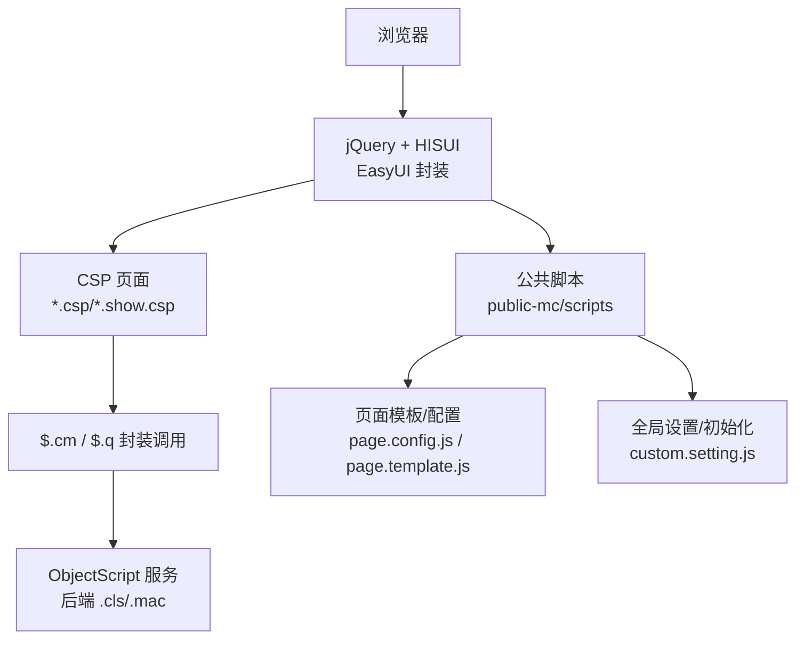
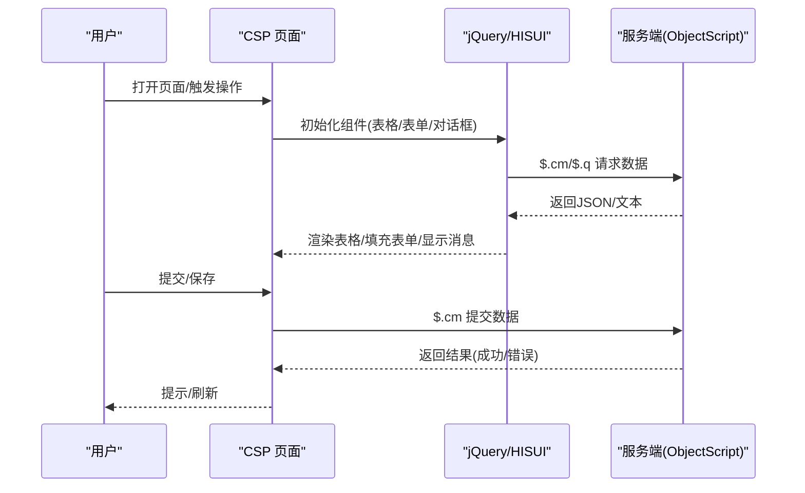
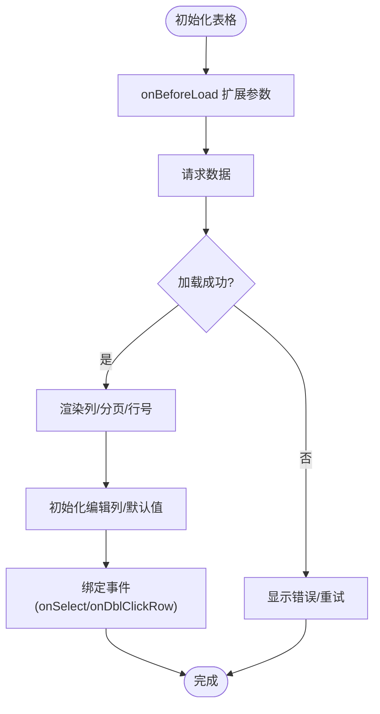
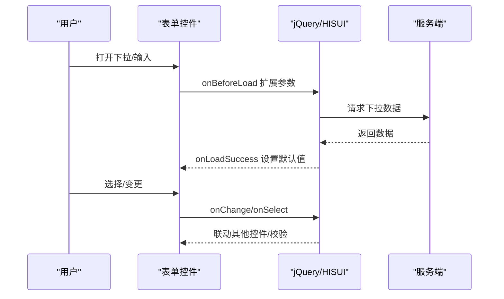
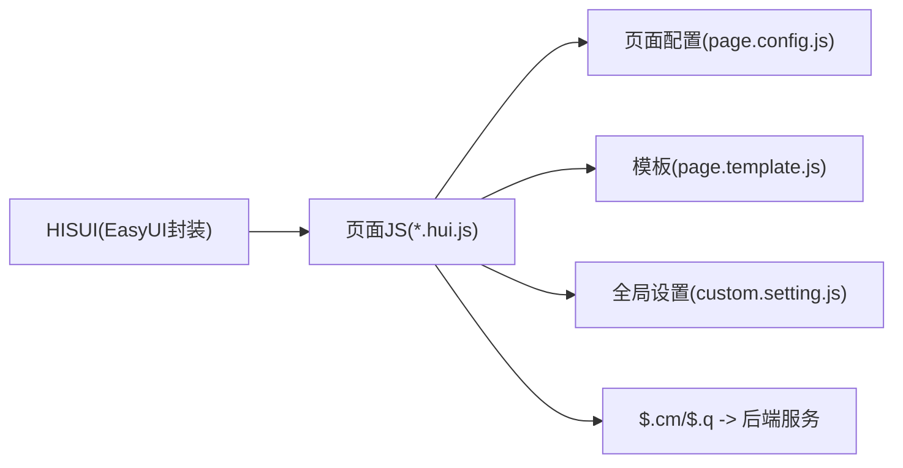

# UI组件库

<cite>
**本文引用的文件**
- [README.md](file://README.md)
- [DHCDoc.Interface.Outside.Config.hui.js](file://src/frontend/public-mc/scripts/DHCDoc.Interface.Outside.Config.hui.js)
- [page.config.js](file://src/frontend/public-mc/scripts/dhcdoc/page.config.js)
- [custom.setting.js](file://src/frontend/public-mc/scripts/dhcdoc/custom.setting.js)
- [page.template.js](file://src/frontend/public-mc/scripts/dhcdoc/page.template.js)
- [DHCDoc.Unit.js](file://src/frontend/public-mc/scripts/DHCDoc.Unit.js)
</cite>

## 目录
1. [简介](#简介)
2. [项目结构](#项目结构)
3. [核心组件](#核心组件)
4. [架构总览](#架构总览)
5. [详细组件分析](#详细组件分析)
6. [依赖关系分析](#依赖关系分析)
7. [性能考虑](#性能考虑)
8. [故障排查指南](#故障排查指南)
9. [结论](#结论)
10. [附录](#附录)

## 简介
本仓库为多产品 HIS（医院信息系统），前端采用 jQuery + HISUI（基于 EasyUI 二次封装）的传统静态资源模式，无 npm/webpack 等现代构建工具。HISUI 在项目中以统一的前端公共脚本与 CSP 页面形式提供表格、表单、对话框、树形控件等常用能力，并通过 $.cm/$.q 等封装方法与服务端 ObjectScript 交互。本文聚焦于 HISUI 的使用方式、配置选项、事件处理、样式定制、主题切换、国际化支持、组合使用模式、性能优化、可访问性与响应式适配，以及第三方插件集成与自定义组件开发指南。

## 项目结构
- 前端代码位于 src/frontend，按产品线划分（doc-ws、cure-ws、dental-ws、epmi-mc、opadm-mc、pilot-project-ws、pilot-study-ws、triage-ws、public-mc）。
- 公共资源集中在 public-mc/scripts，包含通用工具、页面模板、配置与插件。
- 后端通过 InterSystems IRIS ObjectScript 提供服务，前端通过 $.cm/$.q 调用。

图表来源
- [README.md:1-549](file://README.md#L1-L549)

章节来源
- [README.md:1-549](file://README.md#L1-L549)

## 核心组件
- 表格（DataGrid）：用于列表展示、分页、排序、编辑行、批量操作。常见于配置管理、查询结果展示。
- 表单（Combobox/Checkbox/Numberbox/Timespinner）：用于数据录入、校验、联动加载。
- 对话框（Dialog/Window/Messager）：用于弹出确认、提示、模态窗口。
- 树形控件（Tree/Combobox Tree）：用于层级选择（如科室、分类）。
- 编辑器（CodeMirror）：用于代码/模板编辑与格式化。
- 工具函数：身份证解析、性别推导、校验等。

章节来源
- [DHCDoc.Interface.Outside.Config.hui.js:114-168](file://src/frontend/public-mc/scripts/DHCDoc.Interface.Outside.Config.hui.js#L114-L168)
- [DHCDoc.Interface.Outside.Config.hui.js:219-245](file://src/frontend/public-mc/scripts/DHCDoc.Interface.Outside.Config.hui.js#L219-L245)
- [DHCDoc.Interface.Outside.Config.hui.js:674-709](file://src/frontend/public-mc/scripts/DHCDoc.Interface.Outside.Config.hui.js#L674-L709)
- [page.config.js:136-187](file://src/frontend/public-mc/scripts/dhcdoc/page.config.js#L136-L187)
- [page.template.js:54-112](file://src/frontend/public-mc/scripts/dhcdoc/page.template.js#L54-L112)
- [DHCDoc.Unit.js:13-131](file://src/frontend/public-mc/scripts/DHCDoc.Unit.js#L13-L131)

## 架构总览
HISUI 作为 EasyUI 的院内封装，统一了组件 API 与交互风格。页面通过 CSP 组织视图，JS 逻辑集中在 scripts 目录，借助 $.cm/$.q 与后端通信。公共配置与模板化能力由 page.config.js、page.template.js、custom.setting.js 等提供。

图表来源
- [DHCDoc.Interface.Outside.Config.hui.js:423-524](file://src/frontend/public-mc/scripts/DHCDoc.Interface.Outside.Config.hui.js#L423-L524)
- [page.config.js:252-276](file://src/frontend/public-mc/scripts/dhcdoc/page.config.js#L252-L276)
- [page.template.js:126-156](file://src/frontend/public-mc/scripts/dhcdoc/page.template.js#L126-L156)

## 详细组件分析

### 表格（DataGrid）
- 典型用法：定义列、分页、行号、单/多选、排序、编辑列、工具栏按钮、加载回调。
- 关键配置项：fit、striped、rownumbers、pagination、pageSize、pageList、columns、toolbar、onBeforeLoad、onLoadSuccess、onSelect、onDblClickRow。
- 事件处理：onBeforeLoad 扩展参数；onLoadSuccess 初始化编辑框或默认值；onSelect 更新关联数据。
- 示例路径：
  - 安全组列表 DataGrid：[DHCDoc.Interface.Outside.Config.hui.js:114-168](file://src/frontend/public-mc/scripts/DHCDoc.Interface.Outside.Config.hui.js#L114-L168)
  - 二级科室排序编辑 DataGrid：[DHCDoc.Interface.Outside.Config.hui.js:674-709](file://src/frontend/public-mc/scripts/DHCDoc.Interface.Outside.Config.hui.js#L674-L709)
  - 页面模板维护 DataGrid：[page.template.js:54-112](file://src/frontend/public-mc/scripts/dhcdoc/page.template.js#L54-L112)
  - 页面配置主表 DataGrid：[page.config.js:136-187](file://src/frontend/public-mc/scripts/dhcdoc/page.config.js#L136-L187)

图表来源
- [DHCDoc.Interface.Outside.Config.hui.js:114-168](file://src/frontend/public-mc/scripts/DHCDoc.Interface.Outside.Config.hui.js#L114-L168)
- [DHCDoc.Interface.Outside.Config.hui.js:674-709](file://src/frontend/public-mc/scripts/DHCDoc.Interface.Outside.Config.hui.js#L674-L709)
- [page.template.js:54-112](file://src/frontend/public-mc/scripts/dhcdoc/page.template.js#L54-L112)
- [page.config.js:136-187](file://src/frontend/public-mc/scripts/dhcdoc/page.config.js#L136-L187)

章节来源
- [DHCDoc.Interface.Outside.Config.hui.js:114-168](file://src/frontend/public-mc/scripts/DHCDoc.Interface.Outside.Config.hui.js#L114-L168)
- [DHCDoc.Interface.Outside.Config.hui.js:674-709](file://src/frontend/public-mc/scripts/DHCDoc.Interface.Outside.Config.hui.js#L674-L709)
- [page.template.js:54-112](file://src/frontend/public-mc/scripts/dhcdoc/page.template.js#L54-L112)
- [page.config.js:136-187](file://src/frontend/public-mc/scripts/dhcdoc/page.config.js#L136-L187)

### 表单（Combobox/Checkbox/Numberbox/Timespinner）
- 典型用法：远程加载下拉数据、设置 valueField/textField、editable 控制、onSelect/onLoadSuccess 联动。
- 关键配置项：url、valueField、textField、editable、rows、onBeforeLoad、onLoadSuccess、onChange。
- 事件处理：onBeforeLoad 注入 Session/用户信息；onLoadSuccess 设置默认值；onChange 联动其他控件。
- 示例路径：
  - 通用 SetElementData 赋值：[DHCDoc.Interface.Outside.Config.hui.js:219-245](file://src/frontend/public-mc/scripts/DHCDoc.Interface.Outside.Config.hui.js#L219-L245)
  - 列表初始化与默认值：[DHCDoc.Interface.Outside.Config.hui.js:337-395](file://src/frontend/public-mc/scripts/DHCDoc.Interface.Outside.Config.hui.js#L337-L395)
  - 全局设置中的 Combobox 初始化：[custom.setting.js:10-69](file://src/frontend/public-mc/scripts/dhcdoc/custom.setting.js#L10-L69)
  - 类名/方法名远程搜索 Combobox：[page.config.js:84-133](file://src/frontend/public-mc/scripts/dhcdoc/page.config.js#L84-L133)

图表来源
- [DHCDoc.Interface.Outside.Config.hui.js:219-245](file://src/frontend/public-mc/scripts/DHCDoc.Interface.Outside.Config.hui.js#L219-L245)
- [DHCDoc.Interface.Outside.Config.hui.js:337-395](file://src/frontend/public-mc/scripts/DHCDoc.Interface.Outside.Config.hui.js#L337-L395)
- [custom.setting.js:10-69](file://src/frontend/public-mc/scripts/dhcdoc/custom.setting.js#L10-L69)
- [page.config.js:84-133](file://src/frontend/public-mc/scripts/dhcdoc/page.config.js#L84-L133)

章节来源
- [DHCDoc.Interface.Outside.Config.hui.js:219-245](file://src/frontend/public-mc/scripts/DHCDoc.Interface.Outside.Config.hui.js#L219-L245)
- [DHCDoc.Interface.Outside.Config.hui.js:337-395](file://src/frontend/public-mc/scripts/DHCDoc.Interface.Outside.Config.hui.js#L337-L395)
- [custom.setting.js:10-69](file://src/frontend/public-mc/scripts/dhcdoc/custom.setting.js#L10-L69)
- [page.config.js:84-133](file://src/frontend/public-mc/scripts/dhcdoc/page.config.js#L84-L133)

### 对话框与消息（Dialog/Window/Messager）
- 典型用法：弹出确认/提示、打开模态窗口、关闭/刷新。
- 关键 API：$.messager.alert/confirm/popover/show；window('open'/'close')。
- 示例路径：
  - 保存/重置/提示消息：[DHCDoc.Interface.Outside.Config.hui.js:423-524](file://src/frontend/public-mc/scripts/DHCDoc.Interface.Outside.Config.hui.js#L423-L524)
  - 页面配置弹窗：[page.config.js:221-280](file://src/frontend/public-mc/scripts/dhcdoc/page.config.js#L221-L280)
  - 模板保存/下载提示：[page.template.js:126-156](file://src/frontend/public-mc/scripts/dhcdoc/page.template.js#L126-L156)

章节来源
- [DHCDoc.Interface.Outside.Config.hui.js:423-524](file://src/frontend/public-mc/scripts/DHCDoc.Interface.Outside.Config.hui.js#L423-L524)
- [page.config.js:221-280](file://src/frontend/public-mc/scripts/dhcdoc/page.config.js#L221-L280)
- [page.template.js:126-156](file://src/frontend/public-mc/scripts/dhcdoc/page.template.js#L126-L156)

### 树形控件（Tree/Combobox Tree）
- 典型用法：层级选择（如科室、分类），常以 Combobox 的树形模式或独立 Tree 实现。
- 示例路径：
  - 二级科室排序编辑中动态加载子级数据：[DHCDoc.Interface.Outside.Config.hui.js:674-709](file://src/frontend/public-mc/scripts/DHCDoc.Interface.Outside.Config.hui.js#L674-L709)

章节来源
- [DHCDoc.Interface.Outside.Config.hui.js:674-709](file://src/frontend/public-mc/scripts/DHCDoc.Interface.Outside.Config.hui.js#L674-L709)

### 编辑器（CodeMirror）
- 典型用法：代码/模板编辑、自动格式化、保存内容到后端。
- 示例路径：
  - 页面配置编辑器初始化与保存：[page.config.js:60-78](file://src/frontend/public-mc/scripts/dhcdoc/page.config.js#L60-L78)、[page.config.js:429-458](file://src/frontend/public-mc/scripts/dhcdoc/page.config.js#L429-L458)
  - 模板编辑器初始化与保存：[page.template.js:32-48](file://src/frontend/public-mc/scripts/dhcdoc/page.template.js#L32-L48)、[page.template.js:173-220](file://src/frontend/public-mc/scripts/dhcdoc/page.template.js#L173-L220)

章节来源
- [page.config.js:60-78](file://src/frontend/public-mc/scripts/dhcdoc/page.config.js#L60-L78)
- [page.config.js:429-458](file://src/frontend/public-mc/scripts/dhcdoc/page.config.js#L429-L458)
- [page.template.js:32-48](file://src/frontend/public-mc/scripts/dhcdoc/page.template.js#L32-L48)
- [page.template.js:173-220](file://src/frontend/public-mc/scripts/dhcdoc/page.template.js#L173-L220)

### 工具函数（ID 解析/校验）
- 功能：根据身份证号计算出生日期、性别、校验身份证合法性。
- 示例路径：[DHCDoc.Unit.js:13-131](file://src/frontend/public-mc/scripts/DHCDoc.Unit.js#L13-L131)

章节来源
- [DHCDoc.Unit.js:13-131](file://src/frontend/public-mc/scripts/DHCDoc.Unit.js#L13-L131)

## 依赖关系分析
- 组件层：HISUI（基于 EasyUI）提供统一 API，页面通过 jQuery 调用。
- 业务层：各 *.hui.js 文件负责具体页面的组件初始化、事件绑定、数据加载与保存。
- 服务层：$.cm/$.q 封装 HTTP 调用，对接 ObjectScript 服务。
- 配置层：page.config.js、page.template.js、custom.setting.js 提供页面模板、元素映射、全局设置。

图表来源
- [DHCDoc.Interface.Outside.Config.hui.js:114-168](file://src/frontend/public-mc/scripts/DHCDoc.Interface.Outside.Config.hui.js#L114-L168)
- [page.config.js:136-187](file://src/frontend/public-mc/scripts/dhcdoc/page.config.js#L136-L187)
- [page.template.js:54-112](file://src/frontend/public-mc/scripts/dhcdoc/page.template.js#L54-L112)
- [custom.setting.js:10-69](file://src/frontend/public-mc/scripts/dhcdoc/custom.setting.js#L10-L69)

章节来源
- [DHCDoc.Interface.Outside.Config.hui.js:114-168](file://src/frontend/public-mc/scripts/DHCDoc.Interface.Outside.Config.hui.js#L114-L168)
- [page.config.js:136-187](file://src/frontend/public-mc/scripts/dhcdoc/page.config.js#L136-L187)
- [page.template.js:54-112](file://src/frontend/public-mc/scripts/dhcdoc/page.template.js#L54-L112)
- [custom.setting.js:10-69](file://src/frontend/public-mc/scripts/dhcdoc/custom.setting.js#L10-L69)

## 性能考虑
- 延迟加载：Combobox 仅在面板显示时加载数据，减少首屏开销（参考 page.config.js 的 onShowPanel 逻辑）。
- 分页与限制：DataGrid 合理设置 pageSize/pageList，避免一次性加载过多数据。
- 局部刷新：onSelect/onChange 仅刷新必要区域，减少重绘。
- 缓存策略：对字典/下拉数据可考虑本地缓存，降低重复请求。
- 编辑器优化：按需加载 CodeMirror，避免不必要的实例化。

章节来源
- [page.config.js:84-133](file://src/frontend/public-mc/scripts/dhcdoc/page.config.js#L84-L133)
- [DHCDoc.Interface.Outside.Config.hui.js:114-168](file://src/frontend/public-mc/scripts/DHCDoc.Interface.Outside.Config.hui.js#L114-L168)

## 故障排查指南
- 键盘事件冲突：Backspace 在空白处可能触发浏览器后退，需拦截并阻止默认行为（参考 Doc_OnKeyDown）。
- 下拉值无效：CheckComboValue 校验选择值是否在数据集中，否则提示重新选择。
- 时间格式校验：OutRegStartTime/OutRegEndTime 需符合 HH:mm 格式，否则提示错误。
- 保存失败：$.cm 返回非 0 时，读取返回信息并提示用户。

章节来源
- [DHCDoc.Interface.Outside.Config.hui.js:553-582](file://src/frontend/public-mc/scripts/DHCDoc.Interface.Outside.Config.hui.js#L553-L582)
- [DHCDoc.Interface.Outside.Config.hui.js:584-608](file://src/frontend/public-mc/scripts/DHCDoc.Interface.Outside.Config.hui.js#L584-L608)
- [DHCDoc.Interface.Outside.Config.hui.js:423-524](file://src/frontend/public-mc/scripts/DHCDoc.Interface.Outside.Config.hui.js#L423-L524)

## 结论
本项目以 HISUI（EasyUI 封装）为核心，结合 jQuery 与传统 CSP 页面，提供了稳定的表格、表单、对话框、树形控件与编辑器能力。通过 page.config.js、page.template.js、custom.setting.js 等配置文件，实现了页面模板化、元素映射与全局设置。配合 $.cm/$.q 与服务端 ObjectScript 交互，形成清晰的前后端分离架构。建议在后续开发中继续遵循延迟加载、分页限制、局部刷新等性能优化实践，并完善可访问性与响应式适配。

## 附录
- 组件样式定制：可通过覆盖 CSS 或使用 HISUI 提供的样式类进行主题定制。
- 主题切换：建议在全局设置中提供主题切换入口，动态替换样式文件。
- 国际化支持：使用 $g() 等方法获取本地化文本，便于多语言切换。
- 组件组合使用：表格+表单+对话框常用于“查看-编辑-确认”流程；树形控件常与表单联动。
- 第三方插件集成：如 CodeMirror，需在页面初始化时按需加载并配置。
- 自定义组件开发：基于 HISUI 扩展新组件，遵循统一的 API 约定与事件模型，确保与现有组件一致。