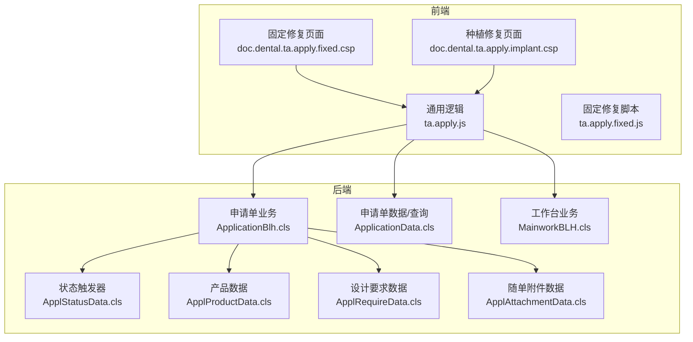
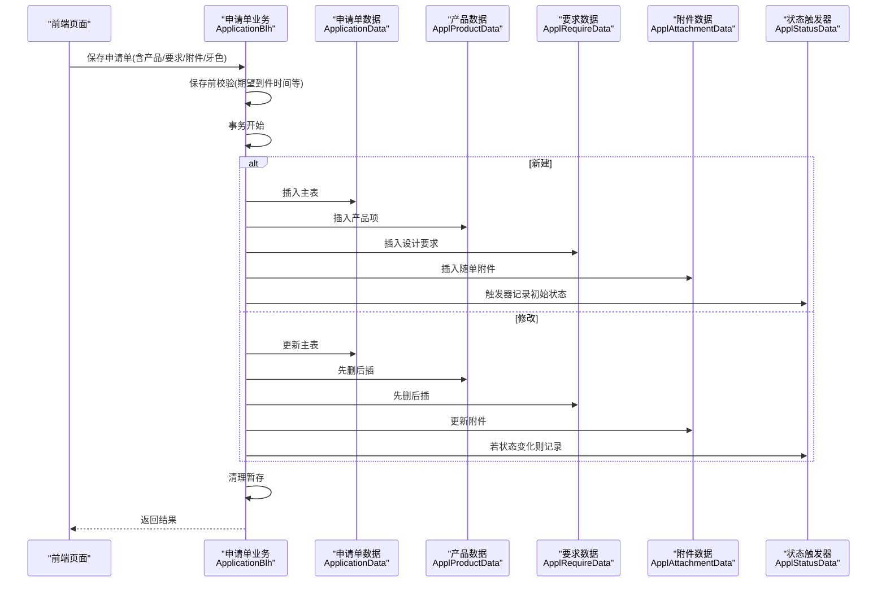
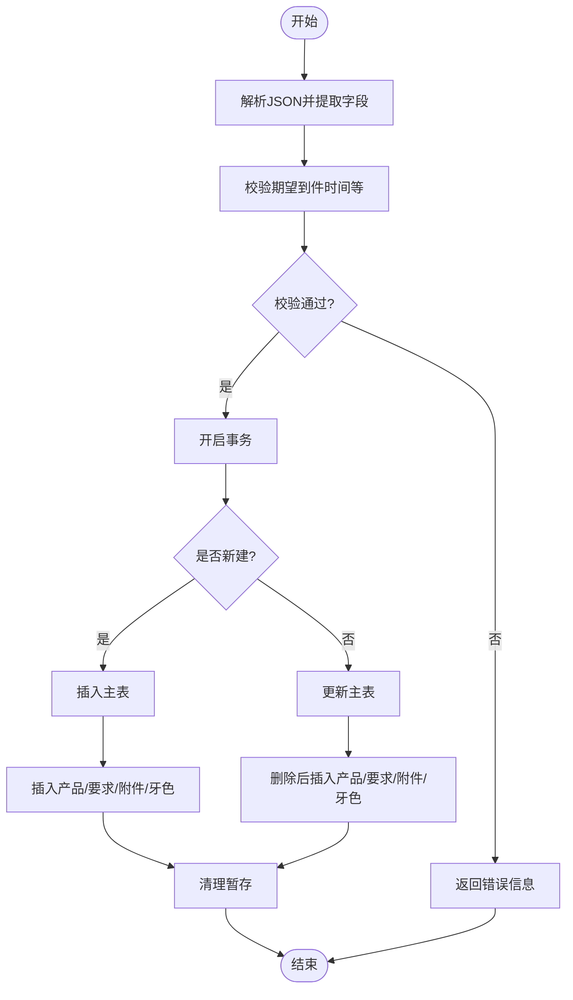
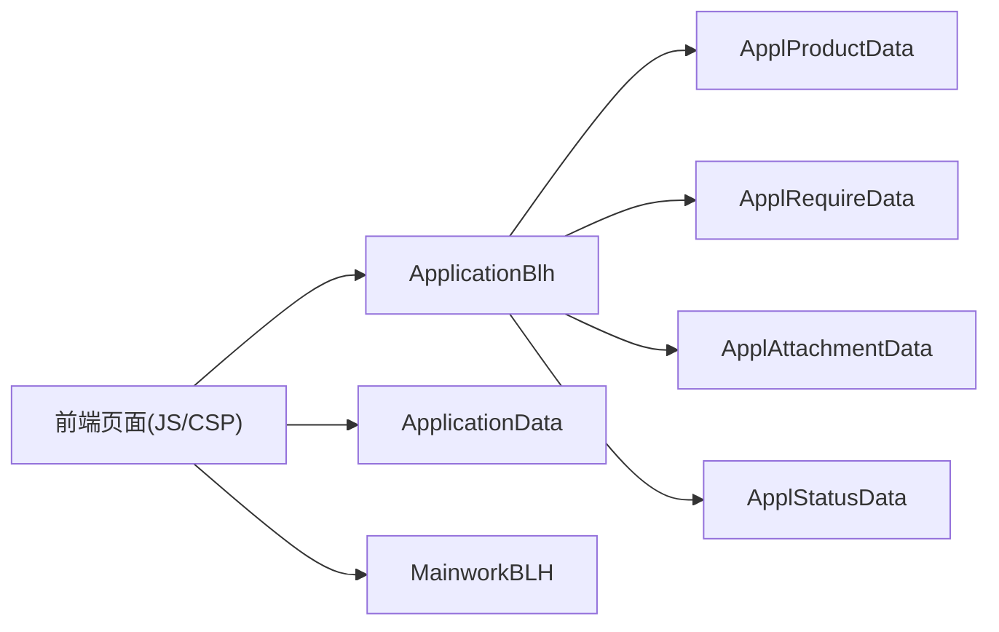

# 牙科申请管理

<cite>
**本文引用的文件**
- [ApplicationBlh.cls](file://src/backend/dental-ws/DHCDoc/Dental/TA/ApplicationBlh.cls)
- [ApplicationData.cls](file://src/backend/dental-ws/DHCDoc/Dental/TA/ApplicationData.cls)
- [MainworkBLH.cls](file://src/backend/dental-ws/DHCDoc/Dental/TA/MainworkBLH.cls)
- [ApplStatusData.cls](file://src/backend/dental-ws/DHCDoc/Dental/TA/ApplStatusData.cls)
- [ApplProductData.cls](file://src/backend/dental-ws/DHCDoc/Dental/TA/ApplProductData.cls)
- [ApplRequireData.cls](file://src/backend/dental-ws/DHCDoc/Dental/TA/ApplRequireData.cls)
- [ApplAttachmentData.cls](file://src/backend/dental-ws/DHCDoc/Dental/TA/ApplAttachmentData.cls)
- [doc.dental.ta.apply.fixed.csp](file://src/frontend/dental-ws/csp/doc.dental.ta.apply.fixed.csp)
- [doc.dental.ta.apply.implant.csp](file://src/frontend/dental-ws/csp/doc.dental.ta.apply.implant.csp)
- [ta.apply.js](file://src/frontend/dental-ws/scripts/dhcdoc/dental/ta.apply.js)
- [ta.apply.fixed.js](file://src/frontend/dental-ws/scripts/dhcdoc/dental/ta.apply.fixed.js)
</cite>

## 目录
1. [简介](#简介)
2. [项目结构](#项目结构)
3. [核心组件](#核心组件)
4. [架构总览](#架构总览)
5. [详细组件分析](#详细组件分析)
6. [依赖关系分析](#依赖关系分析)
7. [性能考虑](#性能考虑)
8. [故障排查指南](#故障排查指南)
9. [结论](#结论)
10. [附录](#附录)

## 简介
本模块为牙科技工申请管理，覆盖固定修复、种植修复、正畸治疗等类型申请的创建、编辑、暂存、提交与状态流转。系统提供申请单主数据、产品（修复体）、设计要求、牙色、随单附件、牙位图等信息的持久化与查询；支持批量扫描单号进行状态变更；提供历史记录查询与打印能力；通过字典配置实现模板扩展与多语言展示。

## 项目结构
后端以业务类（BLH/Data）组织：申请单保存与校验、查询与历史、状态触发器、产品/要求/附件等子表数据存取；前端以CSP页面承载不同修复类型的表单，并通过JS调用后端接口完成数据交互。

图表来源
- [doc.dental.ta.apply.fixed.csp:1-33](file://src/frontend/dental-ws/csp/doc.dental.ta.apply.fixed.csp#L1-L33)
- [doc.dental.ta.apply.implant.csp:1-36](file://src/frontend/dental-ws/csp/doc.dental.ta.apply.implant.csp#L1-L36)
- [ta.apply.js:1-200](file://src/frontend/dental-ws/scripts/dhcdoc/dental/ta.apply.js#L1-L200)
- [ApplicationBlh.cls:1-302](file://src/backend/dental-ws/DHCDoc/Dental/TA/ApplicationBlh.cls#L1-L302)
- [ApplicationData.cls:1-373](file://src/backend/dental-ws/DHCDoc/Dental/TA/ApplicationData.cls#L1-L373)
- [ApplStatusData.cls:1-157](file://src/backend/dental-ws/DHCDoc/Dental/TA/ApplStatusData.cls#L1-L157)
- [ApplProductData.cls:1-97](file://src/backend/dental-ws/DHCDoc/Dental/TA/ApplProductData.cls#L1-L97)
- [ApplRequireData.cls:1-114](file://src/backend/dental-ws/DHCDoc/Dental/TA/ApplRequireData.cls#L1-L114)
- [ApplAttachmentData.cls:1-56](file://src/backend/dental-ws/DHCDoc/Dental/TA/ApplAttachmentData.cls#L1-L56)

章节来源
- [doc.dental.ta.apply.fixed.csp:1-33](file://src/frontend/dental-ws/csp/doc.dental.ta.apply.fixed.csp#L1-L33)
- [doc.dental.ta.apply.implant.csp:1-36](file://src/frontend/dental-ws/csp/doc.dental.ta.apply.implant.csp#L1-L36)
- [ta.apply.js:1-200](file://src/frontend/dental-ws/scripts/dhcdoc/dental/ta.apply.js#L1-L200)
- [ApplicationBlh.cls:1-302](file://src/backend/dental-ws/DHCDoc/Dental/TA/ApplicationBlh.cls#L1-L302)
- [ApplicationData.cls:1-373](file://src/backend/dental-ws/DHCDoc/Dental/TA/ApplicationData.cls#L1-L373)
- [ApplStatusData.cls:1-157](file://src/backend/dental-ws/DHCDoc/Dental/TA/ApplStatusData.cls#L1-L157)
- [ApplProductData.cls:1-97](file://src/backend/dental-ws/DHCDoc/Dental/TA/ApplProductData.cls#L1-L97)
- [ApplRequireData.cls:1-114](file://src/backend/dental-ws/DHCDoc/Dental/TA/ApplRequireData.cls#L1-L114)
- [ApplAttachmentData.cls:1-56](file://src/backend/dental-ws/DHCDoc/Dental/TA/ApplAttachmentData.cls#L1-L56)

## 核心组件
- 申请单业务类：负责保存/更新申请单主表及子表（产品、要求、牙色、附件），包含保存前校验、状态更新、暂存/取回暂存数据、牙位图读写。
- 申请单数据类：提供列表查询、按患者历史查询、JSON序列化、类型解析等。
- 状态触发器：在插入/更新后自动记录状态变更日志，并初始化技工室子表。
- 产品/要求/附件数据类：分别维护对应子表的增删改查与汇总信息。
- 工作台业务类：提供按钮显示控制、状态字典获取、按单号扫描批量变更状态。

章节来源
- [ApplicationBlh.cls:1-302](file://src/backend/dental-ws/DHCDoc/Dental/TA/ApplicationBlh.cls#L1-L302)
- [ApplicationData.cls:1-373](file://src/backend/dental-ws/DHCDoc/Dental/TA/ApplicationData.cls#L1-L373)
- [ApplStatusData.cls:1-157](file://src/backend/dental-ws/DHCDoc/Dental/TA/ApplStatusData.cls#L1-L157)
- [ApplProductData.cls:1-97](file://src/backend/dental-ws/DHCDoc/Dental/TA/ApplProductData.cls#L1-L97)
- [ApplRequireData.cls:1-114](file://src/backend/dental-ws/DHCDoc/Dental/TA/ApplRequireData.cls#L1-L114)
- [ApplAttachmentData.cls:1-56](file://src/backend/dental-ws/DHCDoc/Dental/TA/ApplAttachmentData.cls#L1-L56)
- [MainworkBLH.cls:1-102](file://src/backend/dental-ws/DHCDoc/Dental/TA/MainworkBLH.cls#L1-L102)

## 架构总览
前端页面加载后，根据修复类型渲染对应表单；用户填写并提交时，前端组装JSON并调用后端保存接口；后端执行校验、事务写入主从表，并在必要时触发状态记录；列表与历史通过查询接口返回聚合数据；工作台支持按单号扫描批量推进状态。

图表来源
- [ApplicationBlh.cls:1-302](file://src/backend/dental-ws/DHCDoc/Dental/TA/ApplicationBlh.cls#L1-L302)
- [ApplicationData.cls:1-373](file://src/backend/dental-ws/DHCDoc/Dental/TA/ApplicationData.cls#L1-L373)
- [ApplProductData.cls:1-97](file://src/backend/dental-ws/DHCDoc/Dental/TA/ApplProductData.cls#L1-L97)
- [ApplRequireData.cls:1-114](file://src/backend/dental-ws/DHCDoc/Dental/TA/ApplRequireData.cls#L1-L114)
- [ApplAttachmentData.cls:1-56](file://src/backend/dental-ws/DHCDoc/Dental/TA/ApplAttachmentData.cls#L1-L56)
- [ApplStatusData.cls:1-157](file://src/backend/dental-ws/DHCDoc/Dental/TA/ApplStatusData.cls#L1-L157)

## 详细组件分析

### 申请单保存与校验（ApplicationBlh）
- 保存流程：解析JSON，提取主表、产品、要求、牙色、附件；执行保存前校验；新建或更新主表；对子表执行“先删后插”或新增；最后清理暂存。
- 校验规则：期望到件时间必填、格式校验（YYYY-MM-DD HH:mm）、日期不小于当天。
- 状态更新：通过状态码映射ID后批量更新申请单状态。
- 暂存机制：按就诊ID+用户维度存储最新暂存JSON，支持恢复。
- 牙位图：封装调用统一牙位图服务进行保存与读取。

图表来源
- [ApplicationBlh.cls:1-302](file://src/backend/dental-ws/DHCDoc/Dental/TA/ApplicationBlh.cls#L1-L302)

章节来源
- [ApplicationBlh.cls:1-302](file://src/backend/dental-ws/DHCDoc/Dental/TA/ApplicationBlh.cls#L1-L302)

### 申请单查询与历史（ApplicationData）
- 列表查询：支持按患者、日期范围、状态、加工单位、开单医生、姓名等多条件过滤；可基于“状态变更日期”查询；返回聚合字段（如产品信息、技师、金额、打印次数等）。
- 历史查询：按患者与修复类型过滤，排除作废状态，支持按单号精确查询。
- JSON序列化：将主表字段转换为前端可用JSON，包括状态描述、预期时间、开单人、科室等。

章节来源
- [ApplicationData.cls:1-373](file://src/backend/dental-ws/DHCDoc/Dental/TA/ApplicationData.cls#L1-L373)

### 状态流转与触发器（ApplStatusData）
- 触发时机：申请单插入/更新后自动记录状态变更，包含操作人、IP、堆栈、操作类型等。
- 技工室子表：插入申请单时同步创建技工室记录，便于后续计划交期与备注管理。
- 状态排序：按字典排序生成完整状态链，用于前端流程图展示。

章节来源
- [ApplStatusData.cls:1-157](file://src/backend/dental-ws/DHCDoc/Dental/TA/ApplStatusData.cls#L1-L157)

### 产品、设计要求、随单附件（ApplProductData / ApplRequireData / ApplAttachmentData）
- 产品：支持多级层级字典，保存时计算层级ID串与描述；列表展示时拼接层级名称形成摘要。
- 设计要求：支持多选层级，保存时记录层级ID串与描述；可按申请单聚合文本描述。
- 随单附件：记录咬合记录、托盘、石膏模、旧牙数量及其他附件；提供易读文本汇总。

章节来源
- [ApplProductData.cls:1-97](file://src/backend/dental-ws/DHCDoc/Dental/TA/ApplProductData.cls#L1-L97)
- [ApplRequireData.cls:1-114](file://src/backend/dental-ws/DHCDoc/Dental/TA/ApplRequireData.cls#L1-L114)
- [ApplAttachmentData.cls:1-56](file://src/backend/dental-ws/DHCDoc/Dental/TA/ApplAttachmentData.cls#L1-L56)

### 前端页面与交互（CSP + JS）
- 固定修复/种植修复页面：CSP作为容器，注入服务端参数（就诊ID、患者ID、菜单ID、申请ID），引入通用与类型专属JS。
- 通用逻辑：初始化患者信息栏、历史工单iframe、字典下拉、期望到件时间控件与校验；编辑模式下禁用部分操作；加载已保存数据并恢复界面。
- 固定修复脚本：组合产品、牙色、要求、附件、牙位图的数据获取与初始化。

章节来源
- [doc.dental.ta.apply.fixed.csp:1-33](file://src/frontend/dental-ws/csp/doc.dental.ta.apply.fixed.csp#L1-L33)
- [doc.dental.ta.apply.implant.csp:1-36](file://src/frontend/dental-ws/csp/doc.dental.ta.apply.implant.csp#L1-L36)
- [ta.apply.js:1-200](file://src/frontend/dental-ws/scripts/dhcdoc/dental/ta.apply.js#L1-L200)
- [ta.apply.fixed.js:1-27](file://src/frontend/dental-ws/scripts/dhcdoc/dental/ta.apply.fixed.js#L1-L27)

### 批量操作与工作台（MainworkBLH）
- 按钮显示控制：根据登录用户组角色判断按钮可见性。
- 状态字典：按角色与页面操作过滤可用状态，支持国际化翻译。
- 扫描单号批量处理：校验当前状态是否允许目标操作，通过后调用状态更新接口，返回成功或失败信息。

章节来源
- [MainworkBLH.cls:1-102](file://src/backend/dental-ws/DHCDoc/Dental/TA/MainworkBLH.cls#L1-L102)

## 依赖关系分析
- 前端依赖后端接口：CSP页面通过JS调用后端业务类方法（保存、查询、状态更新等）。
- 后端内部耦合：ApplicationBlh依赖各子表数据类；状态触发器依赖字典与用户信息；查询类依赖字典与外部患者/用户服务。
- 无循环依赖：各组件职责清晰，通过接口方法解耦。

图表来源
- [ta.apply.js:1-200](file://src/frontend/dental-ws/scripts/dhcdoc/dental/ta.apply.js#L1-L200)
- [ApplicationBlh.cls:1-302](file://src/backend/dental-ws/DHCDoc/Dental/TA/ApplicationBlh.cls#L1-L302)
- [ApplicationData.cls:1-373](file://src/backend/dental-ws/DHCDoc/Dental/TA/ApplicationData.cls#L1-L373)
- [MainworkBLH.cls:1-102](file://src/backend/dental-ws/DHCDoc/Dental/TA/MainworkBLH.cls#L1-L102)
- [ApplProductData.cls:1-97](file://src/backend/dental-ws/DHCDoc/Dental/TA/ApplProductData.cls#L1-L97)
- [ApplRequireData.cls:1-114](file://src/backend/dental-ws/DHCDoc/Dental/TA/ApplRequireData.cls#L1-L114)
- [ApplAttachmentData.cls:1-56](file://src/backend/dental-ws/DHCDoc/Dental/TA/ApplAttachmentData.cls#L1-L56)
- [ApplStatusData.cls:1-157](file://src/backend/dental-ws/DHCDoc/Dental/TA/ApplStatusData.cls#L1-L157)

## 性能考虑
- 查询优化：列表查询使用索引遍历与缓存临时表，避免全表扫描；支持按状态变更日期快速定位。
- 事务边界：保存流程使用事务确保主从表一致性，失败回滚减少脏数据。
- 子表策略：修改采用“先删后插”，简化复杂更新逻辑但需注意大数据量时的开销。
- 字典与翻译：按需加载字典与翻译，减少不必要的数据传输。

[本节为通用指导，不直接分析具体文件]

## 故障排查指南
- 期望到件时间校验失败：检查前端输入格式与后端校验逻辑，确保符合“YYYY-MM-DD HH:mm”且日期不小于当天。
- 保存失败：查看事务内子表插入返回值，确认产品/要求/附件数据完整性与字典有效性。
- 状态变更失败：核对当前状态是否允许目标操作，检查状态字典配置与权限控制。
- 历史查询为空：确认患者DR、修复类型、日期范围与状态过滤条件是否正确。
- 暂存数据未恢复：检查暂存键（就诊ID+用户）是否存在，确认会话与服务器端存储一致。

章节来源
- [ApplicationBlh.cls:148-186](file://src/backend/dental-ws/DHCDoc/Dental/TA/ApplicationBlh.cls#L148-L186)
- [MainworkBLH.cls:69-99](file://src/backend/dental-ws/DHCDoc/Dental/TA/MainworkBLH.cls#L69-L99)
- [ApplicationData.cls:202-301](file://src/backend/dental-ws/DHCDoc/Dental/TA/ApplicationData.cls#L202-L301)

## 结论
本模块围绕牙科技工申请的核心流程，提供了完整的创建、编辑、暂存、提交与状态管理能力，并通过字典驱动实现灵活的业务扩展。前后端职责清晰、数据模型规范、事务与校验完善，能够满足固定修复、种植修复、正畸治疗等多种场景需求。建议在生产环境关注大数据量下的“先删后插”性能与字典配置的准确性。

[本节为总结，不直接分析具体文件]

## 附录

### 申请数据模型（概念）
- 申请单主表：包含就诊ID、患者ID、申请类型、状态、期望到件时间、复诊内容、取模方式、紧急标志、加工单位、期望/实际技师、备注、开单人、申请科室、打印次数、金额、技工备注、计划交期等。
- 产品项：关联修复体产品、层级、牙位、隔湿类型与厚度、分类、备注、层级ID串与描述。
- 设计要求：多选层级字典，记录层级ID串与描述，支持聚合文本。
- 牙色：牙齿颜色、基台颜色、混合色、遮色、活体比色、是否有比色照片、特殊打印颜色、类型。
- 随单附件：咬合记录数、托盘数、石膏模数、旧牙数、其他附件。
- 牙位图：与申请单关联的牙位标记与备注。

[本节为概念说明，不直接分析具体文件]

### 审批与状态流转（概念）
- 状态由字典配置，支持按角色与页面操作限制可用状态。
- 工作台中支持按单号扫描批量推进状态，前置校验当前状态合法性。
- 状态变更记录由触发器自动写入，便于追溯。

[本节为概念说明，不直接分析具体文件]

### 常见业务规则
- 期望到件时间必须大于等于当天，且格式严格。
- 修改申请单时，子表采用先删后插策略保证数据一致性。
- 历史查询排除作废状态，并按修复类型与日期范围过滤。
- 批量操作需满足当前状态允许的目标状态转换。

[本节为概念说明，不直接分析具体文件]