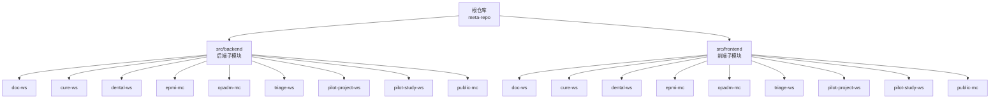
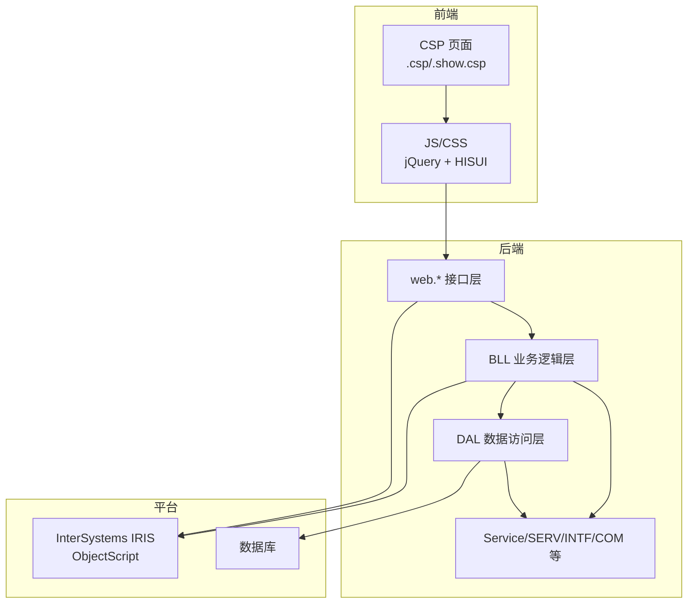
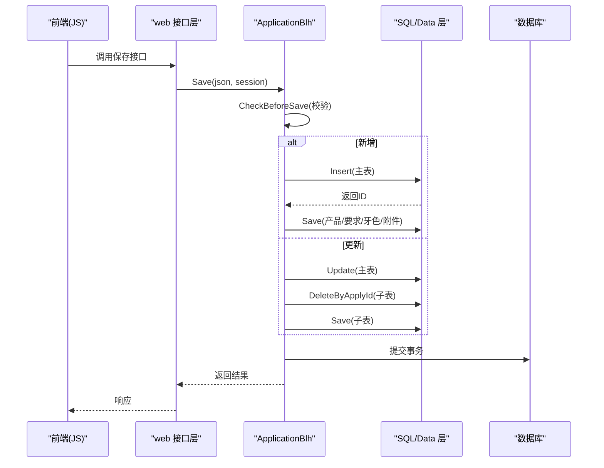
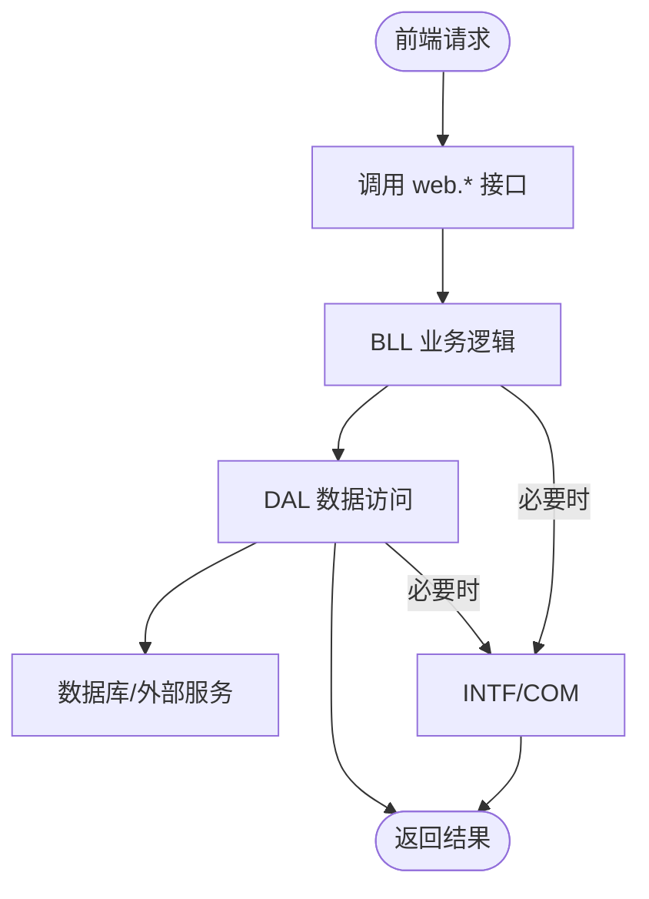
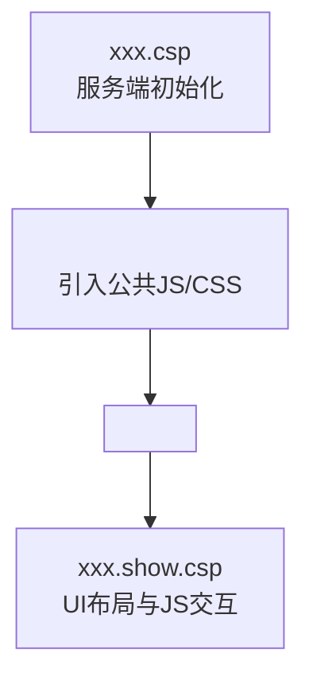
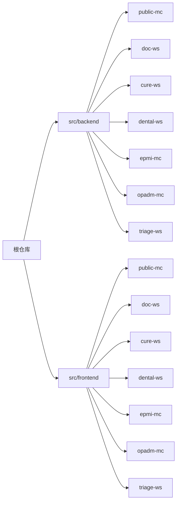

# 项目概述

<cite>
**本文引用的文件**
- [README.md](file://README.md)
- [.gitmodules](file://.gitmodules)
- [AGENTS.md](file://AGENTS.md)
- [ApplicationBlh.cls](file://src/backend/dental-ws/DHCDoc/Dental/TA/ApplicationBlh.cls)
</cite>

## 目录
1. [简介](#简介)
2. [项目结构](#项目结构)
3. [核心组件](#核心组件)
4. [架构总览](#架构总览)
5. [详细组件分析](#详细组件分析)
6. [依赖关系分析](#依赖关系分析)
7. [性能考虑](#性能考虑)
8. [故障排查指南](#故障排查指南)
9. [结论](#结论)
10. [附录：快速开始](#附录快速开始)

## 简介
IRIS HIS 医疗信息系统是一个多产品医院信息系统，后端基于 InterSystems IRIS 与 ObjectScript，前端采用 jQuery + HISUI（基于 EasyUI 二次封装）的传统 Web 技术栈。系统以“前后端分离、模块化产品化”为核心理念，通过 Git Submodule 将后端与前端分别作为独立子仓库管理，便于并行开发与统一发布。

本项目包含医生工作站、治疗系统、牙科系统、分诊系统、患者主索引、门诊挂号系统等核心业务模块，并提供公共方法与公共资源供各产品复用。整体设计强调：
- 模块化架构：按产品划分目录，公共能力下沉至 public-mc
- 前后端分离：前端 CSP + JS/CSS，后端 ObjectScript 类与 Routine
- 统一部署：后端通过 IRIS ObjectScript 扩展编译上传；前端通过脚本与 psftp 上传并编译 CSP
- 可维护性：统一的命名规范、翻译机制、缓存策略与 Git 工作流

**章节来源**
- [README.md:1-549](file://README.md#L1-L549)
- [AGENTS.md:1-299](file://AGENTS.md#L1-L299)

## 项目结构
根仓库为元仓库，仅包含两个 Git Submodule：
- src/backend：所有后端代码（ObjectScript .cls/.mac/.inc），通过 IRIS 扩展直接编译上传
- src/frontend：所有前端代码（CSP + jQuery/HISUI），通过脚本上传到服务器后编译 CSP

每个产品在后端与前端均有对应目录，例如 doc-ws、cure-ws、dental-ws、epmi-mc、opadm-mc、triage-ws、pilot-project-ws、pilot-study-ws，以及跨产品共享的 public-mc。

**图表来源**
- [README.md:5-52](file://README.md#L5-L52)
- [.gitmodules:1-7](file://.gitmodules#L1-L7)

**章节来源**
- [README.md:5-52](file://README.md#L5-L52)
- [.gitmodules:1-7](file://.gitmodules#L1-L7)

## 核心组件
- 医生工作站（doc-ws）：面向门诊/住院医生的综合工作站，涵盖医嘱、诊断、处方、报告等
- 治疗系统（cure-ws）：治疗计划、评估、排班、执行记录等
- 牙科系统（dental-ws）：口腔申请单、材料、牙色、技工加工流程等
- 分诊系统（triage-ws）：分诊规则、资源调度、队列状态等
- 患者主索引（epmi-mc）：患者主索引、卡片管理、就诊号管理等
- 门诊挂号系统（opadm-mc）：挂号、预约、排班、收费相关
- 试点项目/研究（pilot-project-ws / pilot-study-ws）：试点与临床试验场景
- 公共资源（public-mc）：跨产品共享的后端方法、配置与前端公共资源

这些模块在前后端均一一对应，并通过 public-mc 进行能力复用。

**章节来源**
- [README.md:12-32](file://README.md#L12-L32)
- [AGENTS.md:11-23](file://AGENTS.md#L11-L23)

## 架构总览
系统采用“前后端分离 + 后端三层架构”的设计：
- 前端：CSP 页面 + jQuery/HISUI，静态资源与页面逻辑分离
- 后端：web 接口层 → BLL 业务逻辑层 → DAL 数据访问层，必要时调用 INTF/COM 或外部服务
- 数据库与应用服务器：InterSystems IRIS，ObjectScript 语言，支持 CSP 动态页面
- 部署：后端通过 MCP 工具批量上传并编译；前端通过脚本与 psftp 上传后编译 CSP

**图表来源**
- [AGENTS.md:67-87](file://AGENTS.md#L67-L87)
- [README.md:526-536](file://README.md#L526-L536)

**章节来源**
- [AGENTS.md:67-87](file://AGENTS.md#L67-L87)
- [README.md:526-536](file://README.md#L526-L536)

## 详细组件分析

### 牙科系统申请单保存流程（示例）
以牙科系统的申请单保存为例，展示从前端到后端的调用链与事务处理：
- 前端通过 $.req/$.cm 调用 web 接口
- web 接口进入 ApplicationBlh.Save
- Save 解析 JSON，校验参数，开启事务
- 根据是否新增/更新，调用 SQL/Data 层插入或更新主表及子表（产品、设计要求、牙色、附件）
- 清理阶段状态，提交事务

**图表来源**
- [ApplicationBlh.cls:1-200](file://src/backend/dental-ws/DHCDoc/Dental/TA/ApplicationBlh.cls#L1-L200)

**章节来源**
- [ApplicationBlh.cls:1-200](file://src/backend/dental-ws/DHCDoc/Dental/TA/ApplicationBlh.cls#L1-L200)

### 后端三层架构与调用约定
- 前端调用约定：$.req({ClassName:"web.*", MethodName:"...", ...})
- 后端包名约定：web.Product.Feature.cls（接口）、Product.BLL.Feature.cls（业务）、Product.DAL.Feature.cls（数据）
- Order/Diagnos 子系统例外：Service → SERV → BLL → DAL → INTF/COM，入口统一通过 Service 门面类

**图表来源**
- [AGENTS.md:67-87](file://AGENTS.md#L67-L87)

**章节来源**
- [AGENTS.md:67-87](file://AGENTS.md#L67-L87)

### 前端 CSP 页面模式
- 典型页面由主文件 xxx.csp（服务端初始化）与 Show 文件 xxx.show.csp（UI 与交互）组成
- 公共资源通过 <DOC:HEAD> 自动引入，支持主题与样式切换
- 关键提醒：分析页面需同时查看 .csp 与 .show.csp

**图表来源**
- [AGENTS.md:89-98](file://AGENTS.md#L89-L98)

**章节来源**
- [AGENTS.md:89-98](file://AGENTS.md#L89-L98)

## 依赖关系分析
- 子模块管理：根仓库通过 .gitmodules 声明 src/backend 与 src/frontend 两个子模块
- 产品间依赖：public-mc 被所有产品共享，修改需谨慎；跨产品调用可能位于其他产品目录
- 前端部署映射：各产品前端目录通过 sftp.json 通道映射到服务器统一路径 <remote-path>

**图表来源**
- [.gitmodules:1-7](file://.gitmodules#L1-L7)
- [README.md:37-51](file://README.md#L37-L51)

**章节来源**
- [.gitmodules:1-7](file://.gitmodules#L1-L7)
- [README.md:37-51](file://README.md#L37-L51)

## 性能考虑
- 请求缓存：$.req/$.fetch 已内置缓存机制，对字典、枚举、配置等低频变化且与患者无关的数据启用缓存，合理设置 _cacheTTL
- 避免过度缓存：患者相关数据、实时性高的数据、提交类/变更类接口禁止缓存
- 前端构建：无现代构建工具，减少冗余 JS/CSS，优先复用公共样式与控件
- 后端事务：复杂写入使用事务保证一致性，减少回滚成本
- 部署效率：批量上传与编译，避免频繁小步部署导致的服务抖动

[本节为通用指导，不直接分析具体文件]

## 故障排查指南
- 后端加载失败：iris_doc_load 路径缺少通配符或基准目录错误，需在包根目录名中插入通配符（如 D*oc），核对路径与文档名映射
- CSP 编译失败：上传后未执行编译，需调用 iris_doc_compile 编译全路径文档
- 中文乱码：确保编辑器以 UTF-8 保存；前端文件已统一 UTF-8 编码
- PowerShell 命令报错：避免使用 &&，改用分号分隔，遵循 PowerShell 语法
- 连接问题：MCP 不可用时先调用 iris_server_info 验证连接，检查 IRIS 服务地址、端口、SSH 与命名空间配置

**章节来源**
- [AGENTS.md:291-299](file://AGENTS.md#L291-L299)
- [README.md:151-206](file://README.md#L151-L206)

## 结论
IRIS HIS 以模块化产品化为核心，结合 InterSystems IRIS 与 ObjectScript 的强大能力，提供医生工作站、治疗系统、牙科系统、分诊系统、患者主索引、门诊挂号系统等完整业务能力。通过前后端分离与 Git Submodule 管理，项目在可维护性、可扩展性与团队协作方面具备良好基础。遵循统一的开发规范、部署流程与缓存策略，可有效提升交付质量与运行稳定性。

[本节为总结性内容，不直接分析具体文件]

## 附录：快速开始
- 克隆项目并初始化子模块：git clone 后执行 git submodule update --init --recursive
- 配置服务器连接信息：复制模板生成 settings.json 与 sftp.json，填写 IRIS 与 SFTP 连接信息
- 前端开发：修改 csp/scripts/css，使用 node scripts/sftp-sync.js upload 上传，再编译 CSP
- 后端开发：修改 .cls/.mac，使用 iris_doc_load 批量上传并编译
- Git 操作：必须在对应 submodule 目录内执行，遵循分支策略与提交流程

**章节来源**
- [README.md:62-206](file://README.md#L62-L206)
- [README.md:256-278](file://README.md#L256-L278)
- [AGENTS.md:33-61](file://AGENTS.md#L33-L61)