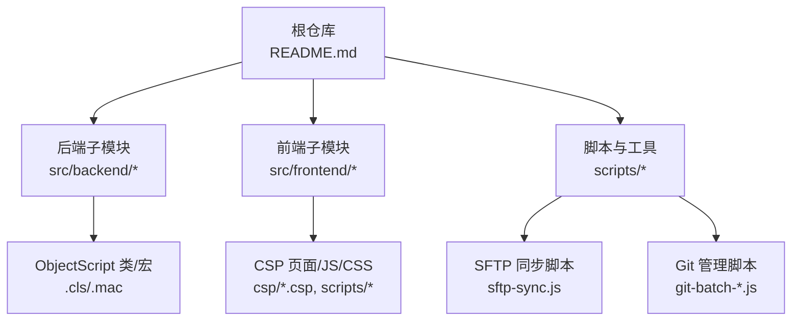
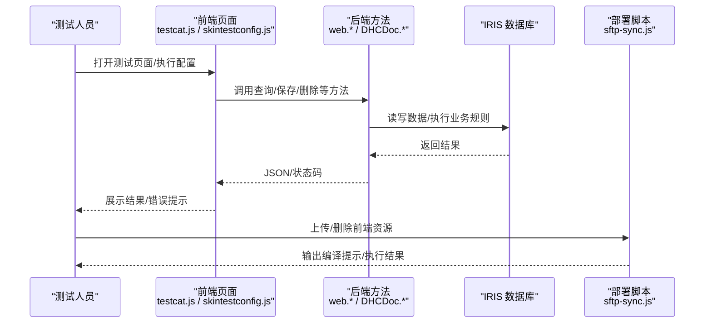
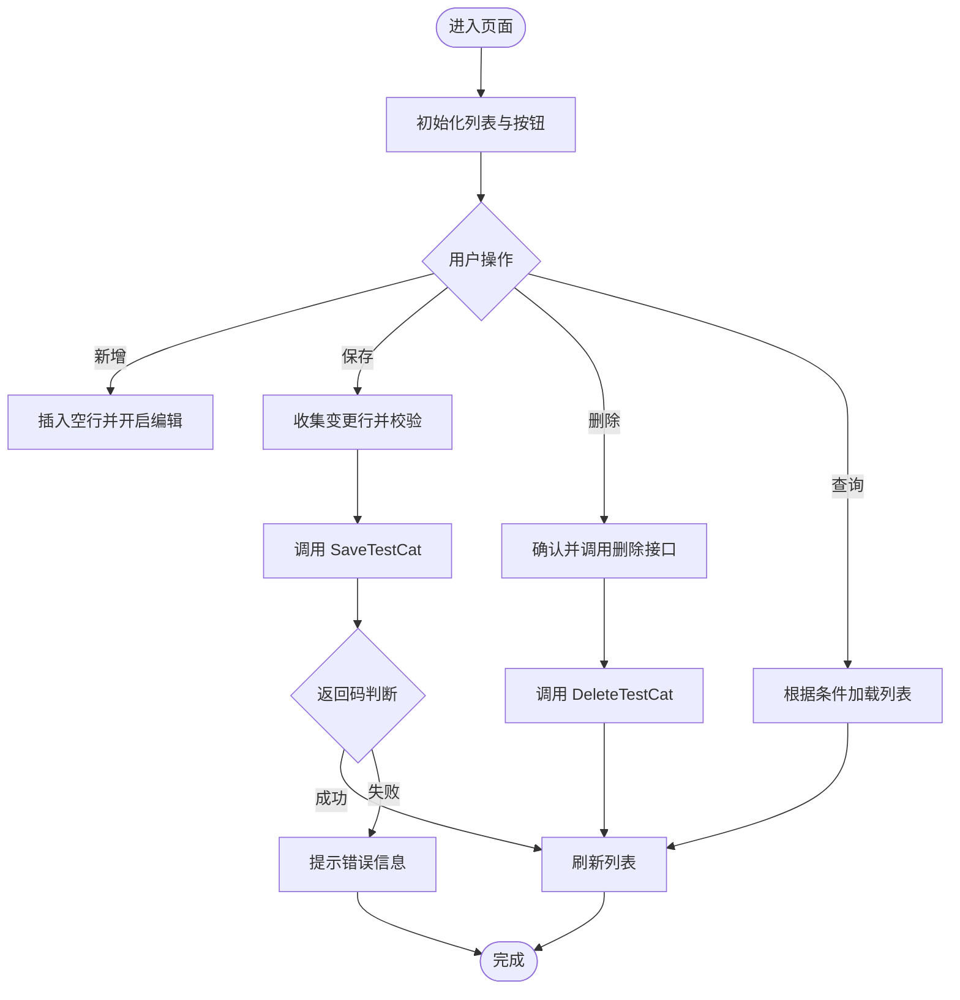
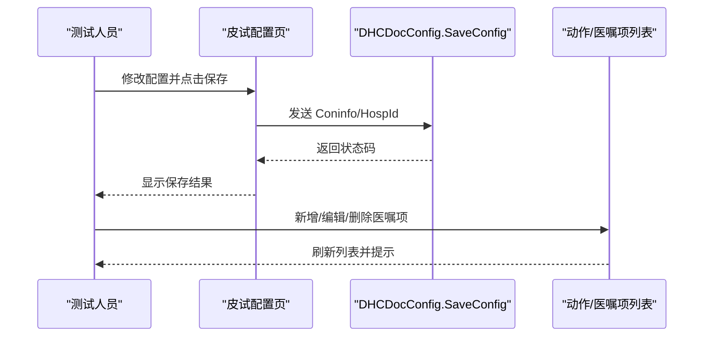
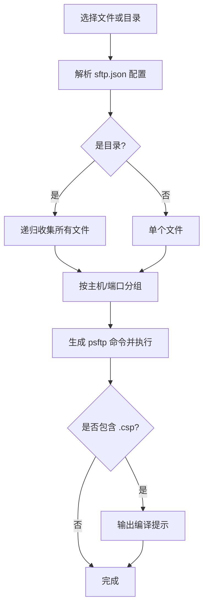
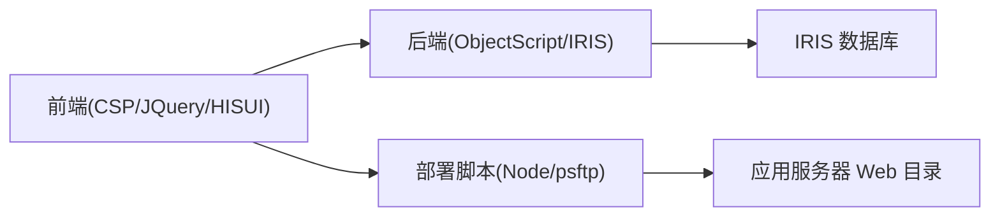

# 测试策略

<cite>
**本文引用的文件**
- [README.md](file://README.md)
- [sftp-sync.js](file://scripts/sftp-sync.js)
- [package.json](file://scripts/package.json)
- [.qtz-clirc.json](file://.qtz-clirc.json)
- [testcat.js](file://src/frontend/doc-ws/scripts/dhcdoc/dhcapp/testcat.js)
- [dhcdoc.config.skintestconfig.js](file://src/frontend/doc-ws/scripts/dhcdocconfig/dhcdoc.config.skintestconfig.js)
</cite>

## 目录
1. [引言](#引言)
2. [项目结构](#项目结构)
3. [核心组件](#核心组件)
4. [架构总览](#架构总览)
5. [详细组件分析](#详细组件分析)
6. [依赖分析](#依赖分析)
7. [性能考虑](#性能考虑)
8. [故障排查指南](#故障排查指南)
9. [结论](#结论)
10. [附录](#附录)

## 引言
本测试策略面向 IRIS HIS 项目，覆盖单元测试、集成测试、性能测试、回归测试的策略与实施方案；明确测试环境搭建、测试数据准备、用例设计原则；规范测试执行流程、结果分析与缺陷跟踪方法；提供测试自动化与持续集成的落地方案；并针对移动端、兼容性、安全测试给出特殊考虑。该策略基于仓库现有工程结构与工具链（ObjectScript/CSP 前端、jQuery/HISUI、SFTP 部署脚本、Git 多仓库管理脚本）制定，确保在真实 HIS 运行环境中可执行、可度量、可追溯。

## 项目结构
IRIS HIS 采用前后端分离的模块化组织：后端为 InterSystems IRIS ObjectScript（按产品域划分），前端为 CSP + jQuery/HISUI（按产品域划分）。根仓库通过 Git Submodule 管理前后端代码，并提供脚本用于 SFTP 同步、分支/提测 MR 批量操作等。

**图表来源**
- [README.md:5-35](file://README.md#L5-L35)
- [sftp-sync.js:1-25](file://scripts/sftp-sync.js#L1-L25)

**章节来源**
- [README.md:5-35](file://README.md#L5-L35)

## 核心组件
- 前端测试入口与交互点
  - 分类维护测试页：用于验证“检测项目分类”CRUD 流程与后端接口调用。
  - 皮试配置页：用于验证配置项保存、关联医嘱项选择与校验逻辑。
- 部署与同步
  - SFTP 同步脚本：统一上传/删除前端资源，自动匹配 sftp.json 通道，支持 .csp 编译提示。
- 辅助依赖
  - 脚本依赖声明：仅包含编码转换所需依赖，避免引入额外运行时影响。

**章节来源**
- [testcat.js:1-185](file://src/frontend/doc-ws/scripts/dhcdoc/dhcapp/testcat.js#L1-L185)
- [dhcdoc.config.skintestconfig.js:1-459](file://src/frontend/doc-ws/scripts/dhcdocconfig/dhcdoc.config.skintestconfig.js#L1-L459)
- [sftp-sync.js:1-291](file://scripts/sftp-sync.js#L1-L291)
- [package.json:1-10](file://scripts/package.json#L1-L10)

## 架构总览
从测试视角，系统分为三层：
- 前端层：CSP 页面与 JS 交互，负责用户输入、表单校验、调用后端方法。
- 后端层：ObjectScript 类与方法，处理业务规则、数据持久化、跨系统集成。
- 基础设施层：SFTP 部署、IRIS 编译、数据库与外部系统。

**图表来源**
- [testcat.js:115-157](file://src/frontend/doc-ws/scripts/dhcdoc/dhcapp/testcat.js#L115-L157)
- [dhcdoc.config.skintestconfig.js:21-37](file://src/frontend/doc-ws/scripts/dhcdocconfig/dhcdoc.config.skintestconfig.js#L21-L37)
- [sftp-sync.js:181-227](file://scripts/sftp-sync.js#L181-L227)

## 详细组件分析

### 前端测试用例：检测项目分类维护（testcat.js）
- 目标：验证分类列表加载、新增、编辑、保存、删除、查询等端到端流程。
- 关键路径
  - 初始化与按钮绑定：initPageDefault、initButton。
  - 列表加载：通过 URL 参数 ClassName/MethodName 获取数据。
  - 保存流程：收集变更行、拼接参数、调用 web.DHCAPPTestCat.SaveTestCat。
  - 删除流程：选中行后调用 web.DHCAPPTestCat.DeleteTestCat。
- 断言建议
  - 成功保存后列表刷新且无重复代码/描述提示。
  - 删除后对应记录不再出现。
  - 查询条件生效。
- 风险点
  - 并发编辑导致行状态错乱（需保证结束编辑后再插入新行）。
  - 后端返回码映射需与前端一致（如 -1/-2/-3/-4）。

**图表来源**
- [testcat.js:8-12](file://src/frontend/doc-ws/scripts/dhcdoc/dhcapp/testcat.js#L8-L12)
- [testcat.js:67-98](file://src/frontend/doc-ws/scripts/dhcdoc/dhcapp/testcat.js#L67-L98)
- [testcat.js:100-157](file://src/frontend/doc-ws/scripts/dhcdoc/dhcapp/testcat.js#L100-L157)
- [testcat.js:159-183](file://src/frontend/doc-ws/scripts/dhcdoc/dhcapp/testcat.js#L159-L183)

**章节来源**
- [testcat.js:1-185](file://src/frontend/doc-ws/scripts/dhcdoc/dhcapp/testcat.js#L1-L185)

### 前端测试用例：皮试配置（dhcdoc.config.skintestconfig.js）
- 目标：验证皮试指令、频率等全局配置保存，以及动作与医嘱项的关联维护。
- 关键路径
  - 保存全局配置：构造 Coninfo，调用 web.DHCDocConfig.SaveConfig。
  - 动作列表与医嘱项列表：分页、选择、编辑、保存、删除。
  - 校验：必填、数量正整数、重复记录提示。
- 断言建议
  - 保存成功后提示并刷新列表。
  - 删除后列表更新。
  - 非法输入触发相应提示。
- 风险点
  - 远程下拉框（combogrid）异步加载时机与缓存。
  - 编辑态切换与取消编辑的数据回滚。

**图表来源**
- [dhcdoc.config.skintestconfig.js:21-37](file://src/frontend/doc-ws/scripts/dhcdocconfig/dhcdoc.config.skintestconfig.js#L21-L37)
- [dhcdoc.config.skintestconfig.js:81-408](file://src/frontend/doc-ws/scripts/dhcdocconfig/dhcdoc.config.skintestconfig.js#L81-L408)

**章节来源**
- [dhcdoc.config.skintestconfig.js:1-459](file://src/frontend/doc-ws/scripts/dhcdocconfig/dhcdoc.config.skintestconfig.js#L1-L459)

### 部署与同步：SFTP 同步脚本（sftp-sync.js）
- 功能：读取 .vscode/sftp.json 配置，将本地前端文件上传到服务器指定 remotePath；支持 delete/check；对 .csp 提示需要编译。
- 关键点
  - 路径解析：根据 context 最长匹配确定远程路径。
  - 会话分组：同主机/端口合并命令，减少连接次数。
  - 主机密钥缓存：首次连接自动引导缓存。
- 测试关注
  - 上传前后文件一致性。
  - .csp 编译提示是否准确。
  - 删除行为是否符合预期（仅文件，不支持目录）。

**图表来源**
- [sftp-sync.js:53-95](file://scripts/sftp-sync.js#L53-L95)
- [sftp-sync.js:118-164](file://scripts/sftp-sync.js#L118-L164)
- [sftp-sync.js:181-227](file://scripts/sftp-sync.js#L181-L227)

**章节来源**
- [sftp-sync.js:1-291](file://scripts/sftp-sync.js#L1-L291)

## 依赖分析
- 前端依赖
  - jQuery/HISUI：用于 UI 组件与交互。
  - CSP：动态页面技术，需编译后生效。
- 后端依赖
  - InterSystems IRIS：对象数据库与应用服务器。
  - ObjectScript：服务端逻辑实现。
- 脚本依赖
  - Node.js 与 psftp：用于前端资源同步。
  - 脚本依赖包：iconv-lite（编码转换，不影响测试主流程）。

**图表来源**
- [README.md:526-536](file://README.md#L526-L536)
- [sftp-sync.js:1-25](file://scripts/sftp-sync.js#L1-L25)
- [package.json:1-10](file://scripts/package.json#L1-L10)

**章节来源**
- [README.md:526-536](file://README.md#L526-L536)
- [package.json:1-10](file://scripts/package.json#L1-L10)

## 性能考虑
- 前端性能
  - 列表分页与懒加载：避免一次性加载大量数据。
  - 减少不必要的 DOM 操作与网络请求。
- 后端性能
  - 合理索引与查询优化。
  - 批量操作与事务控制。
- 部署性能
  - 使用 sftp-sync.js 按连接分组上传，减少连接开销。
  - 仅上传变更文件，避免全量覆盖。

[本节为通用指导，不直接分析具体文件]

## 故障排查指南
- 前端问题
  - 检查浏览器控制台错误与网络请求响应。
  - 确认 CSP 已编译（参考 sftp-sync.js 的编译提示）。
- 后端问题
  - 查看 IRIS 日志与命名空间上下文。
  - 核对 Class/Method 名称与参数传递。
- 部署问题
  - 确认 sftp.json 配置正确（host/port/username/password/context/remotePath）。
  - 首次连接需缓存主机密钥（脚本会提示）。
- 常见错误定位
  - 保存失败：检查前端参数拼接与后端返回码映射。
  - 列表为空：检查查询 URL 与后端查询方法。
  - 上传失败：检查 psftp 安装与 PATH、权限与网络连通性。

**章节来源**
- [sftp-sync.js:53-63](file://scripts/sftp-sync.js#L53-L63)
- [sftp-sync.js:118-164](file://scripts/sftp-sync.js#L118-L164)
- [testcat.js:115-157](file://src/frontend/doc-ws/scripts/dhcdoc/dhcapp/testcat.js#L115-L157)
- [dhcdoc.config.skintestconfig.js:21-37](file://src/frontend/doc-ws/scripts/dhcdocconfig/dhcdoc.config.skintestconfig.js#L21-L37)

## 结论
本测试策略以现有工程为基础，围绕前端交互、后端服务、部署工具构建完整的测试闭环。通过明确的用例设计、自动化部署与批量化提测流程，保障 IRIS HIS 在多产品域下的质量与交付效率。后续可在 CI 中集成自动化测试套件，进一步缩短反馈周期。

[本节为总结，不直接分析具体文件]

## 附录

### 测试环境与数据准备
- 环境要求
  - IRIS 实例与命名空间（如 <namespace>）。
  - Node.js 与 psftp（PuTTY）可用。
  - VS Code 模板配置（settings.json.template、sftp.json.template）。
- 数据准备
  - 基础字典与医院信息。
  - 测试用患者/医嘱/诊断等最小数据集。
  - 隔离测试命名空间或沙箱库。

**章节来源**
- [README.md:98-206](file://README.md#L98-L206)

### 测试用例设计原则
- 覆盖关键路径：CRUD、查询、校验、异常分支。
- 边界值与异常输入：空值、超长、非法格式。
- 幂等性与一致性：重复提交、并发编辑。
- 可观测性：明确断言点与日志输出。

[本节为通用指导，不直接分析具体文件]

### 测试执行流程
- 单测（前端）
  - 打开测试页面，执行用例步骤，观察界面与网络请求。
  - 断言列表刷新、提示消息、数据一致性。
- 集成测试
  - 通过前端页面触发后端方法，验证数据落库与联动效果。
- 性能测试
  - 大列表加载、批量保存、复杂查询场景。
- 回归测试
  - 每次提测前执行核心用例集，确保无退化。

**章节来源**
- [testcat.js:100-183](file://src/frontend/doc-ws/scripts/dhcdoc/dhcapp/testcat.js#L100-L183)
- [dhcdoc.config.skintestconfig.js:81-408](file://src/frontend/doc-ws/scripts/dhcdocconfig/dhcdoc.config.skintestconfig.js#L81-L408)

### 测试结果分析与缺陷跟踪
- 结果记录
  - 用例编号、步骤、预期与实际结果、截图/日志。
- 缺陷跟踪
  - 缺陷分级（致命/严重/一般/轻微）。
  - 复现步骤与环境信息。
  - 回归验证与关闭标准。

[本节为通用指导，不直接分析具体文件]

### 测试自动化与持续集成
- 自动化方案
  - 前端：基于浏览器自动化（如 Puppeteer/Playwright）驱动 CSP 页面，模拟用户操作并断言。
  - 后端：通过 IRIS 测试框架或自定义脚本调用 Class/Method，断言返回值与数据状态。
  - 部署：在 CI 中调用 sftp-sync.js 上传并提示编译。
- CI 配置要点
  - 安装 Node.js、psftp。
  - 拉取子模块、准备测试数据。
  - 执行测试套件并生成报告。
  - 失败时阻断发布并通知。

**章节来源**
- [sftp-sync.js:181-227](file://scripts/sftp-sync.js#L181-L227)

### 移动端测试、兼容性测试与安全测试
- 移动端测试
  - 若存在移动端入口，需在主流移动浏览器与 WebView 中验证布局与交互。
  - 关注触摸事件、键盘弹出、横竖屏适配。
- 兼容性测试
  - 浏览器版本矩阵（IE/Edge/Chrome/Firefox）。
  - 分辨率与缩放比例。
- 安全测试
  - 输入校验与防注入（XSS/SQL 注入）。
  - 敏感数据传输加密（HTTPS）。
  - 权限控制与越权访问防护。

[本节为通用指导，不直接分析具体文件]

### 提测与分支策略
- 分支策略
  - dev → test 提测，MR 审批后合并。
- 批量提测
  - 使用 git-batch-mr.js 创建 MR，支持冲突检测与令牌方式创建。
- 注意事项
  - 仅在对应 submodule 内执行 Git 操作。
  - 提测前确保前端编译与后端编译完成。

**章节来源**
- [README.md:390-445](file://README.md#L390-L445)

### 配置文件说明
- .qtz-clirc.json
  - 可能用于任务调度或定时任务配置，结合 IRIS 作业机制使用。
- sftp.json
  - 前端部署连接信息与目录映射。
- settings.json
  - IRIS 连接与导出配置。

**章节来源**
- [.qtz-clirc.json](file://.qtz-clirc.json)
- [README.md:98-206](file://README.md#L98-L206)