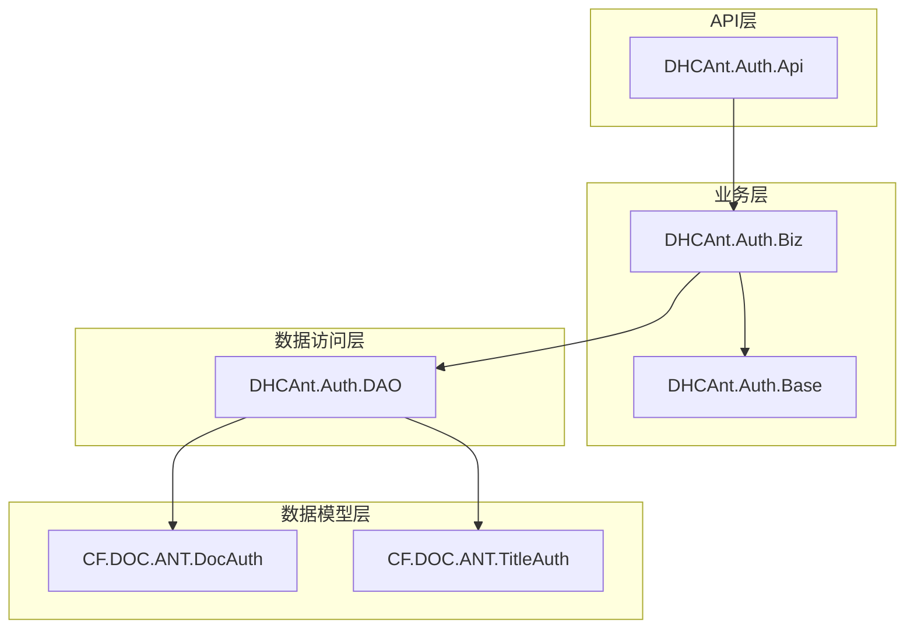
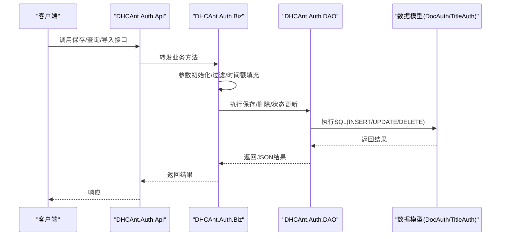
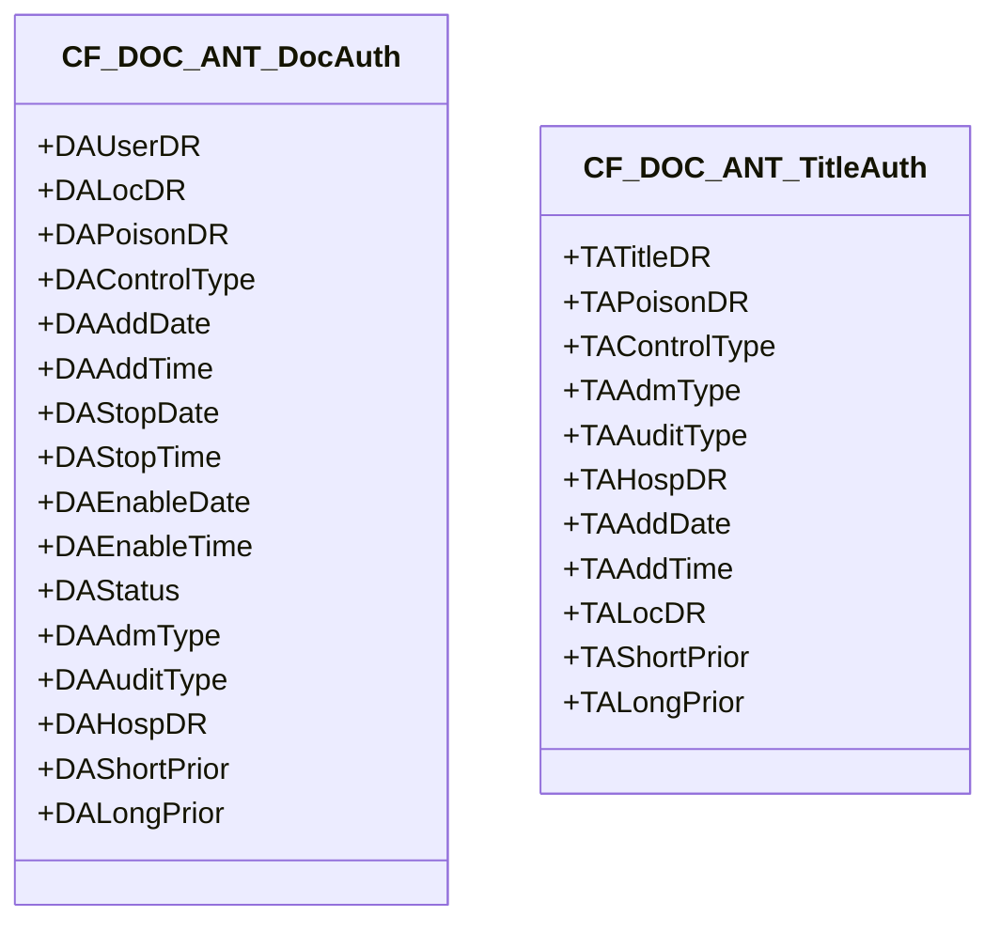
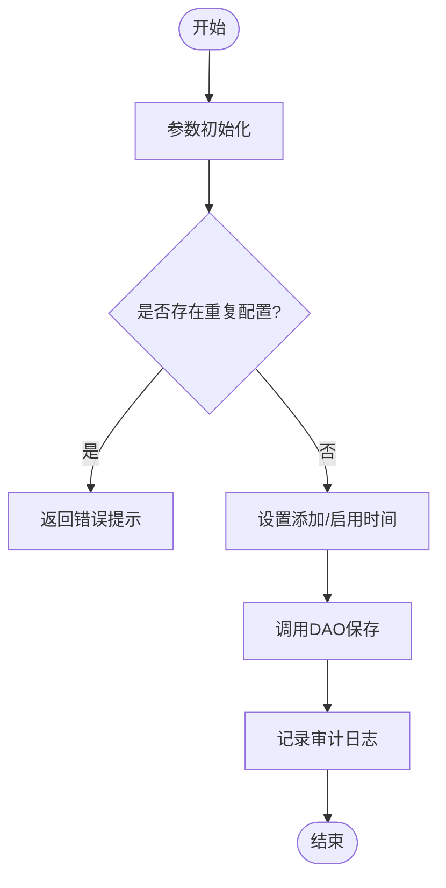
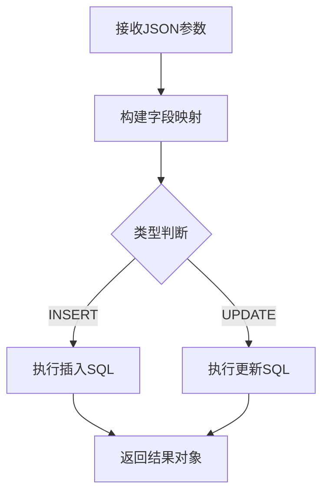
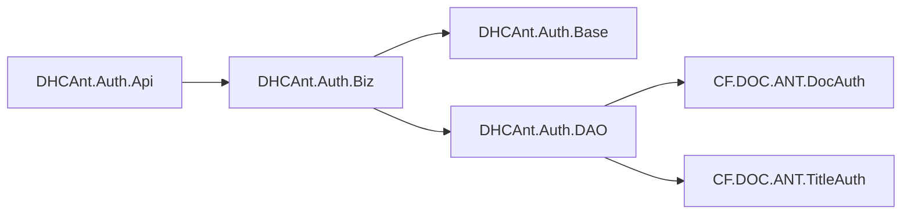

# 认证授权机制

<cite>
**本文引用的文件**
- [Base.cls](file://src/backend/doc-ws/DHCAnt/Auth/Base.cls)
- [Biz.cls](file://src/backend/doc-ws/DHCAnt/Auth/Biz.cls)
- [DAO.cls](file://src/backend/doc-ws/DHCAnt/Auth/DAO.cls)
- [Api.cls](file://src/backend/doc-ws/DHCAnt/Auth/Api.cls)
- [DocAuth.cls](file://src/backend/doc-ws/CF/DOC/ANT/DocAuth.cls)
- [TitleAuth.cls](file://src/backend/doc-ws/CF/DOC/ANT/TitleAuth.cls)
</cite>

## 目录
1. [简介](#简介)
2. [项目结构](#项目结构)
3. [核心组件](#核心组件)
4. [架构总览](#架构总览)
5. [详细组件分析](#详细组件分析)
6. [依赖关系分析](#依赖关系分析)
7. [性能考虑](#性能考虑)
8. [故障排查指南](#故障排查指南)
9. [结论](#结论)
10. [附录](#附录)

## 简介
本文件面向医疗系统后端中的“认证与授权”能力，聚焦于用户身份验证、权限控制与会话管理的设计与实现。当前仓库中可确认的授权能力围绕“医生权限表”和“职称权限表”展开，提供基于角色（职称）与主体（医生）的细粒度访问控制，并支持启用/停用、导入导出等运维操作。登录流程、令牌管理、会话超时、外部认证集成与安全日志记录在本仓库中未直接体现，将在“概念性说明”部分给出通用实践建议，便于后续扩展。

## 项目结构
认证授权相关代码集中在 doc-ws 模块下，采用分层组织：
- 数据模型层：定义医生权限与职称权限实体及索引
- 业务逻辑层：封装保存、删除、状态变更、导入等业务规则
- 数据访问层：统一通过映射与 SQL 执行完成持久化
- API 层：对外暴露查询、保存、导入等接口方法

图表来源
- [Api.cls:1-119](file://src/backend/doc-ws/DHCAnt/Auth/Api.cls#L1-L119)
- [Biz.cls:1-259](file://src/backend/doc-ws/DHCAnt/Auth/Biz.cls#L1-L259)
- [Base.cls:1-41](file://src/backend/doc-ws/DHCAnt/Auth/Base.cls#L1-L41)
- [DAO.cls:1-188](file://src/backend/doc-ws/DHCAnt/Auth/DAO.cls#L1-L188)
- [DocAuth.cls:1-125](file://src/backend/doc-ws/CF/DOC/ANT/DocAuth.cls#L1-L125)
- [TitleAuth.cls:1-93](file://src/backend/doc-ws/CF/DOC/ANT/TitleAuth.cls#L1-L93)

章节来源
- [Api.cls:1-119](file://src/backend/doc-ws/DHCAnt/Auth/Api.cls#L1-L119)
- [Biz.cls:1-259](file://src/backend/doc-ws/DHCAnt/Auth/Biz.cls#L1-L259)
- [Base.cls:1-41](file://src/backend/doc-ws/DHCAnt/Auth/Base.cls#L1-L41)
- [DAO.cls:1-188](file://src/backend/doc-ws/DHCAnt/Auth/DAO.cls#L1-L188)
- [DocAuth.cls:1-125](file://src/backend/doc-ws/CF/DOC/ANT/DocAuth.cls#L1-L125)
- [TitleAuth.cls:1-93](file://src/backend/doc-ws/CF/DOC/ANT/TitleAuth.cls#L1-L93)

## 核心组件
- 数据模型
  - 医生权限实体：包含医生标识、科室（预留）、管制分类、权限类型、启用/停用时间、就诊类型、审核权限、医院、临嘱/长嘱权限等字段，并提供多列索引以优化查询
  - 职称权限实体：包含职称、管制分类、权限类型、就诊类型、审核权限、医院、添加时间、科室（预留）、临嘱/长嘱权限等字段，并提供多列索引
- 业务逻辑
  - 保存职称/医生权限：参数校验、去重检查、时间戳填充、调用 DAO 持久化、记录审计日志
  - 删除权限：批量删除并记录审计日志
  - 启用/停用：根据状态设置停用时间或清空停用时间，更新后记录日志
  - 导入：将 Excel 行解析为 JSON 对象后复用保存逻辑
- 数据访问
  - 统一通过映射将 JSON 转换为 SQL 字段集合，执行 INSERT/UPDATE；亦提供嵌入式 SQL 的直接写入路径
- API 接口
  - 提供查询、保存、删除、导入模板等方法，内部委托至业务层或数据层

章节来源
- [DocAuth.cls:1-125](file://src/backend/doc-ws/CF/DOC/ANT/DocAuth.cls#L1-L125)
- [TitleAuth.cls:1-93](file://src/backend/doc-ws/CF/DOC/ANT/TitleAuth.cls#L1-L93)
- [Biz.cls:1-259](file://src/backend/doc-ws/DHCAnt/Auth/Biz.cls#L1-L259)
- [DAO.cls:1-188](file://src/backend/doc-ws/DHCAnt/Auth/DAO.cls#L1-L188)
- [Api.cls:1-119](file://src/backend/doc-ws/DHCAnt/Auth/Api.cls#L1-L119)

## 架构总览
下图展示了从 API 到数据模型的调用链路与职责划分：

图表来源
- [Api.cls:1-119](file://src/backend/doc-ws/DHCAnt/Auth/Api.cls#L1-L119)
- [Biz.cls:1-259](file://src/backend/doc-ws/DHCAnt/Auth/Biz.cls#L1-L259)
- [DAO.cls:1-188](file://src/backend/doc-ws/DHCAnt/Auth/DAO.cls#L1-L188)
- [DocAuth.cls:1-125](file://src/backend/doc-ws/CF/DOC/ANT/DocAuth.cls#L1-L125)
- [TitleAuth.cls:1-93](file://src/backend/doc-ws/CF/DOC/ANT/TitleAuth.cls#L1-L93)

## 详细组件分析

### 数据模型：医生权限与职称权限
- 医生权限（DocAuth）
  - 关键字段：医生ID、科室（预留）、管制分类、权限类型、启用/停用时间、就诊类型、审核权限、医院、临嘱/长嘱权限
  - 索引：按医院+医生+就诊类型+管制分类、启用日期、停用日期建立索引，提升查询效率
- 职称权限（TitleAuth）
  - 关键字段：职称、管制分类、权限类型、就诊类型、审核权限、医院、添加时间、科室（预留）、临嘱/长嘱权限
  - 索引：按医院+职称+就诊类型+管制分类、添加日期建立索引

图表来源
- [DocAuth.cls:1-125](file://src/backend/doc-ws/CF/DOC/ANT/DocAuth.cls#L1-L125)
- [TitleAuth.cls:1-93](file://src/backend/doc-ws/CF/DOC/ANT/TitleAuth.cls#L1-L93)

章节来源
- [DocAuth.cls:1-125](file://src/backend/doc-ws/CF/DOC/ANT/DocAuth.cls#L1-L125)
- [TitleAuth.cls:1-93](file://src/backend/doc-ws/CF/DOC/ANT/TitleAuth.cls#L1-L93)

### 业务层：权限保存、删除与状态管理
- 保存职称权限
  - 参数初始化、重复配置检查、时间戳填充、调用 DAO 保存、记录审计日志
- 保存医生权限
  - 同上，额外设置启用时间与状态默认值
- 删除权限
  - 批量删除并记录审计日志
- 启用/停用
  - 根据状态设置停用时间或清空停用时间，更新后记录日志
- 导入
  - 将 Excel 行解析为 JSON，复用保存逻辑

图表来源
- [Biz.cls:1-259](file://src/backend/doc-ws/DHCAnt/Auth/Biz.cls#L1-L259)

章节来源
- [Biz.cls:1-259](file://src/backend/doc-ws/DHCAnt/Auth/Biz.cls#L1-L259)

### 数据访问层：统一映射与SQL执行
- 通过映射将 JSON 数据转换为 SQL 字段集合，统一处理 INSERT/UPDATE
- 提供嵌入式 SQL 的直接写入路径，用于复杂场景
- 所有写操作均返回统一的 JSON 结果对象，便于上层处理

图表来源
- [DAO.cls:1-188](file://src/backend/doc-ws/DHCAnt/Auth/DAO.cls#L1-L188)

章节来源
- [DAO.cls:1-188](file://src/backend/doc-ws/DHCAnt/Auth/DAO.cls#L1-L188)

### API层：对外接口
- 提供查询职称/医生权限、查询字典、保存、删除、导入模板等方法
- 内部委托至业务层或数据层，保持接口简洁

章节来源
- [Api.cls:1-119](file://src/backend/doc-ws/DHCAnt/Auth/Api.cls#L1-L119)

## 依赖关系分析
- 类继承与组合
  - Api 继承 Biz 与 Query，复用查询与业务逻辑
  - Biz 继承 Base，复用基础方法与常量
  - DAO 继承 Base 与通用 DAO，统一数据访问
- 数据模型依赖
  - 医生权限与职称权限分别对应持久化实体，提供索引优化查询
- 外部依赖
  - 通过通用 COM 组件进行日志记录与参考数据获取（如字典、医院、用户等）

图表来源
- [Api.cls:1-119](file://src/backend/doc-ws/DHCAnt/Auth/Api.cls#L1-L119)
- [Biz.cls:1-259](file://src/backend/doc-ws/DHCAnt/Auth/Biz.cls#L1-L259)
- [Base.cls:1-41](file://src/backend/doc-ws/DHCAnt/Auth/Base.cls#L1-L41)
- [DAO.cls:1-188](file://src/backend/doc-ws/DHCAnt/Auth/DAO.cls#L1-L188)
- [DocAuth.cls:1-125](file://src/backend/doc-ws/CF/DOC/ANT/DocAuth.cls#L1-L125)
- [TitleAuth.cls:1-93](file://src/backend/doc-ws/CF/DOC/ANT/TitleAuth.cls#L1-L93)

章节来源
- [Api.cls:1-119](file://src/backend/doc-ws/DHCAnt/Auth/Api.cls#L1-L119)
- [Biz.cls:1-259](file://src/backend/doc-ws/DHCAnt/Auth/Biz.cls#L1-L259)
- [Base.cls:1-41](file://src/backend/doc-ws/DHCAnt/Auth/Base.cls#L1-L41)
- [DAO.cls:1-188](file://src/backend/doc-ws/DHCAnt/Auth/DAO.cls#L1-L188)
- [DocAuth.cls:1-125](file://src/backend/doc-ws/CF/DOC/ANT/DocAuth.cls#L1-L125)
- [TitleAuth.cls:1-93](file://src/backend/doc-ws/CF/DOC/ANT/TitleAuth.cls#L1-L93)

## 性能考虑
- 索引设计
  - 医生权限表：按医院+医生+就诊类型+管制分类建立复合索引，提高按维度筛选的查询性能
  - 职称权限表：按医院+职称+就诊类型+管制分类建立复合索引，提升批量授权匹配效率
- 写入路径
  - 使用统一映射减少 SQL 拼接复杂度，降低出错概率
  - 对高频导入场景，可考虑批量写入或事务包裹以提升吞吐
- 缓存策略（建议）
  - 对常用权限矩阵（医院+就诊类型+管制分类）可引入内存缓存，减少数据库压力
- 并发控制（建议）
  - 在导入或批量更新时增加锁机制，避免重复配置冲突

[本节为通用指导，不直接分析具体文件]

## 故障排查指南
- 常见错误
  - 重复配置：保存前会检查是否已存在相同维度的权限配置，若存在则返回错误提示
  - SQL 执行失败：DAO 层捕获 SQLCODE 并返回统一错误对象，便于定位问题
  - 状态切换异常：启用/停用时需确保状态与停用时间一致，否则可能导致权限生效不符合预期
- 审计日志
  - 所有保存、删除、状态变更操作均记录审计日志，包括操作人、对象描述、新旧值等，便于追溯
- 排查步骤
  - 查看返回的错误消息与对象引用
  - 核对输入参数与映射字段是否正确
  - 检查数据库索引与约束是否满足预期
  - 通过审计日志回溯变更历史

章节来源
- [Biz.cls:1-259](file://src/backend/doc-ws/DHCAnt/Auth/Biz.cls#L1-L259)
- [DAO.cls:1-188](file://src/backend/doc-ws/DHCAnt/Auth/DAO.cls#L1-L188)

## 结论
当前仓库实现了基于医生与职称的细粒度权限控制，具备完整的保存、删除、状态管理与导入能力，并通过审计日志保障可追溯性。登录流程、令牌管理、会话超时、外部认证集成与安全日志记录未在仓库中直接实现，建议在现有授权基础上扩展统一认证网关与会话服务，结合安全最佳实践完善整体安全体系。

[本节为总结性内容，不直接分析具体文件]

## 附录

### 概念性说明：登录流程与令牌管理（建议）
- 登录流程
  - 前端提交用户名与密码至认证接口
  - 服务端校验凭证，生成短期访问令牌与刷新令牌
  - 将令牌下发给前端，并在后续请求中携带
- 令牌管理
  - 访问令牌短生命周期，刷新令牌较长生命周期
  - 服务端维护令牌黑名单与过期策略
- 会话管理
  - 服务端维护会话上下文，记录登录时间、IP、设备信息等
  - 支持会话超时与主动注销

[本节为概念性说明，不直接分析具体文件]

### 概念性说明：角色权限模型与访问控制策略（建议）
- 角色模型
  - 基于角色的访问控制（RBAC）：角色包含一组权限，用户分配角色，资源受权限保护
- 访问控制策略
  - 资源级控制：按页面、按钮、接口维度进行鉴权
  - 数据级控制：按医院、科室、患者范围进行数据隔离
- 策略评估
  - 在业务入口统一进行鉴权拦截，拒绝无权限访问

[本节为概念性说明，不直接分析具体文件]

### 概念性说明：安全最佳实践（建议）
- 密码加密
  - 使用强哈希算法（如 bcrypt/argon2）存储密码，禁止明文
- 防攻击措施
  - 限制登录尝试次数，防止暴力破解
  - 启用 CSRF 防护、XSS 过滤、输入校验与输出编码
- 安全日志
  - 记录登录成功/失败、权限变更、敏感操作等事件，脱敏敏感信息

[本节为概念性说明，不直接分析具体文件]

### 概念性说明：外部认证系统与单点登录（建议）
- 外部认证
  - 支持与 LDAP/OAuth2/OpenID Connect 集成，统一身份源
- 单点登录（SSO）
  - 通过中央认证中心签发令牌，各子系统共享会话
- 回退策略
  - 当外部认证不可用时，提供本地认证回退方案

[本节为概念性说明，不直接分析具体文件]