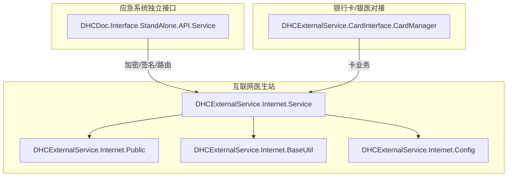
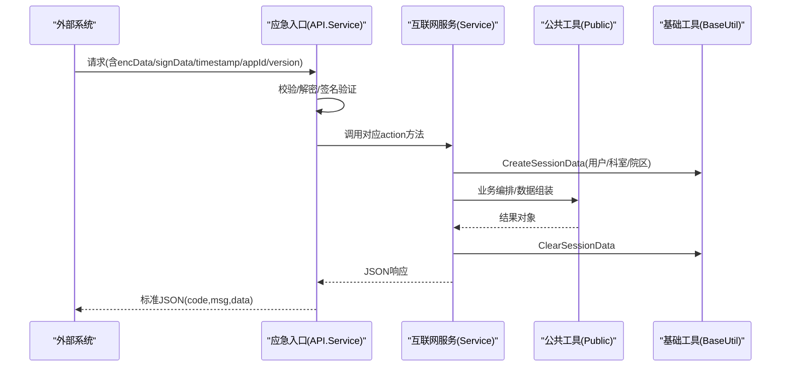
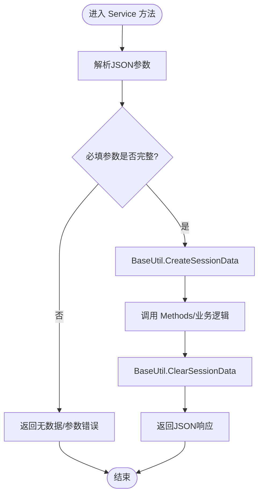
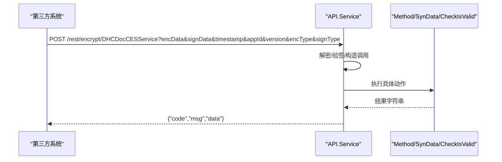
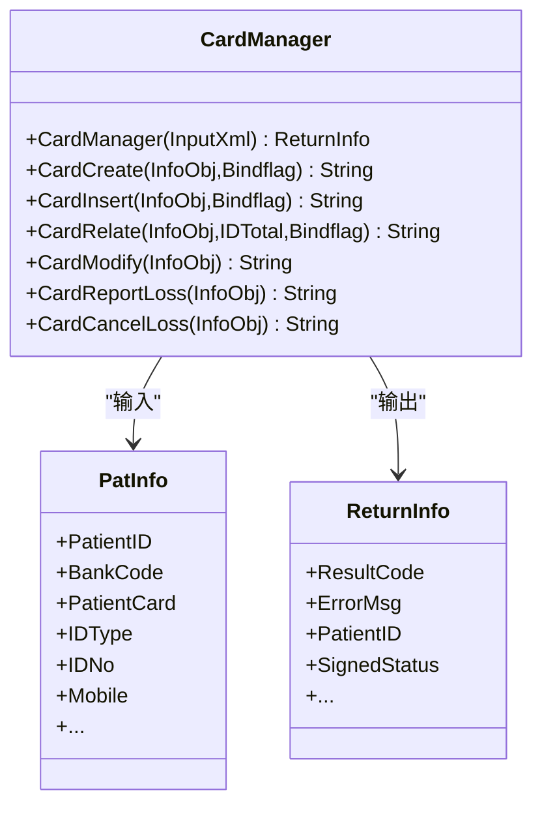
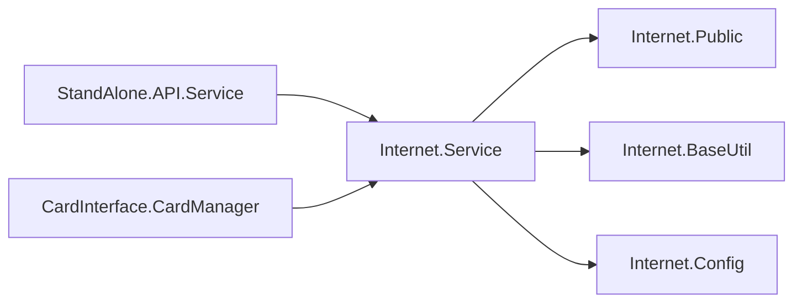

# 系统集成接口

<cite>
**本文引用的文件**
- [Service.cls](file://src/backend/public-mc/DHCExternalService/Internet/Service.cls)
- [Public.cls](file://src/backend/public-mc/DHCExternalService/Internet/Public.cls)
- [BaseUtil.cls](file://src/backend/public-mc/DHCExternalService/Internet/BaseUtil.cls)
- [Config.cls](file://src/backend/public-mc/DHCExternalService/Internet/Config.cls)
- [CardManager.cls](file://src/backend/public-mc/DHCExternalService/CardInterface/CardManager.cls)
- [API.Service.cls](file://src/backend/conting-ws/DHCDoc/Interface/StandAlone/API/Service.cls)
</cite>

## 目录
1. [简介](#简介)
2. [项目结构](#项目结构)
3. [核心组件](#核心组件)
4. [架构总览](#架构总览)
5. [详细组件分析](#详细组件分析)
6. [依赖关系分析](#依赖关系分析)
7. [性能与可用性](#性能与可用性)
8. [故障排查指南](#故障排查指南)
9. [结论](#结论)
10. [附录：接口规范与示例](#附录接口规范与示例)

## 简介
本文件面向外部系统与服务集成，系统化梳理本项目的对外接口能力，覆盖医生站互联网对接、应急系统独立接口、以及银行卡/银医平台对接等关键场景。文档重点说明：
- 接口职责、输入输出约定、错误码与重试建议
- 数据映射要点（如医嘱、诊断、检查检验申请、卡业务）
- 连接与会话管理、版本与降级策略、性能优化建议
- 集成示例与常见问题排查

## 项目结构
本项目在后端以“领域+服务”的方式组织对外接口：
- 医生站互联网对接：位于 public-mc/DHCExternalService/Internet，提供医嘱查询/录入、诊断模板/增删、检查检验申请等接口
- 应急系统独立接口：位于 conting-ws/DHCDoc/Interface/StandAlone/API，提供统一入口、加密签名、日志与终端校验等能力
- 银行卡/银医对接：位于 public-mc/DHCExternalService/CardInterface，提供建卡、挂失、解绑、信息修改、签约等交易处理

图表来源
- [Service.cls:1-355](file://src/backend/public-mc/DHCExternalService/Internet/Service.cls#L1-L355)
- [Public.cls:1-484](file://src/backend/public-mc/DHCExternalService/Internet/Public.cls#L1-L484)
- [BaseUtil.cls:1-154](file://src/backend/public-mc/DHCExternalService/Internet/BaseUtil.cls#L1-L154)
- [Config.cls:1-8](file://src/backend/public-mc/DHCExternalService/Internet/Config.cls#L1-L8)
- [API.Service.cls:1-158](file://src/backend/conting-ws/DHCDoc/Interface/StandAlone/API/Service.cls#L1-L158)
- [CardManager.cls:1-800](file://src/backend/public-mc/DHCExternalService/CardInterface/CardManager.cls#L1-L800)

章节来源
- [Service.cls:1-355](file://src/backend/public-mc/DHCExternalService/Internet/Service.cls#L1-L355)
- [Public.cls:1-484](file://src/backend/public-mc/DHCExternalService/Internet/Public.cls#L1-L484)
- [BaseUtil.cls:1-154](file://src/backend/public-mc/DHCExternalService/Internet/BaseUtil.cls#L1-L154)
- [Config.cls:1-8](file://src/backend/public-mc/DHCExternalService/Internet/Config.cls#L1-L8)
- [API.Service.cls:1-158](file://src/backend/conting-ws/DHCDoc/Interface/StandAlone/API/Service.cls#L1-L158)
- [CardManager.cls:1-800](file://src/backend/public-mc/DHCExternalService/CardInterface/CardManager.cls#L1-L800)

## 核心组件
- 医生站互联网服务（Service.cls）
  - 提供医嘱项目检索、医嘱套检索、医嘱模板、医嘱录入（西药/草药）、医嘱逆操作、已开医嘱查询、ICD诊断检索、诊断模板、诊断增删、检查/检验/病理申请单等接口
  - 通过 BaseUtil 创建/清理会话上下文，确保权限与院区上下文正确
- 公共工具（Public.cls）
  - 统一返回格式、默认安全组/科室获取、医嘱项详情组装、处方附加项逻辑、版本信息等
- 基础工具（BaseUtil.cls）
  - 会话创建/清理、序列号生成、医院上下文解析、HIS版本获取等
- 配置（Config.cls）
  - 默认院区参数等
- 应急系统独立接口（API.Service.cls）
  - 统一入口 Excute、加密链接生成 GenUrl、终端校验 CheckIsValid、日志 SaveExpLog、下载 SynData、测试 TestSQL 等
- 银行卡/银医对接（CardManager.cls）
  - 统一交易入口 CardManager，分发到建卡、挂失、解绑、信息修改、签约、状态查询等具体方法，包含事务控制与错误码映射

章节来源
- [Service.cls:1-355](file://src/backend/public-mc/DHCExternalService/Internet/Service.cls#L1-L355)
- [Public.cls:1-484](file://src/backend/public-mc/DHCExternalService/Internet/Public.cls#L1-L484)
- [BaseUtil.cls:1-154](file://src/backend/public-mc/DHCExternalService/Internet/BaseUtil.cls#L1-L154)
- [Config.cls:1-8](file://src/backend/public-mc/DHCExternalService/Internet/Config.cls#L1-L8)
- [API.Service.cls:1-158](file://src/backend/conting-ws/DHCDoc/Interface/StandAlone/API/Service.cls#L1-L158)
- [CardManager.cls:1-800](file://src/backend/public-mc/DHCExternalService/CardInterface/CardManager.cls#L1-L800)

## 架构总览
整体采用“网关式统一入口 + 领域服务拆分”的架构：
- 应急系统独立接口作为统一入口，负责鉴权、加密、签名、路由与日志
- 医生站互联网服务承载具体业务编排，调用内部 Methods/实体类完成数据落库与查询
- 银行卡/银医对接作为独立域，提供标准化交易入口并复用会话与工具能力

图表来源
- [API.Service.cls:1-158](file://src/backend/conting-ws/DHCDoc/Interface/StandAlone/API/Service.cls#L1-L158)
- [Service.cls:1-355](file://src/backend/public-mc/DHCExternalService/Internet/Service.cls#L1-L355)
- [Public.cls:1-484](file://src/backend/public-mc/DHCExternalService/Internet/Public.cls#L1-L484)
- [BaseUtil.cls:1-154](file://src/backend/public-mc/DHCExternalService/Internet/BaseUtil.cls#L1-L154)

## 详细组件分析

### 医生站互联网服务（Service.cls）
- 职责
  - 统一接收JSON请求，解析字段，设置会话上下文，调用底层Methods执行，返回JSON
  - 支持西药/草药医嘱、诊断、检查检验申请等
- 关键流程
  - 参数校验与默认值填充（用户、科室、院区、分组）
  - 会话创建/清理，保证权限与上下文隔离
  - 批量/分页参数处理（pageNo）
- 典型接口
  - 医嘱项目检索 LookUpArcim / LookUpArcimCM
  - 医嘱套检索 ILookUpARCOSItem
  - 医嘱模板 ILookUpARCIMTemplate
  - 医嘱录入 ISaveOrderItems / ISaveOrderItemsCM
  - 医嘱逆操作 IDealMultiOrder
  - 已开医嘱查询 ILookUpOrdItem
  - ICD诊断检索 ILookUpICDItem
  - 诊断模板 ILookUpDiagTemplate
  - 诊断增删 ISaveMRDiagnos / IDeleteMRDiagnos
  - 检查/检验/病理申请单 ISaveExamReq / ISaveLabReq / ISavePisMas

图表来源
- [Service.cls:1-355](file://src/backend/public-mc/DHCExternalService/Internet/Service.cls#L1-L355)
- [BaseUtil.cls:66-96](file://src/backend/public-mc/DHCExternalService/Internet/BaseUtil.cls#L66-L96)

章节来源
- [Service.cls:1-355](file://src/backend/public-mc/DHCExternalService/Internet/Service.cls#L1-L355)

### 公共工具（Public.cls）
- 职责
  - 统一返回格式 GetNoDataRespJsonStr
  - 默认安全组/科室获取
  - 医嘱项详情组装、可编辑性判断、处方附加项逻辑
  - HIS版本获取
- 关键点
  - 根据医嘱类型动态控制剂量、频次、疗程、包装数量等编辑开关
  - 针对特定院区做本地化扩展（如草药处方附加项）

章节来源
- [Public.cls:1-484](file://src/backend/public-mc/DHCExternalService/Internet/Public.cls#L1-L484)

### 基础工具（BaseUtil.cls）
- 职责
  - 会话创建/清理，避免跨请求上下文污染
  - 序列号生成、医院上下文解析、HIS版本获取
- 关键点
  - 使用 %session 存储登录用户、科室、院区等信息
  - 按就诊/科室/排班/患者优先级解析院区

章节来源
- [BaseUtil.cls:1-154](file://src/backend/public-mc/DHCExternalService/Internet/BaseUtil.cls#L1-L154)

### 应急系统独立接口（API.Service.cls）
- 职责
  - 统一入口 Excute：解析 action/data，动态调用目标方法
  - 加密链接生成 GenUrl：SM4加密、SM3签名、时间戳、版本号
  - 终端校验 CheckIsValid、日志 SaveExpLog、下载 SynData、测试 TestSQL
- 关键点
  - 统一返回结构 {code, msg, data}
  - 版本标识 version=1.1.0，便于后续演进与兼容

图表来源
- [API.Service.cls:1-158](file://src/backend/conting-ws/DHCDoc/Interface/StandAlone/API/Service.cls#L1-L158)

章节来源
- [API.Service.cls:1-158](file://src/backend/conting-ws/DHCDoc/Interface/StandAlone/API/Service.cls#L1-L158)

### 银行卡/银医对接（CardManager.cls）
- 职责
  - 统一交易入口 CardManager，根据 TradeCode 分发到建卡、挂失、解绑、信息修改、签约、状态查询等方法
  - 事务控制 TSTART/TROLLBACK/TCOMMIT，错误码映射与提示
- 关键点
  - 证件类型、性别、民族、职业、邮编、联系人关系等字典对照
  - 卡状态校验（正常/未激活/挂失/作废）与重复发卡控制
  - 预交金、发票、账户信息序列化与持久化

图表来源
- [CardManager.cls:1-800](file://src/backend/public-mc/DHCExternalService/CardInterface/CardManager.cls#L1-L800)

章节来源
- [CardManager.cls:1-800](file://src/backend/public-mc/DHCExternalService/CardInterface/CardManager.cls#L1-L800)

## 依赖关系分析
- 医生站互联网服务依赖：
  - BaseUtil：会话与上下文管理
  - Public：通用工具与业务规则
  - Config：默认院区配置
  - 内部 Methods/实体：实际数据访问与落库
- 应急系统独立接口依赖：
  - 加密/签名工具、日志模块、数据库执行
- 银行卡/银医对接依赖：
  - 字典对照、实体序列化、事务控制、卡业务核心服务

图表来源
- [Service.cls:1-355](file://src/backend/public-mc/DHCExternalService/Internet/Service.cls#L1-L355)
- [Public.cls:1-484](file://src/backend/public-mc/DHCExternalService/Internet/Public.cls#L1-L484)
- [BaseUtil.cls:1-154](file://src/backend/public-mc/DHCExternalService/Internet/BaseUtil.cls#L1-L154)
- [Config.cls:1-8](file://src/backend/public-mc/DHCExternalService/Internet/Config.cls#L1-L8)
- [API.Service.cls:1-158](file://src/backend/conting-ws/DHCDoc/Interface/StandAlone/API/Service.cls#L1-L158)
- [CardManager.cls:1-800](file://src/backend/public-mc/DHCExternalService/CardInterface/CardManager.cls#L1-L800)

章节来源
- [Service.cls:1-355](file://src/backend/public-mc/DHCExternalService/Internet/Service.cls#L1-L355)
- [Public.cls:1-484](file://src/backend/public-mc/DHCExternalService/Internet/Public.cls#L1-L484)
- [BaseUtil.cls:1-154](file://src/backend/public-mc/DHCExternalService/Internet/BaseUtil.cls#L1-L154)
- [Config.cls:1-8](file://src/backend/public-mc/DHCExternalService/Internet/Config.cls#L1-L8)
- [API.Service.cls:1-158](file://src/backend/conting-ws/DHCDoc/Interface/StandAlone/API/Service.cls#L1-L158)
- [CardManager.cls:1-800](file://src/backend/public-mc/DHCExternalService/CardInterface/CardManager.cls#L1-L800)

## 性能与可用性
- 连接与会话管理
  - 每次业务调用前后创建/清理会话，避免上下文泄漏；建议在客户端保持短连接或合理池化
- 重试策略
  - 对幂等查询接口（如医嘱检索、诊断检索）可实施指数退避重试
  - 写入类接口（医嘱录入、诊断保存）需结合业务幂等键（如订单号/流水号）进行去重与重试
- 降级策略
  - 当底层 Methods/实体不可用时，优先返回结构化错误码与消息，前端可降级为只读模式或缓存展示
  - 应急入口可对非关键功能（如日志记录）进行异步化或丢弃
- 性能优化建议
  - 分页查询：合理设置 pageNo，避免一次性拉取过多数据
  - 批量操作：合并多次小请求为批量提交（如多条诊断、多条医嘱）
  - 减少网络往返：将相关查询聚合至单次调用
  - 缓存热点数据：字典、模板、常用医嘱项可在客户端或服务端短期缓存

[本节为通用指导，不直接分析具体文件]

## 故障排查指南
- 常见错误码与定位
  - 参数缺失：userId、就诊号、处方类型代码等必填为空时，返回统一无数据响应
  - 会话异常：未创建或清理失败导致权限/院区上下文错误
  - 卡业务错误：重复发卡、证件号冲突、卡状态不允许操作等，均返回明确错误码与描述
- 排查步骤
  - 确认请求体字段完整与格式正确
  - 检查会话上下文是否正确创建（用户、科室、院区）
  - 查看应急入口日志与终端校验结果
  - 核对字典对照（证件类型、性别、民族等）是否配置正确
- 日志与调试
  - 使用 SaveExpLog 记录关键调用轨迹
  - 使用 CheckIsValid 验证终端有效性
  - 使用 TestSQL 验证数据库连通性与权限

章节来源
- [Service.cls:1-355](file://src/backend/public-mc/DHCExternalService/Internet/Service.cls#L1-L355)
- [Public.cls:1-484](file://src/backend/public-mc/DHCExternalService/Internet/Public.cls#L1-L484)
- [BaseUtil.cls:1-154](file://src/backend/public-mc/DHCExternalService/Internet/BaseUtil.cls#L1-L154)
- [API.Service.cls:1-158](file://src/backend/conting-ws/DHCDoc/Interface/StandAlone/API/Service.cls#L1-L158)
- [CardManager.cls:1-800](file://src/backend/public-mc/DHCExternalService/CardInterface/CardManager.cls#L1-L800)

## 结论
本系统集成接口围绕医生站互联网、应急系统与银行卡/银医三大域展开，具备统一的入口、清晰的会话管理、标准化的返回结构与完善的错误处理。通过合理的分页、批量、缓存与重试策略，可有效提升集成稳定性与性能。后续可在此基础上逐步引入更丰富的医疗标准协议适配层（如HL7/FHIR），实现更广泛的互联互通。

[本节为总结性内容，不直接分析具体文件]

## 附录：接口规范与示例

### 统一返回结构
- 字段
  - code：状态码（业务定义）
  - msg：提示信息
  - data：业务数据（可为空）
- 说明
  - 应急入口统一封装为 {code, msg, data}
  - 互联网服务部分方法直接返回JSON字符串

章节来源
- [API.Service.cls:46-54](file://src/backend/conting-ws/DHCDoc/Interface/StandAlone/API/Service.cls#L46-L54)
- [Public.cls:8-15](file://src/backend/public-mc/DHCExternalService/Internet/Public.cls#L8-L15)

### 医生站互联网接口（节选）
- 医嘱项目检索
  - 方法：LookUpArcim / LookUpArcimCM
  - 主要入参：arcimIdStr、desc、episodeId、userId、locId、groupId、hospId、billTypeId、priorId、asLogonDept、fuzzyFlag、isCheckStock、pageNo
  - 行为：设置会话上下文后检索医嘱项，支持模糊检索与分页
- 医嘱套检索
  - 方法：ILookUpARCOSItem
  - 主要入参：desc、type、episodeId、userId、billTypeId、priorId、groupId、locId、hospId、pageNo
- 医嘱模板
  - 方法：ILookUpARCIMTemplate
  - 主要入参：type、value、cmFlag、episodeId、userId、billTypeId、priorId、groupId、locId、hospId
- 医嘱录入（西药）
  - 方法：ISaveOrderItems
  - 主要入参：episodeId、userId、locId、groupId、hospId、docId、ordItems[]、expData{}
  - 行为：构建医嘱项串，设置会话后保存
- 医嘱逆操作
  - 方法：IDealMultiOrder
  - 主要入参：type、userId、expData、ordItems[]
- 已开医嘱查询
  - 方法：ILookUpOrdItem
  - 主要入参：desc、episodeId、priorityId、userId、locId、orderDate、validFlag、pageNo
- ICD诊断检索
  - 方法：ILookUpICDItem
  - 主要入参：desc、icdType、episodeId、userId、locId、hospId、pageNo
- 诊断模板
  - 方法：ILookUpDiagTemplate
  - 主要入参：type、locId、userId、groupId、hospId
- 诊断保存/删除
  - 方法：ISaveMRDiagnos / IDeleteMRDiagnos
  - 主要入参：diagItems[]、diagItemStr、userId、locId
- 检查/检验/病理申请单
  - 方法：ISaveExamReq / ISaveLabReq / ISavePisMas
  - 行为：委托 Methods 执行

章节来源
- [Service.cls:7-352](file://src/backend/public-mc/DHCExternalService/Internet/Service.cls#L7-L352)

### 应急系统独立接口
- 统一入口
  - 方法：Excute
  - 行为：解析 action/data，动态调用目标方法，返回统一JSON
- 加密链接生成
  - 方法：GenUrl
  - 行为：SM4加密、SM3签名、时间戳、版本号（1.1.0）
- 终端校验
  - 方法：CheckIsValid
- 日志记录
  - 方法：SaveExpLog
- 下载表数据
  - 方法：SynData
- 测试SQL
  - 方法：TestSQL

章节来源
- [API.Service.cls:9-155](file://src/backend/conting-ws/DHCDoc/Interface/StandAlone/API/Service.cls#L9-L155)

### 银行卡/银医对接接口（节选）
- 统一交易入口
  - 方法：CardManager
  - 行为：根据 TradeCode 分发到建卡、挂失、解绑、信息修改、签约、状态查询等
- 建卡/绑定
  - 方法：CardCreate / CardInsert
  - 行为：校验证件、性别、婚姻、民族、职业、邮编、联系人等，序列化并持久化
- 挂失/撤销挂失
  - 方法：CardReportLoss / CardCancelLoss
  - 行为：校验卡状态，执行状态变更
- 信息修改
  - 方法：CardModify
  - 行为：更新人员信息与卡关联信息，记录变更日志
- 其他
  - 解绑、销户、换卡、签约/解约、状态查询等

章节来源
- [CardManager.cls:7-800](file://src/backend/public-mc/DHCExternalService/CardInterface/CardManager.cls#L7-L800)

### 数据映射要点
- 会话上下文
  - userId^groupId^locId^hospId，用于权限与院区隔离
- 医嘱项
  - arcimId/arcimCode、剂量与单位、包装数量与单位、频次、疗程、默认执行科室、价格、适应症等
- 诊断
  - diagId/diagNotes/diagICDId/diagTypeId/diagMainFlag/diagStatusId、发病日期、身体部位、长期标志、前缀等
- 卡业务
  - 证件类型、性别、婚姻状况、民族、职业、邮编、联系人关系等均需字典对照

章节来源
- [Service.cls:120-352](file://src/backend/public-mc/DHCExternalService/Internet/Service.cls#L120-L352)
- [Public.cls:52-295](file://src/backend/public-mc/DHCExternalService/Internet/Public.cls#L52-L295)
- [CardManager.cls:120-800](file://src/backend/public-mc/DHCExternalService/CardInterface/CardManager.cls#L120-L800)

### 版本管理与兼容性
- 应急入口版本标识：version=1.1.0
- 建议：
  - 客户端携带版本号，服务端按版本路由不同实现
  - 向后兼容：新增字段可选，旧字段保留
  - 废弃字段：标记弃用并提供迁移指引

章节来源
- [API.Service.cls:116-133](file://src/backend/conting-ws/DHCDoc/Interface/StandAlone/API/Service.cls#L116-L133)

### HL7/FHIR支持与扩展建议
- 当前仓库未发现直接的HL7/FHIR协议实现
- 建议扩展方向：
  - 在应急入口或互联网服务下新增适配器层，将内部JSON映射为HL7/FHIR资源
  - 建立术语与编码映射表（如ICD、药品、收费项目）
  - 通过消息队列或ESB进行异步交换，提升可靠性与可观测性

[本节为概念性建议，不直接分析具体文件]