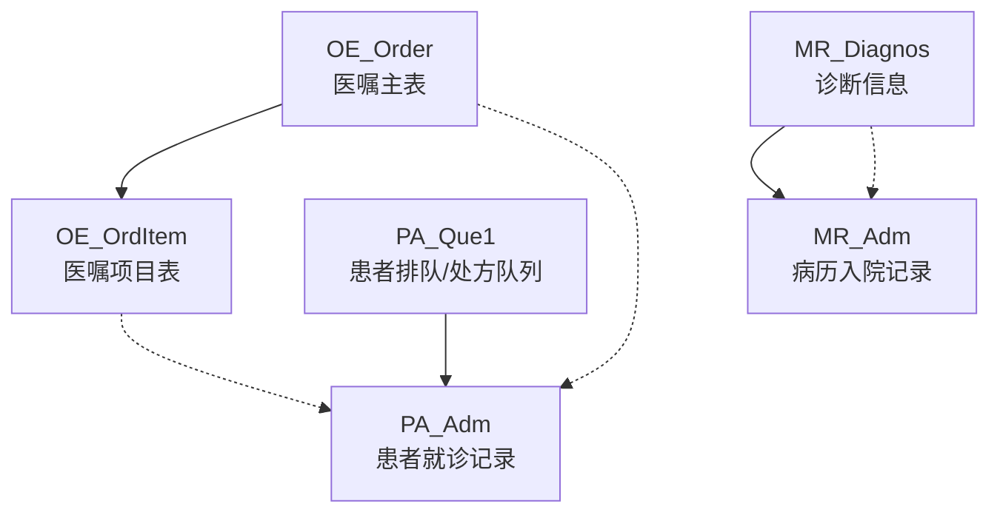
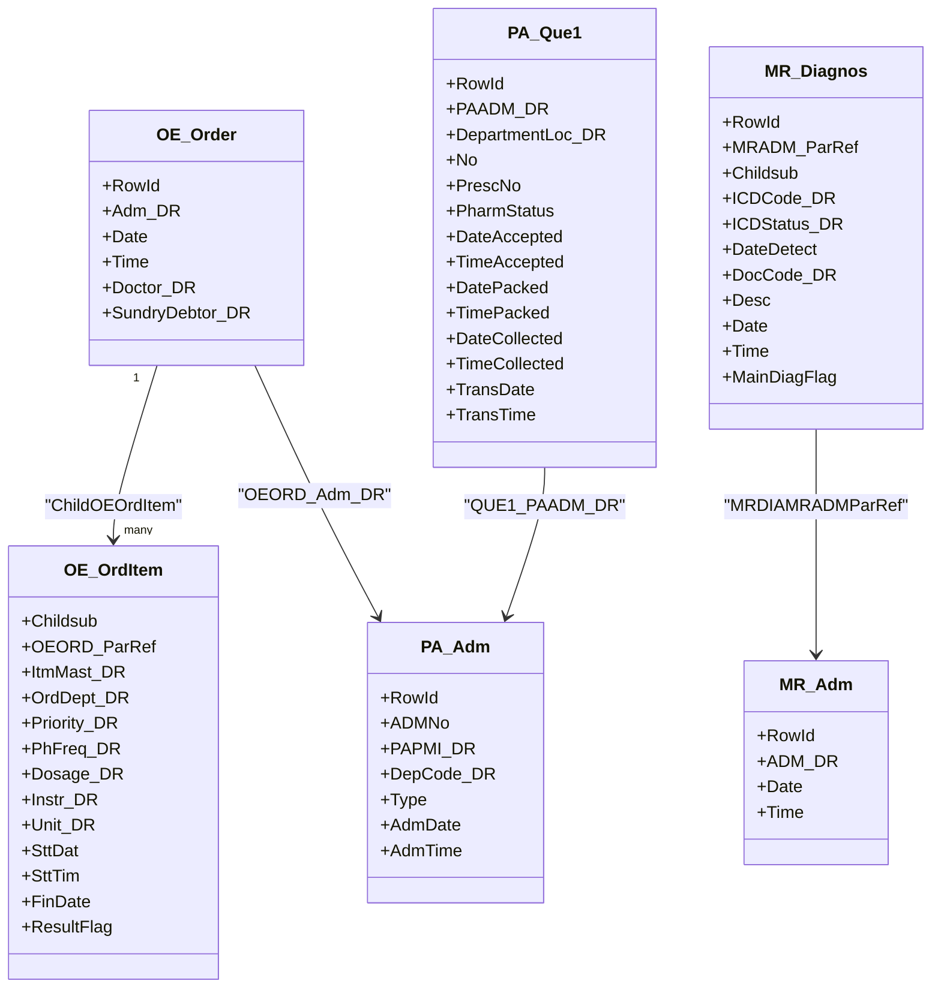
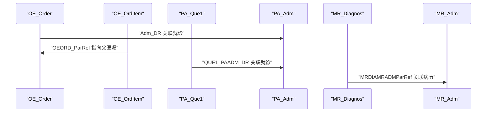

# 核心业务表结构

<cite>
**本文引用的文件**
- [OEOrder.cls](file://src/backend/doc-ws/User/OEOrder.cls)
- [OEOrdItem.cls](file://src/backend/doc-ws/User/OEOrdItem.cls)
- [PAQue1.cls](file://src/backend/doc-ws/User/PAQue1.cls)
- [MRDiagnos.cls](file://src/backend/doc-ws/User/MRDiagnos.cls)
- [PAAdm.cls](file://src/backend/opadm-mc/User/PAAdm.cls)
- [MRAdm.cls](file://src/backend/doc-ws/User/MRAdm.cls)
</cite>

## 目录
1. [简介](#简介)
2. [项目结构与范围](#项目结构与范围)
3. [核心组件概览](#核心组件概览)
4. [架构总览](#架构总览)
5. [详细表结构设计](#详细表结构设计)
6. [表间关系与外键约束](#表间关系与外键约束)
7. [索引设计与查询优化](#索引设计与查询优化)
8. [典型查询示例](#典型查询示例)
9. [性能注意事项](#性能注意事项)
10. [故障排查指南](#故障排查指南)
11. [结论](#结论)

## 简介
本文件聚焦于医嘱主表、医嘱项目表、患者基本信息表、诊断信息表等核心业务表的结构设计，说明字段定义、数据类型、约束条件与默认值，解释表间关系、外键约束与索引设计，并提供典型查询示例与性能优化建议。文档基于代码库中的类定义进行梳理，确保与实际实现一致。

## 项目结构与范围
- 核心表对应的类位于 doc-ws/User 目录下，采用 InterSystems IRIS 的 %Persistent 持久化类映射到 SQL 表。
- 通过 SqlTableName 指定物理表名，通过 StorageStrategy = SQLStorage 启用 SQL 存储。
- 使用 Relationship 声明实体间的父子关系（如医嘱主表与医嘱项目表），并通过 Required 标记强关联。
- 通过 Index 和 SQLMap 自定义索引，以支持常用查询路径。

图表来源
- [OEOrder.cls:1-201](file://src/backend/doc-ws/User/OEOrder.cls#L1-L201)
- [OEOrdItem.cls:1-800](file://src/backend/doc-ws/User/OEOrdItem.cls#L1-L800)
- [PAQue1.cls:1-535](file://src/backend/doc-ws/User/PAQue1.cls#L1-L535)
- [MRDiagnos.cls:1-795](file://src/backend/doc-ws/User/MRDiagnos.cls#L1-L795)
- [PAAdm.cls:1-200](file://src/backend/opadm-mc/User/PAAdm.cls#L1-L200)
- [MRAdm.cls:1-200](file://src/backend/doc-ws/User/MRAdm.cls#L1-L200)

章节来源
- [OEOrder.cls:1-201](file://src/backend/doc-ws/User/OEOrder.cls#L1-L201)
- [OEOrdItem.cls:1-800](file://src/backend/doc-ws/User/OEOrdItem.cls#L1-L800)
- [PAQue1.cls:1-535](file://src/backend/doc-ws/User/PAQue1.cls#L1-L535)
- [MRDiagnos.cls:1-795](file://src/backend/doc-ws/User/MRDiagnos.cls#L1-L795)
- [PAAdm.cls:1-200](file://src/backend/opadm-mc/User/PAAdm.cls#L1-L200)
- [MRAdm.cls:1-200](file://src/backend/doc-ws/User/MRAdm.cls#L1-L200)

## 核心组件概览
- OE_Order：医嘱主表，承载一次医嘱的元数据（日期、时间、医生、科室等）及与医嘱项目的父子关系。
- OE_OrdItem：医嘱项目表，承载具体执行项（药品、检查、治疗等）的详细属性（剂量、频次、优先级、状态等）。
- PA_Que1：患者排队/处方队列表，记录处方在药房或科室的处理流程节点（接受、打包、采集等）及时间戳。
- MR_Diagnos：诊断信息表，记录每次就诊的诊断条目（ICD编码、状态、时间、主次标志等）。

章节来源
- [OEOrder.cls:1-201](file://src/backend/doc-ws/User/OEOrder.cls#L1-L201)
- [OEOrdItem.cls:1-800](file://src/backend/doc-ws/User/OEOrdItem.cls#L1-L800)
- [PAQue1.cls:1-535](file://src/backend/doc-ws/User/PAQue1.cls#L1-L535)
- [MRDiagnos.cls:1-795](file://src/backend/doc-ws/User/MRDiagnos.cls#L1-L795)

## 架构总览
下图展示了核心表之间的主要关系与关键外键指向：

图表来源
- [OEOrder.cls:1-201](file://src/backend/doc-ws/User/OEOrder.cls#L1-L201)
- [OEOrdItem.cls:1-800](file://src/backend/doc-ws/User/OEOrdItem.cls#L1-L800)
- [PAQue1.cls:1-535](file://src/backend/doc-ws/User/PAQue1.cls#L1-L535)
- [MRDiagnos.cls:1-795](file://src/backend/doc-ws/User/MRDiagnos.cls#L1-L795)
- [PAAdm.cls:1-200](file://src/backend/opadm-mc/User/PAAdm.cls#L1-L200)
- [MRAdm.cls:1-200](file://src/backend/doc-ws/User/MRAdm.cls#L1-L200)

## 详细表结构设计

### 医嘱主表（OE_Order）
- 表名：OE_Order
- 主键：RowId（自增数值型）
- 关键字段
  - Adm_DR：关联患者就诊记录（PA_Adm）
  - Date/Time：医嘱创建日期与时间（默认当前系统时间）
  - Doctor_DR：开嘱医生（CTCareProv）
  - SundryDebtor_DR：其他债务人（ARCSundryDebtor）
- 关系
  - 子表：OE_OrdItem（一对多）
- 索引
  - RowIDBasedIDKeyIndex：基于 RowId 的主键索引
  - 自定义索引：按 Adm_DR、Date、SundryDebtor_DR 建立索引以加速查询

章节来源
- [OEOrder.cls:1-201](file://src/backend/doc-ws/User/OEOrder.cls#L1-L201)

### 医嘱项目表（OE_OrdItem）
- 表名：OE_OrdItem
- 主键：Childsub（自增数值型）
- 关键字段
  - OEORD_ParRef：父医嘱主表行标识（OE_Order）
  - ItmMast_DR：项目主档（ARCItmMast）
  - OrdDept_DR：开嘱科室（CTLoc）
  - Priority_DR：优先级（OECPriority）
  - PhFreq_DR/Dosage_DR/Instr_DR/Unit_DR：频次、剂量、用法、单位
  - SttDat/SttTim：开始日期/时间
  - FinDate：结束日期（计算字段）
  - ResultFlag：结果标志
  - 大量扩展字段用于不同业务场景（检验、影像、输血、放射等）
- 关系
  - 父表：OE_Order（一对一或多对一）
  - 子表：执行、结果、标本、费用、状态、SNOMED 编码、问题、医生、饮食修饰、财务周期、转诊医生、警示消息、动作、诊断、剂量数量等
- 索引
  - RowIDBasedIDKeyIndex：基于 Childsub 的主键索引

章节来源
- [OEOrdItem.cls:1-800](file://src/backend/doc-ws/User/OEOrdItem.cls#L1-L800)

### 患者基本信息表（PA_Que1）
- 表名：PA_Que1
- 主键：RowId（自增数值型）
- 关键字段
  - PAADM_DR：患者就诊记录（PA_Adm）
  - DepartmentLoc_DR：部门位置（CTLoc）
  - No：队列号
  - PrescNo：处方号
  - PharmStatus：药房状态
  - DateAccepted/TimeAccepted：接受日期/时间
  - DatePacked/TimePacked：打包日期/时间
  - DateCollected/TimeCollected：采集日期/时间
  - TransDate/TransTime：交易日期/时间（默认当前系统时间）
  - CareProviderDR：服务提供者（CTCareProv）
  - OrderDepDR：开嘱科室（CTLoc）
  - Priority：优先级
  - UserAccepted/UserAcceptedDR：接受用户
  - LastUpdateUserDR/LastUpdateDate/LastUpdateTime：最后更新信息
  - StartDate/EndDate：有效期区间
  - DateUnCollect/TimeUnCollect：未采集时间
  - 代办人信息：证件类型、证件号码、姓名、电话
- 索引
  - 多个复合索引：按部门+接受日期、部门+采集日期、部门+药房状态+交易日期+处方号、部门+药房状态+处方号、PAADM_DR、PrescNo、Start/End 日期区间等

章节来源
- [PAQue1.cls:1-535](file://src/backend/doc-ws/User/PAQue1.cls#L1-L535)

### 诊断信息表（MR_Diagnos）
- 表名：MR_Diagnos
- 主键：RowId（自增数值型）
- 关键字段
  - MRADM_ParRef：病历入院记录（MR_Adm）
  - Childsub：子序号
  - ICDCode_DR：ICD 诊断编码（MRCICDDx）
  - ICDStatus_DR：ICD 状态（MRCICDStat）
  - DateDetect：发现日期
  - DocCode_DR：医生（CTCareProv）
  - Desc：描述（列表类型）
  - Date/Time：诊断日期/时间
  - DiagStat_DR：诊断状态（MRCDiagnosStatus）
  - SignSym_DR：症状体征（MRCDiagnosSignSymptom）
  - DRGOrder：DRG 顺序
  - UpdateUser_DR/UpdateHospital_DR/UpdateDate/UpdateTime：更新信息
  - MainDiagFlag：是否主诊断
  - BodyPart：身体部位
  - PrefixDesc：诊断前缀文本
  - LongDiagnosFlag：长效诊断标识
  - Level/Sequence：级别/顺序
  - AddDiagnoseWay：下诊断方式（门诊/医生/护士）
  - InsuMainDiagFlag：医保结算主诊断标志
  - TCMTreat_DR：中医治法指向
  - StopReason_DR：截止原因
  - Correct_DR：修正关联诊断
- 索引
  - 多个复合索引：按 MRADM_ParRef、Childsub、日期、更新时间、关联诊断等

章节来源
- [MRDiagnos.cls:1-795](file://src/backend/doc-ws/User/MRDiagnos.cls#L1-L795)

## 表间关系与外键约束
- OE_Order → PA_Adm：通过 Adm_DR 关联患者就诊记录，表示该医嘱属于某次就诊。
- OE_OrdItem → OE_Order：通过 OEORD_ParRef 指向父医嘱，形成“主-子”层级。
- PA_Que1 → PA_Adm：通过 QUE1_PAADM_DR 关联患者就诊记录，表示处方队列归属。
- MR_Diagnos → MR_Adm：通过 MRDIAMRADMParRef 关联病历入院记录，表示诊断归属。
- 关系强度：部分 Relationship 标注 Required，表示强依赖（如医嘱项目必须属于某个医嘱）。

图表来源
- [OEOrder.cls:1-201](file://src/backend/doc-ws/User/OEOrder.cls#L1-L201)
- [OEOrdItem.cls:1-800](file://src/backend/doc-ws/User/OEOrdItem.cls#L1-L800)
- [PAQue1.cls:1-535](file://src/backend/doc-ws/User/PAQue1.cls#L1-L535)
- [MRDiagnos.cls:1-795](file://src/backend/doc-ws/User/MRDiagnos.cls#L1-L795)
- [PAAdm.cls:1-200](file://src/backend/opadm-mc/User/PAAdm.cls#L1-L200)
- [MRAdm.cls:1-200](file://src/backend/doc-ws/User/MRAdm.cls#L1-L200)

## 索引设计与查询优化
- OE_Order
  - 主键索引：RowId
  - 业务索引：Adm_DR、Date、SundryDebtor_DR
  - 建议：按就诊号与日期范围查询时优先使用 Adm_DR + Date 组合；按债务人统计时使用 SundryDebtor_DR。
- OE_OrdItem
  - 主键索引：Childsub
  - 建议：按父医嘱查询时利用 OEORD_ParRef；按开始/结束日期过滤时结合 SttDat/FinDate；按优先级/状态筛选时结合相应字典字段。
- PA_Que1
  - 主键索引：RowId
  - 业务索引：DepartmentLoc_DR + DateAccepted、DepartmentLoc_DR + DateCollected、DepartmentLoc_DR + PharmStatus + TransDate + PrescNo、DepartmentLoc_DR + PharmStatus + PrescNo、PAADM_DR、PrescNo、StartDate/EndDate 区间
  - 建议：按部门与日期窗口查询队列任务时，优先使用带 DepartmentLoc_DR 的复合索引；按处方号检索时使用 PrescNo 索引。
- MR_Diagnos
  - 主键索引：RowId
  - 业务索引：MRADM_ParRef + Childsub、Date、UpdateDate、Correct_DR 等
  - 建议：按病历入院记录查询诊断集合时，使用 MRADM_ParRef；按诊断日期或更新时间排序时，使用对应索引。

章节来源
- [OEOrder.cls:1-201](file://src/backend/doc-ws/User/OEOrder.cls#L1-L201)
- [OEOrdItem.cls:1-800](file://src/backend/doc-ws/User/OEOrdItem.cls#L1-L800)
- [PAQue1.cls:1-535](file://src/backend/doc-ws/User/PAQue1.cls#L1-L535)
- [MRDiagnos.cls:1-795](file://src/backend/doc-ws/User/MRDiagnos.cls#L1-L795)

## 典型查询示例
以下示例为概念性 SQL，展示如何利用上述索引与字段进行高效查询。实际列名与表名请以数据库生成为准。

- 查询某患者的所有医嘱主记录
  - 思路：使用 OE_Order.Adm_DR 与 PA_Adm.RowId 关联，并按 Date 排序
  - 参考字段：OE_Order.OEORD_Adm_DR、OE_Order.OEORD_Date

- 查询某医嘱下的所有项目并筛选优先级
  - 思路：使用 OE_OrdItem.OEORI_OEORD_ParRef 关联父医嘱，结合 OEORI_Priority_DR 过滤
  - 参考字段：OE_OrdItem.OEORI_Childsub、OE_OrdItem.OEORI_Priority_DR

- 查询某部门在指定日期范围内的处方队列
  - 思路：使用 PA_Que1.DepartmentLoc_DR + DateAccepted 复合索引
  - 参考字段：PA_Que1.QUE1_DepartmentLoc_DR、PA_Que1.QUE1_DateAccepted

- 查询某病历入院记录的所有诊断并按更新时间倒序
  - 思路：使用 MR_Diagnos.MRDIA_MRADM_ParRef 关联 MR_Adm，并结合 UpdateDate 索引
  - 参考字段：MR_Diagnos.MRDIA_MRADM_ParRef、MR_Diagnos.MRDIA_UpdateDate

章节来源
- [OEOrder.cls:1-201](file://src/backend/doc-ws/User/OEOrder.cls#L1-L201)
- [OEOrdItem.cls:1-800](file://src/backend/doc-ws/User/OEOrdItem.cls#L1-L800)
- [PAQue1.cls:1-535](file://src/backend/doc-ws/User/PAQue1.cls#L1-L535)
- [MRDiagnos.cls:1-795](file://src/backend/doc-ws/User/MRDiagnos.cls#L1-L795)

## 性能注意事项
- 避免全表扫描：尽量使用已定义的复合索引，尤其是包含 DepartmentLoc_DR、Adm_DR、MRADM_ParRef 的查询。
- 控制返回行数：分页查询时结合主键或唯一索引，减少回表成本。
- 合理使用计算字段：如 OE_OrdItem.FinDate 为计算字段，避免在 WHERE 中对计算字段做复杂函数运算。
- 批量操作：插入/更新大量数据时，分批提交以减少锁竞争与日志压力。
- 监控慢查询：关注涉及多表 JOIN 且无合适索引的语句，必要时增加索引或改写查询。

## 故障排查指南
- 触发器日志：各表定义了 Before/After Insert/Update/Delete 触发器，若出现异常可检查触发器调用链与日志输出。
- 外键一致性：当删除父记录（如 OE_Order）时，需确认子记录（OE_OrdItem）的级联策略是否符合预期。
- 默认值校验：日期/时间字段默认值为当前系统时间，若出现异常请检查系统时间与序列生成逻辑。
- 停用表引用：部分类中引用了已停用的表（如 DHCDocStopTable），在编译或运行时可能报错，需评估替换方案。

章节来源
- [OEOrder.cls:35-73](file://src/backend/doc-ws/User/OEOrder.cls#L35-L73)
- [PAQue1.cls:94-132](file://src/backend/doc-ws/User/PAQue1.cls#L94-L132)
- [MRDiagnos.cls:247-280](file://src/backend/doc-ws/User/MRDiagnos.cls#L247-L280)

## 结论
通过对 OE_Order、OE_OrdItem、PA_Que1、MR_Diagnos 等核心表的深入分析，明确了字段定义、约束与默认值，梳理了表间关系与外键约束，并总结了索引设计与查询优化策略。遵循本文的建议可有效提升查询性能与数据一致性，保障医疗业务流程的稳定运行。