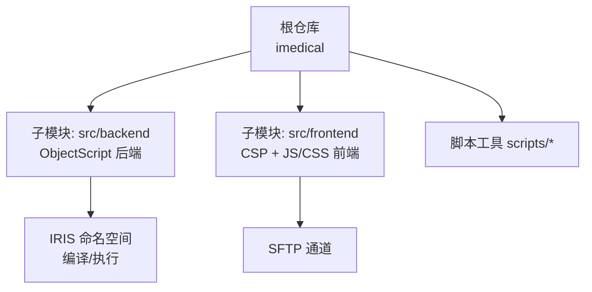
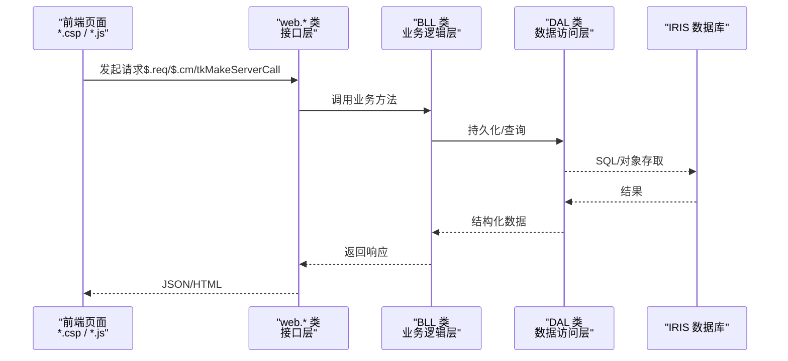
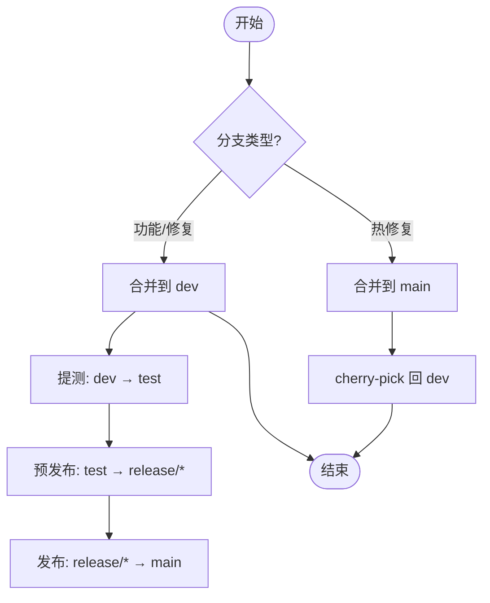
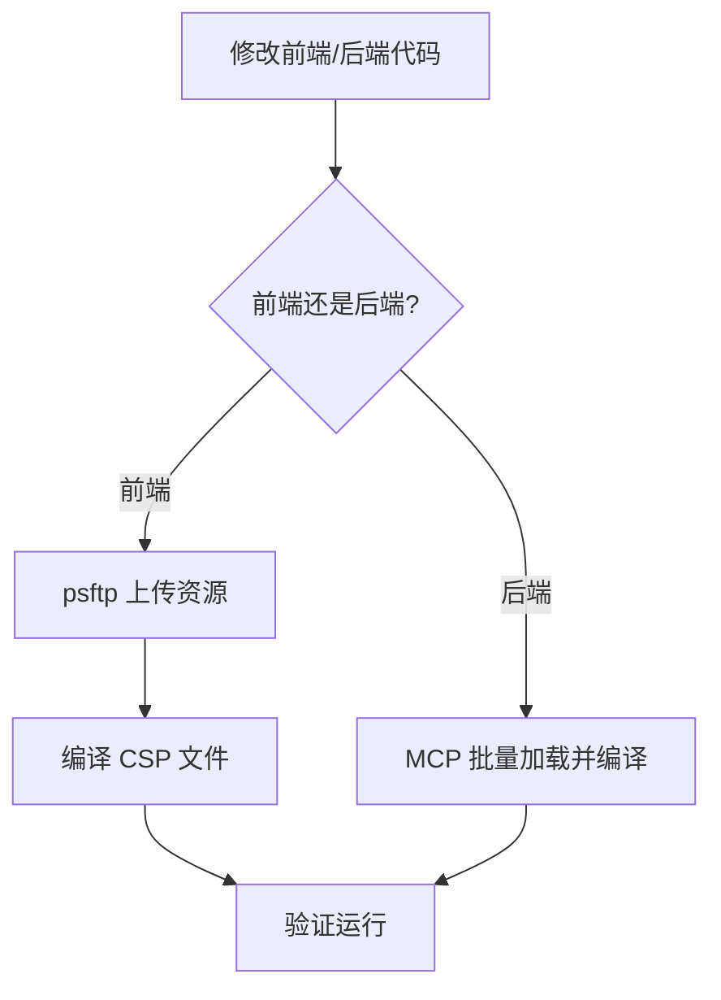
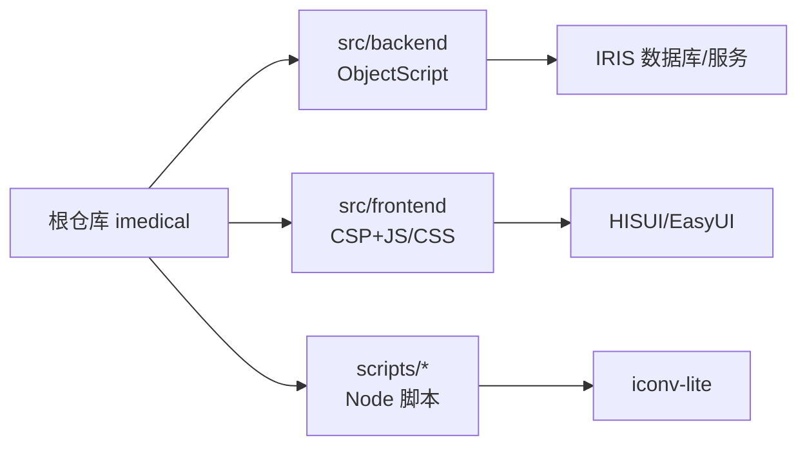

# 开发工作流

<cite>
**本文引用的文件**
- [README.md](file://README.md)
- [CONTRIBUTING.md](file://CONTRIBUTING.md)
- [AGENTS.md](file://AGENTS.md)
- [.gitmodules](file://.gitmodules)
- [sftp-sync.js](file://scripts/sftp-sync.js)
- [package.json](file://scripts/package.json)
- [.gitignore](file://.gitignore)
</cite>

## 目录
1. [简介](#简介)
2. [项目结构](#项目结构)
3. [核心组件](#核心组件)
4. [架构总览](#架构总览)
5. [详细组件分析](#详细组件分析)
6. [依赖关系分析](#依赖关系分析)
7. [性能与效率建议](#性能与效率建议)
8. [故障排查指南](#故障排查指南)
9. [结论](#结论)
10. [附录](#附录)

## 简介
本文件面向 IRIS HIS 项目的开发与协作，系统化说明开发规范、代码标准、版本控制与提交流程、发布与版本管理策略、依赖与构建流程，以及团队协作与问题处理机制。目标是让新成员快速上手，老成员统一协作方式，降低沟通与交付成本。

## 项目结构
本项目采用“根仓库 + Git Submodule”的元仓库模式：
- 根仓库用于聚合管理与脚本工具
- 两个子模块分别承载后端（ObjectScript）与前端（CSP + jQuery/HISUI）
- 服务器部署通过 SFTP 上传前端资源，后端通过 IRIS ObjectScript 扩展直接编译上传

图表来源
- [README.md:5-35](file://README.md#L5-L35)
- [.gitmodules:1-7](file://.gitmodules#L1-L7)

章节来源
- [README.md:5-52](file://README.md#L5-L52)
- [.gitmodules:1-7](file://.gitmodules#L1-L7)

## 核心组件
- 多产品域划分：doc-ws、cure-ws、dental-ws、epmi-mc、opadm-mc、pilot-project-ws、pilot-study-ws、public-mc、conting-ws、triage-ws
- 前后端分离：后端为 ObjectScript（.cls/.mac），前端为 CSP + jQuery/HISUI
- 公共层：public-mc 被所有产品共享，修改需谨慎
- 部署链路：前端通过 psftp 上传并编译 CSP；后端通过 MCP 工具批量加载并编译

章节来源
- [README.md:11-35](file://README.md#L11-L35)
- [AGENTS.md:65-115](file://AGENTS.md#L65-L115)

## 架构总览
下图展示从前端到后端的调用链与部署路径，体现 Web 接口层、业务逻辑层、数据访问层的分层设计，以及前后端各自的部署方式。

图表来源
- [AGENTS.md:65-88](file://AGENTS.md#L65-L88)
- [AGENTS.md:99-105](file://AGENTS.md#L99-L105)

## 详细组件分析

### 分支策略与提交流程
- 受保护分支：main（生产）、test（测试）、dev（开发集成）
- 临时分支：feature/<需求号>-<简述>、fix/<需求号>-<简述>、hotfix/<需求号>-<简述>
- 提升路径严格遵循：feature/fix → dev → test → release/* → main；hotfix 合并至 main 后再 cherry-pick 到 dev
- 角色权限：Maintainer 可合并受保护分支；Developer 可直接推送/合并到 dev；Reporter 需通过 MR 并经审批

图表来源
- [CONTRIBUTING.md:31-76](file://CONTRIBUTING.md#L31-L76)
- [CONTRIBUTING.md:145-228](file://CONTRIBUTING.md#L145-L228)
- [CONTRIBUTING.md:231-249](file://CONTRIBUTING.md#L231-L249)

章节来源
- [CONTRIBUTING.md:9-76](file://CONTRIBUTING.md#L9-L76)
- [CONTRIBUTING.md:145-228](file://CONTRIBUTING.md#L145-L228)
- [CONTRIBUTING.md:231-249](file://CONTRIBUTING.md#L231-L249)

### 提交信息与代码审查
- 提交信息格式：{修改类型}({需求序号}): {菜单路径} + 修改说明 + 需求描述；类型枚举 fix/feat/refactor/docs/style/test/chore
- 代码审查：MR 必须通过评审，目标为受保护分支时需至少 1 名审核人批准；讨论未解决不可合并
- 自动化校验：启用 CI 后将检查分支命名与提升路径（当前未启用 Runner）

章节来源
- [AGENTS.md:225-233](file://AGENTS.md#L225-L233)
- [CONTRIBUTING.md:329-336](file://CONTRIBUTING.md#L329-L336)
- [CONTRIBUTING.md:367-384](file://CONTRIBUTING.md#L367-L384)

### 发布流程与版本管理
- 正式发版：从 main 创建 release/<版本号>，将 test 合并入 release，验收通过后合并回 main 并删除 release 分支
- 补丁发布：在 dev 验证通过后，cherry-pick 到 test → release → main，逐环境验证
- 版本规则：release 分支命名 release/vX.Y.Z(-hotfixN)，合并回 main 后立即删除

章节来源
- [CONTRIBUTING.md:48-57](file://CONTRIBUTING.md#L48-L57)
- [CONTRIBUTING.md:159-228](file://CONTRIBUTING.md#L159-L228)

### 依赖管理与构建流程
- 无现代前端构建工具链；前端静态资源通过 psftp 上传，CSP 需单独编译
- 后端通过 MCP 工具批量加载并编译；路径映射需在包根目录插入通配符以正确生成文档名
- Node 脚本依赖仅 scripts/package.json 中声明（iconv-lite），首次使用需在 scripts 目录安装

图表来源
- [AGENTS.md:187-209](file://AGENTS.md#L187-L209)
- [README.md:256-278](file://README.md#L256-L278)
- [sftp-sync.js:1-25](file://scripts/sftp-sync.js#L1-L25)

章节来源
- [AGENTS.md:187-209](file://AGENTS.md#L187-L209)
- [README.md:256-278](file://README.md#L256-L278)
- [scripts/package.json:1-10](file://scripts/package.json#L1-L10)

### 团队协作与工作指南
- 任务分配：按产品域划分（doc/cure/dental/epmi/opadm/pilot/triage/public/conting），公共模块 public-mc 变更需评估影响范围
- 进度跟踪：通过 GitLab MR 与日志聚合脚本（get-all-logs.js）查看跨仓库提交历史
- 问题报告：Bug 修复使用 bug-fix Skill，验证使用 bug-verify；提交使用 code-submit Skill 辅助

章节来源
- [AGENTS.md:7-23](file://AGENTS.md#L7-L23)
- [AGENTS.md:248-265](file://AGENTS.md#L248-L265)
- [README.md:448-481](file://README.md#L448-L481)

### 开发环境快速搭建
- 克隆主仓库并初始化子模块
- 复制 VS Code 模板配置并填写 IRIS/SFTP 连接信息
- 安装 Node.js 并在 scripts 目录安装 iconv-lite
- 验证子模块状态与 MCP 连接

章节来源
- [README.md:62-207](file://README.md#L62-L207)
- [AGENTS.md:33-47](file://AGENTS.md#L33-L47)
- [README.md:247-255](file://README.md#L247-L255)

## 依赖关系分析
- 根仓库依赖：Git Submodule（backend/frontend）、Node 脚本（scripts/*）
- 前端依赖：jQuery、HISUI（基于 EasyUI 封装），无 npm 构建
- 后端依赖：InterSystems IRIS、ObjectScript、CSP
- 脚本依赖：iconv-lite（编码转换）

图表来源
- [.gitmodules:1-7](file://.gitmodules#L1-L7)
- [scripts/package.json:1-10](file://scripts/package.json#L1-L10)
- [AGENTS.md:28-32](file://AGENTS.md#L28-L32)

章节来源
- [.gitmodules:1-7](file://.gitmodules#L1-L7)
- [scripts/package.json:1-10](file://scripts/package.json#L1-L10)
- [AGENTS.md:28-32](file://AGENTS.md#L28-L32)

## 性能与效率建议
- 前端缓存：字典/枚举/配置等低变化频率数据可使用 $.req 内置缓存（memory/session/local），患者相关或实时性高的数据禁止缓存
- 批量操作：后端使用 iris_doc_load 批量加载并编译，减少多次往返
- 部署顺序：修改后必须立即部署并验证，避免遗漏导致线上不一致
- 分支策略：严格按提升路径合并，减少冲突与回归风险

章节来源
- [AGENTS.md:159-177](file://AGENTS.md#L159-L177)
- [AGENTS.md:187-209](file://AGENTS.md#L187-L209)
- [CONTRIBUTING.md:231-249](file://CONTRIBUTING.md#L231-L249)

## 故障排查指南
- 常见错误
  - iris_doc_load 返回 total=0 或 HTTP 405：路径缺少通配符或基准目录错误，需在包根目录名插入通配符（如 D*oc）
  - CSP 编译失败：上传后未执行编译，需调用 iris_doc_compile
  - 前端中文乱码：确保编辑器以 UTF-8 保存
  - PowerShell 命令报错：避免使用 && 或 bash 语法，改用分号分隔
- 定位方法
  - 使用 get-all-logs.js 聚合查看各仓库提交历史
  - 使用 sftp-sync.js check 打印本地→远程映射，确认上传路径正确
  - 检查 .vscode/sftp.json 与 settings.json 配置是否匹配实际环境

章节来源
- [AGENTS.md:291-299](file://AGENTS.md#L291-L299)
- [README.md:448-481](file://README.md#L448-L481)
- [sftp-sync.js:1-25](file://scripts/sftp-sync.js#L1-L25)

## 结论
本项目通过清晰的分支策略、严格的提交流程、规范的构建与部署链路，以及完善的脚本工具与协作指引，保障了多产品 HIS 系统的稳定迭代与高效交付。建议团队持续遵循本文档约定，结合 GitLab 保护规则与未来 CI/CD 能力，进一步提升质量与效率。

## 附录
- 快速参考
  - 分支命名：feature/fix/hotfix/<需求号>-<简述>
  - 提交信息：{类型}({需求号}): {路径} + 说明 + 需求
  - 提测：dev → test（Maintainer 发起 MR）
  - 发布：test → release/* → main（产品部主导）
- 常用命令
  - 初始化子模块：git submodule update --init --recursive
  - 前端上传：node scripts/sftp-sync.js upload <路径...>
[REDACTED: environment-specific example]
[REDACTED: environment-specific example]

章节来源
- [CONTRIBUTING.md:58-76](file://CONTRIBUTING.md#L58-L76)
- [AGENTS.md:225-233](file://AGENTS.md#L225-L233)
- [README.md:256-278](file://README.md#L256-L278)
- [AGENTS.md:50-62](file://AGENTS.md#L50-L62)