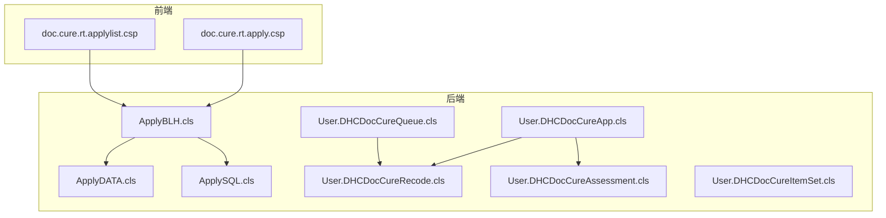
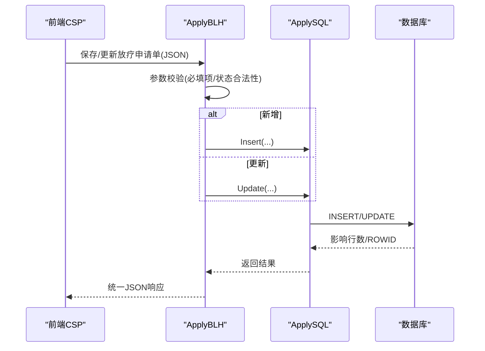
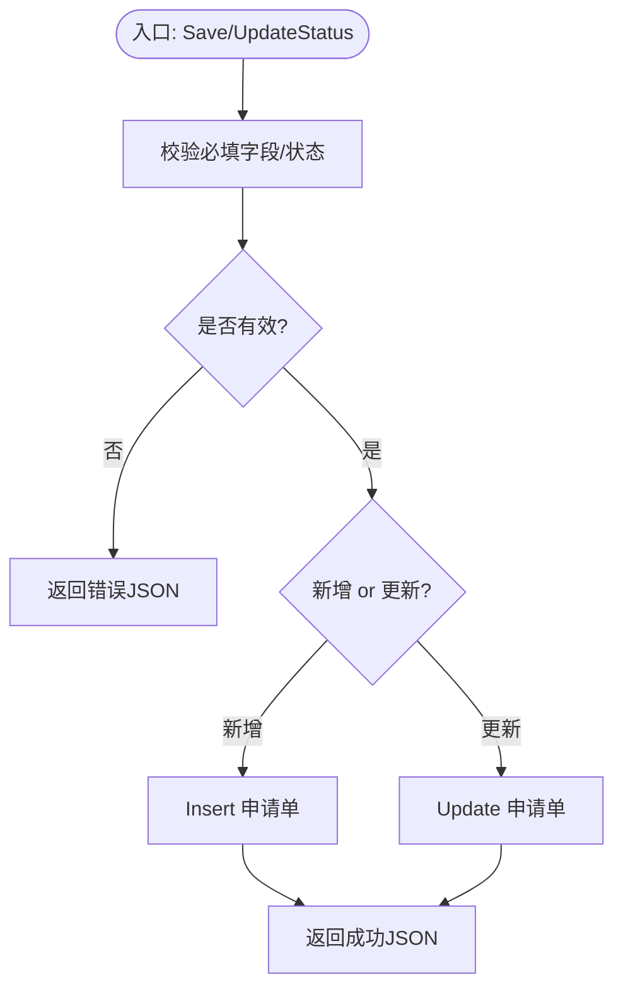
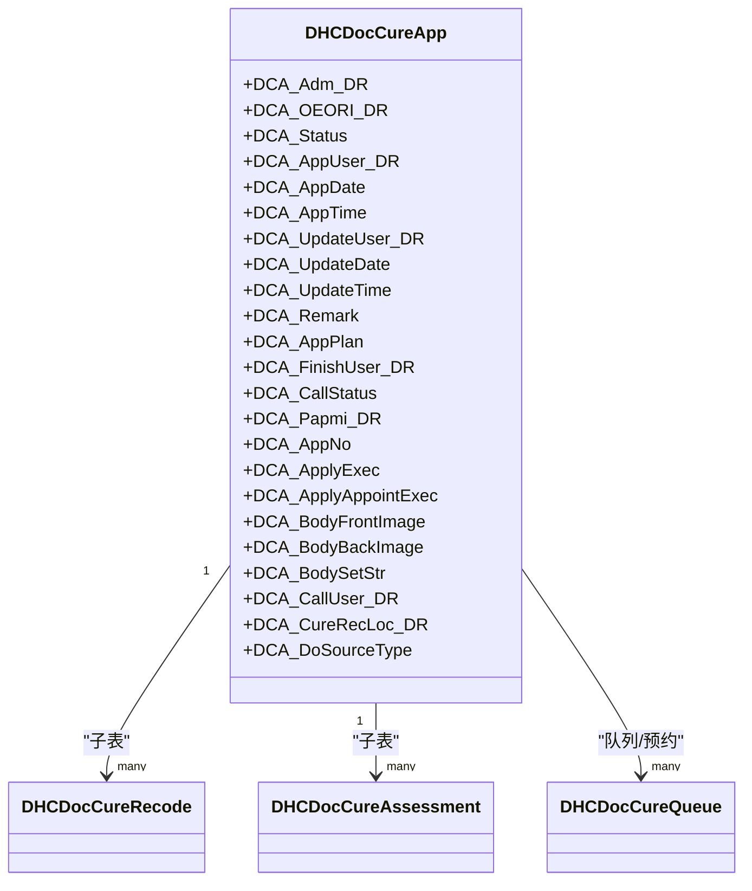
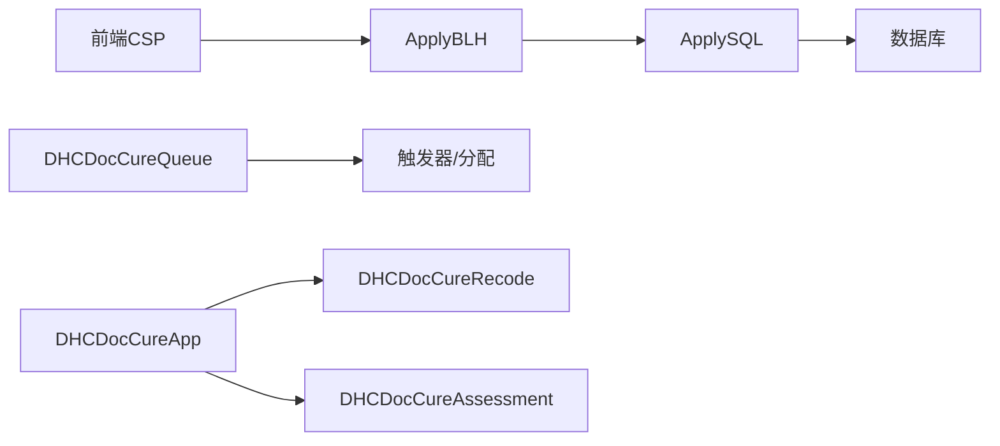

# 治疗系统 (cure-ws)

<cite>
**本文引用的文件**
- [README.md](file://README.md)
- [DHCDocCureApp.cls](file://src/backend/cure-ws/User/DHCDocCureApp.cls)
- [DHCDocCureRecode.cls](file://src/backend/cure-ws/User/DHCDocCureRecode.cls)
- [DHCDocCureAssessment.cls](file://src/backend/cure-ws/User/DHCDocCureAssessment.cls)
- [DHCDocCureQueue.cls](file://src/backend/cure-ws/User/DHCDocCureQueue.cls)
- [DHCDocCureItemSet.cls](file://src/backend/cure-ws/User/DHCDocCureItemSet.cls)
- [ApplyBLH.cls](file://src/backend/cure-ws/DHCDoc/Cure/RT/ApplyBLH.cls)
- [ApplyDATA.cls](file://src/backend/cure-ws/DHCDoc/Cure/RT/ApplyDATA.cls)
- [ApplySQL.cls](file://src/backend/cure-ws/DHCDoc/Cure/RT/ApplySQL.cls)
- [doc.cure.rt.apply.csp](file://src/frontend/cure-ws/csp/doc.cure.rt.apply.csp)
- [doc.cure.rt.applylist.csp](file://src/frontend/cure-ws/csp/doc.cure.rt.applylist.csp)
</cite>

## 目录
1. [简介](#简介)
2. [项目结构](#项目结构)
3. [核心组件](#核心组件)
4. [架构总览](#架构总览)
5. [详细组件分析](#详细组件分析)
6. [依赖关系分析](#依赖关系分析)
7. [性能与排班考量](#性能与排班考量)
8. [故障排查指南](#故障排查指南)
9. [结论](#结论)
10. [附录：配置与集成](#附录配置与集成)

## 简介
本文件为“治疗系统（cure-ws）”的综合技术文档，覆盖治疗计划管理、执行跟踪、评估量表、治疗申请流程、治疗项目配置、治疗记录管理、资源配置与排班、工作量统计等关键业务与技术要点。重点说明前端CSP页面与后端服务类的协作模式，并给出常见问题的定位思路与优化建议。

## 项目结构
- 后端位于 src/backend/cure-ws，采用 InterSystems IRIS ObjectScript，按领域划分：
  - User：核心实体模型（申请单、预约、队列、记录、评估、项目设置等）
  - DHCDoc/Cure/RT：放疗申请单相关处理类（业务逻辑、数据访问、SQL封装）
- 前端位于 src/frontend/cure-ws，使用 CSP + jQuery/HISUI，提供治疗申请、列表、工作流、报表等页面。

图表来源
- [ApplyBLH.cls:1-61](file://src/backend/cure-ws/DHCDoc/Cure/RT/ApplyBLH.cls#L1-L61)
- [ApplyDATA.cls:1-36](file://src/backend/cure-ws/DHCDoc/Cure/RT/ApplyDATA.cls#L1-L36)
- [ApplySQL.cls:1-107](file://src/backend/cure-ws/DHCDoc/Cure/RT/ApplySQL.cls#L1-L107)
- [DHCDocCureApp.cls:1-439](file://src/backend/cure-ws/User/DHCDocCureApp.cls#L1-L439)
- [DHCDocCureRecode.cls:1-365](file://src/backend/cure-ws/User/DHCDocCureRecode.cls#L1-L365)
- [DHCDocCureAssessment.cls:1-164](file://src/backend/cure-ws/User/DHCDocCureAssessment.cls#L1-L164)
- [DHCDocCureQueue.cls:1-320](file://src/backend/cure-ws/User/DHCDocCureQueue.cls#L1-L320)
- [DHCDocCureItemSet.cls:1-252](file://src/backend/cure-ws/User/DHCDocCureItemSet.cls#L1-L252)

章节来源
- [README.md:1-549](file://README.md#L1-L549)

## 核心组件
- 治疗申请单（放疗）：保存、更新、状态流转
- 治疗申请主表：关联医嘱、患者、科室、状态、图片、模板等
- 治疗记录：与预约、执行记录、时间、效果、图片、批次号等关联
- 治疗评估：与模板、JSON内容、提交状态、执行记录关联
- 队列与排班：预约排班、排队序号、状态、时间段、服务组
- 治疗项目设置：项目映射、服务组、自动预约/直接执行、适应症/禁忌、时长等

章节来源
- [ApplyBLH.cls:1-61](file://src/backend/cure-ws/DHCDoc/Cure/RT/ApplyBLH.cls#L1-L61)
- [ApplyDATA.cls:1-36](file://src/backend/cure-ws/DHCDoc/Cure/RT/ApplyDATA.cls#L1-L36)
- [ApplySQL.cls:1-107](file://src/backend/cure-ws/DHCDoc/Cure/RT/ApplySQL.cls#L1-L107)
- [DHCDocCureApp.cls:1-439](file://src/backend/cure-ws/User/DHCDocCureApp.cls#L1-L439)
- [DHCDocCureRecode.cls:1-365](file://src/backend/cure-ws/User/DHCDocCureRecode.cls#L1-L365)
- [DHCDocCureAssessment.cls:1-164](file://src/backend/cure-ws/User/DHCDocCureAssessment.cls#L1-L164)
- [DHCDocCureQueue.cls:1-320](file://src/backend/cure-ws/User/DHCDocCureQueue.cls#L1-L320)
- [DHCDocCureItemSet.cls:1-252](file://src/backend/cure-ws/User/DHCDocCureItemSet.cls#L1-L252)

## 架构总览
治疗系统采用“前端CSP页面调用后端ObjectScript类方法”的协作模式：
- 前端页面负责展示与交互，发起请求（如保存申请单、查询列表）
- 后端业务层（ApplyBLH）进行参数校验、事务控制与结果封装
- 数据访问层（ApplySQL）执行具体SQL插入/更新/状态变更
- 数据模型层（User.*）定义持久化实体与关系，支撑跨模块查询与统计

图表来源
- [ApplyBLH.cls:1-61](file://src/backend/cure-ws/DHCDoc/Cure/RT/ApplyBLH.cls#L1-L61)
- [ApplySQL.cls:1-107](file://src/backend/cure-ws/DHCDoc/Cure/RT/ApplySQL.cls#L1-L107)

## 详细组件分析

### 放疗申请单（RT Apply）
- 功能要点
  - 保存/更新：根据是否存在ID决定Insert或Update；生成申请单号；写入创建/更新时间与操作人
  - 状态更新：仅允许指定合法状态集；记录更新人与时间
  - 数据获取：通过索引查找ID，再读取详情并补充医生描述文本
- 关键实现
  - 参数校验：申请单、就诊、患者信息必填；状态值白名单校验
  - 事务与错误：SQL执行失败时回滚并返回错误码与消息
  - 编号规则：基于日期+流水号生成唯一申请单号

图表来源
- [ApplyBLH.cls:1-61](file://src/backend/cure-ws/DHCDoc/Cure/RT/ApplyBLH.cls#L1-L61)
- [ApplySQL.cls:1-107](file://src/backend/cure-ws/DHCDoc/Cure/RT/ApplySQL.cls#L1-L107)

章节来源
- [ApplyBLH.cls:1-61](file://src/backend/cure-ws/DHCDoc/Cure/RT/ApplyBLH.cls#L1-L61)
- [ApplyDATA.cls:1-36](file://src/backend/cure-ws/DHCDoc/Cure/RT/ApplyDATA.cls#L1-L36)
- [ApplySQL.cls:1-107](file://src/backend/cure-ws/DHCDoc/Cure/RT/ApplySQL.cls#L1-L107)

### 治疗申请主表（DHCDocCureApp）
- 职责：承载治疗申请的核心信息（患者、医嘱、状态、图片、模板、来源等），并提供多索引以支持按就诊、申请单号、日期、状态、医嘱等多维度检索
- 关系：一对多关联到预约到达、分诊、治疗记录、执行变更、治疗项目、医嘱、评估等子表
- 存储：SQL存储策略，含多个索引与流式字段（图片）

图表来源
- [DHCDocCureApp.cls:1-439](file://src/backend/cure-ws/User/DHCDocCureApp.cls#L1-L439)
- [DHCDocCureRecode.cls:1-365](file://src/backend/cure-ws/User/DHCDocCureRecode.cls#L1-L365)
- [DHCDocCureAssessment.cls:1-164](file://src/backend/cure-ws/User/DHCDocCureAssessment.cls#L1-L164)
- [DHCDocCureQueue.cls:1-320](file://src/backend/cure-ws/User/DHCDocCureQueue.cls#L1-L320)

章节来源
- [DHCDocCureApp.cls:1-439](file://src/backend/cure-ws/User/DHCDocCureApp.cls#L1-L439)

### 治疗记录（DHCDocCureRecode）
- 职责：记录每次治疗的标题、内容、时间、反应、效果、剂量、结束时间、执行批次号、外部执行号、复核人工号等
- 关系：父表为治疗申请；子表包含变更记录与图片；并与预约到达、医嘱执行、队列等关联
- 索引：按预约到达、创建日期、执行日期、医嘱执行等多维度索引，提升查询效率

章节来源
- [DHCDocCureRecode.cls:1-365](file://src/backend/cure-ws/User/DHCDocCureRecode.cls#L1-L365)

### 治疗评估（DHCDocCureAssessment）
- 职责：记录评估内容、模板ID、模板类型、提交状态、有效性、关联执行记录等
- 关系：父表为治疗申请；支持按执行记录快速检索

章节来源
- [DHCDocCureAssessment.cls:1-164](file://src/backend/cure-ws/User/DHCDocCureAssessment.cls#L1-L164)

### 队列与排班（DHCDocCureQueue）
- 职责：维护预约排班、排队序号、日期时间、科室、状态、患者、呼叫状态、时间段、服务组等
- 触发器：插入/更新后触发分配逻辑（Alloc），用于资源占用与后续处理
- 索引：按日期+科室、日期+患者、患者、排班、排班+序号等多维索引

章节来源
- [DHCDocCureQueue.cls:1-320](file://src/backend/cure-ws/User/DHCDocCureQueue.cls#L1-L320)

### 治疗项目设置（DHCDocCureItemSet）
- 职责：将基础治疗项目与服务组、院区、自动预约/直接执行开关、适应症/禁忌、评估/记录模板、时长等绑定
- 索引：按医院+项目、项目、评估模板、更新日期等索引，便于快速检索与配置

章节来源
- [DHCDocCureItemSet.cls:1-252](file://src/backend/cure-ws/User/DHCDocCureItemSet.cls#L1-L252)

### 前端CSP与后端协作
- 典型页面
  - 放疗申请录入：doc.cure.rt.apply.csp
  - 放疗申请列表：doc.cure.rt.applylist.csp
- 协作方式
  - 前端通过CSP页面发起请求，调用后端ApplyBLH等方法完成保存/更新/状态变更
  - 后端统一返回JSON格式响应，前端据此刷新界面或提示用户

章节来源
- [doc.cure.rt.apply.csp](file://src/frontend/cure-ws/csp/doc.cure.rt.apply.csp)
- [doc.cure.rt.applylist.csp](file://src/frontend/cure-ws/csp/doc.cure.rt.applylist.csp)
- [ApplyBLH.cls:1-61](file://src/backend/cure-ws/DHCDoc/Cure/RT/ApplyBLH.cls#L1-L61)

## 依赖关系分析
- 低耦合分层
  - 前端CSP只关注交互与展示
  - 业务层（ApplyBLH）专注流程控制与校验
  - 数据访问层（ApplySQL）专注SQL与事务
  - 数据模型层（User.*）提供稳定实体与索引
- 关键依赖链
  - 前端 → ApplyBLH → ApplySQL → 数据库
  - 队列 → 触发器 → 分配逻辑（Alloc）→ 资源占用/排班更新
  - 申请主表 → 记录/评估/队列 子表（一对多）

图表来源
- [ApplyBLH.cls:1-61](file://src/backend/cure-ws/DHCDoc/Cure/RT/ApplyBLH.cls#L1-L61)
- [ApplySQL.cls:1-107](file://src/backend/cure-ws/DHCDoc/Cure/RT/ApplySQL.cls#L1-L107)
- [DHCDocCureQueue.cls:1-320](file://src/backend/cure-ws/User/DHCDocCureQueue.cls#L1-L320)
- [DHCDocCureApp.cls:1-439](file://src/backend/cure-ws/User/DHCDocCureApp.cls#L1-L439)
- [DHCDocCureRecode.cls:1-365](file://src/backend/cure-ws/User/DHCDocCureRecode.cls#L1-L365)
- [DHCDocCureAssessment.cls:1-164](file://src/backend/cure-ws/User/DHCDocCureAssessment.cls#L1-L164)

## 性能与排班考量
- 索引设计
  - 申请主表：按就诊、申请单号、申请日期、状态、医嘱、科室等建立索引，提高常用查询性能
  - 治疗记录：按预约到达、创建日期、执行日期、医嘱执行等建立索引
  - 队列：按日期+科室、日期+患者、患者、排班、排班+序号等建立索引
- 事务与一致性
  - 申请单保存/更新/状态变更均包裹在事务中，失败回滚，保证数据一致性
- 排班与资源占用
  - 队列插入/更新触发分配逻辑，避免重复占用同一时间段
  - 通过时间段字符串与服务组关联，支持复杂排班场景
- 扩展性
  - 项目设置支持自动预约/直接执行开关，减少人工干预
  - 评估/记录模板解耦，便于不同科室差异化配置

[本节为通用性能讨论，不直接引用具体代码]

## 故障排查指南
- 申请单保存失败
  - 检查必填字段（申请单、就诊、患者）是否完整
  - 查看SQL执行错误码与消息，确认数据库约束与权限
  - 参考保存/更新流程定位问题点
- 状态更新无效
  - 确认传入状态是否在允许集合内
  - 检查更新SQL是否命中目标记录
- 队列冲突或无法预约
  - 检查时间段是否已被占用
  - 查看触发器与分配逻辑是否执行成功
- 记录/评估未显示
  - 核对父子关系是否正确建立
  - 检查索引与查询条件是否匹配

章节来源
- [ApplyBLH.cls:1-61](file://src/backend/cure-ws/DHCDoc/Cure/RT/ApplyBLH.cls#L1-L61)
- [ApplySQL.cls:1-107](file://src/backend/cure-ws/DHCDoc/Cure/RT/ApplySQL.cls#L1-L107)
- [DHCDocCureQueue.cls:1-320](file://src/backend/cure-ws/User/DHCDocCureQueue.cls#L1-L320)

## 结论
治疗系统通过清晰的分层与稳定的数据模型，实现了从申请、排班、执行到评估记录的闭环管理。前端CSP与后端ObjectScript紧密协作，既保证了业务流程的可控性，也提供了良好的扩展能力。合理的索引设计与事务控制，确保了在高并发场景下的性能与一致性。

## 附录：配置与集成
- 开发部署
  - 后端通过IRIS ObjectScript扩展编译上传至IRIS命名空间
  - 前端通过SFTP脚本上传至服务器路径，并编译CSP页面
- 环境配置
  - 配置IRIS连接信息与命名空间
  - 配置SFTP通道与远程路径
- 集成要点
  - 前端页面调用后端方法需遵循统一JSON协议
  - 队列与排班需结合服务组与时间段配置，确保资源不冲突
  - 评估与记录模板需在项目设置中正确绑定

章节来源
- [README.md:1-549](file://README.md#L1-L549)