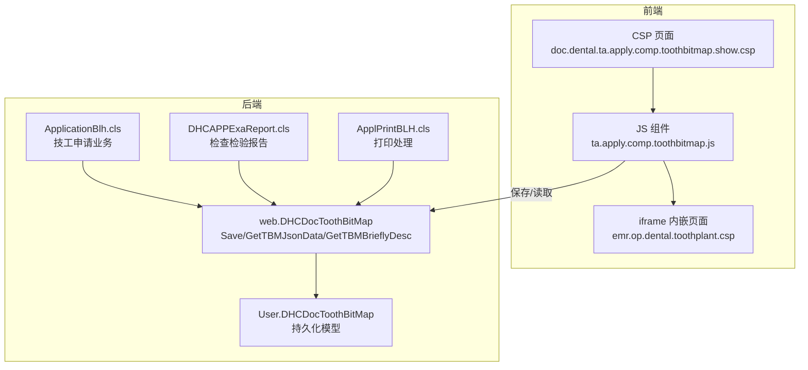
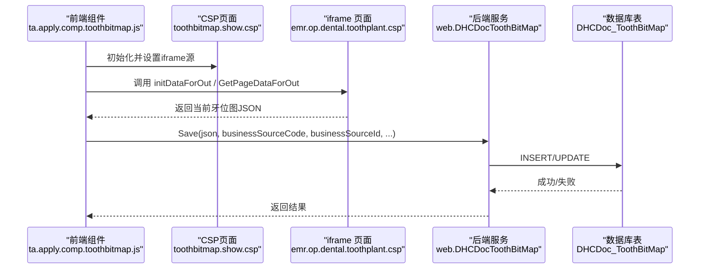
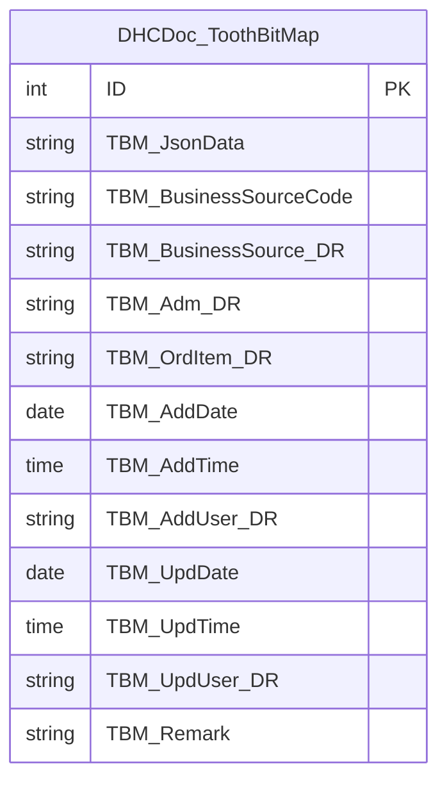
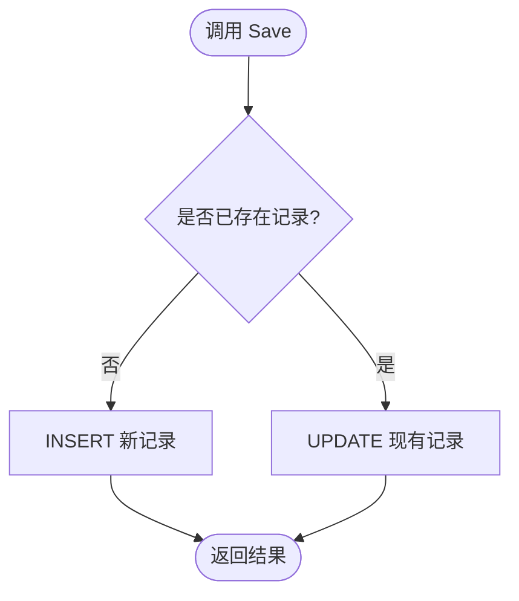
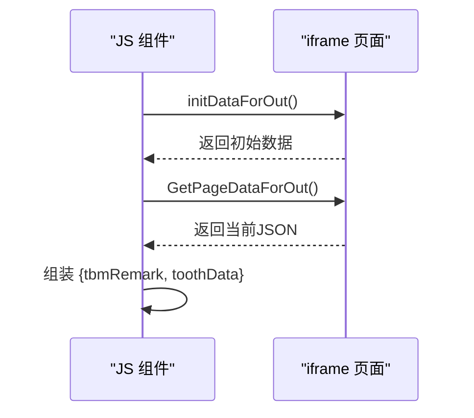
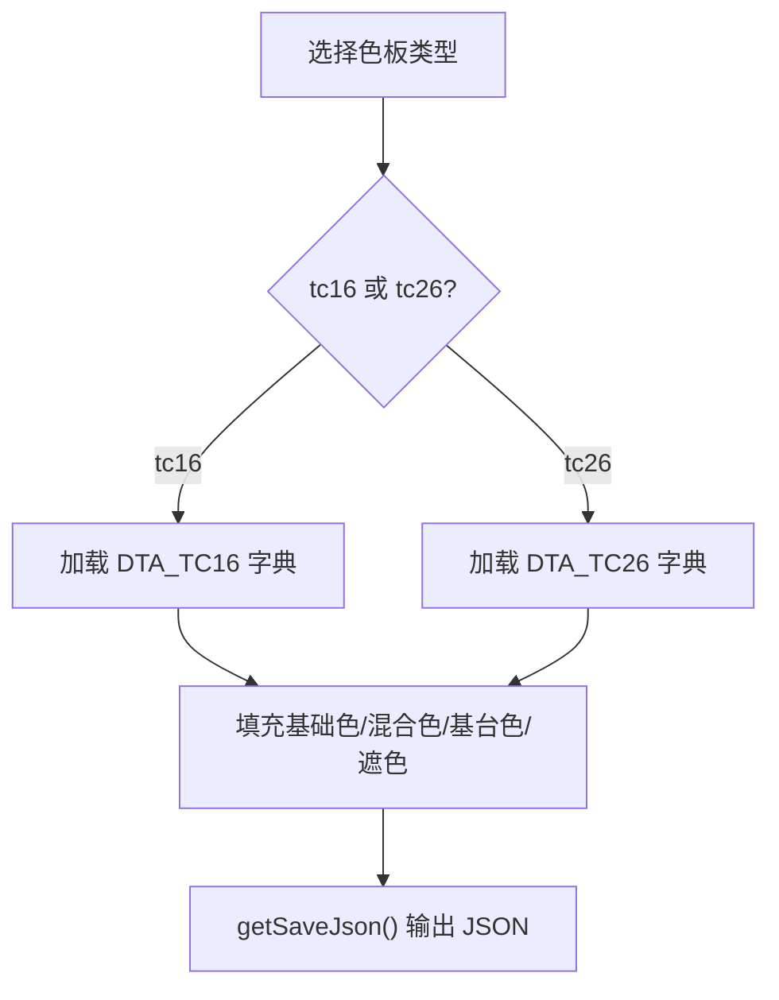
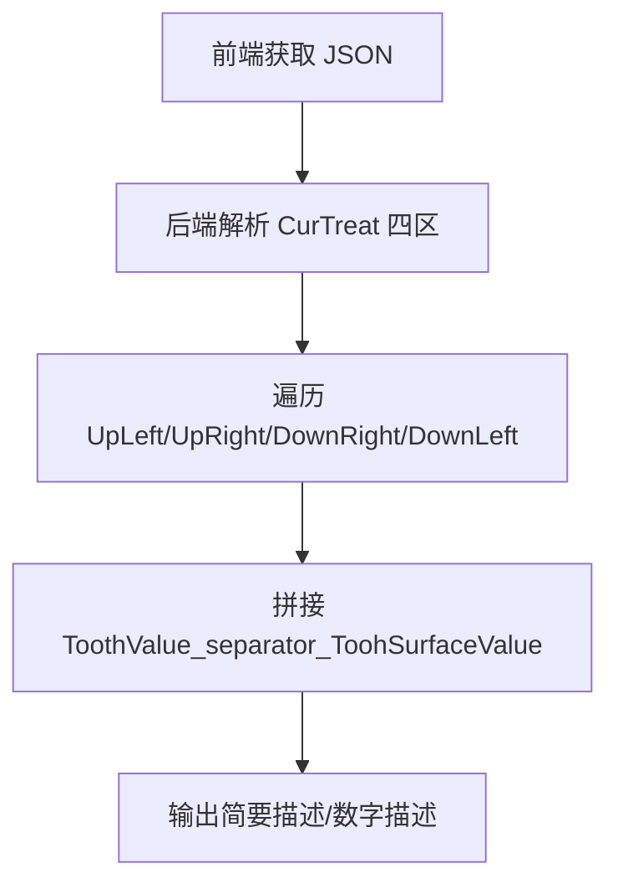
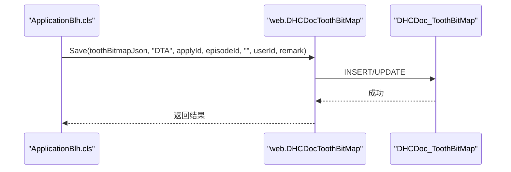
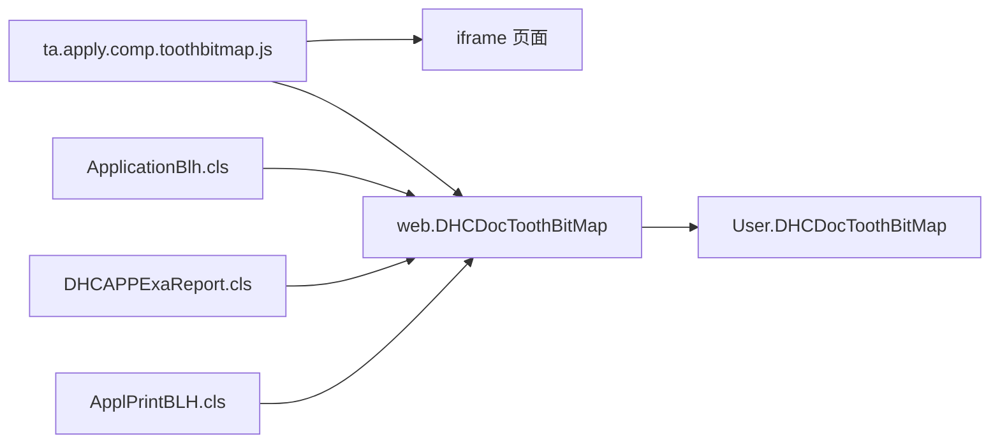

# 牙齿定位图

<cite>
**本文引用的文件**
- [src/backend/doc-ws/User/DHCDocToothBitMap.cls](file://src/backend/doc-ws/User/DHCDocToothBitMap.cls)
- [src/backend/doc-ws/web/DHCDocToothBitMap.cls](file://src/backend/doc-ws/web/DHCDocToothBitMap.cls)
- [src/frontend/dental-ws/scripts/dhcdoc/dental/ta.apply.comp.toothbitmap.js](file://src/frontend/dental-ws/scripts/dhcdoc/dental/ta.apply.comp.toothbitmap.js)
- [src/frontend/dental-ws/csp/doc.dental.ta.apply.comp.toothbitmap.show.csp](file://src/frontend/dental-ws/csp/doc.dental.ta.apply.comp.toothbitmap.show.csp)
- [src/frontend/dental-ws/scripts/dhcdoc/dental/ta.apply.comp.toothcolor.js](file://src/frontend/dental-ws/scripts/dhcdoc/dental/ta.apply.comp.toothcolor.js)
- [src/backend/dental-ws/DHCDoc/Dental/TA/ApplicationBlh.cls](file://src/backend/dental-ws/DHCDoc/Gental/TA/ApplicationBlh.cls)
- [src/backend/dental-ws/DHCDoc/Gental/TA/ApplPrintBLH.cls](file://src/backend/dental-ws/DHCDoc/Gental/TA/ApplPrintBLH.cls)
- [src/backend/doc-ws/web/DHCAPPExaReport.cls](file://src/backend/doc-ws/web/DHCAPPExaReport.cls)
- [src/backend/doc-ws/web/DHCAPPExaReportQuery.cls](file://src/backend/doc-ws/web/DHCAPPExaReportQuery.cls)
</cite>

## 目录
1. [简介](#简介)
2. [项目结构](#项目结构)
3. [核心组件](#核心组件)
4. [架构总览](#架构总览)
5. [详细组件分析](#详细组件分析)
6. [依赖关系分析](#依赖关系分析)
7. [性能考虑](#性能考虑)
8. [故障排查指南](#故障排查指南)
9. [结论](#结论)
10. [附录](#附录)

## 简介
本技术文档围绕“牙齿定位图”功能，系统阐述其图形化展示原理、数据结构设计、交互能力（颜色选择、位点标记、修复范围标注）、编码规则与标准体系、与申请单的数据关联与同步机制，以及跨设备显示兼容性与优化方案。文档面向前端、后端与实施人员，兼顾可读性与可落地性。

## 项目结构
牙齿定位图涉及前后端多模块协作：
- 前端通过CSP页面嵌入iframe加载“牙齿种植/定位”可视化页面，使用JS组件封装初始化、数据获取与保存逻辑。
- 后端提供持久化模型与Web服务类，负责牙位图JSON的增删改查、摘要生成与打印集成。
- 业务侧（技工申请、检查检验报告等）在关键节点调用保存/读取接口，实现与申请单的强关联。

图表来源
- [src/frontend/dental-ws/csp/doc.dental.ta.apply.comp.toothbitmap.show.csp:1-8](file://src/frontend/dental-ws/csp/doc.dental.ta.apply.comp.toothbitmap.show.csp#L1-L8)
- [src/frontend/dental-ws/scripts/dhcdoc/dental/ta.apply.comp.toothbitmap.js:1-84](file://src/frontend/dental-ws/scripts/dhcdoc/dental/ta.apply.comp.toothbitmap.js#L1-L84)
- [src/backend/doc-ws/web/DHCDocToothBitMap.cls:1-326](file://src/backend/doc-ws/web/DHCDocToothBitMap.cls#L1-L326)
- [src/backend/doc-ws/User/DHCDocToothBitMap.cls:1-109](file://src/backend/doc-ws/User/DHCDocToothBitMap.cls#L1-L109)
- [src/backend/dental-ws/DHCDoc/Gental/TA/ApplicationBlh.cls:190-260](file://src/backend/dental-ws/DHCDoc/Gental/TA/ApplicationBlh.cls#L190-L260)
- [src/backend/dental-ws/DHCDoc/Gental/TA/ApplPrintBLH.cls:70-80](file://src/backend/dental-ws/DHCDoc/Gental/TA/ApplPrintBLH.cls#L70-L80)
- [src/backend/doc-ws/web/DHCAPPExaReport.cls:190-200](file://src/backend/doc-ws/web/DHCAPPExaReport.cls#L190-L200)

章节来源
- [src/frontend/dental-ws/csp/doc.dental.ta.apply.comp.toothbitmap.show.csp:1-8](file://src/frontend/dental-ws/csp/doc.dental.ta.apply.comp.toothbitmap.show.csp#L1-L8)
- [src/frontend/dental-ws/scripts/dhcdoc/dental/ta.apply.comp.toothbitmap.js:1-84](file://src/frontend/dental-ws/scripts/dhcdoc/dental/ta.apply.comp.toothbitmap.js#L1-L84)
- [src/backend/doc-ws/web/DHCDocToothBitMap.cls:1-326](file://src/backend/doc-ws/web/DHCDocToothBitMap.cls#L1-L326)
- [src/backend/doc-ws/User/DHCDocToothBitMap.cls:1-109](file://src/backend/doc-ws/User/DHCDocToothBitMap.cls#L1-L109)

## 核心组件
- 持久化模型：存储牙位图JSON、业务来源、就诊/医嘱指针、时间戳与操作人、备注等。
- Web服务类：提供统一保存、查询、摘要与数字描述方法；按业务来源与ID定位记录；支持按医嘱项维度查询。
- 前端组件：封装iframe加载、数据获取、清空、备注输入与保存JSON组装；与业务表单联动。
- 业务集成：技工申请、检查检验报告等在提交/预览/打印时读写牙位图数据。

章节来源
- [src/backend/doc-ws/User/DHCDocToothBitMap.cls:15-55](file://src/backend/doc-ws/User/DHCDocToothBitMap.cls#L15-L55)
- [src/backend/doc-ws/web/DHCDocToothBitMap.cls:4-14](file://src/backend/doc-ws/web/DHCDocToothBitMap.cls#L4-L14)
- [src/frontend/dental-ws/scripts/dhcdoc/dental/ta.apply.comp.toothbitmap.js:14-36](file://src/frontend/dental-ws/scripts/dhcdoc/dental/ta.apply.comp.toothbitmap.js#L14-L36)

## 架构总览
下图展示从前端到后端的完整调用链：前端组件通过iframe与内部页面交互，获取或提交牙位图数据；后端服务根据业务来源代码与ID进行落库或读取；业务侧在关键流程中触发保存/读取；打印流程可复用该数据。

图表来源
- [src/frontend/dental-ws/scripts/dhcdoc/dental/ta.apply.comp.toothbitmap.js:6-36](file://src/frontend/dental-ws/scripts/dhcdoc/dental/ta.apply.comp.toothbitmap.js#L6-L36)
- [src/backend/doc-ws/web/DHCDocToothBitMap.cls:4-14](file://src/backend/doc-ws/web/DHCDocToothBitMap.cls#L4-L14)
- [src/backend/doc-ws/web/DHCDocToothBitMap.cls:23-38](file://src/backend/doc-ws/web/DHCDocToothBitMap.cls#L23-L38)

## 详细组件分析

### 数据结构与存储模型
- 主键与索引：基于业务来源代码+业务ID唯一索引；另含就诊、医嘱项、添加时间、添加人等索引。
- 关键字段：
  - TBM_JsonData：存储牙位图JSON（大文本）。
  - TBM_BusinessSourceCode：业务来源（ELA/CureApp/Diagnosis/DTA）。
  - TBM_BusinessSource_DR：业务表关联指针（如申请ID）。
  - TBM_Adm_DR：就诊指针。
  - TBM_OrdItem_DR：医嘱项指针（可选）。
  - TBM_AddDate/TBM_AddTime/TBM_AddUserDR：创建信息。
  - TBM_UpdDate/TBM_UpdTime/TBM_UpdUserDR：更新信息。
  - TBM_Remark：备注。

图表来源
- [src/backend/doc-ws/User/DHCDocToothBitMap.cls:15-55](file://src/backend/doc-ws/User/DHCDocToothBitMap.cls#L15-L55)

章节来源
- [src/backend/doc-ws/User/DHCDocToothBitMap.cls:15-55](file://src/backend/doc-ws/User/DHCDocToothBitMap.cls#L15-L55)

### 后端服务：保存与读取
- 保存：根据业务来源与ID查找是否存在记录，存在则更新，不存在则插入；支持传入医嘱项与备注。
- 读取：优先按业务来源+ID读取，其次按医嘱项读取；返回JSON字符串。
- 摘要：将四区（左上、右上、右下、左下）的牙位与表面值拼接为简要描述；支持自定义分隔符。
- 数字描述：输出“区号_牙位值”形式的序列，便于统计与展示。
- 技工应用：提供按申请ID聚合各象限牙位名称的方法，用于打印或报表。

图表来源
- [src/backend/doc-ws/web/DHCDocToothBitMap.cls:4-14](file://src/backend/doc-ws/web/DHCDocToothBitMap.cls#L4-L14)
- [src/backend/doc-ws/web/DHCDocToothBitMap.cls:23-38](file://src/backend/doc-ws/web/DHCDocToothBitMap.cls#L23-L38)
- [src/backend/doc-ws/web/DHCDocToothBitMap.cls:41-84](file://src/backend/doc-ws/web/DHCDocToothBitMap.cls#L41-L84)

章节来源
- [src/backend/doc-ws/web/DHCDocToothBitMap.cls:4-14](file://src/backend/doc-ws/web/DHCDocToothBitMap.cls#L4-L14)
- [src/backend/doc-ws/web/DHCDocToothBitMap.cls:87-124](file://src/backend/doc-ws/web/DHCDocToothBitMap.cls#L87-L124)
- [src/backend/doc-ws/web/DHCDocToothBitMap.cls:126-177](file://src/backend/doc-ws/web/DHCDocToothBitMap.cls#L126-L177)
- [src/backend/doc-ws/web/DHCDocToothBitMap.cls:179-235](file://src/backend/doc-ws/web/DHCDocToothBitMap.cls#L179-L235)
- [src/backend/doc-ws/web/DHCDocToothBitMap.cls:237-323](file://src/backend/doc-ws/web/DHCDocToothBitMap.cls#L237-L323)

### 前端组件：初始化、数据获取与保存
- 初始化：设置iframe源，加载备注字段，触发数据重载。
- 数据获取：通过contentWindow调用内部页面的initDataForOut与GetPageDataForOut，获取当前牙位图JSON。
- 保存：组装包含备注与牙位数据的JSON，交由上层业务保存。
- 清空：调用内部clear或点击清空按钮。

图表来源
- [src/frontend/dental-ws/scripts/dhcdoc/dental/ta.apply.comp.toothbitmap.js:6-36](file://src/frontend/dental-ws/scripts/dhcdoc/dental/ta.apply.comp.toothbitmap.js#L6-L36)
- [src/frontend/dental-ws/csp/doc.dental.ta.apply.comp.toothbitmap.show.csp:1-8](file://src/frontend/dental-ws/csp/doc.dental.ta.apply.comp.toothbitmap.show.csp#L1-L8)

章节来源
- [src/frontend/dental-ws/scripts/dhcdoc/dental/ta.apply.comp.toothbitmap.js:6-36](file://src/frontend/dental-ws/scripts/dhcdoc/dental/ta.apply.comp.toothbitmap.js#L6-L36)
- [src/frontend/dental-ws/csp/doc.dental.ta.apply.comp.toothbitmap.show.csp:1-8](file://src/frontend/dental-ws/csp/doc.dental.ta.apply.comp.toothbitmap.show.csp#L1-L8)

### 牙齿颜色选择
- 颜色体系：支持TC16/TC26两种色板，基础色、混合色（最多三档）、基台色、遮色及活体比色选项。
- 交互：单选切换色板类型，下拉框动态刷新；提示图展示混合色分区说明。
- 保存：将选择的色板类型与各颜色DR值序列化输出，供业务层持久化。

图表来源
- [src/frontend/dental-ws/scripts/dhcdoc/dental/ta.apply.comp.toothcolor.js:8-28](file://src/frontend/dental-ws/scripts/dhcdoc/dental/ta.apply.comp.toothcolor.js#L8-L28)
- [src/frontend/dental-ws/scripts/dhcdoc/dental/ta.apply.comp.toothcolor.js:30-42](file://src/frontend/dental-ws/scripts/dhcdoc/dental/ta.apply.comp.toothcolor.js#L30-L42)
- [src/frontend/dental-ws/scripts/dhcdoc/dental/ta.apply.comp.toothcolor.js:81-99](file://src/frontend/dental-ws/scripts/dhcdoc/dental/ta.apply.comp.toothcolor.js#L81-L99)

章节来源
- [src/frontend/dental-ws/scripts/dhcdoc/dental/ta.apply.comp.toothcolor.js:8-28](file://src/frontend/dental-ws/scripts/dhcdoc/dental/ta.apply.comp.toothcolor.js#L8-L28)
- [src/frontend/dental-ws/scripts/dhcdoc/dental/ta.apply.comp.toothcolor.js:30-42](file://src/frontend/dental-ws/scripts/dhcdoc/dental/ta.apply.comp.toothcolor.js#L30-L42)
- [src/frontend/dental-ws/scripts/dhcdoc/dental/ta.apply.comp.toothcolor.js:81-99](file://src/frontend/dental-ws/scripts/dhcdoc/dental/ta.apply.comp.toothcolor.js#L81-L99)

### 位点标记与修复范围标注
- 位点标记：由iframe内页面维护四区（左上、右上、右下、左下）的牙位对象数组，每个对象包含牙位值与表面值。
- 修复范围：通过表面值组合表达修复区域（如咬合面、颊面等），后端摘要方法将其拼接为人类可读的简要描述。
- 数据流转：前端获取JSON -> 后端解析四区 -> 生成简要/数字描述 -> 用于列表展示或打印。

图表来源
- [src/backend/doc-ws/web/DHCDocToothBitMap.cls:126-177](file://src/backend/doc-ws/web/DHCDocToothBitMap.cls#L126-L177)
- [src/backend/doc-ws/web/DHCDocToothBitMap.cls:179-235](file://src/backend/doc-ws/web/DHCDocToothBitMap.cls#L179-L235)

章节来源
- [src/backend/doc-ws/web/DHCDocToothBitMap.cls:126-177](file://src/backend/doc-ws/web/DHCDocToothBitMap.cls#L126-L177)
- [src/backend/doc-ws/web/DHCDocToothBitMap.cls:179-235](file://src/backend/doc-ws/web/DHCDocToothBitMap.cls#L179-L235)

### 与申请单的关联与数据同步
- 技工申请：在保存/读取时调用后端服务，将牙位图JSON与申请ID绑定；打印时可直接获取数值与备注。
- 检查检验报告：在报告生成/预览/清理时调用保存/读取接口，确保报告与牙位图一致。
- 同步策略：以业务来源代码+业务ID为主键，保证同一申请仅一条记录；支持按医嘱项维度覆盖。

图表来源
- [src/backend/dental-ws/DHCDoc/Gental/TA/ApplicationBlh.cls:190-260](file://src/backend/dental-ws/DHCDoc/Gental/TA/ApplicationBlh.cls#L190-L260)
- [src/backend/doc-ws/web/DHCDocToothBitMap.cls:4-14](file://src/backend/doc-ws/web/DHCDocToothBitMap.cls#L4-L14)

章节来源
- [src/backend/dental-ws/DHCDoc/Gental/TA/ApplicationBlh.cls:190-260](file://src/backend/dental-ws/DHCDoc/Gental/TA/ApplicationBlh.cls#L190-L260)
- [src/backend/dental-ws/DHCDoc/Gental/TA/ApplPrintBLH.cls:70-80](file://src/backend/dental-ws/DHCDoc/Gental/TA/ApplPrintBLH.cls#L70-L80)
- [src/backend/doc-ws/web/DHCAPPExaReport.cls:190-200](file://src/backend/doc-ws/web/DHCAPPExaReport.cls#L190-L200)
- [src/backend/doc-ws/web/DHCAPPExaReport.cls:2730-2780](file://src/backend/doc-ws/web/DHCAPPExaReport.cls#L2730-L2780)

### 编码规则与标准体系
- 业务来源代码：ELA（检查检验申请）、CA（治疗申请）、DIAG（诊断）、DTA（口腔技工申请）。
- 牙位组织：CurTreat包含四区数组，每项含ToothValue与ToothSurfaceValue，用于表示具体牙位与表面。
- 描述格式：
  - 简要描述：以逗号分隔的“牙位值_separator_表面值”序列。
  - 数字描述：以逗号分隔的“区号_牙位值”序列。
- 技工视图：按A/B/C/D四象限映射到area1~area4，支持名称聚合与排序。

章节来源
- [src/backend/doc-ws/User/DHCDocToothBitMap.cls:18-25](file://src/backend/doc-ws/User/DHCDocToothBitMap.cls#L18-L25)
- [src/backend/doc-ws/web/DHCDocToothBitMap.cls:126-177](file://src/backend/doc-ws/web/DHCDocToothBitMap.cls#L126-L177)
- [src/backend/doc-ws/web/DHCDocToothBitMap.cls:179-235](file://src/backend/doc-ws/web/DHCDocToothBitMap.cls#L179-L235)
- [src/backend/doc-ws/web/DHCDocToothBitMap.cls:237-323](file://src/backend/doc-ws/web/DHCDocToothBitMap.cls#L237-L323)

### 自定义配置与扩展方法
- 新增业务来源：在模型属性VALUELIST中扩展业务来源代码，并在服务层适配保存/读取逻辑。
- 扩展描述格式：在GetTBMBrieflyDesc/GetTBMNumDesc中增加新的拼接规则或输出模板。
- 前端扩展：在JS组件中增加新的字段（如特殊修复材料、CAD/CAM参数），并通过getSaveJson输出。
- 打印扩展：在ApplPrintBLH中调用GetTAToothBitMapValue或GetTBMRemark，定制打印内容。

章节来源
- [src/backend/doc-ws/User/DHCDocToothBitMap.cls:18-25](file://src/backend/doc-ws/User/DHCDocToothBitMap.cls#L18-L25)
- [src/backend/doc-ws/web/DHCDocToothBitMap.cls:126-177](file://src/backend/doc-ws/web/DHCDocToothBitMap.cls#L126-L177)
- [src/backend/dental-ws/DHCDoc/Gental/TA/ApplPrintBLH.cls:70-80](file://src/backend/dental-ws/DHCDoc/Gental/TA/ApplPrintBLH.cls#L70-L80)
- [src/frontend/dental-ws/scripts/dhcdoc/dental/ta.apply.comp.toothbitmap.js:25-36](file://src/frontend/dental-ws/scripts/dhcdoc/dental/ta.apply.comp.toothbitmap.js#L25-L36)

### 跨设备显示兼容性与优化
- iframe隔离：通过contentWindow暴露方法，避免跨域与样式冲突；在不同浏览器中稳定通信。
- 尺寸自适应：CSP中固定高度与宽度比例，建议外层容器使用响应式布局。
- 资源路径：图片与脚本相对路径需正确配置，避免移动端加载失败。
- 性能优化：
  - 大JSON传输：后端存储为大文本，建议在列表页使用GetTBMBrieflyDesc减少负载。
  - 缓存策略：对常用摘要或数字描述做短期缓存，降低重复解析开销。
  - 懒加载：仅在需要时加载iframe与数据，提升首屏速度。

[本节为通用指导，不直接分析具体文件]

## 依赖关系分析
- 前端依赖：
  - CSP页面依赖JS组件与iframe内页面。
  - JS组件依赖iframe内页面暴露的API（initDataForOut、GetPageDataForOut、clear）。
- 后端依赖：
  - web.DHCDocToothBitMap依赖User.DHCDocToothBitMap模型与SQL表。
  - 业务侧（ApplicationBlh、DHCAPPExaReport、ApplPrintBLH）依赖web服务进行数据存取。
- 外部依赖：
  - 字典与色板（DTA_TC16/DTA_TC26、DTA_AC、DTA_MaskC等）。
  - 会话与用户信息（userId来源于会话）。

图表来源
- [src/frontend/dental-ws/scripts/dhcdoc/dental/ta.apply.comp.toothbitmap.js:6-36](file://src/frontend/dental-ws/scripts/dhcdoc/dental/ta.apply.comp.toothbitmap.js#L6-L36)
- [src/backend/doc-ws/web/DHCDocToothBitMap.cls:4-14](file://src/backend/doc-ws/web/DHCDocToothBitMap.cls#L4-L14)
- [src/backend/dental-ws/DHCDoc/Gental/TA/ApplicationBlh.cls:190-260](file://src/backend/dental-ws/DHCDoc/Gental/TA/ApplicationBlh.cls#L190-L260)
- [src/backend/doc-ws/web/DHCAPPExaReport.cls:190-200](file://src/backend/doc-ws/web/DHCAPPExaReport.cls#L190-L200)
- [src/backend/dental-ws/DHCDoc/Gental/TA/ApplPrintBLH.cls:70-80](file://src/backend/dental-ws/DHCDoc/Gental/TA/ApplPrintBLH.cls#L70-L80)

章节来源
- [src/frontend/dental-ws/scripts/dhcdoc/dental/ta.apply.comp.toothbitmap.js:6-36](file://src/frontend/dental-ws/scripts/dhcdoc/dental/ta.apply.comp.toothbitmap.js#L6-L36)
- [src/backend/doc-ws/web/DHCDocToothBitMap.cls:4-14](file://src/backend/doc-ws/web/DHCDocToothBitMap.cls#L4-L14)
- [src/backend/dental-ws/DHCDoc/Gental/TA/ApplicationBlh.cls:190-260](file://src/backend/dental-ws/DHCDoc/Gental/TA/ApplicationBlh.cls#L190-L260)
- [src/backend/doc-ws/web/DHCAPPExaReport.cls:190-200](file://src/backend/doc-ws/web/DHCAPPExaReport.cls#L190-L200)
- [src/backend/dental-ws/DHCDoc/Gental/TA/ApplPrintBLH.cls:70-80](file://src/backend/dental-ws/DHCDoc/Gental/TA/ApplPrintBLH.cls#L70-L80)

## 性能考虑
- 大对象存储：TBM_JsonData为大文本，建议仅在详情或打印时全量加载；列表页使用GetTBMBrieflyDesc/GetTBMNumDesc。
- 索引利用：通过IndexBusinessSource与IndexOrdItemDR快速定位记录，避免全表扫描。
- 前端渲染：iframe内页面应延迟绘制复杂图形，按需加载；避免频繁重排。
- 并发写入：同一申请多次保存会走Update路径，注意事务与锁竞争。

[本节为通用指导，不直接分析具体文件]

## 故障排查指南
- 保存失败：检查SQLCODE与错误消息；确认businessSourceCode与businessSourceId有效；核对userId与会话。
- 读取为空：确认业务来源与ID匹配；若按医嘱项读取，确保ordItemId正确。
- 摘要异常：检查JSON结构是否包含CurTreat与四区数组；确认ToothValue与ToothSurfaceValue存在。
- 前端无法通信：确认iframe已加载完成且contentWindow暴露对应方法；检查跨域与CSP安全策略。

章节来源
- [src/backend/doc-ws/web/DHCDocToothBitMap.cls:35-38](file://src/backend/doc-ws/web/DHCDocToothBitMap.cls#L35-L38)
- [src/backend/doc-ws/web/DHCDocToothBitMap.cls:80-82](file://src/backend/doc-ws/web/DHCDocToothBitMap.cls#L80-L82)
- [src/backend/doc-ws/web/DHCDocToothBitMap.cls:87-124](file://src/backend/doc-ws/web/DHCDocToothBitMap.cls#L87-L124)
- [src/frontend/dental-ws/scripts/dhcdoc/dental/ta.apply.comp.toothbitmap.js:19-36](file://src/frontend/dental-ws/scripts/dhcdoc/dental/ta.apply.comp.toothbitmap.js#L19-L36)

## 结论
牙齿定位图通过前后端协同实现了可视化位点标记、颜色选择与修复范围标注，并以JSON为核心载体，结合业务来源与申请单实现强关联与数据同步。后端提供统一的保存/读取与摘要方法，前端通过iframe隔离与标准化API保障跨设备兼容性。通过合理索引、摘要输出与懒加载策略，可在保证功能完整性的同时提升性能与用户体验。

## 附录
- 常见业务来源代码：ELA（检查检验申请）、CA（治疗申请）、DIAG（诊断）、DTA（口腔技工申请）。
- 颜色体系：TC16/TC26，基础色、混合色（最多三档）、基台色、遮色、活体比色。
- 扩展建议：在模型与服务层扩展新字段与新描述格式；在前端组件中增加新输入项并纳入getSaveJson输出。

[本节为补充信息，不直接分析具体文件]