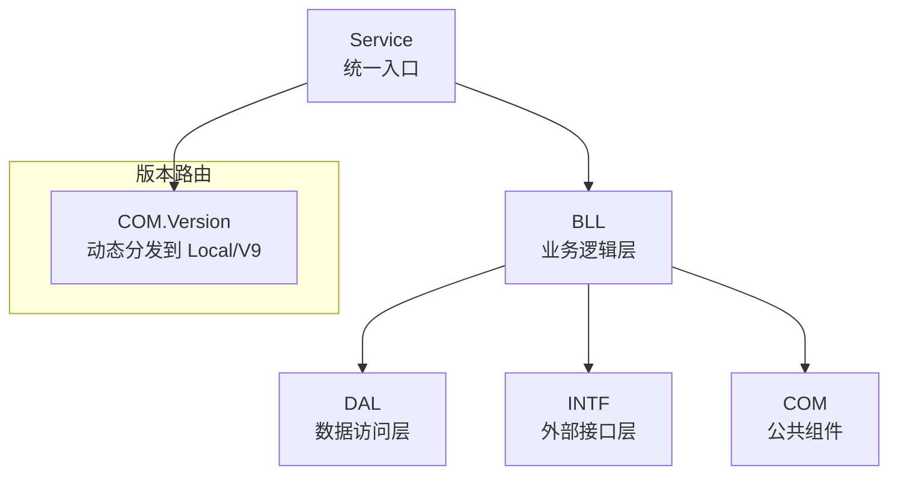
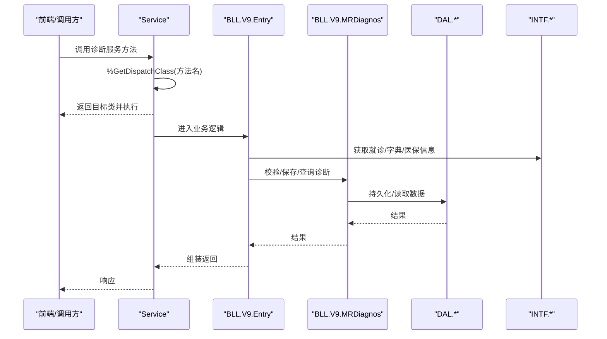
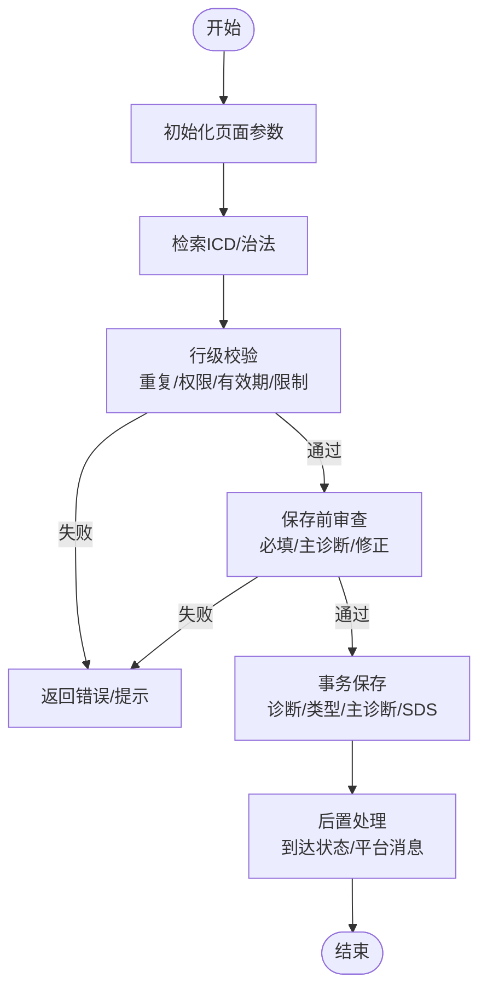
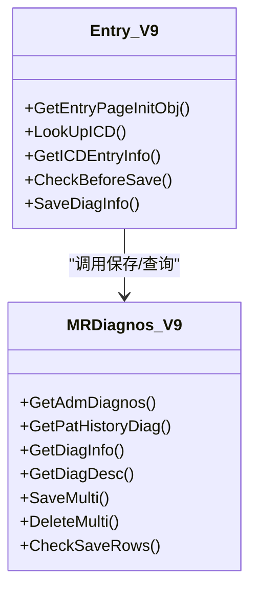
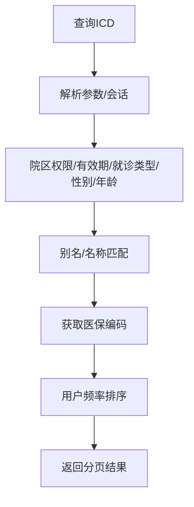
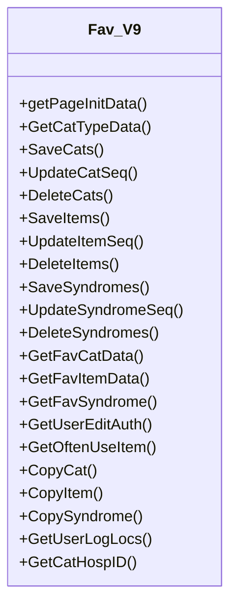
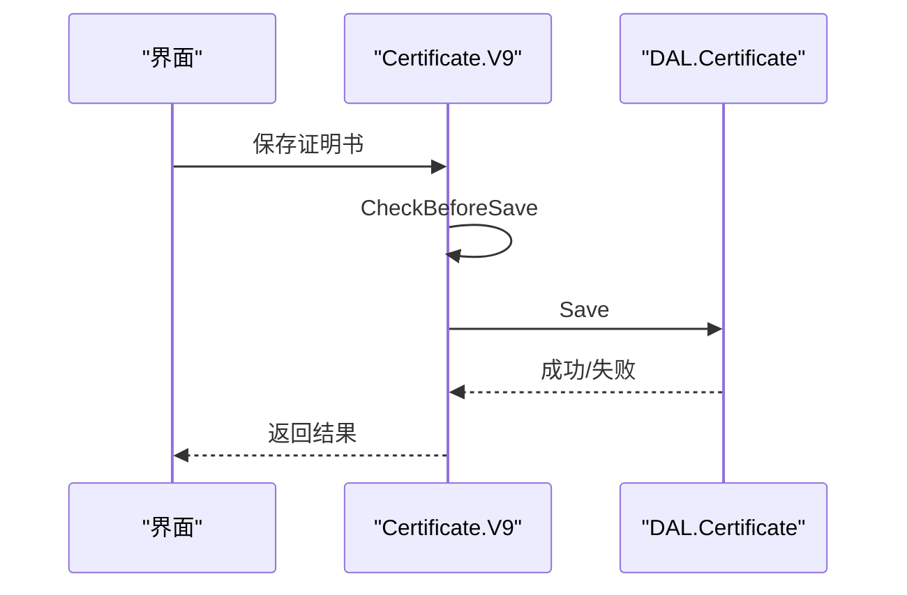
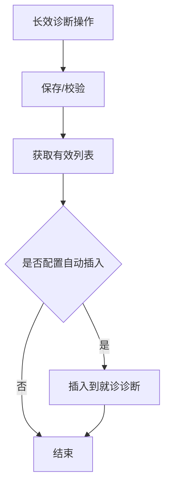
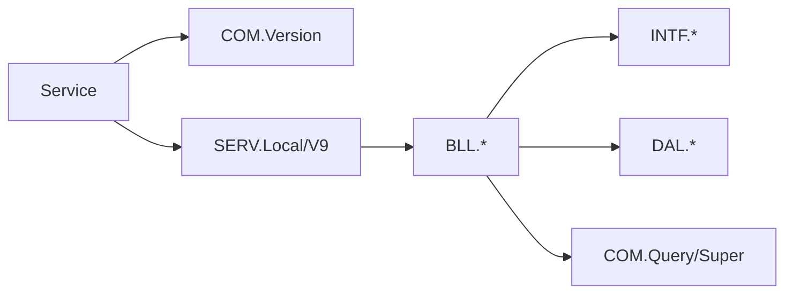

# 诊断管理

<cite>
**本文引用的文件**
- [Service.cls](file://src/backend/doc-ws/DHCDoc/Diagnos/Service.cls)
- [Common.cls](file://src/backend/doc-ws/DHCDoc/Diagnos/Common.cls)
- [Entry.cls（门面）](file://src/backend/doc-ws/DHCDoc/Diagnos/BLL/Entry.cls)
- [V9\Entry.cls](file://src/backend/doc-ws/DHCDoc/Diagnos/BLL/V9/Entry.cls)
- [MRDiagnos.cls（门面）](file://src/backend/doc-ws/DHCDoc/Diagnos/BLL/MRDiagnos.cls)
- [V9\MRDiagnos.cls](file://src/backend/doc-ws/DHCDoc/Diagnos/BLL/V9/MRDiagnos.cls)
- [Certificate.cls（门面）](file://src/backend/doc-ws/DHCDoc/Diagnos/BLL/Certificate.cls)
- [V9\Certificate.cls](file://src/backend/doc-ws/DHCDoc/Diagnos/BLL/V9/Certificate.cls)
- [Fav.cls（门面）](file://src/backend/doc-ws/DHCDoc/Diagnos/BLL/Fav.cls)
- [V9\Fav.cls](file://src/backend/doc-ws/DHCDoc/Diagnos/BLL/V9/Fav.cls)
- [LongDiagnos.cls（门面）](file://src/backend/doc-ws/DHCDoc/Diagnos/BLL/LongDiagnos.cls)
- [V9\LongDiagnos.cls](file://src/backend/doc-ws/DHCDoc/Diagnos/BLL/V9/LongDiagnos.cls)
</cite>

## 目录
1. [简介](#简介)
2. [项目结构](#项目结构)
3. [核心组件](#核心组件)
4. [架构总览](#架构总览)
5. [详细组件分析](#详细组件分析)
6. [依赖关系分析](#依赖关系分析)
7. [性能考虑](#性能考虑)
8. [故障排查指南](#故障排查指南)
9. [结论](#结论)
10. [附录：CRUD示例与配置扩展](#附录crud示例与配置扩展)

## 简介
本模块提供诊断信息的录入、查询、管理与统计能力，覆盖ICD编码系统使用、诊断模板管理、诊断历史追踪，以及与医嘱、治疗计划的关联。通过分层架构与版本路由机制，实现可维护、可扩展的诊断子系统，支持西医、中医、证型三类诊断，结构化诊断（SDS）与诊断证明书等扩展能力。

## 项目结构
诊断子系统采用清晰的分层设计：
- Service 统一对外服务入口，负责将请求路由到 SERV 层具体实现类。
- BLL 业务逻辑层，封装诊断录入、保存、删除、历史、模板、长效诊断等业务规则。
- DAL 数据访问层，负责底层数据持久化与读取。
- INTF 接口层，统一调用外部模块（病历、医保、医嘱、收费等）。
- COM 公共层，提供版本路由、通用查询工具、基类等。

**图表来源**
- [Service.cls:1-79](file://src/backend/doc-ws/DHCDoc/Diagnos/Service.cls#L1-L79)

**章节来源**
- [Service.cls:1-79](file://src/backend/doc-ws/DHCDoc/Diagnos/Service.cls#L1-L79)

## 核心组件
- 统一入口与服务编排：Service 重写 %DispatchClassMethod，按方法名优先查找 Local 版本，再回退到标准 V9 版本，确保本地定制与标准升级互不干扰。
- 诊断录入与校验：Entry（V9）提供页面初始化、ICD检索、CDSS推荐、重复提示、传染病提示、就诊必填项校验、主诊断数量限制、时间合法性校验等。
- 诊断持久化与历史：MRDiagnos（V9）负责本次就诊诊断获取、批量保存、删除、历史合并展示、描述拼接、修正诊断校验等。
- 诊断模板：Fav（V9）提供分类、条目、证型的增删改查、排序、常用项展示、权限控制与复制。
- 诊断证明书：Certificate（V9）提供证明书的获取、保存、删除、打印状态管理、与诊断的关联校验。
- 长效诊断：LongDiagnos（V9）提供长效诊断的保存、删除、列表过滤、插入到当前就诊诊断的能力。
- ICD查询与历史：Common 提供 ICD 检索、中医治法检索、历史诊断聚合、编辑日志、诊断描述生成等。

**章节来源**
- [Service.cls:1-79](file://src/backend/doc-ws/DHCDoc/Diagnos/Service.cls#L1-L79)
- [V9\Entry.cls:1-660](file://src/backend/doc-ws/DHCDoc/Diagnos/BLL/V9/Entry.cls#L1-L660)
- [V9\MRDiagnos.cls:1-800](file://src/backend/doc-ws/DHCDoc/Diagnos/BLL/V9/MRDiagnos.cls#L1-L800)
- [V9\Fav.cls:1-457](file://src/backend/doc-ws/DHCDoc/Diagnos/BLL/V9/Fav.cls#L1-L457)
- [V9\Certificate.cls:1-209](file://src/backend/doc-ws/DHCDoc/Diagnos/BLL/V9/Certificate.cls#L1-L209)
- [V9\LongDiagnos.cls:1-198](file://src/backend/doc-ws/DHCDoc/Diagnos/BLL/V9/LongDiagnos.cls#L1-L198)
- [Common.cls:1-581](file://src/backend/doc-ws/DHCDoc/Diagnos/Common.cls#L1-L581)

## 架构总览
诊断子系统通过 Service 作为唯一公开入口，内部按方法名路由到 SERV 层；BLL 层继承 Version 门面，实际实现位于 V9 或 Local 版本目录。所有外部模块调用必须经 INTF，禁止直连。

**图表来源**
- [Service.cls:41-76](file://src/backend/doc-ws/DHCDoc/Diagnos/Service.cls#L41-L76)
- [V9\Entry.cls:260-523](file://src/backend/doc-ws/DHCDoc/Diagnos/BLL/V9/Entry.cls#L260-L523)
- [V9\MRDiagnos.cls:627-684](file://src/backend/doc-ws/DHCDoc/Diagnos/BLL/V9/MRDiagnos.cls#L627-L684)

## 详细组件分析

### 诊断录入与校验（Entry V9）
- 页面初始化：加载就诊基础信息、医生信息、结构化诊断标志、长效诊断类型、停止原因字典、中医科室标志、用户页面设置等。
- ICD检索：支持精确模式、院区权限、有效期、就诊类型限制、性别/年龄限制等。
- CDSS推荐：调用CDSS疑似疾病接口，匹配HIS诊断字典，构建NewRows后走录入校验流程。
- 行级校验：重复提示、传染病提示、结构化诊断权限、ICD可用性、非ICD备注限制、发病/诊断/截止时间逻辑校验、中医证型强制要求等。
- 保存前审查：就诊必填项、初复诊自动判断、主诊断数量限制、修正诊断校验。
- 保存流程：事务包裹，先保存就诊其他信息，再批量保存诊断、类型、主诊断标识、结构化诊断、常用次数，最后置到达状态、发送平台消息。

**图表来源**
- [V9\Entry.cls:5-70](file://src/backend/doc-ws/DHCDoc/Diagnos/BLL/V9/Entry.cls#L5-L70)
- [V9\Entry.cls:171-180](file://src/backend/doc-ws/DHCDoc/Diagnos/BLL/V9/Entry.cls#L171-L180)
- [V9\Entry.cls:260-328](file://src/backend/doc-ws/DHCDoc/Diagnos/BLL/V9/Entry.cls#L260-L328)
- [V9\Entry.cls:458-523](file://src/backend/doc-ws/DHCDoc/Diagnos/BLL/V9/Entry.cls#L458-L523)

**章节来源**
- [V9\Entry.cls:5-70](file://src/backend/doc-ws/DHCDoc/Diagnos/BLL/V9/Entry.cls#L5-L70)
- [V9\Entry.cls:171-180](file://src/backend/doc-ws/DHCDoc/Diagnos/BLL/V9/Entry.cls#L171-L180)
- [V9\Entry.cls:260-328](file://src/backend/doc-ws/DHCDoc/Diagnos/BLL/V9/Entry.cls#L260-L328)
- [V9\Entry.cls:458-523](file://src/backend/doc-ws/DHCDoc/Diagnos/BLL/V9/Entry.cls#L458-L523)

### 诊断历史与描述（MRDiagnos V9）
- 本次就诊诊断：支持按类型、主诊断、仅ICD、是否包含已停止等条件筛选。
- 患者历史诊断：跨就诊合并相同诊断，按日期/次数排序，输出结构化对象。
- 诊断描述：优先显示结构化诊断，其次ICD名称+备注+前缀+中医治法+子诊断。
- 批量保存：事务内依次保存诊断、类型、主诊断、结构化诊断、常用次数，递归处理子诊断。
- 批量删除：校验关联医嘱、入院登记诊断、修正诊断、证明书状态，作废相关证明书与结构化诊断，发送平台消息。

**图表来源**
- [V9\MRDiagnos.cls:5-27](file://src/backend/doc-ws/DHCDoc/Diagnos/BLL/V9/MRDiagnos.cls#L5-L27)
- [V9\MRDiagnos.cls:32-158](file://src/backend/doc-ws/DHCDoc/Diagnos/BLL/V9/MRDiagnos.cls#L32-L158)
- [V9\MRDiagnos.cls:227-260](file://src/backend/doc-ws/DHCDoc/Diagnos/BLL/V9/MRDiagnos.cls#L227-L260)
- [V9\MRDiagnos.cls:627-684](file://src/backend/doc-ws/DHCDoc/Diagnos/BLL/V9/MRDiagnos.cls#L627-L684)
- [V9\MRDiagnos.cls:687-724](file://src/backend/doc-ws/DHCDoc/Diagnos/BLL/V9/MRDiagnos.cls#L687-L724)

**章节来源**
- [V9\MRDiagnos.cls:5-27](file://src/backend/doc-ws/DHCDoc/Diagnos/BLL/V9/MRDiagnos.cls#L5-L27)
- [V9\MRDiagnos.cls:32-158](file://src/backend/doc-ws/DHCDoc/Diagnos/BLL/V9/MRDiagnos.cls#L32-L158)
- [V9\MRDiagnos.cls:227-260](file://src/backend/doc-ws/DHCDoc/Diagnos/BLL/V9/MRDiagnos.cls#L227-L260)
- [V9\MRDiagnos.cls:627-684](file://src/backend/doc-ws/DHCDoc/Diagnos/BLL/V9/MRDiagnos.cls#L627-L684)
- [V9\MRDiagnos.cls:687-724](file://src/backend/doc-ws/DHCDoc/Diagnos/BLL/V9/MRDiagnos.cls#L687-L724)

### ICD编码系统与查询（Common）
- ICD检索：支持别名/名称模糊匹配、院区权限、有效期、就诊类型限制、性别/年龄限制、医保编码获取、用户频率排序等。
- 历史诊断聚合：按就诊日期、科室、诊断ID分组，合并相同诊断的最新记录，输出结构化JSON。
- 诊断分类：根据ICD属性判断西医/中医/证型，并提供翻译。
- 编辑日志：从数据变更日志中提取字段变化，结合结构化诊断日志，输出操作人、时间、操作类型与变更详情。

**图表来源**
- [Common.cls:376-569](file://src/backend/doc-ws/DHCDoc/Diagnos/Common.cls#L376-L569)
- [Common.cls:5-145](file://src/backend/doc-ws/DHCDoc/Diagnos/Common.cls#L5-L145)
- [Common.cls:147-184](file://src/backend/doc-ws/DHCDoc/Diagnos/Common.cls#L147-L184)
- [Common.cls:186-307](file://src/backend/doc-ws/DHCDoc/Diagnos/Common.cls#L186-L307)

**章节来源**
- [Common.cls:376-569](file://src/backend/doc-ws/DHCDoc/Diagnos/Common.cls#L376-L569)
- [Common.cls:5-145](file://src/backend/doc-ws/DHCDoc/Diagnos/Common.cls#L5-L145)
- [Common.cls:147-184](file://src/backend/doc-ws/DHCDoc/Diagnos/Common.cls#L147-L184)
- [Common.cls:186-307](file://src/backend/doc-ws/DHCDoc/Diagnos/Common.cls#L186-L307)

### 诊断模板管理（Fav V9）
- 分类与条目：支持个人、科室、院区三级模板，分类与条目增删改查、排序、复制。
- 证型：条目下可维护证型，支持批量保存与排序。
- 常用项：基于使用频率展示系统常用诊断，区分西医、中医及证型。
- 权限：用户编辑权限由配置控制，支持登录科室列表与权限标记。

**图表来源**
- [V9\Fav.cls:1-457](file://src/backend/doc-ws/DHCDoc/Diagnos/BLL/V9/Fav.cls#L1-L457)

**章节来源**
- [V9\Fav.cls:1-457](file://src/backend/doc-ws/DHCDoc/Diagnos/BLL/V9/Fav.cls#L1-L457)

### 诊断证明书（Certificate V9）
- 获取与保存：按就诊号获取证明书列表，校验诊断、确诊日期、休假天数，批量保存。
- 删除与作废：批量删除证明书，删除诊断时自动作废关联证明书。
- 打印状态：检查证明书是否已打印，防止误删。

**图表来源**
- [V9\Certificate.cls:7-39](file://src/backend/doc-ws/DHCDoc/Diagnos/BLL/V9/Certificate.cls#L7-L39)
- [V9\Certificate.cls:41-115](file://src/backend/doc-ws/DHCDoc/Diagnos/BLL/V9/Certificate.cls#L41-L115)
- [V9\Certificate.cls:117-137](file://src/backend/doc-ws/DHCDoc/Diagnos/BLL/V9/Certificate.cls#L117-L137)

**章节来源**
- [V9\Certificate.cls:7-39](file://src/backend/doc-ws/DHCDoc/Diagnos/BLL/V9/Certificate.cls#L7-L39)
- [V9\Certificate.cls:41-115](file://src/backend/doc-ws/DHCDoc/Diagnos/BLL/V9/Certificate.cls#L41-L115)
- [V9\Certificate.cls:117-137](file://src/backend/doc-ws/DHCDoc/Diagnos/BLL/V9/Certificate.cls#L117-L137)

### 长效诊断（LongDiagnos V9）
- 保存与校验：按患者维度保存长效诊断，避免重复，支持子诊断层级。
- 列表过滤：按有效期、院区、科室范围过滤有效长效诊断。
- 插入到就诊：根据配置自动将长效诊断插入到当前就诊诊断，支持不同医生优先级策略。
- 提示：若医生未添加且住院证未包含所有长效诊断，则提示引用。

**图表来源**
- [V9\LongDiagnos.cls:5-31](file://src/backend/doc-ws/DHCDoc/Diagnos/BLL/V9/LongDiagnos.cls#L5-L31)
- [V9\LongDiagnos.cls:52-70](file://src/backend/doc-ws/DHCDoc/Diagnos/BLL/V9/LongDiagnos.cls#L52-L70)
- [V9\LongDiagnos.cls:87-119](file://src/backend/doc-ws/DHCDoc/Diagnos/BLL/V9/LongDiagnos.cls#L87-L119)
- [V9\LongDiagnos.cls:121-164](file://src/backend/doc-ws/DHCDoc/Diagnos/BLL/V9/LongDiagnos.cls#L121-L164)
- [V9\LongDiagnos.cls:166-195](file://src/backend/doc-ws/DHCDoc/Diagnos/BLL/V9/LongDiagnos.cls#L166-L195)

**章节来源**
- [V9\LongDiagnos.cls:5-31](file://src/backend/doc-ws/DHCDoc/Diagnos/BLL/V9/LongDiagnos.cls#L5-L31)
- [V9\LongDiagnos.cls:52-70](file://src/backend/doc-ws/DHCDoc/Diagnos/BLL/V9/LongDiagnos.cls#L52-L70)
- [V9\LongDiagnos.cls:87-119](file://src/backend/doc-ws/DHCDoc/Diagnos/BLL/V9/LongDiagnos.cls#L87-L119)
- [V9\LongDiagnos.cls:121-164](file://src/backend/doc-ws/DHCDoc/Diagnos/BLL/V9/LongDiagnos.cls#L121-L164)
- [V9\LongDiagnos.cls:166-195](file://src/backend/doc-ws/DHCDoc/Diagnos/BLL/V9/LongDiagnos.cls#L166-L195)

## 依赖关系分析
- 服务入口依赖版本路由：Service 通过 %GetDispatchClass 动态选择 Local 或 V9 实现。
- 业务层依赖接口层：Entry/MRDiagnos 通过 INTF 获取就诊、字典、医保、平台消息等。
- 数据访问层独立：DAL 负责持久化，上层不直接操作数据库。
- 公共组件复用：COM 提供 Query、Version、Super 等基础能力。

**图表来源**
- [Service.cls:22-37](file://src/backend/doc-ws/DHCDoc/Diagnos/Service.cls#L22-L37)
- [Service.cls:41-76](file://src/backend/doc-ws/DHCDoc/Diagnos/Service.cls#L41-L76)

**章节来源**
- [Service.cls:22-37](file://src/backend/doc-ws/DHCDoc/Diagnos/Service.cls#L22-L37)
- [Service.cls:41-76](file://src/backend/doc-ws/DHCDoc/Diagnos/Service.cls#L41-L76)

## 性能考虑
- ICD检索优化：支持精确模式、院区权限预过滤、有效期索引遍历、用户频率排序，减少无效数据。
- 历史诊断合并：按就诊日期与科室分组，合并相同诊断的最新记录，降低前端渲染压力。
- 批量操作：保存/删除采用事务包裹，减少往返与锁竞争。
- 分页与限流：查询支持 rows/page 参数，避免一次性返回大量数据。

[本节为通用性能建议，不直接分析具体文件]

## 故障排查指南
- 诊断不可用：检查ICD有效期、院区权限、就诊类型限制、性别/年龄限制、停用标志。
- 重复录入：确认是否已在本次诊断中存在相同ICD或备注。
- 时间非法：诊断日期不得早于发病日期或就诊日期，截止时间不得晚于当前时间。
- 删除受限：有关联医嘱、已打印证明书、修正诊断、入院登记诊断等限制。
- 结构化诊断权限：无权限时禁止录入结构化诊断。
- 中医证型强制：中医诊断需录入证型，否则保存失败。

**章节来源**
- [V9\Entry.cls:380-447](file://src/backend/doc-ws/DHCDoc/Diagnos/BLL/V9/Entry.cls#L380-L447)
- [V9\MRDiagnos.cls:309-423](file://src/backend/doc-ws/DHCDoc/Diagnos/BLL/V9/MRDiagnos.cls#L309-L423)
- [V9\MRDiagnos.cls:727-785](file://src/backend/doc-ws/DHCDoc/Diagnos/BLL/V9/MRDiagnos.cls#L727-L785)

## 结论
诊断管理模块通过分层架构与版本路由，实现了高内聚、低耦合的诊断业务能力。覆盖ICD编码、模板管理、历史追踪、证明书、长效诊断等核心场景，具备完善的权限控制、数据验证与标准化处理能力。通过接口层隔离外部依赖，便于扩展与维护。

[本节为总结性内容，不直接分析具体文件]

## 附录：CRUD示例与配置扩展
以下为诊断数据的CRUD操作路径参考（以方法调用路径表示，不包含具体代码内容）：
- 创建诊断
  - 入口：[V9\Entry.cls:487-523](file://src/backend/doc-ws/DHCDoc/Diagnos/BLL/V9/Entry.cls#L487-L523)
  - 保存：[V9\MRDiagnos.cls:627-684](file://src/backend/doc-ws/DHCDoc/Diagnos/BLL/V9/MRDiagnos.cls#L627-L684)
- 读取诊断
  - 本次就诊：[V9\MRDiagnos.cls:5-27](file://src/backend/doc-ws/DHCDoc/Diagnos/BLL/V9/MRDiagnos.cls#L5-L27)
  - 历史诊断：[V9\MRDiagnos.cls:32-158](file://src/backend/doc-ws/DHCDoc/Diagnos/BLL/V9/MRDiagnos.cls#L32-L158)
  - ICD检索：[Common.cls:376-569](file://src/backend/doc-ws/DHCDoc/Diagnos/Common.cls#L376-L569)
- 更新诊断
  - 保存前审查：[V9\Entry.cls:458-482](file://src/backend/doc-ws/DHCDoc/Diagnos/BLL/V9/Entry.cls#L458-L482)
  - 批量保存：[V9\MRDiagnos.cls:627-684](file://src/backend/doc-ws/DHCDoc/Diagnos/BLL/V9/MRDiagnos.cls#L627-L684)
- 删除诊断
  - 删除前校验：[V9\MRDiagnos.cls:727-785](file://src/backend/doc-ws/DHCDoc/Diagnos/BLL/V9/MRDiagnos.cls#L727-L785)
  - 批量删除：[V9\MRDiagnos.cls:687-724](file://src/backend/doc-ws/DHCDoc/Diagnos/BLL/V9/MRDiagnos.cls#L687-L724)

配置与扩展方法：
- 版本路由扩展：在 Local 版本目录新增对应方法，无需修改标准版本。
- 用户页面设置：通过 Service 获取用户页面配置，控制默认状态、区域布局等。
- 权限控制：通过 INTF.Base 与配置项控制模板编辑、院区/科室权限。
- 结构化诊断：通过 INTF.SDS 控制录入与展示。
- 长效诊断策略：通过配置控制自动插入策略与提示行为。

**章节来源**
- [V9\Entry.cls:458-523](file://src/backend/doc-ws/DHCDoc/Diagnos/BLL/V9/Entry.cls#L458-L523)
- [V9\MRDiagnos.cls:5-27](file://src/backend/doc-ws/DHCDoc/Diagnos/BLL/V9/MRDiagnos.cls#L5-L27)
- [V9\MRDiagnos.cls:32-158](file://src/backend/doc-ws/DHCDoc/Diagnos/BLL/V9/MRDiagnos.cls#L32-L158)
- [V9\MRDiagnos.cls:627-684](file://src/backend/doc-ws/DHCDoc/Diagnos/BLL/V9/MRDiagnos.cls#L627-L684)
- [V9\MRDiagnos.cls:687-785](file://src/backend/doc-ws/DHCDoc/Diagnos/BLL/V9/MRDiagnos.cls#L687-L785)
- [Common.cls:376-569](file://src/backend/doc-ws/DHCDoc/Diagnos/Common.cls#L376-L569)
- [Service.cls:22-37](file://src/backend/doc-ws/DHCDoc/Diagnos/Service.cls#L22-L37)