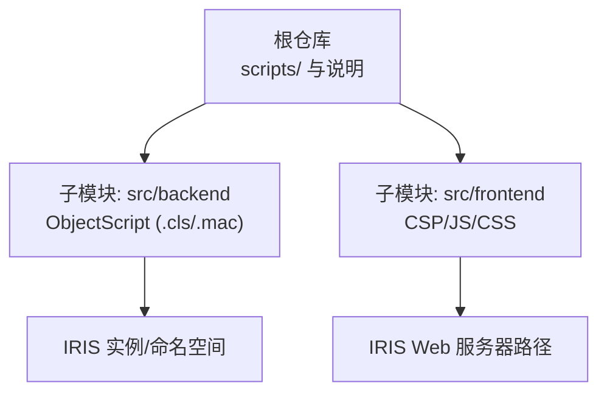
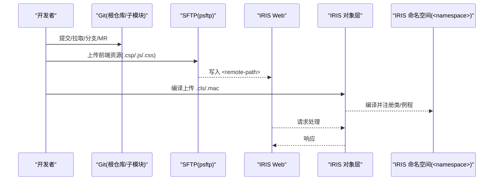
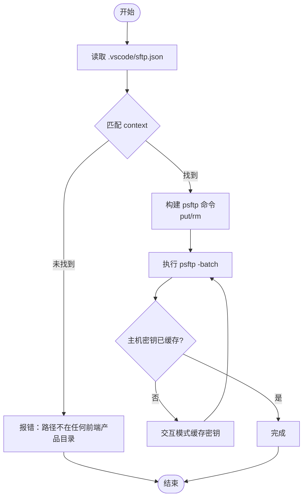
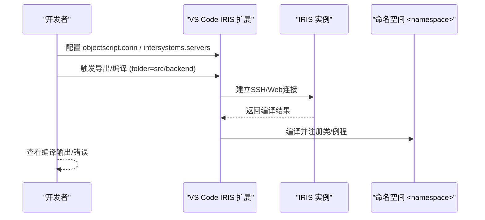
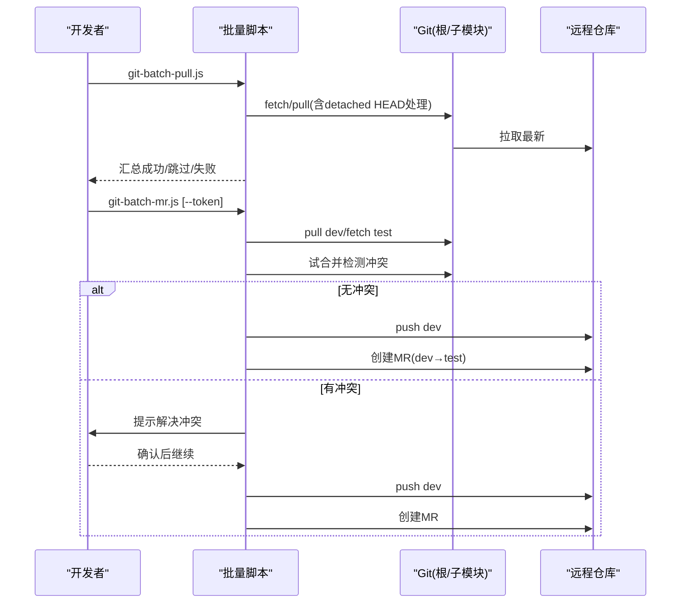
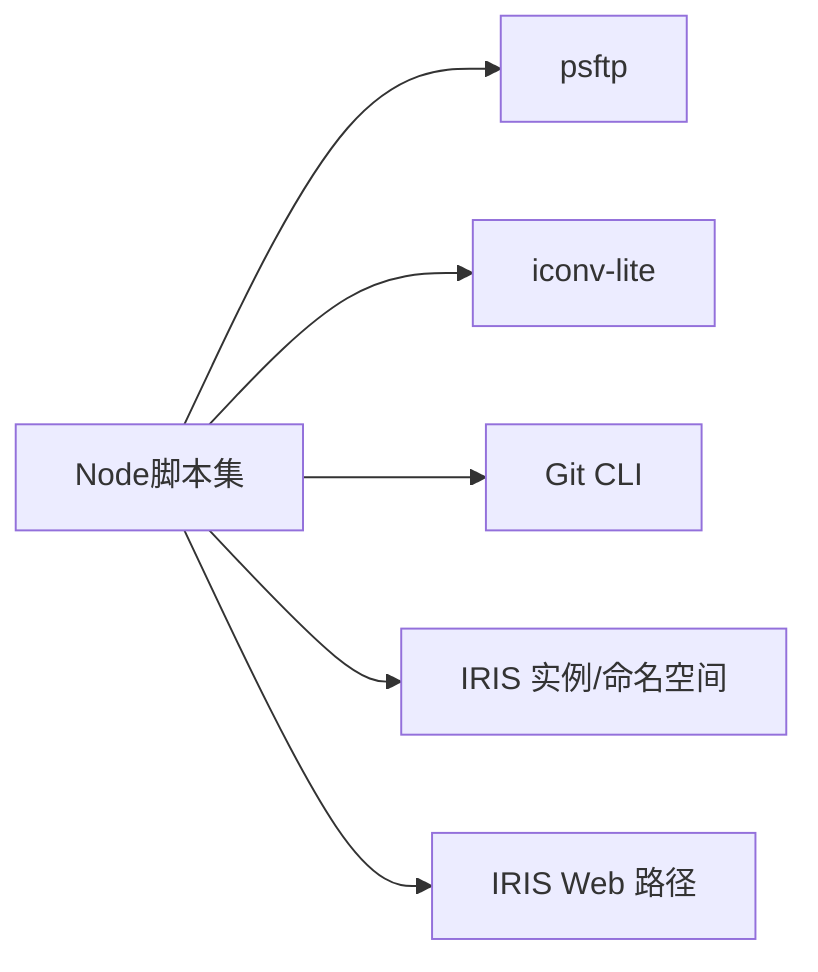

# 部署运维

<cite>
**本文引用的文件**
- [README.md](file://README.md)
- [.gitmodules](file://.gitmodules)
- [scripts/sftp-sync.js](file://scripts/sftp-sync.js)
- [scripts/git-batch-pull.js](file://scripts/git-batch-pull.js)
- [scripts/get-all-logs.js](file://scripts/get-all-logs.js)
- [scripts/convert-encoding.js](file://scripts/convert-encoding.js)
- [scripts/package.json](file://scripts/package.json)
- [scripts/git-utils.js](file://scripts/git-utils.js)
- [src/backend/public-mc/DHCDocConfig.mac](file://src/backend/public-mc/DHCDocConfig.mac)
</cite>

## 目录
1. [简介](#简介)
2. [项目结构](#项目结构)
3. [核心组件](#核心组件)
4. [架构总览](#架构总览)
5. [详细组件分析](#详细组件分析)
6. [依赖关系分析](#依赖关系分析)
7. [性能与容量规划](#性能与容量规划)
8. [监控与告警](#监控与告警)
9. [备份与恢复](#备份与恢复)
10. [故障排查指南](#故障排查指南)
11. [结论](#结论)
12. [附录：常用命令速查](#附录常用命令速查)

## 简介
本运维文档面向IRIS HIS的生产部署与日常运维，覆盖前后端部署机制、自动化脚本使用、生产环境配置要点、性能调优建议、监控告警策略、备份恢复流程以及常见问题定位方法。重点说明：
- 前端静态资源通过SFTP（psftp）批量同步到IRIS Web服务器路径
- 后端ObjectScript代码通过IRIS ObjectScript扩展编译上传至IRIS命名空间
- Git多仓库（根仓库+子模块）的批量操作与提测工作流
- 编码转换、日志收集等运维辅助工具的使用

## 项目结构
项目采用“根仓库 + Git Submodule”管理前后端代码：
- 根仓库：包含运维脚本、模板与说明
- 子模块：
  - src/backend：所有后端ObjectScript代码（通过IRIS扩展编译上传，不走SFTP）
  - src/frontend：所有前端CSP/JS/CSS资源（通过SFTP同步到IRIS Web路径）

图表来源
- [README.md:6-51](file://README.md#L6-L51)
- [.gitmodules:1-7](file://.gitmodules#L1-L7)

章节来源
- [README.md:6-51](file://README.md#L6-L51)
- [.gitmodules:1-7](file://.gitmodules#L1-L7)

## 核心组件
- 前端部署通道：基于psftp的前端文件同步脚本，按本地路径映射到远程Web路径，支持上传、删除与预览映射
- 后端部署通道：通过VS Code IRIS ObjectScript扩展将ObjectScript代码导出并编译上传到指定命名空间
- Git批量工具：批量拉取、分支管理、MR创建、日志聚合、编码转换等
- 配置管理：VS Code settings.json（IRIS连接）、sftp.json（SFTP通道）

章节来源
- [README.md:98-206](file://README.md#L98-L206)
- [scripts/sftp-sync.js:1-291](file://scripts/sftp-sync.js#L1-L291)
- [scripts/git-batch-pull.js:1-116](file://scripts/git-batch-pull.js#L1-L116)
- [scripts/get-all-logs.js:1-218](file://scripts/get-all-logs.js#L1-L218)
- [scripts/convert-encoding.js:1-191](file://scripts/convert-encoding.js#L1-L191)

## 架构总览
下图展示从开发到生产的端到端流程：开发者在本地修改前后端代码，通过Git管理变更；前端通过SFTP同步到IRIS Web路径，后端通过IRIS ObjectScript扩展编译上传；IRIS提供Web服务与业务逻辑。

图表来源
- [README.md:6-51](file://README.md#L6-L51)
- [scripts/sftp-sync.js:1-291](file://scripts/sftp-sync.js#L1-L291)

## 详细组件分析

### 前端SFTP同步机制
- 配置文件：.vscode/sftp.json（需从模板生成并填写host/port/username/password/remotePath/context）
- 映射规则：本地 src/frontend/<产品>/... → 远程 <remote-path>
- 命令：
  - 上传：node scripts/sftp-sync.js upload <文件或目录>
  - 删除：node scripts/sftp-sync.js delete <文件>
  - 预览映射：node scripts/sftp-sync.js check <文件或目录>
- CSP文件上传后需调用IRIS编译接口进行编译生效
- 首次连接可能需缓存主机密钥（脚本会提示并自动重试）

图表来源
- [scripts/sftp-sync.js:53-95](file://scripts/sftp-sync.js#L53-L95)
- [scripts/sftp-sync.js:118-164](file://scripts/sftp-sync.js#L118-L164)
- [scripts/sftp-sync.js:181-227](file://scripts/sftp-sync.js#L181-L227)

章节来源
- [README.md:98-150](file://README.md#L98-L150)
- [scripts/sftp-sync.js:1-291](file://scripts/sftp-sync.js#L1-L291)

### 后端ObjectScript编译上传
- 通过VS Code IRIS ObjectScript扩展配置连接信息（server/instance/ns/用户名密码等）
- 导出/编译路径：workspaceFolder 与 folder 指向 src/backend
- 典型操作：在对应产品目录下使用IRIS命令行或扩展进行批量加载与编译
- 注意：后端不走SFTP，直接由扩展编译上传至IRIS命名空间

图表来源
- [README.md:151-206](file://README.md#L151-L206)

章节来源
- [README.md:151-206](file://README.md#L151-L206)

### Git批量操作与提测工作流
- 批量拉取：node scripts/git-batch-pull.js（自动处理detached HEAD、已是最新判断、汇总报告）
- 批量分支：node scripts/git-batch-branch.js（查看/切换/删除分支，不存在时自动创建）
- 批量stash：node scripts/git-batch-stash.js（stash/pop/list）
- 批量MR：node scripts/git-batch-mr.js（dev→test提测，内置冲突检测与引导解决，支持API令牌创建MR）
- 日志聚合：node scripts/get-all-logs.js（跨仓库聚合提交历史，支持日期/作者过滤、显示修改文件）

图表来源
- [scripts/git-batch-pull.js:17-67](file://scripts/git-batch-pull.js#L17-L67)
- [scripts/get-all-logs.js:47-110](file://scripts/get-all-logs.js#L47-L110)
- [README.md:302-445](file://README.md#L302-L445)

章节来源
- [README.md:302-445](file://README.md#L302-L445)
- [scripts/git-batch-pull.js:1-116](file://scripts/git-batch-pull.js#L1-L116)
- [scripts/get-all-logs.js:1-218](file://scripts/get-all-logs.js#L1-L218)

### 文件编码转换
- 用途：处理历史遗留GB2312/GBK文件，统一为UTF-8或按需转回
- 命令：node scripts/convert-encoding.js <文件路径> <目标编码> [输出目录]
- 特性：严格UTF-8校验、混合编码污染检测、iconv-lite依赖

章节来源
- [scripts/convert-encoding.js:1-191](file://scripts/convert-encoding.js#L1-L191)
- [scripts/package.json:1-10](file://scripts/package.json#L1-L10)

## 依赖关系分析
- 脚本依赖：
  - Node.js运行环境
  - psftp（PuTTY SFTP客户端）用于前端文件传输
  - iconv-lite（编码转换）
  - Git（版本管理与子模块）
- 运行时依赖：
  - IRIS实例与Web服务端口
  - 命名空间（如<namespace>）
  - SSH/Web访问凭据

图表来源
- [scripts/sftp-sync.js:118-164](file://scripts/sftp-sync.js#L118-L164)
- [scripts/convert-encoding.js:56-61](file://scripts/convert-encoding.js#L56-L61)
- [scripts/git-utils.js:1-155](file://scripts/git-utils.js#L1-L155)

章节来源
- [scripts/sftp-sync.js:118-164](file://scripts/sftp-sync.js#L118-L164)
- [scripts/convert-encoding.js:56-61](file://scripts/convert-encoding.js#L56-L61)
- [scripts/git-utils.js:1-155](file://scripts/git-utils.js#L1-L155)

## 性能与容量规划
- 前端资源
  - 建议启用浏览器缓存与压缩（由IRIS Web服务器或前置反向代理负责）
  - 大目录上传时按连接分组减少会话开销（脚本已实现）
- 后端ObjectScript
  - 合理划分命名空间与类库，避免单命名空间过大导致编译/加载缓慢
  - 控制并发编译数量（扩展配置项可调整）
- 数据库与存储
  - 关注IRIS全局变量与表空间增长，定期清理临时数据
  - 根据业务峰值评估内存与CPU配额
- 网络与I/O
  - SFTP带宽与延迟影响前端发布效率，必要时优化网络或分批次发布
  - 避免同时大规模编译与大量并发请求

[本节为通用指导，不直接引用具体文件]

## 监控与告警
- 应用层
  - 关注IRIS Web服务可用性（HTTP健康检查）
  - 监控CSP页面渲染耗时与错误率
- 系统层
  - CPU、内存、磁盘I/O、网络吞吐
  - 进程存活与端口监听状态
- 日志
  - 使用脚本聚合Git提交记录，追踪变更与问题回归
  - 结合IRIS审计日志与应用日志定位异常
- 告警阈值建议
  - 错误率突增、响应时间超过阈值、磁盘使用率过高、进程崩溃等

[本节为通用指导，不直接引用具体文件]

## 备份与恢复
- 数据备份
  - 对IRIS命名空间数据进行快照或导出（依据IRIS官方备份策略）
  - 对IRIS Web路径下的前端资源进行增量备份（与Git保持一致）
- 配置备份
  - 备份.sftp.json与settings.json（注意脱敏）
  - 备份IRIS实例配置与证书
- 恢复流程
  - 先恢复数据与配置，再启动IRIS服务
  - 验证Web服务与关键业务流程
  - 对比Git提交与线上版本一致性

[本节为通用指导，不直接引用具体文件]

## 故障排查指南
- 前端无法访问或样式错乱
  - 确认SFTP上传是否成功，CSP文件是否已编译
  - 检查远程路径映射是否正确（context与remotePath）
- 后端编译失败
  - 检查IRIS连接配置（server/instance/ns/用户名密码）
  - 查看扩展编译输出与IRIS命名空间中的类状态
- Git操作异常
  - detached HEAD状态：使用批量脚本自动修复
  - 冲突：按脚本提示解决后再推送与创建MR
- 编码问题
  - 使用编码转换脚本处理历史文件，避免混合编码污染
- 日志收集
  - 使用get-all-logs.js聚合各仓库提交记录，结合日期/作者过滤快速定位变更

章节来源
- [scripts/sftp-sync.js:181-227](file://scripts/sftp-sync.js#L181-L227)
- [README.md:151-206](file://README.md#L151-L206)
- [scripts/get-all-logs.js:113-211](file://scripts/get-all-logs.js#L113-L211)
- [scripts/convert-encoding.js:88-123](file://scripts/convert-encoding.js#L88-L123)

## 结论
本方案通过“SFTP同步前端 + IRIS ObjectScript扩展编译后端”的双通道发布机制，配合Git批量工具与编码转换、日志收集等辅助脚本，形成了一套完整、可重复、可追溯的IRIS HIS部署运维体系。生产环境中应结合监控告警、备份恢复与性能调优策略，确保系统稳定与高效交付。

[本节为总结性内容，不直接引用具体文件]

## 附录：常用命令速查
- 初始化子模块：git submodule update --init --recursive
- 前端上传：node scripts/sftp-sync.js upload <路径>
- 前端删除：node scripts/sftp-sync.js delete <路径>
- 预览映射：node scripts/sftp-sync.js check <路径>
- 批量拉取：node scripts/git-batch-pull.js
- 批量分支：node scripts/git-batch-branch.js [分支名|-d|-h]
- 批量stash：node scripts/git-batch-stash.js [stash|pop|list] [-u]
[REDACTED: environment-specific example]
- 聚合日志：node scripts/get-all-logs.js [--start-date|--end-date|--author|--show-files]
- 编码转换：node scripts/convert-encoding.js <文件> <utf-8|gb2312> [输出目录]

章节来源
- [README.md:62-206](file://README.md#L62-L206)
- [README.md:302-445](file://README.md#L302-L445)
- [scripts/sftp-sync.js:11-24](file://scripts/sftp-sync.js#L11-L24)
- [scripts/get-all-logs.js:11-37](file://scripts/get-all-logs.js#L11-L37)
- [scripts/convert-encoding.js:9-23](file://scripts/convert-encoding.js#L9-L23)