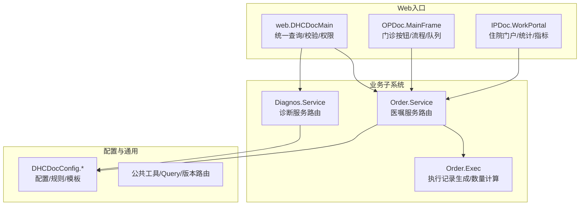
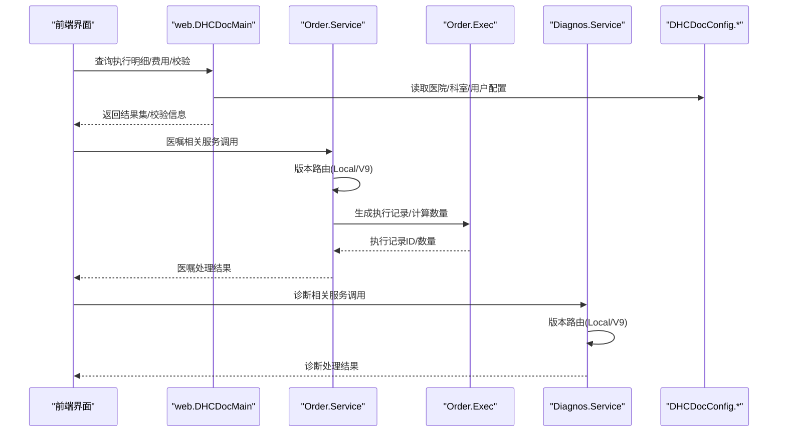
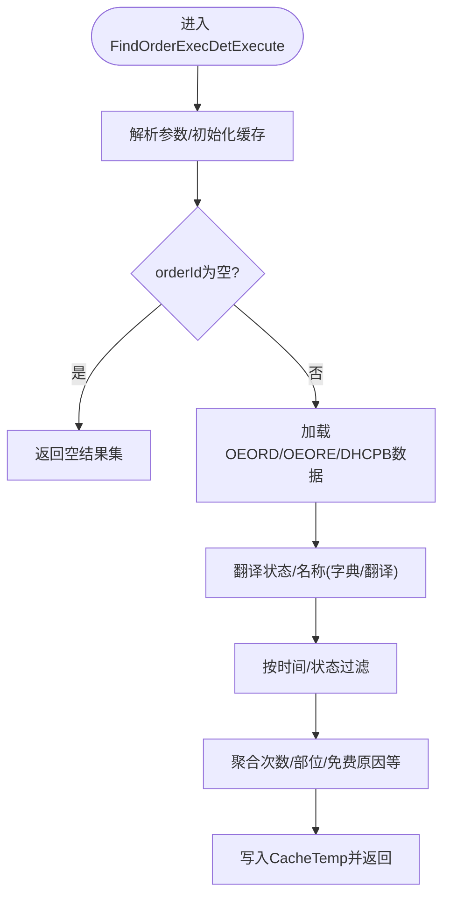
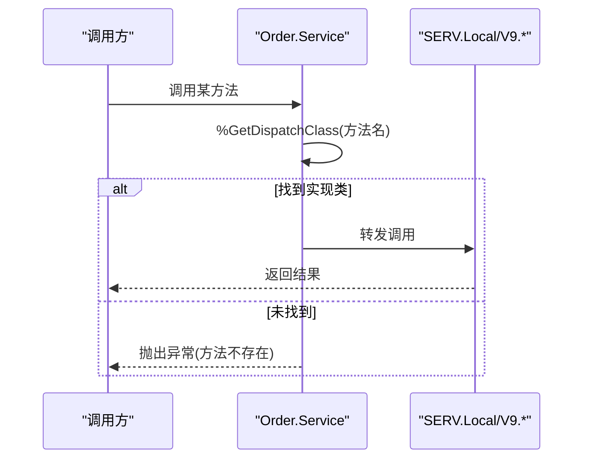
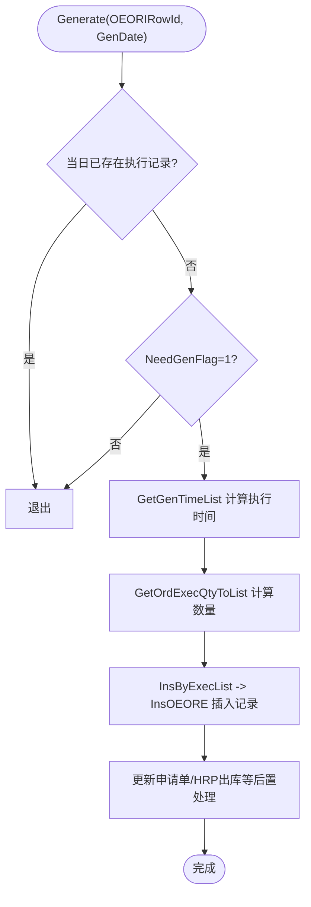
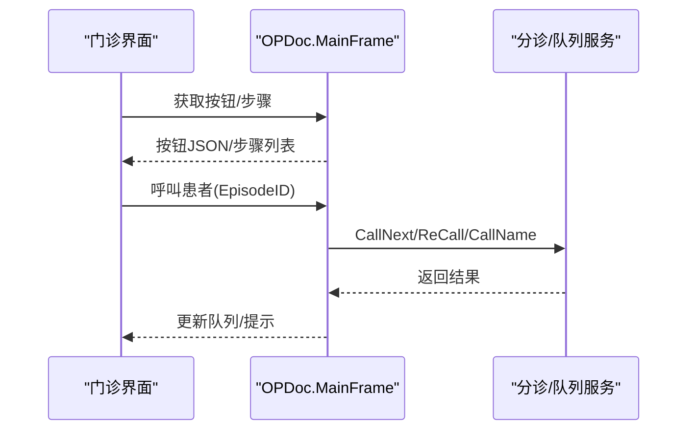
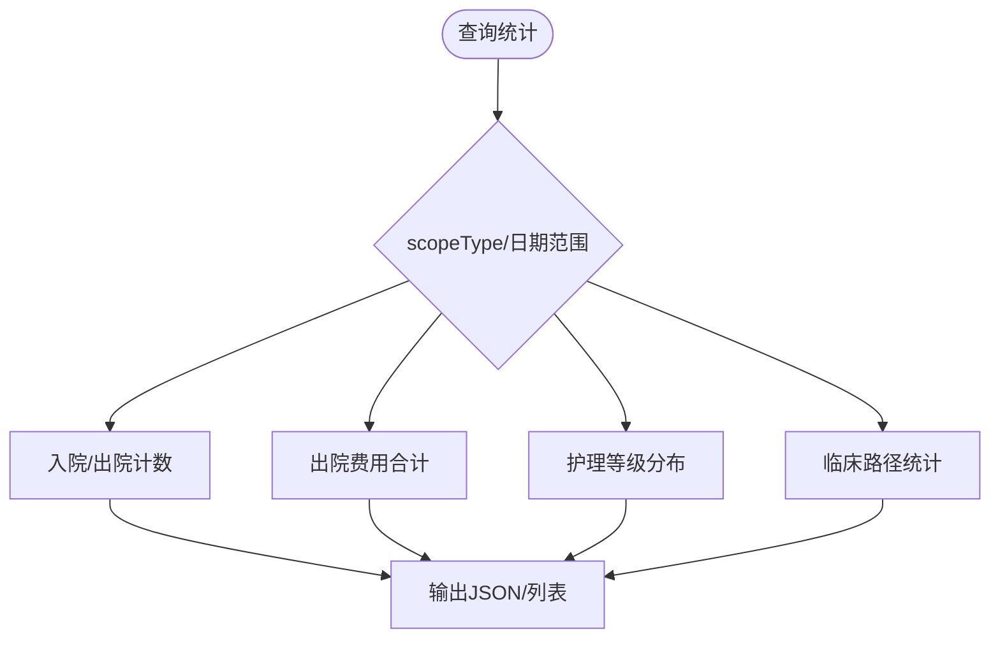
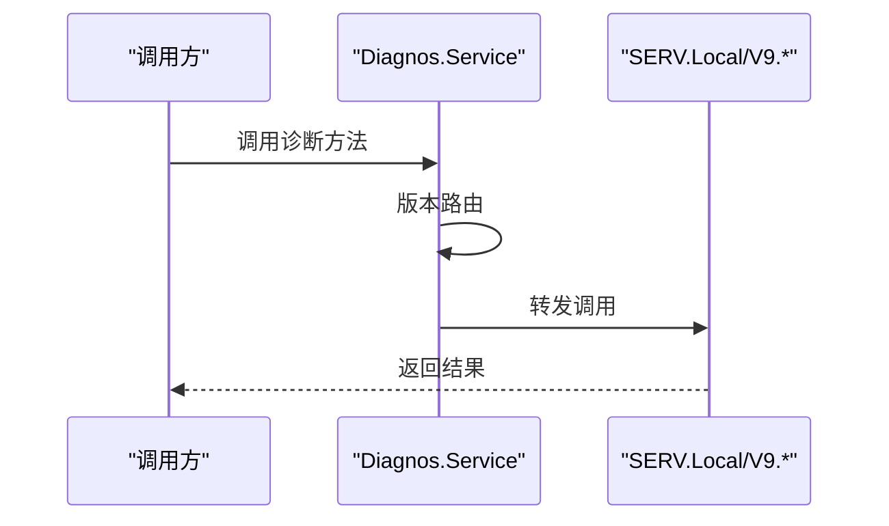
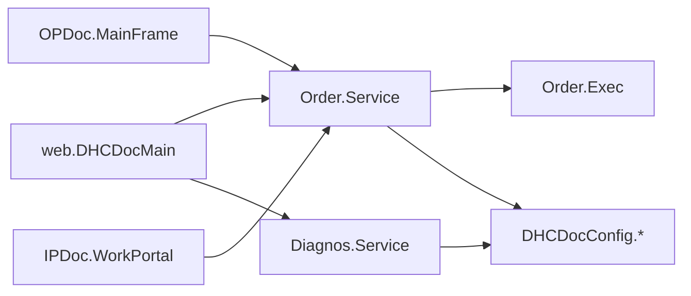

# 医生工作站模块架构

<cite>
**本文引用的文件**
- [web.DHCDocMain.cls](file://src/backend/doc-ws/web/DHCDocMain.cls)
- [DHCDoc.OPDoc.MainFrame.cls](file://src/backend/doc-ws/DHCDoc/OPDoc/MainFrame.cls)
- [DHCDoc.IPDoc.WorkPortal.cls](file://src/backend/doc-ws/DHCDoc/IPDoc/WorkPortal.cls)
- [DHCDoc.Order.Service.cls](file://src/backend/doc-ws/DHCDoc/Order/Service.cls)
- [DHCDoc.Order.Exec.cls](file://src/backend/doc-ws/DHCDoc/Order/Exec.cls)
- [DHCDoc.Diagnos.Service.cls](file://src/backend/doc-ws/DHCDoc/Diagnos/Service.cls)
</cite>

## 目录
1. [简介](#简介)
2. [项目结构](#项目结构)
3. [核心组件](#核心组件)
4. [架构总览](#架构总览)
5. [详细组件分析](#详细组件分析)
6. [依赖关系分析](#依赖关系分析)
7. [性能考虑](#性能考虑)
8. [故障排查指南](#故障排查指南)
9. [结论](#结论)
10. [附录](#附录)

## 简介
本文件面向医生工作站（doc-ws）模块，系统性阐述其整体架构与关键实现：门诊医生工作流、住院医生工作流、医嘱管理与执行、诊断管理等。重点说明主控制器 web.DHCDocMain 的职责与调度机制，订单执行流程与数据流转路径，子模块间的通信接口与依赖关系，以及扩展机制与配置管理方式。文档包含架构图、数据流图与接口契约说明，并提供代码级示例路径以便定位实现细节。

## 项目结构
doc-ws 模块采用“按领域+分层”组织：
- 领域入口与页面服务：web.DHCDocMain（Web 查询与服务）、OPDoc（门诊）、IPDoc（住院）
- 业务子系统：Order（医嘱）、Diagnos（诊断）等，均遵循 Service/SERV/BLL/DAL/INTF/COM 的分层规范
- 配置与通用：DHCDocConfig（各类配置项）、公共工具类

图表来源
- [web.DHCDocMain.cls:1-800](file://src/backend/doc-ws/web/DHCDocMain.cls#L1-L800)
- [DHCDoc.OPDoc.MainFrame.cls:1-519](file://src/backend/doc-ws/DHCDoc/OPDoc/MainFrame.cls#L1-L519)
- [DHCDoc.IPDoc.WorkPortal.cls:1-434](file://src/backend/doc-ws/DHCDoc/IPDoc/WorkPortal.cls#L1-L434)
- [DHCDoc.Order.Service.cls:1-95](file://src/backend/doc-ws/DHCDoc/Order/Service.cls#L1-L95)
- [DHCDoc.Order.Exec.cls:1-800](file://src/backend/doc-ws/DHCDoc/Order/Exec.cls#L1-L800)
- [DHCDoc.Diagnos.Service.cls:1-79](file://src/backend/doc-ws/DHCDoc/Diagnos/Service.cls#L1-L79)

章节来源
- [web.DHCDocMain.cls:1-800](file://src/backend/doc-ws/web/DHCDocMain.cls#L1-L800)
- [DHCDoc.OPDoc.MainFrame.cls:1-519](file://src/backend/doc-ws/DHCDoc/OPDoc/MainFrame.cls#L1-L519)
- [DHCDoc.IPDoc.WorkPortal.cls:1-434](file://src/backend/doc-ws/DHCDoc/IPDoc/WorkPortal.cls#L1-L434)
- [DHCDoc.Order.Service.cls:1-95](file://src/backend/doc-ws/DHCDoc/Order/Service.cls#L1-L95)
- [DHCDoc.Order.Exec.cls:1-800](file://src/backend/doc-ws/DHCDoc/Order/Exec.cls#L1-L800)
- [DHCDoc.Diagnos.Service.cls:1-79](file://src/backend/doc-ws/DHCDoc/Diagnos/Service.cls#L1-L79)

## 核心组件
- web.DHCDocMain：提供统一查询与校验能力（如执行明细、费用明细、小时医嘱时间校验、停嘱权限校验、当前就诊列表等），是医生站前端的重要后端支撑。
- Order.Service：医嘱子系统对外服务入口，重写 %DispatchClassMethod 将请求动态路由到 SERV.Local 或 SERV.V9 的具体实现，屏蔽版本差异。
- Order.Exec：执行记录生成与数量计算的核心逻辑，涵盖频次、间隔、周频次、首日用量、关联子医嘱、多剂量、批次价等复杂场景。
- OPDoc.MainFrame：门诊工作区框架，负责按钮配置、治疗步骤、呼叫患者、未读报告计数等。
- IPDoc.WorkPortal：住院工作区门户，提供当前就诊、出入院统计、病种/护理等级统计等。
- Diagnos.Service：诊断子系统对外服务入口，同样基于版本路由机制分发到具体实现。

章节来源
- [web.DHCDocMain.cls:1-800](file://src/backend/doc-ws/web/DHCDocMain.cls#L1-L800)
- [DHCDoc.Order.Service.cls:1-95](file://src/backend/doc-ws/DHCDoc/Order/Service.cls#L1-L95)
- [DHCDoc.Order.Exec.cls:1-800](file://src/backend/doc-ws/DHCDoc/Order/Exec.cls#L1-L800)
- [DHCDoc.OPDoc.MainFrame.cls:1-519](file://src/backend/doc-ws/DHCDoc/OPDoc/MainFrame.cls#L1-L519)
- [DHCDoc.IPDoc.WorkPortal.cls:1-434](file://src/backend/doc-ws/DHCDoc/IPDoc/WorkPortal.cls#L1-L434)
- [DHCDoc.Diagnos.Service.cls:1-79](file://src/backend/doc-ws/DHCDoc/Diagnos/Service.cls#L1-L79)

## 架构总览
医生工作站以“Web入口 + 领域服务 + 配置中心”的三层为主轴：
- Web入口层：web.DHCDocMain、OPDoc.MainFrame、IPDoc.WorkPortal 暴露查询与操作入口，封装会话、权限、国际化等横切关注点。
- 领域服务层：Order.Service、Diagnos.Service 作为各子系统的统一入口，通过版本路由将调用委派给具体实现（Local/V9）。
- 配置与通用层：DHCDocConfig.* 提供规则、模板、开关；COM/Version/Query 提供基础能力。

图表来源
- [web.DHCDocMain.cls:1-800](file://src/backend/doc-ws/web/DHCDocMain.cls#L1-L800)
- [DHCDoc.Order.Service.cls:1-95](file://src/backend/doc-ws/DHCDoc/Order/Service.cls#L1-L95)
- [DHCDoc.Order.Exec.cls:1-800](file://src/backend/doc-ws/DHCDoc/Order/Exec.cls#L1-L800)
- [DHCDoc.Diagnos.Service.cls:1-79](file://src/backend/doc-ws/DHCDoc/Diagnos/Service.cls#L1-L79)

## 详细组件分析

### 主控制器 web.DHCDocMain
职责与调度机制
- 统一查询：提供 FindOrderExecDet、FindOrderFee 等 Query，用于获取执行明细与费用明细，支持分页与缓存。
- 校验与权限：CheckUpdateHour 对小时医嘱结束时间进行严格校验；CheckStopPermission 校验停嘱权限。
- 就诊列表：FindLocDocCurrentAdmExecute 根据科室/医生/日期范围等条件聚合当前就诊。
- 辅助能力：isNurseLogin、GetDoctorList、GetPatientBaseInfo 等。

数据流要点
- 从 OEORD/OEORE/DHCPB 等底层表读取执行与计费信息，结合 OEC 字典翻译状态码。
- 使用 CacheTemp 临时存储查询结果，提升大数据量下的响应性能。
- 通过 DHCDocInterfaceMethod 与外部 HIS 交互（如退药数量查询）。

图表来源
- [web.DHCDocMain.cls:1-800](file://src/backend/doc-ws/web/DHCDocMain.cls#L1-L800)

章节来源
- [web.DHCDocMain.cls:1-800](file://src/backend/doc-ws/web/DHCDocMain.cls#L1-L800)

### 医嘱子系统 Order.Service
设计要点
- 统一入口：所有外部调用必须通过 ##class(DHCDoc.Order.Service).Method()。
- 版本路由：优先 Local 版本，回退 V9；方法名唯一，避免冲突。
- 分层约束：SERV 编排、BLL 业务、DAL 数据访问、INTF 外部接口、COM 公共组件。

调用序列

图表来源
- [DHCDoc.Order.Service.cls:1-95](file://src/backend/doc-ws/DHCDoc/Order/Service.cls#L1-L95)

章节来源
- [DHCDoc.Order.Service.cls:1-95](file://src/backend/doc-ws/DHCDoc/Order/Service.cls#L1-L95)

### 医嘱执行 Order.Exec
核心功能
- Generate：生成执行记录入口，判断是否需要生成、获取执行时间列表、批量插入。
- NeedGenFlag：依据治疗预约、PRN、长期/临时、有效期等规则判定是否生成。
- GetGenTimeList：综合申请单、小时医嘱、关联子医嘱、频次/间隔/周频次/首日次数等计算执行时间。
- InsByExecList/InsOEORE：批量插入执行记录，处理医保标志、批次价、自定义价格、HRP出库等。

算法流程图

图表来源
- [DHCDoc.Order.Exec.cls:1-800](file://src/backend/doc-ws/DHCDoc/Order/Exec.cls#L1-L800)

章节来源
- [DHCDoc.Order.Exec.cls:1-800](file://src/backend/doc-ws/DHCDoc/Order/Exec.cls#L1-L800)

### 门诊工作区 OPDoc.MainFrame
职责
- 按钮配置与渲染：QueryBtnCfg 根据页面URL、会话、样式等动态组装按钮。
- 治疗步骤：QueryTreatStep 获取流程步骤及条件显示。
- 呼叫患者：CallPatient 与分诊系统对接，支持顺呼、重呼、指定呼叫。
- 未读报告计数：整合检验/检查未读数量。

图表来源
- [DHCDoc.OPDoc.MainFrame.cls:1-519](file://src/backend/doc-ws/DHCDoc/OPDoc/MainFrame.cls#L1-L519)

章节来源
- [DHCDoc.OPDoc.MainFrame.cls:1-519](file://src/backend/doc-ws/DHCDoc/OPDoc/MainFrame.cls#L1-L519)

### 住院工作区 IPDoc.WorkPortal
职责
- 当前就诊：QueryCurAdm 按科室/医生维度汇总当前在院患者。
- 统计指标：出入院人数、出院费用、护理等级分布、病危/病重统计、床位使用率等。
- 临床路径：CPW 入径/出径统计。

图表来源
- [DHCDoc.IPDoc.WorkPortal.cls:1-434](file://src/backend/doc-ws/DHCDoc/IPDoc/WorkPortal.cls#L1-L434)

章节来源
- [DHCDoc.IPDoc.WorkPortal.cls:1-434](file://src/backend/doc-ws/DHCDoc/IPDoc/WorkPortal.cls#L1-L434)

### 诊断子系统 Diagnos.Service
职责
- 统一入口：通过版本路由将调用分发到 SERV.Local/V9 的实现类。
- 覆盖能力：诊断录入、证书、配置、长效诊断、专科表单等。

图表来源
- [DHCDoc.Diagnos.Service.cls:1-79](file://src/backend/doc-ws/DHCDoc/Diagnos/Service.cls#L1-L79)

章节来源
- [DHCDoc.Diagnos.Service.cls:1-79](file://src/backend/doc-ws/DHCDoc/Diagnos/Service.cls#L1-L79)

## 依赖关系分析
- web.DHCDocMain 依赖 Order 与 Diagnos 的服务入口，同时依赖配置与字典翻译。
- Order.Service 依赖 Order.Exec 与配置；Order.Exec 依赖底层数据表与外部接口（申请单、HRP）。
- OPDoc.MainFrame 与 IPDoc.WorkPortal 依赖队列、统计、配置等。
- 版本路由机制确保 Local 定制优先于标准版本，降低耦合度。

图表来源
- [web.DHCDocMain.cls:1-800](file://src/backend/doc-ws/web/DHCDocMain.cls#L1-L800)
- [DHCDoc.Order.Service.cls:1-95](file://src/backend/doc-ws/DHCDoc/Order/Service.cls#L1-L95)
- [DHCDoc.Order.Exec.cls:1-800](file://src/backend/doc-ws/DHCDoc/Order/Exec.cls#L1-L800)
- [DHCDoc.Diagnos.Service.cls:1-79](file://src/backend/doc-ws/DHCDoc/Diagnos/Service.cls#L1-L79)
- [DHCDoc.OPDoc.MainFrame.cls:1-519](file://src/backend/doc-ws/DHCDoc/OPDoc/MainFrame.cls#L1-L519)
- [DHCDoc.IPDoc.WorkPortal.cls:1-434](file://src/backend/doc-ws/DHCDoc/IPDoc/WorkPortal.cls#L1-L434)

章节来源
- [web.DHCDocMain.cls:1-800](file://src/backend/doc-ws/web/DHCDocMain.cls#L1-L800)
- [DHCDoc.Order.Service.cls:1-95](file://src/backend/doc-ws/DHCDoc/Order/Service.cls#L1-L95)
- [DHCDoc.Order.Exec.cls:1-800](file://src/backend/doc-ws/DHCDoc/Order/Exec.cls#L1-L800)
- [DHCDoc.Diagnos.Service.cls:1-79](file://src/backend/doc-ws/DHCDoc/Diagnos/Service.cls#L1-L79)
- [DHCDoc.OPDoc.MainFrame.cls:1-519](file://src/backend/doc-ws/DHCDoc/OPDoc/MainFrame.cls#L1-L519)
- [DHCDoc.IPDoc.WorkPortal.cls:1-434](file://src/backend/doc-ws/DHCDoc/IPDoc/WorkPortal.cls#L1-L434)

## 性能考虑
- 查询优化：web.DHCDocMain 使用 CacheTemp 缓存中间结果，减少重复计算；对大数据集采用分批输出。
- 执行记录生成：Order.Exec 通过频次/间隔/周频次等预计算执行时间，避免运行时复杂循环；批量插入减少IO。
- 版本路由：Order.Service/Diagnos.Service 的版本路由仅在启动时扫描一次，运行时开销低。
- 配置读取：集中式配置减少分散查询，建议按需缓存。

[本节为通用指导，不直接分析具体文件]

## 故障排查指南
常见问题与定位
- 小时医嘱结束时间修改失败：检查 CheckUpdateHour 中的时间边界与医嘱停止时间限制。
- 停嘱权限不足：检查 CheckStopPermission 中用户/科室/组权限校验。
- 执行记录未生成：核查 NeedGenFlag 的条件（治疗预约、PRN、有效期、临时/长期）与 GetGenTimeList 的计算结果。
- 费用明细缺失：确认 FindOrderFeeExecute 中费别与账单状态分支逻辑。

章节来源
- [web.DHCDocMain.cls:1-800](file://src/backend/doc-ws/web/DHCDocMain.cls#L1-L800)
- [DHCDoc.Order.Exec.cls:1-800](file://src/backend/doc-ws/DHCDoc/Order/Exec.cls#L1-L800)

## 结论
doc-ws 模块通过清晰的层次划分与版本路由机制，实现了门诊与住院工作流的解耦与可扩展性。web.DHCDocMain 作为统一入口提供查询与校验能力；Order 与 Diagnos 子系统通过 Service 入口屏蔽实现差异；Order.Exec 承担复杂的执行记录生成与数量计算。配合 DHCDocConfig 的配置化能力，系统具备良好的可维护性与扩展性。

[本节为总结，不直接分析具体文件]

## 附录
- 接口契约示例（路径引用）
  - 医嘱执行明细查询：[web.DHCDocMain.cls:1-800](file://src/backend/doc-ws/web/DHCDocMain.cls#L1-L800)
  - 医嘱服务路由：[DHCDoc.Order.Service.cls:1-95](file://src/backend/doc-ws/DHCDoc/Order/Service.cls#L1-L95)
  - 执行记录生成：[DHCDoc.Order.Exec.cls:1-800](file://src/backend/doc-ws/DHCDoc/Order/Exec.cls#L1-L800)
  - 诊断服务路由：[DHCDoc.Diagnos.Service.cls:1-79](file://src/backend/doc-ws/DHCDoc/Diagnos/Service.cls#L1-L79)
  - 门诊按钮/流程：[DHCDoc.OPDoc.MainFrame.cls:1-519](file://src/backend/doc-ws/DHCDoc/OPDoc/MainFrame.cls#L1-L519)
  - 住院门户统计：[DHCDoc.IPDoc.WorkPortal.cls:1-434](file://src/backend/doc-ws/DHCDoc/IPDoc/WorkPortal.cls#L1-L434)

[本节为参考索引，不直接分析具体文件]