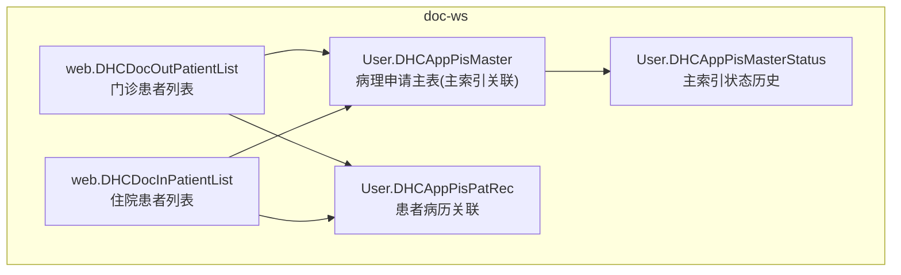
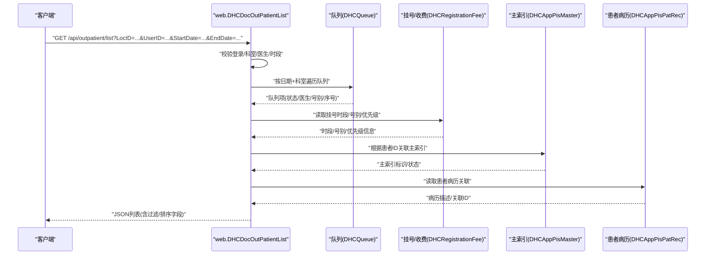
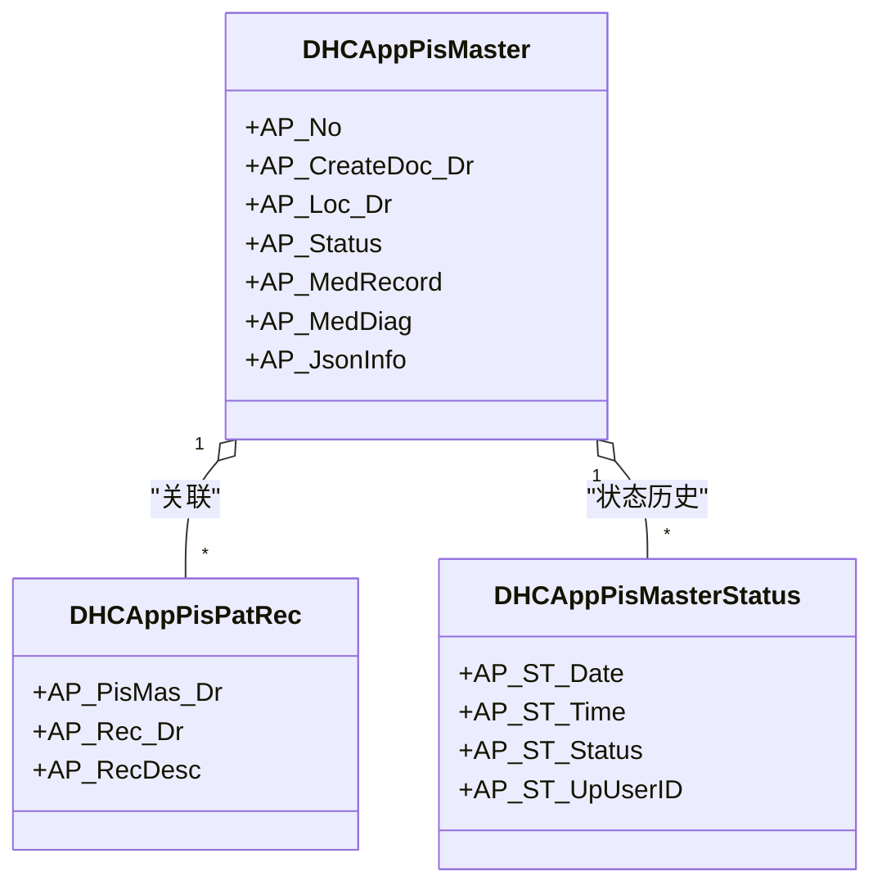
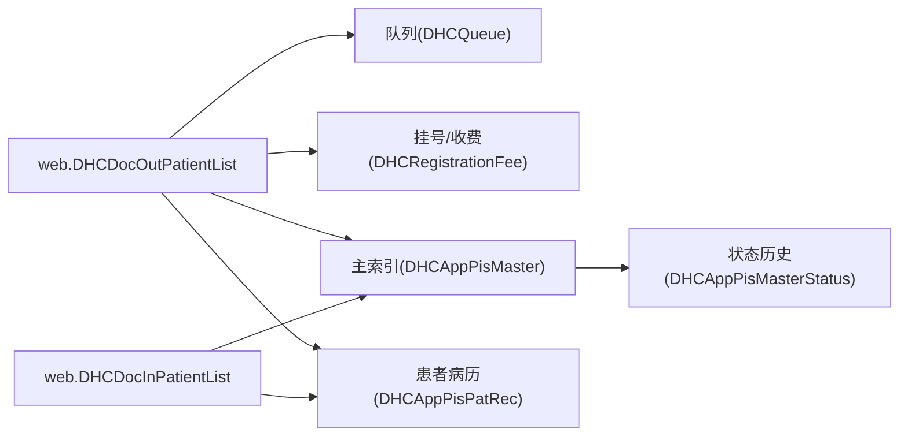

# 患者管理接口

<cite>
**本文引用的文件**
- [DHCAppPisMaster.cls](file://src/backend/doc-ws/User/DHCAppPisMaster.cls)
- [DHCAppPisPatRec.cls](file://src/backend/doc-ws/User/DHCAppPisPatRec.cls)
- [DHCAppPisMasterStatus.cls](file://src/backend/doc-ws/User/DHCAppPisMasterStatus.cls)
- [DHCDocInPatientList.cls](file://src/backend/doc-ws/web/DHCDocInPatientList.cls)
- [DHCDocOutPatientList.cls](file://src/backend/doc-ws/web/DHCDocOutPatientList.cls)
</cite>

## 目录
1. [简介](#简介)
2. [项目结构](#项目结构)
3. [核心组件](#核心组件)
4. [架构总览](#架构总览)
5. [详细组件分析](#详细组件分析)
6. [依赖关系分析](#依赖关系分析)
7. [性能考虑](#性能考虑)
8. [故障排查指南](#故障排查指南)
9. [结论](#结论)
10. [附录](#附录)

## 简介
本文件面向“患者管理”相关API，覆盖患者基本信息查询、患者列表获取（门诊/住院）、患者状态管理等核心能力。文档以代码实现为依据，说明HTTP请求方法、URL模式、请求参数与响应格式；给出过滤条件、分页参数与排序选项；提供成功与失败场景的调用示例；解释与患者主索引系统的集成关系和数据同步机制；并记录权限控制与数据访问限制要点。

## 项目结构
该仓库采用按业务域划分的后端模块组织方式：
- doc-ws：医生工作站相关服务，包含患者列表、队列、就诊流程等能力
- epmi-mc/opadm-mc/pilot-*：其他业务域（如医保、运营、试点）
- public-mc：公共能力与基础模型
- frontend：前端页面与脚本

与患者管理相关的核心代码集中在 doc-ws 下的 web 层（列表与队列）以及 User 层（主索引与状态）。

图表来源
- [DHCDocOutPatientList.cls:117-352](file://src/backend/doc-ws/web/DHCDocOutPatientList.cls#L117-L352)
- [DHCDocInPatientList.cls:56-169](file://src/backend/doc-ws/web/DHCDocInPatientList.cls#L56-L169)
- [DHCAppPisMaster.cls:1-141](file://src/backend/doc-ws/User/DHCAppPisMaster.cls#L1-L141)
- [DHCAppPisPatRec.cls:1-67](file://src/backend/doc-ws/User/DHCAppPisPatRec.cls#L1-L67)
- [DHCAppPisMasterStatus.cls:1-128](file://src/backend/doc-ws/User/DHCAppPisMasterStatus.cls#L1-L128)

章节来源
- [DHCDocOutPatientList.cls:117-352](file://src/backend/doc-ws/web/DHCDocOutPatientList.cls#L117-L352)
- [DHCDocInPatientList.cls:56-169](file://src/backend/doc-ws/web/DHCDocInPatientList.cls#L56-L169)
- [DHCAppPisMaster.cls:1-141](file://src/backend/doc-ws/User/DHCAppPisMaster.cls#L1-L141)
- [DHCAppPisPatRec.cls:1-67](file://src/backend/doc-ws/User/DHCAppPisPatRec.cls#L1-L67)
- [DHCAppPisMasterStatus.cls:1-128](file://src/backend/doc-ws/User/DHCAppPisMasterStatus.cls#L1-L128)

## 核心组件
- 门诊患者列表服务：提供按科室、医生、号别、时间范围、状态等多维过滤的患者列表查询，支持报到、会诊、完成、全部等视图，内置排序与队列信息聚合。
- 住院患者列表服务：提供按病区、床位、医生、日期范围、到诊队列等条件的住院患者列表查询。
- 患者主索引与状态：通过主索引实体及其状态历史，支撑跨系统患者识别与状态追踪。

章节来源
- [DHCDocOutPatientList.cls:117-352](file://src/backend/doc-ws/web/DHCDocOutPatientList.cls#L117-L352)
- [DHCDocInPatientList.cls:56-169](file://src/backend/doc-ws/web/DHCDocInPatientList.cls#L56-L169)
- [DHCAppPisMaster.cls:1-141](file://src/backend/doc-ws/User/DHCAppPisMaster.cls#L1-L141)
- [DHCAppPisMasterStatus.cls:1-128](file://src/backend/doc-ws/User/DHCAppPisMasterStatus.cls#L1-L128)

## 架构总览
以下序列图展示“获取门诊患者列表”的典型调用链：客户端发起请求，服务端解析会话与权限，执行查询构建器，遍历队列与登记信息，组装行数据并返回。

图表来源
- [DHCDocOutPatientList.cls:117-352](file://src/backend/doc-ws/web/DHCDocOutPatientList.cls#L117-L352)
- [DHCAppPisMaster.cls:1-141](file://src/backend/doc-ws/User/DHCAppPisMaster.cls#L1-L141)
- [DHCAppPisPatRec.cls:1-67](file://src/backend/doc-ws/User/DHCAppPisPatRec.cls#L1-L67)

## 详细组件分析

### 门诊患者列表接口（web.DHCDocOutPatientList）
- 功能概述
  - 提供门诊患者列表查询，支持多种视图：注册队列、已报到、会诊、已完成、全部队列等。
  - 支持按科室、医生、号别、姓名、登记号、时间段、排队状态、优先级别等过滤。
  - 输出包含患者基本信息、就诊信息、队列信息、时段信息、诊断、备注等。
- HTTP方法与URL
  - 方法：GET
  - URL模式：/api/outpatient/list（实际路由由CSP/网关配置决定，此处为约定路径）
- 请求参数（Query）
  - LocID：科室ID（必填，若为空则从会话取当前登录科室）
  - UserID：用户ID（必填，若为空则从会话取当前登录用户）
  - IPAddress：可选，用于日志或房间定位
  - AllPatient：是否全病区/全科（on/off）
  - PatientNo：登记号（精确匹配）
  - SurName：姓名（模糊匹配）
  - StartDate/EndDate：就诊日期范围
  - ArrivedQue：已报到队列（on/off）
  - RegQue：注册队列（on/on1，不同分支逻辑）
  - Consultation：会诊队列（on/off）
  - MarkID：号别ID（过滤特定号别）
  - CheckName：检查名称（兼容旧版，用于启用某些视图）
  - PatSeqNo：本地序号（用于筛选）
  - ExtStr：扩展串，包含MZRecordStatus、FTimeRange等
  - ExpSessionStr：扩展会话，包含医院/分组ID
- 响应格式
  - JSON数组，每项包含：
    - 患者标识：PatientID、mradm、PAPMINO、PAPMIName、PAPMIDOB、PAPMISex
    - 就诊信息：PAAdmDate、PAAdmTime、PAAdmNo、PAAdmDepCodeDR、PAAdmDocCodeDR、PAAdmType、Hospital、PAAdmWard、PAAdmBed
    - 状态与原因：FinancialDischargeFlag、MedicalDischargeFlag、FinalDischargeFlag、PAAdmReason、PAAdmReasonCode、DischargeDate
    - 队列信息：LocSeqNo、PAAdmPriority、WalkStatus、ConsultRoom、ConsultArea、StatusCode、PriorityCode、Called、RegDocDr
    - 附加信息：TPoliticalLevel、TSecretLevel、RegRangeTime、RegAdmSource、ComPlateflag、Remark、PAAdmReMark、MZRecordStatus、FirstReason、WaitTime、WaitLongFlag、TimeRangeColor
- 过滤与排序
  - 过滤：支持按姓名、登记号、时间段、号别、队列状态、医生、科室等组合过滤
  - 排序：内部基于“医生号别-状态-时段-序号”等生成排序键；支持“UnSort”跳过内部排序
- 典型调用示例
  - 成功：GET /api/outpatient/list?LocID=1001&UserID=U001&StartDate=2025-01-01&EndDate=2025-01-01&RegQue=on
  - 失败：未登录或无权限时返回空列表或错误码（具体由网关/中间件处理）
- 权限与访问限制
  - 必须提供有效LocID与UserID；否则直接退出
  - 仅显示当前医生可接诊的患者（依据号别对照与会诊标志）
  - 受排班时段与号别配置影响（例如非当前时段不显示）
- 关键实现参考
  - 入口与参数解析：[DHCDocOutPatientList.cls:117-156](file://src/backend/doc-ws/web/DHCDocOutPatientList.cls#L117-L156)
  - 视图分支与队列遍历：[DHCDocOutPatientList.cls:209-352](file://src/backend/doc-ws/web/DHCDocOutPatientList.cls#L209-L352)
  - 行组装与排序键：[DHCDocOutPatientList.cls:361-603](file://src/backend/doc-ws/web/DHCDocOutPatientList.cls#L361-L603)

章节来源
- [DHCDocOutPatientList.cls:117-352](file://src/backend/doc-ws/web/DHCDocOutPatientList.cls#L117-L352)
- [DHCDocOutPatientList.cls:361-603](file://src/backend/doc-ws/web/DHCDocOutPatientList.cls#L361-L603)

### 住院患者列表接口（web.DHCDocInPatientList）
- 功能概述
  - 提供住院患者列表查询，支持按病区、床位、医生、日期范围、到诊队列等条件过滤。
  - 输出包含患者基本信息、入院信息、病区床位、出院标志、诊断、到离院时间等。
- HTTP方法与URL
  - 方法：GET
  - URL模式：/api/inpatient/list（实际路由由CSP/网关配置决定）
- 请求参数（Query）
  - LocID：科室ID（必填，若为空则从会话取）
  - UserID：用户ID（必填，若为空则从会话取）
  - IPAddress：可选
  - AllPatient：是否全病区（on/off）
  - PatientNo：登记号（精确匹配）
  - SurName：姓名（模糊匹配）
  - StartDate/EndDate：入院日期范围
  - ArrivedQue：已到诊队列（on/off）
  - RegQue：登记队列（on/off）
  - MedUnit：医疗单元（可选）
  - PACWard：病区（可选）
  - BedId：床位ID（可选）
- 响应格式
  - JSON数组，每项包含：
    - 患者标识：PatientID、EpisodeID、mradm、PAPMINO、PAPMIName、PAPMIDOB、PAPMISex
    - 入院信息：PAAdmDate、PAAdmTime、PAAdmNo、PAAdmDepCodeDR、PAAdmDocCodeDR、PAAdmType、Hospital、PAAdmWard、PAAdmBed
    - 状态与原因：FinancialDischargeFlag、MedicalDischargeFlag、FinalDischargeFlag、PAAdmReason、PAAdmReasonCode、DischargeDate
    - 其他：Diagnosis、ArrivedDate、ArrivedTime、LeavedDate、LeavedTime、LocSeqNo、PAAdmPriority、WalkStatus、ConsultRoom、ConsultArea、StatusCode、Age、PriorityCode、Called、RegDocDr
- 过滤与排序
  - 过滤：支持按病区、床位、医生、日期范围、队列状态等组合过滤
  - 排序：内部按“主键/序号”进行稳定排序
- 典型调用示例
  - 成功：GET /api/inpatient/list?LocID=2001&UserID=U002&StartDate=2025-01-01&EndDate=2025-01-01&PACWard=W001
  - 失败：无权限或参数缺失时返回空结果或错误码
- 权限与访问限制
  - 必须提供有效LocID与UserID；否则直接退出
  - 仅显示当前医生可管理的住院患者（依据医生与病区配置）
- 关键实现参考
  - 入口与参数解析：[DHCDocInPatientList.cls:56-169](file://src/backend/doc-ws/web/DHCDocInPatientList.cls#L56-L169)
  - 行组装与输出：[DHCDocInPatientList.cls:171-246](file://src/backend/doc-ws/web/DHCDocInPatientList.cls#L171-L246)

章节来源
- [DHCDocInPatientList.cls:56-169](file://src/backend/doc-ws/web/DHCDocInPatientList.cls#L56-L169)
- [DHCDocInPatientList.cls:171-246](file://src/backend/doc-ws/web/DHCDocInPatientList.cls#L171-L246)

### 患者主索引与状态（User.DHCAppPisMaster / DHCAppPisMasterStatus）
- 功能概述
  - 维护患者主索引（申请单/病理申请等）及状态历史，支撑跨系统患者识别与状态追踪。
  - 主索引实体包含申请单号、申请医生、申请科室、状态、临床病历、诊断等信息。
  - 状态历史记录每次状态变更的时间、操作人、状态值。
- 数据模型关系
  - 主索引与患者病历存在一对多关联（通过患者病历关联表）
  - 主索引与状态历史为一对多关系（一次申请多次状态变更）
- 典型使用场景
  - 列表接口在组装数据时，根据患者ID关联主索引，获取主索引标识与状态
  - 状态变更触发后写入状态历史，便于审计与追溯
- 关键实现参考
  - 主索引实体定义与关系：[DHCAppPisMaster.cls:1-141](file://src/backend/doc-ws/User/DHCAppPisMaster.cls#L1-L141)
  - 患者病历关联：[DHCAppPisPatRec.cls:1-67](file://src/backend/doc-ws/User/DHCAppPisPatRec.cls#L1-L67)
  - 状态历史实体：[DHCAppPisMasterStatus.cls:1-128](file://src/backend/doc-ws/User/DHCAppPisMasterStatus.cls#L1-L128)

章节来源
- [DHCAppPisMaster.cls:1-141](file://src/backend/doc-ws/User/DHCAppPisMaster.cls#L1-L141)
- [DHCAppPisPatRec.cls:1-67](file://src/backend/doc-ws/User/DHCAppPisPatRec.cls#L1-L67)
- [DHCAppPisMasterStatus.cls:1-128](file://src/backend/doc-ws/User/DHCAppPisMasterStatus.cls#L1-L128)

### 类关系图（代码级）

图表来源
- [DHCAppPisMaster.cls:1-141](file://src/backend/doc-ws/User/DHCAppPisMaster.cls#L1-L141)
- [DHCAppPisPatRec.cls:1-67](file://src/backend/doc-ws/User/DHCAppPisPatRec.cls#L1-L67)
- [DHCAppPisMasterStatus.cls:1-128](file://src/backend/doc-ws/User/DHCAppPisMasterStatus.cls#L1-L128)

## 依赖关系分析
- 列表服务依赖队列、挂号/收费、主索引与患者病历等子系统
- 主索引与状态历史构成患者身份与状态的主数据源
- 列表接口通过会话上下文获取登录信息（科室、医生），并进行权限与范围控制

图表来源
- [DHCDocOutPatientList.cls:117-352](file://src/backend/doc-ws/web/DHCDocOutPatientList.cls#L117-L352)
- [DHCDocInPatientList.cls:56-169](file://src/backend/doc-ws/web/DHCDocInPatientList.cls#L56-L169)
- [DHCAppPisMaster.cls:1-141](file://src/backend/doc-ws/User/DHCAppPisMaster.cls#L1-L141)
- [DHCAppPisPatRec.cls:1-67](file://src/backend/doc-ws/User/DHCAppPisPatRec.cls#L1-L67)
- [DHCAppPisMasterStatus.cls:1-128](file://src/backend/doc-ws/User/DHCAppPisMasterStatus.cls#L1-L128)

章节来源
- [DHCDocOutPatientList.cls:117-352](file://src/backend/doc-ws/web/DHCDocOutPatientList.cls#L117-L352)
- [DHCDocInPatientList.cls:56-169](file://src/backend/doc-ws/web/DHCDocInPatientList.cls#L56-L169)
- [DHCAppPisMaster.cls:1-141](file://src/backend/doc-ws/User/DHCAppPisMaster.cls#L1-L141)
- [DHCAppPisPatRec.cls:1-67](file://src/backend/doc-ws/User/DHCAppPisPatRec.cls#L1-L67)
- [DHCAppPisMasterStatus.cls:1-128](file://src/backend/doc-ws/User/DHCAppPisMasterStatus.cls#L1-L128)

## 性能考虑
- 列表查询使用临时表与缓存键（^CacheTemp、^TMP）减少重复计算
- 通过索引（如队列日期+科室索引）提升遍历效率
- 排序键构造避免全量排序，仅在必要时启用内部排序
- 建议：
  - 合理设置日期范围与过滤条件，避免全库扫描
  - 对高频查询增加缓存层（如Redis）
  - 对大结果集采用分页（可在网关层实现）

## 故障排查指南
- 常见问题
  - 无数据：检查LocID与UserID是否正确；确认当前医生是否有对应号别/科室权限
  - 数据不全：检查挂号/收费、队列、主索引是否存在；确认患者状态是否为有效就诊
  - 排序异常：检查排序键构造逻辑与时段配置
- 定位步骤
  - 查看请求参数与会话上下文（LocID、UserID、IP）
  - 检查队列与挂号/收费数据是否存在
  - 核对主索引与状态历史是否一致
- 参考实现
  - 列表入口与退出逻辑：[DHCDocOutPatientList.cls:117-156](file://src/backend/doc-ws/web/DHCDocOutPatientList.cls#L117-L156)
  - 住院列表入口与退出逻辑：[DHCDocInPatientList.cls:56-169](file://src/backend/doc-ws/web/DHCDocInPatientList.cls#L56-L169)
  - 主索引状态触发：[DHCAppPisMaster.cls:122-141](file://src/backend/doc-ws/User/DHCAppPisMaster.cls#L122-L141)

章节来源
- [DHCDocOutPatientList.cls:117-156](file://src/backend/doc-ws/web/DHCDocOutPatientList.cls#L117-L156)
- [DHCDocInPatientList.cls:56-169](file://src/backend/doc-ws/web/DHCDocInPatientList.cls#L56-L169)
- [DHCAppPisMaster.cls:122-141](file://src/backend/doc-ws/User/DHCAppPisMaster.cls#L122-L141)

## 结论
本系统通过“列表服务+主索引+状态历史”的分层设计，实现了患者信息查询、列表获取与状态管理的完整闭环。接口具备丰富的过滤与排序能力，并通过会话上下文与配置实现权限与范围控制。建议在网关层统一实现分页与鉴权，以提升安全性与可扩展性。

## 附录
- 术语
  - 主索引：患者唯一标识与核心信息的集中存储
  - 队列：就诊过程中的排队与状态流转
  - 挂号/收费：患者登记、号别与时段管理
- 最佳实践
  - 明确接口契约（参数、响应、错误码）
  - 强化权限校验与数据脱敏
  - 完善日志与审计（尤其是状态变更）