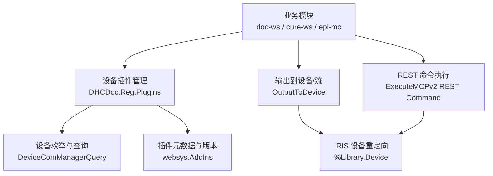
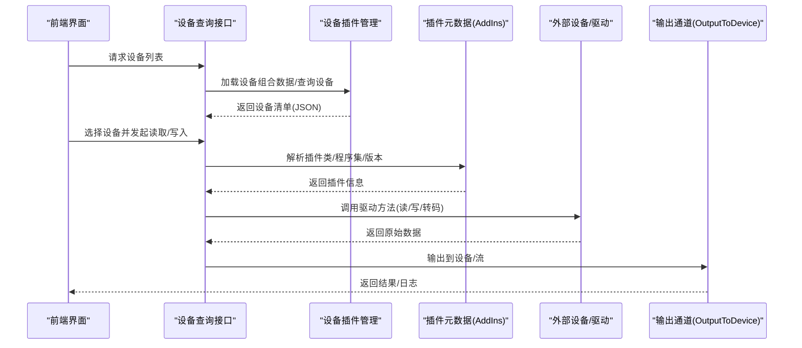
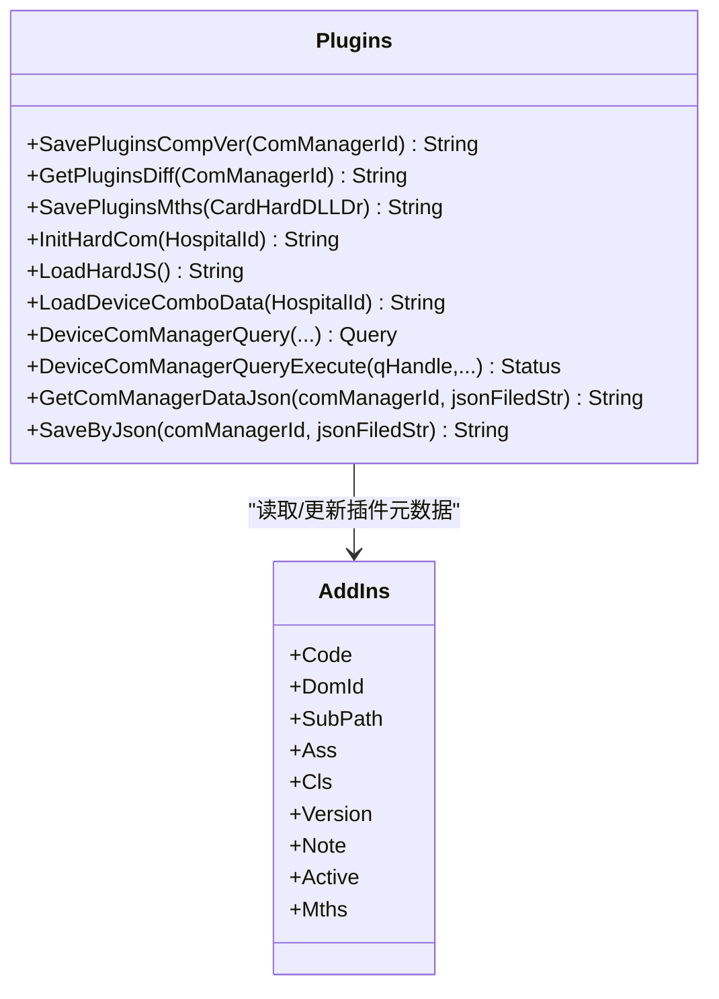
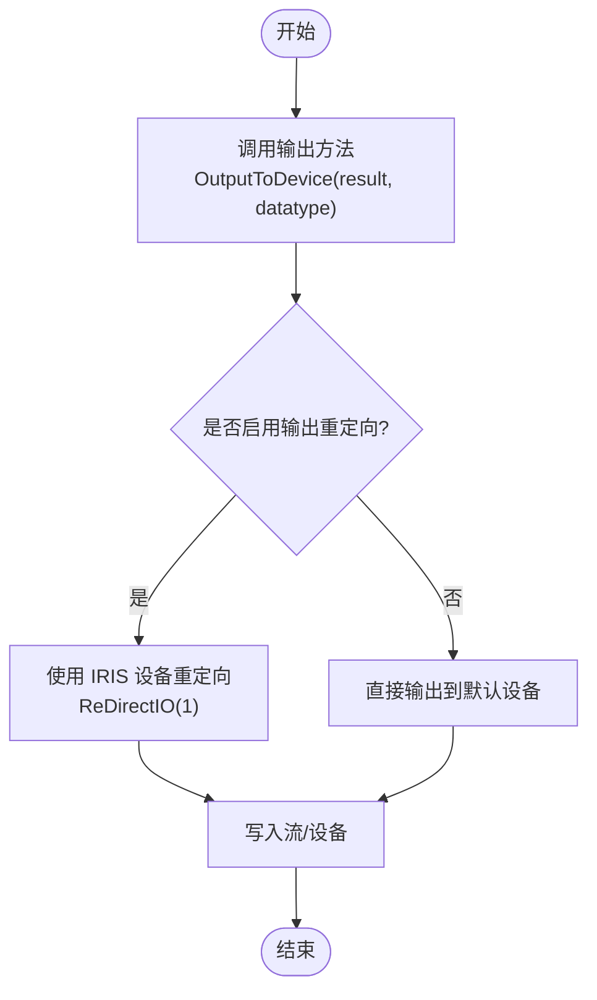
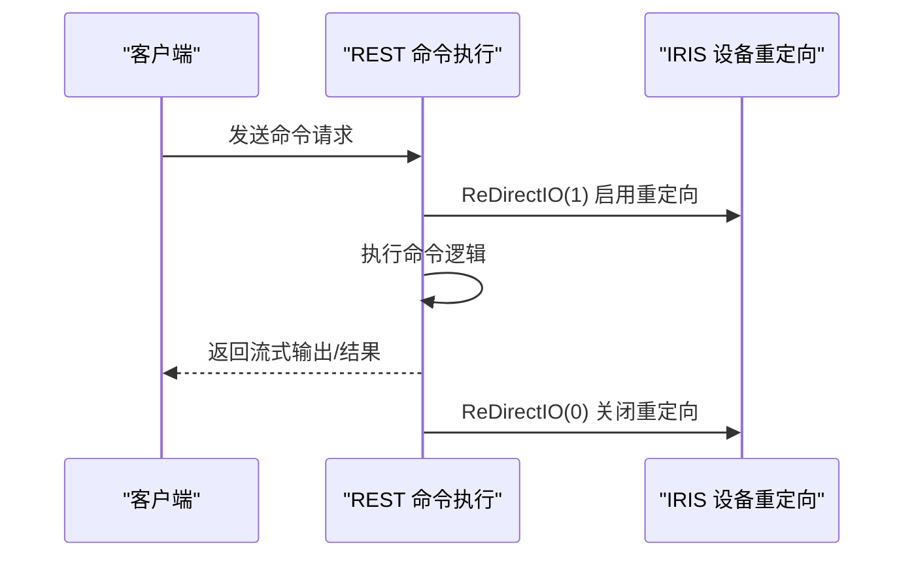
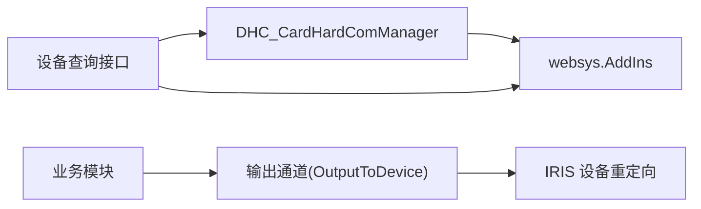

# 医疗设备集成接口

<cite>
**本文引用的文件**
- [README.md](file://README.md)
- [Plugins.cls](file://src/backend/epmi-mc/DHCDoc/Reg/Plugins.cls)
- [Class.cls](file://src/backend/public-mc/DHCDoc/Util/Class.cls)
- [Command.cls](file://src/backend/public-mc/ExecuteMCPv2/REST/Command.cls)
- [DHCDocInterfaceMethod.cls](file://src/backend/public-mc/web/DHCDocInterfaceMethod.cls)
- [Broker.cls](file://src/backend/doc-ws/DHCAnt/COM/Broker.cls)
</cite>

## 目录
1. [简介](#简介)
2. [项目结构](#项目结构)
3. [核心组件](#核心组件)
4. [架构总览](#架构总览)
5. [详细组件分析](#详细组件分析)
6. [依赖关系分析](#依赖关系分析)
7. [性能考虑](#性能考虑)
8. [故障排查指南](#故障排查指南)
9. [结论](#结论)
10. [附录](#附录)

## 简介
本文件面向医疗设备集成，聚焦设备发现、连接建立、数据传输与状态监控等能力，并给出设备驱动开发指南、数据解析规则、异常处理机制、接入配置示例、调试工具与故障排查方法，以及兼容性管理与版本升级策略。系统后端基于 InterSystems IRIS ObjectScript，前端采用传统 CSP + jQuery/HISUI；设备插件通过“插件管理”进行注册、版本管理与动态加载，设备枚举与查询通过统一的数据模型与查询接口暴露。

## 项目结构
- 后端代码位于 src/backend，按产品域划分（如 epmi-mc、doc-ws、public-mc 等），设备相关能力集中在 epmi-mc 的设备插件管理与 public-mc 的通用工具与 REST 命令执行。
- 前端代码位于 src/frontend，CSP 页面负责渲染设备选择、调用后端接口并展示结果。
- 脚本位于 scripts，提供 Git 与部署辅助能力，不直接参与设备通信。

图表来源
- [Plugins.cls:321-452](file://src/backend/epmi-mc/DHCDoc/Reg/Plugins.cls#L321-L452)
- [Class.cls:230-254](file://src/backend/public-mc/DHCDoc/Util/Class.cls#L230-L254)
- [Command.cls:15-80](file://src/backend/public-mc/ExecuteMCPv2/REST/Command.cls#L15-L80)

章节来源
- [README.md:1-549](file://README.md#L1-L549)

## 核心组件
- 设备插件管理（DHCDoc.Reg.Plugins）：负责设备驱动的注册、差异对比、方法集合同步、初始化、JS/CSS 资源注入、设备组合数据加载与设备列表查询。
- 设备输出通道（OutputToDevice）：将结构化结果输出到设备或流，配合 IRIS 设备重定向实现跨进程/跨环境的输出捕获。
- 通用工具（DHCDoc.Util.Class）：提供 IO 重定向封装、参数修改、缓存等方法，支撑设备调用的可观测性与稳定性。
- REST 命令执行（ExecuteMCPv2 REST Command）：以 REST 方式执行命令，内部使用设备重定向将输出写入流，便于统一采集日志与响应。

章节来源
- [Plugins.cls:1-571](file://src/backend/epmi-mc/DHCDoc/Reg/Plugins.cls#L1-L571)
- [Class.cls:230-375](file://src/backend/public-mc/DHCDoc/Util/Class.cls#L230-L375)
- [Command.cls:15-104](file://src/backend/public-mc/ExecuteMCPv2/REST/Command.cls#L15-L104)
- [DHCDocInterfaceMethod.cls:918-918](file://src/backend/public-mc/web/DHCDocInterfaceMethod.cls#L918-L918)
- [Broker.cls:37-37](file://src/backend/doc-ws/DHCAnt/COM/Broker.cls#L37-L37)

## 架构总览
设备集成的整体流程如下：
- 设备发现：通过设备组合数据加载与设备管理器查询接口，获取厂商、型号、版本、设备组等信息，形成设备清单。
- 连接建立：根据选择的设备驱动（插件），由插件元数据（类名、程序集、路径、版本）定位并加载对应 DLL/插件。
- 数据传输：调用插件暴露的方法（读/写/图片转换等），将数据经 OutputToDevice 输出到目标设备或流。
- 状态监控：通过插件版本、激活标志、自定义 JS 引入、备注字段等维护设备运行态与可观测性。

图表来源
- [Plugins.cls:321-452](file://src/backend/epmi-mc/DHCDoc/Reg/Plugins.cls#L321-L452)
- [Plugins.cls:454-568](file://src/backend/epmi-mc/DHCDoc/Reg/Plugins.cls#L454-L568)
- [DHCDocInterfaceMethod.cls:918-918](file://src/backend/public-mc/web/DHCDocInterfaceMethod.cls#L918-L918)
- [Broker.cls:37-37](file://src/backend/doc-ws/DHCAnt/COM/Broker.cls#L37-L37)

## 详细组件分析

### 设备插件管理（DHCDoc.Reg.Plugins）
- 功能要点
  - 保存插件元数据：将设备硬件参数映射为 AddIns 记录（Code、DomId、SubPath、Ass、Cls、Version、Note、Active）。
  - 差异对比：比较当前设备配置与已注册插件的差异（调用 ID、版本、描述、程序集、类名、路径、激活状态、函数列表）。
  - 方法集合同步：从设备函数列表更新插件方法集合，支持读/写/图片类型标记。
  - 初始化设备接口参数：预置常见读卡器（身份证、就诊卡）的默认配置与函数。
  - 加载前端资源：根据激活设备的自定义 JS/CSS 注入引用标签。
  - 设备组合数据加载：聚合厂商、型号、版本、设备组下拉选项。
  - 设备列表查询：按条件过滤设备，返回包含插件版本、激活标志、自定义 JS、运行前缀等字段。
  - 单设备数据读写：按 JSON 字段映射读取/保存设备配置，自动处理日期类型与插件版本覆盖。

图表来源
- [Plugins.cls:12-46](file://src/backend/epmi-mc/DHCDoc/Reg/Plugins.cls#L12-L46)
- [Plugins.cls:48-135](file://src/backend/epmi-mc/DHCDoc/Reg/Plugins.cls#L48-L135)
- [Plugins.cls:137-169](file://src/backend/epmi-mc/DHCDoc/Reg/Plugins.cls#L137-L169)
- [Plugins.cls:171-283](file://src/backend/epmi-mc/DHCDoc/Reg/Plugins.cls#L171-L283)
- [Plugins.cls:285-319](file://src/backend/epmi-mc/DHCDoc/Reg/Plugins.cls#L285-L319)
- [Plugins.cls:321-452](file://src/backend/epmi-mc/DHCDoc/Reg/Plugins.cls#L321-L452)
- [Plugins.cls:454-568](file://src/backend/epmi-mc/DHCDoc/Reg/Plugins.cls#L454-L568)

章节来源
- [Plugins.cls:1-571](file://src/backend/epmi-mc/DHCDoc/Reg/Plugins.cls#L1-L571)

### 设备输出通道（OutputToDevice）
- 作用：将结构化结果输出到设备或流，供前端或下游系统消费。
- 典型调用点：在业务模块中通过 Broker 或直接调用输出方法，将结果对象与数据类型传入。
- 与 IRIS 设备重定向的配合：结合 %Library.Device 的重定向能力，可将输出捕获到流中，便于统一日志与调试。

图表来源
- [Broker.cls:37-37](file://src/backend/doc-ws/DHCAnt/COM/Broker.cls#L37-L37)
- [Class.cls:230-254](file://src/backend/public-mc/DHCDoc/Util/Class.cls#L230-L254)
- [Command.cls:15-80](file://src/backend/public-mc/ExecuteMCPv2/REST/Command.cls#L15-L80)

章节来源
- [Broker.cls:37-37](file://src/backend/doc-ws/DHCAnt/COM/Broker.cls#L37-L37)
- [Class.cls:230-254](file://src/backend/public-mc/DHCDoc/Util/Class.cls#L230-L254)
- [Command.cls:15-80](file://src/backend/public-mc/ExecuteMCPv2/REST/Command.cls#L15-L80)

### REST 命令执行（ExecuteMCPv2 REST Command）
- 作用：以 REST 方式执行命令，内部使用设备重定向将输出写入流，便于统一采集日志与响应。
- 关键点：在命令执行前后切换设备重定向，确保输出可被捕获；错误时恢复 IO 环境。

图表来源
- [Command.cls:15-80](file://src/backend/public-mc/ExecuteMCPv2/REST/Command.cls#L15-L80)
- [Command.cls:58-104](file://src/backend/public-mc/ExecuteMCPv2/REST/Command.cls#L58-L104)

章节来源
- [Command.cls:15-104](file://src/backend/public-mc/ExecuteMCPv2/REST/Command.cls#L15-L104)

## 依赖关系分析
- 设备插件管理与数据库表：设备配置存储在 DHC_CardHardComManager 及其关联表中，插件元数据存储在 websys.AddIns。
- 设备查询接口：通过 Query 定义与 Execute 实现，按厂商、型号、版本、设备组过滤，返回设备清单。
- 输出通道与设备重定向：通过 %Library.Device 的重定向能力，将输出捕获到流，便于统一日志与调试。
- 业务模块与输出：业务模块通过 Broker 或直接调用输出方法，将结果对象与数据类型传入输出通道。

图表来源
- [Plugins.cls:385-452](file://src/backend/epmi-mc/DHCDoc/Reg/Plugins.cls#L385-L452)
- [Plugins.cls:454-568](file://src/backend/epmi-mc/DHCDoc/Reg/Plugins.cls#L454-L568)
- [Class.cls:230-254](file://src/backend/public-mc/DHCDoc/Util/Class.cls#L230-L254)
- [Broker.cls:37-37](file://src/backend/doc-ws/DHCAnt/COM/Broker.cls#L37-L37)

章节来源
- [Plugins.cls:385-452](file://src/backend/epmi-mc/DHCDoc/Reg/Plugins.cls#L385-L452)
- [Plugins.cls:454-568](file://src/backend/epmi-mc/DHCDoc/Reg/Plugins.cls#L454-L568)
- [Class.cls:230-254](file://src/backend/public-mc/DHCDoc/Util/Class.cls#L230-L254)
- [Broker.cls:37-37](file://src/backend/doc-ws/DHCAnt/COM/Broker.cls#L37-L37)

## 性能考虑
- 设备列表查询：使用 Query 与内存缓存（^CacheTemp）减少重复计算，建议对高频查询增加索引或缓存策略。
- 插件加载：避免频繁反射与文件 I/O，建议在启动阶段预加载常用插件元数据。
- 输出重定向：在高并发场景下，合理控制重定向粒度，避免阻塞主线程。
- 数据解析：对设备返回数据进行批量处理与校验，减少多次往返与解析开销。

## 故障排查指南
- 插件未生效
  - 检查设备组合数据是否正确加载（厂商、型号、版本、设备组）。
  - 核对插件元数据（类名、程序集、路径、版本）是否与设备一致。
  - 查看差异对比结果，确认是否存在字段不一致或未激活。
- 输出为空或乱码
  - 确认输出通道是否启用设备重定向，检查 IO 环境切换是否正确。
  - 验证输出格式与前端解析规则是否匹配。
- 设备连接失败
  - 检查设备驱动是否安装且路径正确。
  - 核对插件版本与设备固件版本是否兼容。
  - 查看错误日志与异常堆栈，定位具体失败点。

章节来源
- [Plugins.cls:48-135](file://src/backend/epmi-mc/DHCDoc/Reg/Plugins.cls#L48-L135)
- [Class.cls:230-254](file://src/backend/public-mc/DHCDoc/Util/Class.cls#L230-L254)
- [Command.cls:58-104](file://src/backend/public-mc/ExecuteMCPv2/REST/Command.cls#L58-L104)

## 结论
本项目通过设备插件管理机制实现了医疗设备的统一接入与扩展，具备设备发现、连接建立、数据传输与状态监控能力。借助 IRIS 设备重定向与 REST 命令执行，提供了稳定的输出与调试能力。建议在生产环境中加强插件版本管理与兼容性测试，完善异常处理与日志采集，提升设备集成的可靠性与可维护性。

## 附录

### 设备接入配置示例
- 设备组合数据加载：通过 LoadDeviceComboData 获取厂商、型号、版本、设备组下拉选项。
- 设备列表查询：通过 DeviceComManagerQuery 按条件过滤设备，返回设备清单。
- 插件元数据保存：通过 SavePluginsCompVer 保存设备驱动元数据，确保插件可被正确加载。
- 方法集合同步：通过 SavePluginsMths 同步设备函数列表，支持读/写/图片类型标记。

章节来源
- [Plugins.cls:321-452](file://src/backend/epmi-mc/DHCDoc/Reg/Plugins.cls#L321-L452)
- [Plugins.cls:137-169](file://src/backend/epmi-mc/DHCDoc/Reg/Plugins.cls#L137-L169)
- [Plugins.cls:12-46](file://src/backend/epmi-mc/DHCDoc/Reg/Plugins.cls#L12-L46)

### 数据解析规则
- 设备返回数据：根据插件方法返回的结构化数据进行解析，注意日期类型与编码格式。
- 输出格式：通过 OutputToDevice 输出 JSON 或文本，前端需按约定格式解析。
- 字段映射：通过 JSON 字段映射读取/保存设备配置，确保字段名称与类型一致。

章节来源
- [Plugins.cls:454-568](file://src/backend/epmi-mc/DHCDoc/Reg/Plugins.cls#L454-L568)
- [Class.cls:230-254](file://src/backend/public-mc/DHCDoc/Util/Class.cls#L230-L254)

### 异常处理机制
- 插件差异对比：返回差异信息，便于快速定位问题。
- 输出重定向：在异常时恢复 IO 环境，避免影响后续操作。
- 错误日志：通过 REST 命令执行与设备重定向捕获错误日志，便于排查。

章节来源
- [Plugins.cls:48-135](file://src/backend/epmi-mc/DHCDoc/Reg/Plugins.cls#L48-L135)
- [Class.cls:230-254](file://src/backend/public-mc/DHCDoc/Util/Class.cls#L230-L254)
- [Command.cls:58-104](file://src/backend/public-mc/ExecuteMCPv2/REST/Command.cls#L58-L104)

### 调试工具与故障排查方法
- 设备列表查询：使用 DeviceComManagerQuery 获取设备清单，核对设备状态。
- 插件元数据检查：使用 GetComManagerDataJson 获取单个设备数据，核对插件版本与激活状态。
- 输出捕获：通过 REST 命令执行与设备重定向捕获输出，便于调试。

章节来源
- [Plugins.cls:385-452](file://src/backend/epmi-mc/DHCDoc/Reg/Plugins.cls#L385-L452)
- [Plugins.cls:454-568](file://src/backend/epmi-mc/DHCDoc/Reg/Plugins.cls#L454-L568)
- [Command.cls:15-80](file://src/backend/public-mc/ExecuteMCPv2/REST/Command.cls#L15-L80)

### 兼容性管理与版本升级策略
- 兼容性管理：通过设备组合数据与插件元数据管理设备兼容性，确保厂商、型号、版本匹配。
- 版本升级：通过 SavePluginsCompVer 更新插件版本，确保插件与设备固件版本一致。
- 回滚策略：在升级失败时，回滚到上一版本，确保系统稳定性。

章节来源
- [Plugins.cls:12-46](file://src/backend/epmi-mc/DHCDoc/Reg/Plugins.cls#L12-L46)
- [Plugins.cls:454-568](file://src/backend/epmi-mc/DHCDoc/Reg/Plugins.cls#L454-L568)