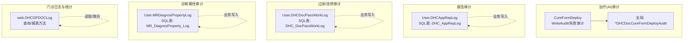
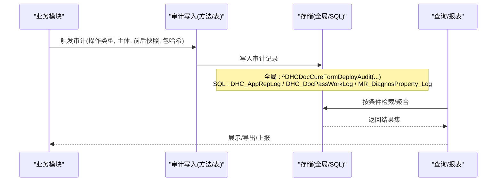
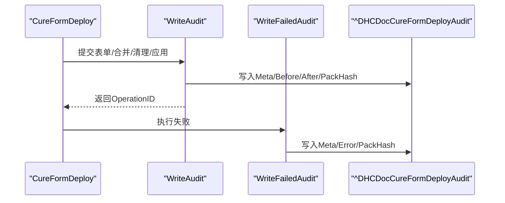
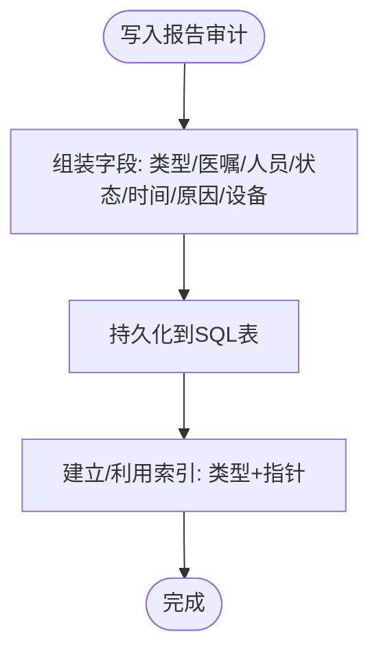
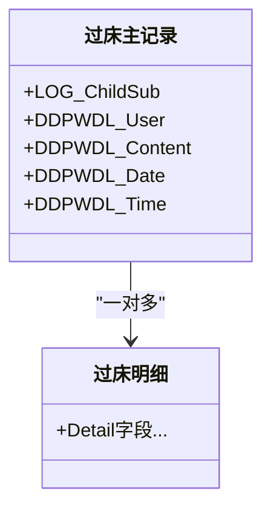
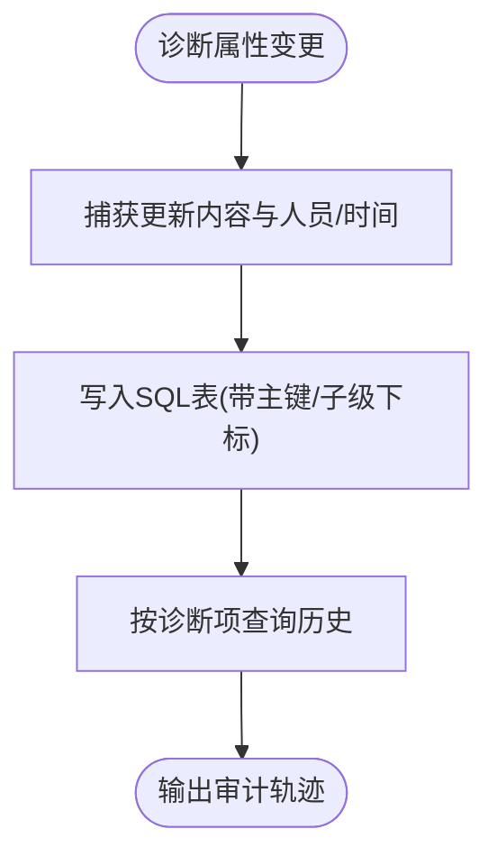
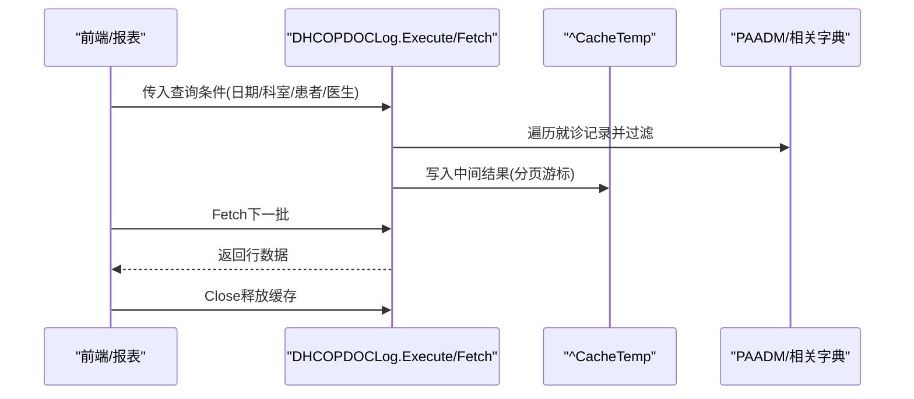
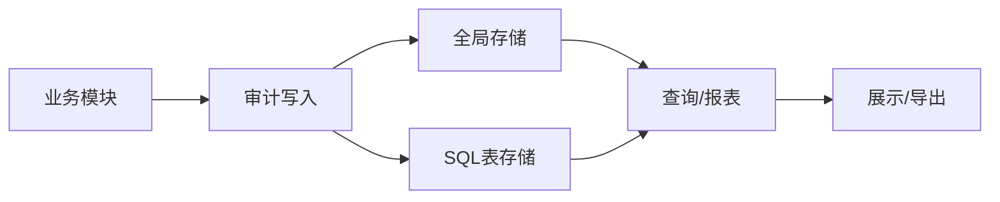

# 审计日志记录

<cite>
**本文引用的文件**
- [CureFormDeploy.cls](file://src/backend/cure-ws/DHCDoc/Cure/AI/CureFormDeploy.cls)
- [DHCAppRepLog.cls](file://src/backend/doc-ws/User/DHCAppRepLog.cls)
- [DHCDocPassWorkLog.cls](file://src/backend/doc-ws/User/DHCDocPassWorkLog.cls)
- [MRDiagnosPropertyLog.cls](file://src/backend/doc-ws/User/MRDiagnosPropertyLog.cls)
- [DHCOPDOCLog.cls](file://src/backend/opadm-mc/web/DHCOPDOCLog.cls)
</cite>

## 目录
1. [简介](#简介)
2. [项目结构](#项目结构)
3. [核心组件](#核心组件)
4. [架构总览](#架构总览)
5. [详细组件分析](#详细组件分析)
6. [依赖关系分析](#依赖关系分析)
7. [性能考虑](#性能考虑)
8. [故障排查指南](#故障排查指南)
9. [结论](#结论)
10. [附录](#附录)

## 简介
本文件面向IRIS HIS系统的审计日志机制，覆盖用户操作审计、系统事件审计与安全事件审计的采集、存储、查询与分析。文档基于仓库中实际代码实现，说明日志格式规范、存储策略、查询分析方法，并给出防篡改、归档与合规报告建议，以及监控告警与异常行为检测方案。

## 项目结构
审计日志在系统中以“业务域 + 持久化类/全局”的方式分布：
- 表单部署与变更审计（系统事件）：位于治疗工作流模块，使用全局对象记录操作元数据、前后快照与包哈希。
- 检查/病理报告审计（用户操作）：以SQL表持久化，记录申请类型、医嘱关联、操作员、状态、时间等。
- 医生过床/流转审计（用户操作）：主从结构记录修改人、内容、时间。
- 诊断属性变更审计（用户操作）：记录属性更新内容、人员、时间。
- 门诊日志与统计（系统/运营审计）：提供按日期、科室、患者等多维度的查询与汇总能力。

图表来源
- [CureFormDeploy.cls:1923-1946](file://src/backend/cure-ws/DHCDoc/Cure/AI/CureFormDeploy.cls#L1923-L1946)
- [DHCAppRepLog.cls:1-123](file://src/backend/doc-ws/User/DHCAppRepLog.cls#L1-L123)
- [DHCDocPassWorkLog.cls:1-67](file://src/backend/doc-ws/User/DHCDocPassWorkLog.cls#L1-L67)
- [MRDiagnosPropertyLog.cls:1-65](file://src/backend/doc-ws/User/MRDiagnosPropertyLog.cls#L1-L65)
- [DHCOPDOCLog.cls:13-120](file://src/backend/opadm-mc/web/DHCOPDOCLog.cls#L13-L120)

章节来源
- [CureFormDeploy.cls:1923-1946](file://src/backend/cure-ws/DHCDoc/Cure/AI/CureFormDeploy.cls#L1923-L1946)
- [DHCAppRepLog.cls:1-123](file://src/backend/doc-ws/User/DHCAppRepLog.cls#L1-L123)
- [DHCDocPassWorkLog.cls:1-67](file://src/backend/doc-ws/User/DHCDocPassWorkLog.cls#L1-L67)
- [MRDiagnosPropertyLog.cls:1-65](file://src/backend/doc-ws/User/MRDiagnosPropertyLog.cls#L1-L65)
- [DHCOPDOCLog.cls:13-120](file://src/backend/opadm-mc/web/DHCOPDOCLog.cls#L13-L120)

## 核心组件
- 表单部署审计（系统事件）
  - 通过统一方法写入操作元数据、前后JSON快照、包哈希与状态，支持成功与失败两类审计。
  - 使用全局对象作为审计存储，便于跨事务追踪与一致性校验。
- 检查/病理报告审计（用户操作）
  - SQL表持久化，包含申请类型、医嘱ID、操作员、状态、时间、设备等信息，并提供索引优化查询。
- 医生过床/流转审计（用户操作）
  - 主从结构，记录明细修改内容、人员、时间，便于追溯流程变更。
- 诊断属性审计（用户操作）
  - 记录诊断属性的更新内容与责任人、时间，支持按主键定位历史。
- 门诊日志与统计（系统/运营审计）
  - 提供多条件查询与汇总报表，用于日常运营与合规统计。

章节来源
- [CureFormDeploy.cls:1923-1946](file://src/backend/cure-ws/DHCDoc/Cure/AI/CureFormDeploy.cls#L1923-L1946)
- [DHCAppRepLog.cls:1-123](file://src/backend/doc-ws/User/DHCAppRepLog.cls#L1-L123)
- [DHCDocPassWorkLog.cls:1-67](file://src/backend/doc-ws/User/DHCDocPassWorkLog.cls#L1-L67)
- [MRDiagnosPropertyLog.cls:1-65](file://src/backend/doc-ws/User/MRDiagnosPropertyLog.cls#L1-L65)
- [DHCOPDOCLog.cls:13-120](file://src/backend/opadm-mc/web/DHCOPDOCLog.cls#L13-L120)

## 架构总览
审计日志采用“业务触发 + 集中存储 + 可查询”的分层设计：
- 采集层：各业务模块在关键操作点调用审计写入方法或插入审计表。
- 存储层：混合使用全局对象（高吞吐、易扩展）与SQL表（结构化、易检索）。
- 查询层：提供专用查询方法与报表接口，支持多维度筛选与汇总。

图表来源
- [CureFormDeploy.cls:1923-1946](file://src/backend/cure-ws/DHCDoc/Cure/AI/CureFormDeploy.cls#L1923-L1946)
- [DHCAppRepLog.cls:1-123](file://src/backend/doc-ws/User/DHCAppRepLog.cls#L1-L123)
- [DHCDocPassWorkLog.cls:1-67](file://src/backend/doc-ws/User/DHCDocPassWorkLog.cls#L1-L67)
- [MRDiagnosPropertyLog.cls:1-65](file://src/backend/doc-ws/User/MRDiagnosPropertyLog.cls#L1-L65)
- [DHCOPDOCLog.cls:13-120](file://src/backend/opadm-mc/web/DHCOPDOCLog.cls#L13-L120)

## 详细组件分析

### 表单部署审计（系统事件）
- 功能要点
  - 统一写入审计元数据：操作类型、表单类型、映射码、操作人、原因、前后内容哈希、创建时间、包哈希、状态、关联操作ID。
  - 支持成功与失败两类审计，失败时记录错误信息。
  - 使用全局对象存储，便于快速追加与批量查询。
- 数据结构与复杂度
  - 每次写入为O(1)增量；查询按OperationID或时间范围扫描，复杂度取决于过滤条件与索引策略。
- 防篡改特性
  - 对包与内容计算哈希，便于后续比对验证完整性。
- 典型调用链

图表来源
- [CureFormDeploy.cls:1923-1946](file://src/backend/cure-ws/DHCDoc/Cure/AI/CureFormDeploy.cls#L1923-L1946)

章节来源
- [CureFormDeploy.cls:1923-1946](file://src/backend/cure-ws/DHCDoc/Cure/AI/CureFormDeploy.cls#L1923-L1946)

### 检查/病理报告审计（用户操作）
- 功能要点
  - 记录申请类型（检查/病理）、医嘱ID、操作员、报告状态、操作时间与原因、设备等。
  - 提供索引以加速按类型与指针的查询。
- 存储与索引
  - SQL表持久化，定义DataMaster映射与IndexTypePointer索引，提升按类型与业务指针的检索效率。
- 查询方法
  - 可通过SQL直接查询表，或使用系统提供的查询接口进行分页与过滤。

图表来源
- [DHCAppRepLog.cls:1-123](file://src/backend/doc-ws/User/DHCAppRepLog.cls#L1-L123)

章节来源
- [DHCAppRepLog.cls:1-123](file://src/backend/doc-ws/User/DHCAppRepLog.cls#L1-L123)

### 医生过床/流转审计（用户操作）
- 功能要点
  - 主从结构：主记录关联明细，明细记录修改内容、人员、时间。
  - 适合追踪流程节点变更与责任到人。
- 存储结构
  - 使用SQL表与子级下标组织明细，便于按主记录快速拉取完整变更链。

图表来源
- [DHCDocPassWorkLog.cls:1-67](file://src/backend/doc-ws/User/DHCDocPassWorkLog.cls#L1-L67)

章节来源
- [DHCDocPassWorkLog.cls:1-67](file://src/backend/doc-ws/User/DHCDocPassWorkLog.cls#L1-L67)

### 诊断属性审计（用户操作）
- 功能要点
  - 记录诊断属性的更新内容、更新人员、更新时间。
  - 通过主键与子级下标组织，便于按诊断项回溯历史。
- 存储结构
  - SQL表映射到全局，使用子级下标维护顺序与定位。

图表来源
- [MRDiagnosPropertyLog.cls:1-65](file://src/backend/doc-ws/User/MRDiagnosPropertyLog.cls#L1-L65)

章节来源
- [MRDiagnosPropertyLog.cls:1-65](file://src/backend/doc-ws/User/MRDiagnosPropertyLog.cls#L1-L65)

### 门诊日志与统计（系统/运营审计）
- 功能要点
  - 提供按日期、科室、患者、医生等多维度查询与汇总报表。
  - 内部使用缓存临时结构进行批处理与分页，降低数据库压力。
- 查询流程

图表来源
- [DHCOPDOCLog.cls:13-120](file://src/backend/opadm-mc/web/DHCOPDOCLog.cls#L13-L120)
- [DHCOPDOCLog.cls:129-369](file://src/backend/opadm-mc/web/DHCOPDOCLog.cls#L129-L369)
- [DHCOPDOCLog.cls:436-514](file://src/backend/opadm-mc/web/DHCOPDOCLog.cls#L436-L514)

章节来源
- [DHCOPDOCLog.cls:13-120](file://src/backend/opadm-mc/web/DHCOPDOCLog.cls#L13-L120)
- [DHCOPDOCLog.cls:129-369](file://src/backend/opadm-mc/web/DHCOPDOCLog.cls#L129-L369)
- [DHCOPDOCLog.cls:436-514](file://src/backend/opadm-mc/web/DHCOPDOCLog.cls#L436-L514)

## 依赖关系分析
- 耦合性
  - 审计写入与业务逻辑解耦：通过独立方法/表封装，降低侵入性。
  - 存储层混合使用全局与SQL，兼顾性能与可查询性。
- 外部依赖
  - 加密与哈希：包与内容哈希依赖加密工具，确保完整性校验。
  - 字典与翻译：查询结果中的描述字段通过翻译服务获取，保证多语言一致。
- 潜在循环依赖
  - 审计模块不反向依赖具体业务模块，仅被调用，避免循环。

图表来源
- [CureFormDeploy.cls:1923-1946](file://src/backend/cure-ws/DHCDoc/Cure/AI/CureFormDeploy.cls#L1923-L1946)
- [DHCAppRepLog.cls:1-123](file://src/backend/doc-ws/User/DHCAppRepLog.cls#L1-L123)
- [DHCDocPassWorkLog.cls:1-67](file://src/backend/doc-ws/User/DHCDocPassWorkLog.cls#L1-L67)
- [MRDiagnosPropertyLog.cls:1-65](file://src/backend/doc-ws/User/MRDiagnosPropertyLog.cls#L1-L65)
- [DHCOPDOCLog.cls:13-120](file://src/backend/opadm-mc/web/DHCOPDOCLog.cls#L13-L120)

章节来源
- [CureFormDeploy.cls:1923-1946](file://src/backend/cure-ws/DHCDoc/Cure/AI/CureFormDeploy.cls#L1923-L1946)
- [DHCAppRepLog.cls:1-123](file://src/backend/doc-ws/User/DHCAppRepLog.cls#L1-L123)
- [DHCDocPassWorkLog.cls:1-67](file://src/backend/doc-ws/User/DHCDocPassWorkLog.cls#L1-L67)
- [MRDiagnosPropertyLog.cls:1-65](file://src/backend/doc-ws/User/MRDiagnosPropertyLog.cls#L1-L65)
- [DHCOPDOCLog.cls:13-120](file://src/backend/opadm-mc/web/DHCOPDOCLog.cls#L13-L120)

## 性能考虑
- 写入路径
  - 全局存储适合高频写入与追加，减少锁竞争；SQL表适合结构化查询与索引优化。
- 查询路径
  - 使用索引字段（如类型、指针、主键）进行过滤；分页查询避免一次性加载大量数据。
- 缓存与批处理
  - 门诊日志查询使用临时缓存结构进行批处理，降低数据库往返次数。
- 建议
  - 对热点查询建立合适索引；对大结果集采用分页与流式读取；对审计数据定期归档至冷存储。

[本节为通用指导，无需特定文件引用]

## 故障排查指南
- 审计缺失
  - 检查业务入口是否调用审计写入方法；确认全局/表写入是否成功；核对事务边界与回滚逻辑。
- 数据不一致
  - 对比包哈希与内容哈希，定位是否发生篡改或版本不一致；检查翻译与字典映射是否正确。
- 查询缓慢
  - 检查索引是否命中；评估过滤条件是否合理；考虑拆分查询或引入物化视图/汇总表。
- 内存与磁盘
  - 关注临时缓存大小与生命周期；设置合理的过期与清理策略；监控全局与SQL表增长趋势。

章节来源
- [CureFormDeploy.cls:1923-1946](file://src/backend/cure-ws/DHCDoc/Cure/AI/CureFormDeploy.cls#L1923-L1946)
- [DHCOPDOCLog.cls:13-120](file://src/backend/opadm-mc/web/DHCOPDOCLog.cls#L13-L120)

## 结论
IRIS HIS系统的审计日志机制通过“业务触发 + 混合存储 + 可查询”的设计，覆盖了用户操作、系统事件与安全相关的审计需求。结合哈希校验、索引优化与分页查询，系统在完整性、性能与可维护性之间取得平衡。建议在此基础上完善归档、合规报告与监控告警体系，进一步提升安全与治理能力。

[本节为总结性内容，无需特定文件引用]

## 附录

### 日志格式规范（摘要）
- 表单部署审计（全局）
  - 元数据：操作类型、表单类型、映射码、操作人、原因、前后内容哈希、创建时间、包哈希、状态、关联操作ID。
  - 内容：Before/After JSON快照、Created JSON、PackageHash。
- 报告审计（SQL表）
  - 字段：申请类型、医嘱ID、操作员、报告状态、操作日期/时间、原因、设备、指针等。
- 过床/流转审计（SQL表）
  - 字段：修改人、修改内容、修改日期/时间，主从关系明确。
- 诊断属性审计（SQL表）
  - 字段：更新内容、更新人员、更新时间，按主键与子级下标组织。
- 门诊日志（查询/报表）
  - 字段：患者信息、医生、诊断、初复诊标志、传染病标志、本地/外埠、时间、科室等，支持多维筛选与汇总。

章节来源
- [CureFormDeploy.cls:1923-1946](file://src/backend/cure-ws/DHCDoc/Cure/AI/CureFormDeploy.cls#L1923-L1946)
- [DHCAppRepLog.cls:1-123](file://src/backend/doc-ws/User/DHCAppRepLog.cls#L1-L123)
- [DHCDocPassWorkLog.cls:1-67](file://src/backend/doc-ws/User/DHCDocPassWorkLog.cls#L1-L67)
- [MRDiagnosPropertyLog.cls:1-65](file://src/backend/doc-ws/User/MRDiagnosPropertyLog.cls#L1-L65)
- [DHCOPDOCLog.cls:13-120](file://src/backend/opadm-mc/web/DHCOPDOCLog.cls#L13-L120)

### 存储策略
- 全局存储：适用于高频写入与追加，便于跨事务追踪；需配合哈希校验与定期归档。
- SQL存储：适用于结构化查询与索引优化；建议对常用过滤字段建立索引，并对大表实施分区与归档。
- 缓存与临时表：查询过程中使用临时缓存提高吞吐，注意生命周期管理与资源释放。

章节来源
- [CureFormDeploy.cls:1923-1946](file://src/backend/cure-ws/DHCDoc/Cure/AI/CureFormDeploy.cls#L1923-L1946)
- [DHCAppRepLog.cls:1-123](file://src/backend/doc-ws/User/DHCAppRepLog.cls#L1-L123)
- [DHCOPDOCLog.cls:13-120](file://src/backend/opadm-mc/web/DHCOPDOCLog.cls#L13-L120)

### 查询分析方法
- 按时间范围：结合日期/时间字段进行区间过滤。
- 按业务指针：利用索引字段（如类型+指针）快速定位。
- 按人员/科室/患者：组合多条件过滤，必要时引入视图或汇总表。
- 分页与流式：避免一次性加载全部结果，提升用户体验与系统稳定性。

章节来源
- [DHCAppRepLog.cls:1-123](file://src/backend/doc-ws/User/DHCAppRepLog.cls#L1-L123)
- [DHCOPDOCLog.cls:129-369](file://src/backend/opadm-mc/web/DHCOPDOCLog.cls#L129-L369)

### 防篡改、归档与合规报告
- 防篡改
  - 使用哈希校验包与内容，定期比对完整性；对关键审计记录启用只写与访问控制。
- 归档
  - 对历史审计数据按时间分片归档至冷存储；保留原始哈希与元数据以便溯源。
- 合规报告
  - 基于门诊日志与审计表生成合规报表，包括操作频次、异常事件、上报情况等。

章节来源
- [CureFormDeploy.cls:1923-1946](file://src/backend/cure-ws/DHCDoc/Cure/AI/CureFormDeploy.cls#L1923-L1946)
- [DHCOPDOCLog.cls:436-514](file://src/backend/opadm-mc/web/DHCOPDOCLog.cls#L436-L514)

### 监控告警与异常行为检测
- 监控指标
  - 审计写入成功率、延迟、失败率；查询响应时间与命中率；存储容量增长趋势。
- 告警规则
  - 审计写入失败阈值、连续失败次数；查询超时与慢查询；存储容量接近上限。
- 异常检测
  - 基于时间序列与规则引擎识别异常操作模式（如非工作时间批量修改、频繁撤销/回滚等）。

[本节为通用指导，无需特定文件引用]