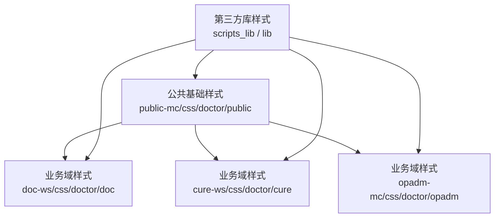
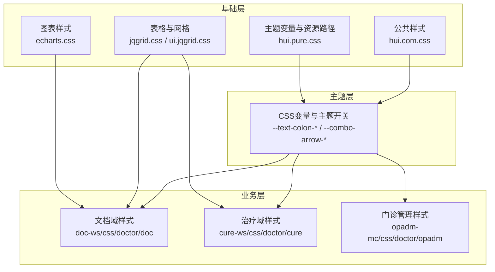
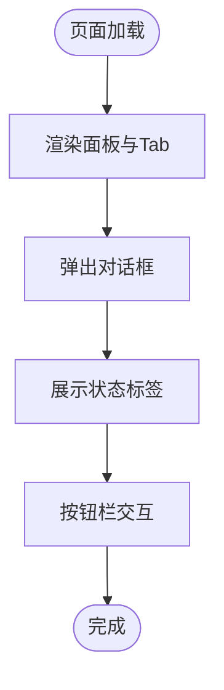
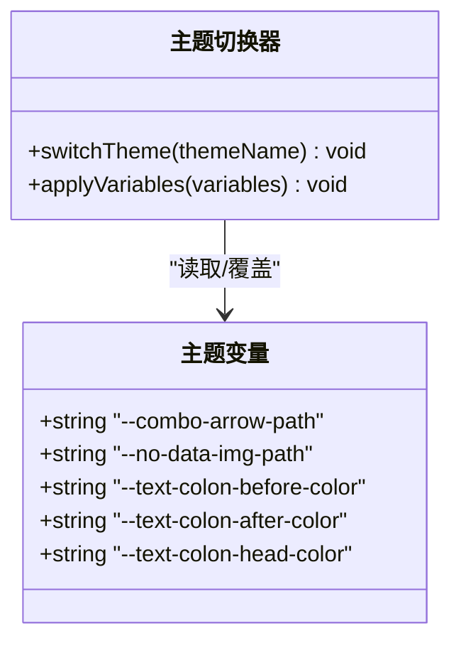
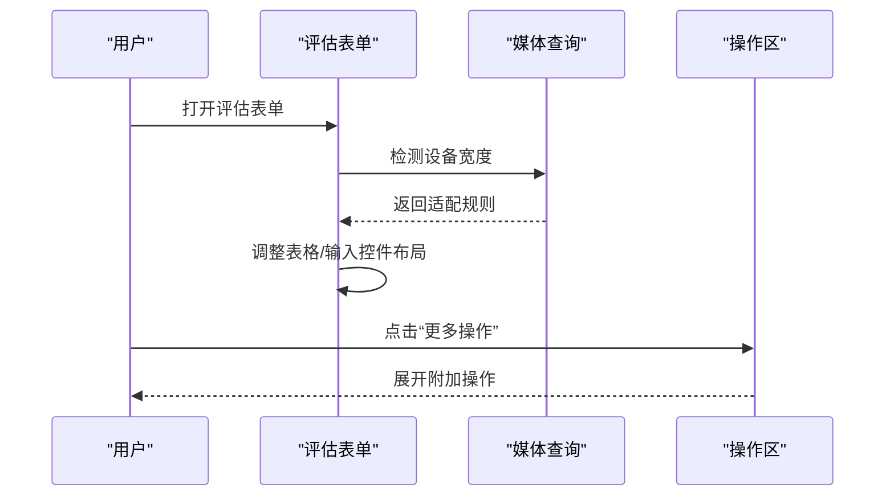
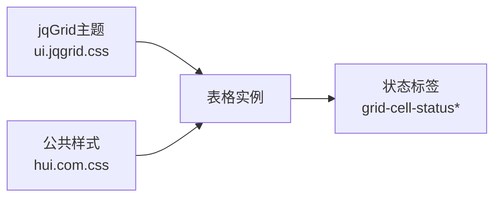
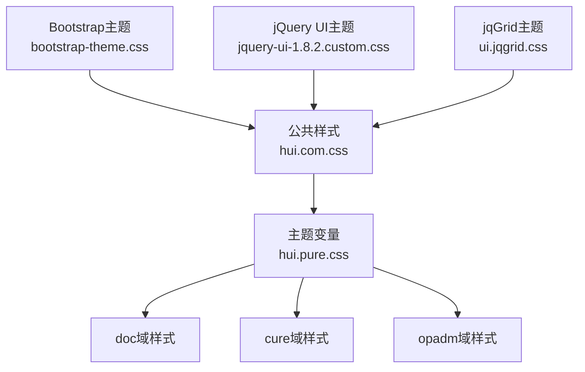

# 样式与主题

<cite>
**本文引用的文件**
- [adaptation.css](file://src/frontend/cure-ws/scripts/dhcdoc/dhcdoccure_hui/css/adaptation.css)
- [hui.com.css](file://src/frontend/public-mc/css/doctor/public/hui.com.css)
- [custom.setting.css](file://src/frontend/public-mc/css/doctor/public/custom.setting.css)
- [hui.pure.css](file://src/frontend/public-mc/css/doctor/public/hui.pure.css)
- [work.portal.css](file://src/frontend/public-mc/css/doctor/public/work.portal.css)
- [jqgrid.css](file://src/frontend/public-mc/css/doctor/public/jqgrid.css)
- [echarts.css](file://src/frontend/public-mc/css/doctor/public/echarts.css)
- [patinfo.banner.css](file://src/frontend/public-mc/css/doctor/public/patinfo.banner.css)
- [timeSlotSelector.css](file://src/frontend/public-mc/css/doctor/public/timeSlotSelector.css)
- [simplydatagrid.css](file://src/frontend/public-mc/css/doctor/public/simplydatagrid.css)
- [developUtil.textdicdata.css](file://src/frontend/public-mc/css/doctor/public/developUtil.textdicdata.css)
- [hui.vben.css](file://src/frontend/public-mc/css/doctor/public/hui.vben.css)
- [bootstrap-theme.css](file://src/frontend/doc-ws/scripts/dhcdocant/lib/bootstrap-3.3.4/css/bootstrap-theme.css)
- [ui.jqgrid.css](file://src/frontend/public-mc/scripts_lib/jquery.jqGrid-4.6.0/css/themes/ui.jqgrid.css)
- [jquery-ui-1.8.2.custom.css](file://src/frontend/public-mc/scripts_lib/jquery.jqGrid-4.6.0/css/themes/redmond/jquery-ui-1.8.2.custom.css)
</cite>

## 目录
1. [简介](#简介)
2. [项目结构](#项目结构)
3. [核心组件](#核心组件)
4. [架构总览](#架构总览)
5. [详细组件分析](#详细组件分析)
6. [依赖关系分析](#依赖关系分析)
7. [性能考虑](#性能考虑)
8. [故障排查指南](#故障排查指南)
9. [结论](#结论)
10. [附录](#附录)

## 简介
本文件面向医疗信息系统前端样式与主题体系，系统性说明CSS架构设计、样式组织规范、主题管理机制与响应式策略。重点覆盖：
- CSS模块化方式、命名约定与样式继承关系
- 主题切换实现、颜色变量管理、字体配置
- 响应式设计、移动端适配方案与打印样式处理
- 样式性能优化技巧、压缩与合并策略
- 跨浏览器兼容性、动画与过渡效果
- 样式调试工具与开发工作流

## 项目结构
前端样式按“公共基础样式 + 业务域样式”分层组织：
- 公共基础样式位于 public-mc/css/doctor/public，提供通用布局、面板、按钮、表格、图表等基础能力
- 业务域样式位于各子系统 css/doctor/<domain> 下（如 doc、cure、opadm 等），在公共样式之上进行领域定制
- 第三方库样式位于 scripts_lib 或 lib 目录（如 jqGrid、Bootstrap、jQuery UI）

**图示来源**
- [hui.com.css:1-200](file://src/frontend/public-mc/css/doctor/public/hui.com.css#L1-L200)
- [custom.setting.css:1-158](file://src/frontend/public-mc/css/doctor/public/custom.setting.css#L1-L158)
- [jqgrid.css](file://src/frontend/public-mc/css/doctor/public/jqgrid.css)
- [bootstrap-theme.css:1-50](file://src/frontend/doc-ws/scripts/dhcdocant/lib/bootstrap-3.3.4/css/bootstrap-theme.css#L1-L50)

**章节来源**
- [hui.com.css:1-200](file://src/frontend/public-mc/css/doctor/public/hui.com.css#L1-L200)
- [custom.setting.css:1-158](file://src/frontend/public-mc/css/doctor/public/custom.setting.css#L1-L158)
- [jqgrid.css](file://src/frontend/public-mc/css/doctor/public/jqgrid.css)
- [bootstrap-theme.css:1-50](file://src/frontend/doc-ws/scripts/dhcdocant/lib/bootstrap-3.3.4/css/bootstrap-theme.css#L1-L50)

## 核心组件
- 公共样式基座：统一面板、对话框、状态标签、按钮栏等通用UI
- 主题变量与资源路径：通过CSS变量集中管理图标路径、文本颜色等
- 响应式表单与操作区：针对治疗评估场景的移动端适配与触控优化
- 第三方集成：jqGrid、ECharts、Bootstrap、jQuery UI 等样式整合

**章节来源**
- [hui.com.css:1-200](file://src/frontend/public-mc/css/doctor/public/hui.com.css#L1-L200)
- [hui.pure.css:1-13](file://src/frontend/public-mc/css/doctor/public/hui.pure.css#L1-L13)
- [adaptation.css:1-670](file://src/frontend/cure-ws/scripts/dhcdoc/dhcdoccure_hui/css/adaptation.css#L1-L670)
- [jqgrid.css](file://src/frontend/public-mc/css/doctor/public/jqgrid.css)
- [echarts.css](file://src/frontend/public-mc/css/doctor/public/echarts.css)

## 架构总览
样式架构遵循“基础层 → 主题层 → 业务层”的分层模式：
- 基础层：提供通用布局、控件、状态、交互样式
- 主题层：通过CSS变量与资源路径定义主题外观，支持多主题扩展
- 业务层：在各业务域中复用基础与主题，叠加领域特定样式

**图示来源**
- [hui.com.css:1-200](file://src/frontend/public-mc/css/doctor/public/hui.com.css#L1-L200)
- [hui.pure.css:1-13](file://src/frontend/public-mc/css/doctor/public/hui.pure.css#L1-L13)
- [jqgrid.css](file://src/frontend/public-mc/css/doctor/public/jqgrid.css)
- [ui.jqgrid.css](file://src/frontend/public-mc/scripts_lib/jquery.jqGrid-4.6.0/css/themes/ui.jqgrid.css)
- [echarts.css](file://src/frontend/public-mc/css/doctor/public/echarts.css)

## 详细组件分析

### 公共样式基座（面板、对话框、状态标签、按钮栏）
- 面板与Tab融合：去除圆角、设置相对定位，使顶部/底部搜索面板与面板头无缝衔接
- 对话框：统一内边距、背景与阴影控制，按钮最小宽度一致
- 状态标签：提供边框与背景两种模式，支持红绿黄灰等语义色
- 按钮栏：居中布局、大按钮样式、悬停反馈

**图示来源**
- [hui.com.css:1-200](file://src/frontend/public-mc/css/doctor/public/hui.com.css#L1-L200)

**章节来源**
- [hui.com.css:1-200](file://src/frontend/public-mc/css/doctor/public/hui.com.css#L1-L200)

### 主题变量与资源路径管理
- 通过CSS变量集中管理下拉箭头、无数据图片等静态资源路径
- 提供冒号前/后及标题文本颜色变量，便于主题化调整
- 可在不同主题文件中覆盖变量值，实现主题切换

**图示来源**
- [hui.pure.css:1-13](file://src/frontend/public-mc/css/doctor/public/hui.pure.css#L1-L13)

**章节来源**
- [hui.pure.css:1-13](file://src/frontend/public-mc/css/doctor/public/hui.pure.css#L1-L13)

### 响应式表单与移动端适配（治疗评估场景）
- 表单容器强制盒模型与宽度自适应，避免溢出
- 移动端将双字段行拆为单列，保证可读性与触控体验
- 统一输入控件高度，提升触控区域一致性
- 操作区在移动端折叠为“更多操作 + 主操作”，展开显示模板保存/应用入口
- 使用媒体查询与特性检测（如 :has()）渐进增强兼容旧WebView

**图示来源**
- [adaptation.css:1-670](file://src/frontend/cure-ws/scripts/dhcdoc/dhcdoccure_hui/css/adaptation.css#L1-L670)

**章节来源**
- [adaptation.css:1-670](file://src/frontend/cure-ws/scripts/dhcdoc/dhcdoccure_hui/css/adaptation.css#L1-L670)

### 表格与网格系统（jqGrid集成）
- 引入jqGrid主题与自定义样式，统一表格外观与交互
- 结合公共样式中的状态标签，增强数据可视化
- 支持分页、排序、筛选等常见表格功能

**图示来源**
- [ui.jqgrid.css](file://src/frontend/public-mc/scripts_lib/jquery.jqGrid-4.6.0/css/themes/ui.jqgrid.css)
- [jqgrid.css](file://src/frontend/public-mc/css/doctor/public/jqgrid.css)
- [hui.com.css:160-200](file://src/frontend/public-mc/css/doctor/public/hui.com.css#L160-L200)

**章节来源**
- [jqgrid.css](file://src/frontend/public-mc/css/doctor/public/jqgrid.css)
- [ui.jqgrid.css](file://src/frontend/public-mc/scripts_lib/jquery.jqGrid-4.6.0/css/themes/ui.jjgrid.css)
- [hui.com.css:160-200](file://src/frontend/public-mc/css/doctor/public/hui.com.css#L160-L200)

### 图表样式（ECharts集成）
- 提供ECharts容器与默认配色、字号、提示框等样式
- 与业务表格联动，形成数据看板风格

**章节来源**
- [echarts.css](file://src/frontend/public-mc/css/doctor/public/echarts.css)

### 门户与工作区样式
- 门户入口与工作区布局采用Flex/Grid组合，提升信息密度与可访问性
- 时间槽选择器与患者信息横幅提供常用入口

**章节来源**
- [work.portal.css](file://src/frontend/public-mc/css/doctor/public/work.portal.css)
- [timeSlotSelector.css](file://src/frontend/public-mc/css/doctor/public/timeSlotSelector.css)
- [patinfo.banner.css](file://src/frontend/public-mc/css/doctor/public/patinfo.banner.css)

### 开发辅助与调试样式
- 开发工具字典数据样式，便于调试与查看映射关系
- 简单数据网格样式，用于快速原型验证

**章节来源**
- [developUtil.textdicdata.css](file://src/frontend/public-mc/css/doctor/public/developUtil.textdicdata.css)
- [simplydatagrid.css](file://src/frontend/public-mc/css/doctor/public/simplydatagrid.css)

## 依赖关系分析
- 公共样式依赖第三方库（jqGrid、Bootstrap、jQuery UI）
- 业务域样式依赖公共样式与主题变量
- 主题变量由基础层注入，业务层通过CSS变量消费

**图示来源**
- [bootstrap-theme.css:1-50](file://src/frontend/doc-ws/scripts/dhcdocant/lib/bootstrap-3.3.4/css/bootstrap-theme.css#L1-L50)
- [jquery-ui-1.8.2.custom.css](file://src/frontend/public-mc/scripts_lib/jquery.jqGrid-4.6.0/css/themes/redmond/jquery-ui-1.8.2.custom.css)
- [ui.jqgrid.css](file://src/frontend/public-mc/scripts_lib/jquery.jqGrid-4.6.0/css/themes/ui.jqgrid.css)
- [hui.com.css:1-200](file://src/frontend/public-mc/css/doctor/public/hui.com.css#L1-L200)
- [hui.pure.css:1-13](file://src/frontend/public-mc/css/doctor/public/hui.pure.css#L1-L13)

**章节来源**
- [bootstrap-theme.css:1-50](file://src/frontend/doc-ws/scripts/dhcdocant/lib/bootstrap-3.3.4/css/bootstrap-theme.css#L1-L50)
- [jquery-ui-1.8.2.custom.css](file://src/frontend/public-mc/scripts_lib/jquery.jqGrid-4.6.0/css/themes/redmond/jquery-ui-1.8.2.custom.css)
- [ui.jqgrid.css](file://src/frontend/public-mc/scripts_lib/jquery.jqGrid-4.6.0/css/themes/ui.jqgrid.css)
- [hui.com.css:1-200](file://src/frontend/public-mc/css/doctor/public/hui.com.css#L1-L200)
- [hui.pure.css:1-13](file://src/frontend/public-mc/css/doctor/public/hui.pure.css#L1-L13)

## 性能考虑
- 样式拆分与按需加载：公共基础样式与业务域样式分离，减少首屏体积
- 媒体查询与特性检测：仅在必要时应用复杂规则，降低重排与重绘
- 变量集中管理：通过CSS变量减少重复声明，便于缓存与替换
- 第三方样式精简：仅引入必要主题与组件样式，避免冗余
- 建议构建期压缩与合并：在生产环境对CSS进行压缩与合并，减少请求数与体积

[本节为通用指导，不直接分析具体文件]

## 故障排查指南
- 面板圆角异常：检查是否误用面板类名或覆盖了基础样式
- 对话框尺寸问题：确认内边距与按钮最小宽度是否被业务样式覆盖
- 状态标签颜色不一致：核对状态类名与主题变量是否匹配
- 移动端表单错位：检查媒体查询断点与 :has() 特性支持情况
- 表格渲染异常：确认jqGrid主题与公共样式加载顺序

**章节来源**
- [hui.com.css:1-200](file://src/frontend/public-mc/css/doctor/public/hui.com.css#L1-L200)
- [adaptation.css:1-670](file://src/frontend/cure-ws/scripts/dhcdoc/dhcdoccure_hui/css/adaptation.css#L1-L670)

## 结论
本项目采用清晰的分层样式架构，通过公共基础样式与主题变量实现跨域复用与主题化管理；响应式策略聚焦移动端触控体验与渐进兼容；第三方库样式有序集成，保障整体视觉一致性与可维护性。建议在后续迭代中继续完善主题切换机制、强化样式性能监控与自动化测试，以提升长期可维护性与用户体验。

[本节为总结性内容，不直接分析具体文件]

## 附录
- 命名约定建议：
  - 公共样式使用通用类名（如 panel、dialog、grid-cell-status）
  - 业务样式使用领域前缀（如 .assess-form、.cure-assess-page）
  - 主题变量以 -- 开头，语义化命名（如 --text-colon-before-color）
- 样式继承关系：
  - 业务样式继承公共样式的基础结构与交互
  - 主题变量在基础层定义，业务层通过变量消费
- 响应式断点参考：
  - 手机：≤767.98px
  - PAD：768–1024px 或 1025–1366px（触控设备）
- 打印样式建议：
  - 隐藏非必要操作区与装饰元素
  - 调整字号与行高，确保可读性
  - 避免分页截断关键信息

[本节为补充说明，不直接分析具体文件]