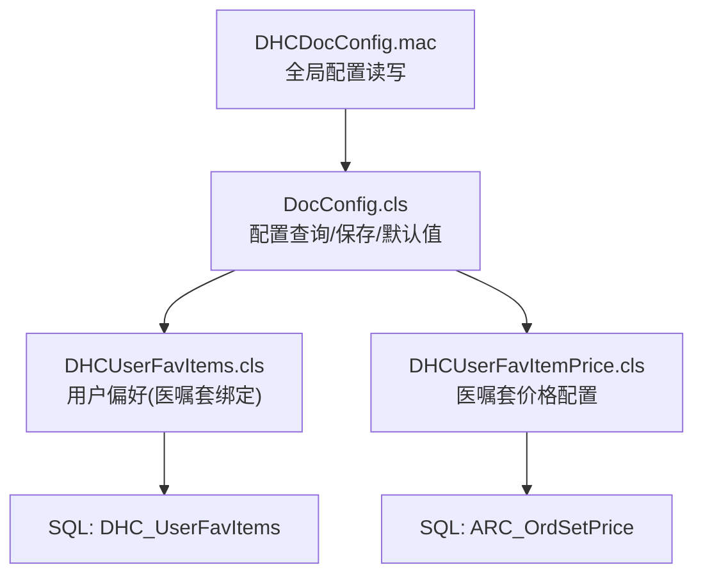
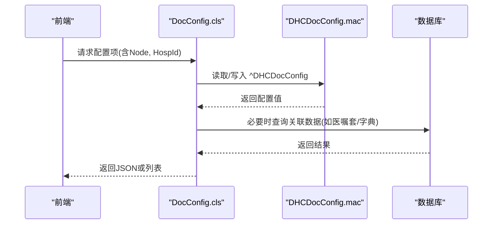
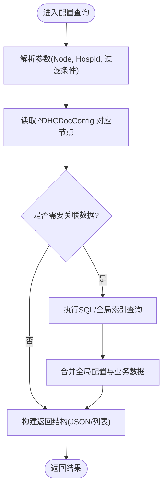
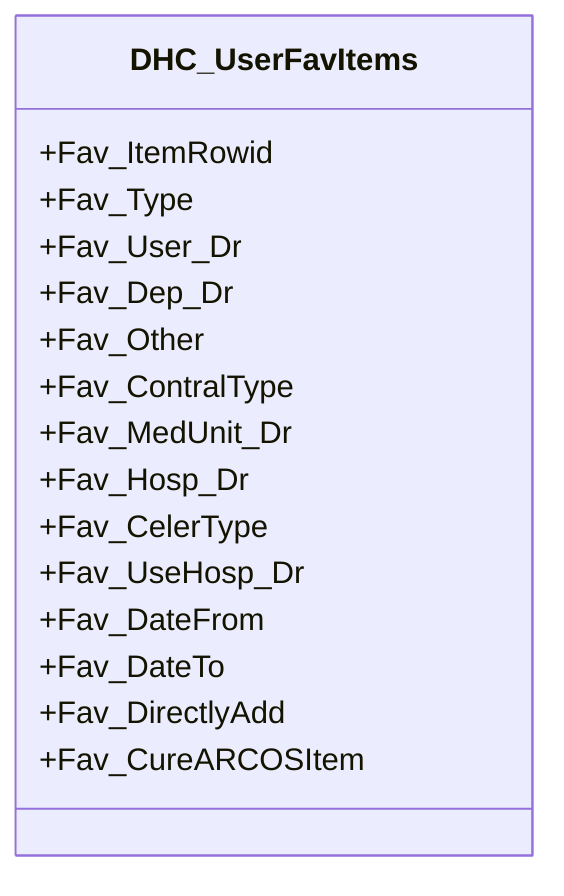
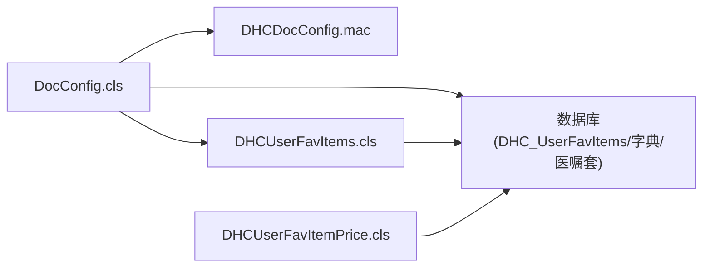

# 配置管理表

<cite>
**本文引用的文件**
- [DocConfig.cls](file://src/backend/doc-ws/DHCDoc/DHCDocConfig/DocConfig.cls)
- [DHCUserFavItems.cls](file://src/backend/doc-ws/User/DHCUserFavItems.cls)
- [DHCUserFavItemPrice.cls](file://src/backend/doc-ws/web/DHCUserFavItemPrice.cls)
- [DHCDocConfig.mac](file://src/backend/public-mc/DHCDocConfig.mac)
</cite>

## 目录
1. [简介](#简介)
2. [项目结构](#项目结构)
3. [核心组件](#核心组件)
4. [架构总览](#架构总览)
5. [详细组件分析](#详细组件分析)
6. [依赖关系分析](#依赖关系分析)
7. [性能考虑](#性能考虑)
8. [故障排查指南](#故障排查指南)
9. [结论](#结论)
10. [附录：API与使用示例](#附录api与使用示例)

## 简介
本文件围绕系统配置、用户偏好设置与界面布局相关的“配置管理表”进行系统化文档化，覆盖以下方面：
- 配置项分类管理与多院区隔离机制
- 版本控制与动态加载策略
- 配置数据的校验规则、权限控制与变更审计建议
- 面向前端/后端的配置读取与保存接口（基于现有类方法）
- 典型使用场景与调用流程

## 项目结构
本项目在多个业务域中提供配置能力，其中与“配置管理表”最密切相关的代码集中在：
- 全局配置读写与节点管理：DHCDocConfig.mac
- 医生站配置查询与保存：DocConfig.cls
- 用户偏好与医嘱套关联：DHCUserFavItems.cls
- 医嘱套包装价格等扩展配置：DHCUserFavItemPrice.cls

图表来源
- [DHCDocConfig.mac:1-119](file://src/backend/public-mc/DHCDocConfig.mac#L1-L119)
- [DocConfig.cls:1-800](file://src/backend/doc-ws/DHCDoc/DHCDocConfig/DocConfig.cls#L1-L800)
- [DHCUserFavItems.cls:1-165](file://src/backend/doc-ws/User/DHCUserFavItems.cls#L1-L165)
- [DHCUserFavItemPrice.cls:1-165](file://src/backend/doc-ws/web/DHCUserFavItemPrice.cls#L1-L165)

章节来源
- [DHCDocConfig.mac:1-119](file://src/backend/public-mc/DHCDocConfig.mac#L1-L119)
- [DocConfig.cls:1-800](file://src/backend/doc-ws/DHCDoc/DHCDocConfig/DocConfig.cls#L1-L800)
- [DHCUserFavItems.cls:1-165](file://src/backend/doc-ws/User/DHCUserFavItems.cls#L1-L165)
- [DHCUserFavItemPrice.cls:1-165](file://src/backend/doc-ws/web/DHCUserFavItemPrice.cls#L1-L165)

## 核心组件
- 全局配置存储与工具
  - 通过全局变量 ^DHCDocConfig 实现键值型配置存储，支持单院区与多院区隔离（以 HospDr_ 前缀区分）。
  - 提供 saveconfig/getconfignode/saveconfig1/getconfignodes 等便捷方法。
- 医生站配置服务
  - DocConfig.cls 提供大量 Query/ClassMethod，用于获取配置项列表、默认值、选择集（如账单大类/子类、用法、优先级等），并支持按院区过滤。
  - 支持将配置项序列化为 JSON 供前端动态渲染。
- 用户偏好配置
  - DHCUserFavItems.cls 映射到 SQL 表 DHC_UserFavItems，记录用户/科室/院区对医嘱套的偏好绑定、生效日期、快速添加标记等。
- 医嘱套价格配置
  - DHCUserFavItemPrice.cls 提供对 ARC_OrdSetPrice 表的查询、新增、更新、删除操作，支持按时间区间与院区限定。

章节来源
- [DHCDocConfig.mac:1-119](file://src/backend/public-mc/DHCDocConfig.mac#L1-L119)
- [DocConfig.cls:1-800](file://src/backend/doc-ws/DHCDoc/DHCDocConfig/DocConfig.cls#L1-L800)
- [DHCUserFavItems.cls:1-165](file://src/backend/doc-ws/User/DHCUserFavItems.cls#L1-L165)
- [DHCUserFavItemPrice.cls:1-165](file://src/backend/doc-ws/web/DHCUserFavItemPrice.cls#L1-L165)

## 架构总览
配置体系采用“全局配置 + 实体配置 + 用户偏好”的分层设计：
- 全局配置：^DHCDocConfig 作为系统级开关与默认值源，支持院区维度隔离。
- 实体配置：DocConfig.cls 聚合各类配置查询与默认值计算，对外暴露统一接口。
- 用户偏好：DHCUserFavItems.cls 将用户/科室/院区与业务对象（如医嘱套）建立绑定关系，形成个性化配置。
- 扩展配置：DHCUserFavItemPrice.cls 为特定业务（如价格）提供独立配置表。

图表来源
- [DocConfig.cls:315-420](file://src/backend/doc-ws/DHCDoc/DHCDocConfig/DocConfig.cls#L315-L420)
- [DHCDocConfig.mac:1-119](file://src/backend/public-mc/DHCDocConfig.mac#L1-L119)

## 详细组件分析

### 全局配置存储：DHCDocConfig.mac
- 职责
  - 提供全局配置节点的读写、批量枚举、清理等方法。
  - 明确说明：该文件中直接访问 ^DHCDocConfig 时不包含院区节点；如需院区隔离请使用 web.DHCDocConfig.GetConfigNode 系列方法（由上层封装）。
- 关键能力
  - 保存/读取单个节点：saveconfig/getconfignode
  - 保存/读取多级节点：saveconfig1/getconfignode1
  - 枚举子节点：getconfignodes
  - 清理节点：killconfignodes
  - 辅助：当前医院、日期时间转换、诊断路径等
- 设计要点
  - 通过命名约定（如 HospDr_ 前缀）实现院区隔离。
  - 所有配置均为键值型，适合轻量级系统参数、开关、默认值。

章节来源
- [DHCDocConfig.mac:1-119](file://src/backend/public-mc/DHCDocConfig.mac#L1-L119)

### 医生站配置服务：DocConfig.cls
- 职责
  - 提供丰富的配置查询接口，涵盖草药录入设置、账单大类/子类、用法、优先级、接受科室、医嘱套列表等。
  - 支持按院区过滤，结合会话中的 LOGON.HOSPID 自动识别。
  - 将配置项转换为 JSON，便于前端动态渲染表单。
- 关键能力
  - 获取默认配置值：getDefaultData / getDefaultDataJson / getDefaultDataJson1
  - 订单账单相关配置：getOrdBillCheckData / saveOrdBillCheckData
  - 查询类：Find* 系列（如 FindDefaultItem、FindInstrList、FindCNMedPrior、FindARCBillGrp/Sub、FindArcOrd、FindDep 等）
  - 频率/用法/包装方式等字典联动查询
- 数据流
  - 优先从 ^DHCDocConfig 读取院区/全局配置；
  - 若涉及业务对象（如医嘱套、字典），则通过 SQL 或全局索引查询；
  - 最终输出结构化数据（列表或 JSON）。
- 复杂度与性能
  - 多数查询使用游标/循环遍历全局索引，配合临时缓存 ^CacheTemp 提升分页效率。
  - 可通过限制 MaxFindNum、按需过滤减少开销。

图表来源
- [DocConfig.cls:315-420](file://src/backend/doc-ws/DHCDoc/DHCDocConfig/DocConfig.cls#L315-L420)
- [DocConfig.cls:699-743](file://src/backend/doc-ws/DHCDoc/DHCDocConfig/DocConfig.cls#L699-L743)

章节来源
- [DocConfig.cls:1-800](file://src/backend/doc-ws/DHCDoc/DHCDocConfig/DocConfig.cls#L1-L800)

### 用户偏好配置：DHCUserFavItems.cls
- 职责
  - 维护用户/科室/院区与医嘱套的绑定关系，支持生效日期、快速添加、治疗嘱套等标志。
- 表结构要点（映射自类属性）
  - Fav_ItemRowid：关联的医嘱套行ID
  - Fav_Type：偏好类型
  - Fav_User_Dr：用户
  - Fav_Dep_Dr：科室
  - Fav_Other：其他扩展字段
  - Fav_ContralType：控制类型
  - Fav_MedUnit_Dr：单位
  - Fav_Hosp_Dr：院区
  - Fav_CelerType：是否快捷
  - Fav_UseHosp_Dr：使用院区
  - Fav_DateFrom/Fav_DateTo：生效起止日期
  - Fav_DirectlyAdd：是否直接添加
  - Fav_CureARCOSItem：是否治疗嘱套
- 索引与存储
  - 使用 %Storage.SQL，定义主键与多个条件索引（如 CureFlag、ItemRowid）。
  - 全局存储于 ^DHCFavItems，并提供 StreamLocation。
- 使用场景
  - 医生站根据当前用户/科室/院区，筛选可用的医嘱套集合。
  - 与 DocConfig.FindArcOrd 等查询联合，实现“仅显示当前用户可用”的医嘱套。

图表来源
- [DHCUserFavItems.cls:1-165](file://src/backend/doc-ws/User/DHCUserFavItems.cls#L1-L165)

章节来源
- [DHCUserFavItems.cls:1-165](file://src/backend/doc-ws/User/DHCUserFavItems.cls#L1-L165)

### 医嘱套价格配置：DHCUserFavItemPrice.cls
- 职责
  - 对医嘱套的包装价格进行增删改查，支持按时间区间与院区限定。
- 关键能力
  - FindInfo：查询某医嘱套的价格配置列表（含征收、医院、价格、有效期）。
  - insert/update/delete：对 ARC_OrdSetPrice 表进行持久化操作。
  - LookUpHospital/LookUpTariff：下拉选项生成。
- 使用场景
  - 在医嘱套维护界面展示/编辑价格信息，确保在不同院区、不同时间段内价格正确。

章节来源
- [DHCUserFavItemPrice.cls:1-165](file://src/backend/doc-ws/web/DHCUserFavItemPrice.cls#L1-L165)

## 依赖关系分析
- DocConfig.cls 依赖
  - DHCDocConfig.mac：读取/写入全局配置节点
  - 数据库：查询字典、医嘱套、科室等基础数据
  - 用户偏好表：在部分查询中联合 DHC_UserFavItems 过滤可用范围
- DHCUserFavItems.cls 依赖
  - 数据库：SQL 表 DHC_UserFavItems
- DHCUserFavItemPrice.cls 依赖
  - 数据库：SQL 表 ARC_OrdSetPrice

图表来源
- [DocConfig.cls:315-420](file://src/backend/doc-ws/DHCDoc/DHCDocConfig/DocConfig.cls#L315-L420)
- [DHCUserFavItems.cls:1-165](file://src/backend/doc-ws/User/DHCUserFavItems.cls#L1-L165)
- [DHCUserFavItemPrice.cls:1-165](file://src/backend/doc-ws/web/DHCUserFavItemPrice.cls#L1-L165)
- [DHCDocConfig.mac:1-119](file://src/backend/public-mc/DHCDocConfig.mac#L1-L119)

章节来源
- [DocConfig.cls:1-800](file://src/backend/doc-ws/DHCDoc/DHCDocConfig/DocConfig.cls#L1-L800)
- [DHCUserFavItems.cls:1-165](file://src/backend/doc-ws/User/DHCUserFavItems.cls#L1-L165)
- [DHCUserFavItemPrice.cls:1-165](file://src/backend/doc-ws/web/DHCUserFavItemPrice.cls#L1-L165)
- [DHCDocConfig.mac:1-119](file://src/backend/public-mc/DHCDocConfig.mac#L1-L119)

## 性能考虑
- 配置读取
  - 优先使用全局配置 ^DHCDocConfig，避免频繁数据库访问。
  - 使用 DocConfig.getDefaultDataJson 系列方法批量拉取多个节点，减少往返次数。
- 查询优化
  - 合理设置 MaxFindNum 限制最大返回条数。
  - 利用已有索引（如 DHC_UserFavItems 的条件索引）提高查询效率。
- 缓存
  - DocConfig 内部使用 ^CacheTemp 暂存中间结果，注意及时释放。
- 并发与一致性
  - 全局配置为键值型，写操作需保证幂等性；建议在应用层加锁或事务保护。

## 故障排查指南
- 配置未生效
  - 检查是否正确传入 HospId，确认院区节点是否存在（HospDr_ 前缀）。
  - 确认调用的是 GetConfigNode 系列方法（如需院区隔离）。
- 查询结果为空
  - 核对传入 Node 名称是否与配置节点一致。
  - 检查关联数据（如医嘱套、字典）是否有效且处于启用状态。
- 用户偏好不匹配
  - 检查 DHC_UserFavItems 中用户/科室/院区/生效日期是否符合当前上下文。
- 价格配置异常
  - 核查 ARC_OrdSetPrice 的时间区间与院区是否覆盖当前业务场景。

章节来源
- [DHCDocConfig.mac:1-119](file://src/backend/public-mc/DHCDocConfig.mac#L1-L119)
- [DocConfig.cls:315-420](file://src/backend/doc-ws/DHCDoc/DHCDocConfig/DocConfig.cls#L315-L420)
- [DHCUserFavItems.cls:1-165](file://src/backend/doc-ws/User/DHCUserFavItems.cls#L1-L165)
- [DHCUserFavItemPrice.cls:1-165](file://src/backend/doc-ws/web/DHCUserFavItemPrice.cls#L1-L165)

## 结论
本项目的配置管理体系以全局配置为核心，结合医生站配置服务与用户偏好表，实现了灵活、可扩展的配置能力。通过院区隔离、默认值回退、JSON 序列化等手段，既满足了多院区差异化需求，又提升了前端动态渲染的效率。建议在后续迭代中补充统一的配置校验、权限控制与变更审计机制，进一步提升系统的可运维性与安全性。

## 附录：API与使用示例
以下为基于现有类方法的典型调用方式（描述性示例，非代码片段）：
- 读取全局配置节点
  - 使用 DHCDocConfig.mac 的 getconfignode/getconfignode1，传入 Node 名称获取值。
  - 如需院区隔离，使用 web.DHCDocConfig.GetConfigNode 系列方法（由上层封装）。
- 批量获取默认配置
  - 调用 DocConfig.getDefaultDataJson("NodeA^NodeB", HospId)，返回包含 id、Node、value 的 JSON 数组，便于前端渲染。
- 获取订单账单检查配置
  - 调用 DocConfig.getOrdBillCheckData(node, value, HospId) 获取指定节点的值。
- 保存订单账单检查配置
  - 调用 DocConfig.saveOrdBillCheckData(Coninfo, node, HospId) 批量保存配置项。
- 查询用户可用医嘱套
  - 调用 DocConfig.FindArcOrd(HospId) 获取当前院区下可用的医嘱套列表（已结合用户偏好过滤）。
- 用户偏好管理
  - 通过 DHCUserFavItems.cls 的属性维护用户/科室/院区与医嘱套的绑定关系，设置生效日期与快捷标志。
- 医嘱套价格管理
  - 使用 DHCUserFavItemPrice.cls 的 insert/update/delete 对 ARC_OrdSetPrice 进行维护；使用 FindInfo 查询价格列表。

章节来源
- [DHCDocConfig.mac:1-119](file://src/backend/public-mc/DHCDocConfig.mac#L1-L119)
- [DocConfig.cls:315-420](file://src/backend/doc-ws/DHCDoc/DHCDocConfig/DocConfig.cls#L315-L420)
- [DocConfig.cls:699-743](file://src/backend/doc-ws/DHCDoc/DHCDocConfig/DocConfig.cls#L699-L743)
- [DHCUserFavItems.cls:1-165](file://src/backend/doc-ws/User/DHCUserFavItems.cls#L1-L165)
- [DHCUserFavItemPrice.cls:1-165](file://src/backend/doc-ws/web/DHCUserFavItemPrice.cls#L1-L165)