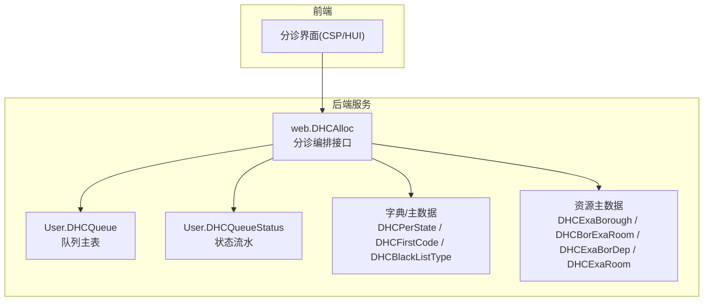
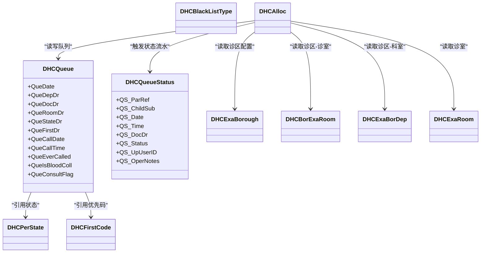
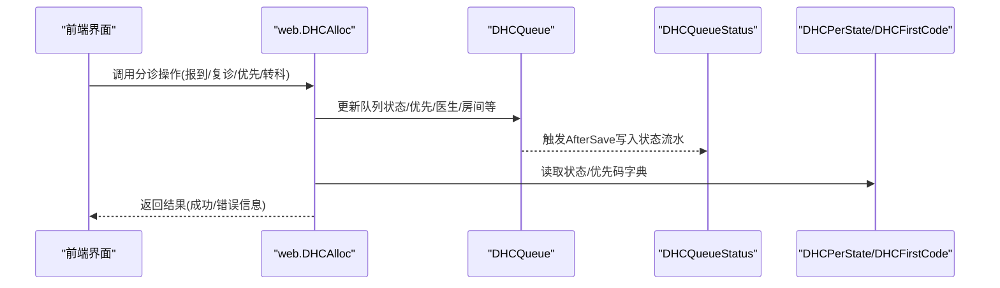
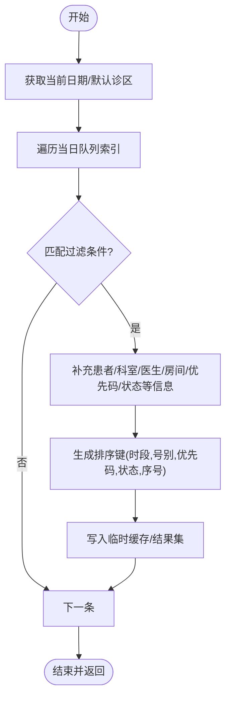
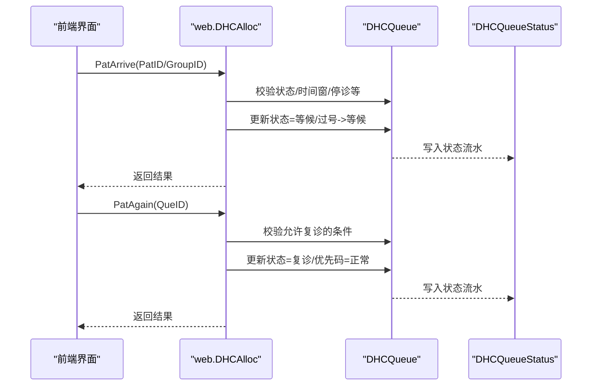
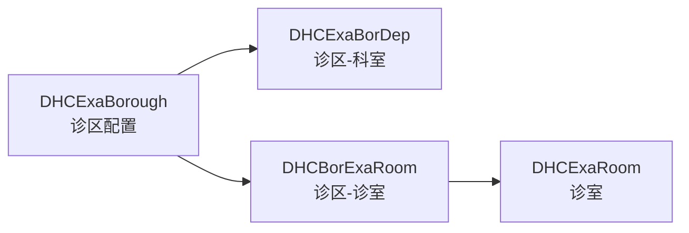
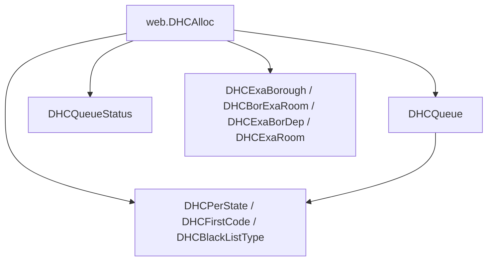

# 分诊系统 (triage-ws)

<cite>
**本文引用的文件**
- [DHCQueue.cls](file://src/backend/triage-ws/User/DHCQueue.cls)
- [DHCQueueStatus.cls](file://src/backend/triage-ws/User/DHCQueueStatus.cls)
- [DHCFirstCode.cls](file://src/backend/triage-ws/User/DHCFirstCode.cls)
- [DHCBlackListType.cls](file://src/backend/triage-ws/User/DHCBlackListType.cls)
- [DHCPerState.cls](file://src/backend/triage-ws/User/DHCPerState.cls)
- [DHCAlloc.cls](file://src/backend/triage-ws/web/DHCAlloc.cls)
- [DHCExaBorough.cls](file://src/backend/triage-ws/User/DHCExaBorough.cls)
- [DHCBorExaRoom.cls](file://src/backend/triage-ws/User/DHCBorExaRoom.cls)
- [DHCExaBorDep.cls](file://src/backend/triage-ws/User/DHCExaBorDep.cls)
- [DHCExaRoom.cls](file://src/backend/triage-ws/User/DHCExaRoom.cls)
</cite>

## 目录
1. [简介](#简介)
2. [项目结构](#项目结构)
3. [核心组件](#核心组件)
4. [架构总览](#架构总览)
5. [详细组件分析](#详细组件分析)
6. [依赖关系分析](#依赖关系分析)
7. [性能考虑](#性能考虑)
8. [故障排除指南](#故障排除指南)
9. [结论](#结论)
10. [附录](#附录)

## 简介
本模块为医院门诊分诊系统的后端实现，覆盖患者分流算法、优先级管理、排队与叫号、科室/诊区/诊室资源调度、黑名单管控、检查预约与报告时间管理等关键能力。通过统一的队列模型与状态机，结合前端界面（CSP/HUI）完成护士站与医生站的交互流程，支撑复杂业务场景下的稳定运行与可配置化扩展。

## 项目结构
- 后端服务位于 src/backend/triage-ws：
  - User：数据模型与领域类（队列、状态、优先码、黑名单类型、诊区/诊室/科室关联等）
  - web：业务编排与服务入口（分诊查询、报到、复诊、转科、会诊插入等）
- 前端界面位于 src/frontend/triage-ws：
  - csp：页面与控件（登记、护士分诊、诊区/诊室/人员配置、状态查询等）
  - scripts：交互脚本（调用后端方法、渲染列表、处理事件）

**图表来源**
- [DHCAlloc.cls:112-269](file://src/backend/triage-ws/web/DHCAlloc.cls#L112-L269)
- [DHCQueue.cls:1-121](file://src/backend/triage-ws/User/DHCQueue.cls#L1-L121)
- [DHCQueueStatus.cls:1-30](file://src/backend/triage-ws/User/DHCQueueStatus.cls#L1-L30)
- [DHCExaBorough.cls:1-30](file://src/backend/triage-ws/User/DHCExaBorough.cls#L1-L30)

**章节来源**
- [DHCAlloc.cls:112-269](file://src/backend/triage-ws/web/DHCAlloc.cls#L112-L269)
- [DHCQueue.cls:1-121](file://src/backend/triage-ws/User/DHCQueue.cls#L1-L121)
- [DHCQueueStatus.cls:1-30](file://src/backend/triage-ws/User/DHCQueueStatus.cls#L1-L30)
- [DHCExaBorough.cls:1-30](file://src/backend/triage-ws/User/DHCExaBorough.cls#L1-L30)

## 核心组件
- 队列主记录：承载患者就诊的日期、科室、医生、房间、状态、优先级、呼叫时间等核心信息，并在保存时触发状态流水写入。
- 状态流水：记录每次状态变更的时间、操作人、备注，支持按医生、日期、状态等多维索引查询。
- 优先码与状态字典：定义“优先”“正常”等优先级别与“报到/等候/过号/退号/复诊”等状态。
- 黑名单类型：用于管控执行策略的元数据。
- 资源主数据：诊区、诊区-科室映射、诊区-诊室映射、诊室基础信息。
- 分诊编排服务：提供查询队列、报到、复诊、转科、优先、会诊插入、诊区/诊室查询等能力。

**章节来源**
- [DHCQueue.cls:24-100](file://src/backend/triage-ws/User/DHCQueue.cls#L24-L100)
- [DHCQueueStatus.cls:8-28](file://src/backend/triage-ws/User/DHCQueueStatus.cls#L8-L28)
- [DHCFirstCode.cls:4-10](file://src/backend/triage-ws/User/DHCFirstCode.cls#L4-L10)
- [DHCPerState.cls:4-12](file://src/backend/triage-ws/User/DHCPerState.cls#L4-L12)
- [DHCBlackListType.cls:4-11](file://src/backend/triage-ws/User/DHCBlackListType.cls#L4-L11)
- [DHCExaBorough.cls:4-30](file://src/backend/triage-ws/User/DHCExaBorough.cls#L4-L30)
- [DHCBorExaRoom.cls:8-20](file://src/backend/triage-ws/User/DHCBorExaRoom.cls#L8-L20)
- [DHCExaBorDep.cls:8-12](file://src/backend/triage-ws/User/DHCExaBorDep.cls#L8-L12)
- [DHCExaRoom.cls:4-10](file://src/backend/triage-ws/User/DHCExaRoom.cls#L4-L10)

## 架构总览
分诊系统采用“主数据 + 队列 + 状态流水 + 编排服务”的分层设计：
- 主数据层：诊区、科室、诊室、状态字典、优先码、黑名单类型等
- 队列层：以 DHCQueue 为核心，承载一次就诊的全生命周期
- 状态流水层：以 DHCQueueStatus 记录每一次状态变迁，便于审计与分析
- 编排服务层：web.DHCAlloc 聚合主数据与队列，对外暴露分诊相关能力

**图表来源**
- [DHCQueue.cls:24-100](file://src/backend/triage-ws/User/DHCQueue.cls#L24-L100)
- [DHCQueueStatus.cls:8-28](file://src/backend/triage-ws/User/DHCQueueStatus.cls#L8-L28)
- [DHCPerState.cls:4-12](file://src/backend/triage-ws/User/DHCPerState.cls#L4-L12)
- [DHCFirstCode.cls:4-10](file://src/backend/triage-ws/User/DHCFirstCode.cls#L4-L10)
- [DHCBlackListType.cls:4-11](file://src/backend/triage-ws/User/DHCBlackListType.cls#L4-L11)
- [DHCExaBorough.cls:4-30](file://src/backend/triage-ws/User/DHCExaBorough.cls#L4-L30)
- [DHCBorExaRoom.cls:8-20](file://src/backend/triage-ws/User/DHCBorExaRoom.cls#L8-L20)
- [DHCExaBorDep.cls:8-12](file://src/backend/triage-ws/User/DHCExaBorDep.cls#L8-L12)
- [DHCExaRoom.cls:4-10](file://src/backend/triage-ws/User/DHCExaRoom.cls#L4-L10)

## 详细组件分析

### 队列与状态机
- 队列字段涵盖日期、科室、医生、房间、状态、优先码、是否采血/B超、是否被呼叫、等待/呼叫时间、会诊标志等，满足多场景分诊需求。
- 在插入或更新后，自动触发状态流水写入，保证状态变更可追溯。
- 状态流水表具备按医生、日期、状态、操作人等多维度索引，便于统计与审计。

**图表来源**
- [DHCQueue.cls:102-121](file://src/backend/triage-ws/User/DHCQueue.cls#L102-L121)
- [DHCQueueStatus.cls:29-81](file://src/backend/triage-ws/User/DHCQueueStatus.cls#L29-L81)
- [DHCPerState.cls:4-12](file://src/backend/triage-ws/User/DHCPerState.cls#L4-L12)
- [DHCFirstCode.cls:4-10](file://src/backend/triage-ws/User/DHCFirstCode.cls#L4-L10)

**章节来源**
- [DHCQueue.cls:24-100](file://src/backend/triage-ws/User/DHCQueue.cls#L24-L100)
- [DHCQueueStatus.cls:8-28](file://src/backend/triage-ws/User/DHCQueueStatus.cls#L8-L28)

### 患者分流与排序算法
- 查询队列时按“时间段/诊区/状态/号别/优先码/序号”进行多级排序，形成稳定的候诊顺序。
- 支持“所有/等候/复诊/复诊与等候/会诊”等过滤条件，以及按诊室、号别、医生等维度筛选。
- 将患者基本信息、年龄、性别、科室名称、就诊ID、是否会诊等附加信息一并输出，供前端展示与决策。

**图表来源**
- [DHCAlloc.cls:112-269](file://src/backend/triage-ws/web/DHCAlloc.cls#L112-L269)

**章节来源**
- [DHCAlloc.cls:112-269](file://src/backend/triage-ws/web/DHCAlloc.cls#L112-L269)

### 报到与复诊流程
- 报到：校验当前状态是否为“报到/过号”，必要时校验报到时间窗口；成功后将状态置为“等候”，并生成新队列号。
- 复诊：限制仅在非“退号/等候”且已分配医生的情况下执行；成功后状态置为“复诊”，并记录复诊时间。
- 优先：对“过号”可直接恢复为“等候”并设置优先；对“报到”则先尝试报到再设优先。

**图表来源**
- [DHCAlloc.cls:350-472](file://src/backend/triage-ws/web/DHCAlloc.cls#L350-L472)
- [DHCQueue.cls:102-121](file://src/backend/triage-ws/User/DHCQueue.cls#L102-L121)

**章节来源**
- [DHCAlloc.cls:350-472](file://src/backend/triage-ws/web/DHCAlloc.cls#L350-L472)

### 转科与医生调整
- 支持将患者从当前医生调整到同科室其他医生，或在特定条件下跨医生调整。
- 若处于“报到”状态，需校验报到时间窗口与医生停诊状态。
- 调整后同步更新队列中的医生、诊区、状态时间与操作人。

**章节来源**
- [DHCAlloc.cls:277-348](file://src/backend/triage-ws/web/DHCAlloc.cls#L277-L348)

### 诊区/诊室/科室资源调度
- 诊区配置：包含自动报到、首因规则、创建/延后队列号策略、是否受报到时间限制等。
- 诊区-科室映射：决定该诊区可接诊的科室范围。
- 诊区-诊室映射：决定该诊区可用的诊室集合及排序。
- 诊室基础信息：名称、编码、所属诊区等。

**图表来源**
- [DHCExaBorough.cls:4-30](file://src/backend/triage-ws/User/DHCExaBorough.cls#L4-L30)
- [DHCExaBorDep.cls:8-12](file://src/backend/triage-ws/User/DHCExaBorDep.cls#L8-L12)
- [DHCBorExaRoom.cls:8-20](file://src/backend/triage-ws/User/DHCBorExaRoom.cls#L8-L20)
- [DHCExaRoom.cls:4-10](file://src/backend/triage-ws/User/DHCExaRoom.cls#L4-L10)

**章节来源**
- [DHCExaBorough.cls:4-30](file://src/backend/triage-ws/User/DHCExaBorough.cls#L4-L30)
- [DHCExaBorDep.cls:8-12](file://src/backend/triage-ws/User/DHCExaBorDep.cls#L8-L12)
- [DHCBorExaRoom.cls:8-20](file://src/backend/triage-ws/User/DHCBorExaRoom.cls#L8-L20)
- [DHCExaRoom.cls:4-10](file://src/backend/triage-ws/User/DHCExaRoom.cls#L4-L10)

### 黑名单管理
- 黑名单类型为管控策略的元数据，包含代码、描述、执行代码等，用于在分诊流程中联动控制（如拒绝报到/挂号等）。
- 可在分诊编排逻辑中根据黑名单类型执行相应拦截或提示。

**章节来源**
- [DHCBlackListType.cls:4-11](file://src/backend/triage-ws/User/DHCBlackListType.cls#L4-L11)

### 检查预约与报告时间管理
- 报到前会校验“报到时间窗口”与“诊区配置是否允许不受时间限制”。
- 若配置不允许，则在报到/优先等操作中调用时间范围校验，避免违规报到。
- 诊区配置中包含自动报到、延后队列号、呼叫延后队列号等开关，影响检查预约与报告时间管理策略。

**章节来源**
- [DHCAlloc.cls:297-335](file://src/backend/triage-ws/web/DHCAlloc.cls#L297-L335)
- [DHCAlloc.cls:428-436](file://src/backend/triage-ws/web/DHCAlloc.cls#L428-L436)
- [DHCExaBorough.cls:14-30](file://src/backend/triage-ws/User/DHCExaBorough.cls#L14-L30)

### 分诊界面用户交互与数据处理
- 前端通过 CSP/HUI 页面发起请求，调用后端 DHCAlloc 的方法完成：
  - 查询队列列表（含过滤、排序、分页）
  - 报到、复诊、优先、转科、会诊插入
  - 诊区/诊室/人员配置查询
- 后端返回结构化数据，前端渲染表格、弹窗与提示，驱动护士站与医生站工作流。

**章节来源**
- [DHCAlloc.cls:112-269](file://src/backend/triage-ws/web/DHCAlloc.cls#L112-L269)
- [DHCAlloc.cls:277-552](file://src/backend/triage-ws/web/DHCAlloc.cls#L277-L552)

## 依赖关系分析
- 高内聚：队列与状态流水强耦合，确保一致性。
- 低耦合：编排服务通过主数据字典与资源主数据进行解耦，便于扩展与替换。
- 外部依赖：
  - 排班/医生资源：RES/CTPCP 等主数据
  - 挂号/费用：注册费、时间范围等
  - 病历/患者：PAADM/PAPER 等
- 潜在循环依赖：无直接循环，但需注意在扩展时避免引入新的循环引用。

**图表来源**
- [DHCAlloc.cls:112-269](file://src/backend/triage-ws/web/DHCAlloc.cls#L112-L269)
- [DHCQueue.cls:24-100](file://src/backend/triage-ws/User/DHCQueue.cls#L24-L100)
- [DHCQueueStatus.cls:8-28](file://src/backend/triage-ws/User/DHCQueueStatus.cls#L8-L28)
- [DHCExaBorough.cls:4-30](file://src/backend/triage-ws/User/DHCExaBorough.cls#L4-L30)

**章节来源**
- [DHCAlloc.cls:112-269](file://src/backend/triage-ws/web/DHCAlloc.cls#L112-L269)
- [DHCQueue.cls:24-100](file://src/backend/triage-ws/User/DHCQueue.cls#L24-L100)

## 性能考虑
- 索引优化：
  - 队列表针对日期、科室、医生、房间、状态、人员ID等建立复合索引，提升查询效率。
  - 状态流水表提供按医生、日期、状态、操作人的多维索引，便于统计与审计。
- 查询优化：
  - 使用临时缓存存储中间结果，减少重复计算。
  - 分批/游标式查询，避免一次性加载大量数据。
- 事务与并发：
  - 关键写操作使用事务包裹，保证一致性。
  - 在高并发场景下，建议对热点队列记录加锁或采用乐观锁机制。
- 存储与扩展：
  - 合理设置存储块大小与扩展阈值，避免频繁碎片整理。
  - 对历史数据归档，保持热数据体量可控。

[本节为通用性能建议，不直接分析具体文件]

## 故障排除指南
- 无法报到：
  - 检查当前状态是否为“报到/过号”，否则拒绝。
  - 检查诊区配置是否允许不受时间限制；若不允许，需满足报到时间窗口。
  - 检查医生是否停诊，停诊状态下禁止报到。
- 无法复诊：
  - 仅允许在“非退号/非等候”且已分配医生的情况下执行。
- 优先失败：
  - “过号”可直接恢复为“等候”并设置优先；“报到”需先报到再设优先。
- 状态不一致：
  - 查看状态流水表，确认最近一次状态变更的操作人与时间。
- 黑名单拦截：
  - 核对黑名单类型配置与执行代码，确认是否在分诊流程中被启用。

**章节来源**
- [DHCAlloc.cls:297-335](file://src/backend/triage-ws/web/DHCAlloc.cls#L297-L335)
- [DHCAlloc.cls:350-472](file://src/backend/triage-ws/web/DHCAlloc.cls#L350-L472)
- [DHCQueueStatus.cls:8-28](file://src/backend/triage-ws/User/DHCQueueStatus.cls#L8-L28)
- [DHCBlackListType.cls:4-11](file://src/backend/triage-ws/User/DHCBlackListType.cls#L4-L11)

## 结论
本分诊系统以队列为核心，结合状态流水与资源主数据，实现了灵活可配置的患者分流、优先级管理、排队与资源调度。通过严格的报到时间控制与黑名单管控，保障业务流程合规与稳定。建议在部署与运维中重点关注索引与缓存策略、事务一致性与高并发场景的稳定性，持续优化用户体验与系统吞吐。

## 附录
- 配置参数要点（基于现有字段与逻辑）：
  - 诊区配置：自动报到、首因规则、创建/延后队列号、是否受报到时间限制、所属医院等
  - 状态字典：报到/等候/过号/退号/复诊等
  - 优先码：优先/正常等
  - 黑名单类型：代码/描述/执行代码
- 常用接口路径参考：
  - 查询队列：FindPatQueue
  - 报到：PatArrive
  - 复诊：PatAgain
  - 优先：PatPrior
  - 转科：PatAdjDoc
  - 会诊插入：ConsultationQueueInsert
  - 诊区/诊室查询：QueryExaborough / QueryExabExecute

**章节来源**
- [DHCExaBorough.cls:4-30](file://src/backend/triage-ws/User/DHCExaBorough.cls#L4-L30)
- [DHCPerState.cls:4-12](file://src/backend/triage-ws/User/DHCPerState.cls#L4-L12)
- [DHCFirstCode.cls:4-10](file://src/backend/triage-ws/User/DHCFirstCode.cls#L4-L10)
- [DHCBlackListType.cls:4-11](file://src/backend/triage-ws/User/DHCBlackListType.cls#L4-L11)
- [DHCAlloc.cls:112-552](file://src/backend/triage-ws/web/DHCAlloc.cls#L112-L552)