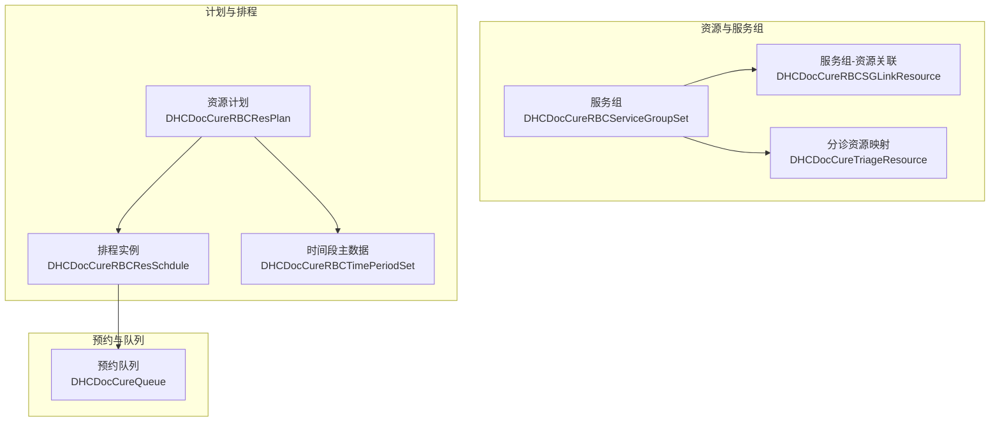
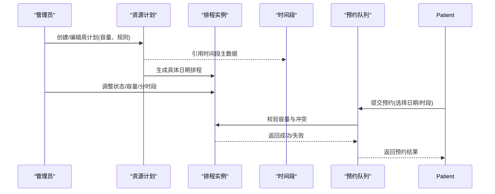
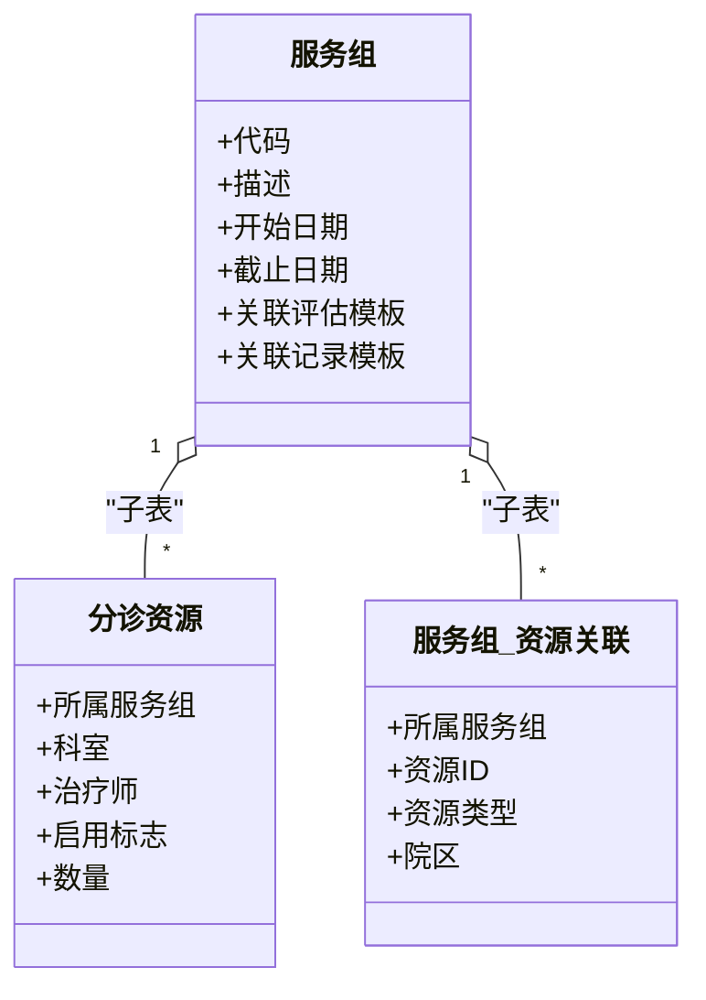
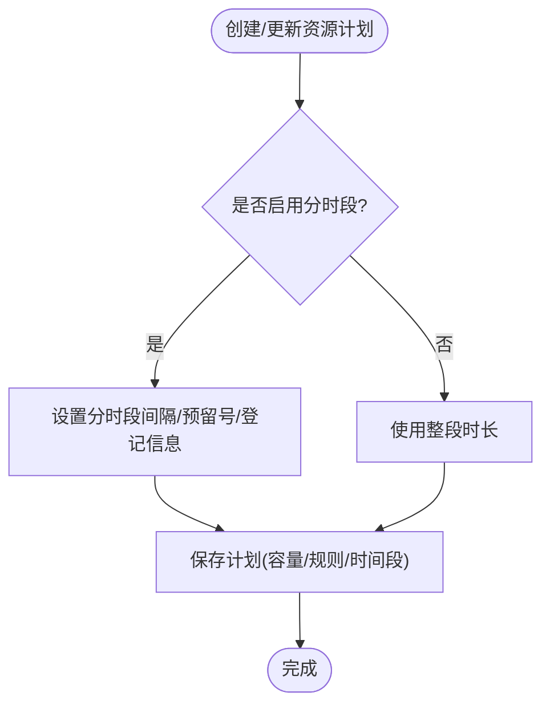
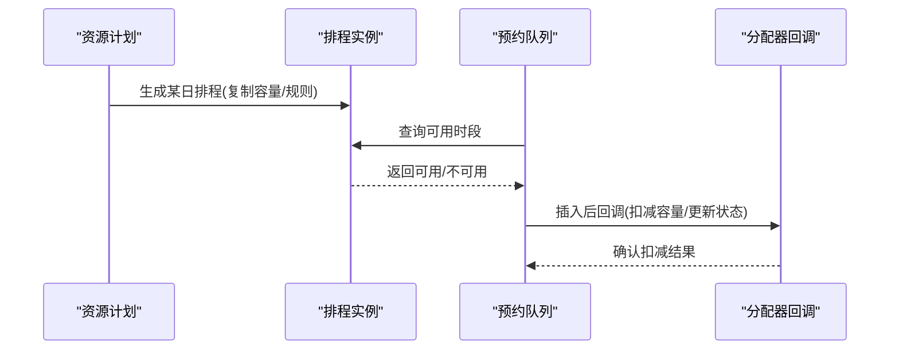
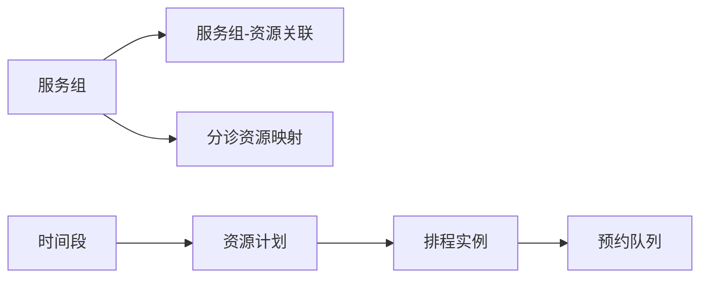
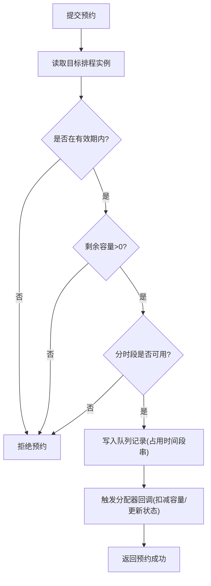

# 资源配置管理

<cite>
**本文引用的文件**
- [DHCDocCureRBCServiceGroupSet.cls](file://src/backend/cure-ws/User/DHCDocCureRBCServiceGroupSet.cls)
- [DHCDocCureRBCResPlan.cls](file://src/backend/cure-ws/User/DHCDocCureRBCResPlan.cls)
- [DHCDocCureRBCResSchdule.cls](file://src/backend/cure-ws/User/DHCDocCureRBCResSchdule.cls)
- [DHCDocCureRBCTimePeriodSet.cls](file://src/backend/cure-ws/User/DHCDocCureRBCTimePeriodSet.cls)
- [DHCDocCureRBCSGLinkResource.cls](file://src/backend/cure-ws/User/DHCDocCureRBCSGLinkResource.cls)
- [DHCDocCureTriageResource.cls](file://src/backend/cure-ws/User/DHCDocCureTriageResource.cls)
- [DHCDocCureQueue.cls](file://src/backend/cure-ws/User/DHCDocCureQueue.cls)
</cite>

## 目录
1. [简介](#简介)
2. [项目结构](#项目结构)
3. [核心组件](#核心组件)
4. [架构总览](#架构总览)
5. [详细组件分析](#详细组件分析)
6. [依赖关系分析](#依赖关系分析)
7. [性能与容量管理](#性能与容量管理)
8. [预约流程与冲突检测](#预约流程与冲突检测)
9. [权限、审批与变更管理](#权限审批与变更管理)
10. [API接口说明](#api接口说明)
11. [前端配置界面操作指南](#前端配置界面操作指南)
12. [常见问题与优化策略](#常见问题与优化策略)
13. [结论](#结论)

## 简介
本文件面向“治疗资源管理”能力，围绕资源分组、资源计划制定、服务组配置、排程与预约、冲突检测与容量控制、利用率统计与监控等主题，提供从数据模型到业务流程的系统化说明。重点解释 DHCDocCureRBCServiceGroupSet（服务组）与 DHCDocCureRBCResPlan（资源计划）的业务逻辑，并给出排程、预约、队列联动的工作流视图与优化建议。

## 项目结构
该功能位于后端 cure-ws 的 User 命名空间下，采用以领域实体为中心的类组织方式：
- 资源与服务组：服务组定义、资源关联、分诊资源映射
- 计划与排程：按周/日生成可预约时段，承载容量与规则
- 时间区间：统一的时间段主数据
- 预约与队列：将患者预约落库为队列记录，驱动后续执行

图表来源
- [DHCDocCureRBCServiceGroupSet.cls:1-95](file://src/backend/cure-ws/User/DHCDocCureRBCServiceGroupSet.cls#L1-L95)
- [DHCDocCureRBCResPlan.cls:1-262](file://src/backend/cure-ws/User/DHCDocCureRBCResPlan.cls#L1-L262)
- [DHCDocCureRBCResSchdule.cls:1-414](file://src/backend/cure-ws/User/DHCDocCureRBCResSchdule.cls#L1-L414)
- [DHCDocCureRBCTimePeriodSet.cls:1-98](file://src/backend/cure-ws/User/DHCDocCureRBCTimePeriodSet.cls#L1-L98)
- [DHCDocCureRBCSGLinkResource.cls:1-149](file://src/backend/cure-ws/User/DHCDocCureRBCSGLinkResource.cls#L1-L149)
- [DHCDocCureTriageResource.cls:1-127](file://src/backend/cure-ws/User/DHCDocCureTriageResource.cls#L1-L127)
- [DHCDocCureQueue.cls:1-320](file://src/backend/cure-ws/User/DHCDocCureQueue.cls#L1-L320)

章节来源
- [DHCDocCureRBCServiceGroupSet.cls:1-95](file://src/backend/cure-ws/User/DHCDocCureRBCServiceGroupSet.cls#L1-L95)
- [DHCDocCureRBCResPlan.cls:1-262](file://src/backend/cure-ws/User/DHCDocCureRBCResPlan.cls#L1-L262)
- [DHCDocCureRBCResSchdule.cls:1-414](file://src/backend/cure-ws/User/DHCDocCureRBCResSchdule.cls#L1-L414)
- [DHCDocCureRBCTimePeriodSet.cls:1-98](file://src/backend/cure-ws/User/DHCDocCureRBCTimePeriodSet.cls#L1-L98)
- [DHCDocCureRBCSGLinkResource.cls:1-149](file://src/backend/cure-ws/User/DHCDocCureRBCSGLinkResource.cls#L1-L149)
- [DHCDocCureTriageResource.cls:1-127](file://src/backend/cure-ws/User/DHCDocCureTriageResource.cls#L1-L127)
- [DHCDocCureQueue.cls:1-320](file://src/backend/cure-ws/User/DHCDocCureQueue.cls#L1-L320)

## 核心组件
- 服务组（DHCDocCureRBCServiceGroupSet）：定义一组可被排程的服务集合，支持有效期、关联评估/记录模板，并通过子表维护分诊资源与服务组-资源关联。
- 资源计划（DHCDocCureRBCResPlan）：按周维度定义资源可用时段、最大预约数、自动预约数、截止缴费/预约时间、是否分时段及间隔、预留号等。
- 排程实例（DHCDocCureRBCResSchdule）：由计划派生出的具体日期排班，承载实际可预约的起止时间、状态、容量与分时段信息。
- 时间段主数据（DHCDocCureRBCTimePeriodSet）：标准化时间段（开始/结束、不可用标记、截止缴费/预约时间）。
- 服务组-资源关联（DHCDocCureRBCSGLinkResource）：将服务组与具体资源（人员/设备）绑定，支持院区维度。
- 分诊资源映射（DHCDocCureTriageResource）：将服务组与科室/治疗师/数量等映射，用于前台展示与路由。
- 预约队列（DHCDocCureQueue）：患者预约落库后的排队记录，关联排程、服务组、时间段占用串等，触发分配器回调。

章节来源
- [DHCDocCureRBCServiceGroupSet.cls:1-95](file://src/backend/cure-ws/User/DHCDocCureRBCServiceGroupSet.cls#L1-L95)
- [DHCDocCureRBCResPlan.cls:1-262](file://src/backend/cure-ws/User/DHCDocCureRBCResPlan.cls#L1-L262)
- [DHCDocCureRBCResSchdule.cls:1-414](file://src/backend/cure-ws/User/DHCDocCureRBCResSchdule.cls#L1-L414)
- [DHCDocCureRBCTimePeriodSet.cls:1-98](file://src/backend/cure-ws/User/DHCDocCureRBCTimePeriodSet.cls#L1-L98)
- [DHCDocCureRBCSGLinkResource.cls:1-149](file://src/backend/cure-ws/User/DHCDocCureRBCSGLinkResource.cls#L1-L149)
- [DHCDocCureTriageResource.cls:1-127](file://src/backend/cure-ws/User/DHCDocCureTriageResource.cls#L1-L127)
- [DHCDocCureQueue.cls:1-320](file://src/backend/cure-ws/User/DHCDocCureQueue.cls#L1-L320)

## 架构总览
资源管理遵循“主数据—计划—排程—预约—队列”的分层设计：
- 主数据：时间段、服务组、资源映射
- 计划：按周/资源/科室配置容量与规则
- 排程：将计划展开为具体日期与时间段
- 预约：在排程上创建队列记录，扣减剩余容量
- 队列：驱动后续执行与状态流转

图表来源
- [DHCDocCureRBCResPlan.cls:1-262](file://src/backend/cure-ws/User/DHCDocCureRBCResPlan.cls#L1-L262)
- [DHCDocCureRBCResSchdule.cls:1-414](file://src/backend/cure-ws/User/DHCDocCureRBCResSchdule.cls#L1-L414)
- [DHCDocCureRBCTimePeriodSet.cls:1-98](file://src/backend/cure-ws/User/DHCDocCureRBCTimePeriodSet.cls#L1-L98)
- [DHCDocCureQueue.cls:1-320](file://src/backend/cure-ws/User/DHCDocCureQueue.cls#L1-L320)

## 详细组件分析

### 服务组（DHCDocCureRBCServiceGroupSet）
- 业务职责：定义可被排程的服务集合，包含代码、描述、有效期、关联评估/记录模板；通过子表维护分诊资源与服务组-资源关联。
- 关键关系：
  - 子表：分诊资源（DDCTRParRef）
  - 子表：服务组-资源关联（ChildSGLinkResource）
- 索引与存储：提供基于代码的索引，SQL存储策略便于查询与维护。

图表来源
- [DHCDocCureRBCServiceGroupSet.cls:1-95](file://src/backend/cure-ws/User/DHCDocCureRBCServiceGroupSet.cls#L1-L95)
- [DHCDocCureTriageResource.cls:1-127](file://src/backend/cure-ws/User/DHCDocCureTriageResource.cls#L1-L127)
- [DHCDocCureRBCSGLinkResource.cls:1-149](file://src/backend/cure-ws/User/DHCDocCureRBCSGLinkResource.cls#L1-L149)

章节来源
- [DHCDocCureRBCServiceGroupSet.cls:1-95](file://src/backend/cure-ws/User/DHCDocCureRBCServiceGroupSet.cls#L1-L95)
- [DHCDocCureTriageResource.cls:1-127](file://src/backend/cure-ws/User/DHCDocCureTriageResource.cls#L1-L127)
- [DHCDocCureRBCSGLinkResource.cls:1-149](file://src/backend/cure-ws/User/DHCDocCureRBCSGLinkResource.cls#L1-L149)

### 资源计划（DHCDocCureRBCResPlan）
- 业务职责：按周维度定义资源可用时段、最大预约数、自动预约数、截止缴费/预约时间、允许的病人类型、是否分时段及间隔、预留号等。
- 关键属性：
  - 排班科室、资源ID、星期、时间段引用
  - 起止时间、服务组ID、容量与自动预约开关
  - 分时段开关、间隔分钟、预留号、登记信息串
- 索引策略：针对科室、资源、星期+资源等多维索引，提升查询效率。

图表来源
- [DHCDocCureRBCResPlan.cls:1-262](file://src/backend/cure-ws/User/DHCDocCureRBCResPlan.cls#L1-L262)

章节来源
- [DHCDocCureRBCResPlan.cls:1-262](file://src/backend/cure-ws/User/DHCDocCureRBCResPlan.cls#L1-L262)

### 排程实例（DHCDocCureRBCResSchdule）
- 业务职责：将资源计划展开为具体日期的排班，承载实际可预约的起止时间、状态、容量、分时段信息与创建/更新审计字段。
- 关键索引：按日期、服务组、科室、资源、时间段等多维索引，支撑高并发预约查询与冲突检测。
- 与队列联动：队列插入/更新时触发分配器回调，进行容量扣减与状态维护。

图表来源
- [DHCDocCureRBCResSchdule.cls:1-414](file://src/backend/cure-ws/User/DHCDocCureRBCResSchdule.cls#L1-L414)
- [DHCDocCureQueue.cls:1-320](file://src/backend/cure-ws/User/DHCDocCureQueue.cls#L1-L320)

章节来源
- [DHCDocCureRBCResSchdule.cls:1-414](file://src/backend/cure-ws/User/DHCDocCureRBCResSchdule.cls#L1-L414)
- [DHCDocCureQueue.cls:1-320](file://src/backend/cure-ws/User/DHCDocCureQueue.cls#L1-L320)

### 时间段主数据（DHCDocCureRBCTimePeriodSet）
- 业务职责：统一管理时间段（开始/结束）、不可用标记、截止缴费/预约时间，供计划与排程复用。
- 索引：基于代码索引，便于快速检索。

章节来源
- [DHCDocCureRBCTimePeriodSet.cls:1-98](file://src/backend/cure-ws/User/DHCDocCureRBCTimePeriodSet.cls#L1-L98)

### 服务组-资源关联（DHCDocCureRBCSGLinkResource）
- 业务职责：将服务组与具体资源（人员/设备）绑定，支持院区维度，提供资源类型区分。
- 索引：支持按资源、类型、服务组多维查询。

章节来源
- [DHCDocCureRBCSGLinkResource.cls:1-149](file://src/backend/cure-ws/User/DHCDocCureRBCSGLinkResource.cls#L1-L149)

### 分诊资源映射（DHCDocCureTriageResource）
- 业务职责：将服务组与科室/治疗师/数量映射，用于前台展示与路由。
- 索引：支持按科室、资源、服务组查询。

章节来源
- [DHCDocCureTriageResource.cls:1-127](file://src/backend/cure-ws/User/DHCDocCureTriageResource.cls#L1-L127)

## 依赖关系分析
- 服务组依赖分诊资源与服务组-资源关联，形成“服务→资源”的映射。
- 资源计划依赖时间段主数据，并作为排程实例的模板。
- 排程实例依赖资源计划与服务组，承载具体日期的可预约能力。
- 预约队列依赖排程实例与服务组，并在插入/更新时触发分配器回调。

图表来源
- [DHCDocCureRBCServiceGroupSet.cls:1-95](file://src/backend/cure-ws/User/DHCDocCureRBCServiceGroupSet.cls#L1-L95)
- [DHCDocCureRBCResPlan.cls:1-262](file://src/backend/cure-ws/User/DHCDocCureRBCResPlan.cls#L1-L262)
- [DHCDocCureRBCResSchdule.cls:1-414](file://src/backend/cure-ws/User/DHCDocCureRBCResSchdule.cls#L1-L414)
- [DHCDocCureRBCTimePeriodSet.cls:1-98](file://src/backend/cure-ws/User/DHCDocCureRBCTimePeriodSet.cls#L1-L98)
- [DHCDocCureRBCSGLinkResource.cls:1-149](file://src/backend/cure-ws/User/DHCDocCureRBCSGLinkResource.cls#L1-L149)
- [DHCDocCureTriageResource.cls:1-127](file://src/backend/cure-ws/User/DHCDocCureTriageResource.cls#L1-L127)
- [DHCDocCureQueue.cls:1-320](file://src/backend/cure-ws/User/DHCDocCureQueue.cls#L1-L320)

章节来源
- [DHCDocCureRBCServiceGroupSet.cls:1-95](file://src/backend/cure-ws/User/DHCDocCureRBCServiceGroupSet.cls#L1-L95)
- [DHCDocCureRBCResPlan.cls:1-262](file://src/backend/cure-ws/User/DHCDocCureRBCResPlan.cls#L1-L262)
- [DHCDocCureRBCResSchdule.cls:1-414](file://src/backend/cure-ws/User/DHCDocCureRBCResSchdule.cls#L1-L414)
- [DHCDocCureRBCTimePeriodSet.cls:1-98](file://src/backend/cure-ws/User/DHCDocCureRBCTimePeriodSet.cls#L1-L98)
- [DHCDocCureRBCSGLinkResource.cls:1-149](file://src/backend/cure-ws/User/DHCDocCureRBCSGLinkResource.cls#L1-L149)
- [DHCDocCureTriageResource.cls:1-127](file://src/backend/cure-ws/User/DHCDocCureTriageResource.cls#L1-L127)
- [DHCDocCureQueue.cls:1-320](file://src/backend/cure-ws/User/DHCDocCureQueue.cls#L1-L320)

## 性能与容量管理
- 容量控制：资源计划与排程均维护最大预约数与自动预约数；排程实例在预约时扣减剩余容量，避免超卖。
- 分时段调度：通过“是否分时段、间隔分钟、预留号、登记信息串”实现精细化时段切分与预留策略。
- 索引优化：多维度索引（科室、资源、星期、日期、时间段）减少热点查询成本，提升并发预约吞吐。
- 批量生成：建议按周批量生成排程，减少重复计算；对历史数据归档以降低热表压力。
- 缓存建议：对常用时间段、服务组-资源映射做短期缓存，降低数据库压力。

[本节为通用性能指导，不直接分析具体文件]

## 预约流程与冲突检测
- 预约入口：前端选择服务组、日期与时段，提交预约请求。
- 冲突检测：
  - 检查排程实例状态与截止时间（截止缴费/预约时间）
  - 校验剩余容量（最大预约数-已占用的时间段）
  - 若启用分时段，校验所选时段是否已被占用或预留
- 扣减与落库：通过队列记录占用时间段串，触发分配器回调完成容量扣减与状态更新。
- 回滚策略：若扣减失败或外部校验不通过，需回滚队列记录并提示用户。

图表来源
- [DHCDocCureRBCResSchdule.cls:1-414](file://src/backend/cure-ws/User/DHCDocCureRBCResSchdule.cls#L1-L414)
- [DHCDocCureQueue.cls:1-320](file://src/backend/cure-ws/User/DHCDocCureQueue.cls#L1-L320)

章节来源
- [DHCDocCureRBCResSchdule.cls:1-414](file://src/backend/cure-ws/User/DHCDocCureRBCResSchdule.cls#L1-L414)
- [DHCDocCureQueue.cls:1-320](file://src/backend/cure-ws/User/DHCDocCureQueue.cls#L1-L320)

## 权限、审批与变更管理
- 权限控制：
  - 服务组/资源映射的维护应限制为管理员或具备相应角色的用户
  - 资源计划与排程的编辑需具备排班管理权限
  - 预约操作可按病人类型、科室或服务组进行细粒度授权
- 审批流程：
  - 对跨院区、特殊资源（如大型设备）的排程变更建议引入审批节点
  - 对容量调整（尤其是高峰时段）建议双人复核
- 变更管理：
  - 所有计划/排程/服务组的变更应记录审计字段（创建/更新人、时间）
  - 建议保留版本快照，支持回滚与差异对比

[本节为通用治理建议，不直接分析具体文件]

## API接口说明
以下为资源配置管理的典型接口范畴（概念性说明）：
- 服务组管理
  - 新增/修改/停用服务组
  - 查询服务组详情（含有效期、关联模板）
  - 维护服务组-资源关联（增删改查）
  - 维护分诊资源映射（科室/治疗师/数量）
- 时间段主数据
  - 新增/修改/停用时间段
  - 查询可用时间段列表
- 资源计划
  - 按周创建/修改资源计划（容量、规则、时间段引用）
  - 批量导入/导出计划
  - 查询某科室/资源的周计划
- 排程实例
  - 根据计划生成具体日期的排程
  - 调整排程状态/容量/分时段参数
  - 查询某日/某资源的可用时段
- 预约与队列
  - 提交预约（选择服务组、日期、时段）
  - 取消/改约（释放容量）
  - 查询队列状态与呼叫状态

[本节为概念性接口说明，不直接分析具体文件]

## 前端配置界面操作指南
- 服务组配置
  - 新建服务组：填写代码、描述、有效期、关联评估/记录模板
  - 资源绑定：在服务组下添加资源（人员/设备），指定院区与类型
  - 分诊映射：配置科室、治疗师与数量，用于前台展示
- 时间段管理
  - 维护标准时间段（开始/结束、不可用标记、截止缴费/预约时间）
- 资源计划制定
  - 选择科室与资源，设定星期、时间段、最大预约数、自动预约数
  - 开启分时段：设置间隔分钟、预留号、登记信息串
  - 保存后生成排程
- 排程调整
  - 查看每日排程，调整状态（正常/停止）
  - 临时调整容量或分时段参数
- 预约操作
  - 选择服务组与日期，系统显示可用时段
  - 提交预约，系统校验容量与冲突并返回结果
  - 支持取消/改约，释放占用时段

[本节为操作指引，不直接分析具体文件]

## 常见问题与优化策略
- 常见问题
  - 预约冲突：同一时段被多次占用，需加强并发锁与容量校验
  - 容量超限：排程容量未正确扣减，需检查队列回调与事务一致性
  - 分时段错配：间隔分钟与起止时间不一致导致时段重叠，需校验边界
  - 时间段不可用：主数据未生效，需检查不可用标记与截止时间
- 优化策略
  - 并发控制：对热门时段加分布式锁，避免超卖
  - 批量预取：预约前批量加载可用时段，减少往返
  - 索引调优：确保按日期、资源、时间段的多维索引命中
  - 异步处理：队列回调与通知发送异步化，降低主流程延迟
  - 监控告警：对容量接近上限、失败率升高进行告警

[本节为通用问题与优化建议，不直接分析具体文件]

## 结论
本方案通过“服务组—资源计划—排程—预约—队列”的分层设计，实现了治疗资源的分类、容量管理与精细化调度。借助多维度索引与分时段策略，系统在并发预约场景下具备良好的可扩展性与稳定性。建议在权限、审批与变更管理方面完善治理机制，并结合监控与告警保障运行质量。