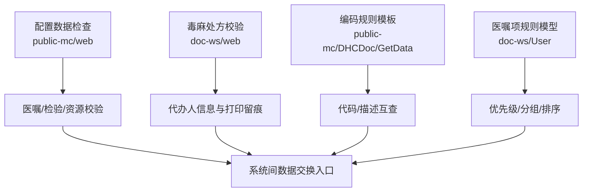
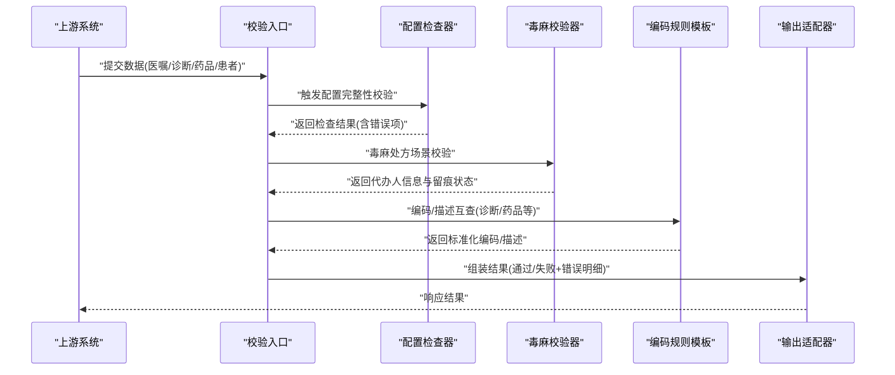
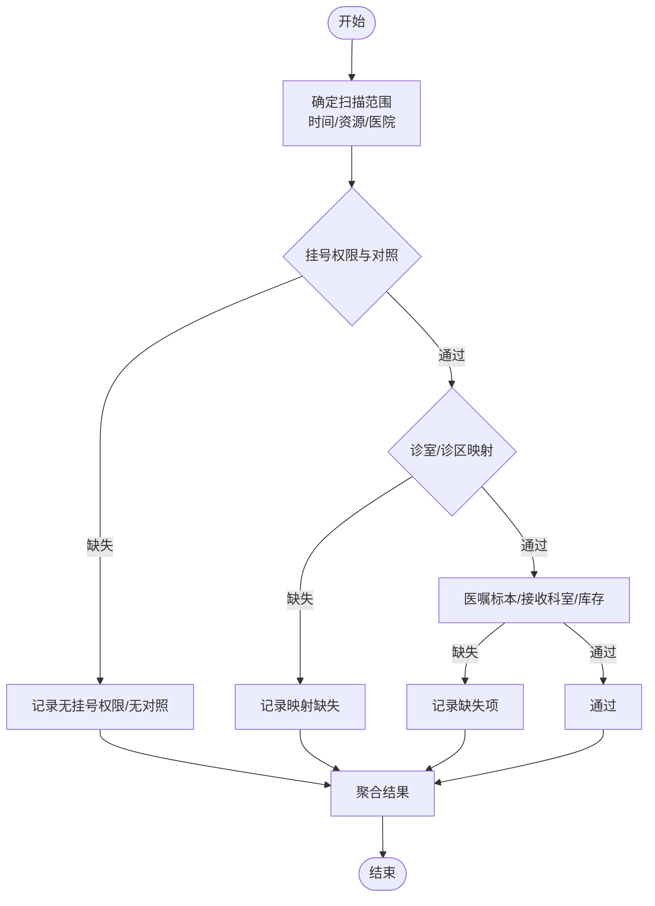
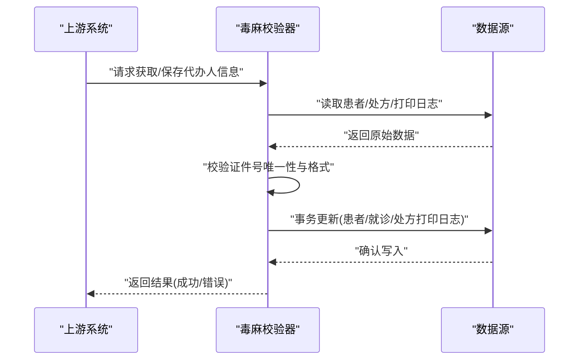
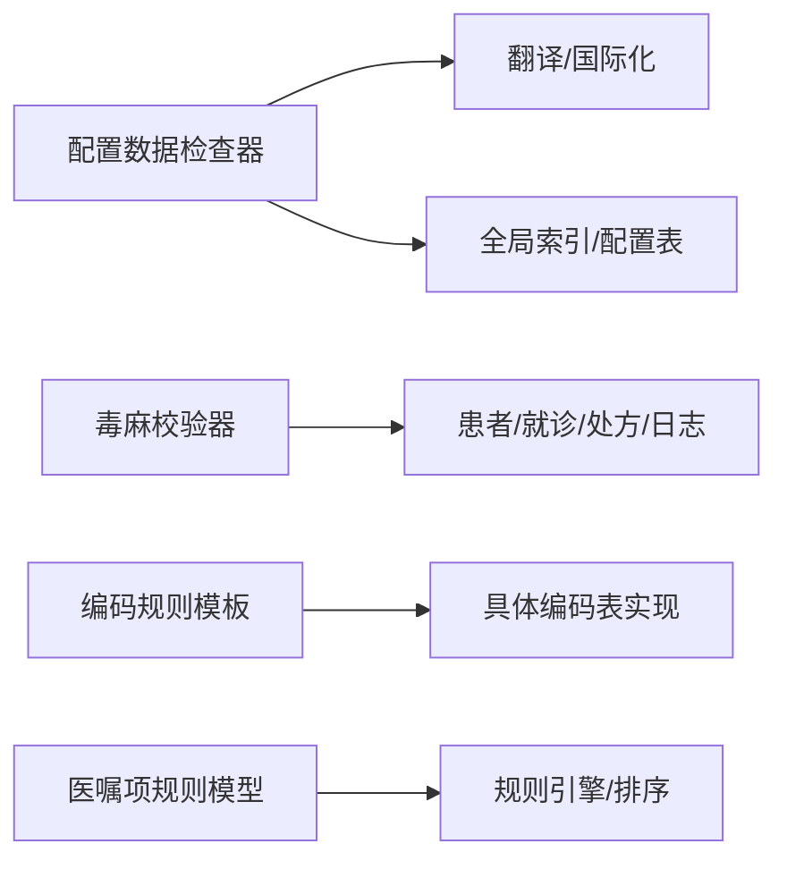

# 数据验证规则

<cite>
**本文引用的文件**
- [DHCDocRegConfigDataCheck.cls](file://src/backend/public-mc/web/DHCDocRegConfigDataCheck.cls)
- [DHCDocCheckPoison.cls](file://src/backend/doc-ws/web/DHCDocCheckPoison.cls)
- [CodeingRule.cls](file://src/backend/public-mc/DHCDoc/GetData/CodeingRule.cls)
- [DHCAppArcRule.cls](file://src/backend/doc-ws/User/DHCAppArcRule.cls)
</cite>

## 目录
1. [简介](#简介)
2. [项目结构](#项目结构)
3. [核心组件](#核心组件)
4. [架构总览](#架构总览)
5. [详细组件分析](#详细组件分析)
6. [依赖关系分析](#依赖关系分析)
7. [性能与并发](#性能与并发)
8. [故障排查指南](#故障排查指南)
9. [结论](#结论)
10. [附录](#附录)

## 简介
本文件面向系统间数据交换场景，定义并沉淀医疗信息系统的数据验证规则与检查机制。内容覆盖：
- 必填字段、数据类型、格式校验与业务规则校验
- 医疗专业数据的特殊校验（如诊断编码、药品相关校验）
- 验证规则的配置方式、动态加载与热更新思路
- 错误分类、错误码与用户友好提示
- 批量验证、性能优化与并行处理策略
- 验证日志、统计分析与合规性报告能力

## 项目结构
围绕数据验证的核心实现主要分布在以下模块：
- 公共配置与通用校验：位于 public-mc/web 下的配置数据检查类，提供对挂号权限、诊室/诊区映射、医嘱标本/接收科室/库存等配置的扫描与校验。
- 毒麻处方与代办人信息校验：位于 doc-ws/web 下，负责毒麻处方的代办人信息获取、保存与打印留痕。
- 编码转换与规则模板：位于 public-mc/DHCDoc/GetData 下，提供基于主键/代码/描述的编码查询方法模板。
- 医嘱项关联规则：位于 doc-ws/User 下，用于维护医嘱项的优先级、分组等规则数据模型。

图表来源
- [DHCDocRegConfigDataCheck.cls:1-526](file://src/backend/public-mc/web/DHCDocRegConfigDataCheck.cls#L1-L526)
- [DHCDocCheckPoison.cls:1-280](file://src/backend/doc-ws/web/DHCDocCheckPoison.cls#L1-L280)
- [CodeingRule.cls:1-78](file://src/backend/public-mc/DHCDoc/GetData/CodeingRule.cls#L1-L78)
- [DHCAppArcRule.cls:1-92](file://src/backend/doc-ws/User/DHCAppArcRule.cls#L1-L92)

章节来源
- [DHCDocRegConfigDataCheck.cls:1-526](file://src/backend/public-mc/web/DHCDocRegConfigDataCheck.cls#L1-L526)
- [DHCDocCheckPoison.cls:1-280](file://src/backend/doc-ws/web/DHCDocCheckPoison.cls#L1-L280)
- [CodeingRule.cls:1-78](file://src/backend/public-mc/DHCDoc/GetData/CodeingRule.cls#L1-L78)
- [DHCAppArcRule.cls:1-92](file://src/backend/doc-ws/User/DHCAppArcRule.cls#L1-L92)

## 核心组件
- 配置数据检查器：提供多项“配置完整性”校验，包括挂号权限、医生号别对照、诊区号别对照、诊室/诊区映射、操作员/诊区映射、医嘱标本/接收科室/库存等。
- 毒麻处方校验器：在毒麻处方场景下，采集并校验代办人身份信息，支持保存、查询与打印留痕。
- 编码规则模板：提供统一的“根据主键/代码/描述”互相查找的方法骨架，便于扩展为具体字典或编码表的校验工具。
- 医嘱项规则模型：以持久化对象形式存储医嘱项的优先级、组号等规则，支撑后续规则引擎或排序逻辑。

章节来源
- [DHCDocRegConfigDataCheck.cls:1-526](file://src/backend/public-mc/web/DHCDocRegConfigDataCheck.cls#L1-L526)
- [DHCDocCheckPoison.cls:1-280](file://src/backend/doc-ws/web/DHCDocCheckPoison.cls#L1-L280)
- [CodeingRule.cls:1-78](file://src/backend/public-mc/DHCDoc/GetData/CodeingRule.cls#L1-L78)
- [DHCAppArcRule.cls:1-92](file://src/backend/doc-ws/User/DHCAppArcRule.cls#L1-L92)

## 架构总览
数据验证在系统间交互中的典型流程如下：
- 上游系统提交数据（如医嘱、诊断、药品、患者信息等）
- 进入统一校验层，执行必填、类型、格式与业务规则校验
- 针对医疗专业数据调用专用校验器（如毒麻处方、编码转换）
- 输出结构化结果（通过/失败+错误明细），供下游消费或回写

图表来源
- [DHCDocRegConfigDataCheck.cls:1-526](file://src/backend/public-mc/web/DHCDocRegConfigDataCheck.cls#L1-L526)
- [DHCDocCheckPoison.cls:1-280](file://src/backend/doc-ws/web/DHCDocCheckPoison.cls#L1-L280)
- [CodeingRule.cls:1-78](file://src/backend/public-mc/DHCDoc/GetData/CodeingRule.cls#L1-L78)

## 详细组件分析

### 配置数据检查器（DHCDocRegConfigDataCheck）
职责
- 扫描并校验关键配置是否完整，保障医嘱、检验、排班等业务流程可正常运行。
- 提供多种查询接口，按医院、时间范围、资源维度进行过滤与汇总。

关键校验点
- 挂号权限与医生号别/诊区号别对照：确保资源具备挂号权限并完成必要对照。
- 诊室/诊区与操作员映射：保证影像/检验等资源可被正确调度。
- 医嘱项标本/接收科室/库存：确保医嘱可执行且具备必要的资源与物流条件。

数据流与输出
- 内部使用临时缓存聚合结果，最终通过查询句柄返回行集。
- 文本消息经翻译函数输出多语言提示。

图表来源
- [DHCDocRegConfigDataCheck.cls:10-127](file://src/backend/public-mc/web/DHCDocRegConfigDataCheck.cls#L10-L127)
- [DHCDocRegConfigDataCheck.cls:134-179](file://src/backend/public-mc/web/DHCDocRegConfigDataCheck.cls#L134-L179)
- [DHCDocRegConfigDataCheck.cls:259-293](file://src/backend/public-mc/web/DHCDocRegConfigDataCheck.cls#L259-L293)
- [DHCDocRegConfigDataCheck.cls:299-333](file://src/backend/public-mc/web/DHCDocRegConfigDataCheck.cls#L299-L333)
- [DHCDocRegConfigDataCheck.cls:452-488](file://src/backend/public-mc/web/DHCDocRegConfigDataCheck.cls#L452-L488)

章节来源
- [DHCDocRegConfigDataCheck.cls:10-127](file://src/backend/public-mc/web/DHCDocRegConfigDataCheck.cls#L10-L127)
- [DHCDocRegConfigDataCheck.cls:134-179](file://src/backend/public-mc/web/DHCDocRegConfigDataCheck.cls#L134-L179)
- [DHCDocRegConfigDataCheck.cls:259-293](file://src/backend/public-mc/web/DHCDocRegConfigDataCheck.cls#L259-L293)
- [DHCDocRegConfigDataCheck.cls:299-333](file://src/backend/public-mc/web/DHCDocRegConfigDataCheck.cls#L299-L333)
- [DHCDocRegConfigDataCheck.cls:452-488](file://src/backend/public-mc/web/DHCDocRegConfigDataCheck.cls#L452-L488)

### 毒麻处方校验器（DHCDocCheckPoison）
职责
- 在毒麻处方场景下，采集并校验代办人身份信息，支持保存与打印留痕。
- 从患者档案、处方、打印日志等多源数据中获取/更新信息。

关键流程
- 获取代办人信息：根据就诊ID与处方号，优先取处方上的代办人信息，否则回退到患者信息。
- 保存代办人信息：事务内更新患者与就诊扩展信息，必要时更新处方打印日志。
- 打印留痕：记录处方号、代办人、打印时间与用户，并标记订单项打印标志。

图表来源
- [DHCDocCheckPoison.cls:9-67](file://src/backend/doc-ws/web/DHCDocCheckPoison.cls#L9-L67)
- [DHCDocCheckPoison.cls:72-182](file://src/backend/doc-ws/web/DHCDocCheckPoison.cls#L72-L182)
- [DHCDocCheckPoison.cls:197-248](file://src/backend/doc-ws/web/DHCDocCheckPoison.cls#L197-L248)

章节来源
- [DHCDocCheckPoison.cls:9-67](file://src/backend/doc-ws/web/DHCDocCheckPoison.cls#L9-L67)
- [DHCDocCheckPoison.cls:72-182](file://src/backend/doc-ws/web/DHCDocCheckPoison.cls#L72-L182)
- [DHCDocCheckPoison.cls:197-248](file://src/backend/doc-ws/web/DHCDocCheckPoison.cls#L197-L248)

### 编码规则模板（CodeingRule）
职责
- 提供统一的“主键/代码/描述”互查方法模板，便于扩展为具体字典或编码表（如ICD、药品编码）的校验工具。

使用建议
- 在具体编码表中实现对应方法，遵循“空值快速返回”的原则，避免无效查询。
- 结合业务上下文进行大小写规范化与去空格处理（可在上层封装）。

章节来源
- [CodeingRule.cls:39-75](file://src/backend/public-mc/DHCDoc/GetData/CodeingRule.cls#L39-L75)

### 医嘱项规则模型（DHCAppArcRule）
职责
- 以持久化对象形式存储医嘱项的优先级、组号等规则，支撑后续规则引擎或排序逻辑。

数据结构要点
- 医嘱项ID、优先级、组号作为核心属性。
- 提供索引映射，便于按医嘱项或组号快速检索。

章节来源
- [DHCAppArcRule.cls:1-92](file://src/backend/doc-ws/User/DHCAppArcRule.cls#L1-L92)

## 依赖关系分析
- 配置数据检查器依赖：
  - 资源/排班/医嘱/库存等全局索引与配置表
  - 翻译与国际化能力（用于输出本地化提示）
- 毒麻校验器依赖：
  - 患者档案、就诊扩展、处方、打印日志等数据源
  - 事务控制与数据一致性保障
- 编码规则模板：
  - 由上层具体编码表实现，提供统一访问契约
- 医嘱项规则模型：
  - 为规则引擎/排序提供基础数据支撑

图表来源
- [DHCDocRegConfigDataCheck.cls:1-526](file://src/backend/public-mc/web/DHCDocRegConfigDataCheck.cls#L1-L526)
- [DHCDocCheckPoison.cls:1-280](file://src/backend/doc-ws/web/DHCDocCheckPoison.cls#L1-L280)
- [CodeingRule.cls:1-78](file://src/backend/public-mc/DHCDoc/GetData/CodeingRule.cls#L1-L78)
- [DHCAppArcRule.cls:1-92](file://src/backend/doc-ws/User/DHCAppArcRule.cls#L1-L92)

章节来源
- [DHCDocRegConfigDataCheck.cls:1-526](file://src/backend/public-mc/web/DHCDocRegConfigDataCheck.cls#L1-L526)
- [DHCDocCheckPoison.cls:1-280](file://src/backend/doc-ws/web/DHCDocCheckPoison.cls#L1-L280)
- [CodeingRule.cls:1-78](file://src/backend/public-mc/DHCDoc/GetData/CodeingRule.cls#L1-L78)
- [DHCAppArcRule.cls:1-92](file://src/backend/doc-ws/User/DHCAppArcRule.cls#L1-L92)

## 性能与并发
- 批量扫描与分页：配置检查器采用查询句柄与临时缓存聚合，适合分批输出，降低内存占用。
- 索引与过滤：通过全局索引与条件过滤减少全表扫描，提升查询效率。
- 事务边界：毒麻校验在关键写入路径使用事务，确保一致性；注意合理拆分事务粒度，避免长事务。
- 并行策略建议：
  - 将不同维度的校验（如权限、映射、库存）拆分为独立任务，并行执行后合并结果。
  - 对大集合数据采用分片处理，结合队列或线程池提高吞吐。
- 缓存与复用：对频繁访问的字典/编码数据建立缓存，减少重复IO。

[本节为通用性能指导，不直接引用具体文件]

## 故障排查指南
常见问题与定位要点
- 配置缺失导致无法开单或执行：
  - 检查挂号权限、医生号别/诊区号别对照、诊室/诊区映射、医嘱标本/接收科室/库存等配置项。
  - 参考配置检查器的输出项，逐项补齐。
- 毒麻处方代办人信息异常：
  - 核对患者证件号唯一性、处方打印日志是否存在、事务是否成功提交。
  - 关注保存与查询路径的分支逻辑，确认数据来源优先级。
- 编码/描述不一致：
  - 使用编码规则模板方法，确认主键/代码/描述三者一致。
  - 在上层增加规范化处理（大小写、去空格、前缀后缀）。

章节来源
- [DHCDocRegConfigDataCheck.cls:10-127](file://src/backend/public-mc/web/DHCDocRegConfigDataCheck.cls#L10-L127)
- [DHCDocRegConfigDataCheck.cls:134-179](file://src/backend/public-mc/web/DHCDocRegConfigDataCheck.cls#L134-L179)
- [DHCDocCheckPoison.cls:72-182](file://src/backend/doc-ws/web/DHCDocCheckPoison.cls#L72-L182)
- [CodeingRule.cls:39-75](file://src/backend/public-mc/DHCDoc/GetData/CodeingRule.cls#L39-L75)

## 结论
本仓库提供了医疗信息系统在系统间数据交换时的关键验证能力：
- 配置完整性校验保障业务流程可运行
- 毒麻处方场景的严格校验与留痕满足合规要求
- 编码规则模板为诊断、药品等专业编码提供统一校验基础
- 医嘱项规则模型为后续规则引擎提供数据支撑

建议在接入侧统一封装校验入口，集中输出结构化错误与提示，并结合日志与报表实现可观测性与合规审计。

[本节为总结性内容，不直接引用具体文件]

## 附录

### 验证规则清单（示例）
- 必填字段校验：患者ID、处方号、医嘱项ID等
- 数据类型校验：日期、数值、枚举等
- 格式校验：身份证号、编码格式（ICD、药品编码等）
- 业务规则校验：权限、映射、库存、时效等

### 错误分类与错误码（建议）
- 配置类错误：权限缺失、映射缺失、模板未配置
- 数据类错误：必填缺失、类型不符、格式非法
- 业务类错误：库存不足、时效过期、冲突规则
- 合规类错误：毒麻处方代办人信息不完整、打印留痕失败

### 配置方法与动态加载（建议）
- 配置存储：将规则以配置表或配置文件形式管理
- 动态加载：服务启动时加载规则，运行时支持热更新（增量刷新）
- 版本控制：规则变更保留历史版本，支持回滚与审计

### 批量验证与并行处理（建议）
- 批处理：按批次切分数据，逐批校验并汇总结果
- 并行：按维度或实体并行执行校验任务，合并结果
- 限流与重试：对下游依赖设置超时与重试策略，避免雪崩

### 日志、统计与合规报告（建议）
- 日志：记录校验输入、规则命中、错误详情与耗时
- 统计：按规则维度统计通过率、失败率、Top错误
- 报告：生成合规性报告，支持导出与审计

[本节为通用指导，不直接引用具体文件]